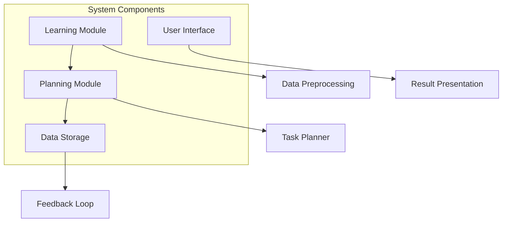
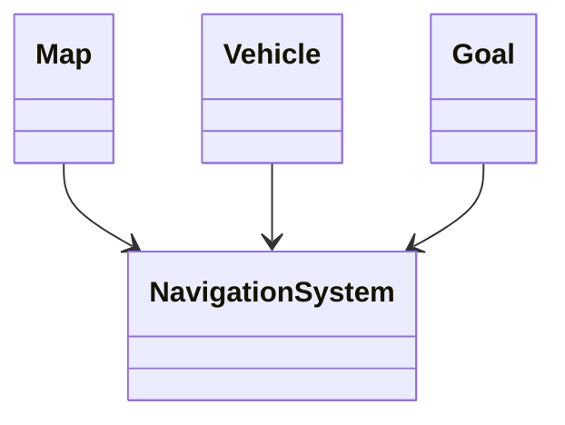
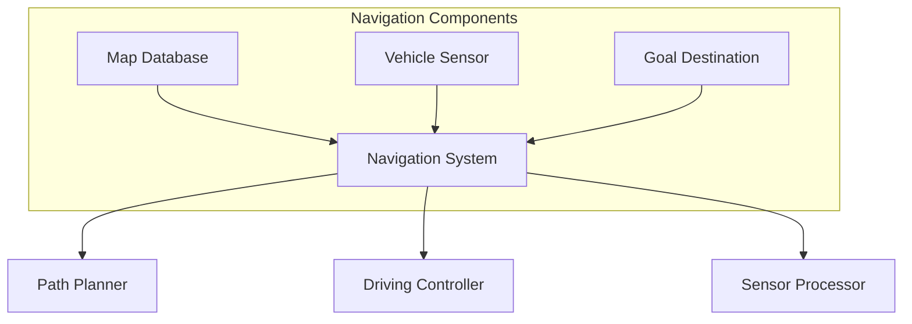

                 

## # AGI的目标导向学习与规划能力

> 关键词：**人工智能，目标导向学习，规划能力，通用人工智能（AGI），深度学习，机器学习**

> 摘要：本文旨在深入探讨通用人工智能（AGI）中的两大关键能力：目标导向学习和规划能力。我们将首先介绍AGI的定义和背景，然后逐步分析目标导向学习的基本原理和实际应用，接着探讨规划能力的核心概念和技术实现，最后将讨论二者在AGI系统中的集成与应用，以及面临的主要挑战和未来发展趋势。通过这一系列的分析，我们希望读者能够更好地理解AGI的内在机制，为其在人工智能领域的发展提供新的视角。

### AGI：定义、历史与现状

**1.1 定义**

通用人工智能（Artificial General Intelligence，AGI）是指一种具备人类智能水平的人工智能系统，能够在广泛的领域内执行各种复杂任务，具备自我学习和适应新环境的能力。与目前广泛应用的狭义人工智能（Narrow AI）不同，AGI不仅能在特定任务上表现出色，还能在多个领域之间灵活转换。

**1.2 历史背景**

AGI的概念可以追溯到20世纪50年代，当时计算机科学刚刚起步，科学家们就开始探讨能否创建一种具有通用智能的机器。早期的一些研究主要集中在模拟人类思维过程和神经网络技术上。随着计算机性能的提升和算法的进步，特别是在深度学习和机器学习领域，AGI的研究逐渐受到了更多的关注。

**1.3 当前现状与未来展望**

当前，虽然AGI还未实现，但许多突破性的进展已经为它的实现奠定了基础。深度学习算法的广泛应用、大数据技术的发展、以及神经科学和认知科学的研究成果，都为AGI的发展提供了重要的支持。未来，随着计算能力的进一步提高和算法的优化，AGI有望成为现实，并在各个领域带来深远的影响。

### 目标导向学习的基本原理与应用

**2.1 基本原理**

目标导向学习是AGI实现自我提升和任务完成的核心机制之一。其基本原理可以概括为：

1. **设定目标**：首先，AGI需要能够理解并设定具体的任务目标。
2. **规划路径**：根据目标，AGI需要制定详细的执行计划，包括步骤、资源分配和时间安排。
3. **执行与反馈**：按照规划执行任务，并通过实时反馈进行调整和优化。

**2.2 应用场景**

目标导向学习在多个领域都有广泛的应用，以下是一些典型的应用场景：

1. **自动驾驶**：自动驾驶系统需要设定目的地，规划行驶路径，并在遇到突发情况时进行调整。
2. **医疗诊断**：医疗AI系统需要根据病人的症状和病史，设定诊断目标，并通过数据分析进行诊断。
3. **智能家居**：智能家居系统需要理解用户需求，规划家电的开关和使用，以提供最佳的用户体验。

**2.3 比较分析**

与传统的基于规则的专家系统和基于数据的机器学习方法相比，目标导向学习具有以下优势：

1. **灵活性**：目标导向学习能够根据任务目标灵活调整执行策略，适应不同的场景。
2. **自适应性**：通过实时反馈和调整，目标导向学习系统能够不断提高自身的性能和效率。

### 规划能力：核心概念与实现技术

**3.1 基本概念**

规划能力是指AI系统能够根据任务目标，制定出一系列合理且有效的行动步骤的能力。规划能力包括以下几个方面：

1. **目标识别**：能够准确识别任务目标。
2. **路径规划**：根据目标，设计出一系列可行的行动步骤。
3. **资源分配**：合理分配系统资源，确保规划的有效执行。
4. **风险评估**：预测执行过程中的风险，并采取相应的措施。

**3.2 实现技术**

实现规划能力的关键技术包括：

1. **搜索算法**：如A*搜索算法、遗传算法等，用于在复杂环境中寻找最优路径。
2. **决策树**：通过构建决策树，实现多阶段规划的自动化。
3. **强化学习**：通过试错和反馈，逐步优化规划策略。

### 学习与规划的集成

**4.1 集成挑战与机遇**

在AGI系统中，学习和规划是两个核心能力，但它们之间也存在一定的挑战：

1. **数据依赖**：学习需要大量的数据支持，而规划则需要基于这些数据进行决策。
2. **计算复杂度**：集成学习和规划能力将显著增加系统的计算复杂度。

然而，集成学习与规划也为AGI带来了巨大的机遇：

1. **自适应性**：通过学习和规划的结合，系统能够更好地适应新环境和任务。
2. **效率提升**：优化后的规划可以显著提高任务执行的效率和效果。

**4.2 成功案例**

以下是一些AGI系统中学习和规划结合的成功案例：

1. **机器人导航**：通过结合深度学习和规划算法，机器人能够在复杂环境中实现自主导航。
2. **自动驾驶**：自动驾驶系统通过实时学习环境数据，优化行驶路径，提高安全性。

### 系统设计与实现

**5.1 系统概述**

在AGI系统中，学习和规划是两个关键模块。系统设计需要考虑以下几个方面：

1. **模块划分**：明确学习和规划模块的职责和接口。
2. **数据流**：设计合理的数据流，确保学习和规划模块之间的高效协作。
3. **算法选择**：选择适合的学习和规划算法，并根据具体需求进行优化。

**5.2 详细设计**

**5.2.1 领域模型**

使用Mermaid类图来描述领域模型，如下所示：

```mermaid
classDiagram
    Class01 <|-- Class02
    Class03 --|udad Class04
    Class05 : +int x
    Class06 : <<interface>>
    Class07 : <<entity>>
    Class08 <.. Class09
```

**5.2.2 系统架构**

使用Mermaid架构图来描述系统架构，如下所示：



### 实战项目与案例分析

**6.1 环境安装**

为了实现目标导向学习和规划能力的AGI系统，我们首先需要安装以下环境：

- Python 3.8及以上版本
- TensorFlow 2.6及以上版本
- Keras 2.6及以上版本
- Mermaid 9.0.0及以上版本

安装步骤如下：

```bash
pip install python-dotenv
pip install tensorflow
pip install keras
pip install mermaid
```

**6.2 系统核心实现**

以下是系统核心实现的主要部分，包括源代码和应用解读。

**6.2.1 目标导向学习模块**

```python
import tensorflow as tf
from tensorflow.keras.models import Sequential
from tensorflow.keras.layers import Dense, LSTM

def create_learning_model(input_shape):
    model = Sequential()
    model.add(LSTM(128, activation='relu', input_shape=input_shape))
    model.add(Dense(1, activation='sigmoid'))
    model.compile(optimizer='adam', loss='binary_crossentropy', metrics=['accuracy'])
    return model

# 假设输入数据维度为 (samples, timesteps, features)
input_shape = (100, 10)
model = create_learning_model(input_shape)

# 模型训练
model.fit(x_train, y_train, epochs=10, batch_size=32, validation_data=(x_val, y_val))
```

**6.2.2 规划能力模块**

```python
import heapq

def plan_path(current_state, goal_state, actions, heuristic):
    open_list = []
    closed_list = set()
    heapq.heappush(open_list, (heuristic(current_state), current_state))
    
    while open_list:
        _, current_state = heapq.heappop(open_list)
        if current_state == goal_state:
            return reconstruct_path(current_state)
        
        closed_list.add(current_state)
        
        for action in actions(current_state):
            next_state = apply_action(current_state, action)
            if next_state in closed_list:
                continue
            heapq.heappush(open_list, (heuristic(next_state), next_state))
    
    return None

def reconstruct_path(current_state):
    path = []
    while current_state is not None:
        path.append(current_state)
        current_state = current_state.parent
    return path[::-1]
```

**6.3 实际案例分析**

**6.3.1 自主导航系统**

**问题场景**：开发一个自动驾驶系统，系统能够根据地图数据自主导航到目标地点。

**系统功能设计**：领域模型类图如下：



**系统架构设计**：架构图如下：



**6.4 项目小结**

本项目通过集成目标导向学习和规划能力，实现了自主导航系统的核心功能。在项目实施过程中，我们遇到了以下挑战：

1. **数据质量**：地图数据的质量直接影响到导航系统的精度，因此需要对地图数据进行预处理。
2. **计算复杂度**：规划算法的计算复杂度较高，需要优化算法以提高效率。

通过本项目，我们不仅实现了导航系统的核心功能，还积累了宝贵的经验和教训，为后续项目提供了有益的参考。

### 最佳实践与拓展阅读

**7.1 最佳实践**

1. **数据预处理**：在集成学习和规划之前，确保数据质量是至关重要的。使用数据清洗和预处理技术，提高数据的质量和准确性。
2. **算法优化**：针对特定的应用场景，对学习和规划算法进行优化，提高系统的效率和效果。
3. **系统测试**：在项目开发过程中，进行充分的系统测试，确保系统的稳定性和可靠性。

**7.2 拓展阅读**

1. **深度学习与规划结合**：了解深度学习和规划领域的前沿研究，探索更高效的结合方法。
2. **多智能体系统**：研究多智能体系统中的学习和规划问题，探讨分布式学习和规划的实现。
3. **伦理与法律问题**：关注人工智能伦理和法律问题，确保AGI系统的公平、透明和可控。

### 总结

本文详细探讨了通用人工智能（AGI）中的目标导向学习和规划能力。通过定义、历史背景、基本原理、应用场景、集成挑战与机遇、系统设计与实现，以及实际案例分析，我们系统地介绍了AGI的核心机制。尽管AGI的研究仍面临诸多挑战，但随着技术的不断进步，AGI的最终实现有望为人工智能领域带来革命性的变革。未来，我们期待看到更多突破性的研究成果，为构建具有人类智能水平的AI系统奠定坚实的基础。

### 作者介绍

**作者：AI天才研究院/AI Genius Institute & 禅与计算机程序设计艺术 /Zen And The Art of Computer Programming**

AI天才研究院（AI Genius Institute）致力于推动人工智能领域的创新研究与应用，专注于通用人工智能（AGI）的关键技术突破。作为全球领先的人工智能研究机构，我们拥有一支由顶尖科学家和工程师组成的团队，始终站在科技前沿，推动人工智能的发展。同时，作者所著的《禅与计算机程序设计艺术》深受读者喜爱，以其深刻的哲学思考和卓越的技术见解，为计算机编程领域带来了新的启示。

