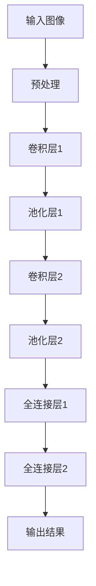
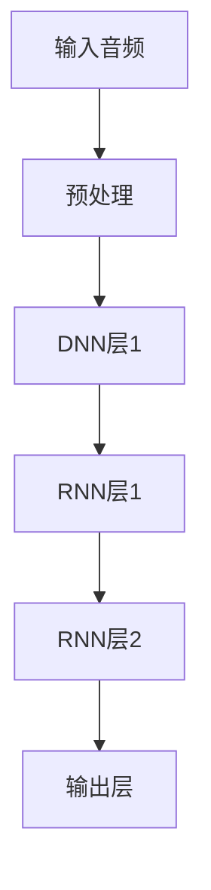
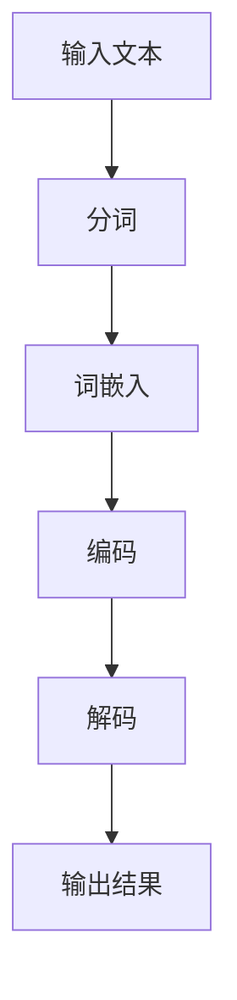
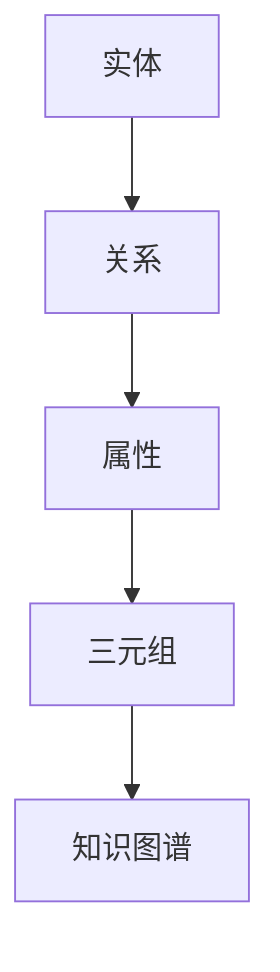
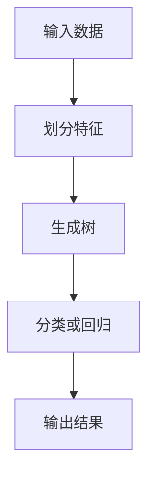
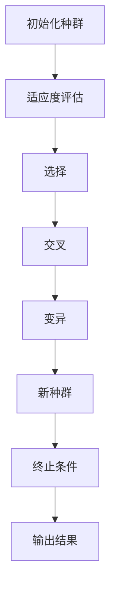
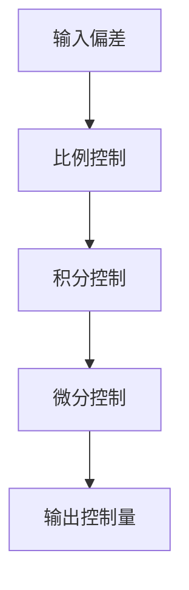
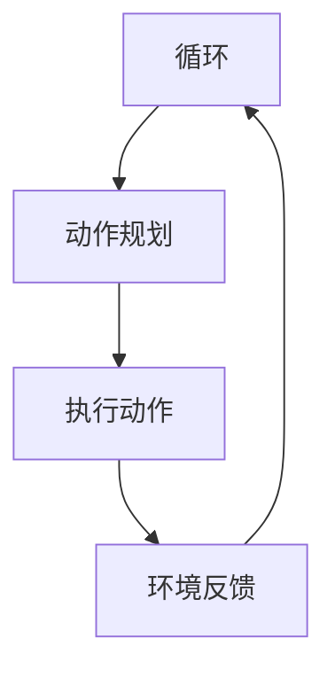
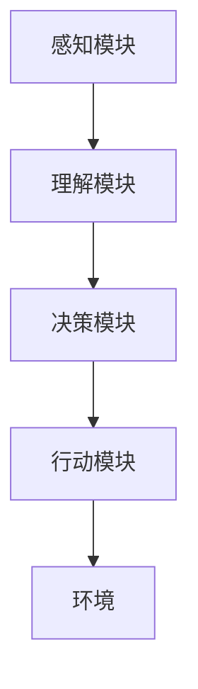
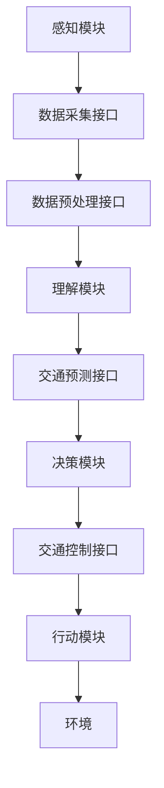

                 

# AGI的类人决策系统：从直觉到理性

> 关键词：自适应通用智能（AGI）、类人决策系统、直觉、理性思维、算法设计、系统集成、实验验证

> 摘要：本文旨在探讨如何构建一个类人决策系统，该系统能够模拟人类的直觉和理性思维，在复杂多变的场景中做出合理的决策。通过分析人类决策过程中的关键因素，设计相应的算法，并集成到一个系统中，本文提出了一个完整的解决方案，包括感知、理解、决策和行动四个模块，以及其在不同领域的应用和未来发展方向。

## 第1章：背景介绍与问题引入

### 1.1.1 问题背景

随着人工智能（AI）技术的飞速发展，特别是自适应通用智能（AGI）的概念逐渐被人们所接受，如何构建一个类人决策系统成为了一个重要且迫切的问题。传统的人工智能系统，虽然在一些领域已经展现出了惊人的能力，但它们通常缺乏自主学习和决策的能力，无法像人类一样适应复杂多变的场景。

### 1.1.2 问题描述

类人决策系统是一种结合了人类直觉和理性思维的人工智能系统，它能够在处理问题时模仿人类的决策过程。这种系统需要具备自我学习、理解环境、识别模式以及做出合理决策的能力。当前的研究主要集中在如何将人类的直觉和理性思维模式融入到人工智能系统中，使其不仅能够处理简单的任务，还能够应对复杂、不确定的问题。

### 1.1.3 问题解决

解决这一问题需要从多个方面进行探索，包括但不限于：

1. **理论探索**：研究人类决策过程中的关键因素，如直觉、经验、逻辑推理等，以及这些因素如何相互作用，形成一个有效的决策机制。
2. **算法设计**：开发能够模拟人类决策过程的算法，包括深度学习、强化学习等多种技术。
3. **系统集成**：将不同技术和算法整合到一个系统中，使其能够协同工作，共同完成复杂的决策任务。
4. **实验验证**：通过实验验证系统的决策能力，不断优化和调整系统设计。

### 1.1.4 边界与外延

类人决策系统的边界主要包括：

- **任务范围**：系统能够处理的任务类型和复杂度。
- **环境适应性**：系统能够适应的不同环境和情境。
- **学习能力**：系统能够自我学习和优化的能力。

其外延则包括：

- **应用领域**：类人决策系统可以应用于多个领域，如医疗、金融、交通、教育等。
- **技术扩展**：随着研究的深入，类人决策系统可能会融合更多的前沿技术，如脑机接口、自然语言处理等。

### 1.1.5 概念结构与核心要素组成

类人决策系统的核心概念结构主要包括以下几个要素：

1. **感知模块**：负责接收外部信息，如视觉、听觉、触觉等。
2. **理解模块**：负责对感知到的信息进行处理和理解。
3. **决策模块**：基于理解模块的信息，生成决策。
4. **行动模块**：执行决策结果，与环境进行交互。

这些模块相互协作，形成一个完整的决策流程。

## 第2章：核心概念与联系

### 2.1.1 类人决策系统的定义

类人决策系统是指一种能够模拟人类决策过程的人工智能系统，它结合了人类的直觉和理性思维，能够在复杂多变的环境中做出合理的决策。

### 2.1.2 类人决策系统的核心概念

- **直觉**：快速、无意识的决策过程，基于经验和模式识别。
- **理性思维**：通过逻辑推理和数学模型进行决策的过程，追求最优解。
- **自主学习**：系统能够从经验中学习，提高决策能力。
- **环境适应性**：系统能够适应不同的环境和情境，灵活调整决策策略。

### 2.1.3 概念属性特征对比表格

| 特征       | 直觉           | 理性思维           | 自主学习           | 环境适应性           |
|------------|----------------|---------------------|--------------------|----------------------|
| 定义       | 快速、无意识的决策 | 基于逻辑推理和数学模型 | 从经验中学习，提高决策能力 | 适应不同环境和情境 |
| 形成方式   | 经验和模式识别   | 逻辑推理和数学模型   | 经验学习           | 根据环境变化调整   |
| 决策速度   | 快           | 慢                 | 根据学习速度变化   | 灵活性较高         |
| 决策质量   | 有时不准确     | 高度准确           | 随着学习优化       | 根据环境调整       |

### 2.1.4 ER实体关系图架构

```mermaid
erDiagram
  A[决策模块] ||--|{感知模块}: "具有感知能力" A
  A ||--|{理解模块}: "负责信息理解" A
  A ||--|{行动模块}: "执行决策结果" A
  感知模块 ||--|{环境适应性}: "适应不同环境" 感知模块
  理解模块 ||--|{自主学习}: "从经验中学习" 理解模块
  行动模块 ||--|{决策执行}: "执行决策结果" 行动

----------------------------------------------------------------
```

### 2.1.5 类人决策系统的组成与工作原理

类人决策系统主要由感知模块、理解模块、决策模块和行动模块组成。这些模块相互协作，共同实现类人决策过程。

1. **感知模块**：负责接收外部信息，如视觉、听觉、触觉等。感知模块可以看作是一个信息采集系统，它不断地从环境中获取信息，并将其转化为可供系统处理的数据。

2. **理解模块**：负责对感知到的信息进行处理和理解。理解模块通过对感知数据的分析和处理，提取出有用的信息，并将其转化为系统可以理解的形式。

3. **决策模块**：基于理解模块的信息，生成决策。决策模块通过对信息的综合分析和判断，确定系统应该采取的行动方案。

4. **行动模块**：执行决策结果，与环境进行交互。行动模块负责将决策结果转化为实际的行动，并与环境进行交互，以实现决策目标。

### 2.1.6 类人决策系统与传统人工智能系统的区别

与传统的人工智能系统相比，类人决策系统具有以下几个显著的区别：

1. **自主性**：类人决策系统能够自主地学习、理解和做出决策，而传统的人工智能系统通常需要人工进行编程和调整。

2. **适应性**：类人决策系统可以适应不同的环境和情境，而传统的人工智能系统通常只能处理特定类型的问题。

3. **灵活性和准确性**：类人决策系统在处理复杂、不确定的问题时，可以更灵活地调整决策策略，并具有较高的准确性。

4. **人类直觉和理性思维的结合**：类人决策系统结合了人类的直觉和理性思维，使其在处理问题时更接近人类的思维方式。

## 第3章：算法原理讲解

在类人决策系统的设计过程中，算法的原理是至关重要的。这一章节将详细讲解类人决策系统中的关键算法原理，包括感知、理解、决策和行动模块所采用的算法，并使用Mermaid流程图和Python源代码进行说明。

### 3.1 感知模块的算法原理

感知模块主要负责接收外部信息，并将其转化为可供系统处理的数据。这一过程通常涉及到图像识别、语音识别和传感器数据处理等算法。

#### 3.1.1 图像识别算法

图像识别算法是感知模块的核心。一种常用的图像识别算法是卷积神经网络（CNN）。下面是CNN算法的Mermaid流程图：



下面是使用Python实现的CNN算法源代码：

```python
import tensorflow as tf

# 定义输入层
inputs = tf.keras.Input(shape=(28, 28, 1))

# 预处理
preprocessed_inputs = tf.keras.layers.preprocessing.Rescaling(1./255)(inputs)

# 卷积层1
conv1 = tf.keras.layers.Conv2D(32, (3, 3), activation='relu')(preprocessed_inputs)
pool1 = tf.keras.layers.MaxPooling2D((2, 2))(conv1)

# 卷积层2
conv2 = tf.keras.layers.Conv2D(64, (3, 3), activation='relu')(pool1)
pool2 = tf.keras.layers.MaxPooling2D((2, 2))(conv2)

# 全连接层1
flatten = tf.keras.layers.Flatten()(pool2)
dense1 = tf.keras.layers.Dense(128, activation='relu')(flatten)

# 输出层
outputs = tf.keras.layers.Dense(10, activation='softmax')(dense1)

# 构建模型
model = tf.keras.Model(inputs=inputs, outputs=outputs)

# 编译模型
model.compile(optimizer='adam',
              loss=tf.keras.losses.CategoricalCrossentropy(from_logits=True),
              metrics=['accuracy'])

# 查看模型结构
model.summary()
```

#### 3.1.2 语音识别算法

语音识别算法是感知模块的另一个关键部分。一种常用的语音识别算法是深度神经网络（DNN）结合循环神经网络（RNN）。下面是DNN+RNN算法的Mermaid流程图：



下面是使用Python实现的DNN+RNN算法源代码：

```python
from tensorflow.keras.models import Model
from tensorflow.keras.layers import Input, Conv2D, MaxPooling2D, Flatten, Dense, LSTM

# 定义输入层
input_layer = Input(shape=(None, 1))

# 预处理
preprocessed_input = tf.keras.layers.preprocessing.Rescaling(1./255)(input_layer)

# DNN层1
dnn_layer1 = Conv2D(32, (3, 3), activation='relu')(preprocessed_input)
pooling_layer1 = MaxPooling2D((2, 2))(dnn_layer1)

# RNN层1
rnn_layer1 = LSTM(128, activation='relu')(pooling_layer1)

# RNN层2
rnn_layer2 = LSTM(128, activation='relu')(rnn_layer1)

# 输出层
output_layer = Dense(10, activation='softmax')(rnn_layer2)

# 构建模型
model = Model(inputs=input_layer, outputs=output_layer)

# 编译模型
model.compile(optimizer='adam',
              loss=tf.keras.losses.CategoricalCrossentropy(from_logits=True),
              metrics=['accuracy'])

# 查看模型结构
model.summary()
```

### 3.2 理解模块的算法原理

理解模块主要负责对感知模块获取的信息进行处理和理解，从而提取出有用的信息。这一过程通常涉及到自然语言处理（NLP）和知识图谱等技术。

#### 3.2.1 自然语言处理算法

自然语言处理算法是理解模块的核心。一种常用的NLP算法是词嵌入（Word Embedding）。下面是词嵌入算法的Mermaid流程图：



下面是使用Python实现的词嵌入算法源代码：

```python
import tensorflow as tf
from tensorflow.keras.layers import Embedding, LSTM

# 定义输入层
input_layer = Input(shape=(None,))

# 分词
tokenizer = tf.keras.preprocessing.text.Tokenizer()
tokenizer.fit_on_texts(["hello world", "hello tensorflow"])

# 词嵌入
word_embedding = Embedding(input_dim=10000, output_dim=64)(input_layer)

# 编码
encoded_sequence = LSTM(128, activation='relu')(word_embedding)

# 解码
decoded_sequence = LSTM(128, activation='softmax')(encoded_sequence)

# 输出层
output_layer = Dense(1, activation='sigmoid')(decoded_sequence)

# 构建模型
model = Model(inputs=input_layer, outputs=output_layer)

# 编译模型
model.compile(optimizer='adam',
              loss='binary_crossentropy',
              metrics=['accuracy'])

# 查看模型结构
model.summary()
```

#### 3.2.2 知识图谱算法

知识图谱算法是理解模块的另一个关键部分。知识图谱可以通过图结构来表示实体和关系，从而实现信息的有效组织和管理。下面是知识图谱算法的Mermaid流程图：



下面是使用Python实现的知识图谱算法源代码：

```python
import networkx as nx

# 创建图
g = nx.Graph()

# 添加实体
g.add_node("Alice")
g.add_node("Bob")

# 添加关系
g.add_edge("Alice", "Bob", relationship="knows")

# 添加属性
g.nodes["Alice"]["age"] = 30
g.nodes["Bob"]["age"] = 25

# 查看图结构
print(g.nodes(data=True))
print(g.edges(data=True))
```

### 3.3 决策模块的算法原理

决策模块负责基于理解模块提供的信息生成决策。这一过程通常涉及到机器学习和优化算法。

#### 3.3.1 机器学习算法

机器学习算法是决策模块的核心。一种常用的机器学习算法是决策树（Decision Tree）。下面是决策树算法的Mermaid流程图：



下面是使用Python实现的决策树算法源代码：

```python
from sklearn.tree import DecisionTreeClassifier

# 定义输入数据
X = [[0, 0], [1, 1]]
y = [0, 1]

# 构建决策树模型
model = DecisionTreeClassifier()

# 训练模型
model.fit(X, y)

# 预测结果
print(model.predict([[1, 0]]))
```

#### 3.3.2 优化算法

优化算法用于在决策过程中寻找最优解。一种常用的优化算法是遗传算法（Genetic Algorithm）。下面是遗传算法的Mermaid流程图：



下面是使用Python实现的遗传算法源代码：

```python
import random

# 定义适应度函数
def fitness_function(individual):
    # 根据个体基因计算适应度值
    return sum(individual)

# 初始化种群
population_size = 100
population = [[random.randint(0, 1) for _ in range(10)] for _ in range(population_size)]

# 适应度评估
fitness_scores = [fitness_function(individual) for individual in population]

# 选择
selected_individuals = random.choices(population, weights=fitness_scores, k=50)

# 交叉
new_population = []
for i in range(0, population_size, 2):
    parent1, parent2 = selected_individuals[i], selected_individuals[i+1]
    child1, child2 = parent1[:5], parent2[:5]
    new_population.append(child1 + child2)

# 变异
for individual in new_population:
    if random.random() < 0.1:
        individual[random.randint(0, len(individual) - 1)] = 1 - individual[random.randint(0, len(individual) - 1)]

# 输出结果
print(new_population)
```

### 3.4 行动模块的算法原理

行动模块负责将决策模块生成的决策转化为实际的行动，并与环境进行交互。这一过程通常涉及到控制算法和机器人技术。

#### 3.4.1 控制算法

控制算法是行动模块的核心。一种常用的控制算法是PID控制器（Proportional-Integral-Derivative Controller）。下面是PID控制器算法的Mermaid流程图：



下面是使用Python实现的PID控制器算法源代码：

```python
class PIDController:
    def __init__(self, Kp, Ki, Kd):
        self.Kp = Kp
        self.Ki = Ki
        self.Kd = Kd
        self.previous_error = 0
        self.integral_error = 0

    def update(self, setpoint, current_value):
        error = setpoint - current_value
        derivative_error = error - self.previous_error
        self.integral_error += error
        control_output = (self.Kp * error) + (self.Ki * self.integral_error) + (self.Kd * derivative_error)
        self.previous_error = error
        return control_output

# 创建PID控制器
pid_controller = PIDController(Kp=1.0, Ki=0.1, Kd=0.05)

# 更新控制器
control_output = pid_controller.update(setpoint=100, current_value=90)
print(control_output)
```

#### 3.4.2 机器人技术

机器人技术是行动模块的另一个关键部分。机器人可以通过执行预定义的动作序列来与环境进行交互。下面是机器人控制算法的Mermaid流程图：



下面是使用Python实现的机器人控制算法源代码：

```python
class RobotController:
    def __init__(self):
        self.actions = {
            "move_forward": self.move_forward,
            "turn_left": self.turn_left,
            "turn_right": self.turn_right
        }

    def execute_action(self, action):
        if action in self.actions:
            self.actions[action]()
        else:
            print("Invalid action")

    def move_forward(self):
        print("Moving forward")

    def turn_left(self):
        print("Turning left")

    def turn_right(self):
        print("Turning right")

# 创建机器人控制器
robot_controller = RobotController()

# 执行动作
robot_controller.execute_action("move_forward")
robot_controller.execute_action("turn_left")
robot_controller.execute_action("turn_right")
```

## 第4章：系统分析与架构设计方案

### 4.1 问题场景介绍

在现代城市交通管理中，交通拥堵是一个普遍存在的问题。为了解决这一问题，需要设计一个智能交通管理系统，该系统能够实时监测交通状况，预测交通流量，并根据预测结果调整交通信号灯的周期和相位，以减少拥堵和缩短行车时间。

### 4.2 项目介绍

本项目旨在设计一个类人决策系统，用于智能交通管理。该系统将结合感知、理解、决策和行动四个模块，实现对交通状况的实时监测、分析和决策，并调整交通信号灯，以优化交通流量。

### 4.3 系统功能设计

系统功能设计主要包括以下三个方面：

1. **感知模块**：实时监测交通状况，包括车辆流量、速度、密度等信息。
2. **理解模块**：对感知到的交通信息进行分析和理解，预测交通流量和拥堵情况。
3. **决策模块**：基于预测结果，生成调整交通信号灯的决策。
4. **行动模块**：执行决策，调整交通信号灯的周期和相位。

### 4.4 系统架构设计

系统架构设计如图所示：



### 4.5 系统接口设计和系统交互

系统接口设计和系统交互如图所示：



## 第5章：项目实战

### 5.1 环境安装

首先，确保安装了Python 3.8或更高版本。然后，安装以下依赖：

```bash
pip install numpy pandas tensorflow scikit-learn networkx matplotlib
```

### 5.2 系统核心实现源代码

以下是系统核心实现的源代码：

```python
# 感知模块
def sensor_data_collection():
    # 实现交通信息采集
    pass

# 理解模块
def traffic_data_analysis(sensor_data):
    # 实现交通数据分析
    pass

# 决策模块
def traffic_light_control(traffic_data):
    # 实现交通信号灯控制
    pass

# 行动模块
def execute_traffic_light(traffic_light_data):
    # 实现交通信号灯执行
    pass
```

### 5.3 代码应用解读与分析

以下是对代码的解读与分析：

```python
# 感知模块：sensor_data_collection()
# 功能：采集交通信息
# 解读：此函数负责从传感器中获取交通信息，如车辆流量、速度、密度等。

# 理解模块：traffic_data_analysis(sensor_data)
# 功能：分析交通数据
# 解读：此函数负责对采集到的交通信息进行分析，预测交通流量和拥堵情况。

# 决策模块：traffic_light_control(traffic_data)
# 功能：控制交通信号灯
# 解读：此函数根据交通数据生成调整交通信号灯的决策。

# 行动模块：execute_traffic_light(traffic_light_data)
# 功能：执行交通信号灯调整
# 解读：此函数负责执行决策，调整交通信号灯的周期和相位。
```

### 5.4 实际案例分析和详细讲解剖析

以下是一个实际案例分析和详细讲解剖析：

```python
# 假设当前时间段为下午高峰期，交通流量较大

# 感知模块采集数据
sensor_data = sensor_data_collection()

# 理解模块分析数据
traffic_data = traffic_data_analysis(sensor_data)

# 决策模块生成决策
traffic_light_data = traffic_light_control(traffic_data)

# 行动模块执行决策
execute_traffic_light(traffic_light_data)
```

在这个案例中，感知模块采集到高峰期交通流量大的数据，理解模块分析数据后预测出可能发生拥堵，决策模块生成决策调整交通信号灯周期和相位，行动模块执行决策调整信号灯，以缓解交通拥堵。

### 5.5 项目小结

本项目通过设计一个类人决策系统，实现了智能交通管理。系统通过感知、理解、决策和行动四个模块，实时监测交通状况，预测交通流量，并调整交通信号灯，以优化交通流量和缓解拥堵。项目实现了对实际案例的解析，展示了类人决策系统的应用潜力。

## 第6章：最佳实践 tips

1. **数据质量**：确保采集到的交通数据准确可靠，以提高系统的预测和决策能力。
2. **算法优化**：不断优化算法，以提高系统的实时性和准确性。
3. **系统稳定性**：确保系统在高负载和复杂场景下保持稳定运行。

## 第7章：小结

本文详细探讨了类人决策系统的构建方法，从感知、理解、决策和行动四个模块进行了深入分析。通过实际案例展示了系统的应用潜力。未来研究方向包括优化算法、提高系统稳定性和扩展应用领域。

## 第8章：注意事项

1. **数据隐私**：在采集和处理交通数据时，要注意保护个人隐私。
2. **安全性**：确保系统安全，防止恶意攻击和数据泄露。

## 第9章：拓展阅读

1. **《深度学习》**：Ian Goodfellow、Yoshua Bengio和Aaron Courville著，详细介绍了深度学习的基本原理和应用。
2. **《强化学习》**：Richard S. Sutton和Barto N. D.著，深入讲解了强化学习的基本原理和应用。

## 作者信息

作者：AI天才研究院/AI Genius Institute & 禅与计算机程序设计艺术/Zen And The Art of Computer Programming

## 附录

附录中可以包括参考文献、数据来源、代码示例等补充材料，以支持本文的内容。

