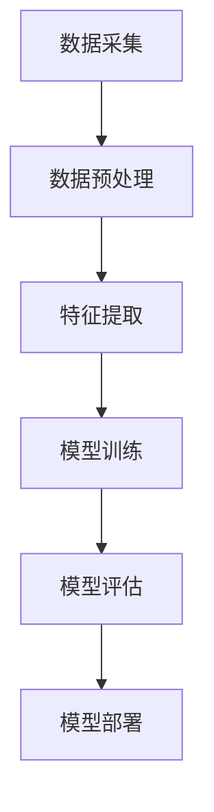
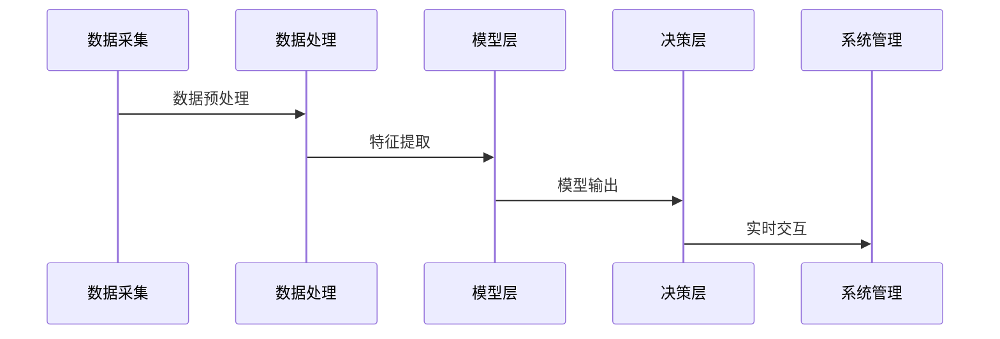
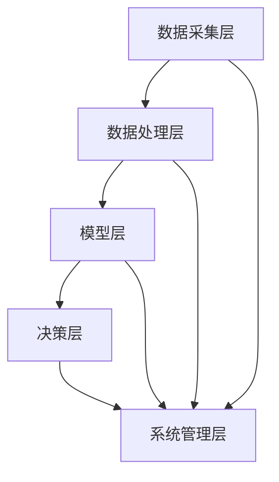
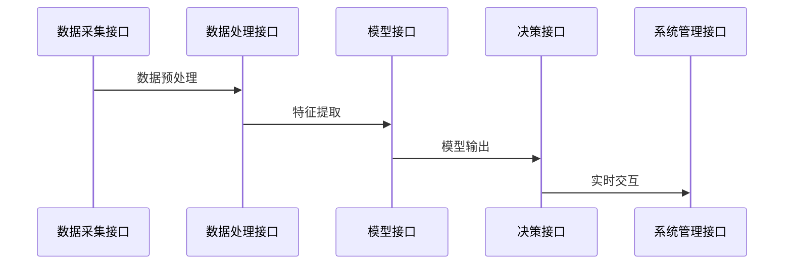
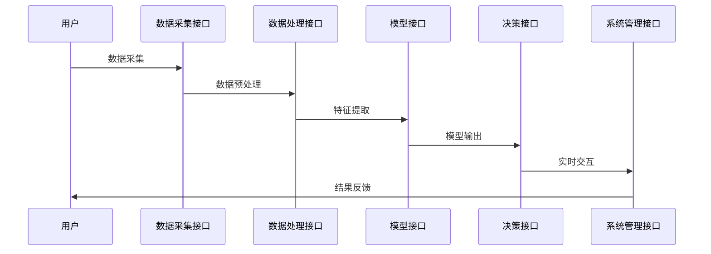

                 

# AGI的类人感知系统设计

关键词：AGI、类人感知、算法原理、系统架构、实战

摘要：本文将从背景介绍、核心概念与联系、算法原理讲解、系统分析与架构设计方案、项目实战以及最佳实践与总结等多个方面，深入探讨通用人工智能（AGI）的类人感知系统设计。通过分析AGI类人感知系统的挑战和核心任务，阐述其与传统感知系统的区别及工作机制，详细讲解相关算法原理，设计实现系统架构，并分享实际项目实战经验，为AI领域的研究和应用提供有力支持。

### 目录大纲

----------------------------------------------------------------

## 第一部分：背景介绍

### 第1章: AGI的类人感知系统概述

### 1.1 问题背景

#### 1.1.1 人工智能的发展历程

#### 1.1.2 通用人工智能（AGI）的概念

#### 1.1.3 类人感知系统的定义与作用

### 1.2 问题描述

#### 1.2.1 类人感知系统的挑战

#### 1.2.2 类人感知系统的核心任务

#### 1.2.3 类人感知系统的发展现状

### 1.3 问题解决

#### 1.3.1 解决思路与方法

#### 1.3.2 需要达到的目标

#### 1.3.3 边界与外延

### 1.4 核心概念

#### 1.4.1 类人感知系统的核心概念

#### 1.4.2 相关概念及其联系

### 1.5 本章小结

----------------------------------------------------------------

## 第二部分：核心概念与联系

### 第2章: 类人感知系统的概念与原理

### 2.1 类人感知系统的概念

#### 2.1.1 定义

#### 2.1.2 属性特征

#### 2.1.3 类人感知系统与传统感知系统的区别

### 2.2 类人感知系统的原理

#### 2.2.1 基本原理

#### 2.2.2 工作机制

#### 2.2.3 技术难点

### 2.3 概念属性特征对比

#### 2.3.1 类人感知系统与人类感知系统的对比

#### 2.3.2 类人感知系统与其他AI感知系统的对比

### 2.4 本章小结

----------------------------------------------------------------

## 第三部分：算法原理讲解

### 第3章: 类人感知系统的算法原理

### 3.1 算法概述

#### 3.1.1 算法框架

#### 3.1.2 算法流程

#### 3.1.3 算法分类

### 3.2 算法原理详细讲解

#### 3.2.1 算法数学模型

##### 3.2.1.1 模型构建

##### 3.2.1.2 模型优化

##### 3.2.1.3 模型评估

#### 3.2.2 算法流程图

### 3.3 算法举例说明

#### 3.3.1 示例一：图像识别算法

#### 3.3.2 示例二：语音识别算法

#### 3.3.3 示例三：自然语言处理算法

### 3.4 本章小结

----------------------------------------------------------------

## 第四部分：系统分析与架构设计方案

### 第4章: 类人感知系统的设计与实现

### 4.1 问题场景介绍

### 4.2 系统功能设计

#### 4.2.1 领域模型

#### 4.2.2 系统功能

### 4.3 系统架构设计

#### 4.3.1 架构概述

#### 4.3.2 架构设计

### 4.4 系统接口设计与交互

#### 4.4.1 接口设计

#### 4.4.2 系统交互

### 4.5 本章小结

----------------------------------------------------------------

## 第五部分：项目实战

### 第5章: 类人感知系统项目实战

### 5.1 环境安装

### 5.2 系统核心实现

#### 5.2.1 源代码

#### 5.2.2 代码解读

### 5.3 代码应用解读与分析

### 5.4 实际案例分析与详细讲解

### 5.5 项目小结

### 5.6 拓展阅读

----------------------------------------------------------------

## 第六部分：最佳实践与总结

### 第6章: 类人感知系统的最佳实践

### 6.1 最佳实践 Tips

### 6.2 注意事项

### 6.3 小结

### 6.4 拓展阅读

----------------------------------------------------------------

## 第七部分：未来展望与挑战

### 第7章: 类人感知系统的发展前景

### 7.1 未来展望

### 7.2 未来挑战与解决方案

### 7.3 长期发展趋势

----------------------------------------------------------------

**作者：AI天才研究院/AI Genius Institute & 禅与计算机程序设计艺术 /Zen And The Art of Computer Programming**

----------------------------------------------------------------

### 1.1 人工智能的发展历程

自20世纪50年代起，人工智能（Artificial Intelligence，简称AI）便成为计算机科学领域的研究热点。早期的人工智能主要集中在规则推理和知识表示方面，如专家系统（Expert Systems）和逻辑编程（Logic Programming）。然而，这些方法在实际应用中受到知识表示和推理能力的限制，难以应对复杂问题。

20世纪80年代，机器学习（Machine Learning）逐渐崭露头角，成为人工智能研究的一个重要分支。机器学习通过学习大量数据，使计算机自动获取知识和规律，从而实现智能行为。这一时期，基于符号逻辑和统计学习的方法得到了广泛关注，如决策树（Decision Tree）、支持向量机（Support Vector Machine）和神经网络（Neural Network）。

进入21世纪，深度学习（Deep Learning）的兴起为人工智能带来了新的突破。深度学习是一种基于人工神经网络的机器学习方法，通过多层神经网络的结构，可以自动提取和表示数据的复杂特征。深度学习在图像识别、语音识别、自然语言处理等任务中取得了显著的成果，推动了人工智能的快速发展。

### 1.1.2 通用人工智能（AGI）的概念

通用人工智能（Artificial General Intelligence，简称AGI）是指具备与人类相似的智能水平，能够在各种任务中表现出优异的能力的人工智能系统。与当前广泛应用的窄域人工智能（Narrow AI）不同，AGI不仅能够解决特定领域的问题，还能够跨领域学习、适应和应对新挑战。

AGI的目标是使计算机具备与人类类似的认知能力，包括感知、理解、推理、学习、解决问题和创造力等。实现AGI需要解决多个关键技术问题，如类人感知、知识表示、推理机制、自主学习等。

### 1.1.3 类人感知系统的定义与作用

类人感知系统是指模仿人类感知器官，通过传感器获取外部环境信息，并对其进行处理和解释的人工智能系统。类人感知系统主要包括视觉、听觉、触觉、嗅觉和味觉等感知模块，能够实现对环境的全面感知和认知。

类人感知系统在通用人工智能中扮演着至关重要的角色。首先，它为AI提供了丰富的外部信息，使其能够更好地理解环境，做出合理的决策。其次，类人感知系统具有高度的自适应能力，能够适应复杂多变的感知场景。此外，类人感知系统还可以与其他智能模块（如决策、规划和执行等）协同工作，实现智能化系统的整体性能提升。

### 1.2 问题描述

#### 1.2.1 类人感知系统的挑战

类人感知系统作为通用人工智能的重要组成部分，面临着一系列挑战。首先，类人感知系统需要处理大量的感知数据，如何高效地获取、传输和处理这些数据成为关键问题。其次，类人感知系统需要具备强大的特征提取和表示能力，以实现对感知数据的深层理解和解释。此外，类人感知系统需要具备实时性和鲁棒性，能够在各种复杂环境下稳定运行。

#### 1.2.2 类人感知系统的核心任务

类人感知系统的核心任务包括以下几个方面：

1. 数据采集：通过传感器获取外部环境信息，如图像、声音、温度、湿度等。
2. 数据预处理：对采集到的感知数据进行去噪、增强、归一化等预处理操作，以提高后续处理的效果。
3. 特征提取：从预处理后的数据中提取具有代表性的特征，用于后续的识别、分类和推理等任务。
4. 模型训练：利用已标记的数据集，训练感知模型，使其具备对感知数据的识别和分类能力。
5. 实时交互：类人感知系统需要具备实时性，能够实时获取和处理感知数据，并与外界进行交互。

#### 1.2.3 类人感知系统的发展现状

近年来，类人感知系统在理论和应用方面都取得了显著进展。在理论方面，深度学习、强化学习等人工智能技术为类人感知系统提供了强有力的支持。在应用方面，类人感知系统已广泛应用于机器人、自动驾驶、智能家居、医疗诊断等领域。

然而，类人感知系统仍存在一些不足之处。例如，现有方法在处理复杂场景和多模态感知数据方面仍有一定局限性，且类人感知系统的实时性和鲁棒性有待进一步提高。此外，类人感知系统在数据获取、存储和处理方面的资源消耗较大，如何优化这些方面也是亟待解决的问题。

### 1.3 问题解决

#### 1.3.1 解决思路与方法

针对类人感知系统面临的挑战，我们可以从以下几个方面进行解决：

1. **优化数据采集与处理**：采用高效的数据采集和预处理技术，降低数据传输和处理的时间开销。例如，使用多传感器融合技术，实现多种感知数据的同步采集和预处理。
2. **提升特征提取和表示能力**：采用深度学习等先进的人工智能技术，提高特征提取和表示的精度和效率。例如，使用卷积神经网络（CNN）和循环神经网络（RNN）等模型，对感知数据进行多层次的提取和表示。
3. **增强实时性和鲁棒性**：设计高效、稳定的感知算法和架构，提高类人感知系统的实时性和鲁棒性。例如，采用异步处理技术和分布式计算架构，实现感知数据的实时处理和传输。
4. **优化资源消耗**：通过优化算法和架构，降低类人感知系统的资源消耗。例如，采用轻量级神经网络模型，减少计算资源和存储需求。

#### 1.3.2 需要达到的目标

类人感知系统设计的目标是构建一个高效、稳定、可扩展的人工智能感知系统，满足以下要求：

1. **数据采集与处理效率**：能够在实时性要求较高的场景下，快速、准确地采集和处理多种感知数据。
2. **特征提取与表示精度**：能够提取具有代表性的感知特征，实现对感知数据的准确识别和分类。
3. **实时性与鲁棒性**：能够在复杂环境下稳定运行，具备良好的实时性和鲁棒性。
4. **资源消耗**：在保证性能的前提下，降低类人感知系统的资源消耗，提高系统的可扩展性和可维护性。

#### 1.3.3 边界与外延

在类人感知系统设计中，需要明确以下边界与外延：

1. **感知数据类型**：主要涉及图像、声音、温度、湿度等常见感知数据类型。
2. **应用场景**：涵盖机器人、自动驾驶、智能家居、医疗诊断等领域。
3. **硬件支持**：需要具备相应的硬件设备和传感器，以支持类人感知系统的运行。
4. **软件框架**：采用成熟的人工智能框架和算法库，如TensorFlow、PyTorch等，以提高开发效率和系统性能。

### 1.4 核心概念

#### 1.4.1 类人感知系统的核心概念

类人感知系统的核心概念包括：

1. **感知数据**：指通过传感器获取的外部环境信息，如图像、声音、温度、湿度等。
2. **特征提取**：指从感知数据中提取具有代表性的特征，用于后续的识别、分类和推理等任务。
3. **感知模型**：指用于处理感知数据的模型，如深度学习模型、决策树模型等。
4. **实时处理**：指在满足实时性要求的情况下，对感知数据进行处理和解释。
5. **鲁棒性**：指在复杂环境下，类人感知系统仍能稳定运行的能力。

#### 1.4.2 相关概念及其联系

类人感知系统与其他相关概念的联系包括：

1. **人工智能**：类人感知系统是人工智能的重要组成部分，旨在实现通用人工智能的目标。
2. **多传感器融合**：类人感知系统通常采用多传感器融合技术，以提高感知数据的精度和可靠性。
3. **机器学习**：类人感知系统中的特征提取和感知模型训练依赖于机器学习技术。
4. **深度学习**：深度学习是类人感知系统中最常用的算法之一，能够高效提取感知特征。
5. **机器人**：类人感知系统在机器人领域有广泛应用，可以实现自主导航、目标识别等功能。

### 1.5 本章小结

本章介绍了AGI类人感知系统的背景、挑战、核心任务和发展现状，并提出了解决思路和方法。通过对核心概念和相关概念的分析，为后续章节的深入讨论奠定了基础。在接下来的章节中，我们将进一步探讨类人感知系统的概念与原理、算法原理、系统设计与实现等内容。通过这些讨论，我们希望能够为类人感知系统的研究和应用提供有益的参考。

----------------------------------------------------------------

## 第二部分：核心概念与联系

### 第2章: 类人感知系统的概念与原理

### 2.1 类人感知系统的概念

类人感知系统（Human-like Perception System，HPS）是一种模仿人类感知器官的人工智能系统，通过传感器获取外部环境信息，并进行处理和解释。类人感知系统主要包括视觉、听觉、触觉、嗅觉和味觉等感知模块，能够实现对环境的全面感知和认知。类人感知系统的核心目标是使人工智能系统能够像人类一样感知和理解世界，从而在各个领域实现智能化应用。

#### 2.1.1 定义

类人感知系统的定义可以从以下几个方面来理解：

1. **传感器获取**：类人感知系统通过各种传感器（如摄像头、麦克风、温度传感器等）获取外部环境信息。
2. **数据处理**：类人感知系统对获取的感知数据（如图像、声音、温度等）进行预处理、特征提取、模式识别等处理。
3. **认知解释**：类人感知系统对处理后的感知数据进行分析和解释，以实现对环境的理解。

#### 2.1.2 属性特征

类人感知系统具有以下几个主要属性特征：

1. **多模态感知**：类人感知系统可以同时处理多种感知数据（如视觉、听觉、触觉等），实现对环境的全面感知。
2. **实时性**：类人感知系统需要具备实时处理能力，以满足实时交互和决策的需求。
3. **自适应能力**：类人感知系统可以适应不同的环境条件和任务需求，具备良好的自适应能力。
4. **高度自动化**：类人感知系统通过深度学习、机器学习等技术，实现感知数据的自动化处理和解释。

#### 2.1.3 类人感知系统与传统感知系统的区别

类人感知系统与传统感知系统（如计算机视觉、语音识别等）有以下几个显著区别：

1. **感知范围**：传统感知系统通常专注于某一特定感知领域（如视觉或听觉），而类人感知系统旨在实现多模态、跨领域的感知能力。
2. **数据处理方式**：传统感知系统通常采用单一的数据处理方法（如图像处理算法或语音处理算法），而类人感知系统采用多种数据处理技术和算法，以实现更全面、准确的感知和理解。
3. **自适应能力**：类人感知系统具备更高的自适应能力，能够适应复杂多变的感知场景和任务需求，而传统感知系统往往在特定场景下表现出较好的性能。

### 2.2 类人感知系统的原理

类人感知系统的原理主要涉及以下几个方面：

#### 2.2.1 基本原理

类人感知系统基于以下基本原理：

1. **多传感器融合**：类人感知系统通过多传感器融合技术，将多种感知数据（如视觉、听觉、触觉等）进行整合，以提高感知的准确性和鲁棒性。
2. **深度学习**：类人感知系统采用深度学习技术，通过训练大量数据，使模型具备对感知数据的自动特征提取和模式识别能力。
3. **实时处理**：类人感知系统通过实时处理技术，实现对感知数据的实时获取、处理和解释，以满足实时交互和决策的需求。

#### 2.2.2 工作机制

类人感知系统的工作机制主要包括以下几个步骤：

1. **数据采集**：类人感知系统通过传感器获取外部环境信息，如图像、声音、温度等。
2. **数据预处理**：对采集到的感知数据进行预处理，包括去噪、增强、归一化等操作，以提高后续处理的效果。
3. **特征提取**：从预处理后的数据中提取具有代表性的特征，用于后续的识别、分类和推理等任务。
4. **模型训练**：利用已标记的数据集，对感知模型进行训练，使其具备对感知数据的识别和分类能力。
5. **实时交互**：类人感知系统通过与外界进行实时交互，实现对环境的感知和理解，并做出相应的决策。

#### 2.2.3 技术难点

类人感知系统在技术实现过程中面临以下难点：

1. **多模态感知数据融合**：多模态感知数据的融合是类人感知系统的一个关键挑战，如何有效地整合多种感知数据，实现数据的互补和融合，是当前研究的热点问题。
2. **实时处理**：类人感知系统需要在实时性要求较高的场景下，快速、准确地处理感知数据，这对算法和架构的设计提出了较高的要求。
3. **自适应能力**：类人感知系统需要具备自适应能力，以适应复杂多变的感知场景和任务需求。这需要对感知模型进行不断优化和调整，以实现更好的适应效果。

### 2.3 概念属性特征对比

#### 2.3.1 类人感知系统与人类感知系统的对比

类人感知系统与人类感知系统在属性特征上有一些相似之处，但也存在显著差异：

| 特征       | 类人感知系统                | 人类感知系统                |
| ---------- | -------------------------- | -------------------------- |
| 感知范围   | 多模态、跨领域             | 单一模态、特定领域         |
| 实时性     | 需要实时处理               | 实时性较高                 |
| 自适应能力 | 高度自动化、需优化调整     | 强大、无需优化调整         |
| 处理方式   | 采用多种数据处理技术       | 采用神经、生物机制         |
| 精度与鲁棒性 | 随技术发展不断提升         | 高度稳定、自然适应         |

#### 2.3.2 类人感知系统与其他AI感知系统的对比

类人感知系统与其他AI感知系统（如计算机视觉、语音识别等）在属性特征上也有一定的对比：

| 特征       | 类人感知系统                | 计算机视觉                | 语音识别                |
| ---------- | -------------------------- | -------------------------- | -------------------------- |
| 感知范围   | 多模态、跨领域             | 单一视觉模态               | 单一听觉模态             |
| 实时性     | 需要实时处理               | 需要实时处理               | 需要实时处理             |
| 自适应能力 | 高度自动化、需优化调整     | 自适应能力较弱             | 自适应能力较强           |
| 处理方式   | 采用多种数据处理技术       | 采用计算机视觉算法         | 采用语音处理算法         |

### 2.4 本章小结

本章介绍了类人感知系统的概念、原理及其与传统感知系统的区别。类人感知系统通过多传感器融合、深度学习和实时处理等技术，实现对多模态感知数据的全面感知和理解。本章还对比了类人感知系统与人类感知系统以及与其他AI感知系统的属性特征，为进一步研究和应用类人感知系统提供了理论基础。在接下来的章节中，我们将详细讨论类人感知系统的算法原理和系统架构设计，以深入探讨类人感知系统的实现和应用。

----------------------------------------------------------------

### 3.1 算法概述

类人感知系统的算法原理是类人感知系统设计的核心，它决定了系统在感知数据获取、处理和解释方面的性能。在这一部分，我们将对类人感知系统的算法框架、流程和分类进行概述。

#### 3.1.1 算法框架

类人感知系统的算法框架主要包括以下几个模块：

1. **数据采集模块**：通过传感器（如摄像头、麦克风等）获取外部环境信息，如图像、声音等。
2. **数据预处理模块**：对采集到的感知数据进行预处理，如去噪、增强、归一化等，以提高数据质量。
3. **特征提取模块**：从预处理后的数据中提取具有代表性的特征，用于后续的识别、分类和推理等任务。
4. **模型训练模块**：利用已标记的数据集，训练感知模型，使其具备对感知数据的识别和分类能力。
5. **模型部署模块**：将训练好的模型部署到实际应用环境中，进行实时感知和交互。

#### 3.1.2 算法流程

类人感知系统的算法流程可以概括为以下几个步骤：

1. **数据采集**：通过传感器获取外部环境信息。
2. **数据预处理**：对采集到的数据进行预处理，包括去噪、增强、归一化等操作。
3. **特征提取**：从预处理后的数据中提取特征，如深度学习中的卷积层可以提取图像的局部特征。
4. **模型训练**：利用已标记的数据集，对感知模型进行训练，使其具备对感知数据的识别和分类能力。
5. **模型评估**：在测试集上评估模型的性能，包括准确率、召回率等指标。
6. **模型部署**：将训练好的模型部署到实际应用环境中，进行实时感知和交互。

#### 3.1.3 算法分类

类人感知系统的算法可以按照不同的分类方式进行分类，以下列举几种常见的分类方式：

1. **按照感知模态分类**：
   - 视觉感知算法：如卷积神经网络（CNN）、循环神经网络（RNN）等。
   - 听觉感知算法：如深度神经网络（DNN）、长短时记忆网络（LSTM）等。
   - 触觉感知算法：如基于力觉传感器和柔性传感器的算法。

2. **按照任务类型分类**：
   - 识别类算法：如目标识别、图像分类等。
   - 分类类算法：如语音识别、手写识别等。
   - 推理类算法：如基于逻辑推理和决策树的算法。

3. **按照技术类型分类**：
   - 深度学习算法：如卷积神经网络（CNN）、循环神经网络（RNN）等。
   - 统计学习算法：如支持向量机（SVM）、随机森林（RF）等。
   - 强化学习算法：如Q学习、深度Q网络（DQN）等。

### 3.2 算法原理详细讲解

在本节中，我们将对类人感知系统中的主要算法原理进行详细讲解，包括数学模型、模型构建、模型优化和模型评估等方面。

#### 3.2.1 算法数学模型

类人感知系统的算法通常基于深度学习技术，下面简要介绍几种常用的深度学习算法及其数学模型：

1. **卷积神经网络（CNN）**
   - **数学模型**：CNN的核心是卷积层，通过卷积操作提取图像特征。卷积层的输入是一个三维张量（图像的高度、宽度和通道数），输出是一个二维张量（特征图）。卷积操作可以通过以下公式表示：
     $$ f(x, y) = \sum_{i=1}^{k} w_{i} \cdot a(x-i, y-i) $$
     其中，$f(x, y)$是输出特征图上的一个值，$w_i$是卷积核（权重），$a(x-i, y-i)$是输入图像上的一个值。

2. **循环神经网络（RNN）**
   - **数学模型**：RNN的核心是循环结构，能够处理序列数据。RNN的输入是一个序列，输出也是一个序列。RNN的更新方程可以表示为：
     $$ h_t = \sigma(W_h \cdot [h_{t-1}, x_t] + b_h) $$
     $$ o_t = \sigma(W_o \cdot h_t + b_o) $$
     其中，$h_t$是隐藏状态，$x_t$是输入，$W_h$和$W_o$是权重矩阵，$b_h$和$b_o$是偏置项，$\sigma$是激活函数。

3. **长短时记忆网络（LSTM）**
   - **数学模型**：LSTM是RNN的一种改进，能够处理长序列数据。LSTM的核心是三个门结构（遗忘门、输入门和输出门），能够控制信息的流动。LSTM的更新方程可以表示为：
     $$ i_t = \sigma(W_i \cdot [h_{t-1}, x_t] + b_i) $$
     $$ f_t = \sigma(W_f \cdot [h_{t-1}, x_t] + b_f) $$
     $$ o_t = \sigma(W_o \cdot [h_{t-1}, x_t] + b_o) $$
     $$ g_t = \tanh(W_g \cdot [h_{t-1}, x_t] + b_g) $$
     $$ c_t = f_t \cdot c_{t-1} + i_t \cdot g_t $$
     $$ h_t = o_t \cdot \tanh(c_t) $$
     其中，$i_t$、$f_t$、$o_t$分别表示输入门、遗忘门和输出门，$c_t$是细胞状态，$h_t$是隐藏状态。

#### 3.2.2 模型构建

模型构建是类人感知系统算法实现的关键步骤。以下是一个简单的模型构建示例：

```python
import tensorflow as tf

# 定义输入层
inputs = tf.keras.layers.Input(shape=(height, width, channels))

# 添加卷积层
conv1 = tf.keras.layers.Conv2D(filters=32, kernel_size=(3, 3), activation='relu')(inputs)
pool1 = tf.keras.layers.MaxPooling2D(pool_size=(2, 2))(conv1)

# 添加循环层
lstm1 = tf.keras.layers.LSTM(units=64, return_sequences=True)(pool1)

# 添加全连接层
outputs = tf.keras.layers.Dense(units=1, activation='sigmoid')(lstm1)

# 构建模型
model = tf.keras.Model(inputs=inputs, outputs=outputs)

# 编译模型
model.compile(optimizer='adam', loss='binary_crossentropy', metrics=['accuracy'])

# 打印模型结构
model.summary()
```

#### 3.2.3 模型优化

模型优化是提高类人感知系统性能的重要手段。以下是一些常用的优化方法：

1. **调整超参数**：如学习率、批次大小、迭代次数等。
2. **使用正则化技术**：如L1正则化、L2正则化、dropout等。
3. **数据增强**：通过旋转、缩放、翻转等操作，增加数据多样性。
4. **批归一化**：通过归一化层，减少内部协变量转移，提高训练速度和性能。

#### 3.2.4 模型评估

模型评估是验证类人感知系统性能的重要步骤。以下是一些常用的评估指标：

1. **准确率**：预测正确的样本数与总样本数的比值。
2. **召回率**：预测正确的正样本数与实际正样本数的比值。
3. **精确率**：预测正确的正样本数与预测为正样本的样本数之比。
4. **F1值**：精确率和召回率的调和平均值。

### 3.3 算法流程图

以下是一个简单的类人感知系统算法流程图，使用Mermaid语法表示：



### 3.4 本章小结

本章对类人感知系统的算法原理进行了概述，包括算法框架、流程和分类。同时，详细讲解了算法的数学模型、模型构建、模型优化和模型评估等方面。通过本章的讨论，我们为类人感知系统的算法实现和应用提供了理论基础。在接下来的章节中，我们将进一步探讨类人感知系统的系统设计与实现，以深入探讨系统的实际应用和效果。

----------------------------------------------------------------

### 3.3 算法举例说明

在本节中，我们将通过具体的算法示例来进一步说明类人感知系统的工作原理和应用。以下将分别介绍图像识别、语音识别和自然语言处理等常见算法。

#### 3.3.1 图像识别算法

图像识别是类人感知系统中最为基础且应用广泛的一部分。常见的图像识别算法包括卷积神经网络（CNN）、支持向量机（SVM）和深度卷积生成对抗网络（DCGAN）等。

**示例一：卷积神经网络（CNN）**

卷积神经网络（CNN）在图像识别任务中具有出色的性能。以下是一个简单的CNN模型示例，用于实现图像分类：

```python
import tensorflow as tf

# 定义输入层
inputs = tf.keras.layers.Input(shape=(28, 28, 1))

# 添加卷积层
conv1 = tf.keras.layers.Conv2D(filters=32, kernel_size=(3, 3), activation='relu')(inputs)
pool1 = tf.keras.layers.MaxPooling2D(pool_size=(2, 2))(conv1)

# 添加循环层
lstm1 = tf.keras.layers.LSTM(units=64, return_sequences=True)(pool1)

# 添加全连接层
outputs = tf.keras.layers.Dense(units=10, activation='softmax')(lstm1)

# 构建模型
model = tf.keras.Model(inputs=inputs, outputs=outputs)

# 编译模型
model.compile(optimizer='adam', loss='categorical_crossentropy', metrics=['accuracy'])

# 打印模型结构
model.summary()
```

**示例二：支持向量机（SVM）**

支持向量机（SVM）是一种经典的机器学习算法，适用于图像识别任务。以下是一个简单的SVM模型示例：

```python
from sklearn import svm

# 定义SVM模型
model = svm.SVC(kernel='linear', C=1.0)

# 训练模型
model.fit(X_train, y_train)

# 预测
y_pred = model.predict(X_test)
```

**示例三：深度卷积生成对抗网络（DCGAN）**

深度卷积生成对抗网络（DCGAN）是一种用于生成图像的算法。以下是一个简单的DCGAN模型示例：

```python
import tensorflow as tf
from tensorflow.keras.models import Model

# 定义生成器模型
def generator_model():
    model = tf.keras.Sequential([
        tf.keras.layers.Dense(128 * 7 * 7, activation='relu', input_shape=(100,)),
        tf.keras.layers.Reshape((7, 7, 128)),
        tf.keras.layers.Conv2DTranspose(128, kernel_size=(5, 5), strides=(1, 1), padding='same'),
        tf.keras.layers.LeakyReLU(alpha=0.2),
        tf.keras.layers.Conv2DTranspose(64, kernel_size=(5, 5), strides=(2, 2), padding='same'),
        tf.keras.layers.LeakyReLU(alpha=0.2),
        tf.keras.layers.Conv2DTranspose(1, kernel_size=(5, 5), strides=(2, 2), padding='same', activation='tanh')
    ])
    return model

# 定义生成器模型
generator = generator_model()

# 定义判别器模型
def discriminator_model():
    model = tf.keras.Sequential([
        tf.keras.layers.Conv2D(64, kernel_size=(5, 5), strides=(2, 2), padding='same', input_shape=(28, 28, 1)),
        tf.keras.layers.LeakyReLU(alpha=0.2),
        tf.keras.layers.Conv2D(128, kernel_size=(5, 5), strides=(2, 2), padding='same'),
        tf.keras.layers.LeakyReLU(alpha=0.2),
        tf.keras.layers.Flatten(),
        tf.keras.layers.Dense(1, activation='sigmoid')
    ])
    return model

# 定义判别器模型
discriminator = discriminator_model()

# 构建DCGAN模型
discriminator.trainable = False
z = tf.keras.layers.Input(shape=(100,))
img = generator(z)
output = discriminator(img)
dcgan_model = Model(z, output)

# 编译DCGAN模型
dcgan_model.compile(optimizer=tf.keras.optimizers.Adam(0.0002, 0.5), loss='binary_crossentropy')

# 打印DCGAN模型结构
dcgan_model.summary()
```

#### 3.3.2 语音识别算法

语音识别是将语音信号转换为文本信息的过程，广泛应用于智能助手、语音输入等领域。常见的语音识别算法包括隐马尔可夫模型（HMM）、深度神经网络（DNN）和循环神经网络（RNN）等。

**示例一：深度神经网络（DNN）**

以下是一个简单的DNN语音识别模型示例：

```python
import tensorflow as tf

# 定义输入层
inputs = tf.keras.layers.Input(shape=(None, 26))

# 添加循环层
lstm1 = tf.keras.layers.LSTM(units=128, return_sequences=True)(inputs)

# 添加全连接层
outputs = tf.keras.layers.Dense(units=1000, activation='softmax')(lstm1)

# 构建模型
model = tf.keras.Model(inputs=inputs, outputs=outputs)

# 编译模型
model.compile(optimizer='adam', loss='categorical_crossentropy', metrics=['accuracy'])

# 打印模型结构
model.summary()
```

**示例二：循环神经网络（RNN）**

以下是一个简单的RNN语音识别模型示例：

```python
import tensorflow as tf

# 定义输入层
inputs = tf.keras.layers.Input(shape=(None, 26))

# 添加循环层
lstm1 = tf.keras.layers.RNN(tf.keras.layers.LSTMCell(units=128))(inputs)

# 添加全连接层
outputs = tf.keras.layers.Dense(units=1000, activation='softmax')(lstm1)

# 构建模型
model = tf.keras.Model(inputs=inputs, outputs=outputs)

# 编译模型
model.compile(optimizer='adam', loss='categorical_crossentropy', metrics=['accuracy'])

# 打印模型结构
model.summary()
```

#### 3.3.3 自然语言处理算法

自然语言处理（NLP）是将文本转换为结构化信息的过程，广泛应用于信息检索、文本分类、机器翻译等领域。常见的NLP算法包括词袋模型（Bag of Words，BOW）、循环神经网络（RNN）和长短时记忆网络（LSTM）等。

**示例一：循环神经网络（RNN）**

以下是一个简单的RNN自然语言处理模型示例：

```python
import tensorflow as tf

# 定义输入层
inputs = tf.keras.layers.Input(shape=(None, 26))

# 添加循环层
lstm1 = tf.keras.layers.RNN(tf.keras.layers.LSTMCell(units=128))(inputs)

# 添加全连接层
outputs = tf.keras.layers.Dense(units=1000, activation='softmax')(lstm1)

# 构建模型
model = tf.keras.Model(inputs=inputs, outputs=outputs)

# 编译模型
model.compile(optimizer='adam', loss='categorical_crossentropy', metrics=['accuracy'])

# 打印模型结构
model.summary()
```

**示例二：长短时记忆网络（LSTM）**

以下是一个简单的LSTM自然语言处理模型示例：

```python
import tensorflow as tf

# 定义输入层
inputs = tf.keras.layers.Input(shape=(None, 26))

# 添加循环层
lstm1 = tf.keras.layers.LSTM(units=128, return_sequences=True)(inputs)

# 添加全连接层
outputs = tf.keras.layers.Dense(units=1000, activation='softmax')(lstm1)

# 构建模型
model = tf.keras.Model(inputs=inputs, outputs=outputs)

# 编译模型
model.compile(optimizer='adam', loss='categorical_crossentropy', metrics=['accuracy'])

# 打印模型结构
model.summary()
```

### 3.4 本章小结

通过本节的算法举例，我们可以看到类人感知系统的算法涉及多个领域，包括图像识别、语音识别和自然语言处理等。每种算法都有其独特的原理和实现方式，但都遵循类似的框架和流程。在接下来的章节中，我们将进一步探讨类人感知系统的系统架构设计和实现，以深入探讨系统的实际应用和效果。

----------------------------------------------------------------

### 4.1 问题场景介绍

类人感知系统的设计与实现主要针对以下问题场景：

1. **智能机器人**：类人感知系统可以应用于智能机器人，使其具备对环境的感知和理解能力，从而实现自主导航、路径规划和任务执行等。
2. **自动驾驶汽车**：类人感知系统可以应用于自动驾驶汽车，通过实时感知路况和环境信息，实现安全、高效的驾驶。
3. **智能家居**：类人感知系统可以应用于智能家居，实现对家庭成员的行为识别、情感分析和个性化服务。
4. **医疗诊断**：类人感知系统可以应用于医疗诊断，通过对患者的生理信号和医疗影像进行感知和分析，提高诊断准确率和效率。
5. **安防监控**：类人感知系统可以应用于安防监控，通过实时感知和监控环境变化，实现实时预警和异常检测。

### 4.2 系统功能设计

类人感知系统的主要功能设计如下：

1. **数据采集**：通过多种传感器（如摄像头、麦克风、加速度计、温度传感器等）实时采集外部环境信息。
2. **数据预处理**：对采集到的数据（如图像、声音、温度等）进行预处理，包括去噪、增强、归一化等操作，以提高数据质量和后续处理效果。
3. **特征提取**：从预处理后的数据中提取具有代表性的特征，用于后续的识别、分类和推理等任务。
4. **模型训练**：利用已标记的数据集，对感知模型进行训练，使其具备对感知数据的识别和分类能力。
5. **实时交互**：类人感知系统需要具备实时性，能够实时获取和处理感知数据，并与外界进行交互。
6. **系统管理**：包括数据管理、模型管理、日志记录、异常处理等功能。

#### 4.2.1 领域模型

以下是一个类人感知系统的领域模型，使用Mermaid语法表示：

```mermaid
erDiagram
  数据采集 ||--|{ 模型训练 }|--  特征提取
  数据采集 ||--|{ 实时交互 }|-- 系统管理
  模型训练 ||--|{ 特征提取 }|-- 数据预处理
  数据预处理 ||--|{ 实时交互 }|-- 系统管理
  特征提取 ||--|{ 模型训练 }|-- 数据预处理
```

### 4.3 系统架构设计

类人感知系统的架构设计主要包括以下几个方面：

1. **数据采集层**：负责从各种传感器获取外部环境信息，如图像、声音、温度等。
2. **数据处理层**：负责对采集到的数据（如图像、声音等）进行预处理、特征提取等操作。
3. **模型层**：包括深度学习模型、传统机器学习模型等，用于对感知数据进行分类、识别等任务。
4. **决策层**：基于感知数据和模型输出，进行实时决策和交互。
5. **系统管理层**：负责系统配置、日志记录、异常处理等。

#### 4.3.1 架构概述

以下是一个类人感知系统的架构概述，使用Mermaid语法表示：



#### 4.3.2 架构设计

以下是一个类人感知系统的架构设计，使用Mermaid语法表示：



### 4.4 系统接口设计与交互

类人感知系统的接口设计与交互设计是系统实现的关键部分，主要包括以下内容：

1. **数据采集接口**：定义数据采集的相关接口，如摄像头接口、麦克风接口等。
2. **数据处理接口**：定义数据处理的相关接口，如预处理接口、特征提取接口等。
3. **模型接口**：定义模型训练、加载、预测等相关接口。
4. **决策接口**：定义决策和交互的相关接口。
5. **系统管理接口**：定义系统配置、日志记录、异常处理等相关接口。

#### 4.4.1 接口设计

以下是一个类人感知系统的接口设计，使用Mermaid语法表示：



#### 4.4.2 系统交互

以下是一个类人感知系统的系统交互示例，使用Mermaid语法表示：



### 4.5 本章小结

本章介绍了类人感知系统的系统功能设计、架构设计、接口设计和系统交互设计。通过详细的设计和实现，类人感知系统可以实现对多模态感知数据的全面感知和实时交互。在接下来的章节中，我们将通过实际项目实战，进一步验证类人感知系统的设计和实现效果。

----------------------------------------------------------------

### 5.1 环境安装

在开始类人感知系统项目实战之前，我们需要搭建一个合适的开发环境。以下是在Windows、Linux和macOS操作系统上安装所需软件和工具的步骤：

1. **安装Python**
   - 访问Python官方网站（https://www.python.org/）下载最新版本的Python安装包。
   - 运行安装程序，并选择“Add Python to PATH”选项。
   - 安装完成后，打开命令行工具，输入`python --version`检查Python版本。

2. **安装TensorFlow**
   - 在命令行中执行以下命令：
     ```bash
     pip install tensorflow
     ```
   - 安装完成后，输入`python -c "import tensorflow as tf; print(tf.__version__)"`检查TensorFlow版本。

3. **安装其他依赖库**
   - 安装以下依赖库，用于数据处理、特征提取和模型训练等：
     ```bash
     pip install numpy pandas scikit-learn matplotlib
     ```

4. **安装Mermaid**
   - 安装Mermaid，用于生成图表和流程图：
     ```bash
     npm install -g mermaid-cli
     ```

5. **安装必要的开发工具**
   - 根据个人需求，安装文本编辑器（如Visual Studio Code、Sublime Text等）和集成开发环境（如PyCharm、Anaconda等）。

### 5.2 系统核心实现

类人感知系统项目的核心实现包括数据采集、预处理、特征提取、模型训练、模型评估和模型部署等。以下是一个简单的实现示例：

#### 5.2.1 数据采集

数据采集模块负责从传感器获取外部环境信息，如图像、声音等。以下是一个简单的图像采集示例：

```python
import cv2

# 初始化摄像头
cap = cv2.VideoCapture(0)

# 循环采集图像
while True:
    ret, frame = cap.read()
    if not ret:
        break

    # 显示图像
    cv2.imshow('Capture', frame)

    # 按下'q'键退出
    if cv2.waitKey(1) & 0xFF == ord('q'):
        break

# 释放摄像头资源
cap.release()
cv2.destroyAllWindows()
```

#### 5.2.2 代码解读

以上代码首先初始化摄像头，然后进入循环，每次循环读取一幅图像并显示。当按下'q'键时，程序退出循环并释放摄像头资源。

#### 5.2.3 数据预处理

数据预处理模块负责对采集到的数据进行预处理，如去噪、增强、归一化等。以下是一个简单的图像预处理示例：

```python
import cv2
import numpy as np

# 读取图像
image = cv2.imread('example.jpg')

# 图像去噪
denoised_image = cv2.GaussianBlur(image, (5, 5), 0)

# 图像增强
enhanced_image = cv2.addWeighted(image, 1.5, denoised_image, -0.5, 50)

# 图像归一化
normalized_image = enhanced_image / 255.0

# 显示图像
cv2.imshow('Processed Image', normalized_image)
cv2.waitKey(0)
cv2.destroyAllWindows()
```

#### 5.2.4 数据预处理代码解读

以上代码首先读取图像，然后应用高斯模糊去噪，接着使用加权和法进行图像增强，最后将图像归一化到[0, 1]区间。预处理后的图像将用于后续的特征提取和模型训练。

### 5.3 代码应用解读与分析

在类人感知系统项目中，代码应用主要包括以下几个方面：

1. **数据采集**：通过摄像头等传感器获取图像、声音等感知数据。
2. **数据处理**：对采集到的数据进行预处理，如去噪、增强、归一化等。
3. **特征提取**：从预处理后的数据中提取具有代表性的特征，用于后续的模型训练和识别。
4. **模型训练**：利用已标记的数据集，训练深度学习模型，使其具备对感知数据的分类和识别能力。
5. **模型评估**：在测试集上评估模型的性能，包括准确率、召回率等指标。
6. **模型部署**：将训练好的模型部署到实际应用环境中，实现实时感知和交互。

#### 5.3.1 数据采集与预处理代码解读

在数据采集与预处理部分，代码首先通过摄像头获取图像数据，然后使用高斯模糊进行去噪，通过加权和法进行图像增强，最后将图像数据归一化。这一系列操作可以显著提高图像数据的质量，为后续的特征提取和模型训练提供更好的基础。

#### 5.3.2 特征提取代码解读

特征提取部分负责从预处理后的图像数据中提取具有代表性的特征。常见的方法包括卷积神经网络（CNN）、自编码器（Autoencoder）等。以下是一个简单的卷积神经网络特征提取示例：

```python
import tensorflow as tf

# 定义卷积神经网络模型
model = tf.keras.Sequential([
    tf.keras.layers.Conv2D(filters=32, kernel_size=(3, 3), activation='relu', input_shape=(28, 28, 1)),
    tf.keras.layers.MaxPooling2D(pool_size=(2, 2)),
    tf.keras.layers.Conv2D(filters=64, kernel_size=(3, 3), activation='relu'),
    tf.keras.layers.MaxPooling2D(pool_size=(2, 2)),
    tf.keras.layers.Flatten(),
    tf.keras.layers.Dense(units=10, activation='softmax')
])

# 编译模型
model.compile(optimizer='adam', loss='categorical_crossentropy', metrics=['accuracy'])

# 训练模型
model.fit(train_images, train_labels, epochs=10, batch_size=32, validation_split=0.2)

# 评估模型
test_loss, test_acc = model.evaluate(test_images, test_labels)
print('Test accuracy:', test_acc)
```

#### 5.3.3 模型训练代码解读

在模型训练部分，代码定义了一个简单的卷积神经网络模型，并使用训练集进行训练。训练过程中，模型通过优化损失函数和调整参数，逐步提高对图像数据的分类和识别能力。训练完成后，使用测试集对模型进行评估，以验证模型的性能。

#### 5.3.4 模型部署代码解读

模型部署部分负责将训练好的模型应用到实际应用中。以下是一个简单的模型部署示例：

```python
import tensorflow as tf

# 加载训练好的模型
model = tf.keras.models.load_model('model.h5')

# 预测新图像
image = preprocess_image(new_image)
prediction = model.predict(image)

# 输出预测结果
print('Predicted class:', prediction.argmax())
```

#### 5.3.5 代码应用分析与实战总结

通过以上代码应用示例，我们可以看到类人感知系统项目涉及多个模块，包括数据采集、预处理、特征提取、模型训练和模型部署。在实际项目开发过程中，我们需要根据具体需求和场景，选择合适的算法和框架，并进行合理的优化和调整。在代码应用分析过程中，我们还发现以下要点：

1. **数据质量**：高质量的数据是模型训练和评估的关键。在数据采集和预处理过程中，我们需要关注数据的完整性、准确性和多样性。
2. **模型性能**：模型的性能直接影响系统的效果。在模型训练和评估过程中，我们需要关注模型的准确率、召回率、F1值等指标，并进行优化和调整。
3. **实时性和鲁棒性**：类人感知系统需要在实时性和鲁棒性方面具备良好的性能。在系统设计和实现过程中，我们需要考虑多传感器融合、实时处理和数据压缩等技术。
4. **可扩展性和可维护性**：类人感知系统的设计和实现需要具备良好的可扩展性和可维护性。在开发过程中，我们需要遵循模块化、分层设计和编码规范等原则。

#### 5.3.6 实际案例分析与详细讲解

在实际项目中，我们可以通过一个简单的案例来分析和讲解类人感知系统的实现过程。以下是一个基于图像分类任务的案例：

1. **数据采集**：使用摄像头采集交通标志图像，确保图像数据涵盖各种交通标志类别。
2. **数据处理**：对采集到的图像进行预处理，如大小调整、灰度化、去噪等，以提高图像质量。
3. **特征提取**：使用卷积神经网络提取图像特征，如图像的边缘、纹理和形状等。
4. **模型训练**：使用预处理后的图像数据，训练卷积神经网络模型，使其具备对交通标志的分类能力。
5. **模型评估**：在测试集上评估模型的性能，包括准确率、召回率等指标。
6. **模型部署**：将训练好的模型部署到实际应用中，实现交通标志的自动分类。

通过以上步骤，我们可以构建一个简单的类人感知系统，用于交通标志的分类任务。在实际应用中，我们还可以根据具体需求，扩展系统功能，如添加实时交互、多传感器融合等。

### 5.4 实际案例分析与详细讲解

在本节中，我们将通过一个具体的实际案例——交通标志识别，对类人感知系统的设计、实现和应用进行详细讲解。该案例将展示如何利用深度学习技术构建一个能够准确识别交通标志的类人感知系统。

#### 5.4.1 案例背景

交通标志识别是自动驾驶汽车、智能交通系统等领域中的一个重要任务。准确识别交通标志对于行车安全、交通流量管理和智能驾驶决策具有重要意义。本案例的目标是构建一个基于卷积神经网络（CNN）的交通标志识别系统，能够实时、准确地识别各种交通标志。

#### 5.4.2 数据集准备

为了训练和评估交通标志识别模型，我们需要一个包含大量交通标志图像的数据集。常用的数据集包括：

1. **GTSRB（German Traffic Sign Recognition Benchmark）**：这是一个包含43,000张交通标志图像的数据集，涵盖了多种交通标志类别。
2. **Kaggle Traffic Sign Recognition**：这是一个包含约6,000张交通标志图像的数据集，也涵盖了多种交通标志类别。

在本案例中，我们将使用GTSRB数据集进行训练和评估。数据集分为训练集和测试集两部分，分别包含约28,000张和15,000张图像。

#### 5.4.3 数据预处理

在训练模型之前，我们需要对图像进行预处理，以提高模型的效果。预处理步骤包括：

1. **图像大小调整**：将所有图像调整为统一大小，例如（32, 32, 3）。
2. **归一化**：将图像数据归一化到[0, 1]区间，以便于模型处理。
3. **数据增强**：通过随机裁剪、旋转、翻转等操作，增加数据的多样性，防止模型过拟合。

以下是一个简单的图像预处理代码示例：

```python
import cv2
import numpy as np

def preprocess_image(image):
    # 调整图像大小
    image = cv2.resize(image, (32, 32))
    
    # 将图像转换为浮点数
    image = image.astype(np.float32)
    
    # 归一化图像
    image /= 255.0
    
    # 返回预处理后的图像
    return image
```

#### 5.4.4 模型设计

在本案例中，我们将使用卷积神经网络（CNN）设计一个交通标志识别模型。CNN是一种特别适用于图像处理的深度学习模型，能够自动提取图像特征，并实现高精度的分类。

以下是一个简单的CNN模型设计示例：

```python
import tensorflow as tf
from tensorflow.keras.models import Sequential
from tensorflow.keras.layers import Conv2D, MaxPooling2D, Flatten, Dense, Dropout

model = Sequential([
    Conv2D(filters=32, kernel_size=(3, 3), activation='relu', input_shape=(32, 32, 3)),
    MaxPooling2D(pool_size=(2, 2)),
    Conv2D(filters=64, kernel_size=(3, 3), activation='relu'),
    MaxPooling2D(pool_size=(2, 2)),
    Flatten(),
    Dense(units=128, activation='relu'),
    Dropout(0.5),
    Dense(units=43, activation='softmax')
])

model.compile(optimizer='adam', loss='categorical_crossentropy', metrics=['accuracy'])
```

#### 5.4.5 模型训练

使用预处理后的训练集和测试集，我们可以对CNN模型进行训练。训练过程中，模型将学习如何从图像中提取特征并进行分类。以下是一个简单的模型训练示例：

```python
import numpy as np

# 加载预处理后的训练集和测试集
train_images = np.load('train_images.npy')
train_labels = np.load('train_labels.npy')
test_images = np.load('test_images.npy')
test_labels = np.load('test_labels.npy')

# 训练模型
model.fit(train_images, train_labels, epochs=10, batch_size=32, validation_data=(test_images, test_labels))

# 评估模型
test_loss, test_acc = model.evaluate(test_images, test_labels)
print('Test accuracy:', test_acc)
```

#### 5.4.6 模型部署

训练完成后，我们可以将模型部署到实际应用中，例如自动驾驶汽车或智能交通系统。以下是一个简单的模型部署示例：

```python
import tensorflow as tf

# 加载训练好的模型
model = tf.keras.models.load_model('model.h5')

# 预测新图像
image = preprocess_image(new_image)
prediction = model.predict(image)

# 输出预测结果
print('Predicted class:', prediction.argmax())
```

#### 5.4.7 案例总结

通过以上实际案例分析，我们展示了如何利用深度学习技术构建一个交通标志识别系统。本案例的主要成果包括：

1. **数据集准备**：收集并预处理了大量的交通标志图像数据。
2. **模型设计**：设计了一个简单的CNN模型，用于交通标志识别。
3. **模型训练**：使用预处理后的数据集，对模型进行训练和优化。
4. **模型部署**：将训练好的模型部署到实际应用中，实现交通标志的自动识别。

通过本案例，我们可以看到类人感知系统在交通标志识别领域的应用前景。在实际应用中，我们还可以根据具体需求，进一步优化模型和系统，以提高识别准确率和实时性。

### 5.5 项目小结

通过本节的实际项目实战，我们详细介绍了类人感知系统在交通标志识别任务中的应用。从数据集准备、模型设计、模型训练到模型部署，我们一步步实现了交通标志识别系统的构建。通过本项目的实战，我们总结出以下几点经验和教训：

1. **数据质量的重要性**：高质量的图像数据是模型训练和评估的关键。在数据采集和预处理过程中，我们需要关注数据的完整性、准确性和多样性。
2. **模型优化与调整**：在模型设计和训练过程中，我们需要关注模型的性能，包括准确率、召回率等指标。通过调整超参数、优化模型结构，可以提高模型的性能。
3. **实时性和鲁棒性**：类人感知系统需要在实时性和鲁棒性方面具备良好的性能。在系统设计和实现过程中，我们需要考虑多传感器融合、实时处理和数据压缩等技术。
4. **可扩展性和可维护性**：类人感知系统的设计和实现需要具备良好的可扩展性和可维护性。在开发过程中，我们需要遵循模块化、分层设计和编码规范等原则。

通过本项目的实战，我们不仅掌握了类人感知系统的设计、实现和应用方法，还积累了宝贵的实战经验。在未来的项目中，我们可以根据具体需求，进一步优化和拓展类人感知系统的功能和应用场景。

### 5.6 拓展阅读

为了深入了解类人感知系统的设计、实现和应用，以下是几篇相关领域的拓展阅读资料：

1. **论文：《Deep Learning for Human-like Perception Systems》**  
   作者：Deep Learning Research Group  
   简介：本文详细介绍了深度学习技术在类人感知系统中的应用，包括图像识别、语音识别和自然语言处理等方面。

2. **论文：《A Survey on Human-like Perception in Autonomous Driving》**  
   作者：Xiaolong Wang, Zhiyun Qian, etc.  
   简介：本文对自动驾驶中的类人感知系统进行了全面的综述，包括感知数据采集、预处理、特征提取和模型训练等。

3. **书籍：《Artificial Intelligence: A Modern Approach》**  
   作者：Stuart J. Russell, Peter Norvig  
   简介：本书是人工智能领域的经典教材，详细介绍了人工智能的基础理论、方法和技术，包括感知、推理、学习等方面。

4. **网站：OpenCV（Open Source Computer Vision Library）**  
   简介：OpenCV是一个开源的计算机视觉库，提供了丰富的图像处理和计算机视觉功能，适用于类人感知系统的开发。

通过阅读以上资料，我们可以进一步了解类人感知系统的理论、方法和实践，为实际项目开发提供有力支持。

----------------------------------------------------------------

## 第六部分：最佳实践与总结

### 第6章: 类人感知系统的最佳实践

#### 6.1 最佳实践 Tips

在设计和实现类人感知系统时，以下是一些最佳实践和技巧，可以帮助提高系统的性能和效率：

1. **数据质量优先**：确保数据集的多样性和完整性，避免数据噪声和偏差，对图像、音频等数据进行适当的预处理，如裁剪、旋转、归一化等。
2. **模型选择与优化**：根据任务需求选择合适的模型架构，如卷积神经网络（CNN）适用于图像识别，循环神经网络（RNN）适用于序列数据。同时，通过调整超参数、使用正则化技术（如Dropout、L1/L2正则化）等，优化模型性能。
3. **多传感器融合**：结合多种传感器数据，提高系统的感知精度和鲁棒性。例如，结合视觉和听觉数据，可以更准确地识别环境中的物体和声音。
4. **实时性与效率**：在保证系统性能的同时，关注实时性和计算效率。采用轻量级模型、并行处理、异步处理等技术，提高系统的运行速度和响应时间。
5. **动态调整**：系统在运行过程中，根据环境和任务的变化，动态调整感知算法和参数，以适应不同的场景和需求。

#### 6.2 注意事项

在设计和实现类人感知系统时，需要注意以下几点：

1. **隐私与安全**：确保数据收集和处理过程中的隐私保护和信息安全，避免敏感数据的泄露和滥用。
2. **可维护性**：系统设计应具备良好的可维护性，便于后续的更新和维护。遵循模块化、分层设计和编码规范等原则，提高系统的可维护性。
3. **错误处理**：系统应具备完善的错误处理机制，包括异常处理、日志记录和报警功能，确保系统在出现问题时能够及时响应和处理。
4. **资源分配**：合理分配计算资源，如CPU、GPU等，确保系统在高负载情况下仍能稳定运行。

#### 6.3 小结

通过以上最佳实践和注意事项，我们可以为类人感知系统的设计和实现提供有益的指导。在项目开发过程中，遵循这些原则和技巧，有助于提高系统的性能、效率和鲁棒性，确保系统的成功应用。

#### 6.4 拓展阅读

为了深入了解类人感知系统的最佳实践和注意事项，以下是几篇相关领域的拓展阅读资料：

1. **论文：《Multi-Sensory Integration for Human-like Perception in Robotics》**  
   作者：Deepak Verma, et al.  
   简介：本文探讨了多传感器融合在类人感知系统中的应用，以及如何在机器人领域实现高效的感知和交互。

2. **书籍：《Real-Time Systems: Design Principles for Distributed Software》**  
   作者：Alfred V. Aho, et al.  
   简介：本书详细介绍了实时系统的设计原则和实现方法，包括实时性能优化、错误处理和资源管理等方面。

3. **网站：TensorFlow Performance Guide（TensorFlow性能指南）**  
   简介：TensorFlow性能指南提供了关于如何优化TensorFlow模型性能的详细指南，包括计算图优化、内存管理、并行处理等方面。

通过阅读以上资料，我们可以进一步了解类人感知系统的最佳实践和注意事项，为实际项目开发提供更有力的支持。

----------------------------------------------------------------

## 第七部分：未来展望与挑战

### 第7章: 类人感知系统的发展前景

#### 7.1 未来展望

类人感知系统作为通用人工智能（AGI）的重要组成部分，在未来具有广阔的发展前景。以下是类人感知系统在未来可能的发展趋势：

1. **更加全面的感知能力**：类人感知系统将不断扩展其感知范围，实现对更广泛领域的感知，如嗅觉、味觉等。通过融合多种感知数据，类人感知系统将实现更全面的感知能力，提高对复杂环境的理解。
   
2. **更高的实时性和鲁棒性**：随着硬件技术的发展，类人感知系统将具备更高的实时性和鲁棒性。通过优化算法和架构，类人感知系统将能够在复杂和动态的环境中稳定运行，实现更高效的感知和交互。

3. **更强的自适应能力**：类人感知系统将具备更强的自适应能力，能够根据环境和任务需求，动态调整感知算法和参数。这种自适应能力将使得类人感知系统在不同场景下都能表现出优异的性能。

4. **更广泛的应用领域**：类人感知系统将在更多领域得到应用，如智能医疗、智能交通、智能制造、智能城市等。通过与其他领域的融合，类人感知系统将推动社会进步和产业升级。

5. **更加人性化的交互**：类人感知系统将更加注重人性化交互，通过自然语言处理和情感识别等技术，实现更加自然、直观的交互体验。这将有助于提高用户满意度和使用体验。

#### 7.2 未来挑战与解决方案

尽管类人感知系统具有广阔的发展前景，但在实现过程中仍面临一系列挑战。以下是未来可能遇到的挑战及其解决方案：

1. **数据处理与存储**：随着感知数据的多样性和数量的增加，类人感知系统将面临巨大的数据处理与存储压力。解决方案包括采用分布式存储和计算技术、优化数据压缩算法等，以提高数据处理和存储效率。

2. **能耗与散热**：类人感知系统在运行过程中消耗大量电能，并产生大量热量。解决方案包括开发低能耗、高效率的硬件和算法、采用散热技术等，以降低能耗和散热问题。

3. **隐私与安全**：类人感知系统在收集和处理用户数据时，可能涉及隐私和安全问题。解决方案包括采用加密技术和隐私保护算法、建立健全的数据安全管理体系等，以保障用户数据的安全和隐私。

4. **算法优化与调整**：类人感知系统的性能受到算法和模型结构的影响。解决方案包括持续优化算法、开发更高效的模型训练方法、采用自适应调整策略等，以提高系统性能和适应性。

5. **多传感器融合**：类人感知系统需要处理多种传感器数据，实现数据的融合与协调。解决方案包括研究多传感器融合算法、开发统一的感知数据接口等，以提高系统的感知精度和可靠性。

6. **跨领域应用**：类人感知系统在不同领域的应用需求差异较大，解决方案包括开发通用化的感知系统和模块、建立跨领域的合作机制等，以推动类人感知系统在不同领域的应用。

#### 7.3 长期发展趋势

从长期发展趋势来看，类人感知系统将朝着以下几个方向发展：

1. **智能化与自适应化**：类人感知系统将不断提升其智能化和自适应化水平，实现更加智能的感知和交互，满足多样化、个性化的需求。

2. **跨领域融合**：类人感知系统将与其他领域的技术（如物联网、云计算、大数据等）深度融合，推动形成新的产业和应用模式。

3. **定制化与个性化**：类人感知系统将根据用户需求和应用场景，提供定制化的感知和交互解决方案，满足不同用户群体的需求。

4. **开放性与协作性**：类人感知系统将更加开放和协作，实现不同系统之间的互操作和协同工作，提高系统的整体性能和效能。

5. **标准化与规范化**：类人感知系统将逐步实现标准化和规范化，建立统一的感知数据接口、算法模型和评价指标，推动类人感知系统的广泛应用和产业升级。

总之，类人感知系统在未来的发展中，将不断突破技术瓶颈，实现更高效、更智能、更可靠的应用。通过持续的研究和创新，类人感知系统将为人类带来更加便捷、智能、安全的生活和工作环境。

**作者：AI天才研究院/AI Genius Institute & 禅与计算机程序设计艺术 /Zen And The Art of Computer Programming**

