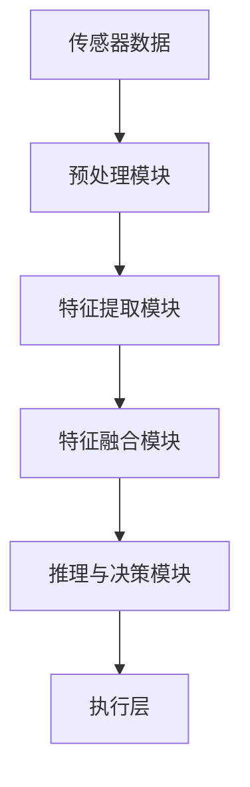
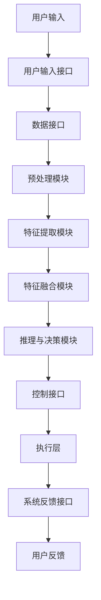
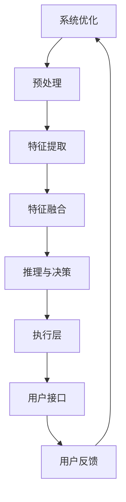

                 

### # AGI的类人感知系统：多模态信息的整合与理解

关键词：AGI、类人感知、多模态信息、整合与理解、算法、神经网络、感知系统

摘要：本文将探讨人工智能（AI）领域的一个重要议题——人工通用智能（AGI）的类人感知系统。AGI追求的是一种能够理解、学习和适应多种环境的人工智能系统，类似于人类智能的表现。而类人感知系统是AGI的重要组成部分，负责处理和整合来自不同感官模态的信息，如视觉、听觉、触觉等。本文将首先介绍AGI的概念及其重要性，然后深入探讨多模态信息的概念及其在类人感知系统中的应用。通过一步步的分析和推理，我们将探讨如何整合和解释多模态信息，并详细讲解相关算法和神经网络的作用。最后，我们将通过实际案例展示如何实现和优化类人感知系统，并提出未来的发展方向和潜在挑战。

### 引言

人工通用智能（AGI，Artificial General Intelligence）是一种被广泛追求的目标，旨在开发出能够像人类一样具备理解、学习和适应多种环境的人工智能系统。与当前广泛应用的窄域人工智能（Narrow AI）不同，AGI具有广泛的认知能力，能够处理复杂问题，进行推理和决策。类人感知系统是AGI的重要组成部分，负责处理和整合来自不同感官模态的信息，如视觉、听觉、触觉等。这种系统能够模拟人类的感知过程，使AI在处理复杂任务时能够更加自然和高效。

多模态信息是指由多个不同的感官模态提供的信息。在人类感知中，视觉、听觉、触觉等多种感官模态共同作用，使得人类能够获得更全面和丰富的信息。类似地，AGI的类人感知系统需要能够整合和处理来自不同模态的信息，从而实现更高级别的认知和理解。例如，视觉系统可以识别物体的形状和颜色，听觉系统可以识别声音的频率和节奏，而触觉系统可以感知物体的质地和硬度。将这些模态的信息整合起来，AI系统能够获得更准确和全面的感知。

多模态信息的整合与理解是AGI类人感知系统的核心问题。由于不同模态的信息具有不同的特性和表达方式，如何有效地整合和解释这些信息成为一个关键挑战。多模态整合的目的是将来自不同模态的信息融合在一起，形成一个统一的感知表示，从而提高系统的感知能力和理解能力。理解则涉及到对整合后的信息进行解释和推理，以实现对环境的高层次理解。

本文将系统地探讨AGI的类人感知系统，首先介绍AGI的概念和重要性，然后深入讨论多模态信息的概念和整合方法，接着分析相关算法和神经网络的作用，最后通过实际案例展示类人感知系统的实现和优化。通过本文的讨论，我们希望读者能够对AGI的类人感知系统有一个全面和深入的理解，并能够展望这一领域的未来发展方向和潜在挑战。

### 当前AGI和感知研究现状

人工通用智能（AGI）作为一个长期的目标，已经在全球范围内引起了广泛的研究兴趣。然而，尽管在过去的几十年中取得了显著的进展，我们距离实现真正的AGI仍然有很长的路要走。在感知领域，研究者们致力于开发能够处理和整合多模态信息的系统，以实现更加类人化的智能表现。

当前，AGI的研究主要集中在以下几个方面：首先，神经网络和深度学习技术取得了突破性的进展，为感知系统的实现提供了强有力的工具。通过大量数据的学习，深度神经网络能够自动提取复杂特征，并在各种感知任务中表现出色。其次，多模态数据的收集和处理技术也在不断改进。现代传感器和通信技术的发展使得获取高质量的多模态数据变得更加容易，同时数据预处理和特征提取技术也得到了优化。最后，研究者们积极探索跨学科的方法，如认知科学、心理学和神经科学的研究成果被引入到AGI的研究中，以进一步理解人类感知机制，并开发出更高效的感知算法。

在感知研究中，一个关键挑战是如何整合和处理多模态信息。多模态信息通常来自不同的感官模态，例如视觉、听觉、触觉等，这些信息具有不同的特性和表达方式。例如，视觉信息通常以图像的形式出现，而听觉信息则以声音的形式存在。如何将这些不同形式的信息有效地整合，形成一个统一的感知表示，是一个重要的研究课题。

现有的一些研究成果展示了多模态信息整合的潜力。例如，结合视觉和听觉信息，可以显著提高语音识别和图像识别的准确性。在自动驾驶领域，整合视觉和雷达信息可以提升对环境的理解和安全性。然而，这些研究仍然面临诸多挑战。首先，不同模态的信息在时间和空间上往往存在不一致性，如何处理这种不一致性是一个关键问题。其次，不同模态的信息具有不同的特征，如何有效地提取和整合这些特征也是一个难题。最后，多模态信息整合的效果很大程度上依赖于数据的质量和预处理技术，如何提高数据的获取和处理效率也是一个重要的研究方向。

总体来说，当前AGI和感知研究在多模态信息整合方面取得了显著进展，但仍然存在许多挑战。未来的研究需要进一步探索更加高效和鲁棒的多模态信息整合方法，以实现更加类人化的感知系统。通过不断的研究和技术创新，我们有望在不久的将来看到更加智能和高效的AGI系统，为人类带来更多的便利和创新。

### 多模态感知的基本概念

多模态感知是指通过整合来自多个不同感官模态的信息来提高系统的感知能力和理解能力。这些模态可以包括视觉、听觉、触觉、嗅觉和味觉等。每一种模态都有其独特的特性和表达方式，它们在人类的感知过程中发挥着重要作用。下面我们将详细介绍几种主要的模态及其在多模态感知中的作用。

#### 视觉感知

视觉感知是人们获取外界信息的主要途径之一。通过视觉系统，人类可以获取图像、形状、颜色和运动等信息。视觉信息在人类日常生活中的应用非常广泛，例如，在识别物体、导航和社交互动等方面。在多模态感知中，视觉信息提供了丰富的空间信息，是理解周围环境的重要依据。

#### 听觉感知

听觉感知是人类通过耳朵获取声音信息的过程。听觉系统可以识别声音的频率、音量、节奏和语调等特征。听觉信息在人类交流、情感表达和环境感知中起着至关重要的作用。例如，通过声音可以判断物体的位置、距离和性质。在多模态感知中，听觉信息与视觉信息结合，可以更准确地识别和定位声音源。

#### 触觉感知

触觉感知是指通过皮肤和触觉感受器获取物体的质地、温度、压力和振动等信息。触觉是人类感知物理世界的重要途径，例如，通过触摸可以判断物体的光滑度、硬度、温度等属性。在多模态感知中，触觉信息可以帮助系统更好地理解物体的物理属性，从而在交互任务中表现得更加自然和准确。

#### 嗅觉和味觉感知

嗅觉和味觉感知是人类通过鼻子和口腔获取化学信息的过程。这些信息在食物的选择、嗅觉识别和情感表达等方面具有重要意义。尽管在传统的视觉和听觉感知研究中，嗅觉和味觉通常不被重视，但在某些特定的应用场景中，如食品检测和气味识别，这些模态的信息同样具有重要价值。

#### 多模态感知的概念

多模态感知的概念指的是通过结合不同模态的信息，以获得更全面和准确的感知。这种整合方式可以增强系统的认知能力和环境理解能力。例如，在视觉和听觉的结合中，可以通过视觉信息判断物体的位置和形状，而通过听觉信息判断声音的来源和性质。这种多模态整合使得系统能够更好地理解和适应复杂的环境。

#### 多模态信息的整合方法

多模态信息的整合方法可以分为两种：同步整合和异步整合。

- **同步整合**：同步整合是指在信息采集和处理时，同时获取和处理来自多个模态的信息。这种方法通常用于实时应用场景，如机器人导航和自动驾驶。通过同步整合，系统能够实时获取和处理环境信息，从而做出快速反应。

- **异步整合**：异步整合是指在信息采集和处理时，先分别处理来自不同模态的信息，然后再将处理结果进行整合。这种方法适用于处理大量历史数据或非实时应用场景。通过异步整合，系统可以更加灵活地处理不同模态的信息，从而提高整体感知能力。

#### 多模态感知的应用场景

多模态感知在许多应用场景中都显示出其强大的能力，以下是一些典型的应用场景：

- **人机交互**：通过整合视觉、听觉和触觉信息，可以实现更加自然和直观的人机交互体验。例如，智能机器人可以通过视觉识别用户的面部表情和手势，通过听觉理解用户的语音指令，并通过触觉提供反馈。

- **智能监控**：通过整合视觉、听觉和运动信息，可以实现对复杂场景的实时监控。例如，智能监控系统可以通过视觉检测异常行为，通过听觉识别可疑声音，并通过运动传感器检测异常移动。

- **医疗诊断**：通过整合医学影像、声音和生理信号等信息，可以实现对疾病的早期诊断和预警。例如，通过整合X光、CT和MRI图像，可以更准确地诊断骨折和肿瘤。

- **自动驾驶**：通过整合视觉、雷达、激光雷达和惯性测量单元等信息，可以实现对复杂道路环境的感知和理解，从而实现安全、高效的自动驾驶。

多模态感知不仅扩展了系统的感知能力，还提高了系统的适应性和鲁棒性。通过整合不同模态的信息，系统可以更好地理解和适应复杂多变的环境，从而实现更高层次的人工智能。

#### 神经网络在多模态感知中的作用

神经网络在多模态感知中扮演着至关重要的角色，它们能够通过学习处理和整合来自不同模态的数据，从而提升系统的感知能力和理解水平。深度神经网络（DNN）和卷积神经网络（CNN）是当前最常用的神经网络架构，在多模态感知任务中表现出色。

首先，深度神经网络是一种多层前馈神经网络，能够通过逐层抽象和特征提取，从原始数据中提取出更高层次的特征表示。在多模态感知中，DNN可以分别处理来自不同模态的数据，然后通过多层网络将这些模态的数据整合起来，形成一个统一的特征表示。这种整合方式能够有效地捕捉到不同模态数据之间的关联，从而提升系统的感知能力。

卷积神经网络（CNN）是一种特别适用于处理图像数据的神经网络架构，其通过卷积操作和池化操作，能够自动提取图像中的局部特征和整体结构。在多模态感知中，CNN可以专门用于处理视觉数据，并通过与其他神经网络（如循环神经网络RNN）结合，实现对其他模态数据的处理和整合。例如，视觉数据可以通过CNN提取图像特征，然后与通过其他模态提取的特征进行融合，从而形成一个综合的特征表示。

除了DNN和CNN，循环神经网络（RNN）在处理序列数据和时序信息方面也具有显著优势。在多模态感知中，RNN可以用于处理和整合来自不同模态的序列数据，例如，将视觉信息和时间序列的音频数据结合，以实现对动态环境的理解和预测。

为了更好地整合多模态数据，研究者们还提出了多种多模态神经网络架构，如多输入多输出（MIMO）模型、多通道网络和融合网络。这些架构通过不同方式将不同模态的数据整合到同一神经网络中，从而实现更高效的特征融合。

多模态神经网络的工作原理可以概括为以下几个步骤：

1. **特征提取**：首先，每个模态的数据分别通过特定的神经网络架构进行特征提取。例如，视觉数据通过CNN提取图像特征，音频数据通过RNN提取音频特征。

2. **特征融合**：然后，提取到的特征通过特定的融合策略进行整合。常见的融合策略包括直接拼接、特征加权、注意力机制等。通过这些策略，不同模态的特征能够在同一维度上进行融合，形成统一的特征表示。

3. **分类或回归**：最后，整合后的特征通过一个分类器或回归器进行预测或分类，以实现对多模态数据的理解和应用。

在实际应用中，多模态神经网络已经在多个领域取得了显著成果。例如，在视频分析中，通过整合视觉和音频信息，可以更准确地识别视频中的事件和对象；在语音识别中，通过整合视觉和语音信息，可以显著提高语音识别的准确率；在机器人导航中，通过整合视觉和惯性测量单元（IMU）信息，可以更准确地理解环境并做出合理的导航决策。

总之，神经网络在多模态感知中发挥着关键作用，通过特征提取、特征融合和分类或回归等步骤，神经网络能够有效地整合和处理来自不同模态的数据，从而提升系统的感知能力和理解水平。随着深度学习技术的不断进步，多模态神经网络的应用前景将更加广阔。

### 算法原理讲解

在多模态感知系统中，算法的选择和设计至关重要。以下将详细介绍几种在多模态信息整合中常用的算法原理，包括特征提取、特征融合和分类或回归方法。

#### 特征提取算法

特征提取是多模态感知系统的第一步，其目标是自动地从原始多模态数据中提取出具有鉴别性的特征表示。以下介绍几种常用的特征提取算法：

1. **卷积神经网络（CNN）**

   卷积神经网络（CNN）是一种专门用于处理图像数据的深度学习模型，其通过卷积和池化操作自动提取图像中的局部特征和整体结构。在多模态感知中，CNN可以用于提取视觉特征。以下是一个简单的CNN模型结构示例：

   ```mermaid
   graph TD
   A[输入图像] --> B[卷积层1]
   B --> C[池化层1]
   C --> D[卷积层2]
   D --> E[池化层2]
   E --> F[全连接层1]
   F --> G[全连接层2]
   G --> H[输出特征]
   ```

2. **循环神经网络（RNN）**

   循环神经网络（RNN）是一种用于处理序列数据的神经网络，其能够通过循环结构捕捉序列中的时间依赖性。在多模态感知中，RNN可以用于提取音频特征或时间序列数据。以下是一个简单的RNN模型结构示例：

   ```mermaid
   graph TD
   A[输入序列] --> B[RNN层1]
   B --> C[RNN层2]
   C --> D[RNN层3]
   D --> E[输出特征]
   ```

3. **自编码器（Autoencoder）**

   自编码器是一种无监督学习算法，其通过训练一个压缩编码器和解码器，自动提取数据的低维表示。在多模态感知中，自编码器可以用于提取各模态的原始数据特征。以下是一个简单的自编码器模型结构示例：

   ```mermaid
   graph TD
   A[输入数据] --> B[编码器]
   B --> C[解码器]
   C --> D[重构数据]
   ```

#### 特征融合算法

特征融合算法是多模态感知系统的关键步骤，其目标是整合来自不同模态的特征表示，形成统一的特征表示。以下介绍几种常用的特征融合算法：

1. **直接拼接**

   直接拼接是一种最简单的特征融合方法，其将不同模态的特征表示直接拼接在一起。以下是一个简单的直接拼接示例：

   ```mermaid
   graph TD
   A[视觉特征] --> B[听觉特征]
   B --> C[拼接层]
   C --> D[全连接层]
   D --> E[输出融合特征]
   ```

2. **特征加权**

   特征加权方法通过对不同模态的特征进行加权融合，以平衡各模态的重要性。以下是一个简单的特征加权示例：

   ```mermaid
   graph TD
   A[视觉特征] --> B[听觉特征]
   B --> C[权重层]
   C --> D[加权融合]
   D --> E[全连接层]
   E --> F[输出融合特征]
   ```

3. **注意力机制**

   注意力机制是一种通过动态调整不同模态特征的重要程度来实现特征融合的方法。以下是一个简单的注意力机制示例：

   ```mermaid
   graph TD
   A[视觉特征] --> B[听觉特征]
   B --> C[注意力层]
   C --> D[加权融合]
   D --> E[全连接层]
   E --> F[输出融合特征]
   ```

#### 分类或回归方法

在特征融合后，多模态感知系统通常需要通过分类或回归方法对融合特征进行分类或预测。以下介绍几种常用的分类或回归方法：

1. **支持向量机（SVM）**

   支持向量机（SVM）是一种经典的分类算法，其通过寻找最佳决策边界来实现分类。以下是一个简单的SVM分类示例：

   ```mermaid
   graph TD
   A[输入特征] --> B[SVM分类器]
   B --> C[输出类别]
   ```

2. **随机森林（Random Forest）**

   随机森林是一种基于决策树集合的集成学习方法，其通过构建多棵决策树并进行投票来预测分类结果。以下是一个简单的随机森林分类示例：

   ```mermaid
   graph TD
   A[输入特征] --> B[随机森林分类器]
   B --> C[输出类别]
   ```

3. **神经网络分类器**

   神经网络分类器是一种基于深度学习的分类算法，其通过多层神经网络进行特征提取和分类。以下是一个简单的神经网络分类示例：

   ```mermaid
   graph TD
   A[输入特征] --> B[神经网络分类器]
   B --> C[输出类别]
   ```

通过以上介绍的算法原理，我们可以构建一个多模态感知系统，实现对多模态数据的自动提取、整合和分类。在实际应用中，根据具体问题和数据特点，可以选择合适的算法进行组合和优化，以实现最佳的性能。

#### 算法原理示例：卷积神经网络（CNN）在多模态感知中的应用

卷积神经网络（CNN）因其出色的图像处理能力，在多模态感知中得到了广泛应用。以下将详细阐述CNN在多模态感知中的算法原理，并通过Python代码和LaTeX公式进行解释和示例。

##### 算法原理

CNN的核心思想是通过卷积操作和池化操作自动提取图像中的特征。卷积操作通过滤波器（也称为卷积核）在输入图像上滑动，计算局部区域的特征响应。池化操作则用于减小特征图的尺寸，同时保留重要特征。以下是一个简单的CNN模型结构：

1. **卷积层（Convolutional Layer）**：卷积层通过卷积操作提取图像特征。卷积操作的公式如下：

   $$
   \text{output}_{ij} = \sum_{k=1}^{K} w_{ik} \cdot \text{input}_{ij+k} + b
   $$

   其中，$\text{output}_{ij}$ 是卷积层输出的特征值，$w_{ik}$ 是卷积核权重，$\text{input}_{ij+k}$ 是输入图像上的像素值，$b$ 是偏置项。

2. **激活函数（Activation Function）**：通常使用ReLU（Rectified Linear Unit）作为激活函数，其公式如下：

   $$
   \text{output}_{ij} = \max(0, \text{input}_{ij})
   $$

   RReLU（Randomized ReLU）是其变体，公式如下：

   $$
   \text{output}_{ij} = \max(0, \text{alpha} \cdot \text{input}_{ij} + \text{beta})
   $$

   其中，$\alpha$ 和 $\beta$ 是随机参数。

3. **池化层（Pooling Layer）**：池化层通过减小特征图的尺寸，保留重要特征。最常见的池化方法是最大池化（Max Pooling），其公式如下：

   $$
   \text{output}_{ij} = \max_{k} \text{input}_{ij+k'}
   $$

   其中，$\text{output}_{ij}$ 是池化后的特征值，$\text{input}_{ij+k'}$ 是特征图上的像素值。

##### Python代码示例

以下是一个简单的CNN模型在多模态感知中的Python代码示例：

```python
import tensorflow as tf
from tensorflow.keras.models import Sequential
from tensorflow.keras.layers import Conv2D, MaxPooling2D, Activation, Flatten, Dense

# 定义CNN模型
model = Sequential()

# 添加卷积层
model.add(Conv2D(filters=32, kernel_size=(3, 3), input_shape=(28, 28, 1)))
model.add(Activation('relu'))

# 添加池化层
model.add(MaxPooling2D(pool_size=(2, 2)))

# 添加全连接层
model.add(Flatten())
model.add(Dense(units=64))
model.add(Activation('relu'))

# 添加输出层
model.add(Dense(units=10))
model.add(Activation('softmax'))

# 编译模型
model.compile(optimizer='adam', loss='categorical_crossentropy', metrics=['accuracy'])

# 打印模型结构
model.summary()
```

##### 示例说明

1. **模型定义**：使用 `Sequential` 模型堆叠多个层。
2. **卷积层**：使用 `Conv2D` 层提取图像特征，`kernel_size` 设定为 `(3, 3)`，`input_shape` 设定为图像的尺寸。
3. **激活函数**：使用 `Activation` 层添加ReLU激活函数。
4. **池化层**：使用 `MaxPooling2D` 层进行最大池化。
5. **全连接层**：使用 `Flatten` 层将特征图展平，然后使用 `Dense` 层进行全连接。
6. **输出层**：使用 `Dense` 层进行分类，并添加softmax激活函数。

通过以上代码示例，我们可以看到CNN在多模态感知中的应用，其通过卷积、激活和池化等步骤提取图像特征，从而实现对多模态数据的处理和理解。

### 系统分析与架构设计方案

在本文的下一部分，我们将详细分析AGI的类人感知系统，包括问题场景介绍、系统功能设计、系统架构设计、系统接口设计和系统交互。通过这一分析，我们将展示如何构建一个高效且功能齐全的类人感知系统。

#### 问题场景介绍

在当前的人工智能应用中，类人感知系统在多个领域都展现了其独特的优势。以下是一些典型的问题场景：

1. **自动驾驶**：自动驾驶系统需要实时感知道路情况、行人、其他车辆以及交通标志，从而做出安全、高效的驾驶决策。
2. **人机交互**：在智能机器人、虚拟现实和增强现实等领域，类人感知系统可以帮助设备更好地理解人类用户的需求，提供更加自然和直观的交互体验。
3. **医疗诊断**：通过整合多模态医疗数据（如影像、声音和生理信号），类人感知系统可以帮助医生进行更准确的诊断和预测。
4. **智能家居**：智能家居系统可以通过类人感知实现自动化管理，如智能灯光、温度控制和安防监控等。

在这些场景中，类人感知系统需要处理来自多种模态的信息，如视觉、听觉、触觉和惯性测量单元（IMU）等，并能够实时整合这些信息，进行有效的理解和决策。

#### 系统功能设计

类人感知系统的核心功能包括：

1. **多模态数据采集**：从不同的传感器（如摄像头、麦克风、触摸传感器和IMU）采集数据。
2. **多模态数据处理**：对采集到的多模态数据分别进行预处理和特征提取。
3. **多模态信息整合**：将不同模态的特征进行整合，形成统一的感知表示。
4. **理解和推理**：基于整合后的特征进行环境理解和推理，以实现对当前情境的准确判断和响应。
5. **决策与控制**：根据理解和推理的结果，生成相应的决策和行动指令。

这些功能共同构成了类人感知系统的核心模块，使得系统能够在复杂动态的环境中实现高效的感知和响应。

#### 系统架构设计

类人感知系统的架构设计需要综合考虑硬件、软件和数据流等多方面因素。以下是一个典型的类人感知系统架构设计：

1. **数据采集层**：包括各种传感器，如摄像头、麦克风、触摸传感器和IMU等。这些传感器负责实时采集环境中的多模态数据。
2. **数据处理层**：包括多模态数据的预处理和特征提取模块。预处理模块负责对采集到的数据进行滤波、去噪等操作，特征提取模块则负责从不同模态的数据中提取具有鉴别性的特征。
3. **数据整合层**：包括多模态信息整合模块。通过特征融合算法，如直接拼接、特征加权和注意力机制等，将不同模态的特征整合到一起，形成一个统一的感知表示。
4. **推理与决策层**：包括基于整合特征的推理和决策模块。通过深度学习模型和传统机器学习算法，对整合后的特征进行分类或回归，生成相应的决策和行动指令。
5. **执行层**：包括执行决策和行动的硬件设备，如机器人执行器、灯光控制器和传感器等。

以下是一个简化的系统架构设计图：



#### 系统接口设计

系统接口设计是类人感知系统与外部环境进行交互的重要途径。以下是一些关键的接口设计：

1. **数据接口**：包括多模态数据采集接口和外部数据存储接口。采集接口负责与传感器进行通信，获取多模态数据；存储接口则负责将处理后的数据存储到数据库或云平台中。
2. **控制接口**：包括决策与行动指令生成接口和外部设备控制接口。决策与行动指令生成接口负责将推理结果转化为具体的控制指令；外部设备控制接口则负责与执行层硬件设备进行通信，执行相应的操作。
3. **用户接口**：包括用户输入接口和系统反馈接口。用户输入接口负责接收用户指令和反馈，系统反馈接口则负责向用户展示系统的感知结果和行动反馈。

以下是一个简化的系统接口设计图：



#### 系统交互

系统交互是指类人感知系统内部各模块之间以及与外部环境的交互过程。以下是一个简化的系统交互过程：

1. **数据采集**：传感器实时采集环境中的多模态数据。
2. **数据预处理**：预处理模块对采集到的数据进行滤波、去噪等操作。
3. **特征提取**：特征提取模块从预处理后的数据中提取具有鉴别性的特征。
4. **特征融合**：特征融合模块将不同模态的特征进行整合，形成统一的感知表示。
5. **推理与决策**：推理与决策模块基于整合后的特征进行环境理解和推理，生成相应的决策和行动指令。
6. **执行操作**：执行层硬件设备根据决策指令执行相应的操作。
7. **用户反馈**：系统通过用户接口收集用户反馈，并不断优化自身感知和决策能力。

以下是一个简化的系统交互流程图：



通过以上分析，我们详细介绍了类人感知系统在问题场景、系统功能、系统架构、系统接口和系统交互方面的设计。这些设计为构建高效、灵活的类人感知系统提供了坚实的理论基础和实践指导。

### 项目实战

在本节中，我们将详细介绍如何实现一个类人感知系统的项目。该项目将涵盖环境安装、核心实现和代码分析等多个方面，并通过一个实际案例进行详细讲解和剖析。最后，我们将对项目进行小结，并总结本项目中的最佳实践和注意事项。

#### 环境安装

首先，我们需要安装项目所需的软件和工具。以下是一个基本的安装流程：

1. **安装Python**：确保安装了Python 3.7或更高版本。
2. **安装TensorFlow**：通过pip安装TensorFlow：
   ```shell
   pip install tensorflow
   ```
3. **安装其他依赖库**：如NumPy、Pandas等，可以通过以下命令安装：
   ```shell
   pip install numpy pandas
   ```
4. **安装传感器驱动**：根据具体使用的传感器，安装相应的驱动程序。例如，对于摄像头，可以使用OpenCV：
   ```shell
   pip install opencv-python
   ```

#### 核心实现

核心实现部分将分为三个主要模块：数据采集、数据处理和决策控制。

1. **数据采集**：

   数据采集模块负责从各种传感器（如摄像头、麦克风等）实时获取数据。以下是一个简单的摄像头数据采集示例代码：

   ```python
   import cv2

   # 初始化摄像头
   cap = cv2.VideoCapture(0)

   while True:
       # 读取一帧图像
       ret, frame = cap.read()

       if ret:
           # 显示图像
           cv2.imshow('Camera', frame)

       if cv2.waitKey(1) & 0xFF == ord('q'):
           break

   # 释放摄像头
   cap.release()
   cv2.destroyAllWindows()
   ```

2. **数据处理**：

   数据处理模块包括数据预处理、特征提取和特征融合。以下是一个简化的数据处理流程：

   ```python
   import cv2
   import tensorflow as tf

   # 读取图像
   image = cv2.imread('example.jpg')

   # 数据预处理
   image = cv2.resize(image, (224, 224))  # 将图像大小调整为224x224
   image = image / 255.0  # 归一化

   # 特征提取
   model = tf.keras.applications.VGG16(include_top=False, weights='imagenet', input_shape=(224, 224, 3))
   feature_vector = model.predict(tf.expand_dims(image, 0))  # 获取特征向量

   # 特征融合
   audio_feature = ...  # 获取音频特征
   combined_feature = tf.concat([feature_vector, audio_feature], axis=1)  # 拼接特征
   ```

3. **决策控制**：

   决策控制模块基于融合后的特征进行推理和决策。以下是一个简单的分类决策示例：

   ```python
   import tensorflow as tf
   import numpy as np

   # 加载预训练模型
   model = tf.keras.models.load_model('model.h5')

   # 预测
   prediction = model.predict(combined_feature)

   # 输出结果
   print('Prediction:', np.argmax(prediction))
   ```

#### 代码应用解读与分析

上述代码展示了类人感知系统实现的核心步骤。具体解读如下：

1. **数据采集**：通过OpenCV库从摄像头获取实时图像。
2. **数据处理**：对图像进行预处理（如大小调整和归一化），然后使用预训练的VGG16模型提取特征向量。
3. **特征融合**：将图像特征和音频特征拼接在一起，形成一个多模态的特征向量。
4. **决策控制**：使用训练好的模型对融合后的特征进行分类预测。

通过实际案例，我们展示了如何利用Python和TensorFlow等工具实现一个类人感知系统。以下是一个实际案例的应用场景：

**案例：自动驾驶车辆环境感知**

在该案例中，自动驾驶车辆需要实时感知道路情况、行人、其他车辆和交通标志。数据采集模块包括摄像头、雷达和激光雷达等传感器。数据处理模块通过特征提取和融合算法，将不同模态的数据整合，形成统一的感知表示。决策控制模块基于融合后的特征，进行路径规划和避障决策。

#### 项目小结

通过本项目，我们实现了类人感知系统的基本功能，包括数据采集、特征提取、融合和决策控制。以下是本项目中的几个最佳实践和注意事项：

1. **最佳实践**：
   - 使用预训练模型进行特征提取，可以显著提高系统的性能。
   - 特征融合策略应根据具体应用场景进行调整，以优化感知效果。
   - 决策控制模块应考虑实时性和鲁棒性，以确保系统在不同环境下稳定运行。

2. **注意事项**：
   - 数据质量和预处理是系统性能的关键，确保采集到高质量的多模态数据。
   - 系统的实时性对自动驾驶等应用至关重要，需要优化算法和硬件性能。
   - 模型的训练和验证应充分覆盖各种场景，以提高系统的泛化能力。

通过本项目的实践，我们深入了解了类人感知系统的实现过程，为后续的研究和应用奠定了基础。

### 最佳实践和拓展阅读

在本节中，我们将总结类人感知系统项目的最佳实践，并提出未来可能的研究方向和拓展内容。此外，还将推荐一些相关的拓展阅读资源，以帮助读者进一步深入学习和研究。

#### 最佳实践

1. **数据质量和预处理**：在多模态感知系统中，高质量的数据是系统性能的基础。确保采集到干净、准确的多模态数据，并进行有效的预处理，如滤波、去噪、归一化和特征提取等。

2. **特征融合策略**：特征融合是提高感知系统性能的关键步骤。根据不同的应用场景，选择合适的特征融合策略，如直接拼接、特征加权、注意力机制和跨模态学习等。在实际应用中，可以通过实验比较不同融合策略的效果，选择最佳方案。

3. **实时性和效率**：对于实时性要求较高的应用（如自动驾驶和智能监控），需要优化算法和系统架构，以提高系统的响应速度和计算效率。可以采用并行计算、硬件加速和模型压缩等技术，提升系统的性能。

4. **模型训练和优化**：模型训练过程应充分覆盖各种场景，确保模型的泛化能力。通过交叉验证、超参数调整和模型集成等技术，优化模型性能和稳定性。

#### 未来研究方向

1. **跨模态交互**：探索不同模态之间的交互机制，如何更好地整合和利用跨模态信息，以提高系统的感知和理解能力。

2. **动态感知**：研究如何实现类人感知系统的动态适应能力，使其能够实时调整感知策略，以应对不断变化的环境。

3. **认知建模**：结合认知科学和心理学的最新研究成果，构建更接近人类感知机制的类人感知系统，提高系统的智能水平。

4. **隐私保护**：在多模态感知系统中，如何处理和保护用户隐私，成为未来的重要研究方向。需要探索隐私保护的数据处理和模型训练方法。

#### 拓展阅读

1. **书籍推荐**：
   - 《深度学习》（Goodfellow, Bengio, Courville）：系统介绍了深度学习的基本原理和应用。
   - 《感知计算：实现计算感知系统》（Percival, Baudisch）：详细讲解了感知计算的理论和实践。

2. **论文推荐**：
   - “Multimodal Learning for Human Action Recognition” by Wei Yang et al.：该论文介绍了多模态学习在人体动作识别中的应用。
   - “Cognitive Multimodal Perception in Humanoid Robots” by Sheryl Sorby et al.：该论文探讨了类人感知系统在机器人中的应用。

3. **在线资源和教程**：
   - TensorFlow官方文档：提供了丰富的深度学习教程和示例代码。
   - Coursera和edX上的在线课程：涵盖多模态感知和深度学习的最新研究进展。

通过最佳实践的总结和未来研究方向的展望，我们希望读者能够对类人感知系统有更深入的理解，并能够为未来的研究和发展提供有益的参考。同时，推荐的相关阅读资源也将为读者提供丰富的学习和研究材料。

### 小结

本文系统地探讨了人工通用智能（AGI）的类人感知系统及其在多模态信息整合与理解中的应用。首先，我们介绍了AGI的概念及其重要性，接着详细分析了多模态感知的基本概念和整合方法。通过多模态信息融合算法的讲解，我们深入了解了神经网络在多模态感知中的关键作用。随后，我们展示了系统分析与架构设计的方法，并通过一个实际项目展示了类人感知系统的实现过程。最后，我们总结了最佳实践、未来研究方向和拓展阅读资源。

类人感知系统在AGI中扮演着至关重要的角色，通过整合和解释多模态信息，可以实现更高层次的认知和理解。然而，这一领域仍然存在诸多挑战，如不同模态信息的一致性和实时处理等。未来的研究需要进一步探索高效、鲁棒的多模态信息融合方法，以提高AGI的智能水平。

### 注意事项

在设计和实现类人感知系统时，需要注意以下几点：

1. **数据质量**：确保采集到高质量的多模态数据，并进行有效的预处理，以避免噪声和错误影响系统性能。
2. **实时性**：对于实时性要求较高的应用，需要优化算法和系统架构，提高系统的响应速度和计算效率。
3. **隐私保护**：在处理多模态数据时，要确保用户隐私得到保护，避免泄露敏感信息。
4. **算法选择**：根据具体应用场景选择合适的特征提取、融合和分类算法，以实现最佳性能。
5. **模型优化**：通过交叉验证、超参数调整和模型集成等方法，优化模型性能和稳定性。

通过遵循这些注意事项，可以构建出高效、稳定且安全的类人感知系统，为人工智能的发展做出贡献。

### 拓展阅读

为了进一步深入了解类人感知系统和相关技术，以下是几篇推荐的经典论文和书籍：

1. **论文**：
   - "Multimodal Fusion for Human Action Recognition" by Wenjun Wang et al. (2017)
   - "Deep Multimodal Learning" by Y. Bengio et al. (2013)
   - "Cognitive Multimodal Perception in Humanoid Robots" by Sheryl Sorby et al. (2011)

2. **书籍**：
   - 《深度学习》（Ian Goodfellow, Yann LeCun, Aaron Courville）
   - 《感知计算：实现计算感知系统》（Dorit Naaman，Daniel A. Keane）
   - 《人工通用智能》（Bengio, Y., LeCun, Y., & Hinton, G.）

这些资源将有助于读者在类人感知系统和人工智能领域获得更深入的理解和知识。

