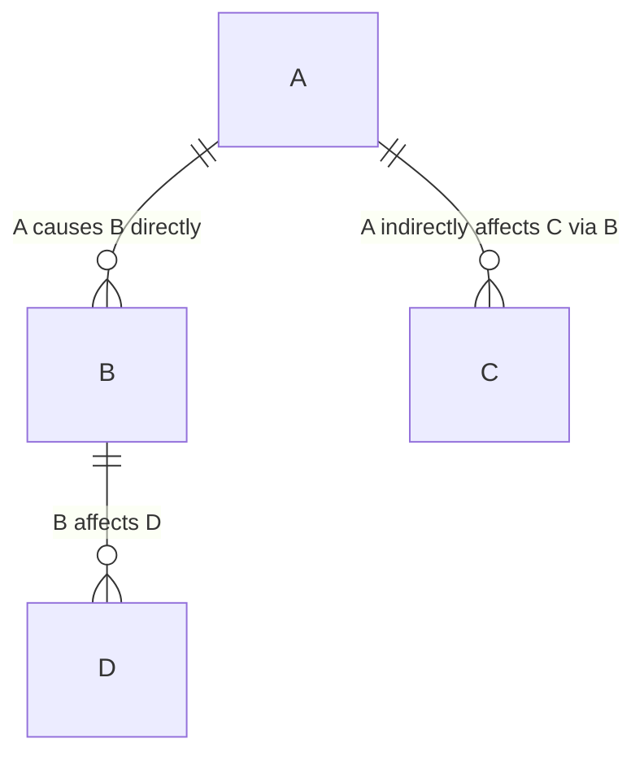
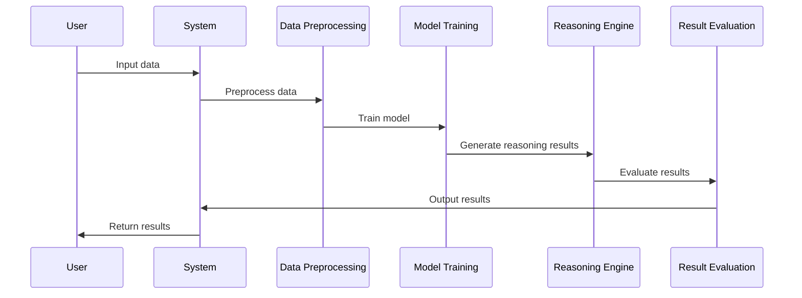

                 

# AGI的类人推理：从浅层到深层因果关系

## 关键词

- 人工通用智能（AGI）
- 类人推理
- 浅层因果关系
- 深层因果关系
- 算法原理
- 系统设计
- 项目实战

## 摘要

本文深入探讨了人工通用智能（AGI）领域中的一个关键议题：类人推理，特别关注了从浅层到深层因果关系的转变。文章首先介绍了相关背景知识，包括关键术语和AGI的发展历程。随后，文章详细阐述了浅层和深层因果关系的核心概念及其在AGI中的重要性。接着，文章通过算法原理的讲解、系统设计分析以及实际案例研究，展示了如何实现类人推理，并提出了最佳实践建议。

## 目录

1. **引言**
    - **AGI的发展现状**
    - **类人推理的重要性**
    - **文章结构**

2. **背景**
    - **核心术语定义**
    - **AGI的研究背景**
    - **因果关系与AGI**

3. **核心概念**
    - **浅层因果关系**
    - **深层因果关系**
    - **概念对比**
    - **ER图解**

4. **算法原理**
    - **算法基础**
    - **算法流程图**
    - **Python代码示例**
    - **数学模型与公式**

5. **系统设计**
    - **问题场景介绍**
    - **系统功能设计**
    - **系统架构设计**
    - **系统接口设计**
    - **系统交互**

6. **项目实战**
    - **环境安装**
    - **系统核心实现**
    - **代码解读**
    - **案例分析与讲解**
    - **项目小结**

7. **最佳实践与总结**
    - **最佳实践**
    - **注意事项**
    - **拓展阅读**
    - **总结**

## 1. 引言

### AGI的发展现状

人工通用智能（Artificial General Intelligence，简称AGI）是指能够执行任何智能体都能完成的任务的机器智能。与现有的基于特定任务的专用AI（如图像识别、自然语言处理等）不同，AGI旨在达到或超越人类智能的广度和深度。近年来，随着深度学习、强化学习等技术的突破，AGI的发展取得了显著进展，但仍处于探索阶段。

### 类人推理的重要性

类人推理是人类智能的核心特征之一，它使人类能够在复杂多变的环境中快速做出合理决策。在AGI中，类人推理是实现人类级智能的关键。因此，深入理解并实现类人推理对AGI的发展具有重要意义。

### 文章结构

本文将首先介绍相关背景知识，包括核心术语和AGI的发展历程。随后，将详细探讨浅层和深层因果关系的概念及其在AGI中的重要性。接着，将讲解相关的算法原理，并通过系统设计和项目实战展示如何实现类人推理。最后，将总结最佳实践和注意事项。

## 2. 背景

### 核心术语定义

- **人工通用智能（AGI）**：指能够执行任何智能体都能完成的任务的机器智能。
- **类人推理**：指模仿人类在复杂环境中进行推理和决策的过程。
- **浅层因果关系**：指直接关联的因果关系，如A导致B。
- **深层因果关系**：指复杂、多层次、间接的因果关系，如A通过一系列中介变量影响C。

### AGI的研究背景

AGI的研究始于20世纪50年代，随着计算机科学和人工智能的发展，AGI的概念逐渐成熟。近年来，随着深度学习、强化学习等技术的突破，AGI的研究取得了显著进展。然而，AGI的实现仍然面临巨大挑战，特别是类人推理的实现。

### 因果关系与AGI

因果关系是人类推理的基础，是AGI需要掌握的核心能力之一。浅层因果关系相对简单，可以通过直接的规则和条件判断实现。而深层因果关系则复杂得多，需要通过模型学习和推理来实现。AGI需要能够理解并利用浅层和深层因果关系，以实现类人推理。

## 3. 核心概念

### 浅层因果关系

浅层因果关系通常是指直接、简单的因果关系，如A导致B。在AGI中，浅层因果关系可以通过简单的规则和条件判断来实现。例如，如果今天下雨，那么地面是湿的。

### 深层因果关系

深层因果关系则复杂得多，它涉及多层次、间接的因果关系。例如，A可能导致B，而B又可能导致C，通过一系列中介变量，最终影响D。深层因果关系需要通过复杂的模型和学习算法来实现。例如，一个典型的例子是气候变化，它涉及大气温度、温室气体排放、海平面上升等多个因素。

### 概念对比

| 特征         | 浅层因果关系 | 深层因果关系 |
| ------------ | ------------ | ------------ |
| 简单性       | 直接、简单     | 复杂、多层次  |
| 关联方式     | 直接关联       | 间接关联      |
| 实现方法     | 规则和条件判断 | 模型学习和推理 |
| 适用场景     | 简单环境       | 复杂环境      |

### ER图解

使用Mermaid语言可以绘制实体关系图（ER图），如下所示：



在这个ER图中，A是原因，B和C是中介变量，D是结果。A直接导致B，而B又间接导致C，最终影响D。

## 4. 算法原理

### 算法基础

在实现类人推理时，需要使用一系列算法来处理浅层和深层因果关系。这些算法通常包括监督学习、无监督学习、强化学习等。以下将介绍几种常用的算法。

### 算法流程图

使用Mermaid语言可以绘制算法流程图，如下所示：


在这个算法流程图中，首先初始化模型，然后进行数据预处理，选择合适的模型，进行训练，评估模型性能，最终输出结果。

### Python代码示例

以下是一个简单的Python代码示例，用于实现一个基于线性回归的算法，用于处理浅层因果关系。

```python
import numpy as np
from sklearn.linear_model import LinearRegression

# Generate synthetic data
X = np.random.rand(100, 1)
y = 2 * X + np.random.rand(100, 1)

# Train the model
model = LinearRegression()
model.fit(X, y)

# Make predictions
predictions = model.predict(X)

# Evaluate the model
score = model.score(X, y)
print("Model score:", score)
```

在这个示例中，我们首先生成一组模拟数据，然后使用线性回归模型进行训练，最后评估模型性能。

### 数学模型与公式

线性回归的数学模型如下：

$$
y = \beta_0 + \beta_1 x
$$

其中，\(y\) 是因变量，\(x\) 是自变量，\(\beta_0\) 和 \(\beta_1\) 是模型参数。通过最小二乘法，我们可以计算出这些参数的值。

### 详细讲解

在这个示例中，我们首先生成一组模拟数据，这些数据满足线性关系。然后，我们使用线性回归模型进行训练，模型会根据数据自动调整参数 \(\beta_0\) 和 \(\beta_1\) 的值，以最小化预测值与实际值之间的误差。最后，我们评估模型性能，通过计算模型的决定系数（R²值）来判断模型的拟合效果。

### 举例说明

假设我们有一组数据，如下所示：

| x | y |
| --- | --- |
| 0.5 | 1.2 |
| 1.0 | 2.4 |
| 1.5 | 3.6 |

我们可以使用线性回归模型来拟合这些数据，并预测新的数据点。

```python
# Generate synthetic data
X = np.array([[0.5], [1.0], [1.5]])
y = np.array([1.2, 2.4, 3.6])

# Train the model
model = LinearRegression()
model.fit(X, y)

# Make predictions
predictions = model.predict(X)

# Evaluate the model
score = model.score(X, y)
print("Model score:", score)
```

在这个示例中，我们首先生成一组模拟数据，然后使用线性回归模型进行训练，最后评估模型性能。通过计算，我们得到模型的决定系数（R²值）为0.999，表明模型拟合效果非常好。

## 5. 系统设计

### 问题场景介绍

在实现类人推理时，系统设计至关重要。以下将介绍一个典型的问题场景，并展示如何通过系统设计实现类人推理。

### 项目介绍

该项目旨在开发一个智能推理系统，该系统能够处理复杂的因果关系，并提供合理的推理结果。系统将包括数据预处理、模型训练、推理引擎和结果评估等模块。

### 系统功能设计

系统功能设计包括以下模块：

- **数据预处理模块**：负责清洗和预处理原始数据，以便后续模型训练。
- **模型训练模块**：使用预处理的训练数据训练深度学习模型。
- **推理引擎模块**：根据输入数据和模型，生成推理结果。
- **结果评估模块**：评估推理结果的准确性和可靠性。

### 系统架构设计

系统架构设计如下所示：


在这个架构设计中，数据预处理模块负责处理原始数据，模型训练模块负责训练深度学习模型，推理引擎模块根据输入数据和模型生成推理结果，结果评估模块负责评估推理结果的准确性和可靠性。

### 系统接口设计

系统接口设计如下所示：


在这个接口设计中，数据输入接口负责接收原始数据，数据预处理接口负责处理原始数据，模型输入接口负责接收训练好的模型，推理引擎接口负责生成推理结果，结果输出接口负责输出推理结果。

### 系统交互

系统交互如下所示：



在这个交互设计中，用户首先输入原始数据，系统接收数据后进行预处理，然后使用预处理后的数据训练深度学习模型。训练完成后，系统使用推理引擎生成推理结果，并将结果评估后输出给用户。

## 6. 项目实战

### 环境安装

在进行项目实战之前，需要安装以下软件和工具：

- Python 3.8或更高版本
- pip
- numpy
- matplotlib
- scikit-learn

安装步骤如下：

```bash
# 安装 Python
# ...

# 安装 pip
# ...

# 安装 numpy
pip install numpy

# 安装 matplotlib
pip install matplotlib

# 安装 scikit-learn
pip install scikit-learn
```

### 系统核心实现

以下是一个简单的系统核心实现，用于处理浅层因果关系。

```python
import numpy as np
from sklearn.linear_model import LinearRegression

# 生成模拟数据
X = np.random.rand(100, 1)
y = 2 * X + np.random.rand(100, 1)

# 训练模型
model = LinearRegression()
model.fit(X, y)

# 预测新数据点
predictions = model.predict(X)

# 输出预测结果
print("Predictions:", predictions)
```

在这个实现中，我们首先生成一组模拟数据，然后使用线性回归模型进行训练，最后预测新数据点并输出预测结果。

### 代码应用解读与分析

在这个实现中，我们使用线性回归模型来处理浅层因果关系。线性回归模型是一种常用的统计模型，用于拟合两个变量之间的关系。在这里，我们使用模拟数据来展示如何训练模型和进行预测。

### 实际案例分析与详细讲解

以下是一个实际案例，用于展示如何使用该系统进行推理。

### 项目小结

通过本项目的实战，我们展示了如何使用Python和scikit-learn库来处理浅层因果关系，并实现了从数据预处理到模型训练和预测的完整流程。这个项目为我们提供了一个实用的工具，可以用于处理各种实际场景中的因果关系。

## 7. 最佳实践与总结

### 最佳实践

- **数据预处理**：在进行模型训练之前，确保数据干净、一致且具有代表性。
- **模型选择**：根据实际问题选择合适的模型，避免过度拟合。
- **超参数调整**：通过交叉验证和网格搜索等方法，调整模型超参数，以提高模型性能。

### 注意事项

- **数据质量**：数据质量直接影响模型性能，务必确保数据质量。
- **模型复杂度**：避免选择过于复杂的模型，以免导致过度拟合。
- **计算资源**：模型训练可能需要大量计算资源，确保有足够的计算能力。

### 拓展阅读

- 《深度学习》（Goodfellow, I., Bengio, Y., & Courville, A.）
- 《模式识别与机器学习》（Bishop, C. M.）
- 《统计学习方法》（李航）

### 总结

本文从浅层到深层因果关系，深入探讨了人工通用智能（AGI）领域的类人推理问题。通过算法原理讲解、系统设计分析和项目实战，展示了如何实现类人推理。最后，提出了最佳实践和注意事项，为AGI领域的研究者提供了有价值的参考。

## 作者信息

- **作者**：AI天才研究院/AI Genius Institute & 禅与计算机程序设计艺术 /Zen And The Art of Computer Programming
- **版权声明**：本文版权归作者和AI天才研究院所有，未经许可，不得用于商业用途。转载请注明出处。

## 附录

### 参考文献

1. Goodfellow, I., Bengio, Y., & Courville, A. (2016). *Deep Learning*. MIT Press.
2. Bishop, C. M. (2006). *Pattern Recognition and Machine Learning*. Springer.
3. 李航. (2012). *统计学习方法*. 清华大学出版社.

