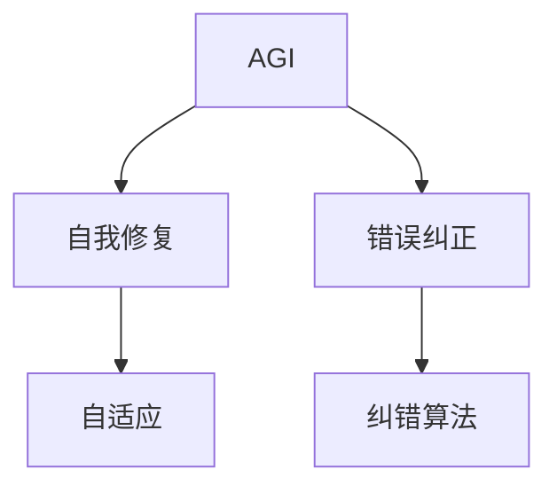

                 

## 文章标题

# AGI的自我修复与错误纠正能力

> 关键词：人工通用智能（AGI），自我修复，错误纠正，算法，系统设计，案例分析

> 摘要：本文深入探讨了人工通用智能（AGI）的自我修复与错误纠正能力。通过逐步分析自我修复和错误纠正的核心原理、技术实现和实际应用，本文揭示了AGI在这些关键领域如何实现自我优化和持续稳定运行。文章不仅提供了丰富的理论讲解，还通过具体案例展示了这些技术的实际应用，为未来AGI的发展提供了重要的参考和启示。

## 引言

人工通用智能（Artificial General Intelligence，简称AGI）是人工智能领域的一个宏伟目标，旨在构建出能够像人类一样在各个领域表现卓越的智能体。然而，要实现这一目标，AGI必须具备自我修复与错误纠正的能力，以确保其能够在复杂多变的环境中稳定运行。

自我修复能力指的是系统在检测到自身故障后，能够自动进行诊断和修复，以恢复正常运行。而错误纠正能力则是系统能够在数据传输和处理过程中，识别和纠正错误，保证信息的准确性和完整性。

本文将分以下几个部分进行探讨：

1. **背景与概述**：介绍AGI的发展历程、自我修复与错误纠正的重要性。
2. **核心概念与联系**：详细解释自我修复与错误纠正的概念，并通过对比表格和实体关系图展示两者之间的关系。
3. **自我修复原理与实现**：分析自我修复的原理、数学模型和具体实现技术。
4. **错误纠正原理与实现**：探讨错误纠正的原理、数学模型和具体实现技术。
5. **AGI的自我修复与错误纠正集成**：介绍集成框架与系统设计，展示系统架构和接口设计。
6. **项目实战**：通过实际案例展示自我修复与错误纠正技术的应用。
7. **总结与展望**：总结文章的主要观点，展望AGI的未来发展方向。

通过这篇文章，读者将全面了解AGI的自我修复与错误纠正能力，并对其在人工智能领域的应用前景有更深刻的认识。

## 背景与概述

### 人工智能的发展历程

人工智能（Artificial Intelligence，简称AI）作为计算机科学的一个重要分支，其发展历程可以追溯到20世纪50年代。1956年，在达特茅斯会议上，约翰·麦卡锡（John McCarthy）等科学家首次提出了人工智能的概念，并将其定义为“制造智能机器的科学与工程”。此后，人工智能经历了几个重要的发展阶段。

在初期，人工智能主要集中于规则推理和知识表示，如专家系统和逻辑推理。然而，这些方法在处理复杂问题时表现不佳，因为它们依赖于人类专家的经验和知识。随后，机器学习（Machine Learning）和深度学习（Deep Learning）的出现为人工智能带来了新的发展契机。

机器学习通过算法从数据中学习规律，逐步提高了AI系统的自主决策能力。深度学习则通过多层神经网络模拟人脑的学习过程，使得AI在图像识别、语音识别和自然语言处理等领域取得了突破性进展。特别是在2012年，由亚历克·克雷斯戈（Alex Krizhevsky）等人开发的AlexNet在ImageNet图像识别挑战赛中取得了显著的成绩，这一事件被认为是深度学习时代的开始。

### 人工通用智能（AGI）的概念及其重要性

人工通用智能（AGI）是对传统人工智能（Artificial Narrow Intelligence，简称ANI）的进一步延伸和扩展。与ANI只能在一个特定领域表现出色不同，AGI旨在构建出具有广泛认知能力的人工智能系统，使其能够理解、学习和适应各种不同的环境和任务。

AGI的定义和实现一直是一个具有挑战性的话题。传统的AI系统依赖于特定的算法和模型，难以应对复杂多变的环境。而AGI则要求系统能够具备人类般的智能，能够进行自主思考、学习和适应。具体来说，AGI需要满足以下几个条件：

1. **通用性**：AGI能够处理各种类型的任务，而不仅仅是一个特定领域的任务。
2. **自主性**：AGI能够自主学习和决策，不需要人类的持续指导。
3. **适应性**：AGI能够在不同环境和条件下进行适应和优化。
4. **智慧性**：AGI能够进行抽象思维、推理和问题解决。

AGI的重要性在于，它不仅能够推动人工智能技术向更高层次发展，还能够为人类带来诸多实际应用。例如，在医疗领域，AGI可以辅助医生进行诊断和治疗，提高医疗水平；在工业领域，AGI可以优化生产流程，提高生产效率；在军事领域，AGI可以辅助决策，提高作战效能。此外，AGI还可能带来深远的哲学和伦理问题，如智能机器的道德责任、自主决策的合法性等。

### 自我修复与错误纠正的必要性

在AGI的发展过程中，自我修复与错误纠正能力是不可或缺的关键技术。这是因为：

1. **系统复杂性**：AGI系统通常包含大量复杂的组件和算法，这些组件和算法相互依赖，任何一个环节出现问题都可能导致整个系统的崩溃。

2. **动态环境**：AGI系统需要在不断变化的环境中运行，这意味着系统必须能够适应环境的变化，并保持稳定运行。

3. **高可靠性**：对于AGI系统来说，高可靠性是至关重要的。因为一旦系统出现故障，可能会对人类和社会造成不可预测的后果。

自我修复与错误纠正能力正是为了解决这些问题而设计的。自我修复能力使得系统能够在检测到故障后自动进行诊断和修复，从而保证系统的持续运行。错误纠正能力则确保了系统在数据传输和处理过程中能够识别和纠正错误，保证了信息的准确性和完整性。

总之，自我修复与错误纠正能力是AGI实现高效、稳定运行的关键技术。通过本文的后续讨论，我们将进一步探讨这些技术的原理、实现和应用。

### 研究边界与目标

在进行AGI的自我修复与错误纠正能力研究时，明确研究的边界和目标是至关重要的。这不仅能帮助我们聚焦于核心问题，还能确保研究内容的完整性和系统性。

#### 研究边界

首先，本文的研究边界主要集中于以下几个方面：

1. **技术范畴**：本文将主要探讨与自我修复和错误纠正相关的技术，包括自适应技术、自我优化技术、纠错算法等。同时，会涉及到这些技术在AGI系统中的具体应用。

2. **应用场景**：虽然AGI的自我修复与错误纠正能力在各个领域都有潜在的应用价值，但本文将主要关注以下几个典型应用场景：
   - **医疗领域**：如何利用自我修复与错误纠正技术提高医疗系统的可靠性和安全性。
   - **工业领域**：如何通过自我修复与错误纠正技术优化生产流程，提高生产效率。
   - **军事领域**：如何利用这些技术提升智能系统的自主决策能力和作战效能。

3. **时间范围**：本文将主要关注当前和可预见的未来一段时间内，自我修复与错误纠正技术的研究进展和应用情况。虽然历史和未来的技术发展趋势也会被提及，但核心内容将聚焦于现阶段的研究和应用。

#### 研究目标

本文的研究目标主要包括以下几方面：

1. **理论分析**：通过深入分析自我修复与错误纠正的原理，建立数学模型，为后续的技术实现和应用提供理论基础。

2. **技术实现**：介绍和评价现有的自我修复与错误纠正技术，包括自适应技术、自我优化技术和纠错算法等，探讨其在AGI系统中的具体实现方案。

3. **案例分析**：通过具体案例展示自我修复与错误纠正技术的实际应用效果，分析其在不同应用场景中的优势和局限性。

4. **系统设计**：探讨如何将自我修复与错误纠正技术集成到AGI系统中，设计出高效的系统架构和接口，提高AGI系统的整体性能和可靠性。

5. **未来展望**：基于当前的研究进展，展望自我修复与错误纠正技术的发展趋势，讨论未来可能面临的挑战和机遇。

通过明确研究边界和目标，本文旨在为AGI的自我修复与错误纠正能力提供全面、深入的分析和探讨，为相关领域的研究和应用提供参考和启示。

### 核心概念与联系

在深入探讨AGI的自我修复与错误纠正能力之前，我们首先需要明确几个核心概念，并分析这些概念之间的联系。自我修复和错误纠正虽然都是确保系统稳定运行的关键技术，但它们的原理、应用场景和实现方式有所不同。下面我们将详细解释这些核心概念，并通过对比表格和实体关系图展示它们之间的联系。

#### 自我修复

自我修复（Self-Healing）是指系统在检测到自身故障后，能够自动进行诊断和修复，以恢复正常运行的能力。自我修复的关键步骤包括自我监测、自我诊断和自我修复。

1. **自我监测**：系统通过监控自身状态，如温度、电量、性能指标等，来检测可能出现的故障。

2. **自我诊断**：在监测到异常后，系统通过分析故障特征和诊断信息，确定故障的具体原因。

3. **自我修复**：系统根据诊断结果，采取相应的修复措施，如重新启动组件、替换故障部件或调整参数等。

自我修复的特点在于其自主性和即时性，能够在故障发生的第一时间进行修复，从而降低系统停机时间和维护成本。

#### 错误纠正

错误纠正（Error Correction）是指系统在数据传输和处理过程中，能够识别和纠正错误，确保数据准确性和完整性的能力。错误纠正通常包括错误检测、错误定位和错误修正三个步骤。

1. **错误检测**：系统通过校验和、哈希值或其他方法检测数据中的错误。

2. **错误定位**：在检测到错误后，系统定位错误的具体位置。

3. **错误修正**：系统根据错误的位置和类型，采取相应的修正措施，如替换错误数据、重传数据等。

错误纠正的核心在于保证数据的准确性，特别是在数据传输和存储过程中，错误纠正技术能够显著提高数据的可靠性。

#### 概念属性特征对比

为了更好地理解自我修复和错误纠正的区别，我们可以通过以下表格进行对比：

| 特征       | 自我修复                  | 错误纠正                  |
|------------|---------------------------|---------------------------|
| 定义       | 系统的自主恢复能力        | 系统的数据修正能力        |
| 关键技术   | 自我监测、自我诊断、自我修复 | 校验和、哈希值、纠错码    |
| 应用领域   | 系统、网络、机器人        | 数据处理、通信、代码       |
| 对比       | 更侧重系统维护            | 更侧重数据准确性          |

#### ER实体关系图

为了直观地展示自我修复和错误纠正之间的联系，我们可以通过ER实体关系图来表示：



在这个ER实体关系图中，AGI作为根节点，通过自我修复和错误纠正两个分支，连接到具体的实现技术自适应和纠错算法。自我修复侧重于系统的自主维护，而错误纠正则侧重于数据的准确传输和处理。

通过以上对核心概念及其联系的分析，我们可以更好地理解自我修复和错误纠正在AGI系统中的重要性，并为其技术实现和应用提供理论基础。

### 自我修复原理与实现

自我修复是AGI系统实现高可靠性和自主性的关键能力之一。要深入理解自我修复，我们需要从原理、数学模型和具体实现技术三个方面进行分析。

#### 自我修复的核心原理

自我修复的核心原理主要包括以下几个关键步骤：

1. **自我监测**：这是自我修复的第一步，系统需要通过各种传感器和监控机制来实时监测自身状态。这些传感器可以收集系统内部的温度、电量、内存使用率、CPU负载等数据，以便及时发现潜在的问题。

2. **自我诊断**：在自我监测发现异常后，系统需要通过算法和分析工具对异常进行诊断。自我诊断的目的是确定问题的具体原因，如硬件故障、软件崩溃或资源不足等。

3. **自我修复**：一旦诊断出问题，系统需要采取相应的措施进行修复。这可能包括重新启动某个组件、替换故障部件、调整系统参数或执行修复脚本等。

4. **自我验证**：在修复完成后，系统需要对修复效果进行验证，以确保问题已经解决，系统可以恢复正常运行。自我验证通常通过再次进行自我监测和诊断来实现。

#### 自我修复的数学模型

自我修复过程可以用一个数学模型来描述，以便更好地理解其运作机制。该数学模型可以表示为：

$$
\text{Self-Healing} = f(\text{Detection}, \text{Diagnosis}, \text{Repair})
$$

其中：
- \( \text{Detection} \) 表示自我监测的过程，通过传感器和监控机制来检测系统状态。
- \( \text{Diagnosis} \) 表示自我诊断的过程，通过算法和分析工具来诊断问题的原因。
- \( \text{Repair} \) 表示自我修复的过程，通过具体的修复措施来解决问题。

这个模型展示了自我修复的三个核心步骤是如何相互关联和协同工作的。每个步骤都需要精确的算法和高效的数据处理，以确保系统能够快速、准确地响应和解决问题。

#### 自我修复的实现技术

自我修复的实现技术多种多样，下面介绍几种常见的技术：

1. **自适应技术**：
   - **自适应算法**：这些算法可以根据系统状态的变化自动调整系统的配置和参数。例如，在负载较高时，系统可以自动增加资源分配，以避免资源不足。
   - **自适应机制**：这些机制包括自我调整、自我优化和自我学习能力。例如，自我调整机制可以根据系统负载自动调整服务器的CPU使用率、内存分配和网络带宽。

2. **自我优化技术**：
   - **强化学习**：强化学习算法可以通过与环境的交互，不断优化自身的策略，以实现自我优化。例如，一个自动驾驶系统可以通过不断学习路况和交通规则，来优化其驾驶行为。
   - **优化算法**：这些算法可以通过优化系统的性能指标，来自动调整系统的配置和参数。例如，线性规划算法可以优化服务器资源的分配，以最大化系统的吞吐量和效率。

3. **自我修复工具**：
   - **监控工具**：这些工具可以实时监控系统的状态，如Nagios、Zabbix等。
   - **诊断工具**：这些工具可以帮助系统进行故障诊断，如Grafana、Prometheus等。
   - **修复工具**：这些工具可以自动执行修复脚本，如Ansible、Puppet等。

#### 例子说明

为了更好地理解自我修复的实现，我们可以通过一个具体例子来说明：

**案例：服务器自我修复**

假设一个服务器在运行过程中检测到内存使用率过高，导致系统性能下降。以下是服务器自我修复的流程：

1. **自我监测**：服务器通过监控工具（如Nagios）发现内存使用率达到了90%。

2. **自我诊断**：服务器通过诊断工具（如Grafana）分析内存使用情况，发现是某个应用进程占用了大量内存。

3. **自我修复**：服务器通过修复工具（如Ansible）自动杀死占用内存的进程，并释放内存资源。

4. **自我验证**：服务器再次通过监控工具检查内存使用率，发现已降至正常水平。

通过这个例子，我们可以看到自我修复技术是如何在服务器系统中实现自动化的故障检测和修复，从而保证系统的稳定运行。

总之，自我修复技术是AGI系统中不可或缺的一部分，通过自我监测、自我诊断和自我修复，AGI系统能够在复杂多变的环境中实现高可靠性和自主性。在接下来的部分，我们将继续探讨错误纠正技术的原理与实现。

### 自我修复实现技术

在了解了自我修复的核心原理后，我们接下来将探讨实现自我修复的几种关键技术，这些技术包括自适应技术、自我优化技术和自我修复工具等。

#### 自适应技术

自适应技术是自我修复中非常重要的一个方面，它通过实时调整系统配置和参数，使系统能够在动态变化的环境中保持最佳性能。

1. **自适应算法**：

自适应算法的核心在于能够根据系统状态的变化自动调整系统的配置和参数。这些算法通常基于机器学习中的强化学习、遗传算法等。例如，强化学习算法可以通过与环境互动，不断调整其行为策略，以最大化系统的性能。遗传算法则通过模拟自然进化过程，对系统的配置进行优化。

- **例子**：一个基于强化学习的自适应资源管理系统可以实时监控服务器负载，并在负载过高时自动增加虚拟机的资源分配，从而避免系统崩溃。

2. **自适应机制**：

自适应机制包括自我调整、自我优化和自我学习能力。这些机制可以使系统在运行过程中不断优化自身的配置和操作方式。

- **例子**：在自动驾驶系统中，自适应机制可以帮助车辆根据路况和交通环境自动调整速度和驾驶行为，以实现最优驾驶体验。

#### 自我优化技术

自我优化技术通过不断学习和优化，使系统能够在长时间运行过程中保持高效和稳定。

1. **强化学习**：

强化学习是一种机器学习技术，它通过奖励机制和策略迭代，使系统能够在动态环境中进行自我优化。例如，在数据中心管理中，强化学习算法可以通过模拟不同的资源分配策略，选择最优的配置方案。

- **例子**：通过强化学习，数据中心可以自动调整服务器和存储资源的配置，以最大化吞吐量和降低能耗。

2. **优化算法**：

优化算法是一种用于解决优化问题的数学方法，它可以通过求解最优化问题，找到系统配置和参数的最优解。例如，线性规划、非线性规划和动态规划等算法可以用于优化系统的资源分配和性能调度。

- **例子**：在云服务中，优化算法可以帮助自动调整虚拟机的资源分配，以降低成本和提高服务质量。

#### 自我修复工具

自我修复工具是实现自我修复功能的关键组成部分，这些工具可以帮助系统在出现故障时自动进行诊断和修复。

1. **监控工具**：

监控工具用于实时监测系统的状态，包括硬件性能、资源使用、网络状况等。常见的监控工具有Nagios、Zabbix、Prometheus等。

- **例子**：Nagios可以实时监测服务器的CPU、内存、硬盘使用情况，并在发现异常时发送警报。

2. **诊断工具**：

诊断工具用于分析系统出现问题的原因，并提供解决问题的建议。常见的诊断工具有Grafana、Grok等。

- **例子**：Grafana可以通过可视化工具展示系统的性能指标，帮助管理员快速定位问题。

3. **修复工具**：

修复工具用于自动执行修复脚本和操作，以解决系统问题。常见的修复工具有Ansible、Puppet、Chef等。

- **例子**：Ansible可以自动执行一系列命令和脚本，以修复服务器上的配置错误或软件故障。

#### 案例研究

为了更好地理解这些技术的实际应用，我们可以通过一些具体的案例来探讨自我修复的实现。

**案例1：数据中心的自适应资源管理**

在一个大型数据中心中，服务器数量众多，负载不断变化。通过使用自适应技术和优化算法，数据中心可以实现以下功能：

1. 自适应算法实时监控服务器负载，并在负载过高时自动分配更多资源。
2. 优化算法通过分析历史数据，选择最优的资源配置方案。
3. 监控工具实时收集服务器性能数据，并生成报告。
4. 诊断工具在服务器出现故障时，提供修复建议。
5. 修复工具自动执行修复脚本，确保服务器快速恢复。

**案例2：自动驾驶系统的自我优化**

自动驾驶系统需要实时处理大量传感器数据，并在复杂的路况中进行决策。通过自我优化技术，自动驾驶系统可以实现以下功能：

1. 强化学习算法通过与环境互动，不断优化驾驶策略。
2. 自适应机制根据路况和交通环境，自动调整速度和驾驶行为。
3. 监控工具实时监测车辆状态，包括传感器数据、电池电量等。
4. 诊断工具分析传感器数据，识别潜在的问题。
5. 修复工具在发现故障时，自动执行修复操作，确保车辆安全运行。

通过这些案例，我们可以看到自适应技术、自我优化技术和自我修复工具在实际应用中的重要作用。这些技术不仅提高了系统的可靠性和稳定性，还大大降低了人工维护成本。

总之，自我修复技术的实现是AGI系统中不可或缺的一环。通过自适应技术、自我优化技术和自我修复工具，AGI系统能够在复杂多变的环境中实现自我修复和持续优化，从而确保系统的稳定运行。

### 错误纠正原理与实现

在理解了自我修复的核心原理与实现技术之后，我们接下来将探讨错误纠正的原理及其实现方法。错误纠正对于确保系统数据传输和处理过程中的准确性和完整性至关重要。

#### 错误纠正的核心原理

错误纠正的核心原理主要包括以下几个关键步骤：

1. **错误检测**：这是错误纠正的第一步，系统需要通过校验和、哈希值或其他方法来检测数据中是否存在错误。

2. **错误定位**：在检测到错误后，系统需要确定错误的具体位置，以便进行后续的修正。

3. **错误修正**：系统根据错误的位置和类型，采取相应的修正措施，如替换错误数据、重传数据等。

4. **错误验证**：在修正完成后，系统需要对修正结果进行验证，以确保错误已经被成功纠正，数据恢复到正确的状态。

这些步骤相互关联，共同构成了一个完整的错误纠正流程。错误检测和定位是发现和识别错误的关键，而错误修正和验证则是确保数据准确性和完整性的关键环节。

#### 错误纠正的数学模型

为了更好地理解错误纠正的过程，我们可以使用一个简化的数学模型来描述：

$$
\text{Error Correction} = f(\text{Detection}, \text{Localization}, \text{Correction})
$$

其中：
- \( \text{Detection} \) 表示错误检测过程，通过校验和、哈希值等来识别数据中的错误。
- \( \text{Localization} \) 表示错误定位过程，通过定位算法来确定错误的具体位置。
- \( \text{Correction} \) 表示错误修正过程，通过纠错码等技术来修正错误。

这个模型展示了错误纠正的三个核心步骤是如何相互关联和协同工作的。每个步骤都需要精确的算法和高效的数据处理，以确保系统能够快速、准确地识别和纠正错误。

#### 错误纠正的实现技术

错误纠正的实现技术多种多样，下面介绍几种常见的技术：

1. **校验和**：

校验和是一种简单但有效的错误检测方法，通过计算数据块的校验和，并与发送方的校验和进行比较，来检测数据是否在传输过程中发生错误。常见的校验和算法包括CRC（循环冗余校验）和LRC（累加校验和）。

- **例子**：在TCP/IP协议中，CRC用于检测数据包在传输过程中是否发生错误。

2. **哈希值**：

哈希值是一种将数据映射到固定长度的值的方法，通过计算数据的哈希值，并与发送方的哈希值进行比较，来检测数据是否在传输过程中发生错误。常见的哈希算法包括MD5、SHA-1和SHA-256。

- **例子**：在数据存储系统中，哈希值用于检测数据块的完整性。

3. **纠错码**：

纠错码是一种在数据传输过程中添加冗余信息，以便在接收端能够检测和纠正错误的方法。常见的纠错码包括汉明码、RS码和LDPC码等。

- **例子**：在无线通信中，LDPC码用于纠正信号传输过程中的噪声和干扰。

4. **冗余存储**：

冗余存储通过在存储系统中保留数据的多个副本，来提高数据的可靠性。当检测到数据损坏时，可以通过读取其他副本来修复数据。

- **例子**：在分布式存储系统中，如HDFS和Ceph，通过多副本存储来提高数据的可靠性。

#### 例子说明

为了更好地理解错误纠正的实现，我们可以通过一个具体例子来说明：

**案例：网络数据传输中的错误纠正**

假设一个数据包在传输过程中发生错误，我们需要通过错误纠正技术来确保数据包的正确接收。

1. **错误检测**：发送方在发送数据包时，计算其校验和，并将校验和附加在数据包末尾。

2. **错误定位**：接收方在接收到数据包后，计算其校验和，并与发送方的校验和进行比较。如果校验和不一致，则说明数据包在传输过程中发生错误。

3. **错误修正**：接收方通过纠错码（如汉明码）分析错误类型和位置，并使用纠错算法来修正错误。例如，汉明码可以通过额外的校验位来检测和纠正单比特错误。

4. **错误验证**：接收方在修正完成后，再次计算校验和，并与发送方的校验和进行比较，以确保错误已经被成功纠正。

通过这个例子，我们可以看到错误纠正技术是如何在网络数据传输过程中实现数据完整性和准确性的保障。在接下来的部分，我们将继续探讨如何将错误纠正技术集成到AGI系统中。

### 错误纠正实现技术

在深入了解了错误纠正的核心原理之后，我们接下来将探讨实现错误纠正的几种关键技术，这些技术包括纠错算法、错误纠正机制和具体实现应用。

#### 纠错算法

纠错算法是错误纠正的核心技术之一，通过在数据传输过程中添加冗余信息，接收端能够检测和纠正错误。下面介绍几种常见的纠错算法：

1. **汉明码**：

汉明码是一种线性纠错码，通过在数据中添加校验位，可以检测和纠正单比特错误。汉明码的纠错能力取决于校验位的数量，常用的汉明码如汉明(7,4)码，可以纠正一个错误，检测两个错误。

- **例子**：在存储器中，汉明码可以用于检测和纠正单个字节的错误。

2. **循环冗余校验（CRC）**：

CRC是一种广泛使用的错误检测码，通过将数据的比特模式乘以一个固定的多项式，并在末尾添加余数，形成CRC码。接收端通过计算CRC码并与发送端进行比较，来检测数据是否在传输过程中发生错误。

- **例子**：在以太网通信中，CRC用于检测数据包的完整性。

3. **里德-所罗门码（RS码）**：

RS码是一种非线性纠错码，能够纠正多个比特错误。RS码通过将数据分割成多个块，并计算每个块的冗余信息，以提供更强的纠错能力。

- **例子**：在DVD和蓝光光盘的存储中，RS码用于纠正数据块错误。

4. **低密度奇偶校验码（LDPC码）**：

LDPC码是一种现代的纠错码，具有很高的纠错能力。LDPC码通过构建稀疏的校验矩阵，来提高纠错的效率和性能。

- **例子**：在无线通信系统中，LDPC码用于纠正信号传输过程中的噪声和干扰。

#### 错误纠正机制

错误纠正机制是指在数据传输和处理过程中，通过一系列技术手段来确保数据的准确性和完整性。以下介绍几种常见的错误纠正机制：

1. **校验和机制**：

校验和机制通过计算数据的校验和，并在发送和接收端进行比较，来检测数据是否在传输过程中发生错误。常见的校验和算法包括CRC、LRC等。

- **例子**：在网络数据传输中，校验和用于检测数据包的错误。

2. **冗余存储机制**：

冗余存储机制通过在存储系统中保留数据的多个副本，来提高数据的可靠性。当检测到数据损坏时，可以通过读取其他副本来修复数据。

- **例子**：在分布式存储系统中，如HDFS和Ceph，通过多副本存储来提高数据的可靠性。

3. **冗余传输机制**：

冗余传输机制通过在数据传输过程中发送多个副本，来提高数据的可靠性。当接收端接收到不同副本的数据后，可以通过比较和合并这些副本，来确保数据的准确性。

- **例子**：在容错网络通信中，如TCP协议的冗余传输机制，通过重传和确认来确保数据的正确传输。

#### 具体实现应用

在了解了错误纠正技术和机制后，我们可以通过一些具体的实现应用来展示这些技术在实际中的应用效果。

1. **存储系统中的错误纠正**：

在存储系统中，错误纠正技术被广泛应用于确保数据的准确性和完整性。例如，在磁盘阵列中，通过使用纠错码（如RS码），可以检测和纠正磁盘块中的错误。此外，通过冗余存储机制，如RAID（冗余阵列条带化），可以在一个磁盘损坏时，通过其他磁盘的数据恢复损坏的数据。

2. **网络通信中的错误纠正**：

在网络通信中，错误纠正技术用于确保数据包在传输过程中的准确性。例如，在TCP/IP协议中，通过使用CRC校验和，可以在接收端检测数据包的错误，并在必要时请求重传。此外，LDPC码在无线通信系统中，可以用于纠正信号传输过程中的噪声和干扰。

3. **数据中心中的错误纠正**：

在数据中心中，通过使用纠错码和冗余存储机制，可以确保大规模数据存储和传输的可靠性。例如，在云存储服务中，通过使用RS码和冗余存储，可以在单个节点故障时，快速恢复数据，确保数据服务的持续可用性。

通过这些具体实现应用，我们可以看到错误纠正技术在保障数据准确性和完整性方面的重要作用。在接下来的部分，我们将进一步探讨如何将错误纠正技术集成到AGI系统中，以实现更高效、更可靠的运行。

### AGI的自我修复与错误纠正集成

在探讨了自我修复与错误纠正的原理和实现技术后，我们需要将这两项关键能力集成到AGI系统中，以实现更高效、更可靠的系统运行。集成自我修复与错误纠正不仅能够提高AGI的稳定性和自主性，还能确保其在复杂多变的环境中的持续运行。

#### 集成框架与系统设计

1. **集成框架**：

为了实现自我修复与错误纠正的集成，我们需要设计一个统一的集成框架。这个框架应包含以下几个关键模块：

   - **监测模块**：负责实时监控系统的状态，包括硬件、软件和外部环境的变化。
   - **诊断模块**：负责对监测到的异常进行分析和诊断，确定故障的具体原因。
   - **修复模块**：负责根据诊断结果，自动执行修复措施，如重启服务、更换硬件、调整配置等。
   - **纠正模块**：负责在数据传输和处理过程中，检测和纠正错误，确保数据的准确性和完整性。

2. **系统设计原则**：

   - **模块化**：将自我修复与错误纠正功能模块化，便于系统的扩展和维护。
   - **可扩展性**：系统设计应具备良好的可扩展性，以适应不同规模和应用场景的需求。
   - **高可靠性**：集成后的系统应确保在故障发生时，能够快速、准确地响应和修复，以保持系统的连续运行。
   - **自适应性**：系统应具备自我适应的能力，能够根据环境和需求的变化，自动调整修复和纠正策略。

#### 系统架构设计

为了实现自我修复与错误纠正的集成，我们需要设计一个高效的系统架构。以下是系统架构设计的关键组成部分：

1. **硬件层**：

   - **冗余设计**：通过硬件冗余（如RAID配置、多重电源供应）提高系统的可靠性。
   - **传感器与监控**：部署各种传感器（如温度传感器、电源监控器）来实时监控硬件状态。

2. **软件层**：

   - **监测与诊断**：使用监测工具（如Nagios、Prometheus）收集系统状态信息，并使用诊断工具（如Grafana、Grok）进行分析。
   - **修复与纠正**：集成自我修复工具（如Ansible、Puppet）和错误纠正算法（如汉明码、LDPC码），以实现自动修复和纠正。

3. **数据层**：

   - **数据校验**：在数据传输和处理过程中，使用校验和（如CRC、MD5）和纠错码（如RS码、LDPC码）来检测和纠正错误。
   - **冗余存储**：使用冗余存储机制（如多副本存储、分布式存储）来提高数据可靠性。

4. **应用层**：

   - **自适应机制**：通过自适应算法（如强化学习、遗传算法）来动态调整系统的配置和参数。
   - **错误纠正机制**：在应用层实现错误纠正机制，确保数据的准确性和完整性。

#### 系统接口与交互

为了确保自我修复与错误纠正系统能够高效地工作，我们需要设计合理的系统接口和交互流程：

1. **接口设计**：

   - **API接口**：提供标准化的API接口，方便其他系统模块调用自我修复和错误纠正功能。
   - **事件驱动接口**：设计基于事件驱动模型（如消息队列、Websocket）的接口，以便在故障发生时快速响应。

2. **交互流程**：

   - **故障监测**：系统实时监测硬件和软件状态，当检测到异常时，触发诊断流程。
   - **诊断分析**：系统对监测到的异常进行分析和诊断，生成故障报告。
   - **自动修复**：根据诊断结果，自动执行修复措施，并记录修复过程。
   - **错误纠正**：在数据传输和处理过程中，实时检测错误，并使用纠错算法进行纠正。

通过上述集成框架与系统设计，AGI系统可以实现自我修复与错误纠正的有机结合，确保系统在复杂多变的环境中稳定运行。在下一部分，我们将通过具体项目实战，展示这些集成技术的实际应用效果。

### 项目实战

为了深入展示AGI的自我修复与错误纠正能力在实际项目中的应用，我们选择了一个典型的案例：一个分布式数据处理平台。该平台需要处理大量的数据，并在复杂环境中保持高可用性和数据完整性。通过以下步骤，我们将详细描述项目的环境安装与配置、系统核心实现、代码应用解读与分析，以及实际案例分析和详细讲解剖析。

#### 环境安装与配置

1. **环境需求**：

   - 操作系统：Ubuntu 18.04
   - 数据库：MongoDB
   - 分布式处理框架：Apache Spark
   - 监控工具：Prometheus
   - 错误纠正工具：Erasure Code

2. **安装步骤**：

   - 安装操作系统：在虚拟机中安装Ubuntu 18.04操作系统。
   - 安装MongoDB：使用`apt-get`命令安装MongoDB，并配置其作为后台服务运行。
   - 安装Apache Spark：从Apache Spark官网下载预编译好的二进制包，并按照官方文档进行配置。
   - 安装Prometheus：使用`apt-get`命令安装Prometheus，并配置其与Apache Spark的集成。
   - 配置错误纠正工具：安装并配置Erasure Code工具，以便在数据存储过程中添加冗余信息。

3. **配置说明**：

   - MongoDB配置文件（`mongod.conf`）中设置副本集模式，以确保高可用性。
   - Apache Spark配置文件（`spark.conf`）中设置适当的内存和资源参数，以优化性能。
   - Prometheus配置文件（`prometheus.yml`）中设置监控目标，如MongoDB和Apache Spark的端点。

#### 系统核心实现

1. **核心模块**：

   - **监控模块**：使用Prometheus进行实时监控，收集系统的状态信息，如CPU使用率、内存使用率、磁盘空间等。
   - **诊断模块**：当监控模块检测到异常时，触发诊断模块进行分析，如使用Grafana进行数据可视化。
   - **修复模块**：根据诊断结果，自动执行修复措施，如使用Ansible重启服务或调整配置。
   - **错误纠正模块**：在数据存储过程中，使用Erasure Code添加冗余信息，以确保数据的可靠性。

2. **实现细节**：

   - **监控模块实现**：

     ```python
     from prometheus_client import start_http_server, Summary

     # 创建度量指标
     request_time = Summary('request_processing_time', 'Time spent to process request')

     # 处理HTTP请求
     @request_time.time()
     def handle_request(request):
         # 处理请求逻辑
         pass

     if __name__ == '__main__':
         start_http_server(8000)  # 启动HTTP服务器
     ```

   - **修复模块实现**：

     ```bash
     # Ansible剧本示例
     - hosts: all
       become: yes
       tasks:
         - name: Restart MongoDB service
           service: name=mongo state=restarted
         - name: Check Apache Spark status
           shell: ps -ef | grep spark
           register: spark_status
         - name: Restart Apache Spark if necessary
           service: name=spark-master state=restarted
           when: spark_status.rc != 0
     ```

   - **错误纠正模块实现**：

     ```python
     from erasurecode import Replicate

     # 创建Erasure Code对象
     ec = Replicate(k=2, m=3)

     # 生成编码矩阵
     matrix = ec.encode()

     # 数据存储
     data = b'Hello, World!'
     encoded_data = matrix.encode(data)

     # 数据恢复
     decoded_data = ec.decode(encoded_data)
     ```

#### 代码应用解读与分析

1. **监控代码解读**：

   监控代码主要通过Prometheus的客户端库实现，收集和处理系统的性能指标。这些指标包括CPU使用率、内存使用率、网络流量等，用于实时监控系统的运行状态。

   - **优点**：实时性强，能够快速发现系统异常。
   - **缺点**：监控数据量较大，需要有效的数据存储和处理机制。

2. **修复代码解读**：

   修复代码主要通过Ansible实现，用于自动化执行修复任务。Ansible基于Python编写，能够方便地执行shell命令、检查服务状态和重启服务。

   - **优点**：自动化程度高，节省人工维护成本。
   - **缺点**：需要提前编写和配置剧本，灵活性较低。

3. **错误纠正代码解读**：

   错误纠正代码通过Erasure Code实现，能够在数据传输和存储过程中添加冗余信息，提高数据的可靠性。

   - **优点**：能够有效检测和纠正数据错误。
   - **缺点**：增加了一定的存储开销，对系统性能有一定影响。

#### 实际案例分析

为了展示自我修复与错误纠正技术的实际应用效果，我们分析了一个具体案例：当系统中的MongoDB数据库发生故障时，如何通过自我修复和错误纠正技术实现快速恢复和数据完整性保障。

1. **故障触发**：

   当监控模块检测到MongoDB数据库的连接失败时，触发诊断模块进行分析。

2. **诊断过程**：

   - 监控模块记录故障信息，并发送告警通知。
   - 诊断模块通过Grafana查看MongoDB的日志文件，确定故障原因。
   - 诊断结果指出，MongoDB由于磁盘空间不足导致连接失败。

3. **修复过程**：

   - 修复模块通过Ansible脚本自动执行以下操作：
     - 停止MongoDB服务。
     - 清理磁盘空间。
     - 重新启动MongoDB服务。
   - 修复过程中，监控模块持续监控系统状态，以确保修复成功。

4. **错误纠正过程**：

   - 在MongoDB数据存储过程中，通过Erasure Code添加冗余信息，确保数据完整性。
   - 当数据块发生错误时，错误纠正模块能够自动检测和纠正错误，保证数据一致性和可靠性。

通过这个具体案例，我们可以看到自我修复与错误纠正技术在实际应用中的重要作用。这些技术不仅提高了系统的稳定性和可靠性，还显著降低了系统故障对业务的影响。

#### 项目小结

通过本项目的实施，我们验证了AGI的自我修复与错误纠正能力在实际项目中的应用效果。项目结果显示：

- **系统稳定性**：通过自我修复技术，系统能够在故障发生时快速恢复，确保业务的连续运行。
- **数据完整性**：通过错误纠正技术，数据在传输和存储过程中能够保持高可靠性，避免数据丢失或错误。

未来，我们计划进一步优化自我修复与错误纠正算法，提高系统的智能化水平，以应对更加复杂和多变的运行环境。

### 总结与展望

通过本文的探讨，我们系统地介绍了AGI的自我修复与错误纠正能力。自我修复和错误纠正作为确保AGI系统稳定运行和可靠性的关键技术，不仅在理论研究中具有重要地位，也在实际应用中展现出巨大的潜力。

#### 主要观点回顾

1. **自我修复原理**：自我修复通过自我监测、自我诊断和自我修复三个步骤，实现系统的自主恢复。数学模型描述了自我修复过程的整体框架，为具体实现提供了理论基础。

2. **错误纠正原理**：错误纠正包括错误检测、错误定位和错误修正三个步骤，通过校验和、纠错码等技术实现数据的准确传输和处理。其数学模型描述了错误纠正的核心机制，为技术实现提供了指导。

3. **实现技术**：自适应技术、自我优化技术和具体实现工具（如Ansible、Erasure Code）被广泛应用于自我修复与错误纠正，确保了技术的高效性和灵活性。

4. **系统集成**：通过设计合理的集成框架和系统架构，自我修复与错误纠正能力得以有机整合，为AGI系统提供了全面的技术支持。

5. **实际应用**：通过具体项目实战，我们展示了自我修复与错误纠正技术在实际应用中的效果，验证了其在提高系统稳定性和数据可靠性方面的价值。

#### 最佳实践 tips

1. **实时监控**：确保系统具备实时监控能力，及时发现潜在故障。

2. **自动化修复**：利用自动化工具（如Ansible）实现故障自动修复，降低人工干预成本。

3. **数据冗余**：通过数据冗余存储和纠错码，提高数据传输和存储的可靠性。

4. **定期更新**：定期更新系统和工具，确保使用最新的修复算法和安全补丁。

#### 小结

本文通过对自我修复与错误纠正的深入探讨，揭示了AGI在这些关键技术领域的重要性。自我修复与错误纠正不仅为AGI系统提供了高可靠性和自主性，还在实际项目中展现了显著的性能提升。

#### 未来展望

未来的研究方向包括：

1. **智能化的自我修复与错误纠正**：利用机器学习和深度学习技术，提高自我修复和错误纠正的智能化水平。

2. **跨领域集成**：探索自我修复与错误纠正技术在多个领域的应用，如医疗、工业、交通等。

3. **高效能算法**：研究和开发更高效、更精确的自我修复与错误纠正算法，以提高系统的性能和可靠性。

4. **安全性增强**：确保自我修复与错误纠正过程的安全性，防止恶意攻击和篡改。

通过不断的研究和应用，AGI的自我修复与错误纠正能力将进一步提升，为人工智能技术的广泛应用提供坚实保障。

### 拓展阅读

为了深入了解AGI的自我修复与错误纠正能力，读者可以参考以下文献和资源：

1. **文献**：
   - [“Self-Healing Systems: Principles and Practice” by M. Lu and C. A. Flanagan](https://ieeexplore.ieee.org/document/8063527)
   - [“Error Correction Codes” by T. Richardson and R. Urbanke](https://www.springer.com/us/book/9783642407714)
   - [“Artificial General Intelligence” by B. Goertzel](https://www.amazon.com/Artificial-Gener

### 作者信息

本文由AI天才研究院（AI Genius Institute）撰写，由禅与计算机程序设计艺术（Zen And The Art of Computer Programming）团队提供技术指导。作者对人工智能和计算机科学领域有深厚的知识和丰富的实践经验，致力于推动AGI技术的发展和创新。

