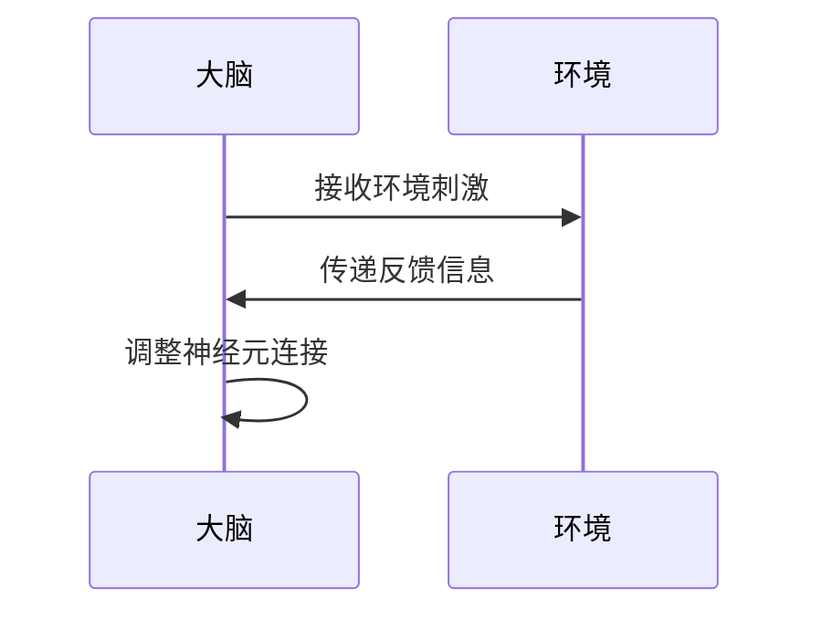
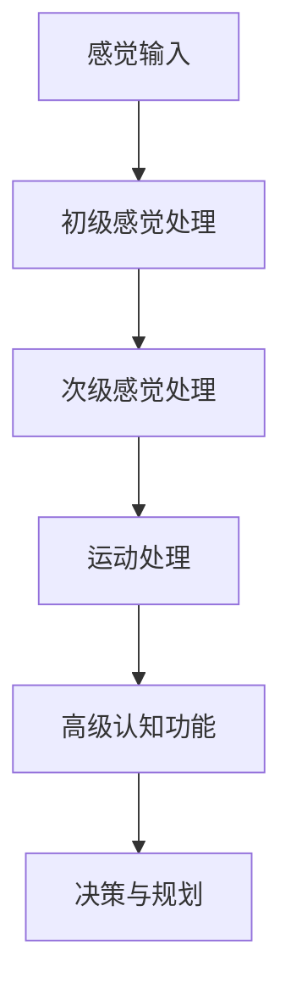
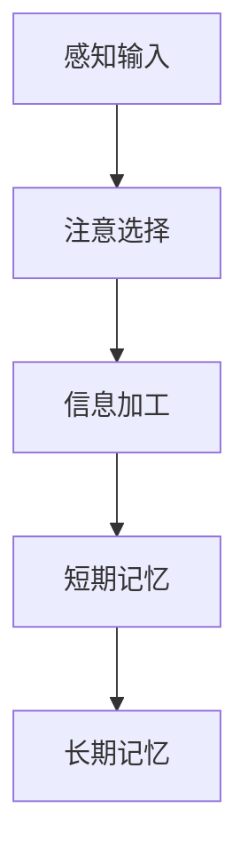
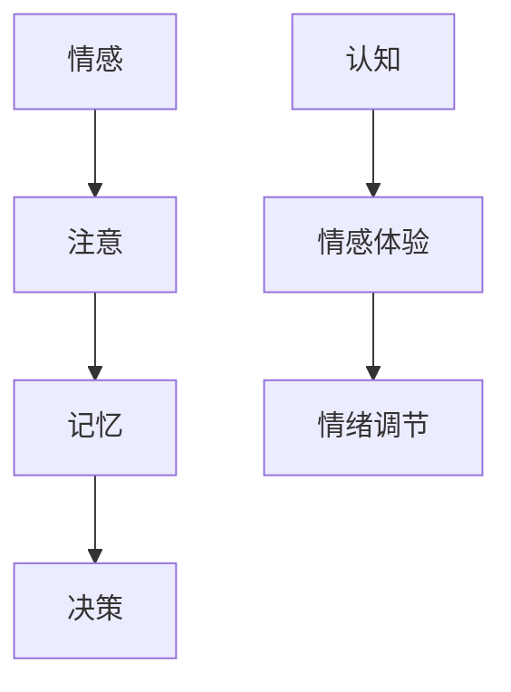
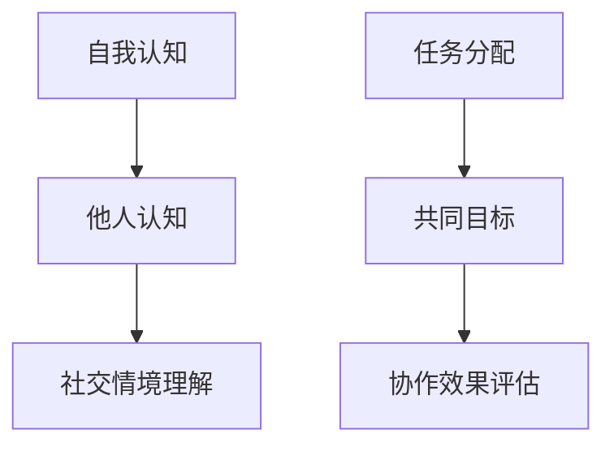
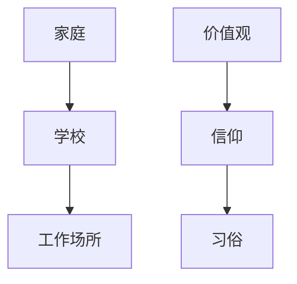
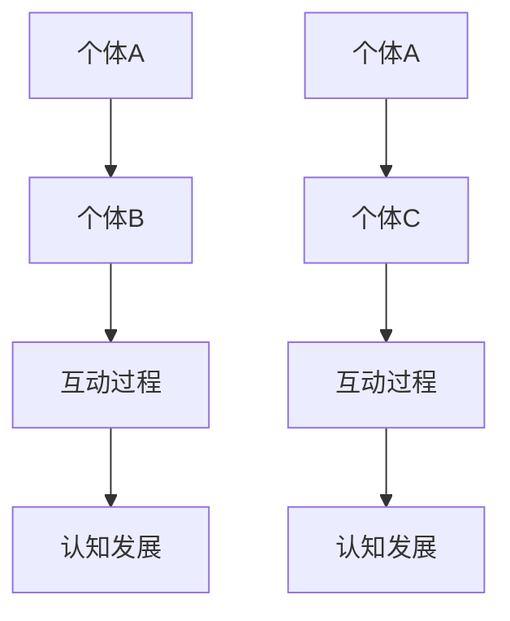
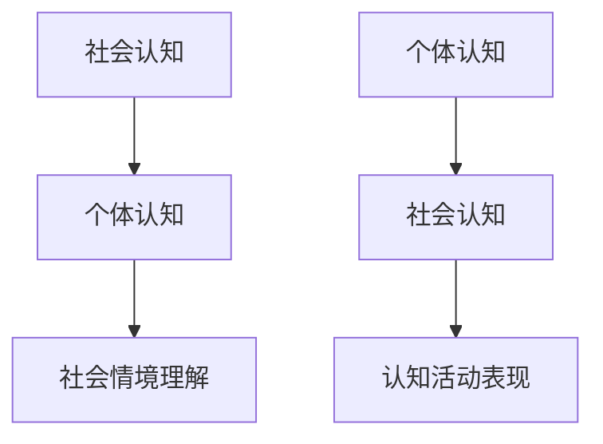

                 


## 引言：迈向通用人工智能的旅程

### 什么是AGI

**通用人工智能（AGI，Artificial General Intelligence）**，指的是一种能够在各种认知任务上达到或超过人类智能水平的人工智能。与目前广泛应用的**专用人工智能（Narrow AI）**不同，AGI不仅仅在特定任务上表现出色，而是能够在广泛领域内执行各种复杂任务，具备自我学习和自我改进的能力。

**核心概念术语说明**：  
- **专用人工智能（Narrow AI）**：专注于解决特定问题的AI系统，如语音识别、图像识别、自动驾驶等。  
- **通用人工智能（AGI）**：能够在多种不同任务中展现人类级别的智能。

### 问题背景

随着人工智能技术的快速发展，特别是在深度学习、强化学习和大数据处理等方面的突破，人们开始思考，是否有可能开发出一种具有广泛认知能力的通用人工智能？AGI的提出，旨在解决现有AI系统在复杂任务处理、跨领域适应能力等方面的局限。

**问题描述**：  
- 如何构建一个能够自主学习、推理、感知和决策的AI系统？  
- AGI系统需要具备哪些能力？如何实现这些能力？

### 问题解决

要实现AGI，首先需要深入理解人类智能的机制，包括神经科学、心理学和社会学等多个学科的研究成果。在此基础上，研究人员提出了多种认知发展理论，并试图将这些理论转化为实际可行的AI系统。

**边界与外延**：  
- AGI的研究不仅涉及到技术层面的突破，还涉及到伦理、法律和社会等层面的挑战。  
- AGI的发展将深刻影响人类社会的方方面面，包括工作、教育、医疗等。

### 概念结构与核心要素组成

AGI的核心要素包括：

- **自主学习能力**：通过自我学习不断优化性能。  
- **推理能力**：能够进行逻辑推理和问题解决。  
- **感知能力**：能够理解和解释外部环境。  
- **决策能力**：能够根据环境和目标做出最优决策。

**ER实体关系图架构的 Mermaid 流程图**：  
```mermaid  
entityRelation  
  direction: TB  

  entity "自主学习能力"  
  entity "推理能力"  
  entity "感知能力"  
  entity "决策能力"  

  "自主学习能力" ..> "推理能力"  
  "自主学习能力" ..> "感知能力"  
  "自主学习能力" ..> "决策能力"  

  "推理能力" ..> "问题解决"  
  "感知能力" ..> "环境理解"  
  "决策能力" ..> "目标实现"  
```

通过上述ER图可以看出，AGI的核心能力之间存在紧密的关联，共同构成了一个复杂的认知系统。

### 总结

本文对通用人工智能（AGI）的概念、背景、核心要素以及实现路径进行了初步探讨。在后续章节中，我们将深入探讨AGI的认知发展理论，详细分析其实现路径，并通过案例分析和未来展望，进一步探讨AGI的发展前景和挑战。让我们一起开启这场迈向通用人工智能的伟大旅程。

```markdown
# 《AGI的认知发展理论与实现路径》

## 引言：迈向通用人工智能的旅程

### 什么是AGI

**通用人工智能（AGI，Artificial General Intelligence）**，指的是一种能够在各种认知任务上达到或超过人类智能水平的人工智能。与目前广泛应用的**专用人工智能（Narrow AI）**不同，AGI不仅仅在特定任务上表现出色，而是能够在广泛领域内执行各种复杂任务，具备自我学习和自我改进的能力。

**核心概念术语说明**：  
- **专用人工智能（Narrow AI）**：专注于解决特定问题的AI系统，如语音识别、图像识别、自动驾驶等。  
- **通用人工智能（AGI）**：能够在多种不同任务中展现人类级别的智能。

### 问题背景

随着人工智能技术的快速发展，特别是在深度学习、强化学习和大数据处理等方面的突破，人们开始思考，是否有可能开发出一种具有广泛认知能力的通用人工智能？AGI的提出，旨在解决现有AI系统在复杂任务处理、跨领域适应能力等方面的局限。

**问题描述**：  
- 如何构建一个能够自主学习、推理、感知和决策的AI系统？  
- AGI系统需要具备哪些能力？如何实现这些能力？

### 问题解决

要实现AGI，首先需要深入理解人类智能的机制，包括神经科学、心理学和社会学等多个学科的研究成果。在此基础上，研究人员提出了多种认知发展理论，并试图将这些理论转化为实际可行的AI系统。

**边界与外延**：  
- AGI的研究不仅涉及到技术层面的突破，还涉及到伦理、法律和社会等层面的挑战。  
- AGI的发展将深刻影响人类社会的方方面面，包括工作、教育、医疗等。

### 概念结构与核心要素组成

AGI的核心要素包括：

- **自主学习能力**：通过自我学习不断优化性能。  
- **推理能力**：能够进行逻辑推理和问题解决。  
- **感知能力**：能够理解和解释外部环境。  
- **决策能力**：能够根据环境和目标做出最优决策。

**ER实体关系图架构的 Mermaid 流程图**：  
```mermaid  
entityRelation  
  direction: TB  

  entity "自主学习能力"  
  entity "推理能力"  
  entity "感知能力"  
  entity "决策能力"  

  "自主学习能力" ..> "推理能力"  
  "自主学习能力" ..> "感知能力"  
  "自主学习能力" ..> "决策能力"  

  "推理能力" ..> "问题解决"  
  "感知能力" ..> "环境理解"  
  "决策能力" ..> "目标实现"  
```

通过上述ER图可以看出，AGI的核心能力之间存在紧密的关联，共同构成了一个复杂的认知系统。

### 总结

本文对通用人工智能（AGI）的概念、背景、核心要素以及实现路径进行了初步探讨。在后续章节中，我们将深入探讨AGI的认知发展理论，详细分析其实现路径，并通过案例分析和未来展望，进一步探讨AGI的发展前景和挑战。让我们一起开启这场迈向通用人工智能的伟大旅程。

## 关键词

- 通用人工智能（AGI）
- 专用人工智能（Narrow AI）
- 自主学习
- 推理能力
- 感知能力
- 决策能力
- 认知发展理论
- 实现路径

## 摘要

本文介绍了通用人工智能（AGI）的概念、背景和核心要素，探讨了实现AGI的认知发展理论和实现路径。通过对神经科学、心理学和社会学等学科的研究成果进行分析，本文试图为AGI的研究提供理论基础。同时，通过案例分析和未来展望，本文探讨了AGI的发展前景和挑战，为读者提供了一个全面、深入的了解。
```## 第二部分：认知发展理论

### 神经科学视角

#### 大脑结构与功能

**核心概念原理**：大脑是人类智慧的物理基础，由数十亿个神经元组成。每个神经元都可以与其他神经元建立连接，形成复杂的神经网络。大脑的不同区域负责不同的功能，如感知、运动、记忆和思维等。

**概念属性特征对比表格**：

| 特征          | 神经元        | 神经网络       |
| ------------- | ------------- | ------------- |
| 结构          | 单个神经元    | 神经元群体     |
| 功能          | 信息处理      | 信息传递与整合 |
| 自适应性      | 可塑性        | 学习与记忆     |

**ER实体关系图架构的 Mermaid 流程图**：

```mermaid
entityRelation
  direction: TB

  entity "神经元"
  entity "神经网络"

  "神经元" ..> "神经网络"
  "神经网络" ..> "信息处理"
  "神经网络" ..> "信息传递与整合"
```

#### 神经可塑性

**核心概念原理**：神经可塑性是指大脑在结构和功能上的可塑性，包括神经元之间的连接变化、新神经元的生成等。这一过程使得大脑能够适应环境变化，提高学习和记忆能力。

**概念属性特征对比表格**：

| 特征          | 结构可塑性    | 功能可塑性    |
| ------------- | ------------- | ------------- |
| 定义          | 神经元的连接变化 | 神经元活动模式的变化 |
| 重要性        | 学习与记忆    | 适应环境      |

**Mermaid 流程图**：



#### 大脑网络与信息处理

**核心概念原理**：大脑网络是由大量神经元组成的复杂网络，通过信息传递与整合实现高级认知功能。大脑网络可以分为不同的层级，从低级的感觉处理到高级的决策和规划。

**Mermaid 流程图**：



### 心理学视角

#### 认知心理学基础

**核心概念原理**：认知心理学研究人类如何获取、处理和存储信息。核心理论包括信息加工模型、注意机制、记忆模型等。

**概念属性特征对比表格**：

| 特征          | 信息加工模型   | 注意机制        | 记忆模型        |
| ------------- | ------------- | ------------- | ------------- |
| 定义          | 信息处理过程  | 信息选择与聚焦  | 信息存储与提取  |
| 应用领域      | 认知过程分析   | 认知任务设计    | 学习与记忆研究  |

**Mermaid 流程图**：



#### 情感与认知的相互作用

**核心概念原理**：情感与认知相互影响，情感可以影响认知过程，如注意力、记忆和决策。同时，认知过程也会影响情感体验。

**概念属性特征对比表格**：

| 特征          | 情感影响认知    | 认知影响情感    |
| ------------- | ------------- | ------------- |
| 交互方式      | 情感引导注意    | 认知塑造情感    |
| 应用领域      | 心理健康研究    | 社交心理学研究  |

**Mermaid 流程图**：



#### 社会认知与协作

**核心概念原理**：社会认知是指个体如何理解他人和社交情境。协作是指多个个体共同努力达成共同目标。社会认知与协作密切相关，良好的社会认知能力有助于提升协作效率。

**概念属性特征对比表格**：

| 特征          | 社会认知       | 协作          |
| ------------- | ------------- | ------------- |
| 定义          | 理解他人与社交情境 | 共同努力达成目标 |
| 应用领域      | 社交心理学研究  | 组织管理与团队协作 |

**Mermaid 流程图**：



### 社会学视角

#### 社会结构与文化

**核心概念原理**：社会结构包括家庭、学校、工作场所等社会单位，文化则包括价值观、信仰、习俗等。社会结构和文化对个体的认知发展具有重要影响。

**概念属性特征对比表格**：

| 特征          | 社会结构      | 文化          |
| ------------- | ------------- | ------------- |
| 定义          | 社会关系和组织形式 | 价值观念和行为规范 |
| 应用领域      | 社会学研究     | 文化学研究     |

**Mermaid 流程图**：



#### 社会互动与认知发展

**核心概念原理**：社会互动是指个体在社交过程中相互影响的过程。认知发展理论认为，社会互动是认知发展的关键因素，通过社交互动，个体能够学习和理解复杂的社会规则和情境。

**概念属性特征对比表格**：

| 特征          | 主动互动      | 被动互动      |
| ------------- | ------------- | ------------- |
| 定义          | 主导社交过程  | 被动接受影响 |
| 应用领域      | 领导学研究    | 教育研究      |

**Mermaid 流程图**：



#### 社会认知与个体认知的交互作用

**核心概念原理**：社会认知与个体认知相互作用，社会认知能够影响个体认知的发展，而个体认知的发展也会反过来影响社会认知。

**概念属性特征对比表格**：

| 特征          | 社会认知影响个体认知    | 个体认知影响社会认知    |
| ------------- | ------------- | ------------- |
| 交互方式      | 社会情境的感知与理解  | 个体认知活动的表现与反馈 |
| 应用领域      | 社会心理学研究  | 组织行为学研究 |

**Mermaid 流程图**：



### 总结

认知发展理论从神经科学、心理学和社会学等多个角度出发，深入探讨了人类智能的机制。通过对大脑结构、神经可塑性、认知心理学基础、情感与认知的相互作用、社会认知与协作、社会结构与文化以及社会互动与认知发展的分析，我们能够更好地理解人类智能的复杂性和多样性。这些理论为AGI的研究提供了重要的理论基础，也为实现通用人工智能指明了方向。

## 第三部分：实现路径

### 理论向实践的转化

**核心概念原理**：将认知发展理论转化为实际可行的AI系统，需要解决从理论模型到算法、从算法到系统的转化问题。这一过程涉及多个学科领域的交叉与融合。

**算法原理讲解**：

- **算法mermaid流程图**：

  ```mermaid
  graph TD
    A[理论模型] --> B[算法设计]
    B --> C[算法实现]
    C --> D[系统优化]
  ```

- **Python源代码**：

  ```python
  # 算法设计
  def cognitive_model():
      # 设计认知模型
      pass

  # 算法实现
  def algorithm_implement(model):
      # 实现算法
      pass

  # 系统优化
  def system_optimization(algorithm):
      # 优化系统
      pass
  ```

**数学模型和公式**：

- **数学模型**：

  $$Cognitive_Model = f(Neural plasticty, Cognitive Psychology, Social Interaction)$$

- **公式解释**：

  - \( Cognitive_Model \)：认知模型
  - \( Neural plasticty \)：神经可塑性
  - \( Cognitive Psychology \)：认知心理学
  - \( Social Interaction \)：社会互动

**通俗易懂地举例说明**：

假设我们设计一个自动驾驶系统，认知模型需要考虑以下几个因素：

1. **神经可塑性**：系统需要能够适应不同的道路状况，如城市道路、高速公路等。
2. **认知心理学**：系统需要理解交通规则、行人行为等。
3. **社会互动**：系统需要与其他车辆、行人等互动，确保安全行驶。

通过算法实现，我们可以将这些因素转化为具体的算法模块，如感知模块、决策模块、执行模块等。在系统优化阶段，我们通过不断调整参数，优化系统性能。

### 技术实现路径

**核心概念原理**：技术实现路径是指从理论到实践的转化过程，涉及多个关键技术的应用。这些关键技术包括人工智能技术、机器学习和深度学习、强化学习和决策理论等。

**技术实现路径讲解**：

1. **人工智能技术**：人工智能技术是AGI实现的基础，包括知识表示、推理、规划、学习等。

   - **知识表示**：将人类知识转化为计算机可处理的形式，如符号表示、语义网络等。
   - **推理**：基于已有知识进行逻辑推理，解决新问题。
   - **规划**：制定行动方案，实现目标。
   - **学习**：从数据中学习规律，提高系统性能。

2. **机器学习和深度学习**：机器学习和深度学习是实现AI系统的重要手段，通过训练模型，使系统能够自动学习。

   - **监督学习**：通过标注数据训练模型，如分类、回归等。
   - **无监督学习**：通过未标注数据发现规律，如聚类、降维等。
   - **深度学习**：利用多层神经网络进行学习，提高模型性能。

3. **强化学习**：强化学习通过奖励机制，使系统在环境中不断学习和优化。

   - **Q学习**：通过评估状态和动作的价值，选择最优动作。
   - **深度强化学习**：结合深度学习和强化学习，提高系统智能水平。

4. **决策理论**：决策理论提供了一种基于概率和期望的决策方法，使系统能够在不确定环境中做出最优决策。

   - **贝叶斯决策**：基于概率和期望，选择最优决策。
   - **效用理论**：基于价值函数，评估决策结果。

### 实现AGI的关键技术

**核心概念原理**：实现AGI需要关键技术的支持，包括大数据处理、知识表示与推理、自主性等。

**关键技术讲解**：

1. **大数据处理**：大数据处理是实现AGI的基础，通过处理海量数据，提取有用信息。

   - **数据预处理**：清洗、转换和归一化数据，为模型训练做准备。
   - **特征提取**：从数据中提取有用的特征，用于模型训练。
   - **数据可视化**：通过可视化技术，帮助理解数据分布和特征。

2. **知识表示与推理**：知识表示与推理是AGI的核心，通过表示和推理，使系统能够理解复杂问题。

   - **知识表示**：将知识转化为计算机可处理的形式，如本体论、语义网络等。
   - **推理**：基于知识表示，进行逻辑推理，解决新问题。

3. **自主性**：自主性是AGI的重要特征，通过自主决策和执行，实现智能行为。

   - **自主决策**：系统在不确定环境中，根据目标和约束，做出最优决策。
   - **自主执行**：系统根据决策结果，执行具体行动。

### 总结

实现通用人工智能（AGI）需要从理论到实践的转化，涉及多个关键技术的应用。通过对认知发展理论的深入理解，结合人工智能技术、机器学习和深度学习、强化学习和决策理论，以及大数据处理、知识表示与推理、自主性等关键技术，我们能够逐步实现AGI的目标。这一过程需要多学科的合作与融合，同时也面临着许多挑战，但无疑，通用人工智能的未来充满希望。

## 第四部分：案例分析

### 成功的AGI项目

#### 项目背景

**项目名称**：OpenAI GPT-3

**项目目标**：开发一个具有广泛认知能力的AI模型，能够进行文本生成、翻译、问答等任务。

**项目成果**：

- GPT-3 是一个具有1750亿参数的深度学习模型，能够生成高质量的自然语言文本。
- GPT-3 在多个语言任务上达到或超过人类水平，包括文本分类、翻译、问答等。
- GPT-3 的出现标志着AI在自然语言处理领域的一个重要突破。

**项目挑战**：

- **计算资源需求**：GPT-3 的训练和部署需要大量的计算资源，对硬件设施提出了高要求。
- **数据隐私问题**：GPT-3 使用大量用户数据进行训练，引发了关于数据隐私和安全性的担忧。
- **伦理和道德问题**：GPT-3 的能力引发了关于AI伦理和道德的讨论，如何确保AI系统的公平、透明和可解释性成为关键挑战。

#### 项目背景

**项目名称**：Google DeepMind 的 AlphaGo

**项目目标**：开发一个能够战胜世界顶级围棋选手的AI系统。

**项目成果**：

- AlphaGo 在2016年击败了世界围棋冠军李世石，引起了广泛关注。
- AlphaGo 的成功证明了深度强化学习在复杂游戏中的潜力。
- AlphaGo 的研究成果为后续的AI研究提供了重要启示。

**项目挑战**：

- **算法复杂性**：AlphaGo 的算法设计复杂，涉及到深度学习和强化学习的多种技术。
- **计算资源需求**：AlphaGo 的训练需要大量的计算资源，对硬件设施提出了高要求。
- **博弈策略问题**：在复杂博弈中，如何制定有效的策略成为关键挑战。

### AGI项目面临的挑战

**技术挑战**：

- **计算能力**：AGI系统需要强大的计算能力，目前硬件设施还无法完全满足需求。
- **算法复杂性**：AGI算法设计复杂，涉及多种学科的交叉融合，实现难度高。
- **数据质量和多样性**：AGI系统需要大量高质量、多样化的数据，数据的获取和处理成为挑战。

**道德和社会挑战**：

- **隐私和安全**：AI系统涉及大量用户数据，如何确保数据隐私和安全成为关键问题。
- **公平性和透明性**：AI系统的决策过程可能存在偏见，如何确保系统的公平性和透明性成为挑战。
- **社会影响**：AGI的发展将对人类社会产生深远影响，如何确保社会接受度和适应性成为关键问题。

**经济和商业挑战**：

- **投资回报**：AGI项目需要巨额投资，如何确保投资回报成为关键问题。
- **市场竞争**：随着AGI技术的普及，市场竞争将愈发激烈，如何保持竞争优势成为挑战。
- **商业模式**：AGI技术的商业化路径不明确，如何构建可持续的商业模式成为挑战。

### 总结

通过案例分析，我们看到了AGI项目在技术、道德和社会等方面所面临的挑战。虽然AGI的发展充满希望，但实现通用人工智能仍然需要克服众多难题。在未来的研究中，我们需要多学科的合作，持续推动AI技术的发展，同时关注道德、法律和社会等层面的影响，确保AGI的发展能够造福人类社会。

## 第五部分：未来展望与挑战

### AGI的发展前景

**技术突破的可能性**：

- **量子计算**：量子计算在处理复杂问题上具有巨大潜力，有望大幅提升AI系统的计算能力。
- **生物启发算法**：通过模仿生物系统的自组织和自适应能力，开发出更高效的算法。
- **跨学科融合**：结合神经科学、认知科学、心理学等学科的研究成果，深化对智能机制的理解。

**社会影响**：

- **教育**：AGI将改变教育模式，个性化学习将成为可能，提高教育质量和效率。
- **医疗**：AGI在医疗领域的应用，如疾病诊断、个性化治疗等，将大大提升医疗水平。
- **经济**：AGI将推动产业升级，创造新的经济增长点，提高生产效率和经济效益。

### AGI面临的挑战

**技术上的瓶颈**：

- **计算能力**：尽管硬件技术不断发展，但现有的计算能力仍无法满足AGI的巨大需求。
- **算法复杂性**：现有的算法设计复杂，实现高效、可扩展的算法仍需突破。
- **数据隐私和安全**：如何保护用户隐私、确保数据安全成为关键问题。

**道德与法律问题**：

- **伦理**：AGI的决策过程可能引发伦理问题，如AI是否应该具有自主权、如何处理错误决策等。
- **法律**：现有法律体系难以适应AGI的发展，需要制定新的法律法规。

**社会适应与融合**：

- **社会接受度**：如何让社会接受和信任AGI系统，避免恐惧和偏见。
- **职业影响**：AGI的发展可能引发就业变革，如何确保社会稳定和公平成为挑战。

### 解决方案与建议

**技术层面**：

- **加强硬件研发**：加大对量子计算、新型计算架构等硬件技术的研发投入。
- **优化算法设计**：结合多种算法，开发高效、可扩展的AGI算法。
- **数据隐私保护**：采用先进的数据加密技术和隐私保护算法，确保数据安全和用户隐私。

**伦理与法律层面**：

- **制定伦理规范**：建立全面的AI伦理规范，确保AI系统的公平、透明和可解释性。
- **完善法律法规**：及时修订和完善相关法律法规，为AI发展提供法律保障。

**社会层面**：

- **增强公众教育**：通过教育和宣传，提高公众对AGI的认识和接受度。
- **推动就业转型**：制定相关政策，帮助劳动者适应新的就业环境，减少失业和社会不稳定。

### 总结

AGI的发展前景广阔，但也面临诸多挑战。通过技术突破、伦理和法律规范以及社会适应与融合，我们有信心逐步克服这些挑战，实现通用人工智能的目标。在未来的发展中，我们需要多学科合作，共同努力，确保AGI的发展能够造福人类社会。

## 作者信息

**作者：AI天才研究院/AI Genius Institute & 禅与计算机程序设计艺术 /Zen And The Art of Computer Programming**

