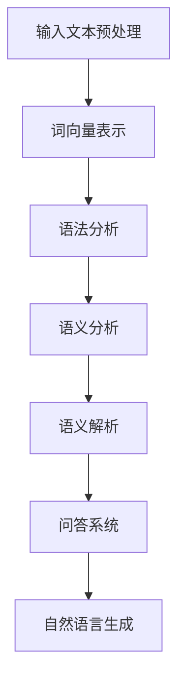
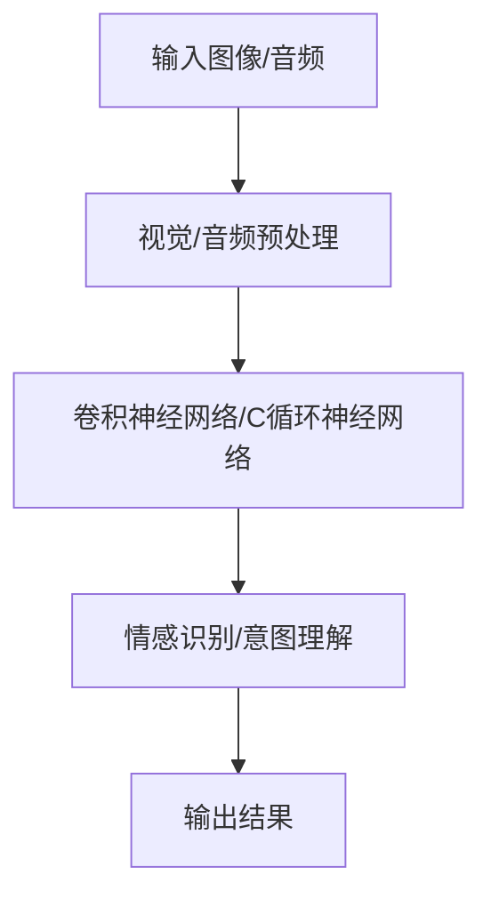
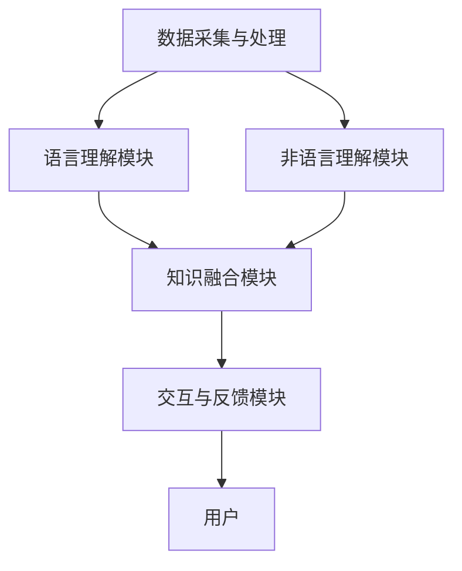
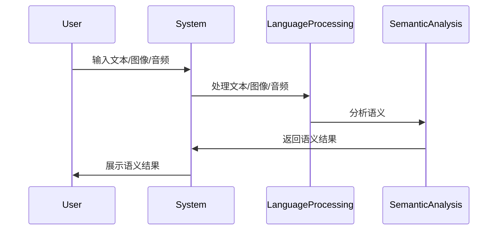

                 

# AGI的跨文化交际能力：语言与非语言理解

> 关键词：AGI，跨文化交际，语言理解，非语言理解，人工智能，交际能力

> 摘要：本文旨在探讨人工智能中的通用智能（AGI）如何实现跨文化交际能力，重点关注语言和非语言理解在其中的重要作用。文章首先介绍了跨文化交际的背景和重要性，然后详细分析了AGI的定义、核心能力及其在跨文化交际中的应用前景。随后，文章深入探讨了语言理解和非语言理解的挑战及其相互作用，并提出了实现AGI跨文化交际能力的策略。通过案例分析，文章展示了AGI在跨文化交际中的实际应用，并提出了未来发展的挑战和展望。

## 第一部分：引言

### 1.1 问题的提出与跨文化交际的重要性

跨文化交际是指在不同文化背景下进行的交流与沟通。在全球化的今天，跨文化交际变得越来越重要。随着国际间贸易、教育、旅游和移民的增加，不同文化背景的人需要更好地理解和沟通。然而，跨文化交际面临诸多挑战，包括语言障碍、文化差异和交际方式的多样性。

**跨文化交际的重要性：**

1. **促进国际交流与合作：** 跨文化交际能够促进不同国家和地区之间的交流与合作，有助于解决国际问题，增进国际友谊。
2. **提升个人竞争力：** 跨文化交际能力是现代职场中的一项重要技能，能够帮助个人在全球化背景下脱颖而出。
3. **提高文化敏感度：** 跨文化交际有助于培养文化敏感度，增进对不同文化的尊重和理解。

### 1.2 AGI的定义与能力

**通用智能（AGI）的定义：** AGI 是一种能够像人类一样进行自主思考、学习、适应和解决问题的智能系统。与当前的人工智能（AI）不同，AGI 具有更广泛的能力，包括语言理解、推理、情感识别、创造性思维等。

**AGI的核心能力：**

1. **语言理解：** AGI 需要具备高水平的人类语言理解能力，能够理解多种语言，并进行自然语言处理。
2. **推理能力：** AGI 应具备强大的逻辑推理能力，能够进行抽象思维和复杂问题求解。
3. **情感识别：** AGI 需要具备情感识别能力，能够理解人类的情感表达和情感状态。
4. **创造性思维：** AGI 应具有创造性思维，能够在未知领域进行探索和创新。

**AGI在跨文化交际中的应用前景：**

1. **语言翻译：** AGI 可以为跨文化交际提供高效的语言翻译服务，消除语言障碍。
2. **文化理解：** AGI 可通过学习不同文化的语言和习俗，增进对不同文化的理解。
3. **交际辅助：** AGI 可以为人们提供跨文化交际的辅助工具，如交际指南、实时翻译等。

### 1.3 跨文化交际能力：语言与非语言理解

跨文化交际能力包括语言理解和非语言理解。语言理解是指对语言符号和语义的理解，而非语言理解则涉及身体语言、面部表情、语调等非语言符号的解读。

**语言理解挑战：**

1. **语言多样性：** 不同语言之间的语法、词汇和语义存在巨大差异，给语言理解带来挑战。
2. **语境理解：** 语言理解需要依赖语境，不同语境下的语义可能发生变化。

**非语言理解挑战：**

1. **文化差异：** 不同文化背景下，身体语言和面部表情的含义可能不同。
2. **情感识别：** 非语言符号中的情感表达可能不明显，给情感识别带来挑战。

语言理解和非语言理解相互作用，共同构成了跨文化交际能力。实现AGI的跨文化交际能力，需要在语言和非语言理解方面取得突破。

### 1.4 书籍结构概述

**本书分为三个部分：**

1. **核心概念与原理：** 详细介绍语言理解和非语言理解的概念、过程和算法原理。
2. **案例分析与应用：** 通过实际案例展示AGI在跨文化交际中的应用。
3. **实现策略与展望：** 探讨实现AGI跨文化交际能力的策略，并提出未来发展的挑战和展望。

读者通过本书可以了解AGI的跨文化交际能力，掌握相关技术和应用方法，为未来的研究和实践提供指导。

## 第二部分：核心概念与原理

### 第2章：语言理解能力

#### 2.1 语言理解的概念

**语言理解（Language Understanding）** 是指智能系统对人类语言符号和语义的理解过程。语言理解涉及多个层面，包括语法、词汇、语义和语境等。

**语言理解的核心要素：**

1. **语法：** 语法是语言的规则体系，指导语言的构成和句子结构。
2. **词汇：** 词汇是语言的基本元素，包括单词和短语。
3. **语义：** 语义是语言符号的含义，涉及词汇、句子和语篇的语义分析。
4. **语境：** 语境是指语言交流发生的具体环境，包括上下文、背景知识等。

**语言理解与跨文化交际的关系：**

语言理解是跨文化交际的基础。不同语言之间的语法、词汇和语义差异可能导致误解和沟通障碍。因此，要实现有效的跨文化交际，智能系统需要具备高水平的语言理解能力。

#### 2.2 语言理解的过程

语言理解过程包括语言输入处理、语言理解模型和语言理解输出。

**语言输入处理：**

1. **语音识别：** 将语音信号转换为文本。
2. **文本预处理：** 对文本进行分词、词性标注、去除停用词等操作。

**语言理解模型：**

1. **词向量表示：** 将单词转换为向量表示，便于计算机处理。
2. **语法分析：** 对句子进行语法结构分析，识别句子成分和关系。
3. **语义分析：** 对句子进行语义分析，理解句子含义。

**语言理解输出：**

1. **语义解析：** 将句子转换为语义表示，便于进一步处理。
2. **问答系统：** 基于语义表示，回答用户的问题。
3. **自然语言生成：** 根据语义表示，生成自然语言文本。

#### 2.3 语言理解的算法原理

**语言理解算法概述：**

语言理解算法主要包括以下几类：

1. **基于规则的算法：** 利用专家知识构建规则，进行语言理解。
2. **基于统计的算法：** 利用统计方法，如隐马尔可夫模型（HMM）、条件随机场（CRF）等，进行语言理解。
3. **基于深度学习的算法：** 利用神经网络，如循环神经网络（RNN）、长短时记忆网络（LSTM）、Transformer等，进行语言理解。

**语言理解的数学模型：**

1. **词向量表示：** 利用词嵌入（Word Embedding）技术，将单词映射到高维向量空间。
2. **语法分析：** 利用依存句法分析（Dependency Parsing）技术，建立句子成分之间的关系。
3. **语义分析：** 利用语义角色标注（Semantic Role Labeling）和语义解析（Semantic Parsing）技术，理解句子含义。

**语言理解的 Mermaid 流程图：**

### 第3章：非语言理解能力

#### 3.1 非语言理解的概念

**非语言理解（Non-Verbal Understanding）** 是指智能系统对非语言符号，如身体语言、面部表情、语调等，的解读和理解能力。非语言理解在跨文化交际中具有重要作用，有助于补充和丰富语言理解。

**非语言理解的核心要素：**

1. **身体语言：** 包括姿态、手势、动作等。
2. **面部表情：** 包括眼睛、嘴巴、面部肌肉等的变化。
3. **语调：** 包括音调、音量、节奏等的变化。

**非语言理解与跨文化交际的关系：**

非语言理解能够帮助智能系统更好地理解跨文化交际中的情感和意图。不同文化背景下，非语言符号的含义可能存在差异，因此，非语言理解是实现跨文化交际的关键。

#### 3.2 非语言理解的过程

非语言理解过程包括非语言输入处理、非语言理解模型和非语言理解输出。

**非语言输入处理：**

1. **视觉处理：** 对视频或图像中的身体语言、面部表情等进行分析。
2. **音频处理：** 对音频信号中的语调、音量等进行分析。

**非语言理解模型：**

1. **卷积神经网络（CNN）：** 用于图像分析，识别面部表情、身体语言等。
2. **循环神经网络（RNN）：** 用于音频分析，识别语调、节奏等。

**非语言理解输出：**

1. **情感识别：** 识别非语言符号中的情感表达。
2. **意图理解：** 理解非语言符号中的意图和动机。

#### 3.3 非语言理解的算法原理

**非语言理解算法概述：**

非语言理解算法主要包括以下几类：

1. **基于规则的算法：** 利用专家知识构建规则，进行非语言理解。
2. **基于统计的算法：** 利用统计方法，如隐马尔可夫模型（HMM）、条件随机场（CRF）等，进行非语言理解。
3. **基于深度学习的算法：** 利用神经网络，如卷积神经网络（CNN）、循环神经网络（RNN）等，进行非语言理解。

**非语言理解的数学模型：**

1. **卷积神经网络（CNN）：** 用于图像分析，识别面部表情、身体语言等。
2. **循环神经网络（RNN）：** 用于音频分析，识别语调、节奏等。

**非语言理解的 Mermaid 流程图：**

## 第三部分：案例分析与应用

### 第4章：案例分析

#### 4.1 案例一：跨文化商务沟通

**案例背景：**

一家中国科技公司与美国客户进行商务沟通，双方使用英语交流。然而，由于文化差异，双方在沟通中经常出现误解。

**案例分析：**

1. **语言理解挑战：** 双方在语法和词汇上没有问题，但语境理解存在挑战。例如，中国人在商务沟通中更注重礼貌和谦虚，而美国人则更直接。
2. **非语言理解挑战：** 面部表情和身体语言在不同文化背景下可能具有不同含义。例如，中国人微笑可能表示礼貌，而美国人微笑则表示友好。

**案例总结：**

通过AGI的语言理解和非语言理解，可以有效解决跨文化商务沟通中的误解。AGI可以通过学习不同文化的语言和习俗，提供跨文化商务沟通的辅助工具，如交际指南、实时翻译等。

#### 4.2 案例二：跨文化教育与学习

**案例背景：**

一名中国学生在国外大学学习，需要与不同文化背景的同学和教授进行交流。然而，由于文化差异，学生经常感到困惑。

**案例分析：**

1. **语言理解挑战：** 学生在语言理解上没有问题，但语境理解存在挑战。例如，西方文化中，直接表达意见被视为尊重，而中国文化中，委婉表达则被视为尊重。
2. **非语言理解挑战：** 面部表情和身体语言在不同文化背景下可能具有不同含义。例如，西方文化中，直视对方表示信任，而中国文化中，直视对方可能被视为不礼貌。

**案例总结：**

通过AGI的语言理解和非语言理解，学生可以更好地适应国外学习环境。AGI可以为学习者提供跨文化交流的辅助工具，如文化指南、实时翻译等，帮助学习者更好地理解和适应不同文化。

#### 4.3 案例三：跨文化社交互动

**案例背景：**

一名中国游客在外国旅游，需要与当地居民和游客进行交流。然而，由于文化差异，游客经常感到困惑。

**案例分析：**

1. **语言理解挑战：** 游客在语言理解上没有问题，但语境理解存在挑战。例如，外国人在交流中可能更注重个人隐私，而中国人在交流中可能更关注家庭和社会关系。
2. **非语言理解挑战：** 面部表情和身体语言在不同文化背景下可能具有不同含义。例如，外国人的微笑可能表示友好，而中国人的微笑可能表示礼貌。

**案例总结：**

通过AGI的语言理解和非语言理解，游客可以更好地适应外国社交环境。AGI可以为游客提供跨文化交流的辅助工具，如文化指南、实时翻译等，帮助游客更好地理解和适应不同文化。

### 第5章：AGI在跨文化交际中的应用

#### 5.1 AGI技术的现状与趋势

**AGI技术的现状：**

目前，AGI技术仍处于探索和研究阶段。虽然一些领域，如自然语言处理（NLP）、计算机视觉和语音识别，已取得显著进展，但实现真正的通用智能仍面临诸多挑战。

**AGI技术的趋势：**

1. **多模态融合：** AGI将融合多种数据模态（如文本、图像、音频），实现更全面的理解。
2. **知识表示与推理：** AGI将发展更有效的知识表示与推理方法，实现更高级的智能行为。
3. **自主学习与适应：** AGI将具备更强的自主学习能力，能够适应不同环境和任务。

**AGI技术在跨文化交际中的应用前景：**

1. **语言翻译：** AGI可以实现高效的语言翻译，消除语言障碍。
2. **文化理解：** AGI可以通过学习不同文化的语言和习俗，增进对不同文化的理解。
3. **交际辅助：** AGI可以为人们提供跨文化交际的辅助工具，如交际指南、实时翻译等。

#### 5.2 AGI在语言理解中的应用

**语言理解的AGI技术：**

AGI在语言理解方面主要依赖于自然语言处理（NLP）技术。NLP技术包括词嵌入、语法分析、语义分析和问答系统等。

**语言理解的AGI技术应用案例：**

1. **实时翻译：** AGI可以通过实时翻译技术，帮助跨文化交际者克服语言障碍。
2. **情感分析：** AGI可以通过情感分析技术，理解跨文化交际中的情感表达。
3. **问答系统：** AGI可以通过问答系统，为跨文化交际者提供即时解答和帮助。

**语言理解的AGI技术挑战与展望：**

1. **多语言支持：** AGI需要支持多种语言，实现真正的跨语言理解。
2. **语境理解：** AGI需要更好地理解语境，避免误解和歧义。
3. **知识融合：** AGI需要融合不同语言和文化的知识，实现更全面的理解。

#### 5.3 AGI在非语言理解中的应用

**非语言理解的AGI技术：**

AGI在非语言理解方面主要依赖于计算机视觉和语音识别技术。计算机视觉技术可以用于识别面部表情和身体语言，语音识别技术可以用于识别语调、音量和节奏等。

**非语言理解的AGI技术应用案例：**

1. **情感识别：** AGI可以通过情感识别技术，理解跨文化交际中的情感表达。
2. **意图理解：** AGI可以通过意图理解技术，理解跨文化交际中的意图和动机。
3. **社交辅助：** AGI可以通过社交辅助技术，为跨文化交际者提供支持和建议。

**非语言理解的AGI技术挑战与展望：**

1. **文化差异：** AGI需要理解不同文化背景下的非语言符号。
2. **准确性：** AGI需要提高非语言理解的准确性和鲁棒性。
3. **实时性：** AGI需要实现实时非语言理解，满足实时跨文化交际的需求。

### 第6章：实现AGI的跨文化交际能力的策略

#### 6.1 数据与算法

**数据集的选择与处理：**

实现AGI的跨文化交际能力，需要大量的数据集。数据集应包括多种语言和文化背景下的跨文化交际场景，如商务沟通、教育和社交互动等。数据处理包括数据清洗、标注和预处理，以提高数据质量和模型的性能。

**算法的优化与调整：**

算法的优化和调整是实现AGI跨文化交际能力的关键。可以通过以下方法进行优化和调整：

1. **模型架构优化：** 采用先进的神经网络架构，如Transformer、BERT等，提高模型的表达能力。
2. **多任务学习：** 结合多个任务，如语言理解和非语言理解，提高模型的泛化能力。
3. **数据增强：** 通过数据增强技术，如数据扩充、数据变换等，增加模型的训练数据。

**实现细节与挑战：**

实现AGI的跨文化交际能力涉及多个技术和领域的交叉，如自然语言处理、计算机视觉、语音识别等。在实现过程中，需要解决以下挑战：

1. **数据隐私：** 在处理跨文化交际数据时，需要保护用户的隐私。
2. **文化适应性：** AGI需要适应不同文化背景下的非语言符号和理解方式。
3. **实时性：** AGI需要实现实时跨文化交际支持，以满足实际应用的需求。

#### 6.2 系统架构设计

**系统架构概述：**

实现AGI的跨文化交际能力需要一个高效、灵活的系统架构。系统架构应包括以下主要组件：

1. **数据采集与处理模块：** 负责收集和预处理跨文化交际数据。
2. **语言理解模块：** 负责语言理解任务，包括文本分析和语义分析等。
3. **非语言理解模块：** 负责非语言理解任务，包括面部表情识别、身体语言识别和语调分析等。
4. **知识融合模块：** 负责整合不同模态的信息，实现跨文化交际理解。
5. **交互与反馈模块：** 负责与用户进行交互，提供实时跨文化交际支持。

**系统功能设计：**

系统应具备以下主要功能：

1. **语言翻译：** 实现跨语言翻译，帮助跨文化交际者克服语言障碍。
2. **情感识别：** 识别跨文化交际中的情感表达，帮助理解交际者的情感状态。
3. **意图理解：** 理解跨文化交际中的意图和动机，提供合理的建议和解决方案。
4. **文化适应：** 根据不同文化背景，提供个性化的跨文化交际支持。

**系统架构设计：**

**系统接口设计和系统交互：**

系统应提供友好的用户界面，方便用户进行交互。系统接口包括：

1. **文本输入接口：** 允许用户输入文本，进行语言理解任务。
2. **图像输入接口：** 允许用户输入图像，进行非语言理解任务。
3. **音频输入接口：** 允许用户输入音频，进行语调分析任务。
4. **结果展示接口：** 展示AGI的跨文化交际理解结果，提供实时建议和解决方案。

## 结论

通过本文的探讨，我们了解了AGI在跨文化交际能力中的重要作用。语言理解和非语言理解是实现AGI跨文化交际能力的关键。在未来的发展中，AGI将不断进步，为跨文化交际提供更加高效、准确和个性化的支持。

### 作者

**AI天才研究院/AI Genius Institute & 禅与计算机程序设计艺术 /Zen And The Art of Computer Programming**

