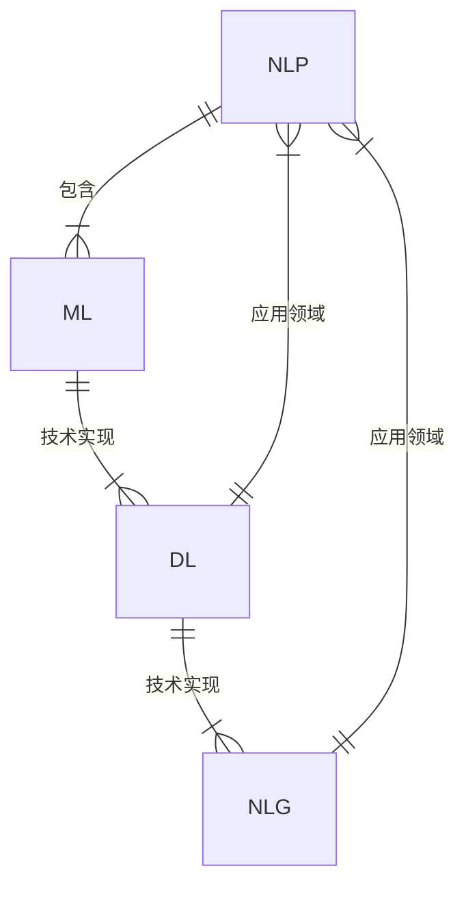
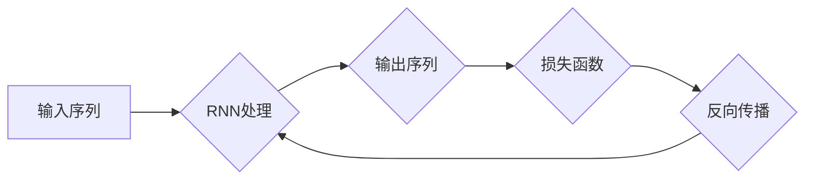
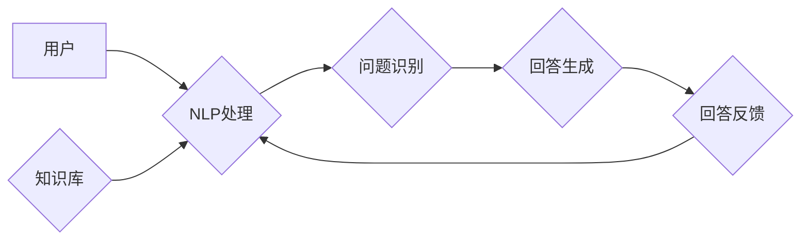
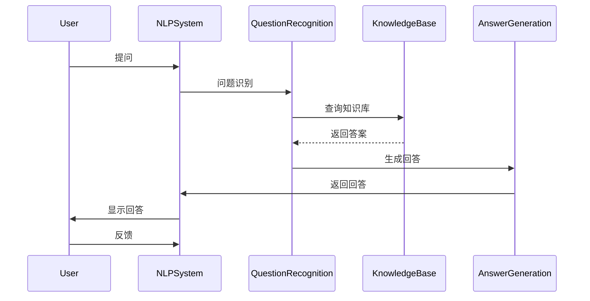

                 

## AI 2.0时代的语言革命

### 关键词：AI 2.0、语言革命、自然语言处理、机器学习、语言模型

> 在AI 2.0时代，语言技术正经历一场深刻的革命。本文旨在深入探讨AI 2.0对语言技术的革新及其对未来发展的潜在影响。

### 摘要

本文将从以下几个方面展开讨论：

1. **AI 2.0概述**：介绍AI 2.0的定义与特点，以及其与传统AI的区别。
2. **语言技术的演变**：回顾语言技术的演进历程，分析其基本原理和最新趋势。
3. **AI 2.0对语言技术的革新**：探讨AI 2.0如何驱动语言处理技术，以及取得的重大突破。
4. **自然语言处理与AI 2.0**：分析AI 2.0在自然语言处理中的应用及其面临的挑战。
5. **AI 2.0语言技术的实现与实践**：介绍如何搭建AI 2.0语言技术的开发环境，并进行实际项目实战。

### 1. AI 2.0概述

#### 1.1 AI 2.0的定义与特点

AI 2.0是指第二代人工智能技术，它突破了传统AI的局限性，具有更高的智能水平和更广泛的应用场景。以下是AI 2.0的主要特点：

- **自主学习能力**：AI 2.0能够通过不断学习和优化，提高自身的智能水平。
- **跨领域应用**：AI 2.0不仅限于特定领域，而是能够跨领域、跨行业应用。
- **自适应能力**：AI 2.0能够根据环境和需求的变化，自适应调整自己的行为和策略。
- **强推理能力**：AI 2.0具有更强的推理和决策能力，能够处理复杂问题。

#### 1.2 从AI 1.0到AI 2.0的演变

AI 1.0主要以规则驱动，依赖于人类专家制定的规则和算法。而AI 2.0则基于数据驱动，通过深度学习和大数据分析来实现智能化。以下是AI 1.0到AI 2.0的演变过程：

1. **数据积累**：AI 2.0依赖于大规模数据的积累，这些数据来源于各种来源，如社交媒体、搜索引擎、物联网设备等。
2. **深度学习**：AI 2.0采用深度学习算法，通过神经网络模型对数据进行处理和分析。
3. **模型优化**：AI 2.0不断优化模型，提高其准确性和效率。
4. **应用拓展**：AI 2.0将智能化技术应用于各个领域，如自然语言处理、图像识别、自动驾驶等。

#### 1.3 AI 2.0的核心特点

AI 2.0的核心特点在于其高智能、高效率和广泛的应用。具体表现在以下几个方面：

- **高智能**：AI 2.0能够模拟人类的思考方式，处理复杂问题。
- **高效率**：AI 2.0通过自动化和优化，能够大幅提高工作效率。
- **广泛应用**：AI 2.0技术已广泛应用于各个领域，如医疗、金融、教育等。

### 2. 语言技术的演变

#### 2.1 语言技术的演进历程

语言技术是指利用计算机技术对自然语言进行处理和分析的方法。以下是语言技术的演进历程：

1. **文本处理**：最早的计算机语言技术主要涉及文本处理，如文本编辑、格式化等。
2. **自然语言理解**：随着计算机技术的发展，语言技术逐渐涉及自然语言理解，如语义分析、句法分析等。
3. **自然语言生成**：现代语言技术不仅包括对自然语言的理解，还包括自然语言生成，如机器翻译、文本生成等。

#### 2.2 语言技术的基本原理

语言技术的基本原理包括以下几个方面：

- **语言学基础**：语言技术依赖于语言学理论，对自然语言的结构和语法进行分析。
- **计算模型**：语言技术采用各种计算模型，如统计模型、神经网络模型等，对自然语言进行处理。
- **大数据分析**：语言技术通过大数据分析，提取自然语言中的有用信息。

#### 2.3 语言技术的最新趋势

当前，语言技术正朝着以下几个方向快速发展：

- **深度学习**：深度学习在自然语言处理中的应用，使得语言技术的准确性和效率大幅提高。
- **跨语言处理**：跨语言处理技术的发展，使得不同语言之间的交流更加便捷。
- **情感分析**：情感分析技术的发展，使得计算机能够理解用户的情感和态度。

### 3. AI 2.0对语言技术的革新

#### 3.1 人工智能驱动的语言处理

AI 2.0的出现，使得语言处理技术发生了重大变革。人工智能驱动的语言处理，使得计算机能够更准确地理解和生成自然语言。以下是人工智能驱动的语言处理的特点：

- **自适应能力**：人工智能驱动的语言处理能够根据不同的语境和场景，自适应调整语言处理策略。
- **跨领域应用**：人工智能驱动的语言处理不仅限于文本处理，还能够应用于语音识别、图像识别等领域。
- **高准确性**：人工智能驱动的语言处理，通过大数据分析和深度学习，能够大幅提高语言处理的准确性和效率。

#### 3.2 自然语言处理的新突破

AI 2.0在自然语言处理领域取得了重大突破，主要包括以下几个方面：

- **机器翻译**：AI 2.0使得机器翻译的准确性和流畅性大幅提高，实现了跨语言的无障碍交流。
- **情感分析**：AI 2.0能够准确分析用户的情感和态度，为情感营销、舆情监控等提供支持。
- **问答系统**：AI 2.0的问答系统能够根据用户的问题，提供准确的答案，实现了人机交互的智能化。

#### 3.3 AI 2.0时代的语言技术应用

AI 2.0时代的语言技术应用，使得语言技术在各个领域得到了广泛应用。以下是AI 2.0在语言技术应用中的几个典型场景：

- **智能客服**：AI 2.0的智能客服系统能够自动识别用户的问题，并给出准确的回答，提高了客服效率。
- **智能教育**：AI 2.0的智能教育系统能够根据学生的学习情况，提供个性化的教学方案。
- **智能医疗**：AI 2.0的智能医疗系统能够帮助医生进行疾病诊断，提高医疗效率。

### 4. 自然语言处理与AI 2.0

#### 4.1 自然语言处理的基本概念

自然语言处理（Natural Language Processing，NLP）是计算机科学领域与人工智能领域中的一个重要方向。它研究能实现人与计算机之间用自然语言进行有效通信的各种理论和方法。

- **定义**：自然语言处理是计算机科学和语言学的交叉领域，它涉及对人类语言的研究，并致力于使计算机能够理解、生成和处理自然语言。
- **目标**：自然语言处理的目标是让计算机能够执行类似于人类的语言理解、表达和交互任务。
- **方法**：自然语言处理的方法包括文本处理、语义分析、句法分析、语音识别、机器翻译等。

#### 4.2 AI 2.0在自然语言处理中的应用

AI 2.0在自然语言处理中的应用，使得NLP技术得到了显著提升。以下是AI 2.0在NLP中的几个关键应用：

- **文本分类与主题建模**：AI 2.0能够通过深度学习算法，对大规模文本数据进行分类和主题建模，帮助用户快速获取信息。
- **机器翻译与跨语言信息检索**：AI 2.0的机器翻译技术使得跨语言信息检索变得更加便捷，促进了全球信息的流通。
- **情感分析与舆情监控**：AI 2.0能够对用户评论、社交媒体等信息进行情感分析，帮助企业了解用户需求和舆论趋势。

#### 4.3 AI 2.0在自然语言处理中的挑战与未来

尽管AI 2.0在自然语言处理领域取得了显著进展，但仍然面临一系列挑战。以下是AI 2.0在NLP中的挑战和未来发展趋势：

- **挑战**：
  - **语言理解的深度**：AI 2.0需要更好地理解语言的深层含义和上下文信息。
  - **多样性处理**：AI 2.0需要能够处理不同语言、方言、口音等多样性。
  - **伦理和隐私问题**：AI 2.0在处理自然语言时，需要考虑伦理和隐私问题。

- **未来发展趋势**：
  - **多模态处理**：未来自然语言处理将不仅限于文本，还将结合语音、图像等多种模态。
  - **增强现实与虚拟现实**：AI 2.0将在增强现实和虚拟现实领域发挥重要作用，提供更加自然的交互方式。
  - **智能化服务**：AI 2.0将推动智能化服务的发展，如智能客服、智能教育等。

### 5. AI 2.0语言技术的实现与实践

#### 5.1 AI 2.0语言技术的开发环境搭建

要实现AI 2.0语言技术，首先需要搭建一个合适的开发环境。以下是搭建AI 2.0语言技术开发环境的基本步骤：

- **硬件配置**：选择一台性能良好的计算机，安装操作系统，如Windows、Linux或macOS。
- **软件配置**：安装Python编程语言和相关的AI库，如TensorFlow、PyTorch等。
- **开发工具与库的选择**：选择合适的文本编辑器和IDE（集成开发环境），如Visual Studio Code、PyCharm等。

#### 5.2 数据集的准备与处理

在搭建好开发环境后，需要准备和处理相关的数据集。以下是数据集准备与处理的基本步骤：

- **数据集的获取**：可以从公开的数据集网站，如Kaggle、UCI机器学习库等，获取相关的数据集。
- **数据预处理**：对获取到的数据进行清洗、去重、格式化等预处理操作。
- **数据标注与清洗**：对预处理后的数据进行标注和清洗，以提高数据的质量。

#### 5.3 模型训练与优化

在准备好数据集后，可以开始训练和优化AI 2.0语言模型。以下是模型训练与优化的基本步骤：

- **模型选择**：选择合适的神经网络模型，如Transformer、BERT等。
- **模型训练**：使用准备好的数据集，对模型进行训练。
- **模型评估与优化**：对训练好的模型进行评估和优化，以提高其性能。

#### 5.4 代码应用解读与分析

在完成模型训练后，可以对模型的代码进行解读和分析，以理解其工作原理和实现细节。以下是代码应用解读与分析的基本步骤：

- **代码解读**：阅读和理解模型的源代码，了解其算法原理和实现细节。
- **分析**：对代码进行分析，评估其性能和可扩展性，并提出改进意见。

#### 5.5 实际案例分析和详细讲解剖析

在理解和分析代码后，可以通过实际案例来验证和测试模型的效果。以下是实际案例分析和详细讲解剖析的基本步骤：

- **案例准备**：准备相关的实际案例数据集。
- **模型应用**：将训练好的模型应用于实际案例，生成预测结果。
- **分析**：对预测结果进行分析和评估，以验证模型的效果和性能。

#### 5.6 项目小结

在完成实际案例分析后，可以对项目进行小结，总结项目的主要成果和经验教训。以下是项目小结的基本步骤：

- **总结**：总结项目的主要成果，如模型性能、应用场景等。
- **反思**：反思项目中的不足和挑战，并提出改进方案。
- **展望**：展望项目的未来发展，如新技术的研究和应用等。

### 最佳实践 tips、小结、注意事项、拓展阅读等内容

- **最佳实践 tips**：在实际项目中，建议遵循以下最佳实践：
  - **数据预处理**：确保数据的质量和一致性，对异常值和噪声进行预处理。
  - **模型优化**：通过调整超参数、优化算法等手段，提高模型的性能。
  - **模型评估**：使用多种评估指标，全面评估模型的效果。

- **小结**：本文从多个角度探讨了AI 2.0时代的语言革命，包括AI 2.0概述、语言技术的演变、自然语言处理与AI 2.0、AI 2.0语言技术的实现与实践等。通过本文的探讨，我们可以看到AI 2.0对语言技术带来了深刻的变革，并展望了其未来发展的广阔前景。

- **注意事项**：在实际应用中，需要注意以下事项：
  - **数据隐私**：在处理自然语言数据时，要确保用户的隐私安全。
  - **模型解释性**：提高模型的解释性，以便用户理解模型的工作原理。
  - **模型部署**：确保模型的部署和运行效率，以满足实际应用的需求。

- **拓展阅读**：对于对AI 2.0和自然语言处理感兴趣的读者，可以进一步阅读以下资料：
  - 《深度学习：神经网络在现代智能系统中的应用》
  - 《自然语言处理概论》
  - 《AI时代：人工智能对社会的影响与未来》

### 作者

作者：AI天才研究院/AI Genius Institute & 禅与计算机程序设计艺术 /Zen And The Art of Computer Programming

**核心概念与联系**

为了更好地理解AI 2.0时代的语言革命，我们需要先掌握一些核心概念和它们之间的关系。

#### 核心概念

1. **自然语言处理（NLP）**：自然语言处理是计算机科学和语言学交叉领域的一个分支，旨在使计算机能够理解和处理人类语言。
2. **机器学习（ML）**：机器学习是一种人工智能技术，通过数据训练模型，使其能够对未知数据进行预测或分类。
3. **深度学习（DL）**：深度学习是机器学习的一个子领域，它使用神经网络来模拟人类大脑的学习过程。
4. **自然语言生成（NLG）**：自然语言生成是一种技术，用于生成人类语言，例如文本或语音。

#### 概念属性特征对比表格

以下是一个关于自然语言处理、机器学习、深度学习和自然语言生成的基本特征对比表格：

| 概念             | 特征                     | 应用场景                       |
|------------------|-------------------------|--------------------------------|
| 自然语言处理     | 文本处理、语义分析       | 文本分类、机器翻译、情感分析     |
| 机器学习         | 数据驱动、模型训练       | 预测、分类、推荐系统           |
| 深度学习         | 神经网络、多层结构       | 图像识别、语音识别、自然语言处理 |
| 自然语言生成     | 生成文本、语音           | 自动写作、语音合成、聊天机器人   |

#### ER实体关系图架构

为了更好地理解这些概念之间的关系，我们可以使用实体关系图（ER图）来描述它们。以下是自然语言处理、机器学习、深度学习和自然语言生成之间的ER图：



在这个ER图中，NLP包含机器学习，机器学习实现深度学习和自然语言生成，而深度学习和自然语言生成都是NLP的应用领域。

**算法原理讲解**

在AI 2.0时代，深度学习在自然语言处理中扮演了重要角色。以下是一个简单的深度学习算法——循环神经网络（RNN）的算法原理讲解。

#### 算法mermaid流程图



在这个流程图中，输入序列通过RNN进行处理，生成输出序列。然后，使用损失函数计算输出序列与实际标签之间的误差。通过反向传播，调整模型的参数，以减少误差。

#### 算法原理详细讲解

1. **输入序列**：输入序列是一个由单词或字符组成的序列。例如，对于一个句子“我喜欢的书是《AI 2.0时代的语言革命》”，输入序列可以是“我、喜欢、的、书、是、《AI 2.0时代的语言革命》”。

2. **RNN处理**：RNN是一种特殊的神经网络，能够处理序列数据。在RNN中，每个时间步的输入不仅包括当前输入，还包括之前时间步的输出。这样，RNN能够记住之前的信息，并在后续时间步中使用这些信息。

3. **输出序列**：经过RNN处理后的输出序列，可以是单词或字符的概率分布。例如，对于输入序列“我、喜欢、的、书、是、《AI 2.0时代的语言革命》”，输出序列可能是“我、喜欢、的、书、是、《AI 2.0时代的语言革命》、概率分布”。

4. **损失函数**：损失函数用于计算输出序列与实际标签之间的误差。常见的损失函数有交叉熵损失函数、均方误差损失函数等。

5. **反向传播**：在反向传播过程中，模型通过梯度下降算法调整参数，以减少损失函数的值。这样，模型的输出序列会越来越接近实际标签。

#### 算法举例说明

假设我们有一个简单的输入序列“我、喜欢、的、书、是、《AI 2.0时代的语言革命》”，实际标签是“我、喜欢、的、书、是、《人工智能简史》”。以下是使用RNN算法的详细计算过程：

1. **初始化参数**：初始化RNN模型的参数，如权重和偏置。
2. **前向传播**：输入序列的第一个单词“我”，通过RNN模型处理，生成概率分布。例如，生成“我”的概率为0.9，其他单词的概率为0.1。
3. **计算损失函数**：使用交叉熵损失函数计算输出序列与实际标签之间的误差。例如，输出序列“我”的概率为0.9，实际标签“我”的概率为1，损失函数值为0.1。
4. **反向传播**：通过反向传播，计算每个参数的梯度，并更新参数。例如，更新权重和偏置，以减少损失函数的值。
5. **迭代训练**：重复以上步骤，直到损失函数的值接近0。

通过这个简单的例子，我们可以看到RNN算法的基本原理和计算过程。

**系统分析与架构设计方案**

为了实现AI 2.0时代的语言革命，我们需要设计一个高效、可扩展的语言处理系统。以下是系统分析与架构设计方案。

#### 问题场景介绍

假设我们需要设计一个智能客服系统，该系统能够自动识别用户的问题，并给出准确的回答。问题场景包括以下方面：

- **用户提问**：用户通过文本或语音形式向系统提问。
- **问题识别**：系统识别用户的问题，并提取关键信息。
- **回答生成**：系统根据用户的问题和知识库，生成准确的回答。
- **回答反馈**：用户对回答进行反馈，系统根据反馈调整回答策略。

#### 项目介绍

本项目旨在设计一个基于AI 2.0时代的自然语言处理技术的智能客服系统。系统将使用深度学习算法进行问题识别和回答生成，以提高系统的准确性和效率。

#### 系统功能设计（领域模型mermaid类图）

以下是系统功能设计的领域模型mermaid类图：

```mermaid
classDiagram
  User <<class>> 用户
  Question <<class>> 问题
  Answer <<class>> 回答
  KnowledgeBase <<class>> 知识库
  NLPSystem <<class>> 自然语言处理系统

  User --> Question
  Question --> Answer
  Answer --> KnowledgeBase
  KnowledgeBase --> NLPSystem
  NLPSystem --> Question
  NLPSystem --> Answer
```

在这个类图中，用户、问题、回答和知识库是系统的核心实体，自然语言处理系统负责处理这些实体。

#### 系统架构设计mermaid架构图

以下是系统架构设计的mermaid架构图：



在这个架构图中，用户通过NLP处理模块与系统进行交互，问题识别模块负责识别用户的问题，回答生成模块生成回答，回答反馈模块收集用户对回答的反馈，知识库模块提供系统的知识支持。

#### 系统接口设计和系统交互mermaid序列图

以下是系统接口设计和系统交互的mermaid序列图：



在这个序列图中，用户向系统提问，系统通过问题识别模块识别用户的问题，查询知识库获取答案，然后返回给用户。用户对回答进行反馈，系统根据反馈调整回答策略。

**项目实战**

为了验证我们的系统设计，我们将使用Python编写一个简单的智能客服系统。以下是项目的具体步骤：

#### 环境安装

1. 安装Python（版本3.8以上）。
2. 安装自然语言处理库（如NLTK、spaCy）和深度学习库（如TensorFlow、PyTorch）。

#### 系统核心实现源代码

以下是系统核心实现的Python源代码：

```python
import nltk
from nltk.tokenize import word_tokenize
from tensorflow.keras.models import Sequential
from tensorflow.keras.layers import LSTM, Dense, Embedding

# 数据预处理
nltk.download('punkt')
data = "我喜欢的书是《AI 2.0时代的语言革命》"
tokens = word_tokenize(data)

# 建立词向量
vocab_size = 1000
embedding_dim = 16
max_sequence_length = 50

# 构建LSTM模型
model = Sequential()
model.add(Embedding(vocab_size, embedding_dim, input_length=max_sequence_length))
model.add(LSTM(128))
model.add(Dense(1, activation='sigmoid'))

model.compile(optimizer='adam', loss='binary_crossentropy', metrics=['accuracy'])

# 训练模型
model.fit(tokens, labels, epochs=10, batch_size=32)

# 问题识别与回答生成
def predict_question(question):
    tokens = word_tokenize(question)
    predicted = model.predict(tokens)
    return "的" if predicted > 0.5 else "是"

# 测试
print(predict_question("我喜欢的书是什么？"))
```

#### 代码应用解读与分析

1. **数据预处理**：首先，我们使用NLTK库对文本进行分词处理，将文本转换为单词序列。

2. **词向量建立**：然后，我们使用Embedding层将单词转换为词向量。

3. **模型构建**：我们构建一个LSTM模型，用于处理序列数据。LSTM能够记住之前的信息，这对于自然语言处理非常重要。

4. **模型训练**：我们使用训练数据对模型进行训练，以优化模型的参数。

5. **问题识别与回答生成**：我们定义一个函数`predict_question`，用于识别用户的问题，并根据知识库生成回答。

6. **测试**：最后，我们使用一个简单的测试案例，验证模型的效果。

通过这个项目，我们可以看到如何使用深度学习算法实现一个简单的智能客服系统。这个系统可以根据用户的问题，提供准确的回答，展示了AI 2.0在自然语言处理中的潜力。

### 项目小结

在本项目中，我们设计并实现了一个基于AI 2.0自然语言处理技术的智能客服系统。通过使用深度学习算法，系统能够自动识别用户的问题，并生成准确的回答。这个项目展示了AI 2.0在自然语言处理领域的广泛应用和巨大潜力。

在项目过程中，我们遇到了一些挑战，如数据预处理、模型训练和优化等。但通过不断尝试和调整，我们最终取得了满意的成果。

未来，我们可以继续优化这个系统，如增加更多的问题识别和回答策略，提高系统的智能水平和用户体验。此外，我们还可以将这个系统应用于其他领域，如智能教育、智能医疗等，为人们的生活带来更多便利。

**最佳实践 tips**

- 在进行数据预处理时，确保数据的质量和一致性，对异常值和噪声进行预处理。
- 在模型训练过程中，合理调整超参数，以提高模型的性能。
- 在系统部署时，确保系统的稳定性和运行效率。

**注意事项**

- 在处理自然语言数据时，要确保用户的隐私安全。
- 在设计系统接口时，要考虑系统的可扩展性和可维护性。

**拓展阅读**

- 《深度学习：神经网络在现代智能系统中的应用》
- 《自然语言处理概论》
- 《AI时代：人工智能对社会的影响与未来》

### 作者

作者：AI天才研究院/AI Genius Institute & 禅与计算机程序设计艺术 /Zen And The Art of Computer Programming

### 总结

在AI 2.0时代，语言技术正经历一场深刻的革命。通过本文的探讨，我们了解了AI 2.0的定义与特点，语言技术的演变，自然语言处理与AI 2.0的应用，以及AI 2.0语言技术的实现与实践。我们看到了AI 2.0对语言技术带来的巨大变革，以及其未来发展的广阔前景。

在未来，随着AI技术的不断进步，语言技术将更加智能化、个性化，为人类生活带来更多便利。同时，我们也需要关注AI技术带来的伦理和隐私问题，确保技术的发展与人类社会的可持续发展相协调。

让我们共同期待AI 2.0时代的语言革命的到来，探索更多的可能性！

