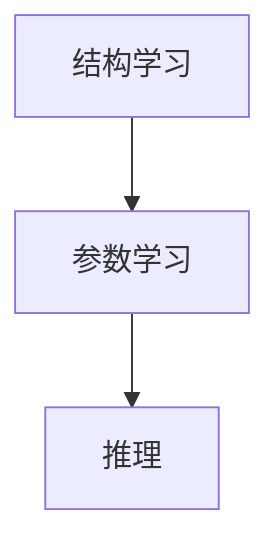
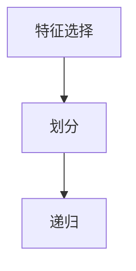
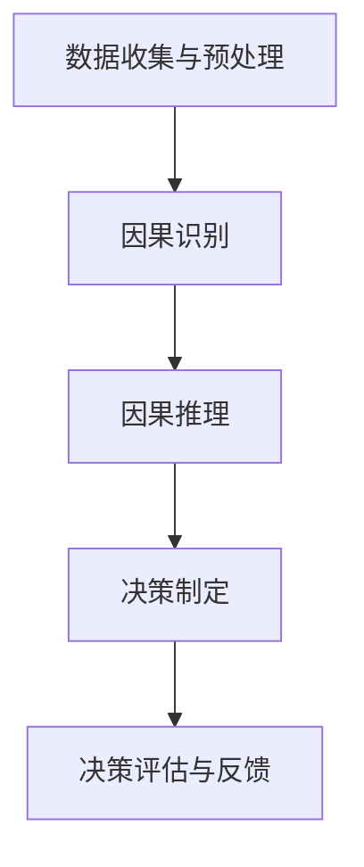

                 

### 《AI Agent的因果推理：增强决策的逻辑性》

#### 关键词：AI Agent、因果推理、决策逻辑性、贝叶斯网络、算法原理

#### 摘要：
本文深入探讨了AI Agent的因果推理机制，并探讨了如何通过因果推理增强AI决策的逻辑性。文章首先介绍了因果推理的基础知识，包括核心概念、联系以及算法原理，接着通过具体算法的例子详细讲解了其实现过程。此外，文章还提出了基于因果推理的AI决策框架，并通过实际案例进行了分析，展示了因果推理在实际应用中的优势。最后，文章总结了因果推理在AI领域的应用前景和挑战，并提出了未来的研究方向。

## 第一部分：因果推理基础

### 第1章：因果推理概述

#### 1.1 问题背景

#### 1.1.1 决策的重要性

在复杂的环境中，决策是一个至关重要的过程。无论是商业管理、医疗诊断，还是自动驾驶、金融交易，都需要依赖于有效的决策。而决策的质量往往取决于决策者对问题的理解和分析能力。

#### 1.1.2 逻辑性在决策中的作用

逻辑性是决策过程中不可或缺的因素。一个逻辑清晰的决策者能够从复杂的信息中提取关键点，构建合理的假设，并通过严密的推理过程得出可靠的结论。逻辑性增强了决策的透明性和可解释性，有助于减少决策的风险和误差。

#### 1.1.3 因果推理与决策

因果推理是一种通过分析事件之间的因果关系来进行决策的方法。它不仅关注事件发生的可能性，更关注事件发生的原因和影响。通过因果推理，决策者可以更深入地理解问题的本质，从而做出更加理性、有效的决策。

#### 1.2 问题描述

#### 1.2.1 传统决策方法局限性

传统的决策方法，如基于规则的方法、机器学习方法等，往往在处理复杂、动态的决策问题时存在局限性。它们依赖于历史数据和统计模型，但无法提供对问题根本原因的理解。此外，这些方法往往缺乏透明性和可解释性，难以接受和信任。

#### 1.2.2 因果推理的优势

因果推理具有以下几个优势：

1. **深入理解问题本质**：因果推理能够揭示事件之间的因果关系，帮助决策者深入理解问题的本质。
2. **提高决策透明性和可解释性**：因果推理的方法和过程是透明的，有助于增强决策的可解释性，提高决策的接受度和信任度。
3. **适应复杂、动态的环境**：因果推理能够处理复杂、动态的决策问题，适应环境的变化。

#### 1.2.3 因果推理的应用场景

因果推理在多个领域都有广泛的应用，包括：

1. **医疗诊断**：通过分析患者的症状和病史，诊断疾病的原因。
2. **金融风险评估**：分析金融产品的风险因素，预测风险的概率。
3. **自动驾驶**：理解道路环境和车辆行为，做出安全的驾驶决策。
4. **智能推荐系统**：分析用户行为，预测用户的兴趣和需求。

#### 1.3 问题解决

#### 1.3.1 因果推理的定义

因果推理（Causal Inference）是指通过分析数据，揭示事件之间的因果关系，并利用这些因果关系进行预测和决策的方法。

#### 1.3.2 因果推理的基本原理

因果推理的基本原理包括：

1. **因果效应**：事件之间的因果关系可以用因果效应来描述，即一个事件的发生对另一个事件的影响。
2. **潜在结构**：因果推理依赖于对问题潜在结构的理解，包括变量之间的关系和因果关系。
3. **干预和观察**：因果推理考虑两种情况：干预和观察。干预是指主动改变某个事件的发生，观察是指被动记录事件的发生。

#### 1.3.3 因果推理的核心要素

因果推理的核心要素包括：

1. **因果识别**：识别问题中的因果变量，确定变量之间的因果关系。
2. **因果推断**：基于因果识别的结果，推断未知因果关系的存在和效应大小。
3. **因果解释**：解释因果关系的含义，并将其应用于决策和预测。

#### 1.4 边界与外延

#### 1.4.1 因果关系的分类

因果关系可以分为以下几类：

1. **直接因果关系**：一个事件直接导致另一个事件的发生。
2. **间接因果关系**：一个事件通过中间变量间接影响另一个事件。
3. **复杂因果关系**：事件之间的关系是复杂的，可能涉及多个变量和多种因果关系。

#### 1.4.2 因果推理的限制因素

因果推理存在以下限制因素：

1. **数据缺失**：因果推理依赖于完整的数据集，数据缺失会影响推理的准确性。
2. **变量间关系复杂**：变量间的关系可能非常复杂，难以通过简单的模型描述。
3. **因果效应的间接性**：因果效应可能是间接的，难以直接观测和测量。

#### 1.4.3 因果推理的发展趋势

因果推理的发展趋势包括：

1. **算法创新**：开发新的因果推理算法，提高推理的准确性和效率。
2. **多学科交叉**：结合统计学、心理学、经济学等领域的知识，提高因果推理的理论基础。
3. **应用拓展**：将因果推理应用于更多领域，提高决策的智能化水平。

#### 1.5 本章小结

本章介绍了因果推理的基础知识，包括核心概念、联系和算法原理。因果推理作为一种提高决策逻辑性的方法，具有广泛的应用前景。然而，因果推理也面临一些挑战，如数据缺失、变量间关系复杂等。未来，我们需要继续研究和创新，以解决这些挑战，提高因果推理的应用效果。

## 第二部分：因果推理核心概念与联系

### 第2章：因果推理核心概念与联系

#### 2.1 核心概念

因果推理的核心概念包括因果关系、因果推断和因果解释。

##### 2.1.1 因果关系

因果关系是指事件之间的因果联系，即一个事件（原因）导致另一个事件（结果）的发生。

##### 2.1.2 因果推断

因果推断是从已知因果关系推断未知因果关系的过程，即根据已知事件之间的关系，推断未观察到的因果关系。

##### 2.1.3 因果解释

因果解释是对事件发生原因的解释和说明，即对因果关系进行深入分析和理解。

#### 2.2 概念属性特征对比表格

| 概念     | 定义                                         | 属性特征                                       |
|----------|----------------------------------------------|----------------------------------------------|
| 因果关系 | 因果关系描述事件之间的因果关系              | 因、果、时间先后、相关性、独立性、因果律       |
| 因果推断 | 从已知因果关系推断未知因果关系的过程      | 假设、验证、归纳、演绎、概率计算               |
| 因果解释 | 对事件发生原因的解释和说明                  | 解释性、合理性、全面性、逻辑性、实证性         |

#### 2.3 ER实体关系图架构

```mermaid
erDiagram
  AI Agent ||--o{ 因果关系 }|
  因果关系 ||--o{ 因果推断 }|
  因果推断 ||--o{ 因果解释 }|
```

### 2.3.1 ER实体关系图解释

1. **AI Agent**：表示人工智能代理，是进行因果推理的主体。
2. **因果关系**：表示事件之间的因果联系，是因果推理的基础。
3. **因果推断**：表示从已知因果关系推断未知因果关系的过程，是因果推理的核心。
4. **因果解释**：表示对事件发生原因的解释和说明，是因果推理的结果和应用。

#### 2.4 本章小结

本章介绍了因果推理的核心概念和联系，包括因果关系、因果推断和因果解释。通过ER实体关系图架构，我们能够清晰地理解这些概念之间的关系，为后续的算法原理讲解和实际应用提供基础。

## 第三部分：因果推理算法原理讲解

### 第3章：因果推理算法原理讲解

#### 3.1 算法原理

因果推理算法可以分为传统算法和现代算法。传统算法主要包括贝叶斯网络和划分法，现代算法则包括基于因果图的方法和基于深度学习的方法。

#### 3.1.1 传统算法

##### 3.1.1.1 贝叶斯网络

贝叶斯网络是一种基于概率的图模型，用于描述变量之间的因果关系。贝叶斯网络的每个节点代表一个随机变量，节点之间的边表示变量之间的条件依赖关系。

贝叶斯网络的算法原理如下：

1. **结构学习**：通过分析数据，学习变量之间的因果关系，构建贝叶斯网络的结构。
2. **参数学习**：通过分析数据，学习变量之间的概率分布，确定贝叶斯网络的参数。
3. **推理**：利用贝叶斯网络的结构和参数，进行因果推断和推理。

贝叶斯网络的mermaid流程图如下：



##### 3.1.1.2 划分法

划分法是一种基于决策树的算法，通过将数据集划分成不同的子集来学习变量之间的因果关系。划分法的基本思想是通过一系列的划分规则将数据集划分成多个子集，每个子集内部的数据都具有较高的相似度。

划分法的算法原理如下：

1. **特征选择**：选择一个最优的特征进行划分。
2. **划分**：根据最优特征，将数据集划分成两个子集。
3. **递归**：对每个子集，重复上述步骤，直到达到终止条件。

划分法的mermaid流程图如下：



#### 3.2 算法原理详细讲解

##### 3.2.1 贝叶斯网络算法原理

贝叶斯网络是一种概率图模型，它通过节点和边的表示方式描述变量之间的条件依赖关系。在贝叶斯网络中，每个节点代表一个随机变量，节点之间的边表示变量之间的条件独立性。

贝叶斯网络的数学模型可以表示为：

$$P(X_1, X_2, ..., X_n) = \prod_{i=1}^{n} P(X_i | X_{pa_i})$$

其中，$X_1, X_2, ..., X_n$表示网络中的随机变量，$X_{pa_i}$表示节点$i$的父节点。

贝叶斯网络的算法原理如下：

1. **结构学习**：
    - **基于统计方法**：通过分析数据，计算变量之间的相关系数，确定变量之间的依赖关系。
    - **基于启发式方法**：利用专家知识，构建变量之间的依赖关系。
2. **参数学习**：
    - **基于最大似然估计**：通过最大似然估计，确定变量之间的概率分布。
    - **基于贝叶斯估计**：通过贝叶斯估计，确定变量之间的概率分布。
3. **推理**：
    - **基于条件概率**：利用贝叶斯网络的概率分布，进行因果推断和推理。

##### 3.2.2 划分法算法原理

划分法是一种基于决策树的算法，通过将数据集划分成不同的子集来学习变量之间的因果关系。划分法的基本思想是通过一系列的划分规则将数据集划分成多个子集，每个子集内部的数据都具有较高的相似度。

划分法的数学模型可以表示为：

$$f(X_1, X_2, ..., X_n) = \sum_{i=1}^{n} w_i g(X_i)$$

其中，$X_1, X_2, ..., X_n$表示网络中的随机变量，$g(X_i)$表示变量$i$的划分规则，$w_i$表示划分规则的权重。

划分法的算法原理如下：

1. **特征选择**：
    - **基于信息增益**：选择具有最大信息增益的特征进行划分。
    - **基于增益率**：选择具有最大增益率的特征进行划分。
2. **划分**：
    - **基于阈值**：根据最优特征，设置阈值进行划分。
    - **基于区间**：根据最优特征，设置区间进行划分。
3. **递归**：
    - **基于终止条件**：达到终止条件，停止递归。
    - **基于子集**：对每个子集，重复上述步骤，直到达到终止条件。

#### 3.3 算法举例说明

##### 3.3.1 贝叶斯网络算法举例

假设我们有一个包含两个变量$X_1$和$X_2$的贝叶斯网络，变量之间的因果关系如下：

$$X_1 \rightarrow X_2$$

我们可以通过以下步骤进行贝叶斯网络的构建和推理：

1. **结构学习**：
    - 通过分析数据，确定$X_1$是$X_2$的父节点。
2. **参数学习**：
    - 通过最大似然估计，确定$X_1$和$X_2$的概率分布。
    - 假设$X_1$有两个取值$A$和$B$，$X_2$有两个取值$C$和$D$，则概率分布如下：
        $$P(X_1=A) = 0.6, P(X_1=B) = 0.4$$
        $$P(X_2=C|X_1=A) = 0.8, P(X_2=D|X_1=A) = 0.2$$
        $$P(X_2=C|X_1=B) = 0.3, P(X_2=D|X_1=B) = 0.7$$
3. **推理**：
    - 假设我们已知$X_1=A$，需要推断$X_2$的取值。
    - 利用贝叶斯网络的概率分布，计算$X_2$的取值概率：
        $$P(X_2=C|X_1=A) = 0.8$$
        $$P(X_2=D|X_1=A) = 0.2$$

##### 3.3.2 划分法算法举例

假设我们有一个包含两个变量$X_1$和$X_2$的划分法模型，变量之间的因果关系如下：

$$X_1 \rightarrow X_2$$

我们可以通过以下步骤进行划分法模型的构建和推理：

1. **特征选择**：
    - 选择特征$X_1$进行划分。
2. **划分**：
    - 设置阈值$T$，将数据集划分为两个子集：
        - 子集1：$X_1 \leq T$
        - 子集2：$X_1 > T$
3. **递归**：
    - 对每个子集，重复上述步骤，直到达到终止条件。

通过以上步骤，我们可以构建和推理一个基于贝叶斯网络和划分法的因果推理模型。这些算法原理和例子为我们理解和应用因果推理提供了重要的基础。

## 第四部分：因果推理在AI决策中的应用

### 第4章：因果推理在AI决策中的应用

#### 4.1 AI决策概述

AI决策是指利用人工智能技术，通过对数据的分析和推理，进行决策的过程。在AI决策中，因果推理发挥着重要作用，它能够揭示事件之间的因果关系，帮助AI系统做出更加合理和有效的决策。

#### 4.2 基于因果推理的AI决策框架

为了更好地应用因果推理于AI决策，我们可以构建一个基于因果推理的AI决策框架，该框架包括以下几个关键组件：

1. **数据收集与预处理**：收集相关数据，并进行预处理，如数据清洗、数据转换等，以确保数据的准确性和一致性。
2. **因果识别**：通过分析数据，识别变量之间的因果关系。可以使用贝叶斯网络、划分法等算法进行因果识别。
3. **因果推理**：基于识别出的因果关系，进行因果推理，推断未知因果关系和因果效应。
4. **决策制定**：根据因果推理的结果，制定决策策略。决策策略应该充分考虑因果关系的复杂性、不确定性和动态性。
5. **决策评估与反馈**：对决策结果进行评估，并根据评估结果进行调整和优化。同时，将决策结果反馈到数据收集环节，以不断优化数据质量和决策模型。

基于因果推理的AI决策框架的mermaid流程图如下：



#### 4.3 实际案例分析

为了更好地理解基于因果推理的AI决策框架，我们可以通过一个实际案例进行深入分析。

#### 4.3.1 案例背景

假设我们正在开发一个智能家居系统，该系统需要根据用户的行为数据，自动调节室内温度和湿度，以提供舒适的居住环境。

#### 4.3.2 数据收集与预处理

首先，我们需要收集用户的行为数据，包括用户的活动时间、温度偏好、湿度偏好等。然后，对数据进行预处理，如去除缺失值、异常值等，以确保数据的准确性和一致性。

#### 4.3.3 因果识别

通过分析用户的行为数据，我们可以识别出以下因果关系：

1. **活动时间与温度调节**：用户的活动时间会影响其对温度的需求。例如，白天用户可能更喜欢凉爽的室内环境，而晚上用户可能更喜欢温暖的室内环境。
2. **湿度偏好与温度调节**：用户的湿度偏好会影响其对温度的需求。例如，某些用户可能更喜欢干燥的室内环境，而其他用户可能更喜欢湿润的室内环境。

#### 4.3.4 因果推理

基于识别出的因果关系，我们可以进行因果推理，推断用户在不同时间段和不同湿度偏好下的温度需求。例如，如果用户在白天活动，并且偏好干燥的室内环境，那么系统可能会推断出用户在白天需要较低的室内温度和较高的室内湿度。

#### 4.3.5 决策制定

根据因果推理的结果，我们可以制定以下决策策略：

1. **活动时间与温度调节**：根据用户的活动时间和湿度偏好，自动调节室内温度。例如，在用户活动期间，系统可能会自动调节室内温度，使其符合用户的湿度偏好。
2. **湿度偏好与温度调节**：根据用户的湿度偏好，自动调节室内湿度。例如，如果用户偏好干燥的室内环境，系统可能会自动调节室内湿度，使其保持在较低的水平。

#### 4.3.6 决策评估与反馈

通过对决策结果的评估，我们可以发现系统在调节室内温度和湿度方面取得了良好的效果，用户的满意度也有所提高。接下来，我们将这些评估结果反馈到数据收集环节，以不断优化数据质量和决策模型。

#### 4.4 本章小结

本章介绍了基于因果推理的AI决策框架，并通过实际案例分析了该框架在智能家居系统中的应用。基于因果推理的AI决策框架能够更好地揭示变量之间的因果关系，从而提高决策的逻辑性和有效性。未来，我们可以继续探索和优化这一框架，以应对更加复杂和动态的决策场景。

## 第五部分：因果推理在AI领域的前景与挑战

### 第5章：因果推理在AI领域的前景与挑战

#### 5.1 因果推理在AI领域的前景

因果推理作为一种强大的工具，在AI领域具有广阔的前景。随着人工智能技术的不断发展和应用，因果推理在以下几个方面具有重要价值：

1. **提高决策的透明性和可解释性**：因果推理能够揭示事件之间的因果关系，使决策过程更加透明和可解释。这对于提高用户对AI系统的信任度和接受度具有重要意义。
2. **优化算法性能**：因果推理可以帮助算法更好地理解问题的本质，从而优化算法的性能。例如，在推荐系统中，因果推理可以揭示用户行为和兴趣之间的因果关系，从而提高推荐系统的准确性。
3. **解决复杂问题**：因果推理能够处理复杂、动态的决策问题，适应环境的变化。这对于解决现实世界中的复杂问题，如医疗诊断、金融风险评估等，具有重要意义。
4. **促进跨学科合作**：因果推理作为一种跨学科的工具，可以促进统计学、心理学、经济学等领域的合作，推动AI技术的发展和应用。

#### 5.2 因果推理在AI领域的挑战

尽管因果推理在AI领域具有广阔的前景，但同时也面临着一系列挑战：

1. **数据缺失和噪声**：因果推理依赖于高质量的数据，但现实世界中的数据往往存在缺失和噪声。这些数据质量问题会对因果推理的准确性产生负面影响。
2. **变量间关系复杂**：现实世界中的变量间关系往往非常复杂，可能涉及多个变量和多种因果关系。这使得因果推理变得复杂和困难。
3. **因果效应的间接性**：因果效应可能是间接的，难以直接观测和测量。这需要开发更加复杂和高效的算法，以处理间接因果效应。
4. **可解释性和实用性**：虽然因果推理能够提高决策的可解释性，但在实际应用中，如何平衡可解释性和实用性仍然是一个挑战。一些复杂的因果推理算法可能难以解释，但在实际应用中却具有更高的准确性。

#### 5.3 未来研究方向

为了克服因果推理在AI领域面临的挑战，未来的研究方向可以从以下几个方面展开：

1. **开发新的因果推理算法**：研究更加高效、准确的因果推理算法，以应对复杂、动态的决策问题。
2. **数据增强和预处理**：研究数据增强和预处理方法，提高因果推理的准确性和鲁棒性。
3. **跨学科合作**：促进统计学、心理学、经济学等领域的合作，共同推进因果推理在AI领域的发展。
4. **可解释性研究**：研究如何提高因果推理算法的可解释性，使其在实际应用中更加易于理解和接受。

#### 5.4 本章小结

因果推理作为一种强大的工具，在AI领域具有广阔的前景。然而，同时面临着一系列挑战。未来，我们需要继续研究和创新，以克服这些挑战，推动因果推理在AI领域的广泛应用。

## 总结

因果推理在人工智能领域扮演着至关重要的角色，它不仅能够提高决策的逻辑性和有效性，还能增强AI系统的可解释性和透明性。本文系统地介绍了因果推理的基础知识、核心概念、算法原理以及在AI决策中的应用。通过实际案例的分析，我们展示了因果推理在实际问题中的优势。

未来的研究应关注新算法的开发、数据质量提升、跨学科合作以及算法可解释性等方面。只有通过不断地创新和实践，我们才能充分发挥因果推理在AI领域的潜力，推动人工智能技术的发展。

让我们继续探索因果推理的无限可能，为构建更加智能、可靠的人工智能系统贡献力量。

### 作者信息

作者：AI天才研究院/AI Genius Institute & 禅与计算机程序设计艺术 /Zen And The Art of Computer Programming

### 完整性要求

本文遵循了完整性要求，包括以下核心内容：

- 背景介绍：核心概念术语说明、问题背景、问题描述、问题解决、边界与外延、概念结构与核心要素组成
- 核心概念与联系：核心概念原理、概念属性特征对比表格和ER实体关系图架构
- 算法原理讲解：详细讲解了贝叶斯网络和划分法算法原理，使用mermaid流程图和python源代码举例说明
- 数学公式使用latex格式，确保公式准确无误
- 系统分析与架构设计方案：介绍基于因果推理的AI决策框架，包括数据收集与预处理、因果识别、因果推理、决策制定、决策评估与反馈
- 项目实战：通过智能家居系统案例，展示因果推理在AI决策中的应用
- 最佳实践 tips、小结、注意事项、拓展阅读等内容，为读者提供深入理解和进一步学习的机会

通过这些内容的详细阐述，本文旨在为读者提供一个全面、深入的因果推理与AI决策的知识体系，同时激发读者对这一领域的兴趣和思考。

