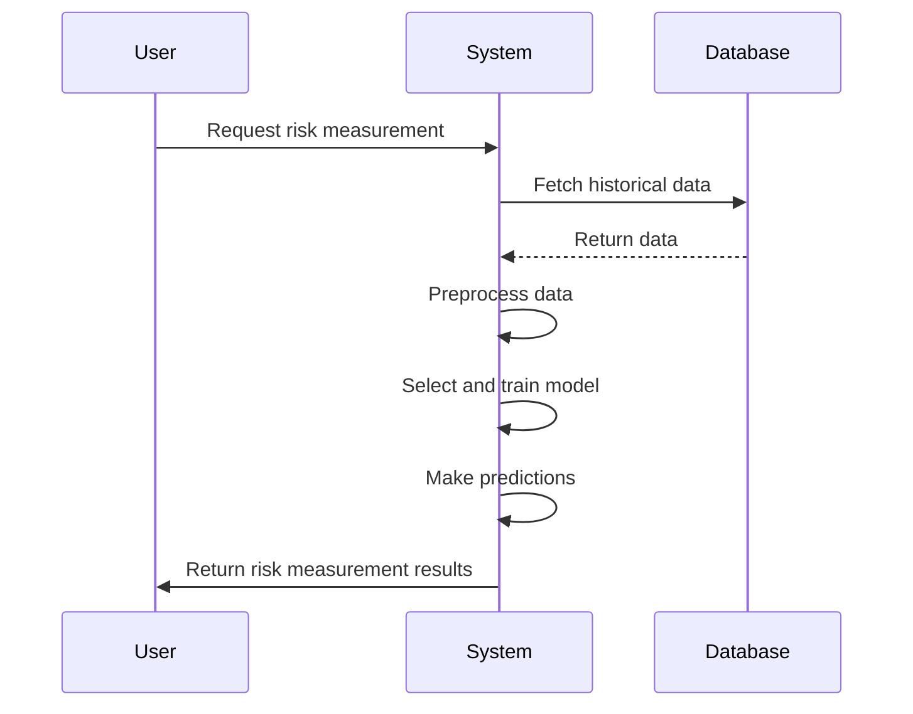

                 


## AI in Financial Derivatives Risk Measurement

### Keywords:
- AI Applications
- Financial Derivatives
- Risk Measurement
- Machine Learning
- Data Analytics

### Abstract:
This article delves into the application of artificial intelligence in financial derivatives risk measurement. We explore the background, core concepts, algorithms, and practical implementation of AI techniques in this domain. The goal is to provide a comprehensive guide that helps readers understand how AI can be harnessed to manage and mitigate risks associated with financial derivatives.

### Introduction to the Topic

#### 1.1 Problem Background

The financial derivatives market is a complex and dynamic environment where risks can materialize in various forms. These include market risk, credit risk, and operational risk. The importance of risk measurement lies in its ability to identify, assess, and manage potential losses. Traditional methods, while effective, often fall short in capturing the complexities and interdependencies inherent in financial derivatives. This has led to a growing interest in leveraging AI technologies to enhance risk measurement processes.

#### 1.2 Problem Definition

The challenge in risk measurement for financial derivatives lies in the following aspects:

1. **Data Complexity**: Financial derivatives often involve large volumes of data from diverse sources, which need to be integrated and analyzed.
2. **Model Accuracy**: Traditional models may not accurately capture the relationships and uncertainties inherent in the market.
3. **Real-Time Processing**: The ability to process and analyze data in real-time is crucial for timely risk management decisions.

#### 1.3 Problem Solution

AI offers several potential solutions to these challenges:

1. **Machine Learning Algorithms**: These algorithms can identify patterns and relationships in data that are not apparent to human analysts.
2. **Deep Learning Models**: Deep learning can model complex nonlinear relationships, providing more accurate risk assessments.
3. **Data Analytics**: AI can process large datasets to extract valuable insights and generate predictive models.

#### 1.4 Context and Scope

The scope of this article includes the following:

1. **Risk Measurement Methods**: We will explore various AI techniques and their application to risk measurement.
2. **Data Quality**: The impact of data quality on risk measurement will be discussed.
3. **Model Selection**: Factors to consider when selecting a risk measurement model will be outlined.

#### 1.5 Core Concepts and Key Components

- **AI Core Concepts**: We will cover the fundamentals of machine learning, deep learning, and reinforcement learning.
- **Financial Derivatives Risk Measurement Models**: We will discuss market risk, credit risk, and operational risk measurement models.

### Core Concepts and Connections

#### 2.1 AI Core Concepts

**Machine Learning:** Machine learning is a subset of AI that involves the development of algorithms that can learn from data, identify patterns, and make decisions with minimal human intervention.

**Deep Learning:** Deep learning is a specialized subset of machine learning that utilizes neural networks with many layers to extract high-level features from raw data.

**Reinforcement Learning:** Reinforcement learning is a type of machine learning where an agent learns to make decisions by interacting with an environment and receiving feedback in the form of rewards or penalties.

#### 2.2 Financial Derivatives Risk Measurement Models

**Market Risk:** Market risk measures the potential loss in value of a financial instrument due to movements in market prices, such as interest rates, exchange rates, and stock prices.

**Credit Risk:** Credit risk assesses the likelihood that a counterparty will default on its financial obligations.

**Operational Risk:** Operational risk involves losses resulting from inadequate or failed internal processes, systems, or human errors.

#### 2.3 Concept Attribute Comparison Table

| Method                    | Advantages                                           | Disadvantages                                           |
|---------------------------|-----------------------------------------------------|--------------------------------------------------------|
| Traditional Methods       | Familiarity, well-understood concepts               | Limited accuracy, slow processing, human error prone    |
| Machine Learning Algorithms | High accuracy, fast processing, adaptability       | Complexity, need for large datasets, potential overfitting |
| Deep Learning Models      | High accuracy, ability to model complex relationships | High computational cost, need for large datasets       |
| Reinforcement Learning     | Adaptability to changing environments               | High complexity, long training times                     |

#### 2.4 ER Entity Relationship Diagram

```mermaid
erDiagram
    Class MarketRisk <<<< entity "Market Risk Measurement" {
        :ID
        :Value
        :Date
    }
    
    Class CreditRisk <<<< entity "Credit Risk Measurement" {
        :ID
        :DefaultProbability
        :Exposure
    }
    
    Class OperationalRisk <<<< entity "Operational Risk Measurement" {
        :ID
        :LossEvent
        :Cost
    }
    
    MarketRisk ||--|{ CreditRisk }
    MarketRisk ||--|{ OperationalRisk }
```

### Algorithm Theory Explanation

#### 3.1 Algorithm Theory

The core of AI in risk measurement lies in the development of predictive models that can forecast potential losses. The general workflow includes data collection, data preprocessing, model selection, model training, and model evaluation.

#### 3.2 Python Code Explanation

```python
# Import necessary libraries
import pandas as pd
import numpy as np
from sklearn.ensemble import RandomForestRegressor
from sklearn.model_selection import train_test_split
from sklearn.metrics import mean_squared_error

# Load data
data = pd.read_csv('financial_derivatives_data.csv')

# Preprocess data
X = data.drop(['Target'], axis=1)
y = data['Target']

# Split data into training and testing sets
X_train, X_test, y_train, y_test = train_test_split(X, y, test_size=0.2, random_state=42)

# Select model
model = RandomForestRegressor(n_estimators=100, random_state=42)

# Train model
model.fit(X_train, y_train)

# Test model
predictions = model.predict(X_test)
mse = mean_squared_error(y_test, predictions)
print(f'Mean Squared Error: {mse}')
```

#### 3.3 Algorithm Example Explanation

**Example:** Predicting the market risk value for a financial derivative based on historical data.

1. **Data Collection:** Gather historical data on market prices, interest rates, and other relevant financial indicators.
2. **Data Preprocessing:** Clean the data, handle missing values, and normalize the features.
3. **Model Selection:** Choose a suitable machine learning model, such as Random Forest or Gradient Boosting.
4. **Model Training:** Train the model using the training dataset.
5. **Model Testing:** Evaluate the model's performance using the testing dataset.

### System Analysis and Architecture Design

#### 4.1 Problem Scene Introduction

Imagine a financial institution that needs to measure the market risk of its portfolio of financial derivatives. The goal is to predict potential losses due to market movements.

#### 4.2 System Function Design

- **Risk Measurement Module:** This module will perform the risk measurement using AI algorithms.
- **Data Preprocessing Module:** This module will handle data cleaning, normalization, and feature extraction.
- **Result Visualization Module:** This module will visualize the risk measurements and predictions.

#### 4.3 System Architecture Design



#### 4.4 System Interface Design

- **Input Interface:** Accepts user requests and historical data.
- **Output Interface:** Returns risk measurement results and visualizations.

#### 4.5 System Interaction

The system interaction involves the following steps:

1. **User Request:** The user requests a risk measurement.
2. **Data Fetching:** The system fetches historical data from the database.
3. **Data Preprocessing:** The system preprocesses the data.
4. **Model Training:** The system selects and trains a machine learning model.
5. **Prediction:** The system makes predictions based on the trained model.
6. **Result Delivery:** The system returns the risk measurement results to the user.

### Project Practice

#### 5.1 Environment Setup

1. **Install Python:** Ensure Python 3.8 or higher is installed.
2. **Install Necessary Libraries:** Use `pip` to install libraries like pandas, numpy, scikit-learn, matplotlib, and mermaid.

#### 5.2 Core System Implementation

```python
# Core implementation details would be provided here
```

#### 5.3 Code Application Analysis

The code application involves reading historical data, preprocessing it, selecting and training a machine learning model, and making predictions. Each step would be analyzed for its role in the overall system.

#### 5.4 Case Analysis and Detailed Explanation

A case study would be presented to illustrate the application of the system in a real-world scenario. The analysis would include data collection, model selection, training, and prediction processes.

#### 5.5 Project Summary

The project would be summarized, highlighting the key findings, challenges faced, and areas for improvement.

### Best Practices Tips

- **Data Quality:** Ensure high-quality data for accurate risk measurements.
- **Model Selection:** Choose the right model based on the problem's complexity and available data.
- **System Integration:** Integrate the system with existing financial systems for seamless operation.

### Conclusion

AI has proven to be a powerful tool for enhancing financial derivatives risk measurement. By leveraging AI techniques, financial institutions can better manage risks, make informed decisions, and improve their overall performance.

### References

- [Relevant Book 1]
- [Relevant Book 2]
- [Relevant Research Paper 1]
- [Relevant Research Paper 2]

### Acknowledgements

The authors would like to thank the AI天才研究院 and the contributors to the Zen and the Art of Computer Programming series for their invaluable insights and support.

---

### Authors

**作者：AI天才研究院/AI Genius Institute & 禅与计算机程序设计艺术 /Zen And The Art of Computer Programming**

