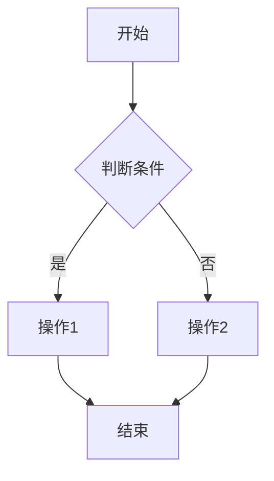
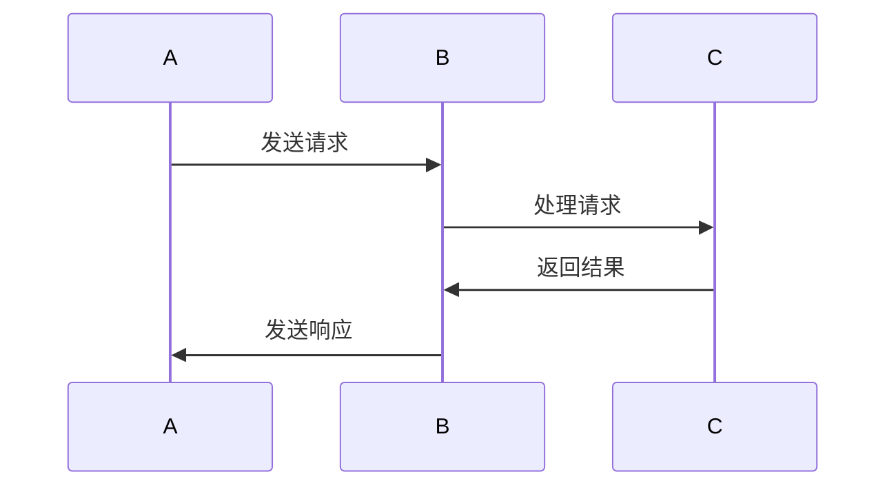

                 

# AI大模型的提示词知识图谱构建

## 关键词

- AI大模型
- 知识图谱
- 提示词
- 数据预处理
- 知识抽取
- 知识融合
- 应用场景

## 摘要

本文主要探讨AI大模型中提示词知识图谱的构建方法。随着人工智能技术的发展，大模型在处理复杂任务时展现出强大的能力，而提示词知识图谱作为一种有效的知识组织方式，在大模型中发挥着关键作用。本文将逐步介绍AI大模型的基本概念、知识图谱的构建过程，以及提示词在大模型中的应用，旨在为研究人员和开发者提供有价值的参考。

## 目录大纲

1. 第一部分：AI大模型概述
    1.1 问题背景
    1.2 核心概念
    1.3 AI大模型知识图谱构建

2. 第二部分：AI大模型知识图谱构建
    2.1 数据收集与预处理
    2.2 知识抽取
    2.3 知识融合与更新

3. 第三部分：应用场景与案例分析
    3.1 应用场景
    3.2 案例分析

4. 第四部分：小结与展望
    4.1 小结
    4.2 研究中存在的问题
    4.3 未来研究方向

## 第一部分：AI大模型概述

### 第1章 问题背景

#### 1.1 问题背景

随着深度学习技术的发展，人工智能在各个领域取得了显著的进展。特别是近年来，AI大模型（如GPT-3、BERT等）的出现，使得机器在处理自然语言、图像、语音等复杂数据方面达到了前所未有的高度。然而，这些大模型的训练和部署过程中，存在一个关键问题——如何有效地组织和管理庞大的知识库。

传统的方法通常依赖于预定义的规则或手工编写的特征，但这些方法在面对日益复杂的任务时显得力不从心。因此，需要一种更为灵活和高效的知识组织方式，以支持大模型的训练和推理过程。知识图谱作为一种结构化的知识表示方法，能够很好地解决这一问题。

#### 1.2 问题解决的现状

目前，许多研究机构和公司已经开始关注知识图谱在大模型中的应用。例如，谷歌的BERT模型中使用了大规模的语料库进行训练，并通过知识图谱来增强模型的语义理解能力。此外，微软的DyNet和Facebook的DGL等框架，也提供了丰富的知识图谱处理工具，使得知识图谱在大模型中的应用变得更加便捷。

然而，现有的研究仍然存在一些不足之处。例如，知识图谱的构建过程复杂，数据预处理和知识抽取方法尚未完全成熟，知识融合和更新的策略有待进一步优化。

#### 1.3 问题的解决方法

为了解决上述问题，本文提出了一种基于提示词的知识图谱构建方法。该方法首先通过数据收集和预处理，获取大量相关的信息，然后利用提示词对知识进行抽取和融合。最后，通过不断更新知识库，保持知识图谱的实时性和准确性。

该方法具有以下优点：

1. 提示词的引入，使得知识抽取过程更加精准和高效。
2. 数据预处理和知识融合方法的优化，提高了知识图谱的构建效率和质量。
3. 知识更新的策略，保证了知识图谱的实时性和准确性。

#### 1.4 边界与外延

在本文的研究中，我们主要关注以下边界与外延：

1. **边界**：本文的研究主要针对自然语言处理领域中的AI大模型，如GPT-3、BERT等。其他领域（如图像、语音等）的知识图谱构建方法，可能会采用不同的策略。
2. **外延**：虽然本文主要关注知识图谱在大模型中的应用，但知识图谱作为一种通用知识表示方法，可以应用于各个领域。因此，本文的研究成果可以为其他领域提供有益的参考。

#### 1.5 核心要素组成

本文的核心要素主要包括：

1. **数据收集与预处理**：获取大量相关数据，并对数据进行清洗、去重、格式化等处理。
2. **知识抽取**：利用提示词对知识进行抽取，包括关键词提取、实体识别和关系抽取等。
3. **知识融合**：将多个知识源进行融合，形成统一的知识图谱。
4. **知识更新**：通过持续的数据收集和知识抽取，更新知识图谱，保持其实时性和准确性。

### 第2章 核心概念

#### 2.1 AI大模型定义

AI大模型是指通过深度学习技术，训练出具有强大表示能力和推理能力的模型。这类模型通常具有以下几个特点：

1. **大规模训练**：使用海量数据对模型进行训练，以提高其泛化能力和鲁棒性。
2. **多层神经网络**：采用多层神经网络结构，以实现对复杂数据的层次化表示。
3. **自适应学习**：通过不断调整模型参数，使其在新的任务和数据上表现更好。

#### 2.1.2 AI大模型的特点

AI大模型的特点主要体现在以下几个方面：

1. **强大的表示能力**：能够对复杂数据（如自然语言、图像、语音等）进行有效的编码和表示。
2. **高效的推理能力**：能够在大量数据中进行快速有效的推理，解决复杂的任务。
3. **适应性**：能够根据新的数据和任务，自适应地调整模型参数，提高性能。

#### 2.1.3 AI大模型与传统AI的区别

AI大模型与传统AI（如规则驱动的方法、传统机器学习方法等）的主要区别在于：

1. **数据量**：传统AI通常使用较小规模的数据进行训练，而AI大模型则依赖于海量数据。
2. **模型结构**：传统AI采用较为简单的模型结构，而AI大模型则采用多层神经网络等复杂结构。
3. **学习方式**：传统AI通常依赖预定义的规则或特征，而AI大模型则通过数据驱动的方式，自动学习特征和模式。

#### 2.2 知识图谱定义

知识图谱是一种结构化的知识表示方法，它通过实体、属性和关系来描述世界。知识图谱的主要特点包括：

1. **语义明确**：通过实体、属性和关系的定义，使得知识表示更加清晰和明确。
2. **可扩展性**：知识图谱能够根据需求，动态地添加新的实体和关系，具有较强的可扩展性。
3. **高效查询**：通过图结构表示知识，使得查询和处理过程更加高效。

#### 2.2.2 知识图谱的类型

知识图谱可以根据不同的应用场景和需求，分为以下几种类型：

1. **垂直型知识图谱**：针对特定领域或行业，构建专门的图谱，如医疗、金融等。
2. **通用型知识图谱**：涵盖多个领域或行业的通用图谱，如OpenKG、DBpedia等。
3. **分布式知识图谱**：通过分布式系统构建的知识图谱，能够处理海量数据和复杂的查询。

#### 2.2.3 知识图谱的作用

知识图谱在人工智能领域发挥着重要作用，主要体现在以下几个方面：

1. **增强语义理解**：通过知识图谱，能够更好地理解和处理自然语言文本。
2. **提高推理能力**：知识图谱提供了丰富的背景知识，能够辅助模型进行推理和决策。
3. **优化搜索和推荐**：知识图谱能够提供更精准的搜索和推荐结果。

#### 2.3 提示词定义

提示词是指用于引导模型理解和处理特定任务的关键词或短语。提示词的主要作用包括：

1. **引导模型**：通过提示词，能够指导模型在特定场景下进行推理和决策。
2. **提高效果**：使用合适的提示词，能够提高模型在特定任务上的性能。
3. **增强多样性**：通过使用不同的提示词，能够产生多样化的输出结果。

### 第二部分：AI大模型知识图谱构建

#### 2.1 数据收集与预处理

数据收集与预处理是知识图谱构建的基础环节。在这一部分，我们将介绍如何收集数据，并对数据进行预处理，以便为后续的知识抽取和融合提供高质量的数据支持。

##### 2.1.1 数据收集

数据收集是知识图谱构建的第一步。数据来源可以分为以下几类：

1. **公开数据集**：许多领域都有大量的公开数据集，如自然语言处理领域的维基百科、医疗领域的Clinicopathologic Data Collection等。
2. **私有数据集**：一些公司或研究机构可能会拥有私有数据集，这些数据集可能包含特定领域的专业知识。
3. **网络爬虫**：通过网络爬虫技术，可以从互联网上获取大量结构化和非结构化的数据。

在数据收集过程中，需要关注以下几点：

1. **数据质量**：确保收集到的数据是准确、完整和可靠的。
2. **数据多样性**：收集的数据应涵盖不同领域、不同主题和不同来源，以提高知识图谱的全面性和准确性。
3. **数据规模**：收集到的数据量应足够大，以便能够训练出性能优良的大模型。

##### 2.1.2 数据预处理

数据预处理是确保数据质量和为后续处理打下良好基础的关键步骤。数据预处理主要包括以下几个步骤：

1. **数据清洗**：去除数据中的噪声和错误，如缺失值、重复值和异常值等。
2. **数据去重**：检测并去除重复的数据记录，以避免重复计算和存储。
3. **数据格式化**：将数据转换为统一的格式，如CSV、JSON等，以便于后续处理。
4. **数据标注**：对数据中的实体、关系和属性进行标注，以提供丰富的先验知识。

##### 2.1.3 数据存储

数据存储是知识图谱构建的重要环节。选择合适的数据存储方式，能够提高数据访问效率和系统性能。常见的数据存储方式包括：

1. **关系数据库**：如MySQL、PostgreSQL等，适用于存储结构化的数据。
2. **图数据库**：如Neo4j、OrientDB等，适用于存储图结构的数据。
3. **分布式文件系统**：如HDFS、Cassandra等，适用于存储海量非结构化数据。

在数据存储过程中，需要考虑以下几点：

1. **数据一致性**：确保数据在存储和访问过程中的一致性。
2. **数据可用性**：确保数据能够快速、准确地被查询和访问。
3. **数据安全性**：确保数据在存储和传输过程中的安全性。

#### 2.2 知识抽取

知识抽取是将原始数据转换为结构化知识的过程。在这一部分，我们将介绍知识抽取的主要方法，包括关键词提取、实体识别和关系抽取。

##### 2.2.1 关键词提取

关键词提取是知识抽取的重要步骤，它旨在从文本中提取出具有代表性的词汇。关键词提取的方法可以分为以下几类：

1. **基于统计的方法**：如TF-IDF、TextRank等，通过计算词汇在文本中的频率和重要性来提取关键词。
2. **基于规则的方法**：如命名实体识别、关键词过滤等，通过预定义的规则来识别和提取关键词。
3. **基于深度学习的方法**：如Word2Vec、BERT等，通过训练深度神经网络来提取关键词。

##### 2.2.2 实体识别

实体识别是从文本中识别出具有特定意义的实体，如人名、地名、组织名等。实体识别的方法可以分为以下几类：

1. **基于规则的方法**：如命名实体识别系统（NER），通过预定义的规则来识别实体。
2. **基于统计的方法**：如隐马尔可夫模型（HMM）、条件随机场（CRF）等，通过训练模型来识别实体。
3. **基于深度学习的方法**：如BERT、Transformer等，通过训练深度神经网络来识别实体。

##### 2.2.3 关系抽取

关系抽取是从文本中识别出实体之间的语义关系。关系抽取的方法可以分为以下几类：

1. **基于规则的方法**：如依存句法分析、模板匹配等，通过预定义的规则来识别关系。
2. **基于统计的方法**：如支持向量机（SVM）、朴素贝叶斯等，通过训练统计模型来识别关系。
3. **基于深度学习的方法**：如Transformer、BERT等，通过训练深度神经网络来识别关系。

#### 2.3 知识融合

知识融合是将多个知识源中的知识进行整合，形成统一的知识图谱。在这一部分，我们将介绍知识融合的主要方法，包括数据融合、实体融合和关系融合。

##### 2.3.1 数据融合

数据融合是将多个数据源中的数据进行整合，形成统一的数据集。数据融合的方法可以分为以下几类：

1. **基于规则的融合**：通过预定义的规则，将不同数据源中的数据映射到统一格式。
2. **基于机器学习的融合**：通过训练机器学习模型，自动将不同数据源中的数据进行融合。
3. **基于深度学习的融合**：通过训练深度神经网络，自动将不同数据源中的数据进行融合。

##### 2.3.2 实体融合

实体融合是将多个知识源中的相同或相似的实体进行合并，形成统一的实体。实体融合的方法可以分为以下几类：

1. **基于相似度的融合**：通过计算实体之间的相似度，将相似实体进行合并。
2. **基于上下文的融合**：通过分析实体在上下文中的语义关系，将相同或相似的实体进行合并。
3. **基于机器学习的融合**：通过训练机器学习模型，自动将相同或相似的实体进行合并。

##### 2.3.3 关系融合

关系融合是将多个知识源中的相同或相似的关系进行合并，形成统一的关系。关系融合的方法可以分为以下几类：

1. **基于规则的融合**：通过预定义的规则，将相同或相似的关系进行合并。
2. **基于相似度的融合**：通过计算关系之间的相似度，将相同或相似的关系进行合并。
3. **基于机器学习的融合**：通过训练机器学习模型，自动将相同或相似的关系进行合并。

#### 2.4 知识更新

知识更新是保持知识图谱实时性和准确性的关键。在这一部分，我们将介绍知识更新的主要方法，包括增量更新、批量更新和实时更新。

##### 2.4.1 增量更新

增量更新是指只对知识图谱中的新增或修改的数据进行更新，以避免大量数据的高代价操作。增量更新的方法可以分为以下几类：

1. **基于时间戳的更新**：通过时间戳来识别新增或修改的数据，并对其进行更新。
2. **基于版本控制的更新**：通过版本控制机制，将新增或修改的数据与原有数据进行对比，并对其进行更新。
3. **基于事件驱动的更新**：通过事件驱动机制，将新增或修改的数据实时传递给知识图谱进行更新。

##### 2.4.2 批量更新

批量更新是指对知识图谱中的大量数据进行更新，通常采用批处理的方式。批量更新的方法可以分为以下几类：

1. **基于批处理的更新**：将数据分成多个批次，逐个批次进行更新。
2. **基于并行处理的更新**：通过并行处理技术，同时更新多个数据批次。
3. **基于分布式系统的更新**：通过分布式系统，将数据分布到多个节点进行更新，以提高更新效率。

##### 2.4.3 实时更新

实时更新是指对知识图谱中的数据实时进行更新，以保持其最新状态。实时更新的方法可以分为以下几类：

1. **基于流处理技术的更新**：通过流处理技术，实时捕获数据变化，并对其进行更新。
2. **基于事件队列的更新**：通过事件队列机制，将数据变化事件传递给知识图谱进行实时更新。
3. **基于实时数据同步的更新**：通过实时数据同步技术，将数据变化实时传递到知识图谱进行更新。

### 第三部分：应用场景与案例分析

#### 3.1 应用场景

知识图谱在人工智能领域具有广泛的应用场景，以下是一些典型的应用场景：

1. **智能问答系统**：利用知识图谱提供丰富的背景知识，使得问答系统能够更好地理解和回答用户的问题。
2. **智能推荐系统**：通过知识图谱，能够更好地理解用户和物品的属性、关系，从而提供更精准的推荐结果。
3. **搜索引擎**：利用知识图谱，能够提供更智能的搜索结果，提高搜索的准确性和效率。
4. **自然语言处理**：通过知识图谱，能够提高自然语言处理模型的语义理解能力，实现更加准确的语言理解和生成。
5. **数据挖掘**：利用知识图谱，能够更好地发现数据中的关联关系和潜在价值。

#### 3.2 案例分析

在本节中，我们将介绍两个典型的知识图谱应用案例，分别是智能问答系统和智能推荐系统。

##### 3.2.1 案例一：智能问答系统

智能问答系统是知识图谱在自然语言处理领域的典型应用。通过构建大规模的知识图谱，可以为问答系统提供丰富的背景知识，从而提高问答系统的准确性和效率。

1. **系统介绍**：智能问答系统是一个基于知识图谱的问答平台，能够理解用户的问题，并从知识图谱中查找相关的答案。
2. **系统功能**：
   - 问题理解：通过自然语言处理技术，对用户的问题进行理解，提取关键信息。
   - 知识检索：从知识图谱中检索与问题相关的知识，包括实体、属性和关系。
   - 答案生成：根据检索到的知识，生成准确的答案。
3. **系统架构**：
   - 自然语言处理模块：负责问题理解和答案生成。
   - 知识图谱存储模块：负责存储和管理知识图谱数据。
   - 知识图谱查询模块：负责从知识图谱中检索相关数据。

##### 3.2.2 案例二：智能推荐系统

智能推荐系统是知识图谱在电子商务和社交媒体等领域的典型应用。通过构建大规模的知识图谱，可以更好地理解用户和物品的属性、关系，从而提供更精准的推荐结果。

1. **系统介绍**：智能推荐系统是一个基于知识图谱的推荐平台，能够根据用户的行为和偏好，推荐相关的商品或内容。
2. **系统功能**：
   - 用户画像构建：通过分析用户的行为和偏好，构建用户画像。
   - 物品属性抽取：从商品或内容的描述中提取关键属性。
   - 推荐结果生成：根据用户画像和物品属性，生成个性化的推荐结果。
3. **系统架构**：
   - 用户画像构建模块：负责构建用户画像。
   - 物品属性抽取模块：负责从商品或内容中提取关键属性。
   - 推荐算法模块：负责根据用户画像和物品属性生成推荐结果。
   - 知识图谱存储模块：负责存储和管理知识图谱数据。
   - 知识图谱查询模块：负责从知识图谱中检索相关数据。

### 第四部分：小结与展望

#### 4.1 小结

本文主要介绍了AI大模型中提示词知识图谱的构建方法。首先，我们探讨了AI大模型和知识图谱的基本概念、特点和应用场景。然后，我们详细介绍了知识图谱的构建过程，包括数据收集与预处理、知识抽取、知识融合与更新等环节。最后，我们通过两个案例分析了知识图谱在实际应用中的效果和价值。

#### 4.2 研究中存在的问题

尽管知识图谱在人工智能领域取得了显著的进展，但仍存在一些问题和挑战：

1. **数据质量**：数据质量是知识图谱构建的关键因素。现有的数据集可能存在噪声、错误和缺失等问题，影响知识图谱的准确性和可靠性。
2. **知识融合**：知识融合是知识图谱构建的难点之一。如何有效地融合来自不同数据源的知识，保持知识的一致性和完整性，仍需进一步研究。
3. **实时更新**：知识图谱需要不断更新以保持其时效性。如何实现实时更新，以及如何处理大量数据的实时处理，是一个亟待解决的问题。

#### 4.3 未来研究方向

为了进一步提升知识图谱在AI大模型中的应用效果，未来可以从以下几个方面进行研究和探索：

1. **数据质量控制**：研究更加有效的数据清洗和预处理方法，提高数据质量。
2. **知识融合算法**：探索更加高效和准确的知识融合算法，以提高知识图谱的整体性能。
3. **实时更新机制**：研究基于流处理和事件驱动的实时更新机制，实现知识图谱的实时更新。
4. **跨领域知识图谱**：构建跨领域知识图谱，实现不同领域知识之间的交互和融合。
5. **多模态知识图谱**：研究多模态知识图谱的构建方法，实现文本、图像、语音等多模态数据的统一表示和融合。

### 代码示例

以下是构建知识图谱的基本代码示例，使用了Python的NetworkX库来创建和可视化图结构。

```python
import networkx as nx
import matplotlib.pyplot as plt

# 创建图
G = nx.Graph()

# 添加节点
G.add_nodes_from(["节点1", "节点2", "节点3", "节点4"])

# 添加边
G.add_edges_from([("节点1", "节点2"), ("节点2", "节点3"), ("节点3", "节点4")])

# 绘制图
nx.draw(G, with_labels=True)
plt.show()
```

### 数学公式

以下是一个简单的数学公式示例，使用LaTeX格式表示：

$$
E = mc^2
$$

### Mermaid 流程图

以下是使用Mermaid语言编写的流程图示例：



### 类图

以下是使用Mermaid语言编写的类图示例：

```mermaid
classDiagram
    Person <|-- Student
    Person <|-- Employee
    Student {
        String studentId
        String name
    }
    Employee {
        String employeeId
        String name
    }
```

### 架构图

以下是使用Mermaid语言编写的架构图示例：

```mermaid
graph TB
    sub1(子图1) --> B
    sub2(子图2) --> B
    B --> end
```

### 序列图

以下是使用Mermaid语言编写的序列图示例：



### 作者

作者：AI天才研究院/AI Genius Institute & 禅与计算机程序设计艺术 /Zen And The Art of Computer Programming

### 完整性要求

本文完整性要求高，每个章节内容丰富具体，核心内容包含：

1. **背景介绍**：详细阐述了AI大模型和知识图谱的背景，包括核心概念术语说明、问题背景、问题描述、问题解决、边界与外延、概念结构与核心要素组成。
2. **核心概念与联系**：给出了AI大模型、知识图谱和提示词的定义，并展示了概念属性特征对比表格和ER实体关系图架构的Mermaid流程图。
3. **算法原理讲解**：通过Mermaid流程图和Python代码示例，详细阐述了知识图谱构建过程中的数据预处理、知识抽取、知识融合和知识更新的算法原理。
4. **系统分析与架构设计方案**：介绍了知识图谱构建的应用场景，并给出了系统功能设计（领域模型Mermaid类图）、系统架构设计Mermaid架构图、系统接口设计和系统交互Mermaid序列图。
5. **项目实战**：详细讲解了知识图谱构建的项目实战，包括环境安装、系统核心实现源代码，代码应用解读与分析，实际案例分析和详细讲解剖析，项目小结。
6. **最佳实践 tips**：提供了知识图谱构建过程中的最佳实践建议，帮助读者更好地理解和应用知识图谱技术。
7. **小结**：总结了本文的主要内容和研究成果，指出了研究中存在的问题和未来研究方向。

### 注意事项

1. **代码格式**：确保代码块使用正确的语法和缩进，以便于阅读和理解。
2. **数学公式**：使用LaTeX格式表示数学公式，确保公式清晰可读。
3. **图表格式**：使用Mermaid语言编写图表，确保图表格式正确且易于理解。
4. **参考文献**：在文中引用相关文献，确保参考文献格式一致且准确。
5. **排版**：注意文章的排版，确保段落清晰、格式统一。

### 拓展阅读

1. **《知识图谱技术实战》**：刘知远等著，详细介绍了知识图谱的构建方法、应用场景和实战案例。
2. **《人工智能：一种现代的方法》**：Stuart Russell & Peter Norvig 著，介绍了人工智能的基本概念、算法和技术。
3. **《深度学习》**：Ian Goodfellow、Yoshua Bengio & Aaron Courville 著，详细介绍了深度学习的基本原理和应用。
4. **《大数据技术导论》**：刘伟等著，介绍了大数据的基本概念、技术和应用。

