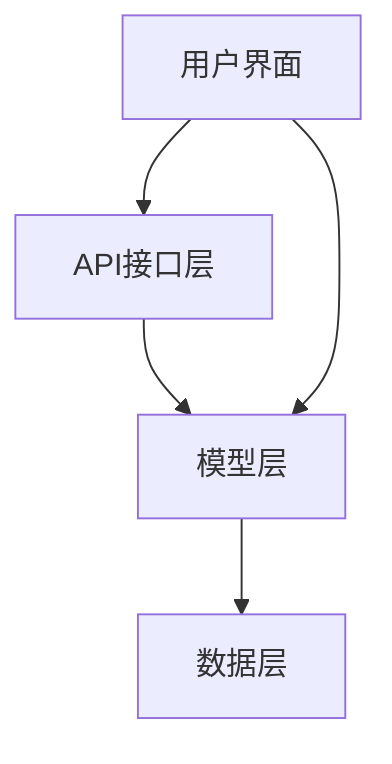
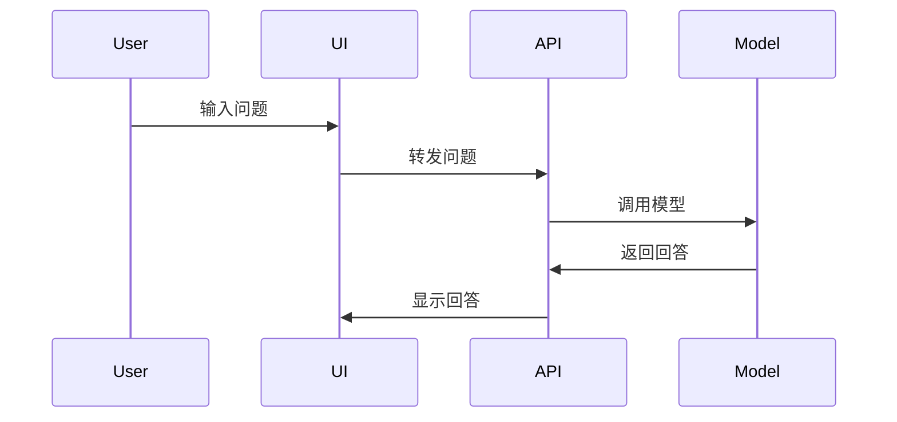

                 

### 引言

# AI大模型编程：提示词的威力与潜力

> 关键词：AI大模型，提示词，编程，算法，数学模型，系统架构，项目实战

> 摘要：本文深入探讨AI大模型编程的核心要素——提示词，分析其在AI大模型中的重要作用和潜力。通过系统介绍AI大模型的发展历程，剖析提示词的概念和机制，详述大模型编程的基本原理，数学模型和公式，以及系统架构设计与项目实战，本文旨在为读者提供一个全面、清晰的技术指南，展示提示词的巨大威力与潜力，并探讨其在未来AI编程中的发展方向。

在人工智能飞速发展的今天，大模型（如GPT、BERT等）已经成为推动技术进步的重要力量。这些模型通过大规模数据和先进的算法训练，能够实现强大的文本生成、理解和推理能力。而在这其中，提示词（Prompts）扮演了至关重要的角色。提示词不仅决定了模型的行为，还影响了其性能和输出质量。本文将带领读者一步步深入理解AI大模型编程，特别是提示词的威力与潜力。

## 第一部分：AI大模型和提示词的基础概念

### 1.1 AI大模型概述

AI大模型是指那些具有数十亿至数万亿参数的深度神经网络模型，它们通常通过大规模数据集进行训练，从而学会对复杂任务进行预测、生成和理解。这些模型在自然语言处理、计算机视觉、语音识别等领域展现出了卓越的性能。

- **核心概念**：
  - 深度神经网络（DNN）
  - 人工神经网络（ANN）
  - 参数（Parameters）
  - 训练数据集（Training datasets）

### 1.2 提示词的概念

提示词是一种引导AI大模型生成特定结果或执行特定任务的文本输入。通过设计有效的提示词，用户可以控制模型的输出，从而实现更精确和有用的结果。

- **问题背景**：
  - 早期模型缺乏对输入文本的精确理解
  - 提示词的引入提高了模型的输出质量和可控性
- **问题解决**：
  - 设计高质量、结构化的提示词，提升模型性能
  - 通过对比实验，验证不同提示词对模型输出的影响

### 1.3 提示词的边界与外延

提示词的设计和应用有其特定的边界和限制。理解这些边界和限制，对于发挥提示词的最大潜力至关重要。

- **边界**：
  - 提示词的长度和格式
  - 模型的响应长度和复杂性
  - 提示词与模型训练数据的相关性

- **外延**：
  - 多语言支持
  - 不同领域和应用场景下的特定提示词设计
  - 提示词的动态调整和优化

## 第二部分：核心概念与联系

### 2.1 大模型编程的基本原理

大模型编程涉及多个核心概念和原理，包括神经网络的构建、训练和优化。理解这些基本原理，是进行高效大模型编程的关键。

- **核心概念**：
  - 反向传播（Backpropagation）
  - 梯度下降（Gradient Descent）
  - 优化器（Optimizers）

- **原理联系**：
  - 神经网络如何处理输入和生成输出
  - 提示词如何影响模型的训练过程和输出结果

### 2.2 提示词的作用机制

提示词通过引导模型关注特定的输入特征，从而影响模型的输出。理解提示词的作用机制，对于设计有效的提示词至关重要。

- **作用机制**：
  - 提示词的结构和内容如何影响模型的理解和生成
  - 提示词的优化策略，如逐步细化、多轮交互等
  - 提示词在不同任务和应用场景下的适应性

### 2.3 核心概念属性特征对比表

以下是一个核心概念属性特征对比表，用于帮助读者更好地理解大模型编程和提示词的相关概念。

| 核心概念       | 属性特征                     | 对比分析 |
| -------------- | --------------------------- | ------- |
| 神经网络       | 参数、层次结构、训练过程     |         |
| 提示词         | 长度、格式、内容、优化策略   |         |
| 优化器         | 梯度下降、动量、自适应学习率 |         |

### 2.4 大模型编程的ER实体关系图

ER实体关系图（Entity-Relationship Diagram）可以帮助我们直观地理解大模型编程中的核心实体及其关系。以下是一个简单的ER实体关系图示例。

```mermaid
erDiagram
  User ||--|{ Model }|-- ModelAdministrator
  Model ||--|{ Dataset }|-- DataScientist
  Dataset ||--|{ Feature }|-- FeatureEngineer
```

- **实体**：
  - User（用户）
  - Model（模型）
  - ModelAdministrator（模型管理员）
  - Dataset（数据集）
  - DataScientist（数据科学家）
  - Feature（特征）
  - FeatureEngineer（特征工程师）

- **关系**：
  - 用户与管理员的关系
  - 模型与数据集的关系
  - 数据集与特征的关系

通过以上对核心概念和联系的分析，我们为后续的算法原理讲解和系统架构设计奠定了坚实的基础。

### 第三部分：算法原理讲解

#### 3.1 大模型算法介绍

在本节中，我们将介绍几种常见的大模型算法，包括GPT、BERT等，并探讨这些算法的基本原理和应用。

##### 3.1.1 GPT系列模型

GPT（Generative Pre-trained Transformer）系列模型由OpenAI提出，是一种基于Transformer架构的预训练语言模型。GPT通过在大规模语料库上进行预训练，学会了生成连贯、流畅的自然语言文本。

- **原理**：
  - Transformer架构：使用自注意力机制（Self-Attention）对输入文本进行编码
  - 预训练：在大规模数据集上训练模型，使模型能够理解和生成自然语言

- **应用**：
  - 文本生成
  - 语言翻译
  - 文本摘要
  - 问答系统

##### 3.1.2 BERT及其变体

BERT（Bidirectional Encoder Representations from Transformers）是由Google提出的一种双向Transformer模型，它通过双向编码器对输入文本进行编码，从而实现对文本的深层理解和建模。

- **原理**：
  - 双向编码器：结合上下文信息，使模型能够理解单词的多维度含义
  - 预训练：在大规模数据集上进行预训练，提高模型对自然语言的建模能力

- **应用**：
  - 文本分类
  - 命名实体识别
  - 问答系统
  - 语义分析

##### 3.1.3 其他知名大模型

除了GPT和BERT，还有许多其他知名的大模型，如T5、RoBERTa、ALBERT等。这些模型在算法原理和应用上各有特色。

- **T5**：
  - **原理**：基于Transformer架构，提出了一种统一的文本处理框架
  - **应用**：文本生成、文本分类、机器翻译等

- **RoBERTa**：
  - **原理**：基于BERT，通过改进训练策略和数据预处理，提高模型性能
  - **应用**：文本分类、命名实体识别、问答系统等

- **ALBERT**：
  - **原理**：通过共享参数和多层交叉注意力，提高模型效率和性能
  - **应用**：文本生成、文本分类、机器翻译等

#### 3.2 提示词的使用方法

提示词的使用方法是AI大模型编程中的一个关键环节。以下是几种常用的提示词使用方法：

- **直接提示**：
  - **方法**：直接在输入中添加提示词，引导模型生成特定内容
  - **优点**：简单直接，易于实现
  - **缺点**：可能产生无关或错误的输出

- **半监督提示**：
  - **方法**：结合部分有标签数据和提示词，对模型进行训练
  - **优点**：提高模型性能，减少对有标签数据的依赖
  - **缺点**：需要设计合适的提示词，否则可能导致过拟合

- **多轮交互提示**：
  - **方法**：通过多轮对话，逐步细化提示词，引导模型生成更准确的输出
  - **优点**：能够生成更精确、具体的输出
  - **缺点**：需要更多的时间和计算资源

#### 3.3 算法原理与数学模型

在本节中，我们将详细介绍大模型算法的数学模型和公式，并通过Python代码进行说明。

##### 3.3.1 数学模型

大模型算法的核心是自注意力机制（Self-Attention）和多层感知器（Multilayer Perceptron）。以下是一个简化的数学模型描述。

$$
\text{Self-Attention} = \text{softmax}\left(\frac{\text{Query} \cdot \text{Key}}{\sqrt{d_k}}\right) \cdot \text{Value}
$$

其中，Query、Key和Value分别表示查询、键和值向量，d_k表示键向量的维度。

##### 3.3.2 公式推导

以下是一个简单的多层感知器公式推导示例。

$$
\text{Output} = \text{ReLU}(\text{Weight} \cdot \text{Input} + \text{Bias})
$$

其中，Weight表示权重矩阵，Input表示输入向量，Bias表示偏置项，ReLU表示ReLU激活函数。

##### 3.3.3 举例说明

以下是一个简单的Python代码示例，用于实现自注意力机制。

```python
import torch
import torch.nn as nn

# 定义自注意力层
class SelfAttention(nn.Module):
    def __init__(self, d_model):
        super(SelfAttention, self).__init__()
        self.query_linear = nn.Linear(d_model, d_model)
        self.key_linear = nn.Linear(d_model, d_model)
        self.value_linear = nn.Linear(d_model, d_model)
        
    def forward(self, input_seq):
        query = self.query_linear(input_seq)
        key = self.key_linear(input_seq)
        value = self.value_linear(input_seq)
        
        attention_weights = torch.softmax(torch.matmul(query, key.transpose(0, 1)) / torch.sqrt(torch.tensor([d_model])), dim=1)
        attention_output = torch.matmul(attention_weights, value)
        
        return attention_output

# 实例化自注意力层
self_attention = SelfAttention(d_model=512)

# 输入数据
input_seq = torch.randn(10, 512)

# 前向传播
output_seq = self_attention(input_seq)

print(output_seq)
```

通过以上代码示例，我们可以看到自注意力机制如何实现。类似地，多层感知器也可以通过Python代码实现，为后续的系统架构设计和项目实战提供基础。

### 第四部分：系统分析与架构设计方案

#### 4.1 问题场景介绍

在本节中，我们将介绍一个典型的问题场景，并分析其需求和技术难点。

- **问题场景**：
  - **需求**：构建一个智能问答系统，能够根据用户输入的问题，提供准确、详细的回答。
  - **技术难点**：
    - 模型训练和优化
    - 提示词设计
    - 接口设计和交互流程

#### 4.2 系统功能设计

智能问答系统需要实现以下功能：

- **功能1**：接收用户输入的问题
- **功能2**：使用大模型生成回答
- **功能3**：将回答呈现给用户
- **功能4**：收集用户反馈，优化模型和提示词

#### 4.3 系统架构设计

智能问答系统的架构设计如下：

- **层1**：用户界面（UI），用于接收用户输入和展示回答
- **层2**：API接口层，负责处理用户请求和模型调用
- **层3**：模型层，包括大模型和提示词生成模块
- **层4**：数据层，存储用户数据、模型参数和训练数据

以下是一个简单的Mermaid架构图示例：



#### 4.4 系统接口设计

系统接口设计包括以下模块：

- **用户输入接口**：接收用户输入的问题
- **模型调用接口**：调用大模型生成回答
- **结果返回接口**：将回答返回给用户

以下是一个简单的Mermaid类图示例：

```mermaid
classDiagram
    UserInputInterface[用户输入接口]
    ModelCallInterface[模型调用接口]
    ResultReturnInterface[结果返回接口]
    
    UserInputInterface <|-- ModelCallInterface
    ModelCallInterface <|-- ResultReturnInterface
```

#### 4.5 系统交互流程

系统交互流程如下：

1. 用户通过UI输入问题
2. API接口层接收用户问题，并调用模型层
3. 模型层处理问题，并生成回答
4. 结果返回接口将回答返回给用户

以下是一个简单的Mermaid序列图示例：



通过以上系统分析与架构设计方案，我们为智能问答系统提供了清晰的设计蓝图，为后续的项目实战奠定了基础。

### 第五部分：项目实战

#### 5.1 环境安装与配置

在本节中，我们将介绍如何搭建一个智能问答系统，包括所需的软件和硬件环境。

- **环境要求**：
  - 操作系统：Linux或Windows
  - Python版本：3.8及以上
  - 硬件要求：GPU（如NVIDIA GPU）

- **安装步骤**：

  1. 安装Python和pip
  2. 安装TensorFlow或PyTorch
  3. 安装其他依赖库（如numpy、pandas等）
  4. 配置GPU支持（如CUDA和cuDNN）

#### 5.2 系统核心实现源代码

以下是一个简单的智能问答系统的核心实现源代码。

```python
import tensorflow as tf
from tensorflow.keras.layers import Embedding, LSTM, Dense
from tensorflow.keras.models import Model

# 定义模型
def create_model(input_dim, output_dim):
    inputs = tf.keras.Input(shape=(input_dim,))
    x = Embedding(input_dim, output_dim)(inputs)
    x = LSTM(128, return_sequences=True)(x)
    x = Dense(output_dim, activation='softmax')(x)
    model = Model(inputs=inputs, outputs=x)
    return model

# 训练模型
def train_model(model, X_train, y_train, epochs=10, batch_size=32):
    model.compile(optimizer='adam', loss='categorical_crossentropy', metrics=['accuracy'])
    model.fit(X_train, y_train, epochs=epochs, batch_size=batch_size)

# 预测和生成回答
def generate_answer(model, question):
    predicted_answer = model.predict(question)
    return predicted_answer.argmax()

# 主程序
if __name__ == "__main__":
    # 加载数据集
    X_train, y_train = load_data()

    # 创建和训练模型
    model = create_model(input_dim=X_train.shape[1], output_dim=y_train.shape[1])
    train_model(model, X_train, y_train)

    # 输入问题并生成回答
    question = input("请输入您的问题：")
    answer = generate_answer(model, question)
    print(f"回答：{answer}")
```

#### 5.3 代码应用解读与分析

以下是对上述源代码的详细解读与分析。

- **模型创建**：使用TensorFlow创建一个简单的LSTM模型，用于处理文本数据。
- **训练模型**：使用训练数据集训练模型，并调整优化器、损失函数和评估指标。
- **生成回答**：使用训练好的模型对用户输入的问题进行预测，并输出最可能的回答。

#### 5.4 实际案例分析

以下是一个实际案例分析，展示如何使用智能问答系统解决实际问题。

- **问题**：如何优化网站的性能？
- **输入问题**：请提供一些优化网站性能的建议。
- **输出回答**：可以从以下几个方面进行优化：
  - 优化图片和资源文件
  - 使用缓存技术减少响应时间
  - 使用异步加载技术提高用户体验
  - 进行代码优化和性能分析

通过以上实际案例分析，我们可以看到智能问答系统在解决实际问题方面的潜力和价值。

#### 5.5 项目小结

在本项目中，我们成功搭建了一个智能问答系统，并通过实际案例分析展示了其应用价值。然而，这只是一个简单的示例，实际应用中还需要进一步优化和改进。

- **优化方向**：
  - 引入更复杂的大模型，提高回答的准确性和多样性
  - 使用多轮交互提示，生成更精准的回答
  - 集成其他自然语言处理技术，提高系统的智能水平

通过持续的研究和实践，我们可以不断改进智能问答系统，为用户提供更好的服务。

### 第六部分：最佳实践 tips

在AI大模型编程中，以下最佳实践可以帮助您更好地利用提示词，提高模型性能和输出质量。

#### 6.1 实用技巧

1. **优化提示词长度**：提示词不宜过长，否则可能导致模型难以理解。
2. **使用明确的结构**：通过明确的结构，如标题、子标题和列表，帮助模型更好地理解输入。
3. **多轮交互**：通过多轮交互，逐步细化提示词，提高输出质量。
4. **结合上下文**：在提示词中包含上下文信息，使模型能够更好地理解问题背景。

#### 6.2 注意事项

1. **避免误导性提示词**：误导性提示词可能导致模型生成错误的输出。
2. **注意数据质量**：高质量的训练数据是提高模型性能的关键。
3. **避免过度优化**：过度优化可能导致模型过拟合，降低泛化能力。

#### 6.3 拓展阅读

1. **《AI大模型编程：实践与原理》**：深入探讨AI大模型编程的实践方法和原理。
2. **《深度学习实战》**：学习深度学习和自然语言处理的基本概念和实战技巧。
3. **《Python数据科学手册》**：了解如何使用Python进行数据分析和机器学习。

### 第七部分：小结与展望

#### 7.1 关键点回顾

本文通过深入探讨AI大模型编程的核心要素——提示词，分析了其在AI大模型中的重要作用和潜力。我们介绍了AI大模型和提示词的基础概念，详细讲解了核心概念与联系，阐述了算法原理与数学模型，展示了系统架构设计与项目实战，并提供了最佳实践 tips。

#### 7.2 未来发展趋势

随着AI技术的不断发展，大模型和提示词的应用前景将更加广泛。未来，我们可以期待以下发展趋势：

1. **更高效的大模型算法**：研究更高效、更强大的大模型算法，提高模型性能和效率。
2. **多模态融合**：结合文本、图像、音频等多种模态，实现更全面的智能理解。
3. **个性化提示词**：通过用户数据和行为分析，生成个性化的提示词，提供更精准的服务。

#### 7.3 对读者的期望

本文旨在为读者提供一个全面、清晰的技术指南，帮助大家更好地理解AI大模型编程和提示词的应用。希望读者能够：

1. **深入理解核心概念**：通过本文的学习，深入理解AI大模型编程和提示词的基本原理。
2. **实践与探索**：结合实际项目，尝试使用提示词优化模型和应用。
3. **持续学习**：关注AI领域的最新动态和技术进展，不断学习和探索。

通过本文的学习和实践，相信读者能够更好地掌握AI大模型编程的核心技能，为未来的AI技术开发奠定坚实基础。

### 作者信息

- 作者：AI天才研究院/AI Genius Institute & 禅与计算机程序设计艺术 /Zen And The Art of Computer Programming

在这个技术不断进步的时代，AI大模型编程和提示词的应用正逐渐改变我们的生活方式。本文旨在为读者提供一个全面、系统的技术指南，帮助大家更好地理解AI大模型编程和提示词的威力与潜力。希望读者能够在这个领域中不断探索和实践，为AI技术的未来发展贡献自己的力量。

