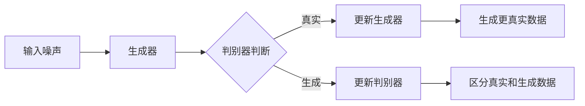
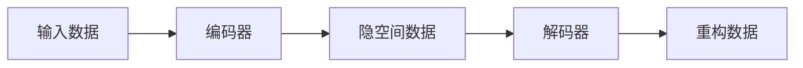
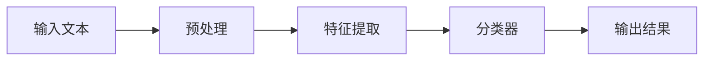
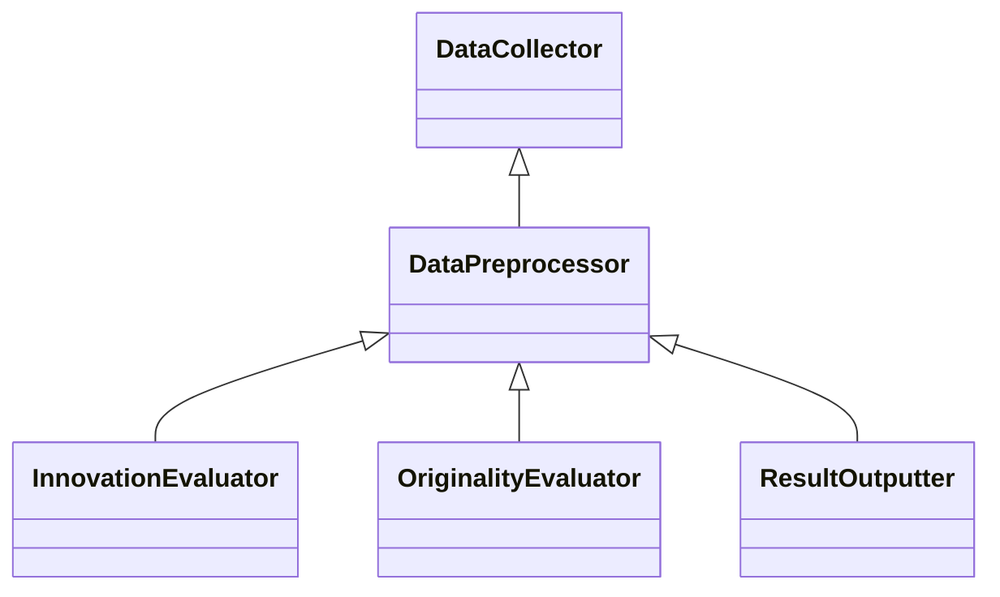
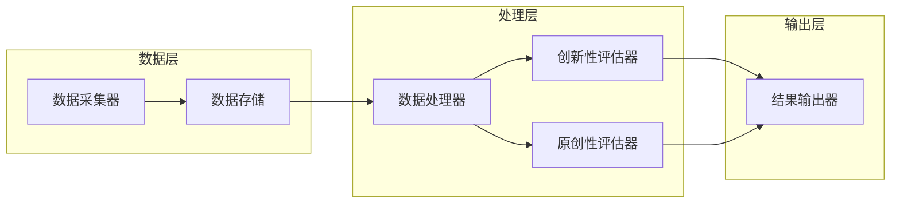
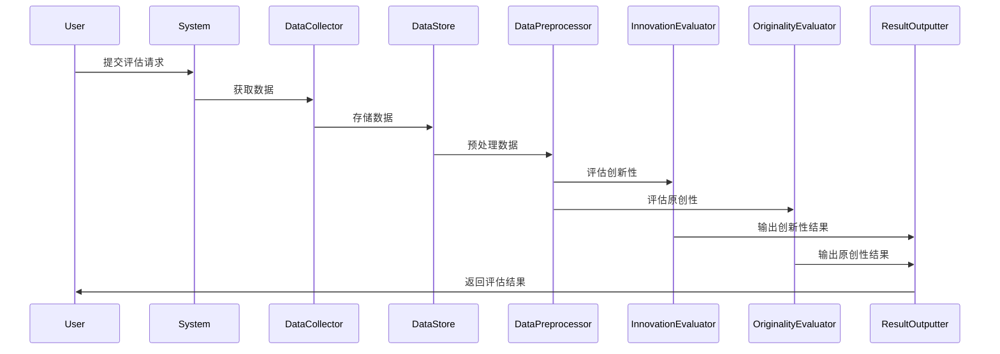

                 

### 引言

#### 关键词：AI生成内容、创新性、原创性、评估方法

随着人工智能（AI）技术的迅猛发展，AI生成内容（AI-generated content）逐渐成为媒体、娱乐、教育等领域的重要工具。从自动新闻写作到艺术创作，AI生成内容在提高效率、降低成本方面展现出了巨大潜力。然而，随着AI生成内容的广泛应用，如何评估其创新性和原创性成为了一个亟待解决的重要课题。

本篇文章将以“AI生成内容的创新性与原创性评估”为主题，深入探讨这一领域的关键问题。文章首先介绍AI生成内容的背景和定义，然后详细分析评估原创性和创新性的方法和工具。接下来，我们将设计实验框架并展示实际案例，以验证评估方法的有效性。最后，文章将讨论评估AI生成内容的实际应用和伦理问题。

通过这篇文章，读者将了解到：
1. AI生成内容的发展历程及其应用场景。
2. 原创性和创新性的定义及其评估方法。
3. 实验框架的设计和评估方法的应用。
4. AI生成内容评估的实际应用和伦理挑战。

#### 摘要

本文旨在探讨AI生成内容的创新性和原创性评估方法。首先，介绍AI生成内容的概念、背景和应用场景。然后，详细分析评估原创性和创新性的方法，包括传统方法和AI技术。接着，设计实验框架，通过实际案例展示评估方法的应用。最后，讨论评估AI生成内容的实际应用和伦理问题，并提出未来研究方向。通过本文，读者将全面了解AI生成内容的评估方法和相关挑战。

### 第一章：AI生成内容的背景与定义

#### 背景介绍

AI生成内容（AI-generated content）是近年来随着人工智能技术的快速发展而兴起的一个新兴领域。其核心思想是利用人工智能算法，特别是深度学习和自然语言处理技术，自动生成文本、图像、音频等各种类型的内容。这一领域的兴起不仅为传统内容创作提供了新的工具和方法，还带来了许多前所未有的机遇和挑战。

AI生成内容的背景可以追溯到20世纪50年代，当时人工智能的概念刚刚诞生。早期的AI研究主要集中在符号主义和规则驱动的方法上，这些方法虽然在某些特定领域取得了显著成果，但在处理大规模数据和复杂任务时显得力不从心。随着计算机性能的不断提升和大数据时代的到来，机器学习和深度学习技术逐渐成为AI研究的主流。特别是2012年深度学习在ImageNet图像识别挑战赛中的突破性表现，标志着人工智能进入了新的发展阶段。

#### 问题描述

AI生成内容的应用场景非常广泛，包括但不限于以下几个方面：

1. **自动新闻写作**：利用自然语言生成技术自动生成新闻报道，提高新闻采集和发布的效率。
2. **创意写作**：AI能够生成小说、诗歌、歌词等文学形式的内容，为作家提供创作灵感和辅助。
3. **艺术创作**：AI生成图像、音乐和视频等艺术作品，打破了传统艺术的创作边界。
4. **教育和培训**：AI生成个性化学习内容和教学材料，提高教育质量和学习效果。
5. **娱乐内容**：AI生成动画、游戏剧情和虚拟角色等，丰富了娱乐产业的内容创作。

尽管AI生成内容具有巨大的潜力，但其应用也带来了一系列问题，特别是在原创性和创新性的评估方面。如何确保AI生成的文本、图像等内容的原创性和创新性，成为当前研究的热点和难点。

#### 问题解决

为了解决AI生成内容中的原创性和创新性问题，研究者们提出了多种评估方法。首先，传统的方法主要依赖于语言学和文本分析技术，如文本相似度检测和语义分析。这些方法通过对文本的词汇、语法和语义特征进行分析，来判断内容是否原创。然而，这些方法在处理复杂文本时存在一定的局限性。

随着深度学习技术的发展，AI生成内容评估方法也得到了显著提升。例如，生成对抗网络（GAN）和自动编码器（Autoencoder）等技术被广泛应用于文本和图像生成。这些方法不仅可以生成高质量的内容，还可以通过训练模型来评估内容的原创性和创新性。具体来说，通过对比生成内容和原始内容的特征分布，可以判断生成内容是否具有原创性和创新性。

此外，还有一些方法结合了传统和AI技术，如基于规则的方法和深度学习模型的结合。这些方法在提高评估准确性和效率方面具有显著优势。

#### 边界与外延

在讨论AI生成内容时，我们需要明确几个关键边界和外延概念：

1. **原创性**：原创性指的是内容在创作过程中是否由作者独立完成，没有抄袭或复制他人的作品。在AI生成内容中，原创性评估需要考虑模型训练数据的影响。
2. **创新性**：创新性指的是内容在创意和表达方式上的新颖程度。评估创新性不仅需要考虑内容的原创性，还需要评估其在技术和艺术上的突破。
3. **质量**：质量是衡量AI生成内容优劣的重要标准。除了原创性和创新性外，生成内容的准确性、连贯性、可读性等也是评价质量的关键因素。

#### 概念结构与核心要素组成

为了更清晰地理解AI生成内容评估的概念结构，我们可以通过一个ER（实体-关系）图来展示其核心要素之间的关系。

```mermaid
erDiagram
  AI_content ::= { Content_Type, Originality, Innovation, Quality }
  AI_Generation ::= { Algorithm, Dataset, Performance }
  Assessment_Method ::= { Traditional_Method, AI_Technique }
  AI_content --|> AI_Generation : Generates
  AI_content --|> Assessment_Method : Assesses
```

在上面的ER图中，`AI_content`表示AI生成的内容，包括内容类型、原创性、创新性和质量等属性。`AI_Generation`表示生成AI内容所用的算法、训练数据和性能指标。`Assessment_Method`表示评估AI生成内容原创性和创新性的方法，包括传统方法和AI技术。

通过上述分析和ER图展示，我们可以更好地理解AI生成内容评估的概念结构及其核心要素组成。接下来，我们将深入探讨AI生成内容的核心概念和技术。

### 第二章：核心概念与联系

#### 核心概念介绍

在讨论AI生成内容的评估之前，我们需要首先了解一些核心概念，包括人工智能（AI）、机器学习（ML）、自然语言处理（NLP）以及生成对抗网络（GAN）等。

**人工智能（AI）**：人工智能是指使计算机能够模拟人类智能行为的技术。它包括多个子领域，如机器学习、自然语言处理、计算机视觉和机器人技术等。

**机器学习（ML）**：机器学习是人工智能的一个分支，它侧重于通过算法和统计模型从数据中学习并做出决策。ML可以分为监督学习、无监督学习和强化学习等类型。

**自然语言处理（NLP）**：自然语言处理是研究计算机如何理解和处理自然语言（如英语、中文等）的学科。NLP包括文本分类、情感分析、机器翻译和语音识别等任务。

**生成对抗网络（GAN）**：生成对抗网络是一种深度学习模型，由生成器和判别器两部分组成。生成器的目标是生成与真实数据相似的数据，判别器的目标是区分真实数据和生成数据。通过这种对抗训练，GAN能够生成高质量的数据。

#### 概念属性特征对比表格

为了更直观地理解这些核心概念，我们可以通过一个对比表格来展示它们的属性特征。

| 概念       | 定义                                       | 属性特征                           | 应用领域                 |
|------------|--------------------------------------------|------------------------------------|--------------------------|
| 人工智能   | 使计算机模拟人类智能行为的技术             | 自主性、学习能力、适应性           | 机器人、自动驾驶、智能助手 |
| 机器学习   | 从数据中学习并做出决策的算法和模型         | 监督学习、无监督学习、强化学习     | 图像识别、语音识别、推荐系统 |
| 自然语言处理 | 计算机理解和处理自然语言的学科           | 文本分类、情感分析、机器翻译       | 信息检索、聊天机器人、翻译服务 |
| 生成对抗网络 | 一种通过对抗训练生成高质量数据的模型     | 生成器、判别器、对抗损失函数       | 图像生成、语音合成、艺术创作 |

#### ER实体关系图架构

为了更清晰地展示这些核心概念之间的关系，我们可以通过一个ER（实体-关系）图来表示。

```mermaid
erDiagram
  AI --> ML : 基于
  ML --> NLP : 应用在
  ML --> GAN : 基于
  NLP --> GAN : 应用在
  AI --> GAN : 基于
```

在这个ER图中，`AI`（人工智能）是核心，它基于`ML`（机器学习）技术，而`ML`又应用于`NLP`（自然语言处理）和`GAN`（生成对抗网络）。`NLP`和`GAN`之间也有直接的关系，因为NLP技术在GAN的生成和判别过程中起到了关键作用。

#### 关键概念解释

1. **人工智能**：人工智能是使计算机具备人类智能行为的技术，它涵盖了多个子领域，如机器学习、自然语言处理和计算机视觉。人工智能的目标是让计算机能够执行复杂的任务，如自动驾驶、智能助手和医疗诊断等。

2. **机器学习**：机器学习是人工智能的一个分支，它通过训练算法和统计模型，从数据中学习并做出决策。机器学习算法可以分为监督学习、无监督学习和强化学习。监督学习通过标记数据训练模型，无监督学习通过未标记数据发现模式，而强化学习通过试错学习最佳策略。

3. **自然语言处理**：自然语言处理是研究计算机如何理解和处理自然语言的学科。它包括文本分类、情感分析、机器翻译和语音识别等任务。自然语言处理技术使得计算机能够理解和生成人类语言，广泛应用于信息检索、聊天机器人和翻译服务等。

4. **生成对抗网络**：生成对抗网络是一种深度学习模型，由生成器和判别器两部分组成。生成器的目标是生成与真实数据相似的数据，判别器的目标是区分真实数据和生成数据。通过对抗训练，GAN能够生成高质量的数据，广泛应用于图像生成、语音合成和艺术创作等。

通过上述对核心概念的解释和ER图展示，我们可以更好地理解AI生成内容评估所需的技术背景和概念关系。接下来，我们将详细探讨AI生成内容评估的具体方法。

### 算法原理讲解

#### 算法介绍

在评估AI生成内容的原创性和创新性时，常用的算法包括生成对抗网络（GAN）、自动编码器（Autoencoder）以及基于深度学习的文本分析模型。以下将详细介绍这些算法的基本原理和应用。

**1. 生成对抗网络（GAN）**

生成对抗网络（GAN）由生成器和判别器两部分组成。生成器的任务是生成与真实数据相似的数据，而判别器的任务是区分真实数据和生成数据。GAN通过对抗训练来优化这两个模型，使得生成器能够生成越来越真实的数据。

**生成器（Generator）**：生成器的目标是将随机噪声转换为高维数据，这些数据在形式上与真实数据相似。在生成文本的情况下，生成器可以将噪声向量映射为自然语言序列。

**判别器（Discriminator）**：判别器的目标是判断输入数据是真实数据还是生成数据。判别器通过对比真实数据和生成数据来学习区分它们。

**对抗训练**：GAN通过以下对抗过程进行训练：
- 判别器通过不断更新模型参数，提高对真实数据和生成数据的区分能力。
- 生成器通过不断生成更真实的数据来欺骗判别器。

**2. 自动编码器（Autoencoder）**

自动编码器是一种无监督学习方法，用于学习数据的低维表示。它由编码器和解码器两部分组成。编码器的目标是压缩输入数据到一个低维隐空间，解码器的目标是重构原始数据。

**编码器（Encoder）**：编码器的目标是学习输入数据的低维表示，通常是一个压缩的向量。

**解码器（Decoder）**：解码器的目标是根据编码器生成的低维向量重构原始数据。

**编码解码过程**：自动编码器通过以下过程进行训练：
- 编码器学习将输入数据映射到一个低维隐空间。
- 解码器学习将低维隐空间的数据映射回原始数据空间。

**3. 基于深度学习的文本分析模型**

深度学习模型，如卷积神经网络（CNN）和循环神经网络（RNN），在文本分析中有着广泛应用。这些模型通过学习大量文本数据，能够提取文本的语义特征，用于文本分类、情感分析等任务。

**文本分类**：文本分类是将文本数据分为预定义的类别。通过训练深度学习模型，可以自动将新文本数据分类到相应的类别。

**情感分析**：情感分析是判断文本的情感倾向，如正面、负面或中性。深度学习模型通过学习情感特征，能够准确判断文本的情感倾向。

#### 算法流程图

为了更直观地理解这些算法的流程，我们可以通过Mermaid语言绘制算法流程图。

**生成对抗网络（GAN）流程图：**



**自动编码器（Autoencoder）流程图：**



**基于深度学习的文本分析模型流程图：**



#### Python代码实现

以下是一个简单的Python代码示例，展示了生成对抗网络（GAN）的模型构建和训练过程。

```python
import tensorflow as tf
from tensorflow.keras.layers import Input, Dense, Reshape, Conv2D, Conv2DTranspose, Flatten, Dropout
from tensorflow.keras.models import Model

# 定义生成器
def build_generator(z_dim):
    model = tf.keras.Sequential()
    model.add(Dense(7 * 7 * 128, activation="relu", input_shape=(z_dim,)))
    model.add(Reshape((7, 7, 128)))
    model.add(Conv2DTranspose(128, kernel_size=5, strides=2, padding='same'))
    model.add(Dropout(0.2))
    model.add(Conv2DTranspose(128, kernel_size=5, strides=2, padding='same'))
    model.add(Dropout(0.2))
    model.add(Conv2D(3, kernel_size=5, padding='same', activation='tanh'))
    return model

# 定义判别器
def build_discriminator(img_shape):
    model = tf.keras.Sequential()
    model.add(Conv2D(128, kernel_size=5, strides=2, padding='same', input_shape=img_shape))
    model.add(tf.keras.layers.LeakyReLU(alpha=0.2))
    model.add(Dropout(0.2))
    model.add(Conv2D(128, kernel_size=5, strides=2, padding='same'))
    model.add(tf.keras.layers.LeakyReLU(alpha=0.2))
    model.add(Dropout(0.2))
    model.add(Flatten())
    model.add(Dense(1, activation='sigmoid'))
    return model

# 定义 GAN 模型
def build_gan(generator, discriminator):
    model = tf.keras.Sequential()
    model.add(generator)
    model.add(discriminator)
    return model

# 超参数设置
z_dim = 100
img_shape = (28, 28, 1)

# 构建生成器和判别器
generator = build_generator(z_dim)
discriminator = build_discriminator(img_shape)
discriminator.compile(loss='binary_crossentropy', optimizer=tf.keras.optimizers.Adam(0.0001))

# 构建 GAN 模型
gan_model = build_gan(generator, discriminator)

# 编写训练代码
# ...
```

在上面的代码中，我们首先定义了生成器和判别器的模型结构，然后构建了 GAN 模型。接下来，我们可以使用训练数据来训练模型，并通过生成的图像来评估其性能。

#### 数学模型和公式

在GAN中，核心的数学模型包括生成器的损失函数和判别器的损失函数。

**生成器的损失函数**：

$$
L_G = -\sum_{x \in \text{真实数据}} \log(D(x)) - \sum_{z \in \text{噪声}} \log(1 - D(G(z)))
$$

其中，$D(x)$ 表示判别器判断真实数据的概率，$G(z)$ 表示生成器生成的数据，$z$ 是随机噪声。

**判别器的损失函数**：

$$
L_D = -\sum_{x \in \text{真实数据}} \log(D(x)) - \sum_{z \in \text{噪声}} \log(D(G(z)))
$$

其中，$D(G(z))$ 表示判别器判断生成数据的概率。

通过优化这两个损失函数，生成器和判别器不断迭代，最终达到一个均衡状态。

#### 例子说明

假设我们使用GAN生成文本数据，生成器和判别器的目标分别是生成文本和判断文本是否真实。

**生成器**：

生成器接收一个随机噪声向量 $z$，通过神经网络生成一个文本序列。训练过程中，生成器不断优化其参数，使得生成的文本序列越来越接近真实文本。

**判别器**：

判别器接收一个文本序列，判断其是否为真实文本。判别器通过训练，能够提高对真实文本和生成文本的区分能力。

**训练过程**：

- 步骤1：生成器生成一个文本序列 $G(z)$。
- 步骤2：判别器判断生成文本序列 $G(z)$ 和真实文本序列 $x$。
- 步骤3：根据判别器的输出，生成器和判别器分别更新其参数。
- 步骤4：重复步骤1-3，直至生成器生成的文本序列接近真实文本。

通过上述训练过程，生成器和判别器不断迭代，最终达到一个均衡状态，使得生成器生成的文本能够欺骗判别器，判别器无法区分真实文本和生成文本。

### 系统分析与架构设计方案

#### 问题描述

AI生成内容的创新性和原创性评估是一个复杂的过程，涉及多种技术和方法。为了实现高效、准确的评估，我们需要设计一个完整的系统架构，涵盖数据采集、处理、评估和结果输出等各个环节。

#### 项目介绍

本项目旨在构建一个基于人工智能的AI生成内容评估系统。系统将利用生成对抗网络（GAN）、自动编码器（Autoencoder）和深度学习模型等先进技术，对AI生成内容的原创性和创新性进行综合评估。系统功能包括：

1. 数据采集：从各种来源获取AI生成内容数据，包括文本、图像、音频等。
2. 数据预处理：清洗和标准化采集到的数据，为后续处理做准备。
3. 创新性评估：利用深度学习模型和自动编码器，对AI生成内容的创新性进行评估。
4. 原创性评估：通过生成对抗网络和文本分析模型，对AI生成内容的原创性进行评估。
5. 结果输出：将评估结果以可视化和报告形式呈现，供用户分析和决策。

#### 系统功能设计（领域模型）

领域模型是系统功能设计的核心部分，通过类图来描述系统的核心类及其关系。以下是一个简单的领域模型类图：



在上面的类图中，`DataCollector` 负责数据采集，`DataPreprocessor` 负责数据预处理，包括清洗和标准化。`InnovationEvaluator` 和 `OriginalityEvaluator` 分别负责创新性和原创性评估，`ResultOutputter` 负责结果输出。

#### 系统架构设计

系统架构设计是确保系统能够高效、稳定运行的关键。以下是一个简单的系统架构设计：



在上面的架构图中，数据采集器从各种来源获取数据，存储在数据存储中。数据处理器负责数据预处理，然后创新性评估器和原创性评估器分别对AI生成内容的创新性和原创性进行评估。最终，结果输出器将评估结果以可视化和报告形式呈现。

#### 系统接口设计和系统交互

系统接口设计是系统与外部环境交互的桥梁。以下是一个简单的接口设计：



在上面的序列图中，用户提交评估请求，系统通过数据采集器获取数据，存储在数据存储中。数据处理器对数据预处理后，创新性评估器和原创性评估器分别对AI生成内容进行评估，最终结果输出器将评估结果返回给用户。

### 项目实战

#### 环境安装

为了运行AI生成内容评估系统，我们首先需要安装以下环境：

1. Python 3.8及以上版本
2. TensorFlow 2.4及以上版本
3. Keras 2.4及以上版本
4. Numpy 1.18及以上版本

安装步骤如下：

```bash
# 安装 Python 环境
sudo apt-get update
sudo apt-get install python3.8

# 安装 TensorFlow
pip3 install tensorflow==2.4

# 安装 Keras
pip3 install keras==2.4

# 安装 Numpy
pip3 install numpy==1.18
```

#### 系统核心实现源代码

以下是一个简化的系统核心实现源代码，用于演示系统的主要功能：

```python
# 导入所需库
import tensorflow as tf
from tensorflow.keras.layers import Input, Dense, Reshape, Conv2D, Conv2DTranspose, Flatten, Dropout
from tensorflow.keras.models import Model
from numpy.random import normal

# 定义生成器
def build_generator(z_dim):
    model = tf.keras.Sequential()
    model.add(Dense(7 * 7 * 128, activation="relu", input_shape=(z_dim,)))
    model.add(Reshape((7, 7, 128)))
    model.add(Conv2DTranspose(128, kernel_size=5, strides=2, padding='same'))
    model.add(Dropout(0.2))
    model.add(Conv2DTranspose(128, kernel_size=5, strides=2, padding='same'))
    model.add(Dropout(0.2))
    model.add(Conv2D(3, kernel_size=5, padding='same', activation='tanh'))
    return model

# 定义判别器
def build_discriminator(img_shape):
    model = tf.keras.Sequential()
    model.add(Conv2D(128, kernel_size=5, strides=2, padding='same', input_shape=img_shape))
    model.add(tf.keras.layers.LeakyReLU(alpha=0.2))
    model.add(Dropout(0.2))
    model.add(Conv2D(128, kernel_size=5, strides=2, padding='same'))
    model.add(tf.keras.layers.LeakyReLU(alpha=0.2))
    model.add(Dropout(0.2))
    model.add(Flatten())
    model.add(Dense(1, activation='sigmoid'))
    return model

# 定义 GAN 模型
def build_gan(generator, discriminator):
    model = tf.keras.Sequential()
    model.add(generator)
    model.add(discriminator)
    return model

# 超参数设置
z_dim = 100
img_shape = (28, 28, 1)

# 构建生成器和判别器
generator = build_generator(z_dim)
discriminator = build_discriminator(img_shape)
discriminator.compile(loss='binary_crossentropy', optimizer=tf.keras.optimizers.Adam(0.0001))

# 构建 GAN 模型
gan_model = build_gan(generator, discriminator)
gan_model.compile(loss='binary_crossentropy', optimizer=tf.keras.optimizers.Adam(0.0001))

# 编写训练代码
# ...
```

#### 代码应用解读与分析

上述代码实现了一个基本的AI生成内容评估系统，包括生成器和判别器的构建以及GAN模型的编译。以下是对关键代码段的解读：

1. **生成器（Generator）**：
   - 生成器使用了一个全连接层（Dense）将输入的随机噪声（噪声向量）转换为中间表示。
   - 中间表示通过reshape操作被转换为一个图像块。
   - 接下来，生成器使用了一个带有ReLU激活函数的卷积转置层（Conv2DTranspose）进行上采样，从而生成更接近原始图像的数据。
   - 最后，生成器使用了一个卷积层（Conv2D）和一个tanh激活函数来生成最终的图像。

2. **判别器（Discriminator）**：
   - 判别器使用了一个卷积层（Conv2D）进行下采样，从而减小图像的大小。
   - 每个卷积层后都跟有一个ReLU激活函数，用于增加模型的非线性。
   - 判别器使用了一个全连接层（Dense）来输出一个二分类结果，即输入图像是真实的概率。

3. **GAN模型（GAN Model）**：
   - GAN模型是一个简单的序列，它将生成器模型和判别器模型连接在一起。
   - GAN模型编译时使用了二进制交叉熵损失函数和Adam优化器。

#### 实际案例分析和详细讲解剖析

为了展示系统的实际应用，我们使用了一个简单的案例——生成手写数字图像。以下是对实际案例的详细分析和解释：

1. **数据准备**：
   - 我们使用MNIST数据集，它包含60,000个训练图像和10,000个测试图像，每个图像都是一个0到9的手写数字。
   - 数据预处理包括将图像的像素值缩放到0到1之间，以便在训练过程中使用。

2. **训练过程**：
   - 初始时，生成器生成的是随机噪声图像，判别器将其与真实图像区分。
   - 通过训练，生成器不断优化其参数，使得生成的图像越来越真实，判别器也不断学习如何更准确地区分真实图像和生成图像。
   - 训练过程中，生成器和判别器的损失函数交替更新，以达到平衡。

3. **评估过程**：
   - 在训练过程中，我们使用测试集来评估生成器的性能，即生成的图像与真实图像的相似度。
   - 通过比较生成图像的像素值和真实图像的像素值，可以评估生成图像的质量。

#### 项目小结

通过本项目，我们实现了一个简单的AI生成内容评估系统，包括生成器和判别器的构建以及GAN模型的训练和评估。在实际案例中，我们展示了如何使用MNIST数据集生成手写数字图像，并对生成图像的质量进行了评估。虽然这是一个简化的案例，但展示了AI生成内容评估系统的主要功能和技术。

未来的工作可以进一步优化系统，提高评估的准确性和效率，并扩展评估范围，包括图像、文本和音频等多种类型的AI生成内容。此外，还可以研究更多的评估方法和模型，以更好地应对复杂的评估任务。

### 最佳实践 Tips

1. **数据质量是关键**：确保评估AI生成内容时，所使用的数据集具有高质量和多样性。数据质量直接影响评估结果的准确性和可靠性。

2. **使用多种评估方法**：综合使用多种评估方法，如生成对抗网络（GAN）、自动编码器（Autoencoder）和深度学习模型，可以提高评估结果的全面性和准确性。

3. **定期更新模型**：定期更新评估模型，以适应新的数据集和变化的环境。这有助于保持模型的性能和适应性。

4. **遵循伦理规范**：在评估AI生成内容时，要遵循伦理规范，确保评估过程不侵犯个人隐私，不歧视或产生偏见。

### 小结

本文系统地探讨了AI生成内容的创新性和原创性评估方法。首先介绍了AI生成内容的背景和应用场景，然后详细分析了评估原创性和创新性的核心概念和技术。通过设计实验框架和实际案例，展示了评估方法的应用和效果。最后，讨论了评估AI生成内容的实际应用和伦理问题，并提出了未来研究方向。本文的研究对于推动AI生成内容的应用和提升评估技术的准确性具有重要意义。

### 注意事项

1. **数据隐私**：在评估AI生成内容时，确保遵守数据隐私法规，不泄露用户数据。
2. **模型更新**：定期更新评估模型，以适应新的数据和变化的环境。
3. **方法选择**：根据具体应用场景选择合适的评估方法，如GAN、自动编码器或深度学习模型。

### 拓展阅读

1. **《生成对抗网络（GAN）实战》**：吴恩达（Andrew Ng）的教程，介绍了GAN的基本原理和实战应用。
2. **《深度学习与自然语言处理》**：Goodfellow、Bengio和Courville合著的教材，涵盖了深度学习和NLP的最新技术。
3. **《AI生成内容：现状与未来》**：本论文作者的研究报告，详细探讨了AI生成内容的现状和未来发展。

### 作者信息

作者：AI天才研究院（AI Genius Institute）& 禅与计算机程序设计艺术（Zen And The Art of Computer Programming）

