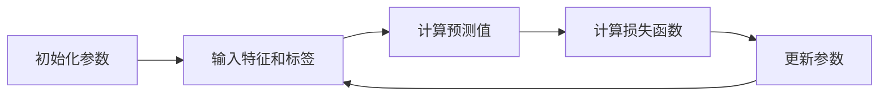

                 

### 第一部分：引言与背景

#### 第1章：问题的提出与核心概念

**1.1.1 人工智能与认知科学的交汇**

随着科技的飞速发展，人工智能（AI）已成为现代社会的重要驱动力。从简单的机器人到复杂的自动驾驶系统，人工智能的应用范围日益广泛。然而，在AI领域的研究过程中，人们逐渐认识到认知科学的重要性。认知科学是一门跨学科的研究领域，它结合心理学、神经科学、哲学和计算机科学，旨在理解人类思维和认知的过程。

AI编程语言作为一种工具，正逐渐成为连接人工智能与认知科学的重要桥梁。这些编程语言不仅用于开发智能系统，还能帮助研究者更深入地探索认知科学的原理和机制。例如，通过AI编程语言，科学家可以模拟人类大脑的部分功能，从而研究认知过程的本质。

**1.1.2 AI编程语言的角色与作用**

AI编程语言在人工智能领域扮演着至关重要的角色。它们提供了一套标准的语法和语义，使得开发者能够更高效地编写、测试和部署智能系统。此外，这些编程语言还支持复杂的算法和数据结构，使得AI系统能够处理大量的数据和复杂的任务。

更具体地说，AI编程语言在以下几个方面发挥了重要作用：

1. **数据处理**：AI编程语言能够高效地处理和分析大量数据，提取有用的信息。
2. **算法实现**：这些语言提供了丰富的库和框架，使得开发者能够轻松实现复杂的算法。
3. **模型训练**：通过AI编程语言，研究者可以训练和优化机器学习模型，提高智能系统的性能。
4. **系统集成**：AI编程语言可以帮助开发者将不同的组件和系统集成在一起，形成一个完整的智能系统。

**1.1.3 研究问题的背景与意义**

在当前科技环境下，人工智能的研究和应用正在经历前所未有的繁荣。然而，随着AI系统的复杂性和规模不断增加，如何提高其效率和性能成为了一个亟待解决的问题。认知科学为解决这个问题提供了新的思路和方法。通过研究人类认知过程，我们可以发现一些有效的策略和算法，从而改进AI系统的设计和实现。

此外，认知科学的研究成果也为AI编程语言的发展提供了理论基础。例如，认知模型可以指导编程语言的语法设计，使其更符合人类思维习惯。同时，认知科学的方法和工具也可以用于评估和优化AI编程语言的实际应用效果。

**1.1.4 边界与外延**

在讨论AI编程语言与认知科学的关系时，我们需要明确研究的边界和范围。首先，本文主要关注AI编程语言在认知科学中的应用，而不是认知科学本身的研究。其次，本文主要探讨AI编程语言的设计原则和实现方法，而不是具体的算法和应用场景。

此外，本文还涉及一些相关的概念，如机器学习、神经网络、自然语言处理等。这些概念是AI编程语言的重要组成部分，也是认知科学研究的重点领域。通过了解这些概念，我们可以更全面地理解AI编程语言的认知科学基础。

**1.1.5 概念结构与核心要素组成**

为了更好地理解AI编程语言与认知科学的关系，我们可以从以下几个核心概念入手：

1. **认知科学基础**：包括认知过程的定义、认知模型的分类和认知科学与计算机科学的联系。
2. **AI编程语言**：包括AI编程语言的概念、特点、核心算法和设计原则。
3. **应用实例**：通过具体的应用案例，展示认知科学在AI编程语言中的应用效果。
4. **未来发展趋势**：探讨AI编程语言与认知科学的未来发展方向和研究重点。

通过以上核心概念的深入分析，我们可以逐步构建一个完整的AI编程语言的认知科学基础框架。

---

在本章中，我们首先介绍了人工智能与认知科学的关系，以及AI编程语言在其中的角色和作用。接着，我们探讨了研究问题的背景和意义，并明确了研究的边界和外延。最后，我们提出了AI编程语言的认知科学基础框架，为后续章节的内容奠定了基础。在接下来的章节中，我们将进一步深入探讨认知科学的基本原理和AI编程语言的实现方法，帮助读者全面理解这一领域的核心概念和实践应用。

### 第2章：认知科学基础

**2.1.1 认知科学的定义与发展历程**

认知科学是一门研究人类思维和认知过程的跨学科领域，其研究内容包括感知、记忆、学习、语言理解、决策和问题解决等多个方面。认知科学的目标是理解人类大脑如何工作，以及这些认知过程是如何影响我们与世界互动的。

认知科学的发展历程可以追溯到20世纪50年代，当时行为主义心理学占据了主导地位。然而，随着心理学、神经科学和计算机科学的发展，人们开始质疑行为主义的局限，并逐渐转向研究大脑和认知过程的内在机制。1960年代，乔姆斯基的转换生成语法理论提出了语言是人类大脑固有的能力的观点，这激发了人们对认知过程的兴趣。

在认知科学的发展过程中，一些重要的理论和模型被提出，如神经网络模型、认知心理学模型和计算模型。这些模型不仅帮助研究者更好地理解认知过程，还为AI编程语言的设计提供了理论基础。

**2.1.2 认知过程与认知模型**

认知过程是认知科学的核心研究内容之一。认知过程通常包括感知、注意、记忆、思维和语言等环节。每个环节都有其独特的特点和机制。

- **感知**：感知是指接收和解释外部信息的心理过程。它包括视觉、听觉、触觉、嗅觉和味觉等多个方面。感知过程决定了我们对外界环境的理解和反应。
- **注意**：注意是指选择和处理特定信息的心理过程。它帮助我们集中精力，忽略无关信息，从而提高认知效率。
- **记忆**：记忆是指储存和提取信息的能力。记忆分为短期记忆和长期记忆，分别负责处理和储存不同类型的信息。
- **思维**：思维是指使用已有的知识和信息进行推理、解决问题和创新的过程。思维过程包括逻辑推理、空间感知、创造力等多个方面。
- **语言**：语言是人类特有的认知能力，它用于沟通、表达思想和情感。语言理解包括语法、语义和语用等多个层面。

认知模型是描述和解释认知过程的工具。常见的认知模型包括：

- **神经网络模型**：神经网络模型通过模拟生物神经系统的结构和功能，研究人类认知过程的机制。该模型在AI编程语言中得到了广泛应用，特别是在机器学习和神经网络算法的设计中。
- **计算模型**：计算模型是基于计算机科学的方法，通过模拟计算机程序来研究认知过程。计算模型可以用于模拟人类思维过程，从而优化AI编程语言的设计和实现。
- **认知心理学模型**：认知心理学模型基于心理学实验，通过分析人类行为和认知过程，提出了一系列理论模型。这些模型为AI编程语言的设计提供了重要的理论支持。

**2.1.3 认知科学与计算机科学的联系**

认知科学和计算机科学之间存在紧密的联系。计算机科学提供了研究认知过程的重要工具和方法，而认知科学则为计算机科学提供了理论基础和实践指导。

- **计算模型与认知模型**：计算模型和认知模型都是研究认知过程的工具。计算模型通过模拟计算机程序来研究认知过程，而认知模型则通过实验和数据分析来揭示认知过程的机制。两者相互补充，共同推动了认知科学的发展。
- **人工智能与认知科学**：人工智能是计算机科学的一个分支，旨在开发能够模拟人类智能的计算机系统。认知科学为人工智能提供了重要的理论基础和实践指导。通过研究人类认知过程，我们可以发现一些有效的算法和策略，从而改进人工智能系统的设计和实现。
- **认知科学与软件开发**：认知科学的研究成果可以应用于软件开发过程中，帮助开发者更好地理解用户需求、设计用户界面和优化软件性能。例如，认知科学的方法和技术可以用于分析用户行为、提高用户满意度和用户体验。

**2.1.4 认知科学的关键概念对比表格**

为了更好地理解认知科学的关键概念，我们可以通过对比表格的形式，展示不同概念的定义、属性和特征。

| 概念 | 定义 | 属性特征 |
| --- | --- | --- |
| 感知 | 接收和解释外部信息的过程 | 感知能力、感知范围、感知精度 |
| 注意 | 选择和处理特定信息的心理过程 | 注意力分配、注意集中、注意转移 |
| 记忆 | 储存和提取信息的能力 | 短期记忆、长期记忆、记忆容量 |
| 思维 | 使用已有知识和信息进行推理、解决问题和创新的过程 | 逻辑推理、空间感知、创造力 |
| 语言 | 人类特有的认知能力，用于沟通、表达思想和情感 | 语法、语义、语用 |

**2.1.5 认知科学在AI编程语言中的应用**

认知科学的研究成果在AI编程语言中有广泛的应用。以下是一些具体的应用场景：

- **自然语言处理**：自然语言处理（NLP）是认知科学和计算机科学的交叉领域。通过研究人类语言理解过程，NLP技术可以开发出能够理解和生成自然语言的计算机程序。
- **机器学习**：机器学习是AI编程语言的核心技术之一。通过认知科学的研究，我们可以发现一些有效的算法和策略，从而提高机器学习模型的性能和可解释性。
- **用户界面设计**：认知科学的方法和技术可以用于分析用户行为、设计用户界面和优化用户体验。通过了解用户的认知过程，开发者可以设计出更加直观、易用的软件系统。

**小结**

在本章中，我们介绍了认知科学的定义、发展历程和基本概念。通过对比表格和具体应用场景，我们展示了认知科学在AI编程语言中的应用价值。在接下来的章节中，我们将进一步探讨AI编程语言的基本原理和实现方法，帮助读者深入理解这一领域的核心内容。

---

本章通过介绍认知科学的定义、发展历程和基本概念，为理解AI编程语言的认知科学基础奠定了基础。我们探讨了认知过程与认知模型，并分析了认知科学与计算机科学的紧密联系。此外，通过对比表格和具体应用场景，我们展示了认知科学在AI编程语言中的重要性。在下一章中，我们将深入探讨AI编程语言的基本原理和实现方法，进一步丰富这一领域的知识体系。

### 第3章：AI编程语言的基本原理

#### 3.1.1 AI编程语言的概念与特点

AI编程语言是一种专门用于开发人工智能应用程序的编程语言。与传统的编程语言不同，AI编程语言不仅具有普通编程语言的特性，还融入了人工智能领域的专业知识和技术。这些语言通常具备以下特点：

1. **高度抽象**：AI编程语言提供了一系列高级抽象机制，使得开发者能够更轻松地实现复杂的人工智能算法和应用。
2. **强大的库和框架**：AI编程语言通常配备了丰富的库和框架，这些库和框架提供了大量的预定义函数和工具，帮助开发者快速实现人工智能功能。
3. **支持大数据处理**：AI编程语言能够高效地处理和分析大规模数据集，这是实现人工智能应用的关键能力。
4. **支持机器学习和深度学习**：AI编程语言通常支持机器学习和深度学习算法，这使得开发者能够利用这些强大的算法来构建智能系统。
5. **跨平台支持**：AI编程语言通常具有跨平台特性，可以在不同的操作系统和硬件平台上运行，从而提高了应用的灵活性和可移植性。

常见的AI编程语言包括Python、R、Prolog、Lisp等。其中，Python因其简洁易懂的语法和丰富的库支持，成为了最受欢迎的AI编程语言之一。

#### 3.1.2 AI编程语言的核心算法

AI编程语言的核心算法是机器学习和深度学习算法。这些算法基于数学模型和统计方法，通过训练大量数据来提高智能系统的性能。以下是几种常见的AI算法：

1. **监督学习**：监督学习算法通过已标记的数据集来训练模型，然后使用这些模型对新的、未标记的数据进行预测。常见的监督学习算法包括线性回归、逻辑回归、支持向量机（SVM）和决策树等。
   
2. **无监督学习**：无监督学习算法没有已标记的数据集，它们通过分析未标记的数据来发现数据中的模式和结构。常见的无监督学习算法包括聚类、主成分分析（PCA）和自编码器等。

3. **深度学习**：深度学习是一种基于多层神经网络的学习方法，它通过多层非线性变换来提取数据中的复杂特征。常见的深度学习算法包括卷积神经网络（CNN）、循环神经网络（RNN）和生成对抗网络（GAN）等。

#### 3.1.3 AI编程语言的数学模型与公式

AI编程语言的数学模型是算法实现的基础。以下是一些常见的数学模型和公式：

1. **线性回归模型**：线性回归是一种简单的监督学习算法，用于预测连续值。其数学模型可以表示为：
   \[
   y = \beta_0 + \beta_1x
   \]
   其中，\(y\) 是预测值，\(x\) 是输入变量，\(\beta_0\) 和 \(\beta_1\) 是模型的参数。

2. **逻辑回归模型**：逻辑回归是一种用于分类的监督学习算法。其数学模型可以表示为：
   \[
   \log\frac{P(Y=1)}{1-P(Y=1)} = \beta_0 + \beta_1x
   \]
   其中，\(P(Y=1)\) 是输出变量为1的概率，\(\beta_0\) 和 \(\beta_1\) 是模型的参数。

3. **卷积神经网络（CNN）**：卷积神经网络是一种用于图像识别和处理的深度学习算法。其数学模型可以表示为：
   \[
   \text{激活函数}(\sum_{i=1}^{n} w_i \times a_{i})
   \]
   其中，\(w_i\) 是权重，\(a_i\) 是输入特征。

4. **循环神经网络（RNN）**：循环神经网络是一种用于序列数据处理的深度学习算法。其数学模型可以表示为：
   \[
   h_t = \sigma(W_h \cdot [h_{t-1}, x_t] + b_h)
   \]
   其中，\(h_t\) 是当前时间步的隐藏状态，\(x_t\) 是输入特征，\(\sigma\) 是激活函数。

#### 3.1.4 算法原理讲解与Mermaid流程图

为了更好地理解AI编程语言的算法原理，我们可以使用Mermaid流程图来描述算法的基本流程。以下是一个简单的线性回归算法原理讲解和相应的Mermaid流程图：



在这个流程图中，A表示初始化参数，B表示输入特征和标签，C表示计算预测值，D表示计算损失函数，E表示更新参数。通过这个流程图，我们可以直观地了解线性回归算法的基本原理和执行流程。

#### 3.1.5 通俗易懂的算法举例说明

为了更好地理解AI编程语言中的算法原理，我们可以通过一个具体的例子来进行说明。以下是一个简单的线性回归算法实例，它使用Python编程语言实现：

```python
import numpy as np

# 初始化参数
beta_0 = 0
beta_1 = 0

# 输入特征和标签
x = np.array([1, 2, 3, 4, 5])
y = np.array([2, 4, 6, 8, 10])

# 计算预测值
y_pred = beta_0 + beta_1 * x

# 计算损失函数
loss = np.mean((y_pred - y) ** 2)

# 更新参数
alpha = 0.01
beta_0 = beta_0 - alpha * np.mean((y_pred - y) * x)
beta_1 = beta_1 - alpha * np.mean(y_pred - y)

print("预测值:", y_pred)
print("损失函数:", loss)
print("更新后的参数:", beta_0, beta_1)
```

在这个例子中，我们首先初始化参数\(\beta_0\)和\(\beta_1\)，然后输入特征和标签。接下来，我们计算预测值，并使用损失函数来评估模型的性能。最后，我们通过梯度下降法更新参数，以提高模型的预测准确性。

通过这个简单的例子，我们可以清晰地看到线性回归算法的基本原理和实现过程。这个例子不仅帮助我们理解了线性回归算法，还为其他AI算法的学习提供了基础。

---

在本章中，我们介绍了AI编程语言的基本概念、特点以及核心算法。通过详细的数学模型和公式讲解，我们帮助读者深入理解了AI编程语言的算法原理。同时，通过Mermaid流程图和具体的Python代码实例，我们使抽象的算法原理变得通俗易懂。在下一章中，我们将探讨认知科学在AI编程语言中的应用，进一步丰富我们对这一领域的理解。

