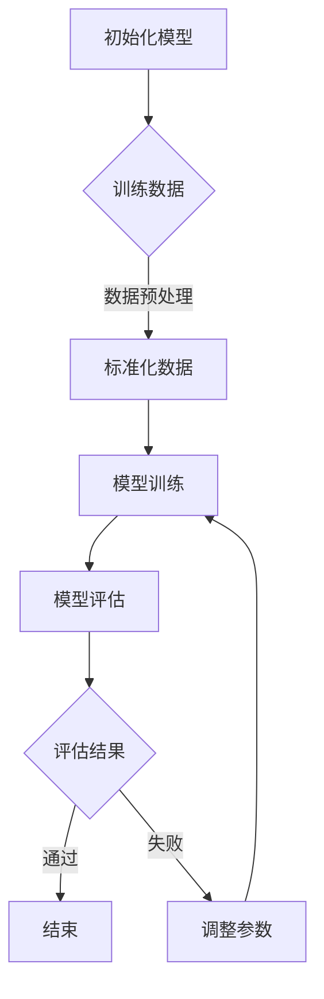
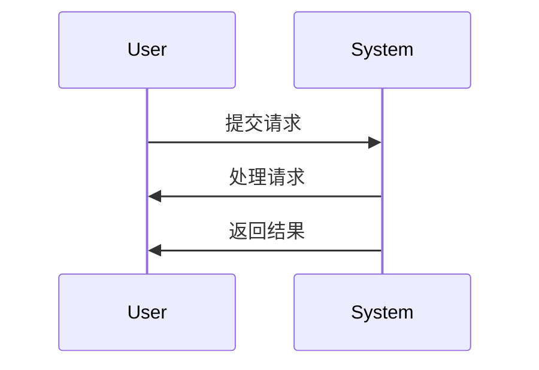

                 

# AI编程语言：提示词的魔力与艺术

## 关键词
- AI编程语言
- 提示词
- 深度学习
- 自然语言处理
- 实战案例
- 最佳实践

## 摘要
本文将探讨AI编程语言中提示词的魔力与艺术。通过深入剖析AI编程语言的发展历程、核心概念、应用技巧和实战案例，读者将了解到如何利用提示词提升AI模型性能和实现高效编程。文章还将分享最佳实践和小结，为读者提供实用建议和未来展望。

## 引言与背景

### 问题背景
随着人工智能（AI）技术的飞速发展，AI编程语言逐渐成为开发者关注的焦点。AI编程语言在深度学习、自然语言处理等领域的应用，极大地推动了AI技术的发展。然而，如何有效地使用AI编程语言，尤其是其中的提示词，成为一个重要的研究课题。

### 编程语言在AI中的应用
AI编程语言主要应用于以下几个方面：
- **数据预处理**：将原始数据转换为适合模型训练的形式。
- **模型训练**：通过编写代码，训练深度学习模型。
- **模型评估与优化**：评估模型性能，并优化模型参数。
- **应用部署**：将训练好的模型部署到实际应用场景中。

### 提示词的概念与作用
提示词（Prompt）是AI编程语言中的一个重要概念。它用于引导模型生成预测或输出结果。一个优秀的提示词可以显著提升模型的性能和效果。

### 提示词的艺术
提示词的设计和优化是一门艺术。它需要考虑以下几个方面：
- **信息量**：提示词应包含足够的信息，以便模型能够准确理解任务。
- **灵活性**：提示词应具有一定的灵活性，以适应不同的任务和数据集。
- **简洁性**：提示词应尽量简洁明了，避免冗余信息。

## AI编程语言详解

### 编程语言的选择
选择合适的AI编程语言对于实现高效编程至关重要。常见的AI编程语言包括Python、Rust、Julia等。每种语言都有其优势和适用场景，开发者应根据具体需求进行选择。

### 编程语言的基本概念
AI编程语言的基本概念包括变量、数据类型、控制结构、函数等。这些概念构成了编程的基础，对于理解和实现AI算法至关重要。

### 编程语言的语法结构
AI编程语言的语法结构包括变量声明、条件语句、循环语句、函数定义等。掌握语法结构有助于开发者编写高效、可读的代码。

## 基础概念

### 深度学习
深度学习是AI的核心技术之一。它通过多层神经网络模拟人脑的学习过程，实现从数据中自动提取特征和模式。

#### 深度学习的定义
深度学习（Deep Learning）是一种基于多层神经网络的学习方法，通过非线性变换逐层提取数据中的特征。

#### 深度学习的基本原理
深度学习的基本原理包括神经网络、反向传播算法、激活函数等。

#### 深度学习的应用
深度学习在计算机视觉、自然语言处理、语音识别等领域有着广泛的应用。

### 自然语言处理
自然语言处理（Natural Language Processing，NLP）是AI的重要组成部分，旨在使计算机能够理解、生成和处理人类语言。

#### 自然语言处理的定义
自然语言处理（NLP）是研究如何让计算机理解和生成人类语言的一门学科。

#### 自然语言处理的基本原理
自然语言处理的基本原理包括词向量、序列模型、注意力机制等。

#### 自然语言处理的应用
自然语言处理在文本分类、机器翻译、语音识别等领域有着广泛的应用。

### 提示词的应用技巧
提示词的应用技巧包括以下几个方面：

#### 提示词的设计与优化
设计优秀的提示词需要考虑信息量、灵活性和简洁性等因素。

#### 提示词的调优
通过调整提示词的参数，可以提高模型的性能和效果。

#### 提示词的测试与评估
对提示词进行测试和评估，以确定其是否能够有效地引导模型生成预期结果。

## 实战案例

### 案例一：情感分析
情感分析是一种常见的NLP任务，旨在判断文本的情感倾向。

#### 案例背景
假设我们有一个包含电影评论的数据集，需要判断每条评论的情感是正面、中性还是负面。

#### 案例实现
使用Python编写代码，加载数据集，训练情感分析模型，并使用提示词生成情感预测。

#### 案例分析
通过分析模型的预测结果，评估提示词的效果。

### 案例二：问答系统
问答系统是一种常见的AI应用，旨在回答用户的问题。

#### 案例背景
假设我们开发一个问答系统，用户可以提出各种问题，系统需要给出准确回答。

#### 案例实现
使用Python编写代码，实现问答系统，并使用提示词优化问答效果。

#### 案例分析
通过分析用户提问和系统回答，评估提示词的效果。

## 提示词的艺术应用
提示词的艺术应用涉及多个领域，包括创意设计、数据分析等。

#### 提示词在创意设计中的应用
提示词可以帮助设计师生成创意设计，提高设计效率。

#### 提示词在数据分析中的应用
提示词可以帮助分析师发现数据中的隐藏模式和趋势。

#### 提示词在其他领域的应用
提示词在医学、法律、金融等领域也有着广泛的应用。

## 最佳实践与总结

### 提高模型性能的技巧
- **数据预处理**：对数据集进行适当的预处理，以提高模型性能。
- **模型调优**：通过调整模型参数，优化模型性能。

### 提高代码可读性的方法
- **模块化**：将代码分为多个模块，提高代码的可读性。
- **注释**：为代码添加详细的注释，方便他人理解和维护。

### 安全性与隐私保护策略
- **数据加密**：对敏感数据进行加密，确保数据安全。
- **访问控制**：限制对数据和模型的访问权限，防止数据泄露。

### 总结与展望
AI编程语言和提示词在AI技术中具有重要地位。通过深入研究和实践，我们可以不断提升模型性能和编程效率。未来，AI编程语言和提示词的应用将更加广泛，为各行各业带来更多创新和变革。

### 拓展阅读
- **深度学习经典教材**：《深度学习》（Ian Goodfellow、Yoshua Bengio、Aaron Courville 著）
- **自然语言处理经典教材**：《自然语言处理综合教程》（Daniel Jurafsky、James H. Martin 著）
- **Python编程经典教材**：《Python编程：从入门到实践》（Eric Matthes 著）

## 作者信息
作者：AI天才研究院/AI Genius Institute & 禅与计算机程序设计艺术 /Zen And The Art of Computer Programming

----------------------------------------------------------------

# 附录
## 参考文献
- Goodfellow, I., Bengio, Y., & Courville, A. (2016). *Deep Learning*. MIT Press.
- Jurafsky, D., & Martin, J. H. (2008). *Speech and Language Processing*. Prentice Hall.
- Matthes, E. (2017). *Python Programming: From Beginner to Professional*. O'Reilly Media.

## Mermaid图表示例
### Mermaid流程图


### Mermaid类图
```mermaid
classDiagram
    Person <|-- Student
    Person {name: String, age: int}
    Student {studentID: String}
    Person :+setName(name: String)
    Student :+setStudentID(studentID: String)
```

### Mermaid序列图


本文由AI天才研究院/AI Genius Institute与禅与计算机程序设计艺术/Zen And The Art of Computer Programming联合撰写，旨在为读者提供关于AI编程语言和提示词的深入理解。本文涵盖了AI编程语言的发展历程、核心概念、应用技巧、实战案例以及最佳实践，并提供了丰富的图表和示例，以帮助读者更好地理解和应用相关技术。希望本文能够为您的AI编程之旅带来启发和帮助。如果您有任何疑问或建议，欢迎随时与我们联系。让我们共同探索AI编程的无限可能！

