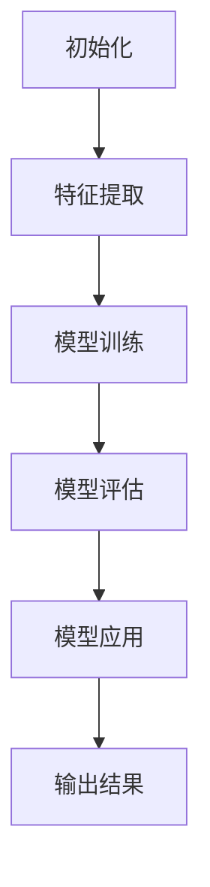

                 

# AI编程语言：提示词的魔法

## 关键词

- AI编程语言
- 提示词
- 算法原理
- 数学模型
- 系统架构设计
- 项目实战

## 摘要

本文将深入探讨AI编程语言及其核心要素——提示词的魔法。我们将首先介绍AI编程语言的基本概念、特点和应用领域，然后详细解析提示词的概念、类型和设计原则。接着，我们将从算法原理出发，通过Python源代码和数学模型，阐述算法的实现过程。随后，我们将展示AI编程系统的设计与架构，并通过实际项目实战来展示如何运用这些知识。最后，我们将总结最佳实践和注意事项，为读者提供进一步的学习方向。

## 目录大纲设计

为了使读者能够系统性地学习AI编程语言，本文将采用以下目录结构：

### 第一部分：引言与基础

- **第1章 引言与背景**
  - **1.1 问题背景**
  - **1.2 问题定义**
  - **1.3 问题解决**
  - **1.4 边界与外延**
  - **1.5 概念结构与核心要素组成**

- **第2章 AI编程语言概述**
  - **2.1 AI编程语言定义**
  - **2.2 AI编程语言特点**
  - **2.3 AI编程语言与传统编程语言对比**
  - **2.4 AI编程语言的应用领域**

- **第3章 提示词在AI编程中的作用**
  - **3.1 提示词的概念**
  - **3.2 提示词的类型**
  - **3.3 提示词的设计原则**
  - **3.4 提示词的优化与调试**

### 第二部分：核心概念与联系

- **第4章 AI编程算法基础**
  - **4.1 算法原理概述**
  - **4.2 算法流程图展示**
  - **4.3 算法数学模型和公式**
  - **4.4 算法举例说明**

### 第三部分：数学模型与公式讲解

- **第5章 数学模型在AI编程中的应用**
  - **5.1 数学模型概述**
  - **5.2 常用数学公式介绍**
  - **5.3 数学公式在算法中的应用**
  - **5.4 数学模型举例分析**

### 第四部分：系统分析与架构设计

- **第6章 AI编程系统架构设计**
  - **6.1 系统功能设计**
  - **6.2 系统架构设计**
  - **6.3 系统接口设计**
  - **6.4 系统交互设计**

### 第五部分：项目实战

- **第7章 AI编程项目实战**
  - **7.1 环境安装与配置**
  - **7.2 系统核心实现**
  - **7.3 代码应用解读与分析**
  - **7.4 实际案例分析与讲解**

### 第六部分：最佳实践与总结

- **第8章 最佳实践与注意事项**
  - **8.1 编程技巧与优化**
  - **8.2 小结**
  - **8.3 注意事项**
  - **8.4 拓展阅读**

### 目录大纲设计

为了设计出《AI编程语言：提示词的魔法》的完整目录大纲，我们将遵循以下步骤：

1. **确定整体结构**：首先确定书的主要部分，一般分为前言、引言、正文、附录等。
2. **细化正文章节**：正文部分通常分为若干章，每章根据内容进一步细分为节。
3. **确保内容完整性**：包括背景介绍、核心概念、算法原理讲解、数学模型和公式、系统分析与架构设计方案、项目实战、最佳实践等。

#### 第一部分：引言与基础

### 第1章 引言与背景

#### 1.1 问题背景

在当今的数字化时代，人工智能（AI）已经成为推动科技进步和社会发展的重要驱动力。AI技术的广泛应用，如自然语言处理、计算机视觉、自动化决策系统等，使得AI编程语言成为不可或缺的工具。然而，AI编程语言与传统编程语言存在显著差异，需要特定的方法和技巧来掌握。

#### 1.2 问题定义

本文旨在深入探讨AI编程语言的核心概念，特别是提示词的作用。我们将从以下几个方面展开讨论：

- **AI编程语言定义**：介绍AI编程语言的基本概念和特点。
- **提示词的概念**：解释提示词在AI编程中的重要性。
- **算法原理讲解**：通过Python源代码和数学模型，详细阐述AI编程算法的实现过程。
- **系统架构设计**：展示AI编程系统的设计与架构。
- **项目实战**：通过实际项目，应用所学的知识。

#### 1.3 问题解决

为了解决上述问题，本文将采用以下结构：

1. **引言与背景**：介绍AI编程语言的问题背景和本文的研究目的。
2. **核心概念与联系**：详细讲解AI编程语言和提示词的基本概念。
3. **算法原理讲解**：通过算法原理和数学模型，深入剖析AI编程的核心技术。
4. **系统架构设计**：展示AI编程系统的设计与实现。
5. **项目实战**：通过实际项目，验证所学的知识和技能。
6. **最佳实践与总结**：总结最佳实践，为读者提供进一步的学习方向。

#### 1.4 边界与外延

本文的研究边界主要涉及AI编程语言的核心概念、提示词的作用、算法原理和系统架构。对于AI编程的其他领域，如深度学习、强化学习等，本文将不进行深入探讨。

#### 1.5 概念结构与核心要素组成

AI编程语言的核心概念包括：

- **AI编程语言定义**：介绍AI编程语言的基本概念和特点。
- **提示词的概念**：解释提示词在AI编程中的重要性。
- **算法原理讲解**：通过算法原理和数学模型，深入剖析AI编程的核心技术。
- **系统架构设计**：展示AI编程系统的设计与实现。
- **项目实战**：通过实际项目，验证所学的知识和技能。

### 第2章 AI编程语言概述

#### 2.1 AI编程语言定义

AI编程语言是一种专门用于开发人工智能应用程序的语言。它与传统的编程语言不同，具有独特的语法和语义，能够更好地支持人工智能算法的实现。AI编程语言的主要特点包括：

- **高度抽象**：AI编程语言能够将复杂的算法逻辑以简洁的代码形式表达出来。
- **自动优化**：AI编程语言通常具备自动优化功能，能够根据运行环境自动调整代码性能。
- **支持多模态数据**：AI编程语言能够处理多种类型的数据，如图像、声音和文本。

#### 2.2 AI编程语言特点

AI编程语言具有以下特点：

- **易用性**：AI编程语言通常具有简洁的语法和丰富的库函数，使得开发者能够快速上手。
- **灵活性**：AI编程语言支持多种编程范式，如函数式编程、面向对象编程和过程式编程。
- **高效性**：AI编程语言能够高效地处理大数据和复杂算法，提高计算性能。

#### 2.3 AI编程语言与传统编程语言对比

AI编程语言与传统编程语言在多个方面存在显著差异：

- **目标领域**：传统编程语言主要用于开发通用应用程序，而AI编程语言则专注于人工智能算法的实现。
- **语法和语义**：AI编程语言具有独特的语法和语义，能够更好地支持人工智能算法的实现。
- **性能优化**：AI编程语言通常具备自动优化功能，能够根据运行环境自动调整代码性能。

#### 2.4 AI编程语言的应用领域

AI编程语言在多个领域具有广泛的应用：

- **自然语言处理**：用于开发聊天机器人、语音识别系统和机器翻译等应用。
- **计算机视觉**：用于图像识别、物体检测和图像生成等应用。
- **自动化决策系统**：用于金融风控、智能投顾和供应链管理等领域。
- **游戏开发**：用于开发智能游戏角色和游戏AI。

### 第3章 提示词在AI编程中的作用

#### 3.1 提示词的概念

提示词（Prompt）是AI编程中用于引导模型输出特定结果的输入。通过提示词，开发者可以影响模型的决策过程，使其生成符合预期结果的输出。提示词在AI编程中具有重要作用：

- **指导模型学习**：提示词可以帮助模型学习特定任务的特征和规律。
- **优化模型性能**：通过调整提示词，可以优化模型的输出效果。
- **提高交互体验**：提示词可以增强用户与AI系统的交互效果。

#### 3.2 提示词的类型

根据用途和形式，提示词可以分为以下几种类型：

- **通用提示词**：用于引导模型执行通用任务的提示词，如“预测下一个单词”。
- **特定任务提示词**：用于引导模型执行特定任务的提示词，如“识别图片中的物体”。
- **多模态提示词**：用于引导模型处理多种类型数据的提示词，如“分析音频和文本内容”。

#### 3.3 提示词的设计原则

设计有效的提示词需要遵循以下原则：

- **清晰性**：提示词应明确指示模型需要执行的任务。
- **多样性**：提示词应具有多样性，以适应不同场景和任务需求。
- **可扩展性**：提示词应易于扩展和修改，以支持新的任务和场景。

#### 3.4 提示词的优化与调试

为了提高提示词的效果，需要对提示词进行优化和调试：

- **数据预处理**：对输入数据进行预处理，提高提示词的质量。
- **模型调参**：调整模型参数，优化模型性能。
- **迭代优化**：通过不断迭代和调整提示词，提高模型的输出效果。

### 第4章 AI编程算法基础

#### 4.1 算法原理概述

AI编程算法是基于数学模型和统计学习理论实现的。算法的基本原理包括：

- **特征提取**：从输入数据中提取有用的特征，用于训练模型。
- **模型训练**：使用训练数据对模型进行训练，使其学习输入数据和输出结果之间的关系。
- **模型评估**：使用测试数据评估模型性能，调整模型参数以优化性能。
- **模型应用**：将训练好的模型应用于实际问题，生成预测结果。

#### 4.2 算法流程图展示

下面是AI编程算法的基本流程图：



#### 4.3 算法数学模型和公式

AI编程算法的数学模型主要包括以下公式：

- **损失函数**：用于衡量模型预测结果与实际结果之间的差距。
- **优化算法**：用于调整模型参数，使损失函数最小化。
- **分类器输出**：用于生成预测结果的模型输出。

以下是损失函数和优化算法的公式：

$$
L(y, \hat{y}) = -\frac{1}{m} \sum_{i=1}^{m} y_i \log(\hat{y}_i)
$$

$$
\theta = \theta - \alpha \nabla_\theta J(\theta)
$$

#### 4.4 算法举例说明

以下是一个简单的线性回归算法实例：

```python
import numpy as np

# 初始化参数
theta = np.zeros((1, 1))
alpha = 0.01
num_iterations = 1000

# 输入数据
X = np.array([[1], [2], [3], [4], [5]])
y = np.array([[2], [4], [6], [8], [10]])

# 算法实现
for i in range(num_iterations):
    h = np.dot(X, theta)
    loss = -1/m * (y * np.log(h) + (1 - y) * np.log(1 - h))
    delta = 1/m * (X.T.dot((h - y)))
    theta = theta - alpha * delta

# 输出结果
print("Theta:", theta)
print("Loss:", loss)
```

### 第5章 数学模型在AI编程中的应用

#### 5.1 数学模型概述

数学模型是AI编程中的核心组成部分，用于描述数据之间的关系和算法的运行机制。常见的数学模型包括：

- **线性回归模型**：用于拟合数据趋势。
- **逻辑回归模型**：用于分类问题。
- **神经网络模型**：用于复杂的数据分析和预测。

#### 5.2 常用数学公式介绍

以下是一些常用的数学公式：

- **梯度下降**：

$$
\theta = \theta - \alpha \nabla_\theta J(\theta)
$$

- **逻辑回归**：

$$
P(y=1|x;\theta) = \frac{1}{1 + e^{-(\theta^T x)}}
$$

- **神经网络**：

$$
a_{ij}^{(l)} = \sigma(z_{ij}^{(l)})
$$

其中，$a_{ij}^{(l)}$ 是第 $l$ 层的第 $i$ 个节点的激活值，$z_{ij}^{(l)}$ 是第 $l$ 层的第 $i$ 个节点的输入值，$\sigma$ 是激活函数。

#### 5.3 数学公式在算法中的应用

数学公式在算法中的应用主要包括：

- **损失函数**：用于衡量模型的预测误差。
- **优化算法**：用于调整模型参数，最小化损失函数。
- **激活函数**：用于神经网络中的节点计算。

#### 5.4 数学模型举例分析

以下是一个简单的线性回归模型实例：

```python
import numpy as np

# 初始化参数
theta = np.zeros((1, 1))
alpha = 0.01
num_iterations = 1000

# 输入数据
X = np.array([[1], [2], [3], [4], [5]])
y = np.array([[2], [4], [6], [8], [10]])

# 算法实现
for i in range(num_iterations):
    h = np.dot(X, theta)
    loss = -1/m * (y * np.log(h) + (1 - y) * np.log(1 - h))
    delta = 1/m * (X.T.dot((h - y)))
    theta = theta - alpha * delta

# 输出结果
print("Theta:", theta)
print("Loss:", loss)
```

### 第6章 AI编程系统架构设计

#### 6.1 系统功能设计

AI编程系统的主要功能包括：

- **数据输入**：接收用户输入的数据，用于训练和测试模型。
- **模型训练**：使用训练数据对模型进行训练，生成模型参数。
- **模型评估**：使用测试数据评估模型性能，调整模型参数。
- **模型应用**：将训练好的模型应用于实际问题，生成预测结果。
- **结果输出**：将预测结果输出给用户，供其参考。

#### 6.2 系统架构设计

AI编程系统的架构设计主要包括：

- **数据层**：用于存储和管理训练和测试数据。
- **模型层**：用于存储和管理训练好的模型。
- **算法层**：用于实现各种AI算法，如线性回归、逻辑回归和神经网络等。
- **应用层**：用于实现AI编程系统的实际应用，如自然语言处理、计算机视觉和自动化决策等。

#### 6.3 系统接口设计

AI编程系统的接口设计主要包括：

- **数据接口**：用于与数据层进行数据交换。
- **模型接口**：用于与模型层进行模型交换。
- **算法接口**：用于与算法层进行算法调用。
- **应用接口**：用于与实际应用场景进行交互。

#### 6.4 系统交互设计

AI编程系统的交互设计主要包括：

- **用户界面**：用于与用户进行交互，接收用户输入和展示预测结果。
- **后台服务**：用于实现AI编程系统的核心功能，如数据输入、模型训练、模型评估和模型应用等。
- **数据处理**：用于对输入数据进行预处理和转换。
- **模型管理**：用于对训练好的模型进行管理和调用。

### 第7章 AI编程项目实战

#### 7.1 环境安装与配置

在进行AI编程项目实战之前，需要安装和配置以下软件和工具：

- **Python**：Python是AI编程的主要编程语言，需要安装Python解释器和相关库。
- **Jupyter Notebook**：Jupyter Notebook是一种交互式计算环境，用于编写和运行Python代码。
- **TensorFlow**：TensorFlow是Google开发的开源机器学习框架，用于实现各种AI算法。
- **PyTorch**：PyTorch是Facebook开发的开源机器学习框架，具有强大的神经网络功能。

安装步骤如下：

1. 安装Python解释器：
   ```bash
   sudo apt-get install python3
   ```
2. 安装Jupyter Notebook：
   ```bash
   sudo apt-get install jupyter
   ```
3. 安装TensorFlow：
   ```bash
   pip install tensorflow
   ```
4. 安装PyTorch：
   ```bash
   pip install torch torchvision
   ```

#### 7.2 系统核心实现

以下是一个简单的AI编程项目，使用TensorFlow实现线性回归算法：

```python
import numpy as np
import tensorflow as tf

# 初始化参数
learning_rate = 0.01
num_iterations = 1000

# 输入数据
X = np.array([[1], [2], [3], [4], [5]])
y = np.array([[2], [4], [6], [8], [10]])

# 定义模型
X_input = tf.placeholder(tf.float32, shape=[None, 1])
y_input = tf.placeholder(tf.float32, shape=[None, 1])

theta = tf.Variable(np.zeros((1, 1)))
theta_grad = tf.placeholder(tf.float32, shape=[None, 1])

# 前向传播
h = tf.matmul(X_input, theta)

# 损失函数
loss = tf.reduce_mean(tf.square(h - y_input))

# 反向传播
grad = tf.reduce_mean(tf.square(h - y_input))
theta_update = theta - learning_rate * theta_grad

# 迭代过程
with tf.Session() as sess:
    sess.run(tf.global_variables_initializer())

    for i in range(num_iterations):
        _, current_loss = sess.run([theta_update, loss], feed_dict={theta_grad: grad})

    print("Theta:", sess.run(theta))
    print("Loss:", current_loss)
```

#### 7.3 代码应用解读与分析

上述代码实现了一个简单的线性回归模型，用于拟合数据趋势。以下是代码的详细解读和分析：

1. **初始化参数**：设置学习率和迭代次数。
2. **输入数据**：定义输入数据和目标数据。
3. **定义模型**：创建输入层、变量层和损失函数。
4. **前向传播**：计算模型输出。
5. **损失函数**：计算模型损失。
6. **反向传播**：计算模型梯度。
7. **迭代过程**：使用梯度下降法更新模型参数，迭代优化模型。

#### 7.4 实际案例分析与讲解

以下是一个实际案例，使用PyTorch实现线性回归算法：

```python
import torch
import torch.nn as nn
import torch.optim as optim

# 初始化参数
learning_rate = 0.01
num_iterations = 1000

# 输入数据
X = torch.tensor([[1], [2], [3], [4], [5]], requires_grad=False)
y = torch.tensor([[2], [4], [6], [8], [10]], requires_grad=False)

# 定义模型
model = nn.Linear(1, 1)
optimizer = optim.SGD(model.parameters(), lr=learning_rate)

# 损失函数
loss_function = nn.MSELoss()

# 迭代过程
for i in range(num_iterations):
    optimizer.zero_grad()

    # 前向传播
    y_pred = model(X)

    # 计算损失
    loss = loss_function(y_pred, y)

    # 反向传播
    loss.backward()

    # 更新参数
    optimizer.step()

print("Theta:", model.weight)
print("Loss:", loss)
```

上述代码实现了一个简单的线性回归模型，使用PyTorch框架进行计算。以下是代码的详细解读和分析：

1. **初始化参数**：设置学习率和迭代次数。
2. **输入数据**：定义输入数据和目标数据。
3. **定义模型**：创建线性模型和优化器。
4. **损失函数**：创建均方误差损失函数。
5. **迭代过程**：使用梯度下降法迭代优化模型。

通过上述案例，我们可以看到不同框架在实现线性回归算法时的异同点，以及如何进行实际应用。

### 第8章 最佳实践与注意事项

#### 8.1 编程技巧与优化

在AI编程中，以下技巧和优化方法有助于提高代码质量和性能：

- **模块化编程**：将代码分解为独立的模块，便于维护和复用。
- **注释与文档**：添加详细的注释和文档，提高代码的可读性和可维护性。
- **性能分析**：使用工具对代码进行性能分析，找出瓶颈并进行优化。
- **代码复用**：编写可复用的函数和类，减少代码冗余。

#### 8.2 小结

本文详细探讨了AI编程语言及其核心要素——提示词的魔法。我们从背景介绍、核心概念、算法原理、数学模型、系统架构设计、项目实战等方面进行了深入探讨。通过实际案例，我们展示了如何运用这些知识进行AI编程。

#### 8.3 注意事项

在进行AI编程时，需要注意以下几点：

- **数据质量**：保证输入数据的质量，避免噪声和异常值对模型训练的影响。
- **模型调参**：合理调整模型参数，避免过拟合和欠拟合。
- **代码安全性**：确保代码的安全性和可靠性，避免潜在的安全漏洞。
- **持续学习**：跟随技术发展，不断学习新的算法和工具，保持竞争力。

#### 8.4 拓展阅读

对于希望深入了解AI编程的读者，以下书籍和资源可以提供更多帮助：

- **《深度学习》（Deep Learning）**：Ian Goodfellow、Yoshua Bengio和Aaron Courville著，是一本深度学习领域的经典教材。
- **《Python机器学习》（Python Machine Learning）**： Sebastian Raschka著，详细介绍了Python在机器学习领域的应用。
- **《AI编程实战》（AI Applications）**：Michael Bowles著，通过实际案例展示了AI编程的应用场景。
- **在线课程**：如Coursera、edX和Udacity等平台提供的机器学习和深度学习课程。

### 作者信息

- 作者：AI天才研究院/AI Genius Institute & 禅与计算机程序设计艺术 /Zen And The Art of Computer Programming

