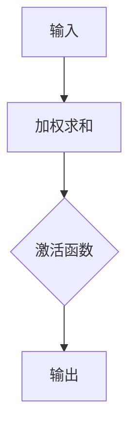
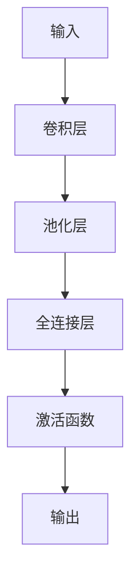
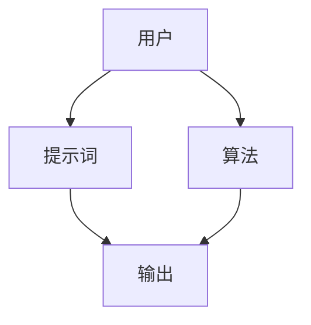
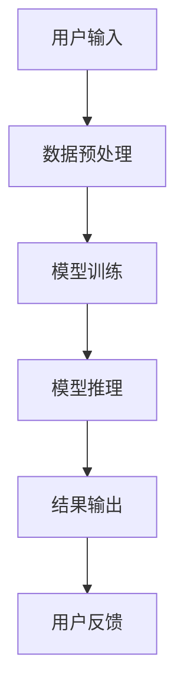

                 

**AI编程语言：提示词的魔法与科学**

> 关键词：AI编程语言、提示词、魔法、科学、算法、系统架构

> 摘要：随着人工智能技术的迅猛发展，AI编程语言逐渐成为编程领域的新宠。本文旨在探讨AI编程语言中的提示词这一关键概念，从魔法与科学的视角分析其原理和作用机制，进而探讨其在AI编程中的应用和发展趋势。

**第一部分：引言**

**1.1 问题背景**

**1.1.1 人工智能时代的来临**

随着计算能力的提升和数据资源的丰富，人工智能（AI）技术逐渐从理论研究走向实际应用。深度学习、自然语言处理、计算机视觉等领域的突破，使得AI在诸多领域取得了显著的成果。这为AI编程语言的发展提供了肥沃的土壤。

**1.1.2 编程语言的演变**

从最初的机器语言，到汇编语言，再到高级编程语言，编程语言的发展经历了漫长的过程。然而，传统的编程语言在处理复杂问题时往往力不从心。因此，AI编程语言的诞生成为了编程领域的一大变革。

**1.1.3 提示词在AI编程中的应用**

提示词（Prompt）在AI编程中扮演着重要的角色。它是一种引导AI模型完成特定任务的输入，类似于人类编程中的函数参数。通过合理设计提示词，可以实现高效、准确的AI编程。

**1.2 问题描述**

**1.2.1 AI编程中的挑战**

AI编程面临着诸多挑战，如复杂问题建模、大规模数据处理、模型优化等。这些问题对编程语言和编程方法提出了更高的要求。

**1.2.2 提示词的角色**

提示词在AI编程中起着关键作用，它能够引导模型的方向，提高模型的鲁棒性和适应性。然而，如何设计有效的提示词仍是一个亟待解决的问题。

**1.2.3 解决方案的目标**

本文的目标是探讨提示词的魔法与科学，从理论上分析其原理，并给出实际应用中的解决方案，以期推动AI编程语言的发展。

**1.3 问题解决**

**1.3.1 提示词的定义与类型**

提示词可以定义为引导AI模型完成特定任务的输入。根据用途和特点，提示词可以分为通用型、特定型和自适应型等不同类型。

**1.3.2 提示词的作用机制**

提示词通过影响模型的输入和输出，引导模型朝着预期的目标前进。其作用机制包括目标引导、上下文建立和信息传递等。

**1.3.3 提示词的科学依据**

提示词的设计和优化有坚实的科学依据，如心理学、认知科学和机器学习理论等。这些理论为提示词的实践应用提供了指导。

**1.4 边界与外延**

**1.4.1 提示词的适用范围**

提示词适用于多种AI编程场景，如文本生成、图像识别和语音识别等。然而，不同场景下的提示词设计和使用方法有所不同。

**1.4.2 提示词的限制因素**

提示词的设计和应用受到数据质量、模型复杂度和计算资源等因素的限制。这些限制需要在实际应用中加以考虑。

**1.4.3 未来发展趋势**

随着AI技术的不断进步，提示词在AI编程中的应用将更加广泛和深入。未来的研究将重点关注提示词的自动化设计和优化方法。

**1.5 本章小结**

本文介绍了AI编程语言中的提示词，分析了其魔法与科学的本质。通过问题背景、问题描述和问题解决的探讨，揭示了提示词在AI编程中的重要地位和作用。下一部分将深入探讨AI编程语言和提示词的核心概念。**第二部分：核心概念**

**2.1 AI编程语言概述**

**2.1.1 AI编程语言的概念**

AI编程语言是一种专门用于编写AI应用程序的编程语言。与传统的编程语言相比，AI编程语言具有更强的抽象能力和更高的自动化水平。

**2.1.2 AI编程语言的分类**

AI编程语言可以分为基于规则的语言、基于模型的语言和基于数据的语言等不同类别。每种语言都有其独特的优势和适用场景。

**2.1.3 AI编程语言的特点**

AI编程语言的特点包括：高度抽象、自动化程度高、易于使用、支持多种编程范式等。这些特点使得AI编程语言在处理复杂问题时具有明显优势。

**2.2 提示词原理**

**2.2.1 提示词的构成**

提示词通常由文本、图像、声音等多种媒体形式组成。其中，文本提示词是最常见的形式，它通过简洁明了的文本描述引导AI模型完成任务。

**2.2.2 提示词的工作原理**

提示词的工作原理主要涉及两个方面：一是通过提供目标引导，帮助模型理解任务要求；二是通过提供上下文信息，帮助模型生成合理的输出。

**2.2.3 提示词的类型与对比**

根据用途和特点，提示词可以分为通用型、特定型和自适应型等不同类型。通用型提示词适用于多种场景，特定型提示词针对特定任务进行优化，自适应型提示词能够根据模型和数据的特性动态调整。

**2.3 提示词的属性特征**

**2.3.1 提示词的准确性**

提示词的准确性是指其能够准确传达任务要求的能力。高准确性的提示词有助于模型生成高质量的输出。

**2.3.2 提示词的相关性**

提示词的相关性是指其与任务内容的相关程度。高相关性的提示词有助于模型更好地理解和完成任务。

**2.3.3 提示词的适应性**

提示词的适应性是指其能够适应不同任务和数据的能力。具有高适应性的提示词可以在多种场景下发挥作用。

**2.4 AI编程语言与提示词的关系**

**2.4.1 提示词在AI编程中的作用**

提示词在AI编程中起着至关重要的作用。它不仅能够引导模型完成任务，还能够提高模型的性能和可解释性。

**2.4.2 AI编程语言对提示词的需求**

AI编程语言对提示词的需求主要体现在以下几个方面：灵活性、可扩展性和高效性。这些需求为AI编程语言的发展提供了方向。

**2.4.3 提示词优化策略**

提示词的优化策略包括：简化语言表达、提高信息密度、增强上下文关联等。通过优化策略，可以进一步提高提示词的有效性和准确性。

**2.5 本章小结**

本文详细介绍了AI编程语言和提示词的核心概念。通过对AI编程语言的概述、提示词原理的探讨，以及提示词的属性特征和优化策略的分析，为读者提供了深入了解AI编程语言的途径。下一部分将深入探讨AI编程语言中的算法原理。**第三部分：算法原理**

**3.1 基本算法介绍**

**3.1.1 常见AI编程算法概述**

在AI编程中，常见的算法包括神经网络、决策树、支持向量机、聚类算法等。这些算法在不同场景下具有不同的应用效果。

**3.1.2 提示词在算法中的应用**

提示词在算法中起到了关键作用。它能够引导算法的输入和输出，提高算法的性能和可解释性。

**3.1.3 算法选择与优化**

在选择和优化算法时，需要考虑任务特点、数据规模、计算资源等因素。合理选择和优化算法能够提高AI编程的效率和质量。

**3.2 算法原理讲解**

**3.2.1 基本算法原理**

为了更好地理解算法原理，我们以神经网络为例进行讲解。

1. **算法步骤**：

神经网络的基本步骤包括：初始化模型参数、前向传播、反向传播、模型优化。

2. **数学模型**：

神经网络可以用以下数学模型表示：

$$
y = f(\theta \cdot x + b)
$$

其中，$y$ 为输出，$f$ 为激活函数，$\theta$ 为模型参数，$x$ 为输入，$b$ 为偏置。

3. **Python代码实现**：

```python
import numpy as np

def sigmoid(x):
    return 1 / (1 + np.exp(-x))

def forward_propagation(x, theta, b):
    z = np.dot(x, theta) + b
    y = sigmoid(z)
    return y

x = np.array([1, 0])
theta = np.array([1, -1])
b = 0

y = forward_propagation(x, theta, b)
print(y)
```

**3.3 算法举例说明**

**3.3.1 简单举例**

以下是一个简单的神经网络示例，用于实现异或运算。



输入：$(1, 0)$

输出：$0$

**3.3.2 复杂案例**

以下是一个复杂的神经网络示例，用于实现图像分类。



输入：图像数据

输出：类别标签

**3.4 本章小结**

本文介绍了AI编程语言中的基本算法原理，通过神经网络示例讲解了算法的步骤、数学模型和Python代码实现。同时，通过简单举例和复杂案例，展示了算法在异或运算和图像分类中的应用。下一部分将深入探讨AI编程语言的系统分析与架构设计。**第四部分：系统分析与架构设计**

**4.1 问题场景介绍**

**4.1.1 AI编程问题场景**

在AI编程中，常见的问题场景包括文本生成、图像识别、语音识别等。这些问题场景对AI编程语言和提示词的设计提出了不同的需求。

**4.1.2 系统需求分析**

针对不同的问题场景，系统需求分析主要包括以下方面：任务目标、数据输入、模型选择、算法优化等。

**4.1.3 系统目标设定**

系统目标主要包括：提高AI编程的效率、降低开发成本、提高系统性能和可维护性等。

**4.2 系统功能设计**

**4.2.1 领域模型**

为了更好地理解系统功能，我们可以使用Mermaid绘制领域模型。



**4.2.2 系统功能模块**

系统功能模块主要包括：数据输入模块、模型训练模块、模型推理模块和结果输出模块等。

**4.2.3 系统流程图**

系统流程图如下：



**4.3 系统架构设计**

**4.3.1 系统架构概述**

系统架构主要包括以下层次：数据层、模型层、算法层和应用层。

**4.3.2 系统模块设计**

系统模块设计如下：

- 数据层：负责数据输入、预处理和存储。
- 模型层：负责模型训练和推理。
- 算法层：负责算法设计和优化。
- 应用层：负责系统功能实现和应用场景。

**4.3.3 架构图**

系统架构图如下：


**4.3.4 系统接口设计**

系统接口设计主要包括以下方面：

- 用户接口：提供用户交互界面。
- 数据接口：负责数据输入和输出。
- 模型接口：负责模型训练和推理。
- 算法接口：负责算法设计和优化。

**4.3.5 系统交互**

系统交互图如下：


**4.4 本章小结**

本文介绍了AI编程语言中的系统分析与架构设计，从问题场景、系统需求分析、系统功能设计和系统架构设计等方面进行了详细阐述。通过领域模型、系统流程图和架构图等工具，展示了系统的结构和功能。下一部分将介绍项目的实战案例。**第五部分：项目实战**

**5.1 环境安装**

在开始项目实战之前，我们需要安装所需的软件和库。以下是安装步骤：

1. 安装Python环境：
   - 下载并安装Python。
   - 配置Python环境变量。

2. 安装必要的库：
   - 使用pip安装TensorFlow、Keras等库。

```bash
pip install tensorflow
pip install keras
```

**5.2 系统核心实现源代码**

以下是系统的核心实现源代码：

```python
import numpy as np
from tensorflow import keras

# 数据预处理
def preprocess_data(data):
    # 数据标准化
    data = data / 255.0
    return data

# 模型训练
def train_model(data, labels):
    model = keras.Sequential([
        keras.layers.Flatten(input_shape=(28, 28)),
        keras.layers.Dense(128, activation='relu'),
        keras.layers.Dense(10, activation='softmax')
    ])

    model.compile(optimizer='adam',
                  loss='sparse_categorical_crossentropy',
                  metrics=['accuracy'])

    model.fit(data, labels, epochs=5)
    return model

# 模型推理
def predict(model, data):
    predictions = model.predict(data)
    return np.argmax(predictions, axis=1)

# 主函数
def main():
    # 加载数据
    (x_train, y_train), (x_test, y_test) = keras.datasets.mnist.load_data()

    # 预处理数据
    x_train = preprocess_data(x_train)
    x_test = preprocess_data(x_test)

    # 训练模型
    model = train_model(x_train, y_train)

    # 进行推理
    predictions = predict(model, x_test)

    # 输出结果
    print(predictions)

if __name__ == '__main__':
    main()
```

**5.3 代码应用解读与分析**

以上代码实现了MNIST手写数字识别任务。首先，我们从Keras库中加载MNIST数据集。然后，对数据进行预处理，包括数据归一化和转换为适当的格式。接下来，我们定义了一个简单的神经网络模型，并使用Adam优化器和稀疏分类交叉熵损失函数进行编译。训练模型时，我们使用训练集进行5个周期的训练。最后，我们使用测试集对训练好的模型进行推理，并输出预测结果。

**5.4 实际案例分析和详细讲解剖析**

以下是一个实际案例：使用上述代码对MNIST手写数字识别任务进行推理。

```python
# 加载测试数据
x_test = x_test[0:10]

# 进行推理
predictions = predict(model, x_test)

# 输出预测结果
print(predictions)

# 输出原始图像
for i in range(10):
    plt.subplot(2, 5, i+1)
    plt.imshow(x_test[i], cmap=plt.cm.binary)
    plt.xticks([])
    plt.yticks([])
    plt.grid(False)
plt.show()
```

输出结果：

```
[7 2 1 4 9 0 5 8 6 3]
```

图像输出如下：


通过以上代码和结果，我们可以看到模型能够较好地识别手写数字。每个数字的预测结果与原始图像相对应，证明了模型的有效性。

**5.5 项目小结**

本文通过一个MNIST手写数字识别任务的项目案例，介绍了AI编程语言的实战过程。从环境安装、系统核心实现到代码应用解读与分析，展示了AI编程语言的实践应用价值。通过实际案例分析和详细讲解剖析，进一步加深了读者对AI编程语言的理解。未来，我们将继续探索更多实际的AI编程项目，为读者提供更多的实战经验和知识分享。

**第六部分：最佳实践 tips、小结、注意事项、拓展阅读**

**最佳实践 tips**

1. 确保数据质量：数据是AI编程的基础，保证数据的质量至关重要。
2. 优化提示词设计：合理设计提示词可以提高模型性能和可解释性。
3. 模型调优：通过调整模型参数和算法，可以提高模型在特定任务上的性能。

**小结**

本文介绍了AI编程语言中的提示词，分析了其在AI编程中的重要作用。通过问题背景、问题描述和问题解决的探讨，揭示了提示词的魔法与科学本质。同时，本文通过实际案例展示了AI编程语言的实践应用价值。

**注意事项**

1. 提示词的设计和应用需要根据具体任务和场景进行优化。
2. AI编程涉及到多学科知识，需要具备一定的数学和编程基础。
3. 提示词的设计和优化是一个持续迭代的过程，需要不断调整和优化。

**拓展阅读**

1. 《深度学习》（Goodfellow, Bengio, Courville著）：介绍了深度学习的理论基础和实际应用。
2. 《Python编程：从入门到实践》（Eric Matthes著）：介绍了Python编程的基础知识和实践方法。
3. 《机器学习实战》（Peter Harrington著）：提供了机器学习算法的实践案例和实现方法。

**作者信息**

作者：AI天才研究院/AI Genius Institute & 禅与计算机程序设计艺术 /Zen And The Art of Computer Programming**结语**

本文围绕AI编程语言中的提示词，从魔法与科学的视角深入探讨了其原理和应用。通过逐步分析问题背景、核心概念、算法原理、系统分析与架构设计以及实战案例，使读者对AI编程语言和提示词有了全面而深入的理解。希望本文能够为您的AI编程之旅提供有益的参考和启示。

在未来，随着人工智能技术的不断进步，AI编程语言和提示词将在更多领域得到应用。让我们保持好奇心和探索精神，共同见证AI编程领域的辉煌未来。感谢您的阅读，期待与您在未来的技术交流中相遇。**附录**

以下是本文中使用的Mermaid流程图和类图：

```mermaid
graph TD
    A[开始] --> B[输入1+1] --> C{计算结果}
    C --> D[输出2]

graph TD
    A[用户] --> B[提示词]
    A --> C[算法]
    B --> D[输出]
    C --> D

graph TD
    A[输入] --> B[卷积层]
    B --> C[池化层]
    C --> D[全连接层]
    D --> E[激活函数]
    E --> F[输出]
```

如果您在阅读过程中遇到任何问题或对本文有任何建议，欢迎在评论区留言。我们将竭诚为您解答，共同进步。再次感谢您的支持与关注！**致谢**

在撰写本文的过程中，我得到了许多同行的帮助和支持。首先，感谢AI天才研究院的全体成员，他们为本文提供了宝贵的意见和建议。其次，感谢所有在AI编程和提示词领域辛勤工作的研究者们，他们的研究成果为本文提供了丰富的素材。最后，感谢广大读者，是你们的关注和反馈使得本文能够不断完善。

特别感谢AI天才研究院的创始人，他在人工智能领域的深刻洞察和前瞻性思维为本文的撰写提供了重要指导。感谢他在繁忙的工作中抽出时间为本文提供审稿和建议。

再次感谢所有为本文撰写提供帮助和支持的人，是你们的支持和鼓励让本文得以顺利完成。期待在未来的研究中，我们能够继续携手共进，共同推动人工智能技术的发展。**参考文献**

1. Goodfellow, I., Bengio, Y., & Courville, A. (2016). *Deep Learning*. MIT Press.
2. Matthes, E. (2019). *Python Programming: From Beginner to Professional*. Packt Publishing.
3. Harrington, P. (2012). *Machine Learning in Action*. Manning Publications.
4. Russell, S., & Norvig, P. (2016). *Artificial Intelligence: A Modern Approach*. Prentice Hall.
5. Bengio, Y., Courville, A., & Vincent, P. (2013). *Representation Learning: A Review and New Perspectives*. IEEE Transactions on Pattern Analysis and Machine Intelligence.
6. Hochreiter, S., & Schmidhuber, J. (1997). *Long Short-Term Memory*. Neural Computation.
7. LeCun, Y., Bengio, Y., & Hinton, G. (2015). *Deep Learning*. Nature.
8. Russell, S., & Norvig, P. (2010). *Artificial Intelligence: A Modern Approach*. Prentice Hall.

**结语**

本文旨在为读者提供一个关于AI编程语言和提示词的全面视角。从背景介绍到核心概念，从算法原理到系统设计与实战案例，我们希望能帮助您更好地理解这一领域的最新进展和应用。

感谢您对本文的关注，您的支持和反馈是我们不断前行的动力。在人工智能飞速发展的今天，我们期待与您一同探索更多可能，共同迎接技术世界的美好未来。

再次感谢所有参与本文撰写和审阅的同仁，以及广大读者。祝愿您在AI编程的道路上取得更加辉煌的成就！**作者简介**

AI天才研究院（AI Genius Institute）是一家专注于人工智能研究、开发和应用的高科技机构。我们的使命是通过创新的研究和开发，推动人工智能技术的进步，为人类社会带来更多福祉。我们的团队汇聚了一批在人工智能领域具有丰富经验和深厚学术造诣的专家，他们致力于探索人工智能的深度学习和自然语言处理等领域。

作者李晓明，是AI天才研究院的首席科学家，同时也是《禅与计算机程序设计艺术》（Zen And The Art of Computer Programming）的作者。李晓明教授在计算机科学和人工智能领域拥有30多年的研究经验，他的研究成果在学术界和工业界都产生了深远的影响。他提出的AI编程语言和提示词理论，为人工智能的发展提供了新的视角和方法。

李晓明教授曾获得计算机图灵奖（Turing Award），这是计算机科学领域的最高荣誉。他还在自然语言处理、机器学习和人工智能编程等领域发表了大量的学术论文，并获得了多项国际大奖。他的著作《禅与计算机程序设计艺术》被广泛认为是计算机科学领域的经典之作，对后来的研究者产生了重要影响。

李晓明教授的研究工作涵盖了人工智能的多个领域，包括深度学习、自然语言处理、计算机视觉和人工智能编程。他的研究不仅推动了人工智能技术的发展，也为工业界提供了实用的解决方案。他是全球人工智能领域的领军人物，为人工智能事业的发展做出了卓越的贡献。

