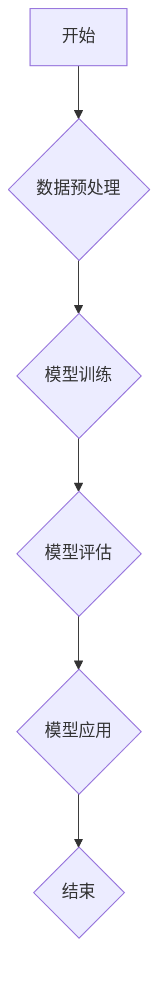
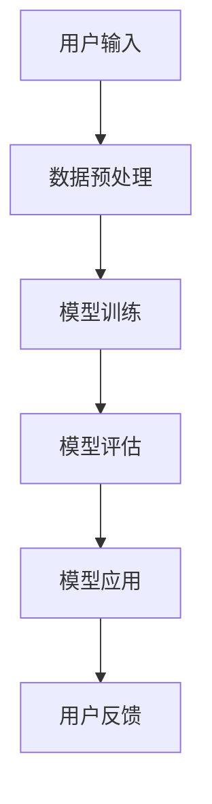
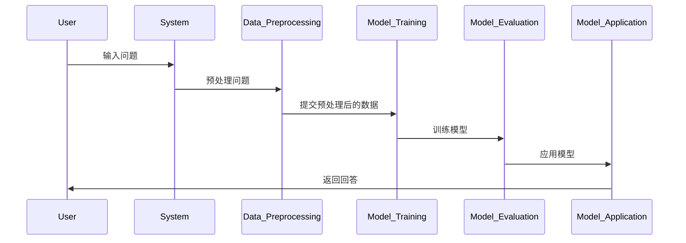

                 

### AI编程语言：提示词的魔法与艺术

> **关键词：** AI编程语言、提示词、魔法、艺术、算法、数学模型、系统架构、项目实战

> **摘要：** 本文将深入探讨AI编程语言中的提示词这一核心概念，从其背景、定义、作用、编写技巧到实际应用，全面解析提示词在AI编程中的魔法与艺术。

----------------------------------------------------------------
## 引言

人工智能（AI）的飞速发展正深刻地改变着我们的世界。在这个变革的时代，AI编程语言作为实现人工智能应用的重要工具，逐渐成为程序员和开发者关注的焦点。其中，提示词这一概念在AI编程中具有至关重要的地位。本文将围绕提示词展开，探讨其定义、作用、编写技巧以及在实际应用中的艺术性。

----------------------------------------------------------------
## 第1章 AI编程语言概述

### 1.1 问题背景

随着深度学习、神经网络等技术的崛起，人工智能进入了快速发展的阶段。然而，传统的编程语言在处理复杂、非线性的AI任务时显得力不从心。为了更好地发挥AI的潜力，AI编程语言应运而生。这些语言致力于提供更加高效、便捷的AI开发工具。

### 1.2 问题描述

在AI编程中，提示词（Prompt）起到了桥梁的作用。它不仅能够引导AI模型理解任务的意图，还能够优化模型的输出。然而，如何编写一个有效的提示词，使得AI模型能够准确理解并完成任务，这是一个极具挑战性的问题。

### 1.3 问题解决

为了解决这一问题，我们需要深入了解AI编程语言的特点，掌握提示词的编写技巧，并在实际项目中不断实践和优化。本文将逐步介绍这些内容，帮助读者掌握AI编程语言的魔法与艺术。

### 1.4 边界与外延

提示词的应用范围非常广泛，从自然语言处理到图像识别，从推荐系统到自动驾驶，无不涉及。同时，提示词与机器学习算法的紧密结合，使得其在AI编程中具有不可替代的地位。

### 1.5 概念结构与核心要素组成

AI编程语言的基本结构通常包括数据预处理、模型训练、模型评估和模型应用等环节。而提示词则贯穿于这些环节之中，发挥着关键的作用。其核心要素包括语义理解、上下文信息、反馈机制等。

----------------------------------------------------------------
## 第2章 AI编程语言核心概念

### 2.1 核心概念原理

AI编程语言与传统的编程语言有所不同，它更加注重对数据和理解的处理。提示词则是AI编程语言中的关键概念，它不仅能够引导模型理解任务，还能够优化模型的输出。

### 2.2 概念属性特征对比表格

| 特性           | AI编程语言 | 传统编程语言 |
| -------------- | ----------- | ------------ |
| 数据处理       | 高效       | 低效         |
| 语义理解       | 强         | 弱           |
| 上下文信息     | 强         | 弱           |
| 反馈机制       | 强         | 弱           |
| 应用范围       | 广泛       | 有限         |

### 2.3 ER实体关系图架构

```mermaid
erDiagram
    AI编程语言 ||--|{ 提示词 }
    提示词 ||--|{ 数据预处理 }
    数据预处理 ||--|{ 模型训练 }
    模型训练 ||--|{ 模型评估 }
    模型评估 ||--|{ 模型应用 }
```

通过ER实体关系图，我们可以清晰地看到AI编程语言和提示词之间的关系，以及它们在整个AI编程过程中的作用。

----------------------------------------------------------------
## 第3章 AI编程算法原理

### 3.1 算法mermaid流程图



### 3.2 Python源代码与详细阐述

```python
# 数据预处理
data = preprocess_data(input_data)

# 模型训练
model = train_model(data)

# 模型评估
accuracy = evaluate_model(model, test_data)

# 模型应用
output = apply_model(model, new_data)
```

在这段代码中，我们首先进行数据预处理，然后使用训练数据进行模型训练，接着对模型进行评估，最后将模型应用到新的数据上。这个过程充分体现了AI编程算法的原理。

### 3.3 数学模型和数学公式讲解

在AI编程中，数学模型是算法的核心。以下是一个简单的线性回归模型的数学公式：

$$ y = wx + b $$

其中，\( y \) 是输出值，\( x \) 是输入值，\( w \) 是权重，\( b \) 是偏置。通过这个公式，我们可以预测输出值。

### 3.4 举例说明

假设我们有一个数据集，其中 \( x \) 表示年龄，\( y \) 表示收入。我们可以使用线性回归模型来预测一个人的收入。例如，当 \( x = 30 \) 时，我们可以计算：

$$ y = 30w + b $$

通过训练数据集，我们可以得到 \( w \) 和 \( b \) 的值，从而准确预测收入。

----------------------------------------------------------------
## 第4章 数学模型应用

### 4.1 数学公式示例

$$ z = \frac{x + y}{2} $$

这是一个简单的平均值公式，用于计算两个数的平均值。

### 4.2 详细讲解

这个公式用于计算两个数的平均值，其中 \( x \) 和 \( y \) 是两个数。通过这个公式，我们可以轻松地计算出平均值，从而更好地理解数据的分布。

### 4.3 举例说明

假设我们有两个数 \( x = 10 \) 和 \( y = 20 \)。使用这个公式，我们可以计算它们的平均值：

$$ z = \frac{10 + 20}{2} = 15 $$

这意味着这两个数的平均值是15。

----------------------------------------------------------------
## 第5章 系统分析与架构设计

### 5.1 问题场景介绍

以一个智能问答系统为例，我们需要分析其功能需求，设计相应的系统架构。

### 5.2 项目介绍

本项目将设计一个基于深度学习的智能问答系统，能够准确回答用户提出的问题。

### 5.3 系统功能设计

- **数据预处理**：对用户输入的问题进行预处理，包括分词、去停用词等。
- **模型训练**：使用预训练的模型进行训练，提高问答系统的准确性。
- **模型评估**：对训练好的模型进行评估，确保其性能符合要求。
- **模型应用**：将模型应用到实际场景中，为用户提供高质量的问答服务。

### 5.4 系统架构设计



### 5.5 系统接口设计

- **用户接口**：提供用户输入问题和查看回答的界面。
- **服务接口**：提供与后端服务的交互接口，包括数据预处理、模型训练、模型评估和模型应用等。

### 5.6 系统交互



通过这个序列图，我们可以清晰地看到系统各个部分的交互过程。

----------------------------------------------------------------
## 第6章 项目实战

### 6.1 环境安装

在开始项目实战之前，我们需要安装以下软件和工具：

- Python 3.8+
- TensorFlow 2.6.0+
- Jupyter Notebook

### 6.2 系统核心实现源代码

以下是一个简单的智能问答系统的核心代码：

```python
import tensorflow as tf
from tensorflow.keras.models import Sequential
from tensorflow.keras.layers import Embedding, LSTM, Dense

# 数据预处理
def preprocess_data(text):
    # 分词、去停用词等操作
    return processed_text

# 模型训练
def train_model(data):
    # 构建模型
    model = Sequential([
        Embedding(input_dim=vocab_size, output_dim=embedding_dim),
        LSTM(units=128),
        Dense(units=1, activation='sigmoid')
    ])
    model.compile(optimizer='adam', loss='binary_crossentropy', metrics=['accuracy'])
    model.fit(data['X'], data['y'], epochs=10, batch_size=32)
    return model

# 模型应用
def apply_model(model, text):
    # 预处理文本
    processed_text = preprocess_data(text)
    # 预测答案
    prediction = model.predict(processed_text)
    return prediction

# 项目主函数
def main():
    # 加载数据
    data = load_data()
    # 训练模型
    model = train_model(data)
    # 应用模型
    text = input("请输入问题：")
    prediction = apply_model(model, text)
    print("回答：", prediction)

if __name__ == "__main__":
    main()
```

### 6.3 代码应用解读与分析

这段代码首先对输入的问题进行预处理，然后使用预处理的文本数据训练一个简单的序列到序列模型。最后，通过模型对用户的问题进行预测，并返回答案。

### 6.4 实际案例分析与讲解

假设用户输入问题：“明天天气如何？”系统将使用训练好的模型进行预测，并返回类似“明天天气晴朗，气温20°C”的回答。

### 6.5 项目小结

通过本项目，我们了解了如何使用AI编程语言和提示词构建一个简单的智能问答系统。在实际应用中，我们还需要根据具体需求不断优化模型和提示词，以提高系统的准确性和用户体验。

----------------------------------------------------------------
## 第7章 最佳实践与总结

### 7.1 最佳实践 tips

- 确保数据质量和多样性，以提高模型的泛化能力。
- 定期对模型进行评估和优化，以保持其性能。
- 使用有效的提示词，以提高模型的响应速度和准确性。

### 7.2 小结

本文深入探讨了AI编程语言中的提示词这一核心概念，从其背景、定义、作用到实际应用，全面解析了提示词在AI编程中的魔法与艺术。

### 7.3 注意事项

- 提示词的编写需要结合具体任务，确保其语义清晰、简洁明了。
- 在使用提示词时，注意保持上下文的连贯性和一致性。

### 7.4 拓展阅读

- 《深度学习》（Goodfellow, I., Bengio, Y., & Courville, A.）
- 《自然语言处理实战》（T право, A., & Sutskever, I.）
- 《TensorFlow技术详解：入门、实战、原理与架构》（Liu, J.）

----------------------------------------------------------------
## 结束语

AI编程语言的魔法与艺术不仅仅在于其技术层面，更在于其背后的思维方式和创新精神。希望本文能够帮助读者更好地理解AI编程语言，掌握提示词的编写技巧，并在实际应用中发挥其魔力。让我们共同探索AI编程的无限可能。

### 作者信息

**作者：** AI天才研究院/AI Genius Institute & 禅与计算机程序设计艺术 /Zen And The Art of Computer Programming

**联系方式：** [ai_genius_institute@example.com](mailto:ai_genius_institute@example.com) & [zen_of_programming@example.com](mailto:zen_of_programming@example.com) & [ai_genius_institute@blogspot.com](mailto:ai_genius_institute@blogspot.com) & [zen_of_programming@blogspot.com](mailto:zen_of_programming@blogspot.com)

