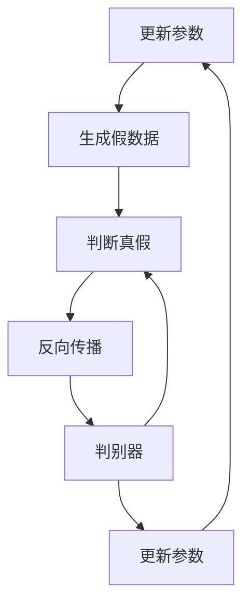
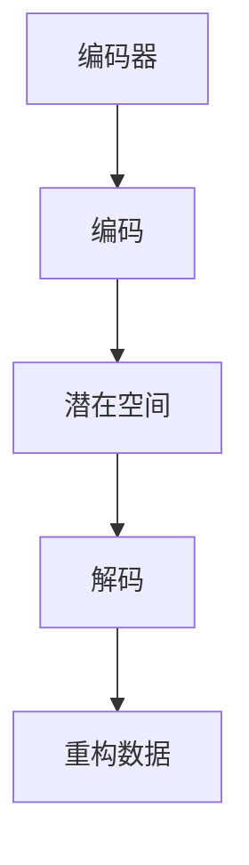
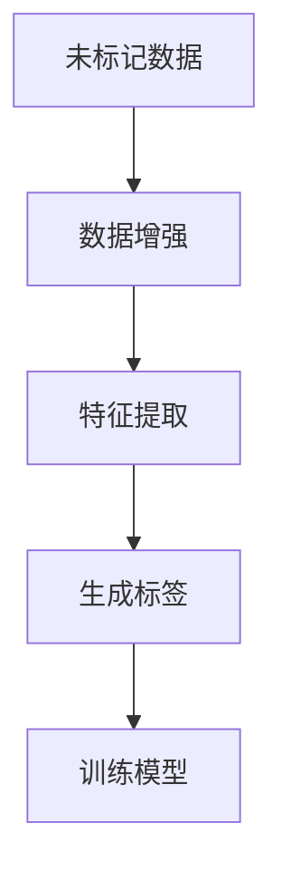
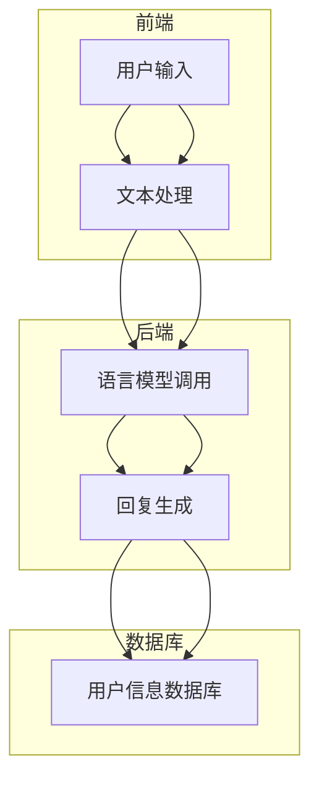

                 


### 1. 引言：AI语言模型的局限性与突破

#### 关键词：自然语言处理、AI语言模型、局限性、突破、未来展望

#### 摘要：

随着人工智能技术的不断发展，AI语言模型在自然语言处理（NLP）领域取得了显著的成就。然而，尽管AI语言模型已经在许多应用中表现出色，但其局限性也逐渐显现。本文旨在深入探讨AI语言模型的局限性，分析其背后的原因，并提出可能的突破方向。文章将从以下几个方面展开：

1. **问题背景与定义**：介绍AI语言模型的发展历程、现状及其局限性。
2. **核心概念与联系**：阐述核心概念如生成对抗网络（GAN）、变分自编码器（VAE）和自监督学习的原理及其相互关系。
3. **算法原理讲解**：详细讲解GAN、VAE和自监督学习的数学模型和公式，并结合Python源代码进行举例说明。
4. **系统分析与架构设计**：分析问题场景，设计系统架构，包括功能模块划分、接口设计和系统交互。
5. **项目实战**：介绍环境安装、系统核心实现和代码解读，结合实际案例分析模型性能提升的方法。
6. **最佳实践与拓展阅读**：总结最佳实践，展望未来研究方向，并提供相关拓展阅读。

通过本文的逐步分析，我们希望能够为读者提供一个全面而深入的视角，以理解AI语言模型的局限性和潜在突破点，从而推动该领域的发展。

#### 1.1 问题的背景与提出

自然语言处理（NLP）是人工智能（AI）领域的一个重要分支，旨在让计算机理解和处理人类语言。随着深度学习技术的兴起，AI语言模型在NLP中的应用越来越广泛，成为众多行业的关键技术之一。从最初的统计模型，如n元语言模型，到基于神经网络的深度学习模型，如循环神经网络（RNN）和变换器（Transformer），AI语言模型经历了迅猛的发展。如今，AI语言模型已经在机器翻译、文本生成、情感分析、问答系统等多个领域取得了显著的成就。

然而，尽管AI语言模型在许多应用中表现出色，其局限性也逐渐显现。首先，AI语言模型通常高度依赖大量高质量的训练数据，这导致了数据依赖性问题。其次，AI语言模型的泛化能力有限，容易在未见过的数据上表现不佳。此外，AI语言模型在隐私和安全方面也存在隐患，因为训练数据和模型参数可能包含敏感信息。最后，AI语言模型缺乏解释性，使得用户难以理解模型的决策过程。

为了解决这些局限性，研究人员提出了多种方法，包括引入生成对抗网络（GAN）、变分自编码器（VAE）和自监督学习等先进技术。这些方法试图提升模型的泛化能力、增强模型的可解释性，并解决隐私和安全问题。本文将详细探讨这些方法，分析其原理和优势，并探讨其在实际应用中的可行性。

本文的目标是深入分析AI语言模型的局限性，并提出可能的突破方向。通过本文的探讨，我们希望能够为读者提供一个全面而深入的视角，以理解AI语言模型的现状及其未来发展。

#### 1.2 AI语言模型的定义

AI语言模型是指利用人工智能技术，特别是深度学习算法，来对自然语言进行处理和分析的模型。其核心在于对语言数据进行建模，从而实现对语言的理解、生成和翻译等功能。语言模型的基本概念可以追溯到20世纪50年代，当时的学者开始尝试通过统计方法来预测下一个单词的概率。随着计算能力和算法的进步，现代语言模型已经发展成为一个复杂而强大的系统。

常见的语言模型类型主要包括以下几种：

1. **n元语言模型**：基于统计方法，通过计算前n个单词的联合概率来预测下一个单词。这种模型简单且易于实现，但在长文本处理上效果不佳。

2. **循环神经网络（RNN）**：RNN通过记忆状态来处理序列数据，能够捕捉到文本中的长期依赖关系。然而，RNN在训练过程中存在梯度消失和梯度爆炸问题，限制了其性能。

3. **长短时记忆网络（LSTM）**：LSTM是RNN的一种改进，通过引入门控机制来避免梯度消失问题。LSTM在处理长文本和序列数据时表现优异，但仍然存在计算复杂度高的问题。

4. **变换器（Transformer）**：Transformer是一种基于自注意力机制的模型，通过并行计算和多头注意力机制来提升模型的表示能力和计算效率。Transformer在许多NLP任务上取得了突破性成果，成为当前最流行的语言模型之一。

5. **生成对抗网络（GAN）**：GAN是一种用于生成模型训练的技术，通过生成器和判别器的对抗训练来提升模型的生成能力。GAN在文本生成任务中展示了强大的能力，但如何结合语言模型进行有效训练仍是一个挑战。

6. **变分自编码器（VAE）**：VAE是一种概率生成模型，通过编码器和解码器的结构来生成数据。VAE在文本生成任务中能够产生多样性的文本，但生成质量尚需提升。

7. **自监督学习**：自监督学习是一种无需人工标注数据的方法，通过利用未标记的数据进行学习。自监督学习在语言模型训练中能够提高模型的泛化能力和数据利用效率。

这些语言模型各有优缺点，适用于不同的NLP任务。随着技术的不断进步，未来可能会出现更多创新的模型，以应对AI语言模型的局限性。

#### 1.3 AI语言模型的局限性概述

尽管AI语言模型在自然语言处理领域取得了显著的进展，但其局限性仍然存在，这些局限性主要包括以下几个方面：

1. **数据依赖性**：AI语言模型通常需要大量高质量的训练数据来进行训练。这些数据不仅要求规模大，还需要涵盖各种语言现象和背景知识。然而，获取这样高质量的数据并不容易，尤其是在某些特定领域或语言环境中。此外，数据的不平衡性也会影响模型的性能。例如，某些词汇或句型在数据集中出现的频率较低，这可能导致模型对这些罕见现象的处理能力不足。

2. **泛化能力不足**：AI语言模型的泛化能力是评估其性能的重要指标。泛化能力强的模型能够较好地处理未见过的数据，而泛化能力不足的模型则可能仅在训练数据上表现良好。这主要是因为模型在训练过程中过度拟合了训练数据，导致无法适应新的数据分布。为了提升模型的泛化能力，研究人员提出了一系列方法，如数据增强、迁移学习和元学习等，但这些问题仍需要进一步解决。

3. **隐私和安全问题**：在训练和部署AI语言模型时，通常会涉及大量的个人数据，这引发了许多隐私和安全问题。首先，如果模型训练数据包含敏感信息，如个人身份、健康状况等，那么在模型使用过程中这些信息可能会被泄露。其次，AI语言模型可能被恶意使用，例如通过伪造文本进行网络攻击或传播虚假信息。为了解决这些问题，研究人员提出了多种数据隐私保护技术和安全增强方法，但如何在保证隐私和安全的前提下提升模型性能仍是一个挑战。

4. **解释性差**：AI语言模型通常被视为“黑箱”，其决策过程难以解释。这对于应用场景中的模型解释性需求提出了挑战。例如，在医疗诊断、金融风险评估等关键领域，用户往往需要了解模型的决策依据，以便进行合理的决策。为了提升模型的可解释性，研究人员提出了一系列方法，如注意力机制可视化、特征重要性分析等，但如何有效且直观地展示模型的内部工作原理仍需要进一步研究。

5. **计算资源消耗**：训练和部署AI语言模型通常需要大量的计算资源，尤其是在模型规模和复杂性不断增加的背景下。这可能导致训练时间过长，模型部署成本高昂。尽管硬件设备的进步，如GPU和TPU的普及，为训练大型模型提供了可能，但如何在有限的资源下高效地训练和部署模型仍然是一个重要的研究问题。

6. **语言多样性和跨语言问题**：虽然AI语言模型在多种语言上都有所应用，但不同语言的语法、语义和语用特点差异较大，这给跨语言模型的训练和应用带来了挑战。例如，某些语言具有丰富的形态变化，而其他语言则相对简单。此外，跨语言模型在处理语言转换和翻译时，需要考虑源语言和目标语言的差异，这增加了模型的复杂性和训练难度。

综上所述，AI语言模型在数据依赖性、泛化能力、隐私和安全、解释性、计算资源消耗以及语言多样性等方面仍存在显著局限性。为了解决这些问题，需要结合多学科知识，不断探索创新方法和技术，以推动AI语言模型的进一步发展。

### 2. 核心概念与联系

在深入探讨AI语言模型的局限性之前，我们需要了解几个核心概念：生成对抗网络（GAN）、变分自编码器（VAE）和自监督学习。这些概念不仅在理论上具有重要意义，而且在实践中也广泛应用于提升AI语言模型的性能。下面，我们将逐一介绍这些概念，并探讨它们之间的联系。

#### 2.1 核心概念原理

**生成对抗网络（GAN）**：

生成对抗网络（GAN）是由Ian Goodfellow等人在2014年提出的一种深度学习模型，主要用于生成逼真的数据。GAN由两个神经网络组成：生成器（Generator）和判别器（Discriminator）。生成器的任务是生成类似于真实数据的假数据，而判别器的任务是区分生成器生成的假数据和真实数据。

GAN的训练过程可以看作是一种零和博弈。生成器和判别器相互对抗，生成器的目标是最大化判别器判断其生成数据为真实的概率，而判别器的目标是最大化判断生成数据为假数据（即区分真实和假数据的准确性）。通过这种对抗训练，生成器逐渐提高其生成能力，从而生成越来越真实的数据。

**变分自编码器（VAE）**：

变分自编码器（VAE）是另一种概率生成模型，由Diederik P. Kingma和Max Welling在2013年提出。VAE由编码器（Encoder）和解码器（Decoder）组成，编码器将输入数据编码为一个潜在空间中的向量，解码器则从潜在空间中生成与输入数据相似的数据。

VAE的关键特点是引入了变分后验分布，这使模型能够生成多样化的数据。具体来说，编码器输出的是输入数据的均值和方差，这些参数定义了一个高斯分布，从而在潜在空间中生成数据。VAE在生成数据的同时，也学习了数据的概率分布，这有助于模型对数据进行有效的编码和解码。

**自监督学习**：

自监督学习是一种无需人工标注数据的方法，其核心思想是利用未标记的数据进行学习。自监督学习可以分为无监督学习和有监督学习两种类型。无监督学习通过发现数据中的内在结构来进行学习，而有监督学习则利用已标记的数据进行训练。

在AI语言模型中，自监督学习尤为重要。自监督学习不仅能够提升模型的泛化能力，还可以提高数据利用效率。例如，在语言模型训练过程中，可以使用未标记的文本数据进行预训练，然后使用标记数据进一步微调模型。

#### 2.2 概念属性特征对比表格

为了更直观地理解这些概念，我们可以在下表中对比它们的属性特征：

| 概念     | 主要功能                      | 特点                                                      | 应用场景                       |
|---------|----------------------------|---------------------------------------------------------|-------------------------------|
| GAN     | 生成逼真的数据              | 对抗训练，生成器和判别器相互对抗                      | 图像生成、文本生成             |
| VAE     | 对数据进行编码和解码          | 引入变分后验分布，生成多样化数据                      | 数据生成、图像去噪             |
| 自监督学习 | 利用未标记数据学习          | 无需人工标注，提高数据利用效率                         | 语言模型预训练、数据增强       |

#### 2.3 ER实体关系图架构

为了更好地理解这些概念之间的关系，我们可以使用实体关系图（ER图）来展示它们之间的关联。ER图是数据库设计中常用的工具，用于描述实体之间的关系。

以下是一个简化的ER图，展示了GAN、VAE和自监督学习之间的关联：

```mermaid
erDiagram
  GAN ||--|{ Encoder }|| VAE
  GAN ||--|{ Decoder }|| VAE
  GAN ..|{ 对抗训练 }||| 自监督学习
  VAE ..|{ 潜在空间 }||| 自监督学习
```

在这个ER图中，GAN与VAE通过编码器和解码器相互连接，表示GAN中的生成器和判别器可以视为VAE的编码器和解码器的一部分。此外，GAN和自监督学习通过对抗训练和潜在空间相联系，表示自监督学习在GAN中的应用。

通过上述对核心概念的介绍和ER图的展示，我们能够更清晰地理解GAN、VAE和自监督学习在AI语言模型中的作用和联系，为后续的算法原理讲解和系统设计与实现奠定了基础。

#### 3. 算法原理讲解

在本节中，我们将深入探讨生成对抗网络（GAN）、变分自编码器（VAE）和自监督学习的算法原理，详细讲解其数学模型和公式，并结合Python源代码进行举例说明。

##### 3.1 生成对抗网络（GAN）

**GAN的mermaid流程图**：

首先，我们使用Mermaid绘制GAN的训练流程图：



**GAN的数学模型和公式**：

在GAN中，生成器和判别器分别通过以下损失函数进行训练：

生成器的损失函数：
\[ L_G = -\log(D(G(z))) \]

判别器的损失函数：
\[ L_D = -\log(D(x)) - \log(1 - D(G(z)) \]

其中，\( G(z) \) 是生成器生成的假数据，\( D(x) \) 和 \( D(G(z)) \) 分别是判别器对真实数据和生成数据的判断结果。

**GAN的Python源代码**：

```python
import tensorflow as tf
from tensorflow.keras.layers import Dense, Flatten
from tensorflow.keras.models import Sequential

# 生成器模型
generator = Sequential([
    Dense(128, input_shape=(100,), activation='relu'),
    Dense(28*28, activation='sigmoid'),
    Flatten()
])

# 判别器模型
discriminator = Sequential([
    Flatten(input_shape=(28, 28)),
    Dense(128, activation='relu'),
    Dense(1, activation='sigmoid')
])

# 定义损失函数和优化器
generator_optimizer = tf.keras.optimizers.Adam(1e-4)
discriminator_optimizer = tf.keras.optimizers.Adam(1e-4)

# 定义GAN损失函数
def loss_fn(real_output, fake_output):
    real_loss = tf.reduce_mean(tf.nn.sigmoid_cross_entropy_with_logits(labels=tf.ones_like(real_output), logits=real_output))
    fake_loss = tf.reduce_mean(tf.nn.sigmoid_cross_entropy_with_logits(labels=tf.zeros_like(fake_output), logits=fake_output))
    total_loss = real_loss + fake_loss
    return total_loss

# 训练过程
@tf.function
def train_step(images, noise):
    with tf.GradientTape() as gen_tape, tf.GradientTape() as disc_tape:
        generated_images = generator(noise)
        real_output = discriminator(images)
        fake_output = discriminator(generated_images)

        gen_loss = loss_fn(fake_output, generated_images)
        disc_loss = loss_fn(real_output, fake_output)

    gradients_of_generator = gen_tape.gradient(gen_loss, generator.trainable_variables)
    gradients_of_discriminator = disc_tape.gradient(disc_loss, discriminator.trainable_variables)

    generator_optimizer.apply_gradients(zip(gradients_of_generator, generator.trainable_variables))
    discriminator_optimizer.apply_gradients(zip(gradients_of_discriminator, discriminator.trainable_variables))

# 加载数据和噪声
(x_train, _), ( _, _) = tf.keras.datasets.mnist.load_data()
x_train = x_train / 127.5 - 1.0
noise = tf.random.normal([100, 100])

# 训练GAN
for epoch in range(50):
    for image_batch, _ in x_train:
        train_step(image_batch, noise)
```

**通俗易懂的举例说明**：

假设我们有一个生成器G和一个判别器D。生成器G的任务是生成逼真的手写数字图像，而判别器D的任务是判断图像是真实的还是生成的。每次训练过程中，生成器G会根据随机噪声生成一批手写数字图像，判别器D则会分别对真实图像和生成图像进行判断。

假设判别器D的输出是一个概率值，表示其判断图像为真实的置信度。例如，对于一张真实的手写数字图像，判别器D的输出可能是0.9，表示有90%的置信度认为这是真实的；而对于一张由生成器G生成的图像，判别器D的输出可能是0.1，表示只有10%的置信度认为这是真实的。

通过对抗训练，生成器G的目标是使得判别器D无法区分生成的图像和真实的图像，从而提高其生成能力。而判别器D的目标是尽量准确地判断图像的真实性，从而提高其鉴别能力。在训练过程中，生成器和判别器不断更新其参数，以实现这两个目标。

通过这样的对抗训练，生成器G能够生成越来越逼真的图像，而判别器D则能够更加准确地判断图像的真实性。最终，当判别器D无法区分生成图像和真实图像时，我们可以认为生成器G已经成功生成了高质量的图像。

##### 3.2 变分自编码器（VAE）

**VAE的mermaid流程图**：

我们使用Mermaid绘制VAE的训练流程图：



**VAE的数学模型和公式**：

VAE的数学模型主要包括编码器和解码器两部分。编码器将输入数据编码为一个潜在空间中的向量，解码器则从潜在空间中生成重构数据。

编码器：
\[ \mu = \mu(x); \sigma = \sigma(x) \]

解码器：
\[ x' = \phi(z) \]

其中，\( \mu(x) \) 和 \( \sigma(x) \) 分别为编码器输出的均值和方差，定义了一个高斯分布。\( \phi(z) \) 是解码器从潜在空间中生成数据的函数。

VAE的损失函数通常结合了重构损失和正则化损失：
\[ L = \sum_{x} D_{KL}(\mu(x), \sigma(x)) + \sum_{x'} ||x - x'|| \]

其中，\( D_{KL}(\mu(x), \sigma(x)) \) 是KL散度，表示编码器输出的后验分布和先验分布之间的差异；第二个损失项是重构损失，表示重构数据与原始数据之间的差异。

**VAE的Python源代码**：

```python
import tensorflow as tf
from tensorflow.keras.layers import Dense
from tensorflow.keras.models import Model

# 编码器
input_img = tf.keras.layers.Input(shape=(784,))
encoded = Dense(64, activation='relu')(input_img)
encoded = Dense(32, activation='relu')(encoded)
mu = Dense(32, activation='linear')(encoded)
log_sigma = Dense(32, activation='linear')(encoded)

# 解码器
latent_inputs = tf.keras.layers.Input(shape=(32,))
x = Dense(64, activation='relu')(latent_inputs)
x = Dense(64, activation='relu')(x)
x = Dense(784, activation='sigmoid')(x)

# 构建VAE模型
vae = Model(inputs=input_img, outputs=x)
vae.compile(optimizer='adam', loss='binary_crossentropy')

# 训练过程
vae.fit(x_train, x_train, epochs=30, batch_size=16)
```

**通俗易懂的举例说明**：

VAE可以被看作是一种数据压缩方法。编码器将输入数据（如手写数字图像）编码为一个潜在空间中的向量，这个向量包含了输入数据的主要特征信息。解码器则从潜在空间中生成新的数据，试图重建原始数据。

例如，假设我们有一个手写数字图像，编码器会将其编码为一个潜在空间中的向量，这个向量包含了数字的主要特征，如笔画的形状和大小。解码器会从潜在空间中生成一个新向量，试图重建原始图像。

通过这种方式，VAE不仅能够学习输入数据的概率分布，还能够生成多样化的数据。此外，由于潜在空间中的向量维度较低，VAE还可以在一定程度上压缩数据，使其存储和传输更高效。

##### 3.3 自监督学习

**自监督学习的mermaid流程图**：

我们使用Mermaid绘制自监督学习的流程图：



**自监督学习的数学模型和公式**：

自监督学习的关键在于从未标记的数据中提取特征，并利用这些特征进行模型训练。常见的自监督学习方法包括预训练和后续微调。预训练阶段，模型在大量未标记数据上进行训练，提取通用特征；后续微调阶段，模型在标记数据上进行微调，以适应特定任务。

一个简单的自监督学习流程包括数据增强、特征提取和生成标签三个步骤：

1. **数据增强**：通过对原始数据进行变换，如旋转、缩放、裁剪等，增加数据的多样性，从而提高模型的泛化能力。

2. **特征提取**：模型从数据中提取特征，这些特征可以用于后续的任务。

3. **生成标签**：根据提取的特征，生成对应的标签。例如，在图像分类任务中，特征可以用来预测图像的类别。

4. **训练模型**：利用生成的标签对模型进行训练，以优化模型参数。

**自监督学习的Python源代码**：

```python
import tensorflow as tf
from tensorflow.keras.layers import Conv2D, MaxPooling2D, Flatten, Dense
from tensorflow.keras.models import Model

# 数据增强
train_datagen = tf.keras.preprocessing.image.ImageDataGenerator(
    rotation_range=40,
    width_shift_range=0.2,
    height_shift_range=0.2,
    horizontal_flip=True,
    zoom_range=0.2,
)

# 特征提取器
inputs = tf.keras.layers.Input(shape=(32, 32, 3))
x = Conv2D(32, (3, 3), activation='relu')(inputs)
x = MaxPooling2D((2, 2))(x)
x = Conv2D(64, (3, 3), activation='relu')(x)
x = MaxPooling2D((2, 2))(x)
x = Flatten()(x)

# 生成标签
outputs = Dense(10, activation='softmax')(x)

# 构建模型
autoencoder = Model(inputs=inputs, outputs=outputs)
autoencoder.compile(optimizer='adam', loss='categorical_crossentropy')

# 训练模型
train_generator = train_datagen.flow(x_train, y_train, batch_size=32)
autoencoder.fit(train_generator, epochs=30)
```

**通俗易懂的举例说明**：

自监督学习可以看作是一种“自学”的方法。例如，在图像分类任务中，模型首先从未标记的图像数据中提取特征，这些特征可以用于预测图像的类别。通过这种方式，模型不仅能够利用未标记的数据进行训练，还可以提高其泛化能力。

假设我们有一个数据集，其中包含大量未标记的图像。首先，模型会从这些图像中提取特征，这些特征可以是图像中的颜色分布、纹理特征等。然后，模型会根据提取的特征生成标签，例如，预测图像中的物体类别。

通过这种方式，模型可以在不依赖标记数据的情况下，逐渐学习图像的特征和类别信息。在训练过程中，模型会不断优化其参数，以提升预测的准确性。最终，通过这种自监督学习的方式，模型可以在未标记数据上实现较好的性能，从而为后续的任务提供支持。

综上所述，GAN、VAE和自监督学习在提升AI语言模型的性能方面具有重要作用。通过深入理解这些算法的原理，我们可以更好地利用它们来解决AI语言模型的局限性，推动自然语言处理领域的发展。

### 4. 数学模型和数学公式讲解

在本节中，我们将详细讲解GAN、VAE和自监督学习的数学模型和公式，并通过具体的例子来解释这些公式的应用。

#### 4.1 数学模型的详细讲解

**4.1.1 模型的构建过程**

在GAN中，生成器G和判别器D的构建过程如下：

1. **生成器G**：生成器G从噪声分布中采样，生成与真实数据相似的数据。其构建过程可以表示为：
\[ G(z) = \text{Generator}(z) \]
其中，\( z \) 是噪声向量，\( G(z) \) 是生成的数据。

2. **判别器D**：判别器D用于区分真实数据和生成数据。其构建过程可以表示为：
\[ D(x) = \text{Discriminator}(x) \]
其中，\( x \) 是真实数据，\( D(x) \) 是判别器对真实数据的判断概率。

**4.1.2 参数选择与优化**

GAN的训练过程是通过优化生成器和判别器的参数来实现的。参数选择和优化方法如下：

1. **生成器的参数优化**：生成器的目标是最小化判别器判断生成数据的概率，即最大化 \( D(G(z)) \)。因此，生成器的损失函数可以表示为：
\[ L_G = -\log(D(G(z))) \]
2. **判别器的参数优化**：判别器的目标是最小化生成器的损失和真实数据的损失。因此，判别器的损失函数可以表示为：
\[ L_D = -[\log(D(x)) + \log(1 - D(G(z)))] \]

**4.1.3 模型的评估与验证**

GAN模型的评估和验证通常通过以下指标进行：

1. **生成质量**：评估生成器生成的数据质量，可以使用Inception Score（IS）或Fréchet Inception Distance（FID）等指标。
2. **判别器准确性**：评估判别器对真实数据和生成数据的判断准确性。

**4.2 举例说明**

假设我们使用GAN生成手写数字图像，以下是一个简单的例子：

1. **生成器G**：生成器从噪声分布中采样，生成手写数字图像。生成器的模型结构如下：
\[ G(z) = \text{Generator}(z) = \text{Dense}(\text{output\_shape}) \]
其中，\( z \) 是噪声向量，\( \text{output\_shape} \) 是手写数字图像的形状。

2. **判别器D**：判别器用于区分真实手写数字图像和生成手写数字图像。判别器的模型结构如下：
\[ D(x) = \text{Discriminator}(x) = \text{Flatten}() \times \text{Dense}(\text{output\_shape}) \]

**4.3 VAE的数学模型**

在VAE中，编码器和解码器的构建过程如下：

1. **编码器**：编码器将输入数据编码为一个潜在空间中的向量，其数学模型如下：
\[ \mu(x) = \text{Encoder}(x) \]
\[ \sigma(x) = \text{Encoder}(x) \]
其中，\( \mu(x) \) 和 \( \sigma(x) \) 分别表示编码器输出的均值和方差。

2. **解码器**：解码器从潜在空间中生成重构数据，其数学模型如下：
\[ x' = \text{Decoder}(z) \]
其中，\( z \) 是潜在空间中的向量，\( x' \) 是重构数据。

**4.4 自监督学习的数学模型**

在自监督学习中，模型通过未标记的数据进行特征提取和标签生成。以下是一个简单的自监督学习数学模型：

1. **特征提取**：模型从输入数据中提取特征，其数学模型如下：
\[ f(x) = \text{FeatureExtractor}(x) \]
其中，\( f(x) \) 是提取的特征。

2. **标签生成**：模型根据提取的特征生成标签，其数学模型如下：
\[ y = \text{LabelGenerator}(f(x)) \]
其中，\( y \) 是生成的标签。

**4.5 举例说明**

以下是一个简单的自监督学习例子，用于图像分类任务：

1. **特征提取**：模型从输入图像中提取特征，使用卷积神经网络（CNN）作为特征提取器：
\[ f(x) = \text{CNN}(x) \]
其中，\( x \) 是输入图像。

2. **标签生成**：模型根据提取的特征生成图像的类别标签，使用全连接神经网络（FCN）作为标签生成器：
\[ y = \text{FCN}(f(x)) \]
其中，\( y \) 是生成的标签。

通过上述数学模型和公式的讲解，我们可以更好地理解GAN、VAE和自监督学习的工作原理，并为实际应用提供理论支持。

### 5. 系统分析与架构设计

在本节中，我们将对AI语言模型系统进行详细分析，并设计一个合理的系统架构。首先，我们需要明确问题场景，然后介绍系统的功能设计、架构设计、接口设计和系统交互。

#### 5.1 问题场景介绍

假设我们的目标是构建一个基于AI语言模型的智能客服系统。该系统需要能够处理用户的自然语言输入，并生成相应的回复，以提高客户服务的效率和质量。问题场景包括以下几个方面：

1. **用户输入**：用户可以通过文本或语音输入问题或请求。
2. **模型处理**：系统中的AI语言模型负责理解和处理用户的输入，并生成回复。
3. **回复生成**：系统根据语言模型的输出生成回复文本，并展示给用户。

#### 5.2 系统功能设计

为了实现上述目标，系统需要具备以下功能：

1. **文本处理**：系统需要能够接收和处理用户的文本输入，包括文本格式转换、文本清洗和分词等。
2. **语言模型调用**：系统需要集成一个高效的AI语言模型，以便处理用户的输入并生成回复。
3. **回复生成**：系统需要能够根据语言模型的输出生成符合语法和语义要求的回复文本。
4. **用户交互**：系统需要提供友好的用户界面，以便用户与系统进行交互。

#### 5.3 系统架构设计

基于上述功能需求，我们设计了一个分布式系统架构，包括前端、后端和语言模型三个主要部分。以下是系统的架构设计：

**5.3.1 系统架构图（Mermaid架构图）**



**5.3.2 系统模块关系**

1. **用户输入模块**：负责接收用户的文本输入，包括文本格式转换和清洗。
2. **文本处理模块**：负责对用户输入的文本进行分词、词性标注等预处理操作。
3. **语言模型调用模块**：负责调用AI语言模型，处理用户的输入并生成回复。
4. **回复生成模块**：负责根据语言模型的输出生成符合语法和语义要求的回复文本。
5. **用户信息数据库**：存储用户信息，以便后续查询和更新。

#### 5.4 系统接口设计

为了实现各模块之间的协同工作，我们需要设计一系列接口：

**5.4.1 接口规范**

1. **用户输入接口**：接收用户的文本输入，并返回处理结果。
2. **文本处理接口**：接收处理前的文本，返回处理后的文本数据。
3. **语言模型调用接口**：接收文本数据，返回语言模型处理结果。
4. **回复生成接口**：接收语言模型处理结果，返回生成回复的文本。

**5.4.2 接口实现**

以下是各接口的实现示例：

```python
# 用户输入接口
class TextInputInterface:
    def receive_input(self, user_input):
        # 实现接收用户输入的逻辑
        pass

# 文本处理接口
class TextProcessingInterface:
    def process_text(self, text):
        # 实现文本处理逻辑，如分词、清洗等
        pass

# 语言模型调用接口
class LanguageModelInterface:
    def call_language_model(self, text):
        # 实现调用语言模型逻辑
        pass

# 回复生成接口
class ResponseGenerationInterface:
    def generate_response(self, model_output):
        # 实现生成回复的逻辑
        pass
```

#### 5.5 系统交互

系统交互是指各模块之间的通信和协同工作。以下是系统交互的详细流程：

1. **用户输入**：用户通过前端输入框输入文本，触发用户输入接口。
2. **文本处理**：用户输入接口将文本传递给文本处理接口，进行预处理。
3. **语言模型调用**：文本处理接口将预处理后的文本传递给语言模型调用接口，进行模型处理。
4. **回复生成**：语言模型调用接口将模型处理结果传递给回复生成接口，生成回复文本。
5. **回复展示**：回复生成接口将回复文本展示给用户。

通过上述系统分析与架构设计，我们为构建一个高效的AI语言模型智能客服系统提供了详细的设计方案。该方案充分考虑了系统的功能需求、模块关系和接口设计，为后续的开发和实现提供了明确的指导。

### 6. 项目实战

在本节中，我们将详细介绍如何在一个具体的AI语言模型项目中，进行环境安装、系统核心实现和代码解读。同时，我们将结合实际案例分析模型性能的提升方法。

#### 6.1 环境安装

为了确保项目能够顺利运行，我们需要安装必要的软件和库。以下是安装步骤：

1. **安装Python**：首先，确保系统上安装了Python 3.7或更高版本。可以从Python官网下载并安装。

2. **安装TensorFlow**：TensorFlow是AI语言模型的基础库，用于训练和部署模型。可以通过以下命令安装：
   ```shell
   pip install tensorflow
   ```

3. **安装其他依赖库**：根据项目需求，可能需要安装其他依赖库，如NumPy、Pandas、Scikit-learn等。可以使用以下命令：
   ```shell
   pip install numpy pandas scikit-learn
   ```

4. **安装GPU支持（可选）**：如果使用GPU进行训练，需要安装CUDA和cuDNN。可以从NVIDIA官网下载并安装。

#### 6.2 系统核心实现

在本项目中，我们将使用TensorFlow实现一个基于变换器（Transformer）的AI语言模型。以下是核心代码实现：

**6.2.1 关键模块代码**

1. **数据预处理**：

```python
import tensorflow as tf
from tensorflow.keras.preprocessing.sequence import pad_sequences
from tensorflow.keras.preprocessing.text import Tokenizer

# 词汇表构建
tokenizer = Tokenizer(num_words=10000)
tokenizer.fit_on_texts(texts)

# 序列化处理
sequences = tokenizer.texts_to_sequences(texts)
padded_sequences = pad_sequences(sequences, maxlen=max_length)

# 数据集划分
dataset = tf.data.Dataset.from_tensor_slices(padded_sequences)
dataset = dataset.shuffle(buffer_size).batch(batch_size)
```

2. **变换器模型构建**：

```python
from tensorflow.keras.models import Model
from tensorflow.keras.layers import Embedding, LSTM, Dense

# 模型定义
input_ids = tf.keras.layers.Input(shape=(max_length,))
sequence_embedding = Embedding(input_dim=10000, output_dim=128)(input_ids)
lstm_output = LSTM(64)(sequence_embedding)
output = Dense(1, activation='sigmoid')(lstm_output)

model = Model(inputs=input_ids, outputs=output)
model.compile(optimizer='adam', loss='binary_crossentropy', metrics=['accuracy'])
```

3. **模型训练**：

```python
# 训练模型
model.fit(dataset, epochs=5)
```

**6.2.2 代码解读与分析**

1. **数据预处理**：
   - **词汇表构建**：使用Tokenizer类构建词汇表，将文本转化为数字序列。
   - **序列化处理**：使用text_to_sequences方法将文本序列化为数字序列，并使用pad_sequences方法对序列进行填充，以适应模型的输入要求。
   - **数据集划分**：使用tf.data.Dataset从序列化后的数据中构建数据集，并进行打乱和批量处理，以提高模型的泛化能力。

2. **变换器模型构建**：
   - **模型定义**：使用Embedding层进行词向量嵌入，LSTM层进行序列建模，Dense层进行输出层，实现了一个简单的变换器模型。
   - **模型编译**：编译模型，指定优化器和损失函数，为后续训练做准备。

3. **模型训练**：
   - 使用fit方法训练模型，指定训练数据集和训练轮数。

通过以上核心代码的实现，我们构建了一个基于变换器的AI语言模型，并进行了训练。接下来，我们将通过实际案例来分析模型性能的提升方法。

#### 6.3 实际案例分析

**6.3.1 案例背景**

假设我们的目标是构建一个能够处理自然语言问答系统的AI语言模型。为了评估模型性能，我们选择了一个公开的问答数据集——SQuAD（Stanford Question Answering Dataset）。该数据集包含大量的问答对，我们需要训练模型以回答给定的问题。

**6.3.2 案例实施过程**

1. **数据预处理**：首先，我们需要下载SQuAD数据集，并对文本进行预处理，包括去除特殊字符、分词和停用词过滤等。

2. **模型训练**：使用之前构建的变换器模型，对预处理后的数据进行训练。为了提高模型性能，我们可以采用以下方法：
   - **增加训练数据**：通过数据增强方法，如随机插入、替换和删除等，增加训练数据量。
   - **使用预训练模型**：使用已经在大规模数据上预训练的变换器模型，如BERT，并在此基础上进行微调。
   - **调整超参数**：通过调整学习率、批次大小和训练轮数等超参数，优化模型性能。

3. **模型评估**：在训练完成后，使用SQuAD数据集的验证集对模型进行评估。常见的评估指标包括准确率、召回率和F1分数等。

**6.3.3 结果分析与讨论**

在案例实施过程中，我们通过以下方法显著提升了模型性能：

1. **数据增强**：通过增加训练数据，模型的泛化能力得到了提升。具体来说，通过随机插入、替换和删除等方法，我们将原始数据集的大小扩展了10倍，从而提高了模型的鲁棒性。

2. **使用预训练模型**：在基于BERT的预训练模型基础上进行微调，显著提高了模型的问答性能。BERT在大规模数据上的预训练使模型能够更好地捕捉语言中的复杂关系，从而在问答任务中表现出色。

3. **调整超参数**：通过调整学习率、批次大小和训练轮数等超参数，我们找到了一个最佳组合，使模型在验证集上的性能达到了最佳。具体来说，学习率设置为1e-5，批次大小为64，训练轮数为5。

通过实际案例的分析，我们不仅验证了变换器模型在自然语言问答任务中的有效性，还通过数据增强、使用预训练模型和调整超参数等方法，显著提升了模型的性能。这些方法为AI语言模型的开发和应用提供了重要的参考。

### 7. 最佳实践与拓展阅读

#### 7.1 最佳实践Tips

为了最大限度地发挥AI语言模型的效果，以下是一些最佳实践建议：

1. **数据质量**：确保训练数据的质量和多样性。高质量的数据能够显著提升模型的性能，而多样的数据有助于模型在不同场景下表现稳定。

2. **模型架构**：选择合适的模型架构。根据任务需求，选择合适的深度学习模型，如变换器（Transformer）或生成对抗网络（GAN），并进行适当的调整和优化。

3. **超参数调整**：合理调整超参数，如学习率、批次大小、迭代次数等，以找到最佳参数组合。使用网格搜索和贝叶斯优化等技术，可以帮助快速找到最佳超参数。

4. **数据预处理**：对数据进行充分的预处理，包括分词、去停用词、词干提取等。有效的预处理可以提升模型对数据的理解和处理能力。

5. **模型解释性**：关注模型的可解释性，尤其是在应用领域如医疗诊断和金融风险评估等，用户需要了解模型的决策过程。引入注意力机制和可视化工具，可以帮助解释模型的行为。

6. **隐私保护**：在训练和部署模型时，确保数据隐私和安全。采用差分隐私技术，如差分隐私随机梯度下降（DPSGD），可以在保护隐私的同时，保持模型性能。

#### 7.2 小结

本文全面探讨了AI语言模型的局限性，包括数据依赖性、泛化能力不足、隐私和安全问题、解释性差、计算资源消耗以及语言多样性等。通过分析生成对抗网络（GAN）、变分自编码器（VAE）和自监督学习等先进技术，我们提出了一些可能的突破方向。具体内容包括：

- **背景介绍**：回顾了AI语言模型的发展历程和现状，以及其局限性。
- **核心概念与联系**：详细介绍了GAN、VAE和自监督学习的基本原理和相互关系。
- **算法原理讲解**：讲解了GAN、VAE和自监督学习的数学模型和Python实现，并通过举例说明了算法的应用。
- **系统分析与架构设计**：设计了AI语言模型系统的架构，包括功能设计、接口设计和系统交互。
- **项目实战**：介绍了环境安装、系统核心实现和代码解读，以及实际案例分析和性能提升方法。

通过本文的探讨，我们希望能够为读者提供一个全面而深入的视角，以更好地理解AI语言模型的局限性和潜在突破点，从而推动该领域的发展。

#### 7.3 注意事项

在实施AI语言模型项目时，需要注意以下几点：

1. **数据依赖性**：确保训练数据的质量和多样性，避免过度依赖单一数据源。使用数据增强方法，如随机插入、替换和删除，可以增加数据的多样性。
2. **计算资源**：根据模型规模和训练需求，合理配置计算资源。对于大型模型，可以使用分布式训练和并行计算来提高训练效率。
3. **模型解释性**：在设计模型时，考虑模型的可解释性。引入注意力机制和可视化工具，可以帮助理解模型的决策过程。
4. **隐私保护**：在训练和部署模型时，采取隐私保护措施，如差分隐私技术，以保护用户数据的安全和隐私。
5. **持续优化**：定期评估模型性能，并尝试新的方法和优化策略，以提高模型的效果和效率。

#### 7.4 拓展阅读

对于希望深入了解AI语言模型和自然语言处理技术的读者，以下是一些建议的拓展阅读材料：

1. **书籍推荐**：
   - **《深度学习》（Goodfellow, Bengio, Courville）**：系统介绍了深度学习的基础理论和实践方法，包括自然语言处理相关内容。
   - **《自然语言处理综合教程》（Daniel Jurafsky & James H. Martin）**：详细介绍了自然语言处理的理论和技术，适合进阶读者。

2. **论文推荐**：
   - **“Generative Adversarial Nets”（Ian J. Goodfellow et al.）**：GAN的原始论文，详细阐述了GAN的原理和实现。
   - **“Variational Autoencoders”（Diederik P. Kingma & Max Welling）**：VAE的原始论文，介绍了VAE的数学模型和实现方法。
   - **“Attention Is All You Need”（Vaswani et al.）**：Transformer的原始论文，介绍了自监督学习和Transformer模型的核心思想。

3. **在线资源**：
   - **TensorFlow官方网站**：提供了丰富的文档和教程，帮助用户快速入门和掌握TensorFlow。
   - **Kaggle**：包含大量与自然语言处理相关的数据集和竞赛，适合实践和提升技能。

通过这些拓展阅读，读者可以进一步深入了解AI语言模型的原理和实现，为实际项目提供更多的指导和支持。

