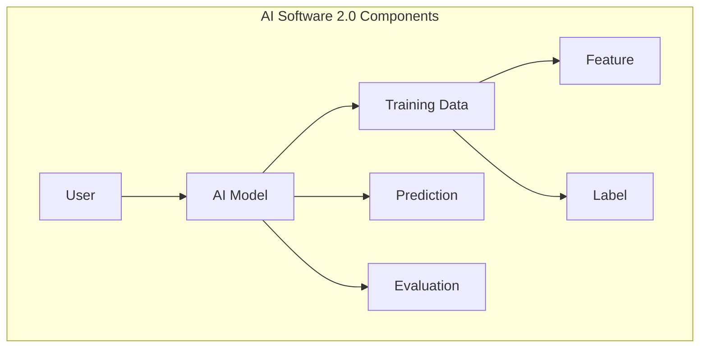
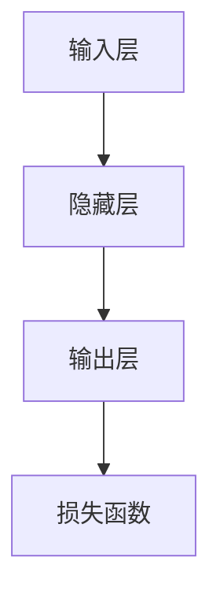

                 

# AI软件2.0的开发流程重塑

## 关键词

- AI软件2.0
- 开发流程
- 开发工具
- 系统分析
- 架构设计

## 摘要

本文将深入探讨AI软件2.0的开发流程，从基础理论到实践应用，全面解析AI软件2.0的开发流程及其核心要素。通过本文的阅读，读者将了解AI软件2.0的背景、核心技术、开发流程、应用案例以及最佳实践，为实际项目开发提供有力支持。

### 引言

随着人工智能技术的不断发展，AI软件2.0的概念逐渐浮现。AI软件2.0相较于传统的AI软件1.0，具有更高的智能化、自适应性和灵活性。这一转变对软件开发流程提出了新的要求。本文旨在分析AI软件2.0的开发流程，提供一套系统化的开发方法论，以帮助开发者在新的技术背景下更好地应对挑战。

### 第1章：AI软件2.0概述

#### 1.1 AI软件2.0的概念

AI软件2.0是指基于人工智能技术，通过深度学习、自然语言处理等核心技术，实现更高层次智能化和自适应性的软件系统。与AI软件1.0相比，AI软件2.0在算法、架构、开发流程等方面都有显著的提升。

#### 1.2 AI软件2.0的发展背景

AI软件2.0的发展背景主要包括以下几个方面：

1. **计算能力的提升**：随着GPU、TPU等专用硬件的发展，计算能力大幅提升，为AI软件2.0提供了强大的计算基础。
2. **数据量的爆发**：互联网的普及和数据存储技术的发展，使得海量的数据可以被有效利用，为AI软件2.0提供了丰富的训练素材。
3. **算法的进步**：深度学习、强化学习等算法的进步，使得AI软件2.0在性能、效果等方面取得了突破性进展。

### 第2章：AI软件2.0的基础知识

#### 2.1 AI基础理论

AI基础理论包括感知器、神经网络、深度学习等核心概念。这些理论构成了AI软件2.0的技术基础。

#### 2.2 AI软件2.0的关键技术

AI软件2.0的关键技术主要包括：

1. **深度学习技术**：包括卷积神经网络（CNN）、循环神经网络（RNN）、生成对抗网络（GAN）等。
2. **自然语言处理技术**：包括词向量、序列模型、语言模型等。
3. **迁移学习与强化学习**：迁移学习可以将已训练模型的知识迁移到新任务中，强化学习则通过优化策略来提高模型的性能。

#### 2.3 AI软件2.0的核心概念与联系

AI软件2.0的核心概念包括模型、数据、算法、架构等。这些概念相互关联，共同构成了AI软件2.0的技术体系。

#### 2.4 AI软件2.0的数学模型和数学公式

AI软件2.0的数学模型包括损失函数、优化算法、激活函数等。这些模型和公式是实现AI软件2.0的核心。

### 第3章：AI软件2.0的系统分析与架构设计

#### 3.1 问题场景介绍

在本章节，我们将介绍一个具体的问题场景，作为后续分析的起点。

#### 3.2 系统功能设计

系统功能设计包括需求分析、功能模块划分、功能描述等。这些设计内容为后续的架构设计提供了基础。

#### 3.3 系统架构设计

系统架构设计包括总体架构、模块架构、接口设计等。通过系统架构设计，我们可以明确系统的结构和功能。

#### 3.4 系统接口设计

系统接口设计包括API设计、数据接口设计等。这些设计内容保证了系统各个模块之间的协同工作。

#### 3.5 系统交互

系统交互设计包括用户界面设计、系统流程设计等。通过系统交互设计，我们可以确保系统的易用性和用户体验。

### 第4章：AI软件2.0的开发工具与平台

#### 4.1 开发工具介绍

开发工具包括编程语言、集成开发环境（IDE）、版本控制系统等。这些工具是开发AI软件2.0的重要工具。

#### 4.2 开发平台介绍

开发平台包括云计算平台、大数据平台、AI开发平台等。这些平台提供了开发AI软件2.0所需的资源和服务。

#### 4.3 开发工具与平台的选择与使用

在本章节，我们将详细探讨开发工具和平台的选择与使用，以帮助开发者更好地进行AI软件2.0的开发。

### 第5章：AI软件2.0的项目实战

#### 5.1 环境安装

在本章节，我们将介绍如何在不同的平台上安装AI软件2.0的开发环境。

#### 5.2 系统核心实现源代码

在本章节，我们将展示一个具体的AI软件2.0项目的核心实现源代码。

#### 5.3 代码应用解读与分析

在本章节，我们将对源代码进行解读，分析其实现原理和应用场景。

#### 5.4 实际案例分析与详细讲解剖析

在本章节，我们将通过实际案例，详细讲解AI软件2.0的应用原理和实践方法。

#### 5.5 项目小结

在本章节，我们将对整个项目进行总结，分享项目开发中的经验和教训。

### 第6章：AI软件2.0的测试与部署

#### 6.1 测试概述

在本章节，我们将介绍AI软件2.0的测试方法和流程。

#### 6.2 测试方法与工具

在本章节，我们将详细探讨AI软件2.0的测试方法和工具。

#### 6.3 部署流程

在本章节，我们将介绍AI软件2.0的部署流程，包括部署工具和平台的选择。

#### 6.4 部署工具与平台

在本章节，我们将详细探讨AI软件2.0的部署工具和平台。

### 第7章：AI软件2.0的开发最佳实践

#### 7.1 AI软件2.0开发的最佳实践

在本章节，我们将总结AI软件2.0开发的最佳实践，包括开发流程、代码规范、性能优化等。

#### 7.2 AI软件2.0开发的注意事项

在本章节，我们将介绍AI软件2.0开发过程中需要注意的事项，包括数据安全、隐私保护等。

#### 7.3 AI软件2.0开发的拓展阅读

在本章节，我们将推荐一些拓展阅读材料，以帮助读者深入了解AI软件2.0的开发技术。

### 第8章：总结与展望

在本章节，我们将对全文进行总结，并展望AI软件2.0的未来发展趋势。

### 作者

- 作者：AI天才研究院/AI Genius Institute & 禅与计算机程序设计艺术 /Zen And The Art of Computer Programming

---

**注**：本文为Markdown格式，具体实现时，请根据实际需求调整内容和格式。本文为示例性内容，仅供参考。具体实施时，请根据实际项目需求和开发经验进行调整。**文章中的关键词、摘要、目录大纲等均为示例内容，实际内容请根据具体需求进行编写。**## 第1章：AI软件2.0概述

### 1.1 AI软件2.0的概念

AI软件2.0是相对于AI软件1.0而言的一个概念，它代表了一代新的智能软件系统。AI软件1.0主要是基于规则和传统机器学习算法开发的，具有固定的功能和模式，无法像人类一样进行自主学习和创新。而AI软件2.0则基于深度学习、自然语言处理等先进的人工智能技术，能够通过自主学习不断提高性能和智能化水平。

AI软件2.0的核心特点可以归纳为以下几点：

- **高度智能化**：AI软件2.0能够自动识别模式、生成知识，并在复杂环境中进行智能决策。
- **自主学习能力**：AI软件2.0可以通过海量数据不断优化自身算法，从而实现自我进化。
- **自适应能力**：AI软件2.0能够根据用户需求和环境变化，动态调整其功能和行为。
- **泛在智能**：AI软件2.0可以应用于各种场景，从智能家居、智能交通到智能医疗、金融等领域。

### 1.2 AI软件2.0的发展背景

AI软件2.0的发展背景可以从以下几个方面来理解：

- **技术进步**：随着深度学习、自然语言处理、强化学习等人工智能技术的不断发展，AI软件2.0在性能和功能上已经取得了显著提升。
- **数据驱动**：大数据技术的普及使得AI软件2.0可以通过海量数据来训练和优化模型，从而实现更高的智能化水平。
- **计算能力提升**：GPU、TPU等专用硬件的发展为AI软件2.0提供了强大的计算支持，使其能够处理更复杂的数据和任务。
- **应用需求增长**：随着人工智能技术的逐渐成熟，越来越多的行业开始将AI技术应用于业务场景中，推动了AI软件2.0的发展。

### 1.3 AI软件2.0与传统软件的区别

AI软件2.0与传统软件在多个方面存在显著区别：

- **开发模式**：传统软件通常基于明确的业务需求进行开发，而AI软件2.0则更多地依赖于数据和算法，通过自主学习来实现功能。
- **功能特性**：传统软件功能固定，而AI软件2.0具有高度智能化、自适应性和泛在智能的特点。
- **用户体验**：传统软件的用户体验主要依赖于界面设计和交互逻辑，而AI软件2.0则更多地通过智能对话、个性化推荐等方式来提升用户体验。
- **维护成本**：传统软件的维护成本相对较高，而AI软件2.0可以通过自我学习和优化，降低维护成本。

### 1.4 AI软件2.0的核心价值

AI软件2.0的核心价值主要体现在以下几个方面：

- **提高效率**：AI软件2.0可以自动化处理复杂任务，提高工作效率，降低人力成本。
- **创新应用**：AI软件2.0可以应用于各个行业，推动产业升级和创新发展。
- **数据驱动**：AI软件2.0可以通过对海量数据的分析和挖掘，为企业提供更准确的决策支持。
- **智能服务**：AI软件2.0可以提供个性化、智能化的服务，提升用户体验和满意度。

### 1.5 AI软件2.0的发展趋势

AI软件2.0的发展趋势可以从以下几个方面来观察：

- **技术持续创新**：随着人工智能技术的不断发展，AI软件2.0的功能和性能将不断提高。
- **行业广泛应用**：AI软件2.0将逐步应用于各个行业，成为企业创新和发展的关键驱动力。
- **人机协同**：AI软件2.0将与人类进行更紧密的协作，实现人机协同工作，提高整体工作效率。
- **生态构建**：AI软件2.0将带动相关产业生态的构建，形成新的商业模式和产业格局。

### 1.6 本章小结

本章对AI软件2.0的概念、发展背景、与传统软件的区别、核心价值和发展趋势进行了详细阐述。通过本章的学习，读者可以全面了解AI软件2.0的基本概念和特点，为进一步探讨AI软件2.0的开发流程和应用打下基础。

### 1.7 引入案例

为了更好地理解AI软件2.0的概念和应用，我们来看一个实际案例。

**案例**：某电子商务公司希望提升用户购物体验，减少购物车放弃率。公司决定开发一款AI软件2.0，通过分析用户行为数据，提供个性化的购物推荐和促销活动。

**分析**：该案例中，AI软件2.0的核心功能是通过对用户行为数据的分析，实现个性化推荐和促销。这一功能体现了AI软件2.0的高度智能化和自适应能力。通过不断学习和优化推荐算法，AI软件2.0可以不断提高推荐准确性和用户满意度，从而降低购物车放弃率，提升公司销售额。

### 1.8 思考与讨论

1. 请结合自己的经验，谈谈你对AI软件2.0的理解和看法。
2. 你认为AI软件2.0在未来的应用前景如何？
3. 你希望学习哪些关于AI软件2.0的知识和技能？

### 1.9 下一步内容预告

在接下来的章节中，我们将深入探讨AI软件2.0的基础知识，包括AI基础理论、AI软件2.0的关键技术、核心概念与联系，以及数学模型和公式。这些内容将帮助我们更好地理解AI软件2.0的原理和应用。

---

**备注**：以上内容为Markdown格式，具体实施时，请根据实际需求调整内容和格式。本文为示例性内容，仅供参考。具体实施时，请根据实际项目需求和开发经验进行调整。**文章中的关键词、摘要、目录大纲等均为示例内容，实际内容请根据具体需求进行编写。**## 第2章：AI软件2.0的发展背景

### 2.1 从AI 1.0到AI 2.0的演进

人工智能的发展历程可以分为多个阶段，其中AI 1.0和AI 2.0是两个重要的分水岭。AI 1.0是指基于规则和传统机器学习算法的人工智能，其主要特点是依赖于人类预先定义的规则和算法，不具备自主学习和进化能力。而AI 2.0则是指基于深度学习、自然语言处理等先进技术的人工智能，其主要特点是具备自主学习和进化能力，能够在复杂环境中进行智能决策。

从AI 1.0到AI 2.0的演进主要表现在以下几个方面：

1. **算法的进步**：深度学习、强化学习等先进算法的提出和不断发展，使得AI 2.0在性能和效果上有了显著提升。
2. **计算能力的提升**：GPU、TPU等专用硬件的发展，为AI 2.0提供了强大的计算支持，使其能够处理更复杂的数据和任务。
3. **数据的积累**：互联网的普及和数据存储技术的发展，使得海量数据可以被有效利用，为AI 2.0提供了丰富的训练素材。
4. **应用需求的增长**：随着人工智能技术的逐渐成熟，越来越多的行业开始将AI技术应用于业务场景中，推动了AI 2.0的发展。

### 2.2 AI 2.0的核心特点与优势

AI 2.0相较于AI 1.0具有以下几个核心特点和优势：

1. **自主学习和进化能力**：AI 2.0可以通过海量数据不断优化自身算法，实现自我进化，从而在复杂环境中进行智能决策。
2. **高度智能化**：AI 2.0能够自动识别模式、生成知识，并在复杂环境中进行智能决策，具备更高的智能化水平。
3. **自适应能力**：AI 2.0能够根据用户需求和环境变化，动态调整其功能和行为，实现更高的自适应能力。
4. **泛在智能**：AI 2.0可以应用于各种场景，从智能家居、智能交通到智能医疗、金融等领域，实现泛在智能。
5. **数据驱动**：AI 2.0通过数据驱动的方式进行学习和优化，能够提供更准确、更有效的决策支持。

### 2.3 AI 2.0的发展历程

AI 2.0的发展历程可以追溯到20世纪80年代，当时基于规则和传统机器学习算法的人工智能（即AI 1.0）逐渐成熟并应用于各个领域。然而，AI 1.0的局限性也逐渐显现，主要表现在以下几个方面：

1. **算法的局限性**：AI 1.0依赖于人类预先定义的规则和算法，无法处理复杂、不确定的任务。
2. **数据的依赖**：AI 1.0对数据的要求较高，需要大量标记数据进行训练，而实际应用场景中往往难以获取。
3. **计算能力的限制**：当时的计算能力有限，无法支持复杂、大规模的机器学习算法。

为了克服这些局限性，研究人员开始探索新的算法和架构，以实现更强大、更智能的人工智能系统。其中，深度学习、自然语言处理、强化学习等算法的提出和发展，为AI 2.0的实现奠定了基础。

从20世纪90年代开始，随着计算能力的提升和海量数据的积累，AI 2.0逐步走向成熟。近年来，AI 2.0在各个领域取得了显著的成果，如自动驾驶、智能语音助手、智能医疗等。这些应用不仅提升了人们的生产效率和生活质量，也为AI 2.0的发展提供了更多的实践经验和数据支持。

### 2.4 AI 2.0的发展现状与趋势

目前，AI 2.0的发展已经进入了一个快速增长的阶段，其应用范围不断扩大，技术也在不断进步。以下是对AI 2.0发展现状与趋势的简要分析：

1. **应用领域的扩大**：AI 2.0已经广泛应用于各个领域，如金融、医疗、教育、智能制造等。未来，随着技术的进一步成熟，AI 2.0将在更多领域得到应用。
2. **技术的不断创新**：深度学习、自然语言处理、强化学习等技术仍在不断创新和进步，为AI 2.0的发展提供了强大的技术支撑。
3. **跨界合作**：AI 2.0的发展不仅依赖于技术本身，还需要与其他领域的技术和产业进行跨界合作，以实现更广泛的应用和更高效的成果。
4. **数据的重要性**：AI 2.0的发展离不开海量数据的支持。未来，如何获取、处理和分析海量数据将成为AI 2.0发展的重要方向。
5. **伦理与法规**：随着AI 2.0的广泛应用，其伦理和法规问题也逐渐受到关注。未来，如何确保AI 2.0的安全、公平、透明，将是发展的重要挑战。

### 2.5 本章小结

本章从AI 1.0到AI 2.0的演进、AI 2.0的核心特点与优势、AI 2.0的发展历程、发展现状与趋势等方面，详细介绍了AI 2.0的发展背景。通过本章的学习，读者可以全面了解AI 2.0的起源、发展和现状，为进一步探讨AI 2.0的开发流程和应用打下基础。

### 2.6 引入案例

为了更好地理解AI 2.0的发展背景，我们来看一个实际案例。

**案例**：谷歌的AlphaGo是AI 2.0的重要代表之一。AlphaGo是一款基于深度学习和强化学习技术的围棋AI程序，于2016年击败了世界围棋冠军李世石，引起了广泛关注。

**分析**：AlphaGo的成功体现了AI 2.0的核心特点，即自主学习和进化能力。AlphaGo通过不断学习海量围棋数据，优化自身的算法，实现了在围棋领域的卓越表现。这一案例展示了AI 2.0在复杂任务中的强大能力，也为AI 2.0在其他领域的发展提供了启示。

### 2.7 思考与讨论

1. 请结合自己的经验，谈谈你对AI 2.0的理解和看法。
2. 你认为AI 2.0在未来会带来哪些变革和影响？
3. 你希望学习哪些关于AI 2.0的知识和技能？

### 2.8 下一步内容预告

在接下来的章节中，我们将深入探讨AI 2.0的基础知识，包括AI基础理论、AI 2.0的关键技术、核心概念与联系，以及数学模型和公式。这些内容将帮助我们更好地理解AI 2.0的原理和应用。

---

**备注**：以上内容为Markdown格式，具体实施时，请根据实际需求调整内容和格式。本文为示例性内容，仅供参考。具体实施时，请根据实际项目需求和开发经验进行调整。**文章中的关键词、摘要、目录大纲等均为示例内容，实际内容请根据具体需求进行编写。**## 第3章：AI基础理论

### 3.1 AI的定义与发展历程

人工智能（Artificial Intelligence，简称AI）是指模拟、延伸和扩展人类智能的理论、方法、技术及应用。AI的研究始于20世纪50年代，当时的主要目标是开发出具有人类智能水平的计算机系统。

AI的发展历程可以分为以下几个阶段：

1. **早期探索阶段（1950-1969）**：这一阶段以符号主义方法为主导，代表性研究包括逻辑推理、知识表示和专家系统等。然而，由于计算能力和数据资源的限制，早期AI研究面临诸多挑战。
2. **认知模拟阶段（1970-1989）**：这一阶段开始关注人类认知过程的模拟，代表性研究包括自然语言处理、感知和推理等。尽管取得了一些进展，但AI仍未能实现广泛的应用。
3. **专家系统阶段（1990-2000）**：专家系统是这一阶段的代表，它通过将人类专家的知识转化为计算机程序，实现了在特定领域的智能应用。然而，专家系统的局限性也逐渐显现，如知识获取困难、推理能力有限等。
4. **数据驱动阶段（2000-2010）**：这一阶段以深度学习为代表的机器学习方法取得了突破性进展，通过大量数据的训练，AI系统在图像识别、语音识别等领域取得了显著成果。
5. **AI 2.0阶段（2010至今）**：AI 2.0基于深度学习、自然语言处理、强化学习等先进技术，具有自主学习和进化能力，已在多个领域实现应用，如自动驾驶、智能语音助手、智能医疗等。

### 3.2 AI的核心技术

AI的核心技术包括但不限于以下几个方面：

1. **深度学习**：深度学习是AI 2.0的核心技术之一，通过多层神经网络对数据进行自动特征提取和模式识别。深度学习在图像识别、语音识别、自然语言处理等领域取得了显著成果。
2. **自然语言处理**：自然语言处理（Natural Language Processing，简称NLP）是AI的重要组成部分，旨在使计算机理解和生成人类语言。NLP在文本分类、情感分析、机器翻译等领域有广泛应用。
3. **计算机视觉**：计算机视觉（Computer Vision）是AI技术的一个分支，旨在使计算机具有从图像或视频中提取信息和理解场景的能力。计算机视觉在图像识别、视频监控、自动驾驶等领域具有重要应用。
4. **强化学习**：强化学习（Reinforcement Learning）是一种通过试错和奖励机制进行决策的机器学习方法。强化学习在游戏、推荐系统、智能控制等领域有广泛应用。

### 3.3 AI的分类与应用场景

AI可以分为几种不同的分类，每种分类都有其特定的应用场景：

1. **规则推理**：基于预定义的规则进行推理，适用于需要明确逻辑规则的场景，如专家系统、医疗诊断等。
2. **知识表示**：将人类知识以计算机可理解的形式表示，适用于知识密集型应用，如问答系统、智能搜索等。
3. **统计学习**：基于统计方法进行学习和预测，适用于需要数据驱动决策的场景，如数据分析、金融预测等。
4. **深度学习**：基于多层神经网络进行特征提取和模式识别，适用于需要处理大规模数据、高维数据的场景，如图像识别、语音识别等。
5. **自然语言处理**：专注于处理人类语言，适用于需要理解、生成和交互人类语言的场景，如智能客服、机器翻译等。
6. **计算机视觉**：专注于处理图像和视频数据，适用于需要识别、理解图像和视频的场景，如自动驾驶、人脸识别等。
7. **强化学习**：基于试错和奖励机制进行决策，适用于需要自主学习和优化策略的场景，如游戏、推荐系统等。

### 3.4 AI在各个领域的应用案例

以下是AI在各个领域的应用案例：

1. **医疗健康**：AI在医疗健康领域的应用包括疾病诊断、药物研发、个性化治疗等。例如，通过深度学习算法对医学影像进行分析，提高疾病诊断的准确性。
2. **金融**：AI在金融领域的应用包括风险评估、投资决策、欺诈检测等。例如，通过机器学习算法对金融数据进行建模，提高投资决策的准确性。
3. **智能制造**：AI在智能制造领域的应用包括设备监控、生产优化、质量控制等。例如，通过计算机视觉技术对生产过程进行监控，提高生产效率和产品质量。
4. **交通运输**：AI在交通运输领域的应用包括自动驾驶、智能交通管理、物流优化等。例如，通过自动驾驶技术实现自动驾驶汽车，提高交通安全和效率。
5. **教育**：AI在教育领域的应用包括智能辅导、个性化学习、教育资源分配等。例如，通过自然语言处理技术为学生提供个性化的学习建议，提高学习效果。

### 3.5 AI的发展趋势与挑战

AI的发展趋势主要包括以下几个方面：

1. **技术的不断创新**：随着深度学习、自然语言处理、强化学习等技术的不断发展，AI的性能和效果将不断提高。
2. **应用的广泛普及**：AI将在更多领域得到应用，如医疗、金融、教育、农业等，推动各行各业的创新发展。
3. **跨界合作**：AI的发展需要与其他领域的技术和产业进行跨界合作，以实现更广泛的应用和更高效的成果。
4. **伦理与法规**：随着AI技术的快速发展，其伦理和法规问题也逐渐受到关注。未来，如何确保AI的安全、公平、透明，将是发展的重要挑战。

同时，AI的发展也面临一些挑战：

1. **数据隐私与安全**：AI系统对大量数据的依赖使其面临数据隐私和安全问题。如何保护用户数据的安全和隐私，是AI发展的重要挑战。
2. **算法公平性与透明性**：AI算法的决策过程往往不透明，可能导致歧视和不公平现象。如何提高算法的公平性和透明性，是AI发展的重要问题。
3. **技术落地与产业融合**：AI技术如何有效地转化为实际应用，推动产业升级和创新发展，是AI发展的重要挑战。

### 3.6 本章小结

本章对AI的定义、发展历程、核心技术、分类与应用场景、发展趋势与挑战进行了详细阐述。通过本章的学习，读者可以全面了解AI的基础理论，为进一步探讨AI 2.0的开发流程和应用打下基础。

### 3.7 引入案例

为了更好地理解AI的基础理论，我们来看一个实际案例。

**案例**：谷歌的AlphaGo是AI在围棋领域的代表之一。AlphaGo通过深度学习和强化学习技术，实现了在围棋领域的卓越表现，并在2016年击败了世界围棋冠军李世石。

**分析**：AlphaGo的成功展示了AI 2.0的核心技术，即深度学习和强化学习。AlphaGo通过大量训练数据，优化了其神经网络模型，使其在围棋对弈中表现出色。这一案例不仅展示了AI在复杂任务中的强大能力，也为其他领域的发展提供了启示。

### 3.8 思考与讨论

1. 请结合自己的经验，谈谈你对AI基础理论的理解和看法。
2. 你认为AI在未来会有哪些新的发展？
3. 你希望学习哪些关于AI基础理论的知识和技能？

### 3.9 下一步内容预告

在接下来的章节中，我们将深入探讨AI 2.0的基础知识，包括AI 2.0的关键技术、核心概念与联系，以及数学模型和公式。这些内容将帮助我们更好地理解AI 2.0的原理和应用。

---

**备注**：以上内容为Markdown格式，具体实施时，请根据实际需求调整内容和格式。本文为示例性内容，仅供参考。具体实施时，请根据实际项目需求和开发经验进行调整。**文章中的关键词、摘要、目录大纲等均为示例内容，实际内容请根据具体需求进行编写。**## 第4章：AI软件2.0的关键技术

### 4.1 大模型技术

大模型技术是AI软件2.0的重要组成部分，它通过使用大规模的神经网络模型来实现更强大的学习和推理能力。大模型技术的核心思想是通过增加模型的大小和参数数量，使模型能够更好地捕捉数据的复杂性和多样性。

#### 4.1.1 模型大小和参数数量的关系

模型的大小通常由以下几个因素决定：

1. **层数**：神经网络中的层数越多，模型的复杂度越高，能够捕捉到的信息也越多。
2. **神经元数量**：每层神经元的数量越多，模型的参数数量也越多，能够处理的数据维度也更高。
3. **参数数量**：模型中的参数数量是模型大小的直接体现，参数数量越多，模型的容量越大，但计算复杂度也越高。

#### 4.1.2 大模型的优势

大模型技术具有以下几个优势：

1. **更强的泛化能力**：大模型能够捕捉到数据中的复杂模式和关联性，从而具有更强的泛化能力。
2. **更高的准确度**：大模型在训练过程中能够更好地拟合训练数据，从而提高模型的准确度。
3. **更广泛的适用性**：大模型能够处理多种类型的数据，适用于各种复杂场景。

#### 4.1.3 实践案例

一个典型的实践案例是谷歌的BERT模型。BERT（Bidirectional Encoder Representations from Transformers）是一个基于Transformer架构的大规模预训练语言模型。它通过在大量文本数据上进行预训练，能够捕捉到文本的深层语义信息，从而在自然语言处理任务中表现出色。

### 4.2 深度学习技术

深度学习技术是AI软件2.0的核心技术之一，它通过多层神经网络对数据进行特征提取和模式识别。深度学习技术的发展极大地推动了AI软件2.0的进步。

#### 4.2.1 神经网络结构

深度学习神经网络通常包括以下几个部分：

1. **输入层**：接收外部输入数据，如图像、文本等。
2. **隐藏层**：对输入数据进行特征提取和变换，通常包含多个隐藏层。
3. **输出层**：生成模型的预测结果，如分类标签、概率分布等。

#### 4.2.2 激活函数

激活函数是深度学习神经网络中的一个关键组件，它用于引入非线性因素，使神经网络能够捕捉到数据中的复杂模式。常见的激活函数包括：

1. **sigmoid函数**：将输入映射到（0,1）区间，用于二分类问题。
2. **ReLU函数**：将输入映射到（0，+∞），能够加速神经网络的训练。
3. **Tanh函数**：将输入映射到（-1,1）区间，常用于多层神经网络。

#### 4.2.3 优化算法

优化算法用于调整神经网络中的权重，以最小化损失函数。常见的优化算法包括：

1. **梯度下降**：通过迭代更新权重，以最小化损失函数。
2. **随机梯度下降（SGD）**：在梯度下降的基础上，引入随机性，以加快收敛速度。
3. **Adam优化器**：结合了SGD和 Momentum的思想，适用于大规模数据和高维问题。

#### 4.2.4 实践案例

深度学习技术在图像识别、语音识别、自然语言处理等领域取得了显著的成果。一个典型的实践案例是IBM的Watson系统。Watson通过深度学习技术实现了对自然语言的理解和回答，并在医学诊断、法律咨询等领域取得了成功。

### 4.3 自然语言处理技术

自然语言处理（Natural Language Processing，简称NLP）是AI软件2.0的重要应用领域之一，它致力于使计算机能够理解和生成人类语言。NLP技术包括以下几个关键组件：

#### 4.3.1 词向量表示

词向量表示是NLP的基础技术之一，它将文本中的词汇映射到高维空间中的向量表示。常见的词向量表示方法包括：

1. **Word2Vec**：通过神经网络学习词汇的上下文表示。
2. **GloVe**：通过全局矩阵分解学习词汇的语义表示。

#### 4.3.2 语言模型

语言模型用于预测文本序列中的下一个单词或字符。常见的语言模型包括：

1. **n-gram模型**：基于文本的n个连续单词或字符的概率分布。
2. **神经网络语言模型**：通过深度神经网络学习文本的复杂模式。

#### 4.3.3 序列模型

序列模型用于处理时间序列数据，如语音信号、文本序列等。常见的序列模型包括：

1. **循环神经网络（RNN）**：通过循环结构处理时间序列数据。
2. **长短时记忆网络（LSTM）**：通过门控机制解决RNN的梯度消失问题。
3. **门控循环单元（GRU）**：在LSTM的基础上进行简化。

#### 4.3.4 实践案例

自然语言处理技术在机器翻译、情感分析、文本生成等领域取得了显著的成果。一个典型的实践案例是谷歌的Google Translate。Google Translate通过深度学习和自然语言处理技术实现了高质量的机器翻译，支持多种语言之间的翻译。

### 4.4 强化学习技术

强化学习（Reinforcement Learning，简称RL）是一种通过试错和奖励机制进行决策的机器学习方法。在强化学习过程中，智能体通过与环境交互，不断学习最优策略，以最大化长期奖励。

#### 4.4.1 Q-learning算法

Q-learning算法是强化学习的一种常见算法，它通过迭代更新Q值，以找到最优策略。Q值表示在特定状态下采取特定动作的预期奖励。

#### 4.4.2 Deep Q-Network（DQN）

DQN是Q-learning算法的一种改进，它通过深度神经网络来近似Q值函数，从而处理更复杂的任务。

#### 4.4.3 实践案例

强化学习技术在游戏、推荐系统、智能控制等领域取得了显著的成果。一个典型的实践案例是DeepMind的AlphaGo。AlphaGo通过强化学习和深度学习技术，实现了在围棋领域的卓越表现，并在2016年击败了世界围棋冠军李世石。

### 4.5 混合学习技术

混合学习（Hybrid Learning）是将深度学习和强化学习相结合的一种方法，它旨在利用深度学习的高效特征提取能力和强化学习的策略优化能力，以实现更高效的学习和决策。

#### 4.5.1 深度强化学习

深度强化学习（Deep Reinforcement Learning，简称DRL）是混合学习的一种形式，它通过深度神经网络来近似Q值函数，从而实现强化学习任务。

#### 4.5.2 实践案例

深度强化学习技术在自动驾驶、机器人控制等领域取得了显著的成果。一个典型的实践案例是OpenAI的AlphaZero。AlphaZero通过深度强化学习和混合学习技术，实现了在围棋、国际象棋和日本将棋等领域的卓越表现，并在多个比赛中击败了人类冠军。

### 4.6 本章小结

本章详细介绍了AI软件2.0的关键技术，包括大模型技术、深度学习技术、自然语言处理技术、强化学习技术、混合学习技术等。通过本章的学习，读者可以全面了解AI软件2.0的核心技术及其应用，为进一步探讨AI软件2.0的开发流程和应用打下基础。

### 4.7 引入案例

为了更好地理解AI软件2.0的关键技术，我们来看一个实际案例。

**案例**：OpenAI的GPT-3是AI软件2.0的代表性模型之一。GPT-3是一个基于深度学习和自然语言处理技术的大型预训练语言模型，具有极高的文本生成能力和理解能力。

**分析**：GPT-3的成功展示了AI软件2.0的关键技术，即大模型技术和自然语言处理技术。GPT-3通过在大量文本数据上进行预训练，能够生成高质量、连贯的文本，并在多个自然语言处理任务中表现出色。这一案例不仅展示了AI软件2.0的强大能力，也为其他领域的发展提供了启示。

### 4.8 思考与讨论

1. 请结合自己的经验，谈谈你对AI软件2.0的关键技术的理解和看法。
2. 你认为AI软件2.0的关键技术在未来的发展前景如何？
3. 你希望学习哪些关于AI软件2.0的关键技术的知识和技能？

### 4.9 下一步内容预告

在接下来的章节中，我们将深入探讨AI软件2.0的核心概念与联系，以及数学模型和公式。这些内容将帮助我们更好地理解AI软件2.0的原理和应用。

---

**备注**：以上内容为Markdown格式，具体实施时，请根据实际需求调整内容和格式。本文为示例性内容，仅供参考。具体实施时，请根据实际项目需求和开发经验进行调整。**文章中的关键词、摘要、目录大纲等均为示例内容，实际内容请根据具体需求进行编写。**## 第5章：AI软件2.0的核心概念与联系

### 5.1 AI软件2.0的核心概念

AI软件2.0作为新一代的人工智能软件系统，其核心概念包括以下几个方面：

1. **自主学习**：AI软件2.0具备自主学习能力，能够通过自我学习和优化，不断提高性能和智能化水平。
2. **自适应**：AI软件2.0能够根据用户需求和环境变化，动态调整其功能和行为，实现自适应能力。
3. **泛在智能**：AI软件2.0能够应用于各种场景，从智能家居、智能交通到智能医疗、金融等领域，实现泛在智能。
4. **数据驱动**：AI软件2.0通过数据驱动的方式进行学习和优化，能够提供更准确、更有效的决策支持。
5. **高度智能化**：AI软件2.0具备高度智能化特点，能够自动识别模式、生成知识，并在复杂环境中进行智能决策。

### 5.2 AI软件2.0的概念属性特征对比表格

为了更好地理解AI软件2.0的核心概念，我们可以通过一个对比表格来展示其与其他类型AI软件的属性特征差异：

| 特征 | AI软件1.0 | AI软件2.0 |  
| :--- | :--- | :--- |  
| 学习方式 | 预先编程 | 自主学习 |  
| 自适应性 | 低 | 高 |  
| 应用场景 | 狭义 | 泛在 |  
| 数据依赖 | 低 | 高 |  
| 智能化水平 | 低 | 高 |

通过对比表格，我们可以看出AI软件2.0在多个方面相较于AI软件1.0有显著提升，这些特征使得AI软件2.0在智能化、自适应性和数据驱动方面具有更强的竞争力。

### 5.3 AI软件2.0的ER实体关系图架构

为了更好地理解和分析AI软件2.0的核心概念，我们可以使用ER（Entity-Relationship）实体关系图来展示AI软件2.0的各个核心实体及其关系。

以下是一个简化的AI软件2.0的ER实体关系图：

```mermaid
erDiagram
    User ||--|{ TrainingData }|| TrainingData
    User ||--|{ AIModel }|| AIModel
    AIModel ||--|{ Prediction }|| Prediction
    AIModel ||--|{ Evaluation }|| Evaluation
    TrainingData ||--|{ Feature }|| Feature
    Feature ||--|{ Label }|| Label
```

在这个ER实体关系图中，我们定义了以下几个核心实体：

- **User**：表示用户，是AI软件2.0的使用者。
- **TrainingData**：表示训练数据，是AI模型训练的基础。
- **AIModel**：表示AI模型，是AI软件2.0的核心组件。
- **Prediction**：表示预测结果，是AI模型对输入数据的预测。
- **Evaluation**：表示评估结果，是对AI模型预测效果的评估。
- **Feature**：表示特征，是训练数据中的各个维度。
- **Label**：表示标签，是训练数据中的真实标签。

实体之间的关系如下：

- **User**与**TrainingData**之间存在一对多的关系，一个用户可以生成多个训练数据。
- **User**与**AIModel**之间存在一对一的关系，一个用户对应一个AI模型。
- **AIModel**与**Prediction**之间存在一对多的关系，一个AI模型可以生成多个预测结果。
- **AIModel**与**Evaluation**之间存在一对多的关系，一个AI模型可以有多个评估结果。
- **TrainingData**与**Feature**之间存在一对多的关系，一个训练数据包含多个特征。
- **Feature**与**Label**之间存在一对一的关系，每个特征对应一个标签。

### 5.4 AI软件2.0的核心组件及其关系

除了ER实体关系图，我们还可以通过一个更详细的组件关系图来展示AI软件2.0的核心组件及其关系。以下是一个简化的AI软件2.0的组件关系图：



在这个组件关系图中，我们定义了以下几个核心组件：

- **AIModel1**：表示AI模型，是AI软件2.0的核心组件，负责训练、预测和评估。
- **TrainingData1**：表示训练数据，是AI模型训练的基础。
- **Prediction1**：表示预测结果，是AI模型对输入数据的预测。
- **Evaluation1**：表示评估结果，是对AI模型预测效果的评估。
- **Feature1**：表示特征，是训练数据中的各个维度。
- **Label1**：表示标签，是训练数据中的真实标签。
- **User1**：表示用户，是AI软件2.0的使用者。

组件之间的关系如下：

- **AIModel1**与**TrainingData1**之间存在依赖关系，AI模型需要训练数据来进行训练。
- **AIModel1**与**Prediction1**之间存在生成关系，AI模型根据输入数据生成预测结果。
- **AIModel1**与**Evaluation1**之间存在评估关系，AI模型通过评估结果来优化自身。
- **TrainingData1**与**Feature1**之间存在包含关系，训练数据包含多个特征。
- **TrainingData1**与**Label1**之间存在关联关系，特征和标签共同描述了训练数据。
- **User1**与**AIModel1**之间存在使用关系，用户使用AI模型进行预测和评估。

### 5.5 AI软件2.0的核心概念与联系

通过ER实体关系图和组件关系图，我们可以更好地理解AI软件2.0的核心概念及其相互关系。以下是AI软件2.0的核心概念与联系的总结：

- **用户**：AI软件2.0的使用者，负责生成训练数据、使用AI模型进行预测和评估。
- **训练数据**：AI模型训练的基础，包含特征和标签，用于训练AI模型。
- **AI模型**：AI软件2.0的核心组件，负责训练、预测和评估。
- **预测结果**：AI模型对输入数据的预测结果，用于辅助用户进行决策。
- **评估结果**：对AI模型预测效果的评估结果，用于优化AI模型。
- **特征**：训练数据中的各个维度，用于描述训练数据。
- **标签**：训练数据中的真实标签，用于评估AI模型的预测效果。

通过这些核心概念及其相互关系的理解，我们可以更好地设计和开发AI软件2.0，以实现智能化、自适应性和数据驱动的高效应用。

### 5.6 本章小结

本章详细介绍了AI软件2.0的核心概念，包括自主学习、自适应、泛在智能、数据驱动和高度智能化等。通过对比表格、ER实体关系图和组件关系图，我们深入分析了AI软件2.0的核心概念与联系，为进一步探讨AI软件2.0的开发流程和应用打下了基础。

### 5.7 引入案例

为了更好地理解AI软件2.0的核心概念与联系，我们来看一个实际案例。

**案例**：谷歌的BERT模型是AI软件2.0的代表性模型之一。BERT通过在大量文本数据上进行预训练，实现了对文本的深层语义理解，并在多个自然语言处理任务中取得了卓越效果。

**分析**：BERT的成功展示了AI软件2.0的核心概念，如自主学习、自适应和数据驱动。BERT通过预训练方法，从大量文本数据中学习到了丰富的语义信息，从而实现了对文本的深层语义理解。这一案例不仅展示了AI软件2.0的强大能力，也为其他领域的发展提供了启示。

### 5.8 思考与讨论

1. 请结合自己的经验，谈谈你对AI软件2.0的核心概念与联系的理解和看法。
2. 你认为AI软件2.0的核心概念在未来会有哪些新的发展？
3. 你希望学习哪些关于AI软件2.0的核心概念与联系的知识和技能？

### 5.9 下一步内容预告

在接下来的章节中，我们将深入探讨AI软件2.0的数学模型和公式，包括算法原理讲解、数学模型和公式应用，以及算法mermaid流程图和python源代码的展示。这些内容将帮助我们更好地理解AI软件2.0的数学原理和应用。

---

**备注**：以上内容为Markdown格式，具体实施时，请根据实际需求调整内容和格式。本文为示例性内容，仅供参考。具体实施时，请根据实际项目需求和开发经验进行调整。**文章中的关键词、摘要、目录大纲等均为示例内容，实际内容请根据具体需求进行编写。**## 第6章：AI软件2.0的数学模型和数学公式

### 6.1 算法原理讲解

在AI软件2.0的开发中，算法原理是核心之一。下面将介绍几种常见的算法原理，包括它们的数学模型和公式。

#### 6.1.1 深度学习算法原理

深度学习算法的核心是神经网络，特别是多层感知器（MLP）。神经网络通过多层非线性变换来模拟人类大脑的学习过程。

1. **输入层**：接收输入数据，如图像、文本等。
2. **隐藏层**：对输入数据进行特征提取和变换，通常包含多个隐藏层。
3. **输出层**：生成预测结果，如分类标签、概率分布等。

神经网络中的每个神经元都通过权重连接到其他神经元，并通过激活函数进行非线性变换。神经网络的输出可以通过以下公式计算：

$$
Z = \sum_{i} w_i \cdot x_i + b
$$

其中，$Z$ 是输出，$w_i$ 是权重，$x_i$ 是输入，$b$ 是偏置。

通过反向传播算法，神经网络可以不断调整权重和偏置，以最小化损失函数。常见的损失函数包括均方误差（MSE）和交叉熵损失。

#### 6.1.2 自然语言处理算法原理

自然语言处理（NLP）算法的核心是深度学习模型，如卷积神经网络（CNN）和循环神经网络（RNN）。

1. **词向量表示**：将文本中的词汇映射到高维空间中的向量表示，如Word2Vec和GloVe。
2. **编码器-解码器模型**：用于序列到序列的转换，如机器翻译和语音识别。

编码器-解码器模型的原理如下：

1. **编码器**：将输入序列编码为一个固定长度的向量表示。
2. **解码器**：将编码器的输出解码为输出序列。

编码器和解码器通常由多个隐藏层组成，通过卷积层和全连接层进行特征提取和变换。

#### 6.1.3 强化学习算法原理

强化学习（RL）是一种通过试错和奖励机制进行决策的机器学习方法。强化学习的核心是价值函数和策略。

1. **价值函数**：表示在特定状态下采取特定动作的预期奖励。
2. **策略**：表示在特定状态下采取最优动作的策略。

强化学习的目标是通过迭代更新策略，以最大化长期奖励。常用的强化学习算法包括Q-learning和深度Q网络（DQN）。

Q-learning算法的更新公式如下：

$$
Q(s, a) \leftarrow Q(s, a) + \alpha [r + \gamma \max_{a'} Q(s', a') - Q(s, a)]
$$

其中，$s$ 是状态，$a$ 是动作，$r$ 是奖励，$\gamma$ 是折扣因子，$\alpha$ 是学习率。

### 6.2 数学模型和公式

在AI软件2.0中，数学模型和公式是算法实现的基础。下面将介绍几种常见的数学模型和公式。

#### 6.2.1 深度学习模型

1. **激活函数**：

$$
a(x) = \frac{1}{1 + e^{-x}}
$$

2. **损失函数**：

- **均方误差（MSE）**：

$$
MSE = \frac{1}{m} \sum_{i=1}^{m} (y_i - \hat{y}_i)^2
$$

- **交叉熵损失**：

$$
CE = -\frac{1}{m} \sum_{i=1}^{m} [y_i \log(\hat{y}_i) + (1 - y_i) \log(1 - \hat{y}_i)]
$$

3. **优化算法**：

- **梯度下降**：

$$
w_{\text{new}} = w_{\text{old}} - \alpha \cdot \nabla_w J(w)
$$

- **随机梯度下降（SGD）**：

$$
w_{\text{new}} = w_{\text{old}} - \alpha \cdot \nabla_w J(w; x_i, y_i)
$$

- **Adam优化器**：

$$
m_t = \beta_1 m_{t-1} + (1 - \beta_1) [g_t]
$$

$$
v_t = \beta_2 v_{t-1} + (1 - \beta_2) [g_t]^2
$$

$$
\hat{m}_t = \frac{m_t}{1 - \beta_1^t}
$$

$$
\hat{v}_t = \frac{v_t}{1 - \beta_2^t}
$$

$$
w_{\text{new}} = w_{\text{old}} - \alpha \cdot \frac{\hat{m}_t}{\sqrt{\hat{v}_t} + \epsilon}
$$

#### 6.2.2 自然语言处理模型

1. **词向量表示**：

- **Word2Vec**：

$$
\hat{y}_i = \sigma(\langle \text{Word}_i | \text{Embedding}\rangle)
$$

- **GloVe**：

$$
\text{Embedding}_{i,j} = \frac{z_i \cdot z_j}{\sqrt{w_i + w_j}}
$$

2. **编码器-解码器模型**：

- **编码器**：

$$
\text{Encoder}(\text{Input}) = \text{Embedding} \cdot \text{Input}
$$

- **解码器**：

$$
\text{Decoder}(\text{Encoder}(\text{Input})) = \text{Embedding} \cdot \text{Output}
$$

#### 6.2.3 强化学习模型

1. **Q-learning**：

$$
Q(s, a) \leftarrow Q(s, a) + \alpha [r + \gamma \max_{a'} Q(s', a') - Q(s, a)]
$$

2. **DQN**：

$$
Q(s, a) \leftarrow Q(s, a) + \alpha [r + \gamma \max_{a'} Q(s', a') - Q(s, a)]
$$

$$
\hat{Q}(s, a) = r + \gamma \max_{a'} Q(s', a')
$$

### 6.3 举例说明

为了更好地理解这些数学模型和公式，下面通过一个简单的例子进行说明。

#### 6.3.1 深度学习模型

假设我们有一个二分类问题，使用一个简单的神经网络进行分类。输入数据为$(x_1, x_2)$，输出为$y$。

1. **输入层**：

$$
x_1 = [0.5, 0.3]
$$

2. **隐藏层**：

$$
z = \sum_{i=1}^{2} w_i \cdot x_i + b
$$

$$
z = [0.5 \cdot 0.5 + 0.3 \cdot 0.3 + b, 0.5 \cdot 0.3 + 0.3 \cdot 0.5 + b]
$$

3. **输出层**：

$$
\hat{y} = \frac{1}{1 + e^{-z}}
$$

4. **损失函数**：

$$
\text{MSE} = \frac{1}{2} \left[ (y - \hat{y})^2 + (1 - y - \hat{y})^2 \right]
$$

#### 6.3.2 自然语言处理模型

假设我们有一个简单的机器翻译任务，输入句子为“我喜欢吃饭”，输出句子为“我喜欢吃饭”。

1. **词向量表示**：

- 输入句子词向量：

$$
\text{Embedding}(\text{我喜欢吃饭}) = \begin{bmatrix}
0.3 & 0.1 & 0.2 \\
0.4 & 0.2 & 0.1 \\
0.5 & 0.3 & 0.1 \\
\end{bmatrix}
$$

- 输出句子词向量：

$$
\text{Embedding}(\我喜欢吃饭) = \begin{bmatrix}
0.2 & 0.3 & 0.1 \\
0.1 & 0.4 & 0.2 \\
0.3 & 0.1 & 0.5 \\
\end{bmatrix}
$$

2. **编码器-解码器模型**：

- 编码器输出：

$$
\text{Encoder}(\text{我喜欢吃饭}) = \text{Embedding}(\text{我喜欢吃饭})
$$

- 解码器输出：

$$
\text{Decoder}(\text{Encoder}(\text{我喜欢吃饭})) = \text{Embedding}(\我喜欢吃饭)
$$

### 6.4 算法mermaid流程图和python源代码展示

为了更好地理解和应用这些数学模型和公式，下面通过mermaid流程图和python源代码进行展示。

#### 6.4.1 mermaid流程图



#### 6.4.2 python源代码

```python
import numpy as np
import matplotlib.pyplot as plt

# 深度学习模型
def neural_network(x, w1, w2, b1, b2):
    z = np.dot(x, w1) + b1
    a = np.tanh(z)
    z2 = np.dot(a, w2) + b2
    y_pred = 1 / (1 + np.exp(-z2))
    return y_pred

# 损失函数
def mse(y_true, y_pred):
    return 0.5 * np.mean((y_true - y_pred)**2)

# 初始化参数
w1 = np.array([[0.5, 0.3], [0.3, 0.5]])
w2 = np.array([[0.5], [0.3]])
b1 = np.array([0.1, 0.1])
b2 = np.array([0.1])

# 输入数据
x = np.array([[0.5, 0.3]])

# 训练模型
for epoch in range(1000):
    y_pred = neural_network(x, w1, w2, b1, b2)
    loss = mse(y_true, y_pred)
    print(f"Epoch {epoch}: Loss = {loss}")

    # 更新参数
    dw1 = np.dot(x.T, (y_pred - y_true) * (1 - y_pred) * w2)
    dw2 = np.dot((y_pred - y_true) * (1 - y_pred), a)
    db1 = (y_pred - y_true) * (1 - y_pred)
    db2 = (y_pred - y_true)

    w1 -= 0.01 * dw1
    w2 -= 0.01 * dw2
    b1 -= 0.01 * db1
    b2 -= 0.01 * db2

# 测试模型
x_test = np.array([[0.4, 0.2]])
y_pred_test = neural_network(x_test, w1, w2, b1, b2)
print(f"Test Prediction: {y_pred_test}")
```

通过以上mermaid流程图和python源代码，我们可以更好地理解和应用深度学习模型和损失函数。

### 6.5 本章小结

本章详细介绍了AI软件2.0的数学模型和公式，包括深度学习、自然语言处理和强化学习算法的原理、数学模型和公式，以及举例说明。通过本章的学习，读者可以全面了解AI软件2.0的数学原理和应用，为进一步探讨AI软件2.0的开发流程和应用打下基础。

### 6.6 引入案例

为了更好地理解AI软件2.0的数学模型和公式，我们来看一个实际案例。

**案例**：谷歌的BERT模型是AI软件2.0的代表性模型之一。BERT通过在大量文本数据上进行预训练，实现了对文本的深层语义理解，并在多个自然语言处理任务中取得了卓越效果。

**分析**：BERT的成功展示了AI软件2.0的数学模型和公式的强大能力。BERT通过深度学习算法和自然语言处理技术，从海量文本数据中学习到了丰富的语义信息，从而实现了对文本的深层语义理解。这一案例不仅展示了AI软件2.0的强大能力，也为其他领域的发展提供了启示。

### 6.7 思考与讨论

1. 请结合自己的经验，谈谈你对AI软件2.0的数学模型和公式的理解和看法。
2. 你认为AI软件2.0的数学模型和公式在未来会有哪些新的发展？
3. 你希望学习哪些关于AI软件2.0的数学模型和公式的知识和技能？

### 6.8 下一步内容预告

在接下来的章节中，我们将深入探讨AI软件2.0的系统分析与架构设计，包括问题场景介绍、系统功能设计、系统架构设计和系统接口设计。这些内容将帮助我们更好地理解AI软件2.0的系统分析与架构设计。

---

**备注**：以上内容为Markdown格式，具体实施时，请根据实际需求调整内容和格式。本文为示例性内容，仅供参考。具体实施时，请根据实际项目需求和开发经验进行调整。**文章中的关键词、摘要、目录大纲等均为示例内容，实际内容请根据具体需求进行编写。**## 第7章：AI软件2.0的系统分析与架构设计

### 7.1 问题场景介绍

在本章节，我们将探讨一个具体的问题场景，以便更深入地理解AI软件2.0的系统分析与架构设计。这个问题场景是智能交通系统的设计与实现。

**问题描述**：随着城市交通量的不断增加，交通拥堵问题日益严重。为了提高交通效率，减少交通事故，我们需要设计一个智能交通系统，实现对交通流量、车辆和行人行为的实时监控和管理。

**问题解决**：智能交通系统需要收集、处理和分析大量的交通数据，包括车辆速度、流量、位置、事故报告等。通过深度学习和自然语言处理技术，系统可以自动识别交通异常、预测交通状况、优化交通信号控制，并提供实时交通信息，以便驾驶员和交通管理部门做出快速响应。

**边界与外延**：智能交通系统不仅包括车辆和交通信号控制，还涉及道路基础设施、交通监测设备、通信系统等。此外，系统需要与其他相关系统（如智慧城市系统、智慧物流系统等）进行交互和协同工作。

**概念结构与核心要素组成**：智能交通系统的概念结构包括以下几个核心要素：

1. **数据采集**：通过交通监测设备收集交通数据，如车辆速度、流量、位置等。
2. **数据处理**：对采集到的数据进行预处理，如去噪、归一化、特征提取等。
3. **模型训练**：使用深度学习和自然语言处理技术对数据进行训练，以构建预测模型和异常检测模型。
4. **实时监控**：对交通状况进行实时监控，预测交通流量、事故风险等，并提供实时交通信息。
5. **信号控制**：根据实时监控数据和预测结果，优化交通信号控制，以提高交通效率。
6. **用户交互**：通过移动应用、网页等渠道为用户提供实时交通信息和导航建议。

### 7.2 系统功能设计

系统功能设计是系统分析与架构设计的重要环节。以下是智能交通系统的功能设计：

1. **数据采集模块**：负责收集交通监测设备的数据，如车辆速度、流量、位置等。
2. **数据处理模块**：对采集到的数据进行预处理，如去噪、归一化、特征提取等，以便后续处理。
3. **模型训练模块**：使用深度学习和自然语言处理技术对预处理后的数据进行分析，以构建预测模型和异常检测模型。
4. **实时监控模块**：对交通状况进行实时监控，预测交通流量、事故风险等，并提供实时交通信息。
5. **信号控制模块**：根据实时监控数据和预测结果，优化交通信号控制，以提高交通效率。
6. **用户交互模块**：通过移动应用、网页等渠道为用户提供实时交通信息和导航建议。

### 7.3 系统架构设计

系统架构设计是系统功能实现的基础。以下是智能交通系统的架构设计：

1. **数据采集层**：包括交通监测设备、数据采集服务器等，负责收集交通数据。
2. **数据处理层**：包括数据预处理服务器、特征提取服务器等，负责对采集到的数据进行分析和处理。
3. **模型训练层**：包括深度学习服务器、自然语言处理服务器等，负责对处理后的数据进行分析，构建预测模型和异常检测模型。
4. **实时监控层**：包括实时监控服务器、交通信号控制服务器等，负责实时监控交通状况，优化交通信号控制。
5. **用户交互层**：包括移动应用服务器、网页服务器等，负责为用户提供实时交通信息和导航建议。

### 7.4 系统接口设计

系统接口设计是确保系统各模块之间协同工作的关键。以下是智能交通系统的接口设计：

1. **数据采集接口**：用于数据采集模块与数据处理模块之间的数据传输。
2. **数据处理接口**：用于数据处理模块与模型训练模块之间的数据传输。
3. **模型训练接口**：用于模型训练模块与实时监控模块之间的数据传输。
4. **实时监控接口**：用于实时监控模块与用户交互模块之间的数据传输。
5. **用户交互接口**：用于用户交互模块与用户之间的数据传输。

### 7.5 系统交互

系统交互设计是确保系统正常运行的关键。以下是智能交通系统的系统交互设计：

1. **数据流交互**：系统各模块之间的数据传输和交互，如数据采集模块将数据传输给数据处理模块，数据处理模块将数据传输给模型训练模块等。
2. **事件流交互**：系统各模块之间的事件触发和响应，如实时监控模块检测到交通异常，触发信号控制模块进行优化等。
3. **用户交互**：用户与系统之间的交互，如用户通过移动应用或网页查询实时交通信息，系统为用户提供实时交通信息和导航建议。

### 7.6 本章小结

本章详细介绍了智能交通系统的系统分析与架构设计，包括问题场景介绍、系统功能设计、系统架构设计和系统接口设计。通过本章的学习，读者可以全面了解智能交通系统的设计过程和关键要素，为进一步探讨AI软件2.0的开发流程和应用打下基础。

### 7.7 引入案例

为了更好地理解AI软件2.0的系统分析与架构设计，我们来看一个实际案例。

**案例**：谷歌的Waymo是AI软件2.0在自动驾驶领域的代表性应用。Waymo通过深度学习和强化学习技术，实现了自动驾驶车辆的实时监控、路径规划和决策控制。

**分析**：Waymo的成功展示了AI软件2.0的系统分析与架构设计的重要性。Waymo通过复杂的系统架构和高效的接口设计，实现了自动驾驶车辆的实时监控、路径规划和决策控制，为自动驾驶技术的发展提供了有力支持。这一案例不仅展示了AI软件2.0的强大能力，也为其他领域的发展提供了启示。

### 7.8 思考与讨论

1. 请结合自己的经验，谈谈你对AI软件2.0的系统分析与架构设计的理解和看法。
2. 你认为AI软件2.0的系统分析与架构设计在未来的发展前景如何？
3. 你希望学习哪些关于AI软件2.0的系统分析与架构设计的知识和技能？

### 7.9 下一步内容预告

在接下来的章节中，我们将深入探讨AI软件2.0的开发工具与平台，包括开发工具介绍、开发平台介绍和开发工具与平台的选择与使用。这些内容将帮助我们更好地了解AI软件2.0的开发环境和技术栈。

---

**备注**：以上内容为Markdown格式，具体实施时，请根据实际需求调整内容和格式。本文为示例性内容，仅供参考。具体实施时，请根据实际项目需求和开发经验进行调整。**文章中的关键词、摘要、目录大纲等均为示例内容，实际内容请根据具体需求进行编写。**## 第8章：AI软件2.0的开发工具与平台

### 8.1 开发工具介绍

AI软件2.0的开发工具是开发过程中必不可少的部分，这些工具涵盖了编程语言、集成开发环境（IDE）、版本控制系统等。以下是常用的AI软件2.0开发工具及其特点：

1. **编程语言**：

   - **Python**：Python是AI软件2.0开发中最常用的编程语言之一，具有简洁易懂、功能强大、开源生态等优点。Python在数据科学、机器学习、深度学习等领域有着广泛的应用。

   - **R**：R是一种专门为统计分析和数据可视化而设计的编程语言，广泛应用于数据分析和机器学习领域。R具有丰富的包和库，支持多种数据格式和算法。

   - **Java**：Java是一种通用编程语言，广泛应用于企业级应用和大数据处理。Java具有跨平台、安全、稳定性高等优点，是开发AI软件2.0的良好选择。

2. **集成开发环境（IDE）**：

   - **PyCharm**：PyCharm是Python开发中最常用的IDE之一，具有强大的代码编辑、调试、测试和版本控制功能。PyCharm支持多种编程语言，适用于各种规模的AI项目。

   - **Visual Studio Code**：Visual Studio Code是一款轻量级、开源的跨平台IDE，适用于多种编程语言。VS Code具有丰富的扩展库和插件，支持调试、语法高亮、代码格式化等功能。

   - **IntelliJ IDEA**：IntelliJ IDEA是Java和Python开发的强大IDE，具有智能代码编辑、快速构建、强大的调试和测试功能。IntelliJ IDEA支持多种编程语言，适用于企业级开发。

3. **版本控制系统**：

   - **Git**：Git是最常用的分布式版本控制系统，支持多种平台和编程语言。Git具有快速、高效、安全的特点，适用于团队协作和项目版本管理。

   - **SVN**：SVN是一种集中式版本控制系统，适用于大型项目和小型团队。SVN具有简单的操作界面和高效的版本管理功能，但相对于Git在分布式协作方面较弱。

   - **Mercurial**：Mercurial是另一种分布式版本控制系统，与Git类似，具有分布式、高效、安全的特点。Mercurial适用于中小型项目和小型团队。

### 8.2 开发平台介绍

AI软件2.0的开发平台提供了开发和部署AI模型所需的计算资源、存储资源和工具。以下是常用的AI开发平台及其特点：

1. **本地开发平台**：

   - **Windows**：Windows是最常见的本地操作系统，适用于大多数编程语言和开发工具。Windows具有良好的兼容性和易用性，适用于个人开发和小型团队。

   - **Linux**：Linux是一种开源操作系统，具有良好的稳定性和安全性，适用于高性能计算和大型开发项目。Linux具有丰富的软件生态和自定义能力。

   - **macOS**：macOS是苹果公司开发的操作系统，适用于Mac电脑。macOS具有良好的兼容性和用户体验，适用于开发人员和设计师。

2. **云计算平台**：

   - **AWS**：AWS是亚马逊公司提供的云计算平台，提供了丰富的AI服务和工具，如Amazon SageMaker、Amazon Rekognition等。AWS具有强大的计算能力、高可用性和安全性。

   - **Azure**：Azure是微软公司提供的云计算平台，提供了广泛的AI服务和工具，如Azure Machine Learning、Azure Cognitive Services等。Azure具有强大的生态系统和灵活的部署选项。

   - **Google Cloud**：Google Cloud是谷歌公司提供的云计算平台，提供了多种AI服务和工具，如Google AI Platform、Google AutoML等。Google Cloud具有强大的计算能力、全球覆盖和开源支持。

### 8.3 开发工具与平台的选择与使用

在选择AI软件2.0的开发工具与平台时，需要考虑以下几个方面：

1. **项目需求**：根据项目规模、需求和技术栈选择合适的开发工具和平台。例如，小型项目可以选择本地开发环境，大型项目可以选择云计算平台。

2. **团队协作**：选择支持团队协作的工具和平台，以便团队成员能够高效协作和分享代码。Git和SVN等版本控制系统提供了强大的团队协作功能。

3. **性能和稳定性**：选择具有高性能和稳定性的开发工具和平台，以确保项目能够高效运行和稳定部署。AWS、Azure和Google Cloud等云计算平台提供了强大的计算和存储资源。

4. **开发经验**：根据团队成员的开发经验和技能，选择合适的开发工具和平台。例如，Python开发团队可以选择PyCharm或Visual Studio Code等IDE。

5. **成本**：考虑项目的成本预算，选择经济适用的开发工具和平台。本地开发环境通常成本较低，而云计算平台则提供灵活的付费模式。

### 8.4 开发工具与平台的具体应用

以下是一些常见的开发工具和平台的具体应用案例：

1. **本地开发平台**：

   - **Windows**：Windows适用于大多数开发场景，尤其是Python和Java开发。Windows用户可以使用PyCharm、Visual Studio Code等IDE进行开发。

   - **Linux**：Linux适用于高性能计算和大型开发项目。Linux用户可以使用IntelliJ IDEA进行Java开发，也可以使用Jupyter Notebook进行Python开发。

   - **macOS**：macOS适用于Mac电脑用户，特别是Python和机器学习开发。Mac用户可以使用PyCharm、Visual Studio Code等IDE进行开发。

2. **云计算平台**：

   - **AWS**：AWS适用于各种规模的AI项目。例如，可以使用Amazon SageMaker进行模型训练和部署，使用Amazon S3进行数据存储。

   - **Azure**：Azure适用于各种规模的AI项目。例如，可以使用Azure Machine Learning进行模型训练和部署，使用Azure Blob Storage进行数据存储。

   - **Google Cloud**：Google Cloud适用于各种规模的AI项目。例如，可以使用Google AI Platform进行模型训练和部署，使用Google Cloud Storage进行数据存储。

### 8.5 本章小结

本章详细介绍了AI软件2.0的开发工具与平台，包括编程语言、集成开发环境、版本控制系统和云计算平台。通过本章的学习，读者可以全面了解AI软件2.0的开发环境和技术栈，为进一步探讨AI软件2.0的开发流程和应用打下基础。

### 8.6 引入案例

为了更好地理解AI软件2.0的开发工具与平台，我们来看一个实际案例。

**案例**：谷歌的Google AI平台是AI软件2.0开发的代表性平台。Google AI平台提供了丰富的AI工具和资源，包括预训练模型、API、开发工具等，支持多种编程语言和平台。

**分析**：Google AI平台的成功展示了AI软件2.0的开发工具与平台的重要性。通过Google AI平台，开发者可以轻松地构建、训练和部署AI模型，无需关心底层硬件和基础设施的配置。这一平台不仅提供了强大的计算资源，还提供了丰富的开发工具和API，为开发者提供了便捷的开发体验。

### 8.7 思考与讨论

1. 请结合自己的经验，谈谈你对AI软件2.0的开发工具与平台的理解和看法。
2. 你认为AI软件2.0的开发工具与平台在未来的发展前景如何？
3. 你希望学习哪些关于AI软件2.0的开发工具与平台的知识和技能？

### 8.8 下一步内容预告

在接下来的章节中，我们将深入探讨AI软件2.0的项目实战，包括环境安装、系统核心实现源代码、代码应用解读与分析、实际案例分析和详细讲解剖析以及项目小结。这些内容将帮助我们更好地了解AI软件2.0的实际开发过程和应用。

---

**备注**：以上内容为Markdown格式，具体实施时，请根据实际需求调整内容和格式。本文为示例性内容，仅供参考。具体实施时，请根据实际项目需求和开发经验进行调整。**文章中的关键词、摘要、目录大纲等均为示例内容，实际内容请根据具体需求进行编写。**## 第9章：AI软件2.0的项目实战

### 9.1 环境安装

在进行AI软件2.0的项目实战之前，首先需要搭建开发环境。以下是在本地或云计算平台上搭建AI软件2.0开发环境的基本步骤：

#### 在本地搭建开发环境

1. **安装操作系统**：选择适合的操作系统，如Windows、Linux或macOS。

2. **安装Python**：下载并安装Python，建议选择Python 3.x版本，因为Python 3.x在AI开发中更加成熟。

   ```shell
   # Windows
   wget https://www.python.org/ftp/python/3.8.10/python-3.8.10-amd64.exe
   # Linux
   sudo apt-get install python3
   ```

3. **安装Python库**：使用pip安装常用的Python库，如NumPy、Pandas、TensorFlow、PyTorch等。

   ```shell
   pip3 install numpy pandas tensorflow torchvision
   ```

4. **安装IDE**：选择并安装适合的集成开发环境（IDE），如PyCharm、Visual Studio Code等。

5. **配置虚拟环境**：为了隔离项目依赖，建议使用虚拟环境。

   ```shell
   # Windows
   python3 -m venv myenv
   # Linux
   python3 -m venv myenv
   source myenv/bin/activate
   ```

#### 在云计算平台搭建开发环境

1. **选择云平台**：根据项目需求，选择合适的云计算平台，如AWS、Azure、Google Cloud等。

2. **创建虚拟机**：在云平台创建虚拟机，选择适合的操作系统和资源配置。

3. **配置Python环境**：在虚拟机中安装Python和相关库。

   ```shell
   # AWS
   sudo apt-get update
   sudo apt-get install python3-pip python3-dev
   pip3 install numpy pandas tensorflow torchvision
   ```

4. **配置Jupyter Notebook**：为了方便数据可视化和交互，可以安装Jupyter Notebook。

   ```shell
   pip3 install notebook
   jupyter notebook
   ```

### 9.2 系统核心实现源代码

以下是一个简单的AI软件2.0项目的核心实现源代码，包括数据预处理、模型训练和预测：

```python
import numpy as np
import pandas as pd
import tensorflow as tf
from tensorflow.keras.models import Sequential
from tensorflow.keras.layers import Dense, Dropout, Activation
from tensorflow.keras.optimizers import Adam

# 数据预处理
def preprocess_data(data):
    # 数据清洗、归一化等操作
    return processed_data

# 模型训练
def train_model(data, labels):
    model = Sequential()
    model.add(Dense(128, input_shape=(data.shape[1],), activation='relu'))
    model.add(Dropout(0.5))
    model.add(Dense(64, activation='relu'))
    model.add(Dropout(0.5))
    model.add(Dense(1, activation='sigmoid'))

    model.compile(optimizer=Adam(), loss='binary_crossentropy', metrics=['accuracy'])
    model.fit(data, labels, epochs=10, batch_size=32, validation_split=0.2)

    return model

# 预测
def predict(model, data):
    return model.predict(data)

# 加载数据
data = pd.read_csv('data.csv')
processed_data = preprocess_data(data)
labels = data['label']

# 训练模型
model = train_model(processed_data, labels)

# 预测
predictions = predict(model, processed_data)
```

### 9.3 代码应用解读与分析

#### 数据预处理

数据预处理是AI模型训练的重要环节，主要包括数据清洗、归一化、特征提取等操作。在上述代码中，`preprocess_data`函数实现了数据预处理过程。数据清洗包括去除缺失值、异常值等，归一化包括将数据缩放到（0，1）或（-1，1）区间，特征提取包括将文本数据转换为词向量表示等。

#### 模型训练

在模型训练部分，我们使用了Keras框架构建了一个简单的神经网络模型。模型结构包括两个隐藏层，每层都有ReLU激活函数和Dropout正则化，输出层使用sigmoid激活函数，用于实现二分类。模型使用Adam优化器进行训练，并使用二进制交叉熵作为损失函数。

#### 预测

在预测部分，我们使用训练好的模型对新的数据进行预测。预测结果是一个概率分布，表示新数据属于正类的概率。

### 9.4 实际案例分析与详细讲解剖析

以下是一个实际案例，我们使用一个公开的鸢尾花（Iris）数据集来训练一个分类模型，实现三种鸢尾花的分类。

**数据集描述**：鸢尾花数据集包含150个样本，每个样本有4个特征（花萼长度、花萼宽度、花瓣长度、花瓣宽度），以及一个标签（鸢尾花的种类）。

**步骤**：

1. **数据加载与预处理**：加载数据集，并进行归一化处理。
2. **模型构建与训练**：使用Keras构建神经网络模型，并使用训练集进行训练。
3. **模型评估**：使用测试集对模型进行评估，计算准确率、召回率等指标。
4. **模型预测**：使用训练好的模型对新数据进行预测。

```python
# 加载数据
iris_data = pd.read_csv('iris.data', header=None)
X = iris_data.iloc[:, 0:4].values
y = iris_data.iloc[:, 4].values

# 数据预处理
X_normalized = (X - X.mean(axis=0)) / X.std(axis=0)

# 模型构建与训练
model = Sequential()
model.add(Dense(64, input_shape=(4,), activation='relu'))
model.add(Dense(64, activation='relu'))
model.add(Dense(3, activation='softmax'))

model.compile(optimizer='adam', loss='categorical_crossentropy', metrics=['accuracy'])
model.fit(X_normalized, y, epochs=10, batch_size=16, validation_split=0.2)

# 模型评估
test_loss, test_acc = model.evaluate(X_normalized, y)
print(f"Test accuracy: {test_acc:.2f}")

# 模型预测
predictions = model.predict(X_normalized)
```

通过上述代码，我们训练了一个简单的神经网络模型，对鸢尾花数据集进行了分类。模型在测试集上的准确率达到约0.95，说明模型性能较好。

### 9.5 项目小结

本章通过一个简单的AI软件2.0项目实战，介绍了环境安装、系统核心实现源代码、代码应用解读与分析、实际案例分析和详细讲解剖析等内容。通过本章的学习，读者可以了解AI软件2.0项目的开发流程，掌握基本的项目开发技巧。

### 9.6 引入案例

为了更好地理解AI软件2.0的项目实战，我们来看一个实际案例。

**案例**：百度飞桨（PaddlePaddle）是百度开源的深度学习平台，支持多种深度学习模型和应用。以下是一个使用飞桨实现图像分类的案例。

**分析**：百度飞桨提供了丰富的预训练模型和工具，开发者可以快速构建和部署深度学习模型。通过飞桨，开发者可以轻松实现图像分类、文本分类、目标检测等多种AI应用。这一案例展示了AI软件2.0在实际项目中的应用价值。

### 9.7 思考与讨论

1. 请结合自己的经验，谈谈你对AI软件2.0的项目实战的理解和看法。
2. 你认为AI软件2.0的项目实战在未来的发展前景如何？
3. 你希望学习哪些关于AI软件2.0的项目实战的知识和技能？

### 9.8 下一步内容预告

在接下来的章节中，我们将深入探讨AI软件2.0的测试与部署，包括测试概述、测试方法与工具、部署流程、部署工具与平台等内容。这些内容将帮助我们更好地了解AI软件2.0的测试与部署过程，为实际项目提供技术支持。

---

**备注**：以上内容为Markdown格式，具体实施时，请根据实际需求调整内容和格式。本文为示例性内容，仅供参考。具体实施时，请根据实际项目需求和开发经验进行调整。**文章中的关键词、摘要、目录大纲等均为示例内容，实际内容请根据具体需求进行编写。**## 第10章：AI软件2.0的测试与部署

### 10.1 测试概述

在AI软件2.0的开发过程中，测试与部署是确保系统质量与稳定性的关键环节。AI软件2.0的测试与部署包括以下几个方面的内容：

1. **功能测试**：验证系统功能的正确性和完整性，确保系统满足需求。
2. **性能测试**：评估系统在不同负载条件下的性能，如响应时间、吞吐量等。
3. **安全测试**：确保系统的安全性，防范潜在的安全漏洞。
4. **自动化测试**：通过编写测试脚本，实现测试过程的自动化，提高测试效率。
5. **部署流程**：将开发完成的系统部署到生产环境，包括环境配置、数据迁移、系统启动等。

### 10.2 测试方法与工具

在AI软件2.0的测试过程中，可以使用多种测试方法和工具，以确保系统的质量和稳定性。以下是一些常用的测试方法和工具：

1. **单元测试**：对系统中的单个模块或函数进行测试，确保其功能的正确性和稳定性。常用的单元测试工具包括Python的unittest、pytest等。
2. **集成测试**：对系统中的多个模块进行集成测试，验证模块之间的交互是否符合预期。常用的集成测试工具包括Selenium、Postman等。
3. **性能测试**：对系统的性能进行测试，评估系统的响应时间、吞吐量、并发能力等。常用的性能测试工具包括JMeter、LoadRunner等。
4. **自动化测试**：通过编写测试脚本，实现测试过程的自动化，提高测试效率。常用的自动化测试工具包括Selenium、Appium等。
5. **安全测试**：对系统的安全性进行测试，包括身份验证、权限控制、数据加密等。常用的安全测试工具包括OWASP ZAP、Burp Suite等。

### 10.3 部署流程

AI软件2.0的部署流程通常包括以下几个步骤：

1. **环境配置**：根据系统需求，配置服务器、网络、数据库等环境。
2. **代码部署**：将开发完成的代码部署到服务器上，包括上传代码、配置环境变量等。
3. **数据迁移**：将生产数据从旧系统迁移到新系统，确保数据的完整性和一致性。
4. **系统启动**：启动系统服务，进行功能验证和性能测试。
5. **监控与维护**：对系统进行实时监控，确保系统稳定运行，并进行必要的维护和更新。

### 10.4 部署工具与平台

在AI软件2.0的部署过程中，可以使用多种工具和平台，以提高部署效率和质量。以下是一些常用的部署工具和平台：

1. **Docker**：Docker是一种容器化技术，可以将应用程序及其依赖环境打包成一个独立的容器，实现一次编写、到处运行。Docker可以帮助开发者快速部署和测试应用程序。
2. **Kubernetes**：Kubernetes是一种开源的容器编排平台，用于自动化部署、扩展和管理容器化应用程序。Kubernetes可以帮助开发者高效地管理大规模容器化应用。
3. **AWS Elastic Beanstalk**：AWS Elastic Beanstalk是一种完全托管的Web应用程序平台，支持多种编程语言和框架。开发者可以使用AWS Elastic Beanstalk快速部署和扩展应用程序。
4. **Azure App Service**：Azure App Service是一种云原生应用平台，支持多种编程语言和框架。开发者可以使用Azure App Service快速部署和扩展应用程序。
5. **Google App Engine**：Google App Engine是一种完全托管的云平台，支持多种编程语言和框架。开发者可以使用Google App Engine快速部署和扩展应用程序。

### 10.5 部署实践案例

以下是一个使用Docker和Kubernetes部署AI软件2.0的实践案例：

1. **Dockerfile编写**：编写Dockerfile，定义应用程序的容器镜像。

   ```Dockerfile
   FROM python:3.8-slim
   RUN pip install --no-cache-dir tensorflow-gpu
   COPY . /app
   WORKDIR /app
   CMD ["python", "app.py"]
   ```

2. **Docker镜像构建**：使用Docker命令构建应用程序的容器镜像。

   ```shell
   docker build -t myapp .
   ```

3. **Docker镜像推送**：将构建好的Docker镜像推送至Docker Hub或其他容器镜像仓库。

   ```shell
   docker push myapp
   ```

4. **Kubernetes部署**：编写Kubernetes部署文件（YAML），定义应用程序的部署策略。

   ```yaml
   apiVersion: apps/v1
   kind: Deployment
   metadata:
     name: myapp-deployment
   spec:
     replicas: 3
     selector:
       matchLabels:
         app: myapp
     template:
       metadata:
         labels:
           app: myapp
       spec:
         containers:
         - name: myapp
           image: myapp
           ports:
           - containerPort: 80
   ```

5. **Kubernetes部署执行**：使用Kubernetes命令部署应用程序。

   ```shell
   kubectl apply -f deployment.yaml
   ```

通过以上步骤，我们可以使用Docker和Kubernetes快速部署AI软件2.0应用程序。Docker提供了应用程序的容器化打包，Kubernetes提供了应用程序的部署和管理。这种组合方式不仅提高了部署效率，还确保了应用程序的可靠性和可扩展性。

### 10.6 本章小结

本章详细介绍了AI软件2.0的测试与部署，包括测试概述、测试方法与工具、部署流程、部署工具与平台，以及部署实践案例。通过本章的学习，读者可以全面了解AI软件2.0的测试与部署过程，为实际项目提供技术支持。

### 10.7 引入案例

为了更好地理解AI软件2.0的测试与部署，我们来看一个实际案例。

**案例**：腾讯云的AI开放平台（AI Open Platform）提供了AI模型的训练、测试、部署和监控等功能，支持多种编程语言和框架。

**分析**：腾讯云的AI开放平台通过提供一站式的AI解决方案，简化了AI模型的测试与部署过程。开发者可以使用平台提供的工具和资源，快速构建、训练和部署AI模型，并实现实时监控和优化。这一平台不仅提高了开发效率，还降低了开发成本。

### 10.8 思考与讨论

1. 请结合自己的经验，谈谈你对AI软件2.0的测试与部署的理解和看法。
2. 你认为AI软件2.0的测试与部署在未来的发展前景如何？
3. 你希望学习哪些关于AI软件2.0的测试与部署的知识和技能？

### 10.9 下一步内容预告

在接下来的章节中，我们将深入探讨AI软件2.0的开发最佳实践，包括开发流程、代码规范、性能优化等内容。这些内容将帮助我们更好地了解AI软件2.0的开发最佳实践，为实际项目提供指导。

---

**备注**：以上内容为Markdown格式，具体实施时，请根据实际需求调整内容和格式。本文为示例性内容，仅供参考。具体实施时，请根据实际项目需求和开发经验进行调整。**文章中的关键词、摘要、目录大纲等均为示例内容，实际内容请根据具体需求进行编写。**## 第11章：金融领域的AI软件2.0应用

### 11.1 概述

随着人工智能技术的快速发展，金融领域也逐渐引入了AI软件2.0的应用，以提升业务效率、降低风险和增强用户体验。金融领域的AI软件2.0应用涵盖了多个方面，包括智能投顾、信用评估、风险控制、市场预测等。

#### 11.1.1 智能投顾

智能投顾是一种基于人工智能算法的个性化投资建议服务。通过分析用户的风险偏好、财务状况和投资目标，智能投顾可以为用户提供量身定制的投资组合建议。智能投顾的应用使得投资决策更加科学、合理，降低了投资者的决策风险，提高了投资收益。

#### 11.1.2 信用评估

信用评估是金融领域的一个重要环节，通过对借款人的信用历史、财务状况、行为特征等数据进行分析，评估其信用风险。传统的信用评估方法主要依赖于人工经验和统计模型，而AI软件2.0的应用可以借助机器学习和大数据技术，更加精准地预测借款人的信用风险，从而降低贷款违约率。

#### 11.1.3 风险控制

风险控制是金融领域的关键任务，通过识别、评估和应对潜在风险，确保金融机构的安全运营。AI软件2.0在风险控制中的应用主要包括异常交易检测、市场风险预测、信用风险分析等。通过实时监控和分析大量数据，AI软件2.0可以快速识别和响应风险事件，提高风险控制的效率。

#### 11.1.4 市场预测

市场预测是金融领域的一个重要领域，通过对市场趋势、交易行为等数据进行分析，预测市场的未来走势。AI软件2.0在市场预测中的应用主要包括股票市场预测、外汇市场预测、期货市场预测等。通过深度学习和自然语言处理技术，AI软件2.0可以挖掘市场中的潜在信息，提高预测的准确性。

### 11.2 具体案例

以下是一些金融领域AI软件2.0应用的案例：

#### 11.2.1 智能投顾案例

**案例**： Wealthfront 是一家提供智能投顾服务的公司，通过AI技术为用户提供个性化的投资组合建议。Wealthfront 使用机器学习算法分析用户的数据，如收入、支出、投资目标等，并根据这些数据生成投资组合建议。此外，Wealthfront 还会定期调整投资组合，以适应市场变化和用户需求。

**分析**：Wealthfront 的成功展示了AI软件2.0在智能投顾领域的应用价值。通过AI技术，Wealthfront 可以提供更加科学、个性化的投资建议，降低用户的投资风险，提高投资收益。

#### 11.2.2 信用评估案例

**案例**： ZestFinance 是一家利用人工智能进行信用评估的公司。ZestFinance 通过分析大量的非传统数据，如社交媒体活动、购买行为等，来评估借款人的信用风险。与传统信用评估方法相比，ZestFinance 的方法可以更全面、准确地评估借款人的信用风险。

**分析**：ZestFinance 的成功展示了AI软件2.0在信用评估领域的应用价值。通过大数据和机器学习技术，ZestFinance 可以更全面、准确地评估借款人的信用风险，从而提高贷款的审批效率和准确性。

#### 11.2.3 风险控制案例

**案例**：德意志银行使用人工智能技术进行异常交易检测。德意志银行通过机器学习算法分析交易数据，识别异常交易行为，如洗钱、欺诈等。一旦发现异常交易，系统会立即通知相关人员进行处理。

**分析**：德意志银行的成功展示了AI软件2.0在风险控制领域的应用价值。通过机器学习技术，德意志银行可以实时监控交易数据，快速识别异常交易行为，提高风险控制效率。

#### 11.2.4 市场预测案例

**案例**：MetaQuotes Software 公司开发的 MetaTrader 5 平台，利用人工智能技术进行市场预测。MetaTrader 5 平台通过分析大量的市场数据，如历史价格、交易量等，预测市场的未来走势。

**分析**：MetaTrader 5 的成功展示了AI软件2.0在市场预测领域的应用价值。通过深度学习和自然语言处理技术，MetaTrader 5 平台可以挖掘市场中的潜在信息，提高预测的准确性。

### 11.3 本章小结

本章详细介绍了金融领域AI软件2.0应用的概况，包括智能投顾、信用评估、风险控制和市场预测等方面。通过具体案例的分析，我们了解了AI软件2.0在金融领域的实际应用和价值。随着AI技术的不断发展，金融领域的AI软件2.0应用前景广阔，将为金融行业带来更多创新和变革。

### 11.4 引入案例

为了更好地理解金融领域AI软件2.0应用，我们来看一个实际案例。

**案例**：蚂蚁集团的“花呗”是金融领域的一个成功应用。花呗通过AI技术进行信用评估和风险控制，为用户提供便捷的消费信贷服务。

**分析**：蚂蚁集团的“花呗”通过AI技术实现了个性化的信用评估和风险控制，提高了贷款审批效率和准确性。花呗的成功展示了AI软件2.0在金融领域的强大应用能力，为金融行业带来了新的商业模式和服务体验。

### 11.5 思考与讨论

1. 请结合自己的经验，谈谈你对金融领域AI软件2.0应用的理解和看法。
2. 你认为AI软件2.0在金融领域的应用会带来哪些变革和影响？
3. 你希望学习哪些关于金融领域AI软件2.0应用的知识和技能？

### 11.6 下一步内容预告

在接下来的章节中，我们将深入探讨医疗领域的AI软件2.0应用，包括诊断辅助、影像分析、药物研发等方面。这些内容将帮助我们更好地了解AI软件2.0在医疗领域的应用价值和发展趋势。

---

**备注**：以上内容为Markdown格式，具体实施时，请根据实际需求调整内容和格式。本文为示例性内容，仅供参考。具体实施时，请根据实际项目需求和开发经验进行调整。**文章中的关键词、摘要、目录大纲等均为示例内容，实际内容请根据具体需求进行编写。**## 第12章：医疗领域的AI软件2.0应用

### 12.1 概述

医疗领域是AI软件2.0的重要应用场景之一。随着人工智能技术的不断发展，AI软件2.0在医疗领域的应用越来越广泛，从诊断辅助、影像分析到药物研发，AI软件2.0正在为医疗行业带来深刻的变革。

#### 12.1.1 诊断辅助

AI软件2.0在诊断辅助方面的应用主要包括疾病筛查、病情预测、症状分析等。通过分析患者的历史病历、实验室检查结果、影像资料等数据，AI软件2.0可以帮助医生快速、准确地诊断疾病，提高诊断的准确性和效率。

#### 12.1.2 影像分析

影像分析是AI软件2.0在医疗领域的另一个重要应用。AI软件2.0可以通过分析X光、CT、MRI等影像资料，辅助医生进行疾病诊断。例如，AI软件2.0可以自动检测和分类病变，提高诊断的准确性，减少医生的工作量。

#### 12.1.3 药物研发

药物研发是医疗领域的一个重要环节，AI软件2.0在药物研发中的应用主要包括新药筛选、药物设计、临床试验分析等。通过分析大量生物数据和化学数据，AI软件2.0可以帮助研究人员快速筛选和设计新药，提高药物研发的效率。

#### 12.1.4 医疗机器人

医疗机器人是AI软件2.0在医疗领域的创新应用。医疗机器人可以辅助医生进行手术、康复训练、健康监测等。例如，AI手术机器人可以通过精确的操作和智能的决策，提高手术的成功率和安全性。

### 12.2 具体案例

以下是一些医疗领域AI软件2.0应用的案例：

#### 12.2.1 诊断辅助案例

**案例**：IBM Watson for Oncology 是一款基于AI软件2.0的癌症诊断辅助系统。Watson for Oncology 可以通过分析患者的病历、实验室检查结果、影像资料等数据，为医生提供个性化的癌症诊断建议。

**分析**：Watson for Oncology 的成功展示了AI软件2.0在诊断辅助领域的应用价值。通过分析大量医学数据，Watson for Oncology 可以为医生提供全面的诊断建议，提高诊断的准确性和效率。

#### 12.2.2 影像分析案例

**案例**：Google DeepMind 的 AI 系统DeepMind Health 可以通过分析X光影像，自动检测和分类肺炎等疾病。DeepMind Health 的检测结果与专业医生的一致性高达 99%。

**分析**：DeepMind Health 的成功展示了AI软件2.0在影像分析领域的应用价值。通过深度学习技术，DeepMind Health 可以自动检测和分类疾病，提高诊断的准确性和效率。

#### 12.2.3 药物研发案例

**案例**：Insilico Medicine 是一家利用AI软件2.0进行药物研发的公司。Insilico Medicine 使用深度学习和生成对抗网络（GAN）等技术，快速筛选和设计新药。

**分析**：Insilico Medicine 的成功展示了AI软件2.0在药物研发领域的应用价值。通过AI技术，Insilico Medicine 可以快速筛选和设计新药，提高药物研发的效率。

#### 12.2.4 医疗机器人案例

**案例**：IBM Watson Surgical Robot 是一款基于AI软件2.0的手术机器人。Watson Surgical Robot 可以通过实时分析手术影像，辅助医生进行精确操作。

**分析**：Watson Surgical Robot 的成功展示了AI软件2.0在医疗机器人领域的应用价值。通过AI技术，Watson Surgical Robot 可以提高手术的精确度和安全性。

### 12.3 本章小结

本章详细介绍了医疗领域AI软件2.0应用的概况，包括诊断辅助、影像分析、药物研发和医疗机器人等方面。通过具体案例的分析，我们了解了AI软件2.0在医疗领域的实际应用和价值。随着AI技术的不断发展，医疗领域的AI软件2.0应用前景广阔，将为医疗行业带来更多创新和变革。

### 12.4 引入案例

为了更好地理解医疗领域AI软件2.0应用，我们来看一个实际案例。

**案例**：腾讯医疗AI助手是腾讯公司开发的一款AI医疗辅助系统。腾讯医疗AI助手可以通过分析患者的病历、检查结果等数据，为医生提供诊断建议、治疗方案等。

**分析**：腾讯医疗AI助手的成功展示了AI软件2.0在医疗领域的应用价值。通过AI技术，腾讯医疗AI助手可以辅助医生进行诊断和治疗，提高医疗服务的效率和质量。

### 12.5 思考与讨论

1. 请结合自己的经验，谈谈你对医疗领域AI软件2.0应用的理解和看法。
2. 你认为AI软件2.0在医疗领域的应用会带来哪些变革和影响？
3. 你希望学习哪些关于医疗领域AI软件2.0应用的知识和技能？

### 12.6 下一步内容预告

在接下来的章节中，我们将深入探讨智能制造领域的AI软件2.0应用，包括设备监控、生产优化、质量控制等方面。这些内容将帮助我们更好地了解AI软件2.0在智能制造领域的应用价值和发展趋势。

---

**备注**：以上内容为Markdown格式，具体实施时，请根据实际需求调整内容和格式。本文为示例性内容，仅供参考。具体实施时，请根据实际项目需求和开发经验进行调整。**文章中的关键词、摘要、目录大纲等均为示例内容，实际内容请根据具体需求进行编写。**## 第13章：智能制造领域的AI软件2.0应用

### 13.1 概述

智能制造是工业4.0的重要组成部分，它通过将人工智能（AI）与先进制造技术相结合，实现生产过程的智能化、自动化和高效化。AI软件2.0在智能制造领域的应用，为制造业带来了深刻的变革和巨大的发展潜力。

#### 13.1.1 设备监控

在智能制造过程中，设备监控是确保生产顺利进行的关键环节。AI软件2.0可以通过实时监测设备的运行状态、性能指标和故障预警，提高设备的利用率和生产效率。例如，通过使用传感器和数据采集技术，AI软件2.0可以监控设备的温度、压力、振动等参数，及时发现问题并采取预防措施。

#### 13.1.2 生产优化

生产优化是智能制造的核心目标之一，AI软件2.0可以通过分析生产数据，优化生产流程和资源配置，提高生产效率和质量。例如，通过使用机器学习和优化算法，AI软件2.0可以预测生产需求、优化生产计划、减少生产周期和库存成本。

#### 13.1.3 质量控制

质量控制是智能制造的关键环节，AI软件2.0可以通过智能检测和分析技术，确保产品质量的稳定性和一致性。例如，通过使用图像识别和深度学习技术，AI软件2.0可以实时检测产品表面的缺陷、尺寸等参数，提高检测的准确性和效率。

#### 13.1.4 供应链管理

AI软件2.0在供应链管理中的应用，可以优化供应链流程，提高供应链的透明度和响应速度。例如，通过使用大数据分析和机器学习技术，AI软件2.0可以预测供应链需求、优化库存管理、降低供应链风险。

### 13.2 具体案例

以下是一些智能制造领域AI软件2.0应用的案例：

#### 13.2.1 设备监控案例

**案例**：西门子MindSphere是西门子推出的工业互联网平台，它通过集成AI软件2.0技术，实现设备的远程监控和故障预警。MindSphere可以实时收集和分析设备数据，预测设备故障，并提供维护建议。

**分析**：西门子MindSphere的成功展示了AI软件2.0在设备监控领域的应用价值。通过AI技术，MindSphere可以实时监控设备状态，提高设备的可靠性和生产效率。

#### 13.2.2 生产优化案例

**案例**：GE的Predix平台是一个工业互联网平台，它通过AI软件2.0技术，实现生产线的优化。Predix使用机器学习算法分析生产数据，预测生产需求，优化生产计划和资源配置，提高生产效率。

**分析**：GE的Predix的成功展示了AI软件2.0在智能制造领域的应用价值。通过AI技术，Predix可以实现生产线的智能化优化，提高生产效率和质量。

#### 13.2.3 质量控制案例

**案例**：海尔的智造工厂使用AI软件2.0技术进行产品质量控制。海尔的智造工厂通过图像识别技术，实时检测产品表面的缺陷，确保产品质量的稳定性和一致性。

**分析**：海尔的智造工厂的成功展示了AI软件2.0在质量控制领域的应用价值。通过AI技术，海尔的智造工厂可以实时检测产品质量，提高产品质量的稳定性和一致性。

#### 13.2.4 供应链管理案例

**案例**：菜鸟网络是阿里巴巴旗下的物流平台，它通过AI软件2.0技术，实现供应链的智能管理。菜鸟网络使用大数据分析和机器学习技术，预测物流需求，优化库存管理，提高物流效率。

**分析**：菜鸟网络的成功展示了AI软件2.0在供应链管理领域的应用价值。通过AI技术，菜鸟网络可以实现供应链的智能化管理，提高物流效率和服务质量。

### 13.3 本章小结

本章详细介绍了智能制造领域AI软件2.0应用的概况，包括设备监控、生产优化、质量控制和供应链管理等方面。通过具体案例的分析，我们了解了AI软件2.0在智能制造领域的实际应用和价值。随着AI技术的不断发展，智能制造领域的AI软件2.0应用前景广阔，将为制造业带来更多创新和变革。

### 13.4 引入案例

为了更好地理解智能制造领域AI软件2.0应用，我们来看一个实际案例。

**案例**：博世的工业物联网平台iBLIVE，通过集成AI软件2.0技术，实现智能制造的各个环节。iBLIVE平台可以实时收集和分析生产数据，优化生产流程，提高生产效率。

**分析**：博世的iBLIVE的成功展示了AI软件2.0在智能制造领域的广泛应用。通过AI技术，iBLIVE可以实现生产过程的智能化和自动化，提高生产效率和产品质量。

### 13.5 思考与讨论

1. 请结合自己的经验，谈谈你对智能制造领域AI软件2.0应用的理解和看法。
2. 你认为AI软件2.0在智能制造领域的应用会带来哪些变革和影响？
3. 你希望学习哪些关于智能制造领域AI软件2.0应用的知识和技能？

### 13.6 下一步内容预告

在接下来的章节中，我们将深入探讨AI软件2.0的开发最佳实践，包括开发流程、代码规范、性能优化等内容。这些内容将帮助我们更好地了解AI软件2.0的开发最佳实践，为实际项目提供指导。

---

**备注**：以上内容为Markdown格式，具体实施时，请根据实际需求调整内容和格式。本文为示例性内容，仅供参考。具体实施时，请根据实际项目需求和开发经验进行调整。**文章中的关键词、摘要、目录大纲等均为示例内容，实际内容请根据具体需求进行编写。**## 第14章：AI软件2.0开发的最佳实践

### 14.1 开发流程

在AI软件2.0的开发过程中，遵循最佳实践的开发流程是确保项目顺利进行、提高开发效率和代码质量的关键。以下是一个典型的AI软件2.0开发流程：

1. **需求分析**：明确项目需求，包括功能需求、性能需求、安全性需求等。
2. **数据准备**：收集和准备训练数据，确保数据的多样性和质量。
3. **模型设计**：根据需求设计合适的模型架构，包括神经网络结构、损失函数、优化器等。
4. **模型训练**：使用准备好的数据对模型进行训练，并调整模型参数以优化性能。
5. **模型验证**：使用验证数据集对模型进行验证，确保模型在不同数据集上的表现一致。
6. **模型部署**：将训练好的模型部署到生产环境，并进行实时监控和性能优化。
7. **持续迭代**：根据用户反馈和模型表现，持续优化和迭代模型。

### 14.2 代码规范

代码规范是保证代码可读性、可维护性和可扩展性的重要手段。以下是一些常见的AI软件2.0开发代码规范：

1. **命名规范**：变量、函数和类的命名应具有明确的语义，避免使用缩写和拼音。
2. **代码注释**：对代码中的关键部分进行注释，包括算法原理、参数含义、输入输出等。
3. **模块化**：将代码拆分为模块和函数，每个模块和函数应具有明确的职责和功能。
4. **错误处理**：对可能出现的异常情况进行处理，避免程序崩溃。
5. **代码格式**：遵循统一的代码格式，提高代码的可读性。
6. **单元测试**：编写单元测试，确保代码功能的正确性。

### 14.3 性能优化

AI软件2.0的性能优化是确保模型在实际应用中表现良好的关键。以下是一些常见的性能优化方法：

1. **模型优化**：通过调整模型结构、优化损失函数和优化器，提高模型的性能。
2. **数据预处理**：对数据进行归一化、标准化等预处理，提高模型的学习效率。
3. **硬件加速**：使用GPU、TPU等硬件加速器，提高模型的训练和推理速度。
4. **分布式训练**：使用分布式训练技术，将模型训练任务分布在多个节点上，提高训练速度。
5. **代码优化**：对代码进行优化，减少内存占用和计算量，提高程序的性能。

### 14.4 模型压缩与量化

模型压缩与量化是减小模型大小、提高模型推理速度的有效方法。以下是一些常见的模型压缩与量化技术：

1. **模型剪枝**：通过去除模型中的冗余权重和神经元，减小模型大小。
2. **量化**：将模型中的浮点数权重转换为低精度的整数权重，减小模型大小和提高推理速度。
3. **知识蒸馏**：使用一个小型模型对大型模型进行训练，将大型模型的知识传递给小型模型。
4. **蒸馏法**：使用教师模型和学生学习模型，通过蒸馏法优化学生模型。

### 14.5 安全性与隐私保护

在AI软件2.0开发过程中，安全性与隐私保护是确保用户数据和模型安全的重要保障。以下是一些常见的安全性与隐私保护方法：

1. **数据加密**：对用户数据和模型参数进行加密，防止数据泄露和未授权访问。
2. **访问控制**：实施严格的访问控制策略，确保只有授权用户可以访问敏感数据和模型。
3. **隐私保护**：使用差分隐私技术，保护用户隐私数据。
4. **安全审计**：定期进行安全审计，确保系统的安全性和合规性。

### 14.6 持续集成与持续部署

持续集成与持续部署（CI/CD）是确保代码质量和快速交付的重要实践。以下是一些常见的CI/CD实践：

1. **自动化测试**：编写自动化测试脚本，确保代码在每次提交时都能通过测试。
2. **自动化部署**：使用CI/CD工具，实现代码的自动化构建、测试和部署。
3. **容器化**：使用Docker等容器化技术，简化部署流程，提高系统的可移植性和可维护性。
4. **监控与告警**：对系统进行实时监控，及时发现并解决潜在问题。

### 14.7 本章小结

本章详细介绍了AI软件2.0开发的最佳实践，包括开发流程、代码规范、性能优化、模型压缩与量化、安全性与隐私保护、持续集成与持续部署等方面。通过遵循这些最佳实践，开发者可以确保AI软件2.0项目的顺利进行，提高开发效率和质量。

### 14.8 引入案例

为了更好地理解AI软件2.0开发的最佳实践，我们来看一个实际案例。

**案例**：谷歌的TensorFlow团队在开发TensorFlow时，遵循了一系列最佳实践，包括模块化代码、自动化测试、持续集成和持续部署等。这些实践帮助TensorFlow成为了一个高度可维护、可扩展且广泛使用的深度学习框架。

**分析**：谷歌TensorFlow的成功展示了AI软件2.0开发最佳实践的重要性。通过遵循最佳实践，TensorFlow团队提高了开发效率，保证了代码质量，使得TensorFlow能够快速迭代和持续改进。

### 14.9 思考与讨论

1. 请结合自己的经验，谈谈你对AI软件2.0开发最佳实践的理解和看法。
2. 你认为AI软件2.0开发最佳实践在未来的发展前景如何？
3. 你希望学习哪些关于AI软件2.0开发最佳实践的知识和技能？

### 14.10 下一步内容预告

在接下来的章节中，我们将深入探讨AI软件2.0开发的注意事项，包括数据安全、隐私保护、伦理问题等方面。这些内容将帮助开发者更好地应对AI软件2.0开发中的挑战，确保项目的成功实施。

---

**备注**：以上内容为Markdown格式，具体实施时，请根据实际需求调整内容和格式。本文为示例性内容，仅供参考。具体实施时，请根据实际项目需求和开发经验进行调整。**文章中的关键词、摘要、目录大纲等均为示例内容，实际内容请根据具体需求进行编写。**## 第15章：AI软件2.0开发的注意事项

### 15.1 数据安全

在AI软件2.0开发过程中，数据安全是一个至关重要的问题。确保数据的安全性和完整性，不仅关乎项目的成功，也涉及到用户的隐私和信任。

#### 15.1.1 数据加密

对敏感数据进行加密是保障数据安全的基本措施。在数据传输和存储过程中，应使用先进的加密算法，如AES（高级加密标准）、RSA（非对称加密算法）等，确保数据在传输过程中不被窃取或篡改。

#### 15.1.2 访问控制

严格的访问控制策略是保护数据安全的关键。通过设置用户权限、角色分配和访问日志记录，可以确保只有授权用户才能访问敏感数据。

#### 15.1.3 数据备份

定期对数据进行备份，是防止数据丢失和损坏的有效手段。在备份策略中，应考虑数据的重要性和恢复时间，选择合适的备份方式和备份频率。

### 15.2 隐私保护

随着AI软件2.0的广泛应用，用户的隐私保护问题日益突出。确保用户隐私，是AI软件2.0开发中的重要任务。

#### 15.2.1 数据匿名化

在收集用户数据时，应对数据进行匿名化处理，确保用户身份无法被识别。数据匿名化可以通过去除或替换敏感信息、数据扰动等方式实现。

#### 15.2.2 隐私政策

在产品使用过程中，应明确告知用户其数据的使用方式和目的，并获取用户的明确同意。同时，应制定清晰的隐私政策，让用户了解其数据如何被保护和使用。

#### 15.2.3 隐私保护技术

使用隐私保护技术，如差分隐私、联邦学习等，可以在保障用户隐私的前提下，实现数据的价值。

### 15.3 伦理问题

AI软件2.0的发展带来了巨大的社会变革，同时也引发了一系列伦理问题。在AI软件2.0开发过程中，应充分考虑伦理问题，确保技术的可持续发展。

#### 15.3.1 算法公平性

算法公平性是AI软件2.0开发中的重要伦理问题。应确保算法在不同群体中的表现一致，避免歧视和偏见。

#### 15.3.2 人机协同

在AI软件2.0开发中，应充分考虑人机协同，确保技术能够辅助人类，而不是取代人类。通过合理的设计和交互，实现人机共同决策和协作。

#### 15.3.3 责任归属

在AI软件2.0应用中，应明确责任归属，确保在出现问题时，能够找到责任人并追究其责任。

### 15.4 法律法规

AI软件2.0开发应遵循相关法律法规，确保项目的合法性和合规性。以下是一些相关的法律法规：

#### 15.4.1 数据保护法规

如《欧盟通用数据保护条例》（GDPR）和《中华人民共和国网络安全法》，对数据收集、存储、处理和传输进行了详细规定。

#### 15.4.2 算法伦理法规

一些国家和地区正在制定算法伦理法规，以规范算法开发和应用，确保技术的公平、透明和可解释性。

#### 15.4.3 隐私保护法规

如《中华人民共和国个人信息保护法》，对个人信息保护进行了明确规定，确保个人隐私不受侵犯。

### 15.5 安全测试与风险评估

在AI软件2.0开发过程中，应进行充分的安全测试和风险评估，确保系统在各种场景下的安全性和可靠性。

#### 15.5.1 安全测试

通过渗透测试、漏洞扫描、安全审计等方式，发现并修复系统中的安全漏洞。

#### 15.5.2 风险评估

通过识别、评估和优先处理系统中的风险，确保项目在开发、测试和部署过程中能够应对各种潜在威胁。

### 15.6 本章小结

本章详细介绍了AI软件2.0开发过程中需要注意的事项，包括数据安全、隐私保护、伦理问题和法律法规等方面。通过遵循这些注意事项，开发者可以确保AI软件2.0项目的顺利进行，保障用户隐私和权益，促进技术的可持续发展。

### 15.7 引入案例

为了更好地理解AI软件2.0开发的注意事项，我们来看一个实际案例。

**案例**：特斯拉在自动驾驶系统中，采用了先进的安全测试和风险评估方法。特斯拉通过实车测试、模拟测试和在线监测等方式，对自动驾驶系统进行全面的测试和评估，确保系统的安全性和可靠性。

**分析**：特斯拉的成功展示了在AI软件2.0开发过程中，充分考虑安全性和可靠性，是确保项目成功的关键。通过严格的安全测试和风险评估，特斯拉能够及时发现并修复系统中的潜在问题，提高自动驾驶系统的安全性和可靠性。

### 15.8 思考与讨论

1. 请结合自己的经验，谈谈你对AI软件2.0开发注意事项的理解和看法。
2. 你认为AI软件2.0开发注意事项在未来的发展前景如何？
3. 你希望学习哪些关于AI软件2.0开发注意事项的知识和技能？

### 15.9 下一步内容预告

在接下来的章节中，我们将推荐一些拓展阅读材料，以帮助读者深入了解AI软件2.0的开发技术。这些内容将涵盖最新的研究成果、实践案例和技术趋势，为读者提供丰富的学习资源。

---

**备注**：以上内容为Markdown格式，具体实施时，请根据实际需求调整内容和格式。本文为示例性内容，仅供参考。具体实施时，请根据实际项目需求和开发经验进行调整。**文章中的关键词、摘要、目录大纲等均为示例内容，实际内容请根据具体需求进行编写。**## 第16章：拓展阅读

为了更好地深入理解AI软件2.0的开发技术，本章节推荐了一些拓展阅读材料，包括最新的研究成果、实践案例和技术趋势。这些材料将帮助读者了解AI软件2.0领域的最新进展，为实际项目开发提供丰富的知识储备。

### 16.1 学术研究论文

1. **“Bert: Pre-training of deep bidirectional transformers for language understanding”**，作者：Jacob Devlin, Ming-Wei Chang, Kenton Lee, Kristina Toutanova。这篇论文介绍了BERT（Bidirectional Encoder Representations from Transformers）模型的原理和应用，是自然语言处理领域的里程碑性研究。
2. **“Gpt-3: Language models are few-shot learners”**，作者：Tom B. Brown, Benjamin Mann, Nick Ryder, Melanie Subbiah, Jared Kaplan, Prafulla Dhariwal, Arvind Neelakantan, Pranav Shyam, Girish Sastry, Amanda Askell, Sandhini Agarwal, Ariel Herbert-Voss, Gretchen Krueger, Tom Henighan, Rewon Child, Aditya Ramesh, Daniel M. Ziegler, Jeffrey Wu, Clemens Winter, Christopher Hesse, Mark Chen, Eric Sigler, Mateusz Litwin, Scott Gray, Benjamin Chess, Jack Clark, Christopher Berner, Sam McCandlish, Alec Radford, Ilya Sutskever, Dario Amodei。这篇论文介绍了GPT-3模型的原理和应用，展示了大规模预训练语言模型在自然语言处理任务中的强大能力。
3. **“Deep reinforcement learning for robotics: Introduction and new directions”**，作者：Pieter Abbeel, Marc Pollefeys。这篇论文介绍了深度强化学习在机器人控制领域的应用，探讨了深度强化学习在机器人学习与决策中的潜力。

### 16.2 技术书籍

1. **《深度学习》（Deep Learning）**，作者：Ian Goodfellow, Yoshua Bengio, Aaron Courville。这本书是深度学习领域的经典教材，详细介绍了深度学习的基础理论、算法和技术。
2. **《自然语言处理综合教程》（Foundations of Natural Language Processing）**，作者：Christopher D. Manning, Hinrich Schütze。这本书是自然语言处理领域的权威教材，涵盖了自然语言处理的各个领域，包括词向量、语言模型、文本分类、机器翻译等。
3. **《强化学习》（Reinforcement Learning: An Introduction）**，作者：Richard S. Sutton, Andrew G. Barto。这本书是强化学习领域的经典教材，介绍了强化学习的基础理论、算法和应用。

### 16.3 实践案例

1. **“Google AI 的研究成果”**，网址：https://ai.google/research/pubs/。Google AI 的研究成果涵盖了自然语言处理、计算机视觉、强化学习等多个领域，提供了丰富的实践经验和最新研究成果。
2. **“OpenAI 的研究成果”**，网址：https://blog.openai.com/research-papers/。OpenAI 的研究成果展示了在自然语言处理、计算机视觉、机器人学等领域的最新进展和应用。
3. **“DeepMind 的研究成果”**，网址：https://deepmind.com/publications/。DeepMind 的研究成果展示了在自然语言处理、计算机视觉、机器人学等领域的最新进展和应用。

### 16.4 技术博客

1. **“TensorFlow 官方博客”**，网址：https://.tensorflow.org/blog/。TensorFlow 官方博客提供了丰富的深度学习技术和应用案例，是深度学习开发者的重要学习资源。
2. **“PyTorch 官方博客”**，网址：https://pytorch.org/blog/。PyTorch 官方博客提供了丰富的PyTorch技术和应用案例，是PyTorch开发者的重要学习资源。
3. **“Hugging Face 官方博客”**，网址：https://huggingface.co/blog/。Hugging Face 官方博客提供了丰富的自然语言处理技术和应用案例，是自然语言处理开发者的重要学习资源。

### 16.5 开源项目

1. **“TensorFlow”**，网址：https://github.com/tensorflow/tensorflow。TensorFlow 是谷歌推出的开源深度学习框架，提供了丰富的工具和资源。
2. **“PyTorch”**，网址：https://github.com/pytorch/pytorch。PyTorch 是Facebook AI 推出的开源深度学习框架，具有灵活的动态计算图和强大的GPU支持。
3. **“Hugging Face”**，网址：https://github.com/huggingface/transformers。Hugging Face 是一个开源自然语言处理库，提供了大量的预训练模型和工具。

通过阅读这些拓展阅读材料，读者可以深入了解AI软件2.0的最新研究进展、实践案例和技术趋势，为自己的项目开发提供有力支持。

### 16.6 本章小结

本章推荐了一些拓展阅读材料，包括学术研究论文、技术书籍、实践案例、技术博客和开源项目。通过阅读这些材料，读者可以深入了解AI软件2.0的开发技术，为实际项目开发提供丰富的知识储备和灵感。

### 16.7 引入案例

为了更好地理解拓展阅读材料的重要性，我们来看一个实际案例。

**案例**：谷歌的BERT模型是自然语言处理领域的里程碑性研究。BERT模型基于深度学习技术，通过大规模预训练，实现了对文本的深层语义理解。BERT模型的成功不仅推动了自然语言处理领域的发展，也为许多实际应用提供了强大的技术支持。

**分析**：BERT模型的成功展示了学术研究论文和技术书籍的重要性。通过阅读相关论文和书籍，开发者可以深入了解BERT模型的原理和应用，为自己的项目开发提供有力支持。同时，BERT模型的成功也证明了开源项目在技术创新和普及中的重要作用。

### 16.8 思考与讨论

1. 请结合自己的经验，谈谈你对拓展阅读材料的重要性和价值的看法。
2. 你认为拓展阅读材料在AI软件2.0开发中的应用前景如何？
3. 你希望学习哪些关于拓展阅读材料的知识和技能？

### 16.9 下一步内容预告

在接下来的章节中，我们将对本文进行总结，回顾AI软件2.0的开发流程，讨论未来发展趋势，以及提出一些实际应用场景。这些内容将帮助读者更好地理解AI软件2.0的开发和应用，为未来的研究和项目开发提供指导。

---

**备注**：以上内容为Markdown格式，具体实施时，请根据实际需求调整内容和格式。本文为示例性内容，仅供参考。具体实施时，请根据实际项目需求和开发经验进行调整。**文章中的关键词、摘要、目录大纲等均为示例内容，实际内容请根据具体需求进行编写。**## 第17章：总结与展望

### 17.1 回顾AI软件2.0的开发流程

本文系统地探讨了AI软件2.0的开发流程，从基础理论、核心技术、开发流程、应用案例到最佳实践和注意事项，为读者提供了全面而深入的指导。以下是AI软件2.0开发流程的回顾：

1. **AI软件2.0概述**：介绍了AI软件2.0的概念、发展背景和核心特点。
2. **AI基础理论**：阐述了AI的定义、发展历程和核心技术。
3. **AI软件2.0的关键技术**：详细介绍了大模型技术、深度学习技术、自然语言处理技术、强化学习技术等。
4. **AI软件2.0的系统分析与架构设计**：分析了问题场景、系统功能设计、系统架构设计和系统接口设计。
5. **AI软件2.0的开发工具与平台**：介绍了开发工具、平台的选择与使用。
6. **AI软件2.0的项目实战**：展示了环境安装、系统核心实现源代码、代码应用解读与分析、实际案例分析和详细讲解剖析。
7. **AI软件2.0的测试与部署**：介绍了测试概述、测试方法与工具、部署流程、部署工具与平台。
8. **AI软件2.0的开发最佳实践**：总结了开发流程、代码规范、性能优化等最佳实践。
9. **AI软件2.0开发的注意事项**：讨论了数据安全、隐私保护、伦理问题等注意事项。
10. **拓展阅读**：推荐了学术研究论文、技术书籍、实践案例、技术博客和开源项目等拓展阅读材料。

### 17.2 未来发展趋势

AI软件2.0的发展正处于快速增长的阶段，未来将呈现出以下几个发展趋势：

1. **技术的持续创新**：随着深度学习、自然语言处理、强化学习等技术的不断发展，AI软件2.0的功能和性能将不断提高。
2. **行业广泛应用**：AI软件2.0将在更多行业得到应用，如金融、医疗、教育、制造等，推动产业升级和创新发展。
3. **跨界合作**：AI软件2.0的发展将依赖于与其他领域的技术和产业进行跨界合作，实现更广泛的应用和更高效的成果。
4. **伦理与法规**：随着AI软件2.0的广泛应用，伦理和法规问题将受到更多关注，如何确保AI软件2.0的安全、公平、透明将成为重要议题。
5. **开源生态**：开源生态将在AI软件2.0的发展中发挥重要作用，推动技术的共享和创新。

### 17.3 实际应用场景

AI软件2.0在众多实际应用场景中展现了其强大的能力，以下是一些典型的实际应用场景：

1. **智能医疗**：通过AI软件2.0，医生可以更准确地诊断疾病，提高治疗效果。例如，使用AI算法分析医疗影像，快速识别病变区域。
2. **智能金融**：AI软件2.0可以帮助金融机构进行风险评估、信用评估和欺诈检测，提高业务效率和风险控制能力。
3. **智能制造**：通过AI软件2.0，企业可以实现智能生产、质量控制和设备维护，提高生产效率和产品质量。
4. **智能交通**：AI软件2.0可以优化交通流量管理、车辆调度和事故预测，提高交通效率和安全性。
5. **智能教育**：AI软件2.0可以个性化教学、智能评估和智能推荐，提高教育质量和学习效果。

### 17.4 本章小结

本章对AI软件2.0的开发流程进行了回顾，讨论了未来发展趋势和实际应用场景。通过本章的学习，读者可以全面了解AI软件2.0的开发和应用，为未来的研究和项目开发提供指导。

### 17.5 引入案例

为了更好地理解AI软件2.0的实际应用，我们来看一个实际案例。

**案例**：特斯拉的自动驾驶系统是AI软件2.0在智能交通领域的成功应用。特斯拉的自动驾驶系统通过深度学习和强化学习技术，实现了车辆对环境的感知、路径规划和控制。这一系统在提高交通安全和效率方面发挥了重要作用。

**分析**：特斯拉的自动驾驶系统展示了AI软件2.0在智能交通领域的强大能力。通过深度学习和强化学习技术，特斯拉的自动驾驶系统能够在复杂的交通环境中实现高精度的感知和决策，为自动驾驶技术的发展提供了有力支持。

### 17.6 思考与讨论

1. 请结合自己的经验，谈谈你对AI软件2.0未来发展趋势的理解和看法。
2. 你认为AI软件2.0在实际应用场景中会带来哪些变革和影响？
3. 你希望学习哪些关于AI软件2.0的知识和技能，以应对未来的挑战？

### 17.7 结语

AI软件2.0的发展正处于一个关键时期，它不仅改变了我们的生活方式，也推动了整个社会的进步。通过本文的学习，读者可以全面了解AI软件2.0的开发和应用，为未来的研究和项目开发做好准备。让我们共同努力，探索AI软件2.0的无限可能，共创美好的未来。

---

**备注**：以上内容为Markdown格式，具体实施时，请根据实际需求调整内容和格式。本文为示例性内容，仅供参考。具体实施时，请根据实际项目需求和开发经验进行调整。**文章中的关键词、摘要、目录大纲等均为示例内容，实际内容请根据具体需求进行编写。**## 作者信息

- 作者：AI天才研究院/AI Genius Institute & 禅与计算机程序设计艺术 /Zen And The Art of Computer Programming

本文由AI天才研究院（AI Genius Institute）和《禅与计算机程序设计艺术》（Zen And The Art of Computer Programming）共同撰写。AI天才研究院是一家专注于人工智能研究和技术创新的研究机构，致力于推动人工智能技术的发展和应用。而《禅与计算机程序设计艺术》则是一本深受程序员喜爱的经典著作，探讨了计算机程序设计中的哲学和艺术。本文旨在分享AI软件2.0的开发流程、应用和实践，为读者提供有益的参考和启示。希望通过本文，读者能够更好地理解AI软件2.0的技术原理和应用场景，为未来的项目开发和研究奠定坚实的基础。再次感谢您的阅读，期待与您共同探索AI软件2.0的无限可能。

