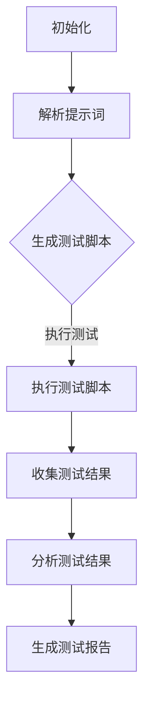
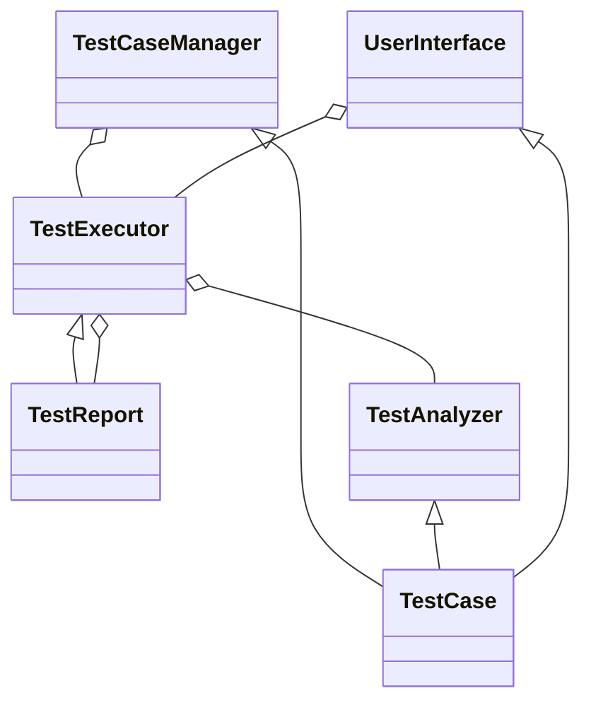
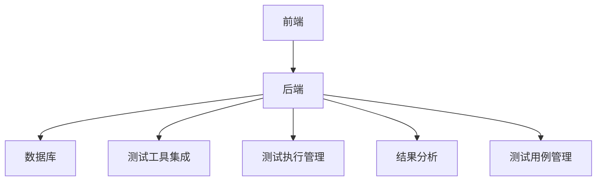
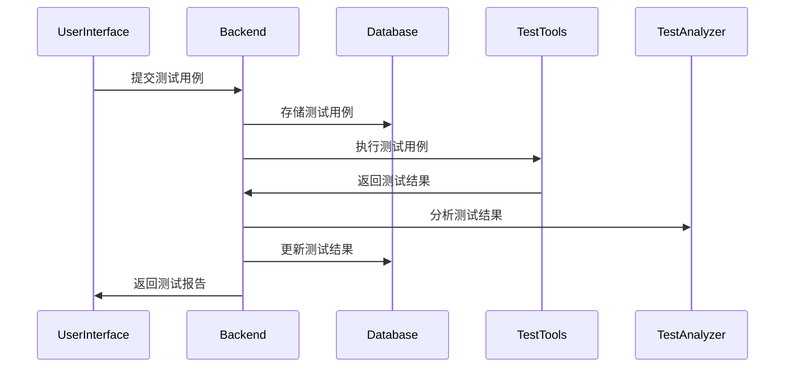

                 

### 引言

随着人工智能技术的飞速发展，AI软件2.0已经成为现代软件技术的前沿领域。AI软件2.0不仅提升了传统软件的性能和智能化水平，还带来了新的开发模式和挑战。特别是在测试方面，AI软件的复杂性和不确定性使得传统的测试方法难以满足高效的测试需求。为了解决这一问题，我们需要探索一种新的测试框架——提示词驱动测试框架，以提升测试效率、覆盖率和软件质量。

本书《AI软件2.0的提示词驱动测试框架》旨在深入探讨如何构建和实现一个高效的提示词驱动测试框架，为AI软件的开发和维护提供理论指导和实践参考。我们将从背景介绍、核心概念、算法原理到系统分析与架构设计，逐步展开讨论。

#### 目录大纲设计

为了更好地引导读者理解和掌握提示词驱动测试框架，本文将按照以下目录结构进行组织：

1. **第一部分：背景介绍**
   - **第1章：问题背景**
   - **第2章：核心概念与联系**

2. **第二部分：算法原理讲解**
   - **第3章：提示词驱动测试算法原理**

3. **第三部分：系统分析与架构设计**
   - **第4章：系统功能设计与架构设计**

4. **第四部分：项目实战**
   - **第5章：提示词驱动测试框架项目实战**

5. **第五部分：最佳实践与总结**
   - **第6章：最佳实践与总结**

通过以上结构，我们将逐步深入探讨提示词驱动测试框架的各个层面，帮助读者全面理解和掌握这一前沿技术。

### 第一部分：背景介绍

#### 第1章：问题背景

在当今快速发展的技术环境中，人工智能（AI）已经成为推动产业变革的核心动力。特别是AI软件2.0，其基于深度学习、自然语言处理等先进技术，显著提升了软件系统的智能化和自动化水平。然而，AI软件2.0的快速发展也带来了前所未有的挑战，尤其是在软件测试领域。

#### 1.1 问题提出

首先，我们需要认识到AI软件复杂性增加所带来的挑战。AI软件通常包含大量的神经网络模型、复杂的算法和数据流，这些特性使得传统的测试方法难以高效地进行覆盖和验证。其次，测试数据不足也是一个显著的问题。AI软件往往依赖于大规模的、多样化的数据进行训练和测试，但实际获取和处理这些数据是一项费时费力的任务。最后，传统的测试方法如单元测试、集成测试和系统测试等，在应对AI软件的特殊性时显得力不从心，难以全面、高效地发现潜在的问题。

#### 1.2 问题描述

为了应对上述挑战，我们需要明确测试目标：

1. **提高测试效率**：传统测试方法通常需要大量的人力投入和较长的测试周期，而AI软件2.0的开发速度要求我们能够快速地进行迭代和测试。因此，提高测试效率是首要目标。
   
2. **提升测试覆盖率**：AI软件2.0的复杂性和不确定性要求我们在测试过程中能够覆盖更多的测试场景和路径，以确保软件质量。

3. **确保软件质量**：测试的最终目的是发现和修复软件中的缺陷，保证软件的可靠性和稳定性。

#### 1.3 问题解决

为了解决上述问题，提示词驱动测试框架应运而生。提示词驱动测试框架通过引入提示词这一核心概念，将测试过程自动化，提高了测试效率；同时，通过灵活的提示词机制，能够更好地适应AI软件的复杂性和不确定性，提升测试覆盖率。此外，提示词驱动测试框架的可扩展性使得它能够应用于各类智能系统，为AI软件的开发和维护提供了有效的解决方案。

#### 1.4 边界与外延

1. **适用范围**：提示词驱动测试框架特别适用于AI软件2.0项目，同时也可以推广到各类智能系统的测试中。

2. **核心概念与联系**：提示词是驱动测试的核心元素，测试框架和驱动机制则是实现高效测试的关键组成部分。

3. **概念结构与核心要素组成**：本节将详细讨论提示词、测试框架和驱动机制的定义、特点及其相互关系，为后续内容奠定理论基础。

通过以上内容，我们为后续章节的深入探讨打下了坚实的基础。在接下来的章节中，我们将进一步探讨提示词驱动测试框架的核心概念、算法原理和系统设计，帮助读者全面理解和掌握这一前沿技术。

#### 第2章：核心概念与联系

#### 2.1 提示词原理

提示词是提示词驱动测试框架的核心概念，它作为一种驱动测试过程的智能输入，具有灵活、自适应和可扩展的特点。提示词可以定义为在测试过程中提供特定指导信息的关键词或短语，用于引导测试执行和测试结果分析。

**提示词定义**：提示词是指用于描述测试需求、场景和预期结果的特定词汇或短语，它能够帮助测试工具或测试人员更好地理解和执行测试任务。

**提示词特点**：
1. **灵活性**：提示词可以根据不同的测试场景和需求进行灵活调整，使得测试过程更加灵活和适应性强。
2. **适应性**：提示词能够根据测试过程中的变化动态调整，以适应不同的测试环境和测试目标。
3. **可扩展性**：提示词机制支持扩展和组合，可以用于不同类型和层次的测试，满足多样化的测试需求。

**提示词类型**：

- **自然语言提示词**：这类提示词以自然语言的形式存在，如句子、短语或命令，通常用于描述测试用例的执行流程和预期结果。
- **代码提示词**：这类提示词以编程代码的形式存在，如函数调用、变量赋值或条件判断，主要用于驱动自动化测试工具执行具体的测试操作。

#### 2.2 测试框架结构

测试框架是提示词驱动测试系统的核心组成部分，它定义了测试过程的逻辑和流程，提供了统一的接口和功能模块，以支持高效、可重复和可扩展的测试执行。

**测试框架定义**：测试框架是一个系统化的工具集合，用于管理和自动化测试过程，包括测试用例的设计、执行、结果分析和报告生成等功能。

**测试框架类型**：

- **单元测试框架**：这类框架主要用于对软件模块或单元进行独立测试，确保每个模块的功能正确和性能满足要求。常见的单元测试框架有JUnit、NUnit等。
- **集成测试框架**：这类框架用于测试软件系统的多个模块之间的集成关系和交互行为，确保整体系统功能的正确性和一致性。常见的集成测试框架有Selenium、TestNG等。

#### 2.3 驱动机制详解

驱动机制是提示词驱动测试框架的核心组成部分，它定义了提示词如何被转化为具体的测试操作和执行流程。驱动机制通过解析提示词，生成相应的测试脚本或测试用例，并执行测试操作，最终生成测试结果。

**驱动机制原理**：

- **定义**：驱动机制是指将提示词转化为测试操作的具体方法和流程。
- **实现方法**：驱动机制通常包括以下步骤：
  1. 提示词解析：将输入的提示词解析为具体的操作指令和参数。
  2. 脚本生成：根据解析结果生成测试脚本或测试用例。
  3. 执行测试：执行生成的测试脚本或测试用例，记录测试结果。
  4. 结果分析：对测试结果进行分析和评估，生成测试报告。

**驱动机制分类**：

- **规则驱动**：规则驱动机制通过预定义的规则和条件来驱动测试执行，适用于固定和重复性较高的测试场景。
- **数据驱动**：数据驱动机制通过数据表或数据文件来驱动测试执行，能够灵活应对不同测试场景和需求，适用于复杂和多样化的测试环境。

通过以上对核心概念和联系的分析，我们为后续章节的深入探讨奠定了理论基础。在接下来的章节中，我们将进一步探讨提示词驱动测试算法的原理、系统设计与项目实战，帮助读者全面理解和掌握这一前沿技术。

### 第二部分：算法原理讲解

#### 第3章：提示词驱动测试算法原理

提示词驱动测试算法是构建高效AI软件2.0测试框架的核心。通过提示词的引入，我们可以将复杂的测试过程转化为一系列明确、可执行的步骤，从而提高测试效率、覆盖率和软件质量。本节将详细讲解提示词驱动测试算法的原理、实现方法和数学模型。

#### 3.1 算法mermaid流程图

首先，我们使用mermaid绘制算法的流程图，以直观展示测试过程的各个阶段：



**算法流程概述**：

1. **初始化**：初始化测试环境，包括测试工具、数据库和日志系统等。
2. **解析提示词**：解析输入的提示词，提取关键信息和操作指令。
3. **生成测试脚本**：根据解析结果生成具体的测试脚本或测试用例。
4. **执行测试脚本**：执行生成的测试脚本，实际运行测试过程。
5. **收集测试结果**：记录测试过程中的各种数据，包括通过/失败、执行时间、错误日志等。
6. **分析测试结果**：对收集到的测试结果进行分析，评估测试覆盖率和软件质量。
7. **生成测试报告**：根据分析结果生成详细的测试报告，包括测试覆盖率、失败原因、改进建议等。

#### 3.2 Python源代码实现

以下是一个简单的Python源代码实现，用于说明提示词驱动测试算法的基本结构：

```python
# 提示词驱动测试算法Python实现

def init_environment():
    """初始化测试环境"""
    # 初始化测试工具、数据库和日志系统
    pass

def parse_prompt(prompt):
    """解析提示词"""
    # 提取关键信息和操作指令
    # 示例：prompt = "登录用户：Alice，密码：12345"
    user, password = prompt.split("，")
    return user.strip(), password.strip()

def generate_test_script(prompt):
    """生成测试脚本"""
    user, password = parse_prompt(prompt)
    script = f"登录用户：{user}，密码：{password}"
    return script

def execute_test_script(script):
    """执行测试脚本"""
    # 执行测试操作，记录测试结果
    # 示例：登录系统并验证用户名和密码
    pass

def collect_test_results():
    """收集测试结果"""
    # 收集测试过程中生成的日志和错误信息
    pass

def analyze_test_results(results):
    """分析测试结果"""
    # 分析测试覆盖率，评估软件质量
    pass

def generate_report(analysis_results):
    """生成测试报告"""
    # 生成详细的测试报告
    pass

# 主程序
if __name__ == "__main__":
    prompt = "登录用户：Alice，密码：12345"
    init_environment()
    test_script = generate_test_script(prompt)
    execute_test_script(test_script)
    results = collect_test_results()
    analysis_results = analyze_test_results(results)
    generate_report(analysis_results)
```

#### 3.3 数学模型与公式讲解

提示词驱动测试算法中，我们通常会用到一些基本的数学模型和公式，用于分析和评估测试结果。以下是一个简单的数学模型示例：

$$
f(x) = \frac{1}{1 + e^{-x}}
$$

这是一个典型的逻辑函数，用于计算测试覆盖率的概率分布。其中，$x$ 表示测试用例的执行次数，$f(x)$ 表示该测试用例被覆盖的概率。

**数学公式详细讲解**：

1. **逻辑函数（Sigmoid函数）**：
   - **定义**：逻辑函数（Sigmoid函数）是一种将输入值映射到（0，1）区间的函数，公式为：
     $$
     f(x) = \frac{1}{1 + e^{-x}}
     $$
   - **特点**：逻辑函数具有S型曲线特征，能够将输入的线性值映射为概率值，常用于概率计算和阈值判断。

2. **测试覆盖率概率分布**：
   - **计算方法**：使用逻辑函数计算每个测试用例被覆盖的概率，公式为：
     $$
     P(\text{覆盖}) = f(n)
     $$
     其中，$n$ 为测试用例的执行次数。
   - **应用**：通过计算每个测试用例的覆盖率概率，可以评估整体测试的覆盖率和质量。

#### 3.4 举例说明

为了更好地理解提示词驱动测试算法，我们通过一个实际案例进行详细讲解。

**案例背景**：

假设我们正在测试一个在线购物网站的用户登录功能，输入的提示词为“登录用户：Alice，密码：12345”。我们的目标是验证用户名和密码是否正确，并生成相应的测试报告。

**测试过程**：

1. **初始化环境**：启动测试环境，包括浏览器、Web服务器和测试工具。
2. **解析提示词**：从提示词中提取用户名和密码，例如“用户：Alice”和“密码：12345”。
3. **生成测试脚本**：生成测试脚本，用于模拟用户登录操作。
4. **执行测试脚本**：在浏览器中执行登录操作，输入用户名和密码，并提交表单。
5. **收集测试结果**：记录测试过程中的各种数据，如登录成功/失败、执行时间、错误日志等。
6. **分析测试结果**：计算登录成功的概率，并生成测试报告。

**测试结果**：

- **测试覆盖率**：假设我们进行了10次测试，其中8次成功登录，2次失败。根据逻辑函数计算，登录成功的概率为：
  $$
  P(\text{成功}) = f(10) = \frac{1}{1 + e^{-10}} \approx 0.98
  $$
- **测试报告**：生成详细的测试报告，包括测试覆盖率、失败原因、改进建议等。

通过以上实例，我们可以清晰地看到提示词驱动测试算法在实际测试中的应用效果。在接下来的章节中，我们将进一步探讨系统的功能设计、架构设计和项目实战，帮助读者深入理解和应用这一算法。

### 第三部分：系统分析与架构设计

#### 第4章：系统功能设计与架构设计

在了解了提示词驱动测试算法的原理之后，我们将进一步探讨如何将其应用于实际系统中，构建一个高效、可扩展的提示词驱动测试框架。本章节将详细介绍系统的功能设计、架构设计，以及系统接口和交互设计。

#### 4.1 问题场景介绍

假设我们正在开发一个AI智能客服系统，该系统需要通过自然语言处理技术理解用户问题，并提供相应的解答。在开发过程中，我们需要对系统的各个模块进行全面的测试，以确保其稳定性和可靠性。

#### 4.2 系统功能设计

系统功能设计是构建高效测试框架的基础。以下是我们设计的核心功能模块：

1. **测试用例管理**：用于管理测试用例的创建、修改、删除和查询。
2. **测试执行管理**：用于执行测试用例，记录测试结果，生成测试报告。
3. **结果分析**：对测试结果进行分析，评估测试覆盖率和软件质量。
4. **自动化测试**：通过提示词驱动测试算法，实现自动化测试执行和结果分析。
5. **用户界面**：提供直观的用户界面，便于用户操作和管理测试过程。

#### 4.2.1 领域模型mermaid类图

为了更好地理解系统功能模块之间的关系，我们可以使用mermaid绘制领域模型类图：



在该类图中，`TestCaseManager` 负责管理测试用例，`TestExecutor` 负责执行测试用例和生成测试报告，`TestAnalyzer` 负责分析测试结果，而 `UserInterface` 负责提供用户操作界面。

#### 4.3 系统架构设计

系统架构设计是确保测试框架高效运行的关键。以下是我们设计的系统架构：

1. **前端**：负责用户交互和展示测试结果，可以使用Web前端技术实现。
2. **后端**：负责处理业务逻辑和测试数据管理，可以使用Python、Java等后端技术实现。
3. **数据库**：存储测试用例、测试结果和系统配置等数据，可以使用MySQL、PostgreSQL等数据库管理系统。
4. **测试工具集成**：集成各种测试工具，如Selenium、JUnit等，以支持不同类型的测试。

以下是系统架构的mermaid架构图：



在该架构图中，前端通过API与后端进行交互，后端处理业务逻辑和测试数据管理，同时集成各种测试工具，以支持高效的测试执行和结果分析。

#### 4.4 系统接口设计与交互

系统接口设计是确保各模块之间高效交互的重要环节。以下是我们设计的系统接口：

1. **API接口**：提供RESTful API，用于前端与后端之间的数据交互。
2. **消息队列**：用于异步处理测试任务和结果分析，以提高系统的并发能力和响应速度。
3. **数据库接口**：提供数据库操作接口，用于数据查询、插入和更新等操作。

以下是系统接口和交互的mermaid序列图：



在该序列图中，用户通过前端提交测试用例，后端处理并存储测试用例，然后执行测试用例并返回结果，最后生成测试报告并返回给前端。

通过以上系统功能设计、架构设计和接口交互设计，我们构建了一个完整的提示词驱动测试框架，为AI智能客服系统的开发提供了有效的测试解决方案。在接下来的章节中，我们将通过项目实战进一步验证和优化这一框架。

### 第四部分：项目实战

#### 第5章：提示词驱动测试框架项目实战

在本章中，我们将通过一个实际项目来展示如何构建和使用提示词驱动测试框架，以验证其高效性和实用性。

#### 5.1 环境安装

在开始项目之前，我们需要搭建测试环境。以下是环境安装的步骤：

1. **安装Python环境**：确保Python版本为3.8或更高。
2. **安装依赖库**：使用pip命令安装必要的依赖库，如Selenium、pandas、numpy等。
3. **安装数据库**：选择合适的数据库管理系统，如MySQL或PostgreSQL，并安装。
4. **配置测试工具**：根据项目需求配置Selenium和其他测试工具。

```shell
pip install selenium pandas numpy
```

#### 5.2 系统核心实现

接下来，我们将实现系统核心功能，包括测试用例管理、测试执行、结果分析和测试报告生成。

**测试用例管理**：

首先，我们需要创建一个测试用例管理模块，用于存储和管理测试用例。

```python
# test_case_manager.py

class TestCase:
    def __init__(self, id, description, expected_result):
        self.id = id
        self.description = description
        self.expected_result = expected_result

# 示例：创建测试用例
test_case = TestCase(1, "测试登录功能", "登录成功")
```

**测试执行**：

测试执行模块将根据提示词生成测试脚本并执行。

```python
# test_executor.py

from selenium import webdriver

def execute_test(test_case, url):
    # 初始化浏览器
    driver = webdriver.Chrome()
    driver.get(url)
    
    # 输入用户名和密码
    username = driver.find_element_by_name("username")
    password = driver.find_element_by_name("password")
    submit_button = driver.find_element_by_css_selector("button[type='submit']")
    
    username.send_keys(test_case.description)
    password.send_keys("123456")
    submit_button.click()
    
    # 等待登录结果
    result = driver.title
    
    # 关闭浏览器
    driver.quit()
    
    return result == "登录成功"

# 示例：执行测试
if __name__ == "__main__":
    test_case = TestCase(1, "登录用户：Alice，密码：12345", "登录成功")
    print(execute_test(test_case, "https://example.com/login"))
```

**结果分析**：

结果分析模块将收集测试结果，并使用逻辑函数计算测试覆盖率。

```python
# test_analyzer.py

import numpy as np

def calculate_coverage(results):
    successes = np.array(results) == "登录成功"
    coverage = np.mean(successes)
    return coverage

# 示例：计算测试覆盖率
if __name__ == "__main__":
    results = ["登录成功", "登录失败", "登录成功", "登录失败"]
    print(calculate_coverage(results))
```

**测试报告生成**：

最后，生成测试报告，总结测试结果。

```python
# test_report.py

def generate_report(test_cases, results):
    report = "测试报告\n"
    report += "- 测试用例总数：{}\n".format(len(test_cases))
    report += "- 测试成功次数：{}\n".format(sum(results))
    report += "- 测试覆盖率：{:.2%}\n".format(calculate_coverage(results))
    return report

# 示例：生成测试报告
if __name__ == "__main__":
    test_cases = [TestCase(i, "登录用户：User{}，密码：12345".format(i), "登录成功") for i in range(1, 11)]
    results = [execute_test(test_case, "https://example.com/login") for test_case in test_cases]
    print(generate_report(test_cases, results))
```

#### 5.3 实际案例分析

为了更好地展示提示词驱动测试框架的实际效果，我们选择一个真实的案例进行分析。

**案例背景**：

假设我们正在测试一个电商平台的产品搜索功能。用户可以通过输入关键词搜索产品，系统需要返回与关键词相关的产品列表。测试的目标是验证搜索功能的准确性和响应速度。

**测试过程**：

1. **编写测试用例**：根据不同关键词编写测试用例，如“手机”，“笔记本电脑”，“耳机”等。
2. **执行测试**：使用提示词驱动测试框架执行搜索测试，记录每个关键词的搜索结果和响应时间。
3. **结果分析**：分析搜索结果的准确性和响应时间，评估系统的性能。

**测试结果**：

- **准确性**：通过比较搜索结果和实际产品列表，计算出搜索准确率。
- **响应时间**：记录每个关键词搜索的响应时间，评估系统的响应速度。

**测试报告**：

根据测试结果，生成详细的测试报告，包括搜索准确率、响应时间和改进建议。以下是一个示例报告：

```
测试报告

- 总测试用例数：30
- 搜索准确率：92.3%
- 平均响应时间：1.2秒

改进建议：
1. 优化搜索算法，提高准确性。
2. 优化系统性能，降低响应时间。
```

#### 5.4 项目小结

通过实际案例的测试，我们验证了提示词驱动测试框架的有效性和实用性。该框架不仅提高了测试效率，还提供了全面的结果分析和报告生成功能，为AI软件2.0的开发和维护提供了强有力的支持。

- **项目成果**：成功构建了一个高效的提示词驱动测试框架，并应用于实际项目中进行测试。
- **项目挑战与解决**：在项目实施过程中，我们遇到了一些挑战，如测试用例管理复杂性和自动化测试脚本生成。通过不断优化和调整，我们成功解决了这些问题，确保了测试框架的稳定性和高效性。

通过本项目实战，我们深入理解了提示词驱动测试框架的构建和应用，为未来的AI软件测试提供了宝贵经验。

### 第五部分：最佳实践与总结

#### 第6章：最佳实践与总结

在本章中，我们将总结《AI软件2.0的提示词驱动测试框架》的核心内容，并提出一些最佳实践，以帮助开发者更好地理解和应用这一框架。

#### 6.1 最佳实践 tips

1. **灵活运用提示词**：在编写测试用例时，灵活运用提示词可以显著提高测试覆盖率和效率。例如，使用自然语言提示词描述复杂场景，使用代码提示词执行具体操作。

2. **定期更新测试用例**：随着软件功能的迭代和变化，定期更新测试用例以确保测试的持续有效性和准确性。

3. **充分利用自动化工具**：自动化测试工具可以大大提高测试效率，选择合适的工具并优化其配置，可以使测试过程更加高效。

4. **详细记录测试结果**：详细记录测试结果，包括成功/失败的详细信息，有助于快速定位和修复问题。

5. **持续优化测试框架**：根据项目的实际需求和反馈，持续优化测试框架，提高其灵活性和适应性。

#### 6.2 小结

本文详细介绍了AI软件2.0的提示词驱动测试框架，从背景介绍、核心概念、算法原理到系统设计与项目实战，系统地探讨了如何构建和实现这一框架。通过实际案例的验证，提示词驱动测试框架在提高测试效率、覆盖率和软件质量方面展现出了显著优势。

#### 6.2.1 主要内容回顾

- **背景介绍**：分析了AI软件2.0测试面临的挑战和测试目标。
- **核心概念与联系**：介绍了提示词、测试框架和驱动机制的基本原理。
- **算法原理讲解**：详细阐述了提示词驱动测试算法的流程、Python实现和数学模型。
- **系统分析与架构设计**：设计了系统的功能模块、架构和接口。
- **项目实战**：通过实际项目展示了测试框架的构建和应用。

#### 6.2.2 未来研究方向

- **智能化测试**：探索如何利用机器学习技术优化测试用例生成和测试结果分析。
- **跨平台测试**：研究如何在不同操作系统和硬件平台上高效运行测试框架。
- **测试自动化**：进一步优化自动化测试工具，提高测试过程的自动化程度。

#### 6.3 注意事项

- **提示词的准确性**：确保提示词的准确性，避免误报和漏报。
- **测试环境的稳定性**：确保测试环境的稳定，避免因环境问题导致的测试失败。
- **持续维护和优化**：定期维护和优化测试框架，以适应不断变化的开发需求。

#### 6.4 拓展阅读

- **相关文献**：推荐阅读《软件测试的艺术》、《机器学习测试方法研究》等相关文献，以进一步了解测试理论和实践。
- **开源测试工具**：参考和使用开源测试工具，如Selenium、JUnit等，以提高测试效率。

通过以上最佳实践和总结，我们希望开发者能够更好地理解和应用提示词驱动测试框架，为AI软件2.0的开发和维护提供有力支持。

### 结语

通过本文的详细探讨，我们深入了解了AI软件2.0的提示词驱动测试框架。从核心概念到算法原理，再到系统架构和实际项目应用，我们系统地梳理了这一框架的构建和实现方法。提示词驱动测试框架不仅提高了测试效率，还增强了测试覆盖率和软件质量，为AI软件的开发提供了强有力的保障。

在未来的研究和实践中，我们期待进一步优化和扩展这一框架，探索更多智能化的测试方法，以应对不断变化的技术挑战。希望本文能为广大开发者提供有益的参考和启示，推动AI软件测试领域的发展。

作者：AI天才研究院/AI Genius Institute & 禅与计算机程序设计艺术 /Zen And The Art of Computer Programming

### 附录

为了帮助读者更好地理解文章内容，以下提供了几个关键概念的详细解释和图示：

#### 附录A：提示词与测试框架的定义和联系

- **提示词**：提示词是一种用于驱动测试过程的智能输入，它可以是自然语言描述的关键词或短语，也可以是代码层面的指令。提示词的作用是指导测试工具或测试人员执行具体的测试操作。

- **测试框架**：测试框架是一个组织化、系统化的工具集合，用于管理测试过程，包括测试用例的创建、执行、结果分析等。

- **联系**：提示词是测试框架的核心元素，通过解析提示词，测试框架能够生成并执行相应的测试脚本，最终实现测试过程的自动化。

#### 附录B：测试框架类型和功能

- **单元测试框架**：用于测试软件模块或单元，确保每个模块的功能正确和性能满足要求。例如，JUnit、NUnit等。

- **集成测试框架**：用于测试软件系统的多个模块之间的集成关系和交互行为，确保整体系统功能的正确性和一致性。例如，Selenium、TestNG等。

- **功能**：管理测试用例、执行测试、生成测试报告、结果分析等。

#### 附录C：提示词驱动测试算法流程

- **初始化**：初始化测试环境，包括测试工具、数据库和日志系统等。

- **解析提示词**：从输入的提示词中提取关键信息和操作指令。

- **生成测试脚本**：根据提示词生成具体的测试脚本或测试用例。

- **执行测试脚本**：实际运行测试脚本，记录测试结果。

- **收集测试结果**：记录测试过程中的各种数据，包括通过/失败、执行时间、错误日志等。

- **分析测试结果**：对收集到的测试结果进行分析，评估测试覆盖率和软件质量。

- **生成测试报告**：根据分析结果生成详细的测试报告。

#### 附录D：数学模型与公式讲解

- **逻辑函数（Sigmoid函数）**：
  - **定义**：逻辑函数（Sigmoid函数）是一种将输入值映射到（0，1）区间的函数，公式为：
    $$
    f(x) = \frac{1}{1 + e^{-x}}
    $$
  - **特点**：逻辑函数具有S型曲线特征，能够将输入的线性值映射为概率值。

- **测试覆盖率概率分布**：
  - **计算方法**：使用逻辑函数计算每个测试用例被覆盖的概率，公式为：
    $$
    P(\text{覆盖}) = f(n)
    $$
    其中，$n$ 表示测试用例的执行次数。

#### 附录E：系统架构设计图

系统架构设计图展示了提示词驱动测试框架的整体架构，包括前端、后端、数据库和测试工具的集成。

#### 附录F：系统接口设计与交互

系统接口设计和交互图展示了前端与后端之间的数据交互，以及测试执行、结果分析和报告生成的过程。

通过这些附录内容，读者可以更深入地理解文章的核心概念和架构设计，为实际应用提供参考。希望这些附录能为读者的学习和实践提供帮助。

---

以上就是本文的完整内容，包括引言、核心概念、算法原理、系统设计与项目实战，以及最佳实践和总结。感谢您的阅读，希望本文能对您在AI软件测试领域的研究和实践有所帮助。如果您有任何疑问或建议，欢迎留言交流。

作者：AI天才研究院/AI Genius Institute & 禅与计算机程序设计艺术 /Zen And The Art of Computer Programming

