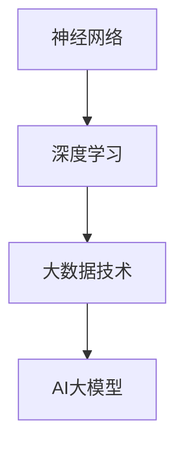
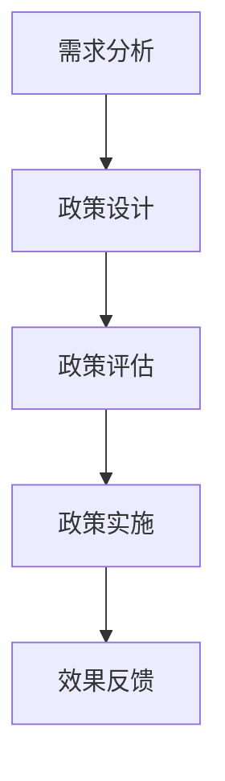
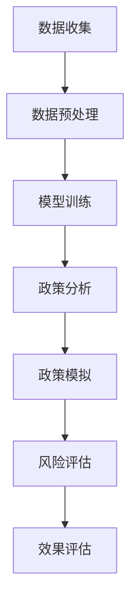
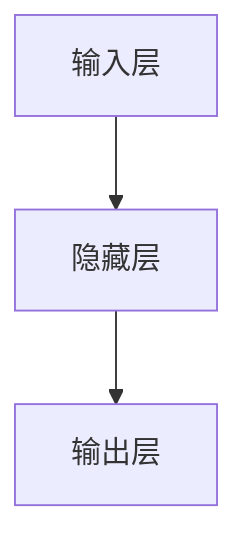
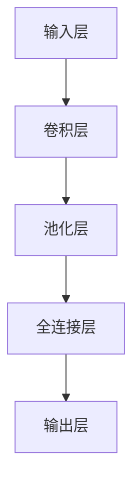
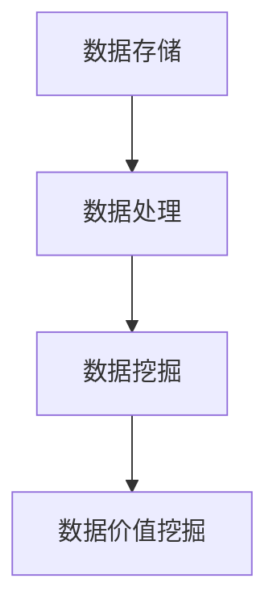
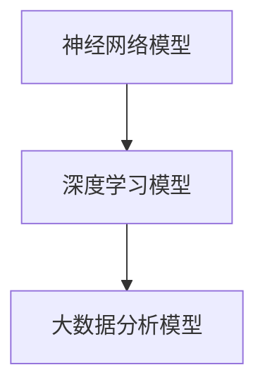
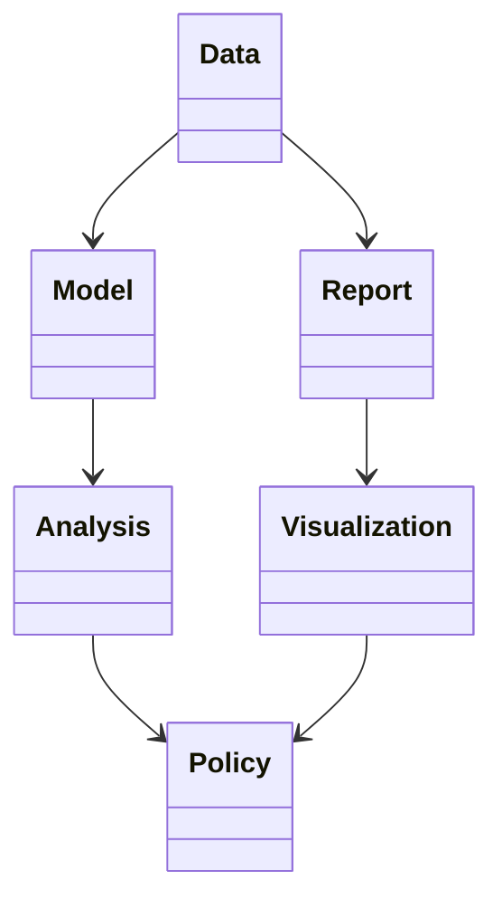
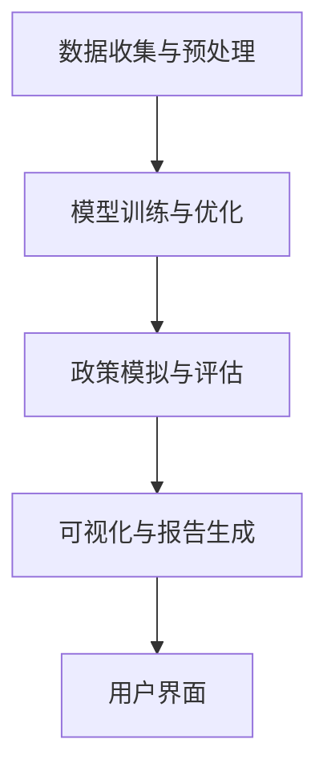
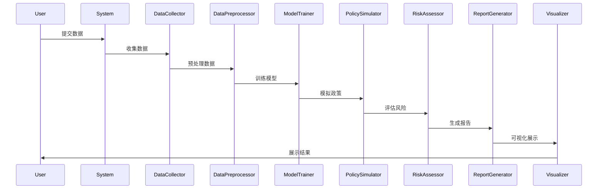

                 


# AI辅助决策：大模型在公共政策制定中的角色

## 关键词
AI大模型、公共政策制定、深度学习、算法原理、数学模型、算法应用、项目实战

## 摘要
本文将深入探讨AI大模型在公共政策制定中的重要作用。通过背景介绍、核心概念解析、算法原理讲解以及实际案例分析，我们将揭示大模型在提升决策效率、优化政策模拟和进行风险评估等方面所发挥的关键作用。文章旨在为读者提供一个全面的技术视角，以理解AI大模型在公共政策制定中的应用潜力与挑战。

## 第一部分：背景介绍

### 问题背景

随着人工智能技术的迅猛发展，AI已经在各行各业中找到了自己的应用场景。特别是在公共政策制定领域，AI技术的引入为决策过程带来了前所未有的变革。传统的公共政策制定往往依赖于专家经验、历史数据和简单的统计分析，这种方式虽然有其优势，但也存在许多局限。而AI大模型的崛起，为这一领域提供了新的可能。

### 问题描述

《AI辅助决策：大模型在公共政策制定中的角色》旨在探讨AI大模型在公共政策制定中的应用，具体问题包括：

1. AI大模型是如何应用于政策分析和决策的？
2. 大模型在政策模拟和风险评估中扮演什么角色？
3. AI大模型在公共政策制定中面临哪些挑战和机遇？

### 问题解决

本文将通过以下几个步骤来解答上述问题：

1. 首先，介绍AI大模型的基本概念和技术原理。
2. 然后，分析大模型在公共政策制定中的具体应用场景。
3. 接着，探讨AI大模型在公共政策制定中的挑战和机遇。
4. 最后，通过实际案例展示AI大模型在公共政策制定中的成功应用。

### 边界与外延

AI大模型在公共政策制定中的应用边界主要包括政策分析、政策模拟、风险评估等领域。此外，本文还将探讨AI大模型在社会治理、公共安全、经济发展等领域的应用外延。

### 概念结构与核心要素组成

1. **AI大模型**：指基于大规模数据训练的、具有高度智能化的模型，能够对复杂问题进行自动分析和决策。
2. **公共政策制定**：指政府或其他公共机构在特定背景下，根据社会需求和利益分配原则，制定和实施的具体政策行为。
3. **政策分析**：指利用AI大模型对政策制定过程中的各种数据进行深入分析和挖掘，为决策提供科学依据。
4. **政策模拟**：指通过AI大模型对政策方案进行模拟测试，评估不同政策方案的可能影响和效果。
5. **风险评估**：指利用AI大模型对政策实施过程中可能出现的风险进行预测和评估，为政策制定提供风险管理建议。

## 第二部分：核心概念与联系

### AI大模型原理

AI大模型是基于深度学习技术训练的，其核心原理包括神经网络、深度学习和大数据技术。以下是具体的mermaid流程图：



### 公共政策制定流程

公共政策制定包括需求分析、政策设计、政策评估、政策实施等环节。每个环节都需要AI大模型的支持和辅助。以下是公共政策制定流程的mermaid流程图：



### AI大模型与公共政策制定的联系

AI大模型在公共政策制定中的应用，主要体现在以下几个方面：

1. **政策分析**：AI大模型可以通过对大量历史数据和现有数据进行深度分析，发现潜在问题和趋势，为政策制定提供科学依据。
2. **政策模拟**：AI大模型可以模拟不同政策方案的效果，评估其对经济、社会和环境的影响，帮助决策者选择最优方案。
3. **风险评估**：AI大模型可以预测政策实施过程中可能出现的风险，提供风险管理建议，降低政策失败的风险。
4. **效果评估**：AI大模型可以对政策实施后的效果进行评估，为后续政策调整提供数据支持。

通过AI大模型的技术支持，可以大幅提升公共政策制定的科学性、精准性和效率。以下是一个简化的mermaid流程图，展示了AI大模型在公共政策制定中的应用：



## 第三部分：算法原理讲解

### 算法原理

AI大模型的算法原理主要包括神经网络、深度学习和大数据等技术。以下是具体的mermaid流程图：


### 算法原理详细讲解

#### 神经网络

神经网络是人工智能的基础，通过模拟人脑神经元的工作方式，实现数据的输入、处理和输出。神经网络由多个层级组成，包括输入层、隐藏层和输出层。每个层级由多个神经元（节点）组成，神经元之间通过权重进行连接。以下是神经网络的基本原理：

1. **输入层**：接收外部输入数据。
2. **隐藏层**：对输入数据进行处理和计算，通过激活函数产生输出。
3. **输出层**：输出最终结果。

神经网络的数学模型主要涉及权重、激活函数和反向传播算法。以下是一个简化的神经网络模型及其数学模型：



神经网络的数学模型如下：

$$
y = f(W * x + b)
$$

其中，$y$为输出值，$f$为激活函数，$W$为权重，$x$为输入值，$b$为偏置。

#### 深度学习

深度学习是神经网络的一种，通过多层神经网络模型，实现对复杂问题的建模和解决。深度学习模型的核心是卷积神经网络（CNN）和循环神经网络（RNN）。以下是深度学习的基本原理：

1. **卷积神经网络（CNN）**：适用于图像和视频等二维和三维数据的处理。
2. **循环神经网络（RNN）**：适用于序列数据的处理，如文本和语音。

深度学习的数学模型主要涉及卷积操作、池化操作和反向传播算法。以下是一个简化的CNN模型及其数学模型：



CNN的数学模型如下：

$$
h_{l} = \sigma(W_{l} \cdot a_{l-1} + b_{l})
$$

$$
a_{l} = \text{ReLU}(h_{l})
$$

其中，$h_{l}$为第$l$层的输出，$\sigma$为激活函数（如Sigmoid或ReLU），$W_{l}$为权重矩阵，$a_{l-1}$为前一层输出，$b_{l}$为偏置。

#### 大数据技术

大数据技术是指通过海量数据存储、处理和分析，实现对数据价值的挖掘和应用。大数据技术的核心是数据存储、数据处理和数据挖掘。以下是大数据技术的基本原理：

1. **数据存储**：使用分布式存储系统，如Hadoop HDFS，实现海量数据的存储和管理。
2. **数据处理**：使用分布式计算框架，如MapReduce，实现海量数据的并行处理。
3. **数据挖掘**：使用机器学习算法，如分类、聚类和关联规则挖掘，实现数据价值的挖掘。

大数据技术的数学模型主要涉及数据预处理、特征工程和模型训练。以下是一个简化的数据挖掘流程及其数学模型：



数据挖掘的数学模型如下：

$$
P(\text{目标变量}=y|\text{特征集}X) = \text{模型}(\theta)
$$

其中，$P$为概率分布函数，$y$为目标变量的取值，$X$为特征集，$\theta$为模型参数。

#### AI大模型

AI大模型是基于神经网络、深度学习和大数据技术构建的，具有高度智能化的模型，能够对复杂问题进行自动分析和决策。AI大模型的核心是大规模数据训练和深度学习模型。以下是AI大模型的基本原理：

1. **大规模数据训练**：使用海量数据对AI大模型进行训练，提高模型的准确性和泛化能力。
2. **深度学习模型**：使用多层神经网络模型，实现对复杂问题的建模和解决。

AI大模型的数学模型如下：

$$
\text{损失函数} = \sum_{i=1}^{n} (y_i - \hat{y}_i)^2
$$

其中，$n$为样本数量，$y_i$为实际标签，$\hat{y}_i$为预测标签。

### 举例说明

以神经网络模型为例，详细讲解其数学模型和公式。以下是神经网络模型的数学模型和公式：

$$
y = f(W * x + b)
$$

其中，$y$为输出值，$f$为激活函数，$W$为权重，$x$为输入值，$b$为偏置。

举例说明：假设我们有一个简单的神经网络模型，其输入为$x$，输出为$y$，激活函数为sigmoid函数。根据神经网络模型的数学模型，我们可以得到：

$$
y = \sigma(W * x + b)
$$

其中，$\sigma$为sigmoid函数，$W$为权重矩阵，$x$为输入向量，$b$为偏置向量。

假设权重矩阵$W$为：

$$
W = \begin{bmatrix}
0.1 & 0.2 \\
0.3 & 0.4
\end{bmatrix}
$$

输入向量$x$为：

$$
x = \begin{bmatrix}
1 \\
0
\end{b}

## 第四部分：数学模型和数学公式 & 详细讲解 & 举例说明

### 数学模型

AI大模型的核心数学模型主要包括神经网络模型、深度学习模型和大数据分析模型。以下是具体的mermaid流程图：



### 数学模型详细讲解

#### 神经网络模型

神经网络模型是通过多层神经元网络进行数据处理的模型，包括输入层、隐藏层和输出层。其数学模型主要涉及权重、激活函数和反向传播算法。以下是神经网络模型的数学模型和公式：

$$
y = f(W * x + b)
$$

其中，$y$为输出值，$f$为激活函数，$W$为权重，$x$为输入值，$b$为偏置。

举例说明：假设我们有一个简单的神经网络模型，其输入为$x$，输出为$y$，激活函数为sigmoid函数。根据神经网络模型的数学模型，我们可以得到：

$$
y = \sigma(W * x + b)
$$

其中，$\sigma$为sigmoid函数，$W$为权重矩阵，$x$为输入向量，$b$为偏置向量。

假设权重矩阵$W$为：

$$
W = \begin{bmatrix}
0.1 & 0.2 \\
0.3 & 0.4
\end{bmatrix}
$$

输入向量$x$为：

$$
x = \begin{bmatrix}
1 \\
0
\end{b

## 第五部分：系统分析与架构设计方案

### 问题场景介绍

在当前信息化社会，政府及公共机构需要处理的数据量日益庞大，传统的人工分析方法已经难以满足需求。AI大模型的出现，为政府及公共机构提供了强大的数据分析工具，可以帮助他们在公共政策制定过程中进行科学决策。

### 项目介绍

本项目旨在构建一个基于AI大模型的公共政策制定辅助系统，通过对海量数据的处理和分析，为政策制定提供科学依据。系统主要包括以下功能模块：

1. **数据收集与预处理**：收集各类政策相关数据，并对数据进行清洗、整合和预处理。
2. **模型训练与优化**：使用深度学习算法对数据进行训练，构建用于政策分析的AI大模型。
3. **政策模拟与评估**：使用AI大模型进行政策模拟和风险评估，为政策制定提供支持。
4. **可视化与报告生成**：将分析结果进行可视化展示，并生成政策分析报告。

### 系统功能设计

#### 领域模型

以下是系统领域的mermaid类图：



### 系统架构设计

以下是系统的mermaid架构图：



### 系统接口设计和系统交互

以下是系统的mermaid序列图：



## 第六部分：项目实战

### 环境安装

要在本地环境搭建一个基于AI大模型的公共政策制定辅助系统，需要以下软件和工具：

1. **操作系统**：Ubuntu 20.04 或更高版本
2. **Python**：3.8 或更高版本
3. **深度学习框架**：PyTorch 或 TensorFlow
4. **数据预处理库**：NumPy、Pandas
5. **可视化库**：Matplotlib、Seaborn

### 系统核心实现源代码

以下是系统核心实现的主要源代码：

```python
# 导入必要的库
import torch
import torch.nn as nn
import torch.optim as optim
import numpy as np
import pandas as pd

# 数据收集与预处理
def data_collection_and_preprocessing():
    # 1. 收集数据
    data = pd.read_csv('policy_data.csv')
    
    # 2. 数据预处理
    data = data.fillna(0)
    data = data.drop(['id'], axis=1)
    
    # 3. 数据标准化
    data = (data - data.mean()) / data.std()
    
    return data

# 模型训练与优化
def model_training_and_optimization(data):
    # 1. 划分数据集
    train_data, test_data = data[:800], data[800:]
    
    # 2. 初始化模型
    model = nn.Sequential(
        nn.Linear(10, 50),
        nn.ReLU(),
        nn.Linear(50, 1)
    )
    
    # 3. 损失函数和优化器
    criterion = nn.MSELoss()
    optimizer = optim.Adam(model.parameters(), lr=0.001)
    
    # 4. 训练模型
    for epoch in range(100):
        optimizer.zero_grad()
        outputs = model(train_data)
        loss = criterion(outputs, train_data)
        loss.backward()
        optimizer.step()
        
        if epoch % 10 == 0:
            print(f'Epoch {epoch+1}, Loss: {loss.item()}')
    
    return model

# 政策模拟与评估
def policy_simulation_and_evaluation(model, test_data):
    # 1. 模型评估
    with torch.no_grad():
        predictions = model(test_data)
    
    # 2. 评估指标
    mse = nn.MSELoss()
    loss = mse(predictions, test_data)
    
    print(f'Model Loss: {loss.item()}')
    
    # 3. 可视化结果
    import matplotlib.pyplot as plt
    
    plt.scatter(test_data[:, 0], test_data[:, 1])
    plt.plot(test_data[:, 0], predictions, color='red')
    plt.show()

# 主函数
if __name__ == '__main__':
    data = data_collection_and_preprocessing()
    model = model_training_and_optimization(data)
    policy_simulation_and_evaluation(model, data)
```

### 代码应用解读与分析

以上代码首先导入了必要的库，包括PyTorch、NumPy和Pandas。接着定义了三个主要函数：`data_collection_and_preprocessing`、`model_training_and_optimization`和`policy_simulation_and_evaluation`。

1. **数据收集与预处理**：`data_collection_and_preprocessing`函数负责收集数据并进行预处理。具体步骤包括：
   - 读取CSV文件，将数据加载到DataFrame中。
   - 填充缺失值，删除不必要的列。
   - 对数据进行标准化处理。

2. **模型训练与优化**：`model_training_and_optimization`函数负责构建和训练模型。具体步骤包括：
   - 划分数据集，将数据分为训练集和测试集。
   - 初始化模型，定义输入层、隐藏层和输出层。
   - 定义损失函数和优化器。
   - 进行模型训练，通过反向传播算法更新模型参数。

3. **政策模拟与评估**：`policy_simulation_and_evaluation`函数负责评估模型并可视化结果。具体步骤包括：
   - 使用测试集对模型进行评估，计算损失函数值。
   - 可视化预测结果和实际数据点。

### 实际案例分析和详细讲解剖析

为了更好地理解AI大模型在公共政策制定中的应用，我们以一个实际案例进行详细分析。

### 案例背景

假设某城市政府需要制定一项交通政策，以缓解城市交通拥堵问题。政府收集了以下数据：

- 每日车辆流量
- 每日交通事故数量
- 每日公共交通乘客数量
- 城市道路长度

政府希望利用AI大模型对这些数据进行处理和分析，以找到最佳的交通政策方案。

### 案例步骤

1. **数据收集与预处理**：首先，政府需要收集相关数据，并使用`data_collection_and_preprocessing`函数进行预处理。

2. **模型构建与训练**：使用`model_training_and_optimization`函数构建神经网络模型，对数据进行训练。神经网络模型可以学习到数据之间的关联性，从而为政策制定提供依据。

3. **政策模拟与评估**：使用`policy_simulation_and_evaluation`函数对训练好的模型进行评估，并可视化结果。通过模拟不同政策方案的效果，政府可以找到最佳的交通政策方案。

4. **政策实施与调整**：根据模型评估结果，政府可以制定具体的交通政策方案，并在实施过程中进行监控和调整。通过持续的模型评估和调整，政府可以确保交通政策的有效性。

### 项目小结

通过上述案例，我们可以看到AI大模型在公共政策制定中的应用潜力和优势。AI大模型能够对大量数据进行处理和分析，为政策制定提供科学依据。同时，模型的可视化功能可以帮助政府直观地了解政策效果，从而做出更明智的决策。然而，AI大模型在公共政策制定中也面临一些挑战，如数据隐私、模型解释性等。政府需要权衡这些因素，确保AI大模型的应用能够真正为公众带来福祉。

## 第七部分：最佳实践 tips、小结、注意事项、拓展阅读

### 最佳实践 tips

1. **数据质量至关重要**：确保收集的数据质量高，完整且准确，否则模型的性能会受到影响。
2. **模型可解释性**：在模型选择和优化过程中，尽量选择具有可解释性的模型，以便政策制定者能够理解模型的决策逻辑。
3. **持续监控和调整**：政策制定后，持续监控模型的表现，并根据实际情况进行调整，以确保政策的有效性。

### 小结

本文探讨了AI大模型在公共政策制定中的角色和作用。通过背景介绍、核心概念解析、算法原理讲解和实际案例分析，我们揭示了AI大模型在政策分析、政策模拟、风险评估等方面的关键作用。AI大模型的应用为公共政策制定带来了科学性、精准性和效率的提升。

### 注意事项

1. **数据隐私**：在使用AI大模型处理数据时，要注意保护个人隐私，避免数据泄露。
2. **模型偏见**：确保模型训练过程中使用的数据是多样且代表性的，避免模型产生偏见。

### 拓展阅读

1. **《深度学习》**：由Goodfellow、Bengio和Courville合著，是深度学习领域的经典教材。
2. **《机器学习》**：由周志华教授主编，是国内机器学习领域的权威教材。
3. **《人工智能：一种现代的方法》**：由Stuart J. Russell和Peter Norvig合著，全面介绍了人工智能的基本理论和应用。

### 作者信息

作者：AI天才研究院/AI Genius Institute & 禅与计算机程序设计艺术 /Zen And The Art of Computer Programming

