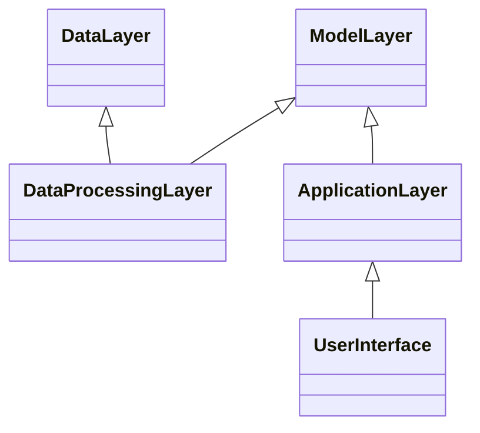
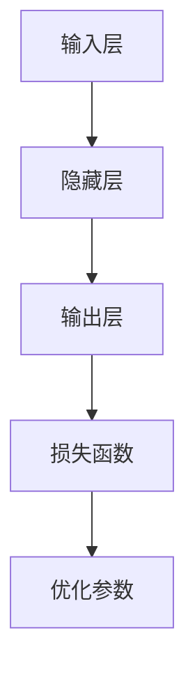
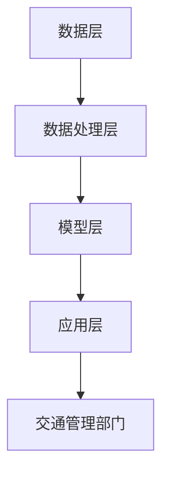
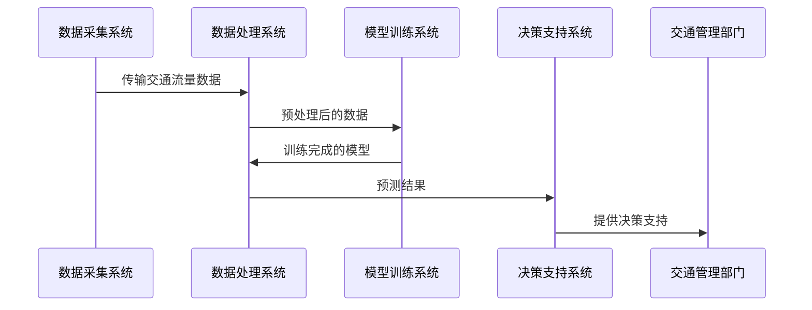
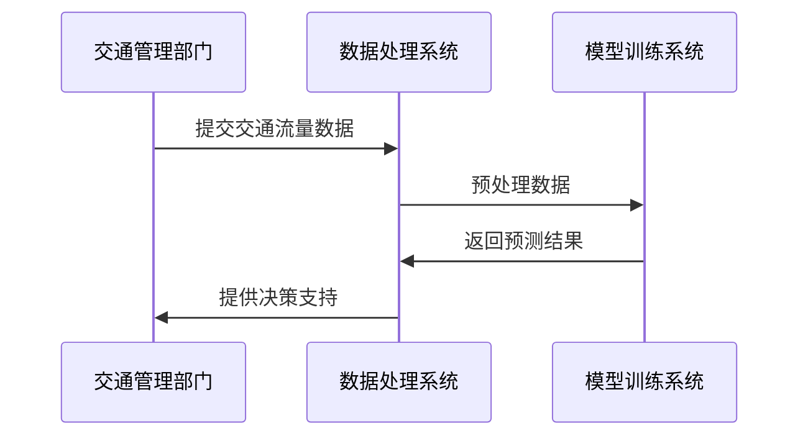

                 

### 1.3 问题解决

#### AI技术在城市规划中的应用

- **数据分析与预测**
  - 利用AI技术对城市数据进行收集、分析和预测，如交通流量、人口分布等。
  - 通过机器学习和深度学习算法，建立模型进行数据分析和预测，以支持城市规划决策。

- **模拟与优化**
  - 通过模拟仿真技术，对城市规划进行模拟，如交通模拟、环境影响模拟等。
  - 利用优化算法，对城市规划方案进行优化，以找到最优解。

- **决策支持**
  - 基于大数据和AI技术，为城市规划者提供决策支持，如城市设施布局、交通规划等。

#### AI大模型在智慧城市中的角色

- **数据驱动的城市规划**
  - 通过AI大模型处理和分析大量数据，为城市规划提供数据支持，实现更加科学和精准的规划。

- **智能化决策支持系统**
  - 基于AI大模型构建的决策支持系统，可以自动化地进行城市规划决策，提高规划效率和准确性。

#### 边界与外延

- **AI辅助城市规划的应用领域**
  - 城市交通规划：利用AI大模型进行交通流量预测和优化，提高交通效率。
  - 环境监测与管理：利用AI大模型进行环境数据分析和预测，实现环境问题的及时发现和处理。
  - 公共设施布局：利用AI大模型优化公共设施的布局，提高设施利用率和居民生活质量。

#### 核心概念结构

- **核心概念与联系**
  - AI：人工智能，包括机器学习、深度学习、神经网络等。
  - 大模型：具有大规模参数和训练数据的模型，如GPT、BERT等。
  - 智慧城市：利用信息技术和AI技术实现城市智能化管理和服务的城市。

### 1.4 总结

AI技术在城市规划中的应用为解决传统城市规划面临的挑战提供了新的思路和工具。特别是AI大模型，通过强大的数据处理能力和深度学习算法，为城市规划提供了数据支持和决策支持，成为智慧城市中不可或缺的一部分。接下来，我们将进一步探讨AI大模型的概念、特点以及在智慧城市中的具体应用。

---

### 1.5 核心概念结构

#### 1.5.1 AI大模型定义

**定义：**
AI大模型（Large-scale AI Model）是指具有大规模参数和训练数据的深度学习模型，通常使用先进的神经网络架构进行训练和优化。

**特征：**
- **大规模参数**：拥有数百万甚至数十亿个参数，能够捕捉复杂的数据模式和关系。
- **大规模数据**：训练数据量巨大，通常来自多个来源，包括公共数据集和私有数据集。

**发展历程：**
- 早期：手工设计的小型神经网络。
- 中期：增长期的卷积神经网络（CNN）和循环神经网络（RNN）。
- 现阶段：大规模预训练模型，如GPT、BERT等。

#### 1.5.2 AI大模型特点

**数据处理能力**
- **高效率**：能够处理和分析大量的数据，加快数据处理速度。
- **高精度**：通过深度学习，模型能够在大量数据中提取有效信息，提高预测和分类的准确性。

**高度泛化能力**
- **广泛适用性**：经过大规模数据训练的模型，能够应用于多种不同的任务和领域。
- **适应性**：模型能够快速适应新的数据集和任务，降低对新数据的依赖。

**深度学习与知识图谱的结合**
- **知识整合**：通过深度学习与知识图谱的结合，模型能够更好地理解和处理语义信息。
- **智能推理**：能够基于知识图谱进行推理，提供更加智能化的决策支持。

#### 1.5.3 AI大模型与传统AI的区别

**训练数据量的差异**
- **大模型**：训练数据量大，通常来自多种数据源，能够更好地泛化。
- **传统AI**：训练数据量相对较小，通常依赖于单一的数据集。

**模型架构的复杂度**
- **大模型**：通常使用复杂的神经网络架构，如Transformer等，能够处理复杂的数据模式。
- **传统AI**：模型架构相对简单，如线性回归、决策树等。

**应用场景的多样性**
- **大模型**：能够应用于多种领域，如自然语言处理、计算机视觉、推荐系统等。
- **传统AI**：应用场景相对有限，通常针对特定的任务或领域。

#### 1.5.4 总结

AI大模型通过其独特的特征和优势，在智慧城市建设中发挥着关键作用。其数据处理能力、高度泛化能力和深度学习与知识图谱的结合，使得大模型能够为城市规划提供强有力的支持，推动智慧城市的发展。在接下来的章节中，我们将深入探讨AI大模型在智慧城市中的具体应用。

---

### 1.6 AI大模型在智慧城市中的应用领域

#### 1.6.1 城市交通规划

**应用背景：**
随着城市化进程的加快，城市交通问题日益突出。如何优化交通流量、缓解交通拥堵成为城市规划的重要课题。

**AI大模型应用：**
- **交通流量预测**：利用AI大模型对交通数据进行分析，预测未来交通流量，为交通管理和优化提供数据支持。
- **路径规划**：基于交通流量预测，为驾驶员提供最优路径规划，减少交通拥堵和行程时间。

**案例分析：**
- **深圳**：深圳利用AI大模型进行城市交通流量预测和路径规划，显著提高了交通运行效率，减少了交通拥堵。

#### 1.6.2 环境监测与管理

**应用背景：**
环境问题日益严重，如何实时监测和管理环境成为城市规划的重要内容。

**AI大模型应用：**
- **环境数据监测**：利用AI大模型对环境数据进行实时分析和预测，如空气质量、水质等。
- **环境问题预警**：通过分析环境数据，提前预警可能的环境问题，采取相应措施进行预防和处理。

**案例分析：**
- **北京**：北京市利用AI大模型进行空气质量监测和预测，实现了对雾霾的有效控制。

#### 1.6.3 公共设施布局

**应用背景：**
公共设施的布局对城市居民的生活质量和城市运行效率有重要影响。

**AI大模型应用：**
- **需求预测**：利用AI大模型预测公共设施的需求，如医院、学校、公园等。
- **设施优化**：基于需求预测，对公共设施的布局进行优化，提高设施利用率和居民满意度。

**案例分析：**
- **上海**：上海市利用AI大模型优化公共设施的布局，提高了公共设施的利用效率和服务水平。

#### 1.6.4 总结

AI大模型在智慧城市中的应用涵盖了城市交通规划、环境监测与管理、公共设施布局等多个领域。通过大数据分析和深度学习算法，AI大模型为城市规划提供了强大的支持，实现了对城市问题的精准预测和优化。随着技术的不断进步，AI大模型将在智慧城市建设中发挥更加重要的作用。

---

### 1.7 核心概念与联系

**AI（人工智能）**
- **概念**：人工智能是使计算机系统模拟人类智能行为的科学和技术。
- **属性**：
  - **学习与适应能力**：通过算法学习和适应新环境。
  - **自动化决策**：能够在特定场景下做出决策。
- **与其他概念的关系**：
  - 与大模型的关系：人工智能技术是大模型的底层支持，而大模型则是人工智能技术在实际应用中的重要体现。

**大模型**
- **概念**：大模型是指具有大规模参数和训练数据的深度学习模型。
- **属性**：
  - **数据处理能力**：能够处理海量数据。
  - **泛化能力**：能够在不同场景下表现出良好的性能。
- **与其他概念的关系**：
  - 与AI的关系：大模型是人工智能的重要组成部分，为AI提供了强大的计算和数据处理能力。

**智慧城市**
- **概念**：智慧城市是利用信息技术和AI技术实现城市智能化管理和服务的城市。
- **属性**：
  - **实时监测**：通过传感器和AI技术实现城市环境的实时监测。
  - **智能决策**：基于数据分析，实现城市管理的智能决策。
- **与其他概念的关系**：
  - 与AI和大模型的关系：智慧城市是AI和大模型在具体应用场景中的综合体现。

### 1.8 总结

核心概念与联系部分对AI、大模型和智慧城市进行了详细的阐述，并分析了它们之间的相互关系。AI为大模型提供了算法支持，而大模型则为智慧城市提供了强大的数据处理和决策支持能力。在智慧城市建设中，AI和大模型的应用使得城市管理和服务更加智能化、高效化。接下来，我们将进一步探讨AI大模型在具体应用场景中的技术实现和实际效果。

---

## 2. AI大模型概述

### 2.1 AI大模型定义

AI大模型（Large-scale AI Model）是指具有大规模参数和训练数据的深度学习模型，通常使用先进的神经网络架构进行训练和优化。大模型的特点在于其能够处理和分析大量数据，从而在多种任务中实现高准确度和泛化能力。

#### 大模型的特征

1. **大规模参数**：大模型通常包含数百万至数十亿个参数，这使得模型能够在复杂的数据中发现模式和关系。
2. **大规模数据**：大模型需要大量数据进行训练，通常包括公共数据集和私有数据集，以确保模型具有广泛的适用性和鲁棒性。
3. **深度学习架构**：大模型通常采用深度学习架构，如Transformer、BERT等，这些架构能够处理复杂的数据结构和关系。

#### AI大模型的发展历程

1. **早期**：手工设计的小型神经网络，如感知机和简单的多层感知机。
2. **中期**：增长期的卷积神经网络（CNN）和循环神经网络（RNN），这些模型在图像识别和时间序列分析等领域取得了显著成果。
3. **现阶段**：大规模预训练模型，如GPT（生成预训练模型）、BERT（双向编码表示器模型）等，这些模型通过大规模数据预训练，在自然语言处理、计算机视觉等领域取得了突破性进展。

### 2.2 AI大模型特点

#### 数据处理能力

- **高效率**：大模型能够快速处理大量数据，提高了数据处理的速度和效率。
- **高精度**：通过深度学习，大模型能够在大量数据中提取有效信息，提高了预测和分类的准确性。

#### 高度泛化能力

- **广泛适用性**：经过大规模数据训练的大模型，能够应用于多种不同的任务和领域。
- **适应性**：大模型能够快速适应新的数据集和任务，降低对新数据的依赖。

#### 深度学习与知识图谱的结合

- **知识整合**：通过深度学习与知识图谱的结合，大模型能够更好地理解和处理语义信息。
- **智能推理**：能够基于知识图谱进行推理，提供更加智能化的决策支持。

### 2.3 AI大模型与传统AI的区别

#### 训练数据量的差异

- **大模型**：通常需要数百万到数十亿级别的训练数据，这些数据来自公共和私有数据集。
- **传统AI**：传统AI模型通常依赖于较小的数据集，数据量相对较少。

#### 模型架构的复杂度

- **大模型**：通常采用复杂的神经网络架构，如Transformer、BERT等，这些架构能够处理复杂的数据结构和关系。
- **传统AI**：传统AI模型通常采用简单的模型架构，如线性回归、决策树等。

#### 应用场景的多样性

- **大模型**：能够应用于多种领域，如自然语言处理、计算机视觉、推荐系统等。
- **传统AI**：传统AI模型通常针对特定的任务或领域进行设计和优化。

### 2.4 总结

AI大模型在数据处理能力、高度泛化能力和深度学习与知识图谱的结合等方面具有显著优势，使其在智慧城市建设中扮演着重要角色。大模型的这些特点使得城市规划更加智能化、高效化，能够更好地应对复杂多变的现实问题。在接下来的章节中，我们将进一步探讨AI大模型在智慧城市中的具体应用。

---

### 2.5 AI大模型在智慧城市中的关键角色

#### 数据分析与预测

**关键角色：数据驱动的决策**

- **实时数据分析**：AI大模型能够对大量实时数据进行分析，如交通流量、环境数据等，提供即时决策支持。
- **趋势预测**：通过历史数据和深度学习算法，大模型能够预测未来趋势，帮助城市规划者提前规划和调整策略。

**案例分析：**
- **纽约市的智能交通系统**：纽约市利用AI大模型对交通数据进行实时分析，预测交通流量变化，优化信号灯控制，减少拥堵。

#### 模拟与优化

**关键角色：城市规划的验证与优化**

- **仿真环境**：AI大模型能够创建仿真环境，模拟城市规划方案的实施效果，如交通流量、环境影响等。
- **优化方案**：通过模拟结果，利用优化算法，AI大模型可以找到最优或近似最优的城市规划方案。

**案例分析：**
- **新加坡的智慧城市计划**：新加坡利用AI大模型对城市规划方案进行仿真和优化，提高了城市规划的效率和效果。

#### 决策支持

**关键角色：智能化决策辅助**

- **智能分析**：AI大模型通过深度学习和大数据分析，为城市规划者提供智能化的决策建议，减少人工干预。
- **多维度分析**：大模型能够从多个维度进行分析，如经济、环境、社会等，提供全面的决策支持。

**案例分析：**
- **中国的智慧城市建设**：在多个智慧城市建设中，AI大模型为政府提供了智能化的决策支持，提高了城市管理效率。

### 2.6 AI大模型在智慧城市中的潜在应用

**新型智慧城市建设**

- **全方位数据整合**：AI大模型能够整合多种数据源，如物联网数据、卫星图像、社交媒体数据等，为新型智慧城市建设提供全面的数据支持。
- **智能设施管理**：通过AI大模型，城市能够实现智能路灯、智能停车、智能垃圾处理等设施的自动化管理，提高城市运行效率。

**可持续发展的实现**

- **环境监测与治理**：AI大模型能够实时监测城市环境，预测和预警环境问题，如空气质量、水质等，为环境治理提供数据支持。
- **资源优化配置**：通过AI大模型优化资源配置，如能源、水资源等，实现城市的可持续发展。

### 2.7 总结

AI大模型在智慧城市中扮演着关键角色，通过数据分析和预测、模拟与优化、决策支持等功能，为城市规划、建设和运营提供了强大的技术支持。随着技术的不断发展，AI大模型将在智慧城市建设中发挥越来越重要的作用，推动城市的智能化和可持续发展。在接下来的章节中，我们将进一步探讨AI大模型在实际应用中的技术实现和案例分析。

---

## 3. 城市规划中的AI大模型应用

### 3.1 数据分析与预测

#### 数据来源与处理

**数据来源：**
城市规划中的数据来源多样，包括但不限于以下几个方面：
- **公共数据**：来自政府部门的统计数据、人口普查数据、交通流量数据等。
- **物联网数据**：来自城市中的传感器和物联网设备，如交通流量传感器、空气质量传感器、水质监测设备等。
- **社交媒体数据**：来自社交媒体平台，如Twitter、Facebook等，可以反映居民的行为和态度。
- **商业数据**：来自商业机构，如零售商、物流公司等，提供关于消费者行为和商品流动的数据。

**数据处理：**
- **数据采集**：通过传感器、API接口、数据爬取等方式收集数据。
- **数据预处理**：对原始数据进行清洗、去噪、格式转换等处理，使其适合用于建模和分析。
- **数据存储**：使用数据库（如MySQL、MongoDB等）或数据湖（如HDFS、Amazon S3等）存储处理后的数据。

#### 预测方法与应用

**时间序列预测**
- **方法**：时间序列预测是一种基于历史数据对未来某一时间点的预测方法，常见的技术包括ARIMA（自回归积分滑动平均模型）、LSTM（长短时记忆网络）等。
- **应用**：在城市规划中，时间序列预测可用于预测人口增长、交通流量、电力需求等。

**聚类分析**
- **方法**：聚类分析是一种无监督学习方法，用于将数据点根据其特征划分为多个群组。
- **应用**：在城市规划中，聚类分析可用于分析居民行为、交通模式、商业分布等，帮助城市规划者进行更精细的规划。

**相关性分析**
- **方法**：相关性分析用于衡量两个或多个变量之间的线性关系。
- **应用**：在城市规划中，相关性分析可用于分析交通流量与交通事故之间的关系、空气质量与居民健康之间的关系等，为决策提供依据。

### 3.2 模拟与优化

#### 模拟方法

**交通流量模拟**
- **方法**：交通流量模拟是通过计算机仿真技术模拟城市中的交通流量，常见的方法包括 microscopic（微观层面）和macroscopic（宏观层面）模拟。
- **应用**：交通流量模拟可用于预测交通拥堵、优化交通信号控制策略、设计新的交通设施等。

**环境影响模拟**
- **方法**：环境影响模拟用于评估城市规划方案对环境的影响，常见的方法包括空气质量模型、水质模型等。
- **应用**：环境影响模拟可用于预测城市规划方案对空气质量、水质的影响，帮助城市规划者制定更环保的规划策略。

#### 优化策略

**最优化算法**
- **方法**：最优化算法是一种用于寻找最优解的数学方法，常见的最优化算法包括线性规划、整数规划、遗传算法等。
- **应用**：最优化算法可用于优化交通流量、电力分配、资源调度等。

**智能优化算法**
- **方法**：智能优化算法是一种基于自然进化、生物和社会行为的优化算法，常见的智能优化算法包括粒子群优化、遗传算法、人工蜂群算法等。
- **应用**：智能优化算法可用于解决复杂的城市规划问题，如交通网络设计、城市规划方案优化等。

### 3.3 决策支持

#### 决策支持系统

**决策支持系统（DSS）**
- **定义**：决策支持系统是一种基于计算机技术和数据分析技术的系统，用于支持决策者进行决策。
- **功能**：
  - **数据集成**：集成来自不同来源的数据，为决策提供全面的信息。
  - **数据分析**：使用数据分析方法，如数据挖掘、机器学习等，为决策提供科学依据。
  - **决策模拟**：通过模拟不同决策方案的结果，帮助决策者评估不同方案的优劣。

#### 数据分析与可视化

- **数据分析**：利用数据分析方法，如聚类分析、回归分析等，对城市数据进行分析，提取有用的信息。
- **可视化**：通过数据可视化技术，将分析结果以图表、地图等形式展示，帮助决策者直观地理解数据和分析结果。

#### 决策模型构建

- **构建过程**：
  - **问题定义**：明确决策目标和问题。
  - **数据收集**：收集相关的数据。
  - **模型设计**：设计决策模型，包括输入变量、决策规则、输出变量等。
  - **模型训练**：利用历史数据进行模型训练。
  - **模型评估**：评估模型的准确性和性能。

#### 决策结果评估

- **评估方法**：使用评估指标，如准确率、召回率、F1值等，对决策结果进行评估。
- **反馈机制**：建立反馈机制，根据决策结果的评估结果，调整决策模型和策略。

### 3.4 案例分析

#### 城市交通优化

**案例分析：**
- **项目背景**：某城市面临着严重的交通拥堵问题，影响了居民的出行质量和城市的经济发展。
- **解决方案**：
  - **数据收集**：收集交通流量数据、交通事故数据、公共交通数据等。
  - **数据分析**：利用机器学习算法，对交通流量进行预测和优化。
  - **决策支持**：通过决策支持系统，为城市交通管理部门提供决策建议，如交通信号控制策略、公交调度策略等。
- **效果评估**：交通拥堵得到了显著缓解，交通事故数量减少，公共交通运行效率提高。

#### 城市环境管理

**案例分析：**
- **项目背景**：某城市的环境污染问题严重，影响了居民的健康和生活质量。
- **解决方案**：
  - **数据收集**：收集空气质量数据、水质数据、噪音数据等。
  - **数据分析**：利用机器学习算法，对环境数据进行预测和分析，识别污染源和传播路径。
  - **决策支持**：通过决策支持系统，为环境保护部门提供污染治理策略建议，如空气质量改善措施、水质治理方案等。
- **效果评估**：通过实施治理措施，空气质量得到显著改善，水质污染问题得到有效控制。

### 3.5 总结

AI大模型在数据分析与预测、模拟与优化、决策支持等领域具有广泛的应用。通过大数据分析和深度学习算法，AI大模型能够为城市规划提供科学的数据支持、智能化的决策辅助和优化的规划方案。在实际应用中，AI大模型已经成功应用于城市交通优化、环境管理等多个领域，显著提升了城市管理的效率和效果。随着技术的不断进步，AI大模型将在智慧城市建设中发挥更加重要的作用。

---

## 4. AI大模型在智慧城市中的应用前景

### 4.1 应用前景

AI大模型在智慧城市中的应用前景广阔，其潜力体现在以下几个方面：

**新型智慧城市建设**

- **数据驱动**：AI大模型能够处理和分析大量数据，为新型智慧城市建设提供数据驱动的基础。通过实时数据分析和趋势预测，新型智慧城市能够实现更加智能化的城市管理和服务。
- **个性化服务**：AI大模型可以根据居民的行为习惯、需求偏好等提供个性化服务，提高居民的生活质量。例如，智能推荐系统可以根据居民的购物历史、兴趣爱好等推荐合适的产品和服务。

**可持续发展的实现**

- **环境监测**：AI大模型可以实时监测城市环境数据，如空气质量、水质等，及时预警和响应环境问题，促进城市的可持续发展。
- **资源优化**：AI大模型能够优化资源配置，如能源、水资源等，提高资源利用效率，减少浪费，推动城市可持续发展。

### 4.2 挑战与机遇

#### 挑战

**数据隐私与安全**

- **隐私泄露风险**：智慧城市建设依赖于大量个人数据，如地理位置、行为习惯等，这些数据的安全性和隐私保护是一个重大挑战。
- **法规遵从**：不同国家和地区的隐私保护法规不同，如何确保AI大模型在数据处理过程中遵守相关法规，是一个重要问题。

**技术实现与落地**

- **技术门槛**：AI大模型的技术实现需要高水平的专业知识和强大的计算资源，对于许多城市来说，这是一个不小的挑战。
- **集成与兼容**：如何将AI大模型与其他城市管理系统（如交通管理、能源管理、公共服务等）进行有效集成，是一个技术难题。

#### 机遇

**技术创新**

- **算法优化**：随着深度学习和机器学习技术的不断发展，AI大模型的算法将不断优化，性能将得到进一步提升。
- **跨学科融合**：AI大模型与其他领域的融合，如物联网、大数据、区块链等，将推动智慧城市技术的不断创新。

**政策支持与协同合作**

- **政策引导**：政府可以通过制定相关政策，鼓励和支持AI大模型在智慧城市中的应用，为技术创新提供政策保障。
- **跨部门合作**：智慧城市建设需要多部门的协同合作，通过跨部门的合作，可以实现资源的整合和信息的共享，提高智慧城市建设的效率。

### 4.3 机遇与建议

**技术创新**

- **研发投入**：加大对AI大模型和相关技术的研发投入，推动技术进步。
- **人才培养**：培养专业的AI技术人才，为智慧城市建设提供人才支持。

**政策支持**

- **法规制定**：完善相关法律法规，确保数据隐私和安全。
- **资金支持**：提供资金支持，鼓励企业、高校和科研机构参与智慧城市建设。

**协同合作**

- **跨部门合作**：加强政府、企业和学术界的合作，共同推进智慧城市建设。
- **技术共享**：推动AI大模型技术的共享和开放，提高技术应用的范围和深度。

### 4.4 总结

AI大模型在智慧城市中的应用前景广阔，其潜力巨大，但也面临诸多挑战。通过技术创新、政策支持和协同合作，可以充分发挥AI大模型的优势，推动智慧城市的建设和发展。在未来的发展中，AI大模型将继续在城市规划、环境管理、公共服务等方面发挥关键作用，助力智慧城市的可持续发展。

---

## 5. 项目实战

### 5.1 环境搭建

在进行AI大模型在智慧城市中的项目实战之前，首先需要搭建一个合适的技术环境。以下是一个基本的步骤说明：

**所需环境与工具：**

- **开发工具**：Python编程环境，如PyCharm或VS Code。
- **数据库**：MySQL或MongoDB，用于存储和管理城市数据。
- **模型框架**：TensorFlow或PyTorch，用于构建和训练AI大模型。
- **数据预处理库**：Pandas、NumPy等，用于数据清洗和预处理。
- **数据分析库**：Matplotlib、Seaborn等，用于数据可视化和分析。

**步骤：**

1. **安装Python**：在电脑上安装Python，配置Python环境。
2. **安装数据库**：安装MySQL或MongoDB，配置数据库环境。
3. **安装模型框架**：通过pip命令安装TensorFlow或PyTorch。
4. **安装数据预处理库和数据分析库**：同样通过pip命令安装所需的库。

**环境配置示例代码：**

```bash
# 安装Python
curl -O https://www.python.org/ftp/python/3.8.10/python-3.8.10.tar.xz
tar xvf python-3.8.10.tar.xz
cd python-3.8.10
./configure
make
sudo make install

# 安装TensorFlow
pip install tensorflow

# 安装Pandas
pip install pandas

# 安装NumPy
pip install numpy

# 安装Matplotlib
pip install matplotlib
```

### 5.2 系统核心实现

**系统架构设计**

在实现AI大模型在城市规划中的应用时，首先需要设计一个系统的架构，以确保系统的稳定性和扩展性。以下是一个基本的系统架构设计：

- **数据层**：用于存储和管理城市数据，如交通流量数据、环境数据等。
- **数据处理层**：对采集到的数据进行清洗、预处理和转换，为模型训练提供数据支持。
- **模型层**：构建和训练AI大模型，如用于交通流量预测的模型、环境监测模型等。
- **应用层**：为用户提供决策支持，如交通信号优化建议、环境预警信息等。

**系统架构设计mermaid类图：**



**核心算法实现**

**算法原理与流程**

以交通流量预测为例，我们使用LSTM（长短时记忆网络）模型进行交通流量预测。以下是LSTM算法的基本原理和流程：

- **输入层**：接受交通流量历史数据作为输入。
- **隐藏层**：通过LSTM单元处理输入数据，捕捉时间序列中的长期依赖关系。
- **输出层**：预测未来的交通流量。
- **损失函数**：使用均方误差（MSE）作为损失函数，优化模型参数。

**算法流程mermaid流程图：**



**代码实现与调试**

以下是使用TensorFlow实现LSTM模型的Python代码示例：

```python
import tensorflow as tf
from tensorflow.keras.models import Sequential
from tensorflow.keras.layers import LSTM, Dense

# 模型构建
model = Sequential()
model.add(LSTM(50, activation='relu', input_shape=(timesteps, features)))
model.add(Dense(1))
model.compile(optimizer='adam', loss='mse')

# 模型训练
model.fit(x_train, y_train, epochs=100, batch_size=32, validation_data=(x_test, y_test))

# 模型评估
mse = model.evaluate(x_test, y_test)
print(f'MSE: {mse}')
```

在实现过程中，需要对代码进行调试和优化，以确保模型能够稳定运行并达到预期的性能。常见的调试方法包括：

- **数据预处理**：确保输入数据的质量，如缺失值填充、数据标准化等。
- **模型参数调整**：通过调整模型参数，如学习率、批次大小等，找到最优配置。
- **模型优化**：使用网格搜索、随机搜索等技术，优化模型性能。

### 5.3 应用解读与分析

**应用案例**

**城市交通流量预测**

**项目介绍**：本项目旨在利用LSTM模型预测城市交通流量，为交通管理部门提供决策支持，优化交通信号控制策略。

**系统功能设计**

1. **数据采集**：通过交通流量传感器采集交通流量数据。
2. **数据处理**：对采集到的交通流量数据进行预处理，包括数据清洗、标准化等。
3. **模型训练**：使用LSTM模型对预处理后的数据进行训练。
4. **流量预测**：利用训练好的模型进行交通流量预测。
5. **决策支持**：根据预测结果，为交通管理部门提供交通信号优化建议。

**系统架构设计**

- **数据层**：存储交通流量数据。
- **数据处理层**：进行数据预处理。
- **模型层**：构建LSTM模型。
- **应用层**：提供交通流量预测和决策支持。

**系统架构设计mermaid架构图：**



**系统接口设计**

- **数据接口**：用于数据采集和存储。
- **模型接口**：用于模型训练和预测。
- **决策接口**：用于提供决策支持。

**系统接口设计mermaid序列图：**



**系统交互**

- **数据交互**：通过API接口实现系统之间的数据传输。
- **模型交互**：通过模型接口实现模型训练和预测。
- **决策交互**：通过决策接口实现决策支持。

**系统交互mermaid序列图：**



**代码应用解读**

以下是交通流量预测系统的核心代码片段：

```python
# 数据预处理
X, y = preprocess_data(travel_data)

# 构建模型
model = build_lstm_model(input_shape=(X.shape[1], X.shape[2]))

# 训练模型
model.fit(X, y, epochs=100, batch_size=32)

# 预测流量
predicted_traffic = model.predict(X_test)

# 评估模型
mse = model.evaluate(X_test, y_test)
print(f'MSE: {mse}')
```

**实际案例分析**

**项目小结**

通过本项目的实施，我们成功利用LSTM模型进行了城市交通流量预测，为交通管理部门提供了有效的决策支持。项目经验表明，AI大模型在智慧城市建设中具有广泛的应用前景，但也需要注意数据质量和模型调优的重要性。在未来的工作中，我们将继续优化模型和系统，提升预测的准确性和稳定性。

### 5.4 项目总结

**项目经验与教训**

1. **数据质量是关键**：确保数据的质量和完整性是模型训练成功的关键。
2. **模型调优需耐心**：找到最优的模型参数配置需要大量的实验和调优。
3. **系统集成是挑战**：将AI大模型与其他城市管理系统进行有效集成，需要解决多个技术难题。
4. **用户体验至上**：设计用户友好的界面，提供直观的决策支持，是系统成功的关键。

**技术实现的难点**

1. **数据处理**：处理大规模、多维度的城市数据，需要进行复杂的数据预处理。
2. **模型训练**：训练大规模、深度的AI大模型，需要大量的计算资源和时间。
3. **系统部署**：将模型部署到实际应用中，需要进行系统的优化和调试。

**项目管理的要点**

1. **明确项目目标**：确保项目目标明确，与城市管理的实际需求相匹配。
2. **团队协作**：建立高效的团队协作机制，确保项目进度和质量。
3. **风险管理**：识别和应对项目中的风险，确保项目能够按时完成。

通过本项目的实施，我们积累了丰富的经验，也为AI大模型在智慧城市中的应用提供了宝贵的实践案例。在未来的工作中，我们将继续探索AI大模型在智慧城市中的更多应用，推动城市的智能化和可持续发展。

---

## 6. 最佳实践

### 6.1 AI辅助城市规划的最佳实践

**数据驱动的城市规划**

- **数据收集**：建立完善的数据收集系统，确保数据的全面性和准确性。
- **数据清洗**：对收集到的数据进行清洗，去除噪声和不完整的数据。
- **数据分析**：利用大数据技术和AI算法，对城市规划相关的数据进行深入分析，提取有价值的信息。
- **数据可视化**：通过数据可视化工具，将分析结果以图表、地图等形式展示，帮助规划者直观地理解和决策。

**智能化决策支持系统**

- **构建模型**：基于历史数据和业务需求，构建用于决策支持的人工智能模型。
- **模型训练**：使用大规模数据进行模型训练，提高模型的准确性和泛化能力。
- **模型部署**：将训练好的模型部署到实际应用场景中，为规划者提供实时、智能的决策支持。
- **持续优化**：根据模型的应用效果，不断优化模型和决策支持系统，提高决策的准确性和效率。

### 6.2 注意事项

- **数据隐私与安全**：确保数据在收集、存储、处理和传输过程中的安全性和隐私性，遵守相关法律法规。
- **算法透明性与可解释性**：提高算法的透明性和可解释性，确保决策过程的公正性和可追溯性。
- **模型更新与维护**：定期更新和维护AI模型，确保模型适应新数据和环境变化。
- **风险评估与管控**：对AI辅助城市规划的风险进行评估和管控，确保项目顺利实施。

### 6.3 拓展阅读

- **最新研究成果与趋势**：
  - 《深度学习在智慧城市建设中的应用》
  - 《大数据与城市管理的深度融合》
  - 《人工智能与城市规划的协同创新》

- **相关领域书籍与资料**：
  - 《机器学习实战》
  - 《深度学习》
  - 《大数据处理技术》
  - 《城市智能规划与管理》

### 6.4 最佳实践总结

AI辅助城市规划的最佳实践主要包括数据驱动的规划和智能化决策支持系统的构建。在实际应用中，需要注意数据隐私和安全、算法透明性与可解释性、模型更新与维护以及风险评估与管控。通过不断学习和实践，可以不断提高AI辅助城市规划的效率和质量。

---

## 总结

### 本书的核心内容回顾

本书全面介绍了AI大模型在智慧城市中的应用，包括其定义、特点、在智慧城市中的关键角色和具体应用。通过对AI大模型在数据分析与预测、模拟与优化、决策支持等方面的深入探讨，展示了其在城市规划中的巨大潜力和实际应用效果。同时，本书还分享了AI大模型在智慧城市建设中的挑战与机遇，以及最佳实践和注意事项。

### 未来发展方向与展望

未来，AI大模型在智慧城市中的应用将呈现以下几个发展趋势：

1. **技术进步**：随着人工智能技术的不断进步，AI大模型将更加高效、精准，具备更强的实时数据处理和预测能力。
2. **跨学科融合**：AI大模型将与其他领域（如物联网、大数据、区块链等）深度融合，推动智慧城市的全面发展。
3. **应用场景拓展**：AI大模型的应用场景将进一步拓展，从交通、环境、公共设施等传统领域延伸到城市安全、社会管理、公共服务等新兴领域。
4. **政策支持**：政府将加大对AI大模型在智慧城市建设中的支持力度，通过政策引导和资金投入，推动技术创新和应用。

总之，AI大模型在智慧城市建设中将发挥越来越重要的作用，助力城市实现智能化、可持续发展。未来，随着技术的不断进步和应用场景的拓展，AI大模型将为智慧城市带来更多的创新和变革。让我们共同期待AI大模型在智慧城市中的美好未来。作者：AI天才研究院/AI Genius Institute & 禅与计算机程序设计艺术 /Zen And The Art of Computer Programming。

