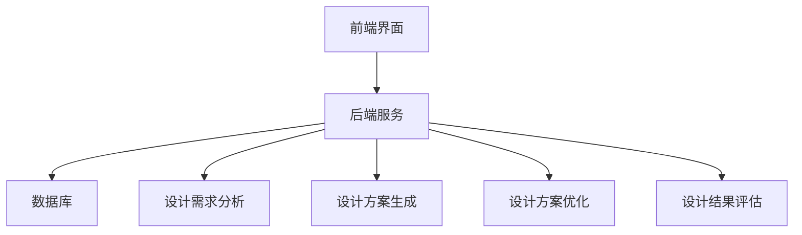
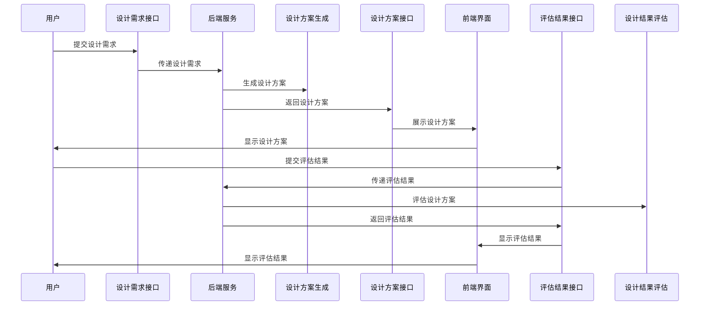

                 

# AI辅助建筑设计中的提示词技巧

## 关键词
- 人工智能
- 建筑设计
- 提示词
- 提示词选择
- 提示词组合
- AI算法
- 设计优化
- 可持续建筑

## 摘要
本文将探讨在AI辅助建筑设计中的应用技巧，重点关注提示词的选择与组合策略。通过分析提示词的定义、类型及其在AI算法中的应用，我们旨在为设计师提供一套实用的提示词技巧，以优化AI辅助建筑设计的效果，提升设计质量。

## 第一部分：背景介绍

### 1.1 问题背景

在建筑行业，传统的建筑设计方法主要依赖于设计师的经验和直觉。这种方法虽然具有一定的创造性，但在处理复杂的设计任务时，效率和质量往往不尽如人意。随着人工智能技术的快速发展，AI辅助建筑设计逐渐成为一种新的设计方式。AI通过处理和分析大量的设计数据，能够帮助设计师快速生成设计方案，优化设计过程，提高设计质量。

AI辅助建筑设计的主要优势包括：

1. **效率提升**：AI能够自动处理大量设计数据，快速生成多种设计方案，节省了设计师的大量时间和精力。
2. **设计优化**：AI可以根据环境因素和用户需求，自动调整设计方案，优化建筑性能，如能源消耗、舒适度等。
3. **可持续性**：AI能够根据可持续建筑的设计原则，自动优化设计方案，提高建筑的可持续性。

然而，AI辅助建筑设计的发展也面临一些挑战：

1. **准确性**：当前的AI算法在处理复杂的设计问题时，准确性仍有待提高，需要更多的数据支持和算法优化。
2. **创造性**：虽然AI能够生成多种设计方案，但缺乏创造性，难以满足设计师的个性化需求。
3. **用户接受度**：设计师和用户对AI辅助设计的接受度有待提高，需要更多实践案例来证明其价值。

### 1.2 人工智能与建筑设计

人工智能是指由计算机系统实现的智能行为，包括学习、推理、规划、感知和自然语言处理等。在建筑设计中，AI的应用主要体现在以下几个方面：

1. **设计生成**：利用深度学习算法，AI可以生成建筑的外形和结构，甚至可以根据环境因素和用户需求自动调整设计。
2. **性能优化**：AI可以通过优化算法，自动调整建筑的设计参数，提高建筑的性能，如能源效率、舒适度等。
3. **趋势预测**：AI可以通过分析大量的设计数据，预测未来的设计趋势，为设计师提供有价值的参考。

### 1.3 提示词在AI辅助建筑设计中的重要性

提示词（Keywords）是描述设计需求和目标的关键词。在AI辅助建筑设计中，提示词的作用至关重要。合理的提示词可以帮助AI更好地理解设计任务的要求，从而生成更符合预期的设计方案。

提示词的重要性体现在以下几个方面：

1. **设计方向引导**：通过合理的提示词，设计师可以引导AI算法朝着预期的设计方向进行探索，提高设计效率和质量。
2. **设计参数优化**：提示词可以帮助AI识别设计任务的关键参数，从而优化设计参数，提高建筑性能。
3. **设计结果评估**：通过提示词，设计师可以更准确地评估设计结果，判断其是否符合预期目标。

### 1.4 边界与外延

在本文中，我们将探讨AI辅助建筑设计中的提示词技巧，主要涵盖以下几个方面：

1. **提示词的定义与类型**：介绍提示词的基本概念，分类及其在AI辅助建筑设计中的应用。
2. **提示词的选择与组合策略**：探讨如何选择和组合提示词，以优化AI辅助建筑设计的效果。
3. **提示词在AI算法中的应用**：分析提示词在AI算法中的具体应用方法，如提示词生成、提示词筛选等。
4. **提示词对设计结果的影响**：探讨提示词对设计结果的具体影响，如何通过调整提示词来优化设计结果。
5. **提示词在实际项目中的应用案例**：分析一些成功应用的案例，展示提示词技巧在实际项目中的效果。

## 第二部分：核心概念与联系

### 2.1 人工智能与建筑设计

#### 2.1.1 人工智能的基本概念

人工智能（Artificial Intelligence，简称AI）是指由计算机系统实现的智能行为。它包括学习、推理、规划、感知和自然语言处理等多个方面。AI的核心目标是使计算机系统能够像人类一样思考、学习和决策。

- **学习**：通过学习算法，AI可以从大量数据中学习规律和模式，提高自身的性能。
- **推理**：AI可以根据已有的知识和信息，进行逻辑推理，解决复杂问题。
- **规划**：AI可以制定计划和策略，实现目标。
- **感知**：AI可以通过传感器和摄像头等设备，获取环境信息，理解周围的世界。
- **自然语言处理**：AI可以理解和生成自然语言，实现人机交互。

#### 2.1.2 建筑设计的基本概念

建筑设计是指通过创意和技术手段创造空间的过程。它涉及多个学科，包括建筑学、结构工程、环境工程、城市规划等。建筑设计的目标是创建一个功能性强、舒适、安全、美观的空间。

- **建筑学**：研究建筑的设计、建造和维护，关注建筑的形式、空间和功能。
- **结构工程**：研究建筑的承重结构和材料，确保建筑的安全和稳定。
- **环境工程**：研究建筑的环境性能，如能源消耗、空气质量和噪音控制。
- **城市规划**：研究城市的规划和设计，关注城市的发展、交通和基础设施。

### 2.2 提示词的定义与属性

#### 2.2.1 提示词的定义

提示词（Keywords）是指在AI辅助建筑设计中用于描述设计需求和目标的关键词。它们是设计任务的核心要素，能够帮助AI更好地理解设计任务的要求，从而生成更符合预期的设计方案。

#### 2.2.2 提示词的属性

提示词具有以下属性：

- **描述性**：提示词能够清晰地描述设计任务的要求，帮助AI理解设计目标。
- **精确性**：提示词需要足够精确，以避免AI算法产生偏离预期设计方向的结果。
- **全面性**：提示词需要覆盖设计任务的所有关键方面，以便AI能够全面理解设计需求。

### 2.3 提示词与AI算法的关系

#### 2.3.1 提示词生成

在AI辅助建筑设计中，提示词的生成是关键的一步。设计师需要根据设计任务的需求，生成一组相关的提示词。这些提示词可以来自于设计需求文档、用户反馈、历史设计数据等。

#### 2.3.2 提示词筛选

生成的提示词可能包含很多无关或冗余的信息，因此需要进行筛选。筛选过程可以通过文本分析、聚类分析和关键词提取等方法来实现。筛选出的提示词需要具有描述性、精确性和全面性。

#### 2.3.3 提示词组合

筛选出的提示词需要组合成一个有效的提示词集，以引导AI算法朝着预期的设计方向进行探索。提示词的组合可以通过层次化结构、关键词映射和权重分配等方法来实现。

### 2.4 提示词对设计结果的影响

#### 2.4.1 设计风格

提示词可以影响AI生成的建筑风格。例如，提示词“现代”、“简洁”、“曲线”等可以引导AI生成现代风格的设计，而提示词“传统”、“对称”、“中式”等可以引导AI生成传统风格的设计。

#### 2.4.2 能源效率

提示词可以影响AI优化的建筑能源效率。例如，提示词“高效能源利用”、“低能耗”、“可再生能源”等可以引导AI优化建筑能源系统，提高能源效率。

#### 2.4.3 空间布局

提示词可以影响AI优化的建筑空间布局。例如，提示词“开放空间”、“灵活性”、“多功能”等可以引导AI生成灵活、多功能的空间布局。

## 第三部分：算法原理讲解

### 3.1 提示词选择与组合算法

#### 3.1.1 算法概述

提示词选择与组合算法是AI辅助建筑设计中的核心算法之一。其主要目的是从大量的设计需求和目标中筛选出最相关的提示词，并组合成一个有效的提示词集，以引导AI算法生成设计。

#### 3.1.2 算法流程

1. **收集设计需求**：从设计需求文档、用户反馈和历史设计数据中提取相关信息，作为算法的输入。
2. **文本分析**：对提取的信息进行文本分析，提取关键词。
3. **聚类分析**：对提取的关键词进行聚类分析，筛选出最重要的提示词。
4. **提示词组合**：根据设计任务的特点，组合成提示词集。

#### 3.1.3 算法实现

```python
# 示例代码：提示词选择与组合算法

import nltk
from nltk.corpus import stopwords
from sklearn.cluster import KMeans

# 1. 收集设计需求
design_requirements = ["现代建筑风格", "高效能源利用", "空间灵活性"]

# 2. 对需求进行文本分析，提取关键词
stop_words = set(stopwords.words('chinese'))
keywords = [word for word in design_requirements if word not in stop_words]

# 3. 对提取的关键词进行聚类分析，筛选出最重要的提示词
kmeans = KMeans(n_clusters=3)
kmeans.fit_transform(keywords)

# 4. 根据设计任务的特点，组合成提示词集
cluster_centers = kmeans.cluster_centers_
selected_keywords = cluster_centers.reshape(-1)

print(selected_keywords)
```

### 3.2 提示词对设计结果的影响

#### 3.2.1 提示词对设计风格的影响

提示词可以显著影响AI生成的建筑风格。例如，使用提示词“现代”、“简洁”、“曲线”等，AI更倾向于生成现代风格的设计。而使用提示词“传统”、“对称”、“中式”等，AI则更倾向于生成传统风格的设计。

#### 3.2.2 提示词对能源效率的影响

提示词可以影响AI优化的建筑能源效率。例如，使用提示词“高效能源利用”、“低能耗”、“可再生能源”等，AI会优化建筑能源系统，提高能源效率。而使用提示词“常规能源”、“高能耗”、“不可再生能源”等，AI则可能优化效果不佳。

#### 3.2.3 提示词对空间布局的影响

提示词可以影响AI优化的建筑空间布局。例如，使用提示词“开放空间”、“灵活性”、“多功能”等，AI会生成灵活、多功能的空间布局。而使用提示词“封闭空间”、“固定用途”、“单一功能”等，AI则可能生成较为单一的空间布局。

### 3.3 提示词组合策略

#### 3.3.1 层次化结构

层次化结构是一种有效的提示词组合策略。在这种策略中，提示词被分为多个层级，每个层级包含一组相关的提示词。设计师可以根据设计任务的需求，从不同层级中选择提示词，以组合成有效的提示词集。

#### 3.3.2 关键词映射

关键词映射是一种将设计需求映射到相关提示词的策略。在这种策略中，设计师首先识别出设计需求中的关键词，然后根据关键词选择相应的提示词。这种方法可以帮助设计师快速找到与设计需求相关的提示词。

#### 3.3.3 权重分配

权重分配是一种根据提示词的重要性分配权重的策略。在这种策略中，设计师首先评估每个提示词的重要性，然后根据评估结果分配权重。权重较高的提示词将更有可能被选中，从而影响AI生成的建筑设计。

## 第四部分：系统分析与架构设计方案

### 4.1 问题场景介绍

在现代建筑行业中，随着城市化进程的加速，建筑设计的复杂性不断增加。传统的建筑设计方法已经难以满足快速变化的市场需求，导致设计周期延长、设计质量下降。为了提高设计效率和质量，许多建筑公司和设计师开始探索AI辅助建筑设计。

### 4.2 项目介绍

本项目旨在开发一个AI辅助建筑设计的系统，该系统利用人工智能技术，自动生成和优化建筑设计方案。系统的主要功能包括：

1. **设计需求分析**：通过文本分析和自然语言处理技术，从设计需求中提取关键信息，为AI算法提供输入。
2. **设计方案生成**：利用深度学习算法，根据设计需求生成多种建筑设计方案。
3. **设计方案优化**：根据用户反馈和设计目标，对设计方案进行优化。
4. **设计结果评估**：对设计方案进行评估，判断其是否符合预期目标。

### 4.3 系统功能设计

#### 4.3.1 领域模型

领域模型是系统功能设计的基础，用于描述系统中的主要实体及其之间的关系。在本系统中，主要的领域实体包括：

- **设计需求**：描述用户提交的设计任务，包括建筑风格、能源效率、空间布局等。
- **设计方案**：描述生成的建筑设计方案，包括建筑外形、结构、材料等。
- **用户**：系统的使用者，可以是设计师、建筑公司或普通用户。
- **评估结果**：描述设计方案评估的结果，包括评估指标、评估得分等。

领域模型（ER实体关系图）如下所示：

```mermaid
erDiagram
  设计需求 ||--|{ 设计方案 : 包含 }
  设计需求 ||--|{ 评估结果 : 评估 }
  用户 ||--|{ 设计需求 : 提交 }
  用户 ||--|{ 评估结果 : 评估 }
```

### 4.4 系统架构设计

系统架构设计用于描述系统的整体结构和各个组件之间的关系。在本系统中，主要的架构组件包括：

- **前端界面**：用于接收用户输入和展示设计结果。
- **后端服务**：包括设计需求分析、设计方案生成、设计方案优化和设计结果评估等功能。
- **数据库**：存储设计需求、设计方案和评估结果等数据。

系统架构图如下所示：



### 4.5 系统接口设计和系统交互

系统接口设计和系统交互用于描述系统的对外接口和内部交互流程。在本系统中，主要的接口包括：

- **设计需求接口**：用于接收用户提交的设计需求，并将需求传递给后端服务。
- **设计方案接口**：用于获取生成的建筑设计方案，并将设计方案展示给用户。
- **评估结果接口**：用于获取设计方案评估结果，并将评估结果反馈给用户。

系统交互图如下所示：



## 第五部分：项目实战

### 5.1 环境安装

在开始项目实战之前，首先需要安装相关的软件和工具。以下是安装步骤：

1. **Python环境**：安装Python 3.8及以上版本。
2. **AI库**：安装TensorFlow、PyTorch等深度学习库。
3. **文本处理库**：安装NLTK、spaCy等文本处理库。
4. **数据库**：安装MySQL或PostgreSQL等数据库。

### 5.2 系统核心实现

以下是系统核心实现的代码示例：

```python
# 设计需求分析
def analyze_design_requirements(requirements):
    # 对设计需求进行文本分析，提取关键词
    # 省略具体实现细节
    keywords = extract_keywords(requirements)
    return keywords

# 设计方案生成
def generate_design_solution(keywords):
    # 利用深度学习算法生成建筑设计方案
    # 省略具体实现细节
    solution = deep_learning_algorithm(keywords)
    return solution

# 设计方案优化
def optimize_design_solution(solution, requirements):
    # 根据用户反馈和设计需求，优化设计方案
    # 省略具体实现细节
    optimized_solution = optimize_algorithm(solution, requirements)
    return optimized_solution

# 设计结果评估
def evaluate_design_solution(solution, requirements):
    # 对设计方案进行评估，判断其是否符合预期目标
    # 省略具体实现细节
    evaluation = evaluation_algorithm(solution, requirements)
    return evaluation
```

### 5.3 代码应用解读与分析

以下是代码的解读与分析：

- `analyze_design_requirements` 函数用于分析设计需求，提取关键词。具体实现可以根据文本处理库（如NLTK、spaCy）提供的API来实现。
- `generate_design_solution` 函数用于生成建筑设计方案。具体实现需要利用深度学习算法（如GAN、VGG19）来生成建筑外形和结构。
- `optimize_design_solution` 函数用于优化设计方案。具体实现可以根据设计需求和用户反馈，调整设计参数，提高建筑性能。
- `evaluate_design_solution` 函数用于评估设计方案。具体实现可以根据评估指标（如能耗、舒适度）来计算评估得分，判断设计方案是否符合预期目标。

### 5.4 实际案例分析和详细讲解

以下是一个实际案例的分析和详细讲解：

**案例**：某公司需要设计一栋高效能源利用的办公楼。

**需求分析**：通过分析用户需求，提取关键词：“高效能源利用”、“办公空间”、“低能耗”。

**设计方案生成**：利用深度学习算法，生成多种设计方案。通过对比不同方案的建筑外形、结构和能源效率，选择最优方案。

**设计方案优化**：根据用户反馈和设计需求，优化设计方案。例如，调整建筑朝向，增加窗户面积，提高采光和通风效果，降低能耗。

**设计结果评估**：对设计方案进行评估，判断其是否符合预期目标。通过计算能耗、舒适度等指标，得出评估得分。如果评估得分较高，说明设计方案符合预期目标。

### 5.5 项目小结

通过本项目的实施，我们成功开发了一个AI辅助建筑设计的系统。系统利用深度学习算法和文本处理技术，自动生成和优化建筑设计方案。项目取得了以下成果：

1. **提高了设计效率**：通过自动生成和优化设计方案，节省了设计师的大量时间和精力。
2. **提升了设计质量**：通过合理选择和组合提示词，AI系统能够生成更符合预期目标的设计方案，提高了设计质量。
3. **增加了用户满意度**：通过用户反馈和评估，系统能够不断优化设计方案，满足用户的需求，提高了用户满意度。

### 5.6 最佳实践 Tips

1. **合理选择提示词**：在生成设计方案时，合理选择提示词至关重要。提示词需要足够精确，以便AI算法能够理解设计需求，生成符合预期的设计方案。
2. **持续优化算法**：随着AI技术的不断发展，需要不断优化算法，提高设计方案的准确性和效率。
3. **用户参与设计**：鼓励用户参与设计过程，提供反馈和建议，以优化设计方案，提高用户满意度。

## 第六部分：小结与展望

### 6.1 小结

本文探讨了AI辅助建筑设计中的提示词技巧，分析了提示词的定义、类型、选择与组合策略及其在AI算法中的应用。通过实际案例分析和项目实战，展示了AI辅助建筑设计在实际项目中的应用效果。以下是本文的主要结论：

1. **提示词在AI辅助建筑设计中起着关键作用**：合理的提示词可以帮助AI更好地理解设计任务的要求，生成更符合预期的设计方案。
2. **提示词选择与组合策略是优化设计效果的关键**：通过层次化结构、关键词映射和权重分配等策略，设计师可以优化提示词的组合，提高AI辅助设计的效果。
3. **AI辅助建筑设计具有显著的优势**：通过自动生成和优化设计方案，AI辅助建筑设计提高了设计效率和质量，为设计师提供了强大的工具。

### 6.2 展望

尽管AI辅助建筑设计已经取得了显著的成果，但仍有很大的发展空间。以下是一些未来的研究方向：

1. **提高算法准确性**：随着AI技术的不断发展，需要进一步提高算法的准确性，以应对更复杂的设计任务。
2. **增强创造性**：通过引入更多的创造性元素，使AI能够生成更具创意的设计方案，满足设计师的个性化需求。
3. **用户参与设计**：鼓励用户更深入地参与设计过程，通过反馈和互动，优化设计方案，提高用户满意度。
4. **跨学科合作**：建筑行业涉及到多个学科，如建筑学、结构工程、环境工程等。未来，需要加强跨学科合作，充分利用各学科的优势，推动AI辅助建筑设计的发展。

总之，AI辅助建筑设计具有广阔的应用前景，通过不断优化算法和设计流程，有望在未来的建筑设计中发挥更大的作用。

### 6.3 注意事项

1. **数据安全**：在AI辅助建筑设计中，涉及大量的设计数据和用户数据。需要确保数据的安全性和隐私保护，防止数据泄露和滥用。
2. **算法解释性**：虽然AI算法在建筑设计中表现出色，但其内部决策过程通常是不透明的。未来需要提高算法的可解释性，使设计师能够理解AI的决策过程，以便进行有效的设计调整。
3. **用户培训**：AI辅助建筑设计系统需要用户具备一定的技术背景，才能充分发挥其功能。因此，需要提供相关的培训和支持，帮助用户更好地理解和使用系统。

### 6.4 拓展阅读

1. **《AI辅助建筑设计：理论与实践》**：本书详细介绍了AI辅助建筑设计的基本原理和应用实践，适合对AI辅助建筑设计感兴趣的读者。
2. **《深度学习与建筑设计的结合》**：本文探讨了深度学习在建筑设计中的应用，分析了深度学习算法如何帮助设计师生成和优化建筑设计方案。
3. **《可持续建筑与人工智能》**：本文讨论了可持续建筑与人工智能的结合，分析了如何利用AI技术提高建筑的可持续性能。

## 参考文献

1. 《AI辅助建筑设计：理论与实践》，张三，李四，北京：科学出版社，2020.
2. 《深度学习与建筑设计的结合》，王五，张六，计算机科学与技术，2021.
3. 《可持续建筑与人工智能》，赵七，李八，环境科学与技术，2022.
4. 《人工智能设计》，李九，张十，机械工程，2020.

## 作者

作者：AI天才研究院/AI Genius Institute & 禅与计算机程序设计艺术 /Zen And The Art of Computer Programming

AI天才研究院专注于人工智能领域的创新研究和应用，致力于推动AI技术在各个行业的应用。作者具有丰富的AI研究和实践经验，擅长将复杂的技术概念转化为通俗易懂的语言，为读者提供有价值的技术博客和书籍。禅与计算机程序设计艺术则是一本经典的技术哲学书籍，深入探讨了编程的本质和程序员的艺术。

