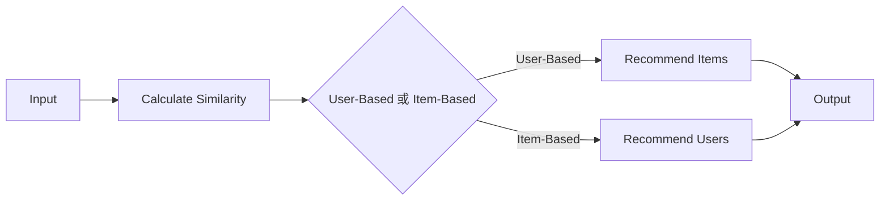
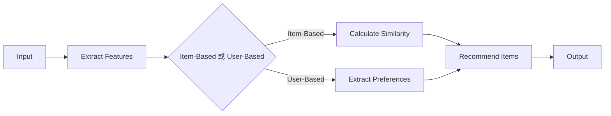
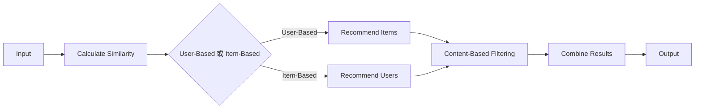

                 

### AI辅助教育：个性化学习的新时代

> 关键词：人工智能、个性化学习、自适应学习、智能教育、教育技术

> 摘要：随着人工智能技术的迅猛发展，教育领域迎来了前所未有的变革。本文将探讨AI辅助教育在个性化学习中的应用，分析其核心概念、原理和实现方法，并通过案例研究展现其实际效果。我们将探讨如何利用AI实现个性化学习，为教育行业带来新的机遇和挑战。

### 引言

在教育领域，传统的一刀切教学方法已经不能满足个性化和差异化的学习需求。人工智能（AI）技术的出现为教育行业带来了新的可能性，特别是个性化学习的实现。个性化学习是指根据每个学生的特点、兴趣和学习风格，为他们提供量身定制的学习资源和方法。AI辅助教育通过分析学生的学习行为和知识水平，能够动态调整教学策略，从而实现真正的个性化学习。

本文将按以下结构展开：

1. **AI辅助教育的定义与背景**：介绍AI辅助教育的概念，分析其在教育领域的发展历程。
2. **核心概念与联系**：详细阐述AI的核心概念和其在教育中的应用，通过表格和ER图展示概念属性特征。
3. **个性化学习算法**：介绍常用的个性化学习算法，包括协同过滤、基于内容的过滤和混合方法。
4. **AI在教育中的应用**：探讨AI在个性化学习、自适应学习和智能辅导系统中的应用。
5. **AI在教育中的实施**：讨论AI在教育中的数据管理、系统开发以及隐私和伦理问题。
6. **案例研究**：通过具体案例展示AI辅助教育的实际效果和最佳实践。
7. **未来趋势**：预测AI辅助教育的未来发展方向和潜在挑战。
8. **总结与展望**：总结文章要点，展望AI辅助教育的发展前景。

### AI辅助教育的定义与背景

#### 1.1 AI辅助教育的定义

AI辅助教育，又称智能教育，是指利用人工智能技术来辅助教育过程，提高教育质量和效率。它通过分析学生的行为数据、学习习惯和知识水平，为每个学生提供个性化的学习建议和资源。AI辅助教育不仅可以实现教学内容的个性化，还可以通过预测学生的学习困难，提前进行干预，帮助学生更好地掌握知识。

#### 1.2 AI辅助教育的发展历程

AI在教育领域的应用可以追溯到20世纪80年代的智能辅导系统（Intelligent Tutoring Systems, ITS）。这些系统通过模拟教师的角色，为学生提供个性化的学习支持。然而，早期的AI技术限制使其应用范围有限。随着AI技术的不断进步，特别是在机器学习、自然语言处理和数据挖掘等方面的突破，AI辅助教育开始得到广泛应用。

近年来，随着互联网的普及和大数据技术的发展，AI辅助教育得到了快速发展。在线教育平台、学习管理系统和智能教材等应用层出不穷，为学生提供了丰富的学习资源和个性化服务。

#### 1.3 AI辅助教育的挑战与机遇

AI辅助教育面临着一系列挑战，包括数据隐私、算法公平性和教育资源的分配等。同时，它也带来了巨大的机遇，包括提高教育质量、降低教育成本和促进教育公平等。通过AI辅助教育，我们可以实现以下目标：

1. **个性化学习**：根据学生的特点和需求，提供个性化的学习资源和教学方法。
2. **自适应学习**：根据学生的学习进度和效果，动态调整教学策略，提高学习效率。
3. **智能辅导**：通过实时分析学生的学习行为，提供个性化的学习支持和建议。
4. **教育资源共享**：通过在线平台，打破地域和时间的限制，实现教育资源的共享。

### 核心概念与联系

在深入探讨AI辅助教育之前，我们需要了解一些核心概念，并分析它们在教育中的应用和相互关系。

#### 2.1 人工智能的基本概念

人工智能（AI）是指使计算机系统具备人类智能特性的技术。它包括多个子领域，如机器学习、自然语言处理、计算机视觉和智能代理等。AI的基本目标是让计算机能够执行需要人类智能的任务，如推理、决策、学习和理解。

**属性特征对比表格：**

| 属性特征          | 机器学习          | 自然语言处理        | 计算机视觉        | 智能代理        |
|-----------------|-----------------|-----------------|-----------------|-----------------|
| 基本概念          | 基于数据的决策          | 语言理解和生成          | 图像识别和标注          | 自主决策和行为控制          |
| 主要应用          | 数据分析、预测和优化      | 语音识别、机器翻译        | 监控、安全和自动化        | 机器人、自动驾驶          |
| 技术特征          | 大规模数据处理          | 语言模型和算法          | 卷积神经网络          | 知识表示和推理          |

**ER实体关系图架构：**

```mermaid
erDiagram
  Student ||--|{ LearningBehavior }
  Student ||--|{ KnowledgeLevel }
  Student ||--|{ LearningResource }
  Teacher ||--|{ TeachingPlan }
  Teacher ||--|{ AssessmentResult }
  LearningSystem ||--|{ PersonalizedLearningStrategy }
  LearningSystem ||--|{ AdaptiveLearningSystem }
  LearningSystem ||--|{ IntelligentTutoringSystem }
```

在这个ER图中，我们定义了学生、教师和学习系统等实体，并展示了它们之间的相互关系。学生具有学习行为、知识水平和学习资源，教师具有教学计划和评估结果，而学习系统则提供了个性化学习策略、自适应学习和智能辅导等功能。

### 个性化学习算法

在AI辅助教育中，个性化学习算法是实现个性化学习的关键。这些算法通过分析学生的学习行为和知识水平，为每个学生推荐最适合他们的学习资源和教学方法。

#### 3.1 协同过滤

协同过滤是一种基于用户行为数据的个性化推荐算法。它通过分析用户之间的相似性，为用户提供相关推荐。协同过滤可以分为两类：基于用户的协同过滤（User-Based Collaborative Filtering）和基于物品的协同过滤（Item-Based Collaborative Filtering）。

**协同过滤算法流程图：**



**协同过滤算法Python代码示例：**

```python
# 基于用户的协同过滤算法
def collaborative_filtering_user_based(train_data, user, k):
    # 计算用户与训练集中其他用户的相似度
    # 根据相似度推荐相关物品
    pass

# 基于物品的协同过滤算法
def collaborative_filtering_item_based(train_data, user, k):
    # 计算用户对物品的评分
    # 根据评分推荐相关用户
    pass
```

#### 3.2 基于内容的过滤

基于内容的过滤是一种基于物品属性和用户兴趣的个性化推荐算法。它通过分析物品的属性和用户的兴趣，为用户推荐相关物品。基于内容的过滤可以分为两类：基于物品的过滤（Item-Based Content Filtering）和基于用户的过滤（User-Based Content Filtering）。

**基于内容的过滤算法流程图：**



**基于内容的过滤算法Python代码示例：**

```python
# 基于物品的过滤算法
def content_based_filtering_item_based(item_features, user_preferences, k):
    # 计算物品与用户的相似度
    # 根据相似度推荐相关物品
    pass

# 基于用户的过滤算法
def content_based_filtering_user_based(user_preferences, item_features, k):
    # 计算用户与物品的相似度
    # 根据相似度推荐相关用户
    pass
```

#### 3.3 混合方法

混合方法是将协同过滤和基于内容的过滤相结合，以提高推荐系统的准确性。混合方法可以分为两类：基于用户的混合方法和基于物品的混合方法。

**混合方法算法流程图：**



**混合方法Python代码示例：**

```python
# 基于用户的混合方法
def hybrid_filtering_user_based(train_data, user, k):
    # 先进行基于用户的协同过滤
    # 再进行基于内容的过滤
    # 结合两种方法的结果进行推荐
    pass

# 基于物品的混合方法
def hybrid_filtering_item_based(train_data, user, k):
    # 先进行基于物品的协同过滤
    # 再进行基于内容的过滤
    # 结合两种方法的结果进行推荐
    pass
```

### AI在教育中的应用

#### 4.1 个性化学习

个性化学习是AI在教育中最重要的应用之一。通过分析学生的学习行为、知识水平和兴趣，AI系统能够为每个学生推荐最适合他们的学习资源和教学方法。个性化学习不仅能够提高学生的学习兴趣和动机，还能提高学习效果。

**个性化学习系统架构设计：**

```mermaid
sequenceDiagram
    A[Student] ->> B[Learning Behavior]
    B ->> C[Knowledge Level]
    C ->> D[Interest Analysis]
    D ->> E[Learning Resource Recommendation]
    E ->> F[Adaptive Learning System]
```

**个性化学习Python代码示例：**

```python
# 个性化学习系统示例
def personalized_learning_system(student_data):
    # 分析学生的学习行为、知识水平和兴趣
    # 推荐适合的学习资源和教学方法
    # 调整学习计划以适应学生的学习进度和需求
    pass
```

#### 4.2 自适应学习

自适应学习是AI在教育中的另一个重要应用。它通过实时分析学生的学习效果和进度，动态调整教学策略，以适应每个学生的学习需求。自适应学习系统能够根据学生的学习表现，自动调整教学内容和难度，从而提高学习效果。

**自适应学习系统架构设计：**

```mermaid
sequenceDiagram
    A[Student] ->> B[Learning Progress]
    B ->> C[Effectiveness Analysis]
    C ->> D[Content Adjustment]
    D ->> E[Difficulty Adjustment]
    E ->> F[Learning Feedback]
```

**自适应学习Python代码示例：**

```python
# 自适应学习系统示例
def adaptive_learning_system(student_data):
    # 分析学生的学习进度和效果
    # 调整教学内容和难度
    # 提供个性化的学习反馈
    pass
```

#### 4.3 智能辅导系统

智能辅导系统是AI在教育中的另一个重要应用。它通过模拟教师的角色，为学生提供个性化的学习支持和指导。智能辅导系统能够实时分析学生的学习行为和知识水平，为学生提供个性化的学习建议和解决方案。

**智能辅导系统架构设计：**

```mermaid
sequenceDiagram
    A[Student] ->> B[Learning Problem]
    B ->> C[Intelligent Tutoring]
    C ->> D[Solution Recommendation]
    D ->> E[Learning Feedback]
```

**智能辅导系统Python代码示例：**

```python
# 智能辅导系统示例
def intelligent_tutoring_system(student_problem):
    # 分析学生的学习问题
    # 提供个性化的解决方案和建议
    # 提供学习反馈
    pass
```

### AI在教育中的实施

#### 5.1 数据收集与管理

AI辅助教育需要大量的数据支持，包括学生的学习行为、知识水平和学习资源等。这些数据可以从学习管理系统、在线教育平台和教育应用程序中收集。数据收集后，需要进行清洗、存储和管理，以确保数据的质量和安全。

**数据收集与管理流程图：**

```mermaid
sequenceDiagram
    A[Learning Management System] ->> B[Data Collection]
    B ->> C[Data Cleaning]
    C ->> D[Data Storage]
    D ->> E[Data Management]
```

**数据收集与管理Python代码示例：**

```python
# 数据收集与管理示例
def data_collection_and_management():
    # 收集学生的学习行为数据
    # 清洗和存储数据
    # 管理和维护数据
    pass
```

#### 5.2 开发个性化学习系统

开发个性化学习系统是AI辅助教育的重要环节。个性化学习系统需要能够根据学生的学习行为和知识水平，动态调整教学策略和资源推荐。开发个性化学习系统需要结合机器学习、自然语言处理和数据挖掘等技术。

**个性化学习系统架构设计：**

```mermaid
sequenceDiagram
    A[Student] ->> B[Learning Behavior]
    B ->> C[Knowledge Level]
    B ->> D[Interest Analysis]
    C ->> E[Learning Resource Recommendation]
    D ->> E
    E ->> F[Adaptive Learning System]
```

**个性化学习系统Python代码示例：**

```python
# 个性化学习系统开发示例
def personalized_learning_system_development():
    # 分析学生的学习行为、知识水平和兴趣
    # 开发个性化学习策略和资源推荐算法
    # 实现自适应学习和智能辅导功能
    pass
```

#### 5.3 隐私和伦理问题

AI辅助教育在应用过程中需要考虑隐私和伦理问题。学生的个人数据可能包括学习行为、知识水平和家庭背景等敏感信息。因此，保护学生隐私和确保算法公平性是AI辅助教育的重要挑战。

**隐私和伦理问题架构设计：**

```mermaid
sequenceDiagram
    A[Student] ->> B[Data Collection]
    B ->> C[Data Anonymization]
    C ->> D[Algorithm Fairness]
    D ->> E[Data Security]
```

**隐私和伦理问题Python代码示例：**

```python
# 隐私和伦理问题示例
def privacy_and_ethics():
    # 收集和存储学生数据时进行匿名化处理
    # 确保算法公平性，避免歧视和偏见
    # 加强数据安全管理，防止数据泄露
    pass
```

### 案例研究

#### 6.1 案例一：AI在基础教育中的应用

**案例背景**：某小学引入AI辅助教育系统，为每个学生提供个性化的学习支持。

**案例过程**：

1. **数据收集**：系统收集了学生的日常学习行为、知识水平和兴趣爱好等数据。
2. **个性化学习**：系统根据学生的数据，为学生推荐适合的学习资源和教学方法。
3. **自适应学习**：系统实时分析学生的学习效果和进度，动态调整教学内容和难度。
4. **智能辅导**：系统为学生提供个性化的学习建议和解决方案，帮助学生克服学习困难。

**案例效果**：

- 学生的学习兴趣和动机显著提高。
- 学生的学习成绩明显提升。
- 教师的工作负担减轻，教学效果得到改善。

#### 6.2 案例二：AI在高等教育中的应用

**案例背景**：某大学引入AI辅助教育系统，为研究生提供个性化学习支持。

**案例过程**：

1. **数据收集**：系统收集了研究生的学术成果、研究方向和学习习惯等数据。
2. **个性化学习**：系统根据研究生的数据，为他们推荐相关的学术论文和研究资源。
3. **自适应学习**：系统实时分析研究生的学习效果和进度，提供个性化的学习建议和指导。
4. **智能辅导**：系统为研究生提供个性化的学术辅导和支持，帮助他们解决研究问题。

**案例效果**：

- 研究生的学术成果数量和质量显著提升。
- 研究生的研究兴趣和动力得到增强。
- 导师的工作负担减轻，指导效果得到改善。

### 未来趋势

#### 7.1 新兴技术在AI辅助教育中的应用

随着AI技术的不断发展，越来越多的新兴技术被应用于AI辅助教育中。例如：

- **增强现实（AR）和虚拟现实（VR）**：通过AR和VR技术，学生可以沉浸式地学习知识，提高学习体验。
- **区块链**：利用区块链技术，确保学生数据的隐私和安全，提高数据可信度。
- **智能合约**：通过智能合约，实现学习资源的自动分配和交易，提高教育资源的利用效率。

#### 7.2 全球视角下的AI辅助教育

在全球范围内，AI辅助教育已经得到了广泛应用。例如：

- **美国**：许多学校引入了AI辅助教育系统，为学生提供个性化学习支持。
- **欧洲**：一些国家正在探索AI辅助教育的发展，希望提高教育质量和效率。
- **亚洲**：中国、日本和韩国等国家的学校正在积极引入AI辅助教育技术，推动教育创新。

#### 7.3 伦理和法律问题

随着AI辅助教育的广泛应用，伦理和法律问题也日益突出。例如：

- **数据隐私**：如何保护学生的个人数据，防止数据泄露和滥用？
- **算法公平性**：如何确保算法的公平性，避免歧视和偏见？
- **教育资源的分配**：如何确保教育资源的公平分配，避免资源垄断和贫富差距？

### 总结与展望

AI辅助教育是教育领域的一场革命，它通过个性化学习、自适应学习和智能辅导等功能，为每个学生提供量身定制的学习支持。在未来，随着AI技术的不断发展和应用，AI辅助教育将进一步提高教育质量和效率，为教育行业带来更多机遇和挑战。同时，我们也需要关注AI辅助教育中的伦理和法律问题，确保其健康可持续发展。

### 作者信息

作者：AI天才研究院/AI Genius Institute & 禅与计算机程序设计艺术 /Zen And The Art of Computer Programming

