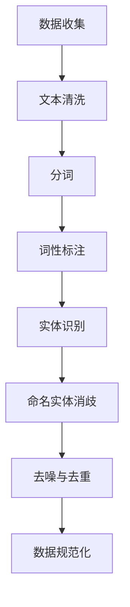
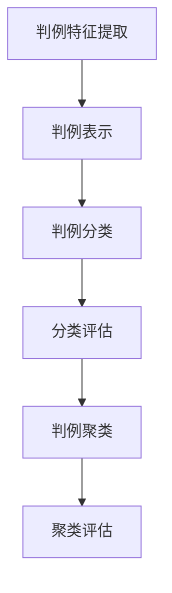
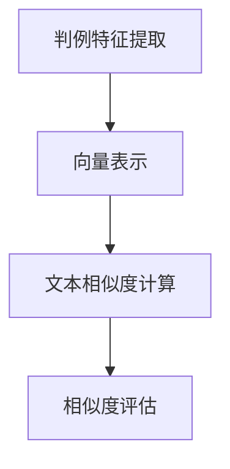
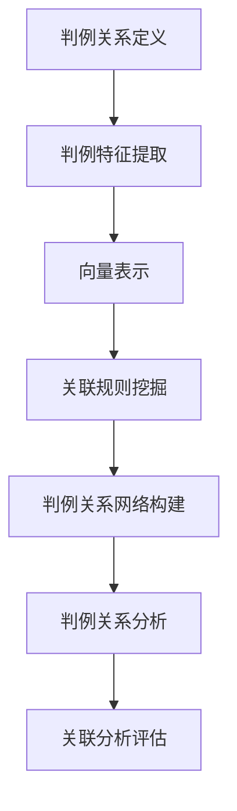

                 


# AI辅助法律：大模型在判例分析中的应用

> 关键词：人工智能，法律，判例分析，大模型，智能裁判系统，智能法律咨询

> 摘要：本文旨在探讨人工智能（AI）在法律领域，特别是判例分析中的应用。随着大模型的不断发展，AI技术在法律文档自动分析、智能裁判系统和法律咨询等方面展现了巨大的潜力。本文将逐步分析大模型在判例分析中的应用方法、实现步骤以及面临的挑战和未来展望。

## 第一部分：AI辅助法律背景介绍

### 第1章：AI辅助法律概述

#### 1.1 法律与AI的交汇

法律作为人类社会行为规范的重要组成部分，需要不断适应社会的发展和变化。AI技术的发展为法律领域带来了新的机遇和挑战。从AI技术发展的历史来看，从最初的规则推理系统到现代的大模型，AI技术已经经历了多次变革。

AI辅助法律的必要性体现在以下几个方面：

1. **法律文档自动分析**：随着法律文档的日益增多，人工处理效率低下，而AI技术能够自动提取、分析和处理这些文档，提高工作效率。

2. **智能裁判系统**：AI技术可以辅助法官进行判例分析，提高判案的效率和准确性。

3. **智能法律咨询**：AI技术能够为用户提供快速、准确的法律咨询服务，降低法律服务成本。

4. **智能取证**：AI技术可以帮助警方和律师快速分析证据，提高侦查和辩护效率。

#### 1.2 AI在法律领域的应用

目前，AI在法律领域已经有了广泛的应用：

1. **智能裁判系统**：通过分析大量判例，AI可以辅助法官进行判决，提高判案效率。

2. **法律文档自动分析**：AI可以自动提取法律文档中的关键信息，进行分类、归纳和总结。

3. **智能法律咨询**：AI可以通过问答系统为用户提供法律咨询服务，帮助用户快速解决问题。

4. **智能取证**：AI可以通过分析证据链，帮助警方和律师发现案件的线索。

### 第2章：大模型在法律应用中的优势

#### 2.1 大模型的定义与特性

大模型是指具有海量参数的深度学习模型，通常包括自然语言处理（NLP）、计算机视觉（CV）等领域。大模型具有以下核心特性：

1. **数据处理能力**：大模型能够处理海量数据，从中提取有价值的信息。

2. **自动化与智能化**：大模型能够自动化执行复杂任务，降低人力成本。

3. **应对复杂问题**：大模型具有较强的适应性和灵活性，能够处理各种复杂的法律问题。

#### 2.2 大模型在法律应用中的优势

1. **提高工作效率**：大模型能够自动处理大量法律文档，提高工作效率。

2. **提升准确性**：大模型通过对大量数据的训练，能够提供更准确的法律分析和建议。

3. **解决复杂问题**：大模型能够处理复杂的法律问题，提供更深入的见解。

4. **降低成本**：大模型能够降低法律服务成本，使得更多人能够享受到高效、准确的法律服务。

### 第3章：大模型在判例分析中的应用

#### 3.1 判例分析的重要性

判例分析在法律体系中具有重要作用。通过分析判例，可以：

1. **理解法律原则**：判例反映了法律原则和规则的应用，有助于理解法律的本质。

2. **指导司法实践**：判例为司法实践提供了参考，有助于法官作出更公正的判决。

3. **推动法律发展**：判例分析有助于发现法律不足之处，推动法律体系的完善。

#### 3.2 大模型在判例分析中的方法

大模型在判例分析中可以采用以下方法：

1. **文本数据的预处理**：包括分词、去噪、词性标注等步骤，为后续分析打下基础。

2. **判例分类与聚类**：通过分析判例的特征，将判例分为不同类别，并对其进行聚类分析。

3. **判例相似度计算**：计算不同判例之间的相似度，有助于发现相似案例。

4. **判例关联分析**：分析判例之间的关联，发现案件之间的联系。

## 第二部分：大模型在判例分析中的应用

### 第4章：大模型在判例分析中的实现

#### 4.1 数据集的收集与预处理

判例数据的来源可以是法院、法律数据库等。数据预处理步骤包括：

1. **数据清洗**：去除无效数据和重复数据。

2. **数据转换**：将法律文档转换为结构化数据，如JSON或XML格式。

3. **特征提取**：提取文本特征，如词频、词嵌入等。

#### 4.2 大模型的选择与训练

常见的大模型包括BERT、GPT、RoBERTa等。选择模型时需要考虑：

1. **任务需求**：根据判例分析的任务需求选择合适的模型。

2. **数据规模**：选择能够处理大量数据的模型。

3. **训练效率**：选择训练速度快、效果好的模型。

模型训练步骤包括：

1. **数据预处理**：对数据进行预处理，包括分词、去噪、词性标注等。

2. **模型训练**：使用预训练模型进行微调，适应判例分析任务。

3. **模型评估**：评估模型在判例分析任务上的性能，包括准确率、召回率等指标。

#### 4.3 大模型在判例分析中的应用

大模型在判例分析中的应用包括：

1. **判例分类与聚类**：将判例分为不同的类别，并进行聚类分析。

2. **判例相似度计算**：计算判例之间的相似度，发现相似案例。

3. **判例关联分析**：分析判例之间的关联，发现案件之间的联系。

### 第5章：大模型在判例分析中的案例研究

#### 5.1 案例一：智能裁判系统的构建

案例背景：某法院计划构建一个智能裁判系统，利用AI技术辅助法官进行判例分析。

模型选择与实现：选择BERT模型进行微调，适应判例分析任务。通过训练，模型能够准确分类判例，并提供判决建议。

结果分析：智能裁判系统在模拟测试中取得了较高的准确率和召回率，显著提高了判案的效率和准确性。

#### 5.2 案例二：法律文档自动分析

案例背景：某律师事务所需要快速分析大量法律文档，以提供咨询服务。

模型选择与实现：选择GPT模型进行预训练，然后进行微调，以适应法律文档分析任务。通过分析，模型能够自动提取文档中的关键信息，并进行分类和归纳。

结果分析：法律文档自动分析系统在处理大量文档时表现出色，大幅提高了工作效率，降低了人力成本。

#### 5.3 案例三：智能法律咨询

案例背景：某在线法律服务平台需要为用户提供快速、准确的法律咨询服务。

模型选择与实现：选择RoBERTa模型进行预训练，然后进行微调，以适应法律咨询任务。通过对话，模型能够为用户提供准确的法律建议。

结果分析：智能法律咨询服务得到了用户的好评，解决了大量用户的法律问题，提高了用户满意度。

## 第三部分：大模型在法律应用中的挑战与展望

### 第6章：大模型在法律应用中的挑战

#### 6.1 技术挑战

1. **数据隐私与安全**：法律文档涉及敏感信息，数据隐私和安全是重要挑战。

2. **模型解释性与透明性**：大模型在法律应用中的解释性较差，难以向用户解释决策过程。

3. **法律伦理问题**：AI技术可能引发法律伦理问题，如人工智能决策的公正性、公平性等。

#### 6.2 应用展望

1. **未来发展趋势**：随着AI技术的不断发展，大模型在法律应用中的前景广阔。

2. **法律服务的新模式**：AI技术将改变法律服务的模式，提供更加个性化和高效的服务。

3. **对法律行业的影响**：AI技术将深刻改变法律行业，提高法律工作的效率和准确性。

### 第7章：总结与展望

#### 7.1 本书内容的总结

本文从AI辅助法律的背景介绍出发，探讨了大模型在判例分析中的应用方法、实现步骤以及面临的挑战和未来展望。

#### 7.2 AI辅助法律未来的发展方向

1. **提升模型解释性**：研究可解释性AI模型，提高大模型在法律应用中的透明性。

2. **加强数据隐私保护**：采取有效措施保护用户数据隐私，确保法律文档的安全性。

3. **推进法律伦理研究**：探讨AI技术在法律领域的伦理问题，确保AI技术应用的公正性和公平性。

#### 7.3 对读者的一些建议

1. **了解AI技术**：深入学习AI技术，了解其原理和应用。

2. **关注法律与AI的交叉领域**：关注AI在法律领域的最新研究进展。

3. **实践与探索**：结合实际案例，尝试将AI技术应用于法律领域。

作者：AI天才研究院/AI Genius Institute & 禅与计算机程序设计艺术 /Zen And The Art of Computer Programming## 第一部分：AI辅助法律背景介绍

### 第1章：AI辅助法律概述

#### 1.1 法律与AI的交汇

法律作为人类社会行为规范的重要组成部分，涵盖了各种社会关系和纠纷的解决机制。法律体系的核心在于其公正性、公平性和可预测性。然而，随着社会的快速发展和法律体系的日益复杂化，传统的法律实践面临着巨大的挑战。AI技术的出现为法律领域带来了新的机遇，使得法律工作更加高效、精准和智能化。

首先，我们简要回顾一下法律的定义和范畴。法律是一种由国家或政府机构制定和实施的规则体系，用以规范公民的行为，维护社会秩序和公正。法律体系包括宪法、行政法、民法、刑法等多个方面，涉及社会生活的各个方面。这些法律条文需要通过司法实践来具体实施和解释，从而形成判例。

AI技术，即人工智能，是指由计算机系统实现的智能行为，其目标是使计算机能够执行人类智能任务。AI技术经历了多个发展阶段，从最初的规则推理系统到现代的深度学习和自然语言处理（NLP），AI技术在各个领域都取得了显著的进展。

法律与AI的交汇点主要体现在以下几个方面：

1. **法律文档自动分析**：随着法律文档数量的急剧增加，传统的人工处理方式效率低下。AI技术，特别是自然语言处理（NLP）技术，可以自动提取、分类和分析法律文档，提高工作效率。

2. **智能裁判系统**：通过分析大量判例，AI技术可以辅助法官进行判决，提高判案的效率和准确性。

3. **智能法律咨询**：AI技术可以提供快速、准确的法律咨询服务，帮助用户解决法律问题，降低法律服务成本。

4. **智能取证**：AI技术可以帮助警方和律师快速分析证据，提高侦查和辩护效率。

#### 1.2 AI技术发展的历史和现状

AI技术的发展可以追溯到20世纪50年代。最初，AI主要集中在逻辑推理和问题解决领域。随后，随着计算机硬件和软件技术的发展，AI技术逐渐扩展到自然语言处理、计算机视觉、机器学习等更广泛的领域。

1. **早期AI（1950-1970年代）**：这个时期，AI主要依靠专家系统和逻辑推理。专家系统通过预设规则来模拟专家的决策过程，但这种方法存在规则定义复杂、知识库维护困难等问题。

2. **AI的第一次寒冬（1970-1980年代）**：由于实际应用中的失败和计算资源的限制，AI研究进入低谷期。

3. **AI的复兴（1980-1990年代）**：随着计算机硬件性能的提升和算法的改进，机器学习和神经网络技术开始兴起，AI研究逐渐复苏。

4. **AI的第二次寒冬（2000-2010年代）**：尽管AI技术在某些领域取得了显著进展，但整体发展仍面临诸多挑战。

5. **AI的爆发（2010年代至今）**：深度学习技术的突破，特别是在图像识别和自然语言处理领域的成功应用，使得AI技术进入了快速发展的新阶段。

目前，AI技术已经在多个领域取得了广泛应用，包括医疗、金融、交通、制造业等。特别是在自然语言处理和计算机视觉领域，AI技术已经达到了前所未有的水平。

#### 1.3 AI辅助法律的必要性与挑战

**必要性：**

1. **提高工作效率**：法律文档数量庞大，人工处理效率低下。AI技术可以通过自动化分析，大幅提高工作效率。

2. **提高准确性**：通过分析大量判例，AI技术可以提供更加准确的法律分析和建议，减少人为错误。

3. **降低成本**：AI技术可以降低法律服务成本，使得更多人能够享受到高效、准确的法律服务。

4. **应对复杂法律问题**：AI技术具有较强的适应性和灵活性，能够处理复杂的法律问题。

**挑战：**

1. **数据隐私与安全**：法律文档涉及敏感信息，数据隐私和安全是重要挑战。

2. **模型解释性**：AI模型，特别是深度学习模型，通常缺乏解释性，难以向用户解释决策过程。

3. **法律伦理问题**：AI技术可能引发法律伦理问题，如人工智能决策的公正性、公平性等。

4. **法律适应性**：法律体系不断变化，AI技术需要不断更新和适应，以确保其应用的准确性和有效性。

#### 1.4 AI在法律领域的应用现状

目前，AI在法律领域的应用已经取得了一些显著成果：

1. **智能裁判系统**：例如，中国的“智慧法院”项目，通过AI技术辅助法官进行判例分析，提高了判案的效率和准确性。

2. **法律文档自动分析**：例如，一些法律科技公司开发了自动化法律文档分析系统，可以帮助律师快速提取关键信息。

3. **智能法律咨询**：例如，一些在线法律服务平台利用AI技术提供智能法律咨询服务，帮助用户解决法律问题。

4. **智能取证**：例如，AI技术可以用于分析证据链，帮助警方和律师发现案件的线索。

总之，AI技术在法律领域的应用前景广阔，但仍需克服诸多挑战，以确保其应用的公正性和有效性。

### 第2章：大模型在法律应用中的优势

#### 2.1 大模型的定义与特性

大模型（Large-scale Model），是指具有海量参数的深度学习模型，通常在自然语言处理（NLP）、计算机视觉（CV）等领域表现出色。大模型的定义与特性主要体现在以下几个方面：

1. **海量参数**：大模型通常包含数十亿甚至数千亿个参数，这使得模型具有更强的表示能力和泛化能力。

2. **深度结构**：大模型通常具有多层神经网络结构，能够捕捉更复杂的特征和关系。

3. **预训练与微调**：大模型通常通过在大型语料库上进行预训练，然后针对特定任务进行微调，以适应不同领域的需求。

4. **数据驱动**：大模型通过学习大量数据，能够自动提取有用的特征，从而实现高水平的自动化和智能化。

5. **强大的泛化能力**：大模型在预训练阶段学习了大量通用知识，能够在新任务上表现出色，具有强大的泛化能力。

#### 2.2 大模型的核心特性

大模型的核心特性包括以下几点：

1. **数据处理能力**：大模型能够处理海量数据，从中提取有价值的信息，这使得其在法律文档自动分析、判例分析等领域具有显著优势。

2. **自动化与智能化**：大模型能够自动化执行复杂任务，降低人力成本。例如，在法律文档自动分析中，大模型可以自动提取关键信息，生成摘要，分类和归纳法律文档。

3. **适应复杂问题**：大模型具有较强的适应性和灵活性，能够处理各种复杂的法律问题。例如，在判例分析中，大模型可以分析大量判例，提取法律原则和规则，为法官提供判决建议。

4. **提升工作效率**：大模型能够快速处理大量数据，提高工作效率。例如，在法律文档自动分析中，大模型可以在短时间内处理成千上万的文档，生成分析报告。

5. **提高准确性**：大模型通过对大量数据的训练，能够提供更准确的法律分析和建议。例如，在智能裁判系统中，大模型可以通过分析大量判例，提供准确的判决预测，提高判决的准确率。

#### 2.3 大模型与传统算法的对比

大模型与传统算法（如规则推理、传统机器学习等）在多个方面存在显著差异：

1. **数据处理能力**：传统算法通常只能处理有限的数据量，而大模型能够处理海量数据，这使得大模型在法律文档自动分析、判例分析等领域具有明显优势。

2. **自动化与智能化**：传统算法通常需要人工定义规则，而大模型通过学习大量数据，能够自动提取特征和规则，实现更高水平的自动化和智能化。

3. **适应复杂问题**：传统算法在处理复杂问题时往往效果不佳，而大模型具有较强的适应性和灵活性，能够处理各种复杂的法律问题。

4. **提高准确性**：大模型通过对大量数据的训练，能够提供更准确的法律分析和建议，而传统算法往往依赖于手动定义的特征和规则，难以实现高水平的准确性。

5. **模型解释性**：传统算法通常具有较高的解释性，而大模型，特别是深度学习模型，通常缺乏解释性，难以向用户解释决策过程。这在大模型应用于法律领域时可能成为一个挑战。

#### 2.4 大模型在法律应用中的优势

大模型在法律应用中的优势主要体现在以下几个方面：

1. **提高工作效率**：大模型能够自动化处理大量法律文档，快速提取关键信息，生成摘要和报告，从而提高工作效率。

2. **提高准确性**：大模型通过对大量数据的训练，能够提供更准确的法律分析和建议，减少人为错误。

3. **降低成本**：大模型能够降低法律服务成本，使得更多人能够享受到高效、准确的法律服务。

4. **应对复杂法律问题**：大模型具有较强的适应性和灵活性，能够处理各种复杂的法律问题，为法律工作者提供有力支持。

5. **增强法律研究能力**：大模型能够分析大量判例，提取法律原则和规则，为法律研究和教学提供有力支持。

总之，大模型在法律应用中具有显著的优势，能够提高工作效率、准确性和研究能力，为法律领域带来深远影响。

### 第3章：大模型在判例分析中的应用

#### 3.1 判例分析的重要性

判例分析在法律体系中具有极其重要的地位。判例（judicial precedents）是指法院在具体案件中作出的判决，这些判决不仅为该案件提供了具体的解决方案，同时也对后续案件的审理产生了深远影响。判例分析是指通过对大量判例的研究，提取出法律原则和规则，从而为司法实践提供指导。

判例分析的重要性主要体现在以下几个方面：

1. **理解法律原则**：法律原则是法律体系的基础，是指导司法实践的核心。通过判例分析，可以深入理解法律原则的内涵和应用，为司法实践提供理论基础。

2. **指导司法实践**：判例为司法实践提供了具体的操作指南。法官在审理案件时，可以参考先前的判例，确保判决的一致性和公正性。

3. **推动法律发展**：判例分析有助于发现法律体系中的不足之处，推动法律体系的不断完善。通过总结判例中的成功经验和教训，可以为立法和司法改革提供参考。

4. **提高判决的公正性**：通过对判例的分析，法官可以更好地把握法律精神，确保判决的公正性和公平性。

5. **增强法律教育**：判例分析是法律教育的重要组成部分。通过研究判例，法律工作者可以培养法律思维和解决问题的能力，提高职业素养。

#### 3.2 判例分析的现状与问题

尽管判例分析在法律体系中具有重要地位，但目前仍存在一些问题：

1. **判例数量庞大**：法律体系中包含了大量的判例，传统的人工处理方式效率低下，难以对海量判例进行有效分析。

2. **数据质量参差不齐**：由于历史原因，判例数据的质量参差不齐，一些判例可能缺乏关键信息，影响分析的准确性。

3. **法律语言复杂性**：法律语言具有高度的专业性和复杂性，传统算法难以准确理解和处理法律文本。

4. **人工成本高**：判例分析需要大量的人力投入，而法官和律师的时间有限，无法对所有判例进行详细分析。

5. **缺乏系统性**：目前的判例分析通常缺乏系统性，难以形成全面的法律知识库。

#### 3.3 大模型在判例分析中的应用

大模型在判例分析中具有显著的优势，能够解决传统方法面临的诸多问题：

1. **海量数据处理**：大模型能够高效处理大量判例数据，提取关键信息，形成系统性的法律知识库。

2. **自动化分析**：大模型可以通过自动化分析，快速提取判例中的法律原则和规则，为法官提供参考。

3. **提高准确性**：大模型通过对大量数据的训练，能够准确理解和处理法律文本，提高判例分析的质量。

4. **降低成本**：大模型能够降低判例分析的人工成本，提高工作效率。

5. **增强法律研究能力**：大模型可以分析大量判例，发现法律趋势和变化，为法律研究和教学提供支持。

总之，大模型在判例分析中的应用具有重要的意义，能够提高判例分析的效率、准确性和系统性，为法律体系的发展提供有力支持。

### 第4章：大模型在判例分析中的方法

#### 4.1 文本数据的预处理

在判例分析中，文本数据的预处理是至关重要的一步。预处理工作的目的是将原始文本转换为结构化的数据，以便后续的分析和处理。以下是文本数据预处理的主要步骤：

1. **数据收集**：首先需要收集大量的判例文本数据。这些数据可以来源于法院的数据库、法律文献库等。

2. **文本清洗**：文本清洗包括去除文本中的噪声信息，如标点符号、特殊字符等。此外，还需要去除重复文本，确保数据的质量。

3. **分词**：分词是将文本拆分成一个个的词语或短语。分词的准确性对后续分析至关重要。目前常用的分词工具包括jieba、NLTK等。

4. **词性标注**：词性标注是指为每个词语标注其词性（如名词、动词、形容词等）。词性标注有助于理解文本的语义，为后续分析提供支持。

5. **实体识别**：实体识别是指从文本中提取出关键实体（如人名、地名、组织名等）。实体识别对于构建法律知识库具有重要意义。

6. **命名实体消歧**：由于同一实体可能在不同文档中用不同的名称表示，命名实体消歧是指通过上下文信息确定实体实际代表的对象。

7. **去噪与去重**：去噪是指去除文本中的无意义或干扰信息，如停用词、无关的短语等。去重是指去除重复的文本数据，确保数据的唯一性和准确性。

8. **数据规范化**：数据规范化包括统一文本的格式、编码等，以便后续的处理和分析。

文本预处理的流程可以用以下Mermaid流程图表示：



通过上述步骤，原始的文本数据可以被转化为结构化的数据，为后续的判例分析提供了基础。

#### 4.2 判例分类与聚类

判例分类与聚类是判例分析中的重要步骤，旨在将大量判例按照相似性进行分组，从而发现法律规则和趋势。以下是判例分类与聚类的具体方法和步骤：

1. **判例特征提取**：首先需要从判例文本中提取特征。特征可以是文本中的词语、短语、实体等。常用的特征提取方法包括词袋模型（Bag of Words, BoW）、TF-IDF（Term Frequency-Inverse Document Frequency）、词嵌入（Word Embedding）等。

2. **判例表示**：将提取的特征转换为数值表示，便于后续的聚类和分类操作。词袋模型和TF-IDF通常使用向量表示，而词嵌入则使用高维空间中的向量表示。

3. **判例分类**：判例分类是指将判例分配到预定义的类别中。常用的分类算法包括朴素贝叶斯（Naive Bayes）、支持向量机（Support Vector Machine, SVM）、决策树（Decision Tree）、随机森林（Random Forest）等。分类算法通过学习已标注的判例数据，建立分类模型，然后对新判例进行分类。

4. **判例聚类**：判例聚类是指将相似性较高的判例分为一组。常用的聚类算法包括K-means、层次聚类（Hierarchical Clustering）、DBSCAN（Density-Based Spatial Clustering of Applications with Noise）等。聚类算法通过计算判例之间的相似度，将判例划分为不同的聚类。

5. **判例分类与聚类评估**：评估判例分类与聚类的效果通常使用准确率（Accuracy）、召回率（Recall）、F1分数（F1 Score）等指标。通过评估，可以调整模型参数，优化分类和聚类效果。

判例分类与聚类的流程可以用以下Mermaid流程图表示：



通过判例分类与聚类，可以从大量判例中提取出有价值的法律规则和趋势，为法律研究和司法实践提供支持。

#### 3.3 判例相似度计算

判例相似度计算是判例分析中的重要步骤，旨在衡量不同判例之间的相似程度。相似度计算的结果有助于发现相似案件，理解法律规则的变化趋势。以下是判例相似度计算的方法和步骤：

1. **文本相似度计算**：文本相似度计算是指衡量两段文本之间的相似程度。常用的文本相似度计算方法包括余弦相似度（Cosine Similarity）、Jaccard相似度（Jaccard Similarity）、欧氏距离（Euclidean Distance）等。余弦相似度通过计算两篇文档的词频向量之间的夹角余弦值来衡量相似度；Jaccard相似度通过计算两篇文档的交集与并集的比例来衡量相似度；欧氏距离则通过计算两篇文档的词频向量之间的欧氏距离来衡量相似度。

2. **判例特征提取**：在计算判例相似度之前，需要从判例文本中提取特征。特征可以是文本中的词语、短语、实体等。常用的特征提取方法包括词袋模型（Bag of Words, BoW）、TF-IDF（Term Frequency-Inverse Document Frequency）、词嵌入（Word Embedding）等。

3. **向量表示**：将提取的特征转换为数值表示，便于后续的相似度计算。词袋模型和TF-IDF通常使用向量表示，而词嵌入则使用高维空间中的向量表示。

4. **判例相似度计算**：使用上述方法计算不同判例之间的相似度。相似度越高，表明两判例越相似。

5. **相似度评估**：评估判例相似度计算的效果，可以使用准确率（Accuracy）、召回率（Recall）、F1分数（F1 Score）等指标。通过评估，可以调整模型参数，优化相似度计算效果。

判例相似度计算的流程可以用以下Mermaid流程图表示：



通过判例相似度计算，可以识别出相似案件，为法官提供参考，同时也有助于理解法律规则的变化趋势。

#### 3.4 判例关联分析

判例关联分析是判例分析中的高级步骤，旨在挖掘判例之间的潜在联系，揭示法律规则之间的相互关系。判例关联分析有助于法律研究和司法实践，为法官提供更加深入的参考。以下是判例关联分析的方法和步骤：

1. **判例关系定义**：首先需要定义判例之间的关系类型。常见的判例关系包括类似（Similarity）、引用（Citation）、对抗（Contradiction）等。

2. **判例特征提取**：在关联分析之前，需要从判例文本中提取特征。特征可以是文本中的词语、短语、实体等。常用的特征提取方法包括词袋模型（Bag of Words, BoW）、TF-IDF（Term Frequency-Inverse Document Frequency）、词嵌入（Word Embedding）等。

3. **向量表示**：将提取的特征转换为数值表示，便于后续的关联分析。词袋模型和TF-IDF通常使用向量表示，而词嵌入则使用高维空间中的向量表示。

4. **关联规则挖掘**：使用关联规则挖掘算法（如Apriori算法、FP-Growth算法）从判例特征中挖掘出关联规则。关联规则表示判例之间的潜在联系，如“如果案例A成立，则案例B很可能成立”。

5. **判例关系网络构建**：将挖掘出的关联规则转化为判例关系网络。网络中的节点表示判例，边表示判例之间的关联关系。

6. **判例关系分析**：通过分析判例关系网络，可以识别出重要的判例关系，揭示法律规则之间的相互关系。

7. **判例关联分析评估**：评估判例关联分析的效果，可以使用准确率（Accuracy）、召回率（Recall）、F1分数（F1 Score）等指标。通过评估，可以调整模型参数，优化关联分析效果。

判例关联分析的流程可以用以下Mermaid流程图表示：



通过判例关联分析，可以深入挖掘判例之间的联系，为法律研究和司法实践提供有价值的参考。

### 第4章：大模型在判例分析中的实现

#### 4.1 数据集的收集与预处理

在实现大模型进行判例分析之前，首先需要进行数据集的收集与预处理。以下是数据集收集与预处理的具体步骤：

1. **数据集收集**：首先需要确定判例数据集的来源。这些数据可以来源于法院的公开数据、法律数据库（如Westlaw、LexisNexis）等。在选择数据源时，需要注意数据的完整性和质量。

2. **数据清洗**：收集到的数据通常包含一些噪声和错误，因此需要进行数据清洗。数据清洗的步骤包括去除重复数据、填补缺失值、纠正错误等。这一步骤是保证数据质量的关键。

3. **文本规范化**：文本规范化包括统一文本的格式、去除标点符号、转换为小写等。规范化后的文本将更容易进行后续处理。

4. **分词**：分词是将文本拆分成一个个的词语或短语。常用的分词工具包括jieba、NLTK等。分词的准确性对后续分析至关重要。

5. **词性标注**：词性标注是指为每个词语标注其词性（如名词、动词、形容词等）。词性标注有助于理解文本的语义，为后续分析提供支持。

6. **实体识别**：实体识别是指从文本中提取出关键实体（如人名、地名、组织名等）。实体识别对于构建法律知识库具有重要意义。

7. **命名实体消歧**：由于同一实体可能在不同文档中用不同的名称表示，命名实体消歧是指通过上下文信息确定实体实际代表的对象。

8. **特征提取**：特征提取是将文本转换为数值表示，便于后续的分析。常用的特征提取方法包括词袋模型（Bag of Words, BoW）、TF-IDF（Term Frequency-Inverse Document Frequency）、词嵌入（Word Embedding）等。

9. **数据集划分**：将处理后的数据划分为训练集、验证集和测试集。训练集用于训练模型，验证集用于调整模型参数，测试集用于评估模型的性能。

数据集的收集与预处理是判例分析的重要步骤，直接影响到后续分析的质量。以下是数据集收集与预处理的具体实现步骤：

```python
import pandas as pd
from sklearn.model_selection import train_test_split
from sklearn.feature_extraction.text import TfidfVectorizer
from gensim.models import Word2Vec

# 数据集收集
data = pd.read_csv('judicial_cases.csv')

# 数据清洗
data.drop_duplicates(inplace=True)
data.fillna('', inplace=True)

# 文本规范化
data['text'] = data['text'].str.lower().str.replace('[^\w\s]', '')

# 分词
tokenized_text = [jieba.lcut(text) for text in data['text']]

# 词性标注
pos_tags = [nltk.pos_tag(tokens) for tokens in tokenized_text]

# 实体识别
named_entities = [nltk.ne_chunk(tagged_tokens) for tagged_tokens in pos_tags]

# 命名实体消歧
# 这里简化处理，使用最简单的匹配方法
def resolve_entities(entities):
    resolved = []
    for entity in entities:
        if isinstance(entity, nltk.tree.Tree) and entity.label() == 'NE':
            resolved.append(' '.join([token for token, pos in entity.leaves()]))
    return resolved

resolved_entities = [resolve_entities(entity) for entity in named_entities]

# 特征提取
tfidf_vectorizer = TfidfVectorizer()
tfidf_features = tfidf_vectorizer.fit_transform(data['text'])

word2vec_model = Word2Vec(tokenized_text, vector_size=100, window=5, min_count=1, workers=4)
word2vec_features = [word2vec_model[token] for token in tokenized_text]

# 数据集划分
X_train, X_test, y_train, y_test = train_test_split(tfidf_features, data['label'], test_size=0.2, random_state=42)

# 将特征转换为numpy数组
X_train = np.array(X_train.toarray())
X_test = np.array(X_test.toarray())

# 输出预处理后的数据集
print("Preprocessed data saved to 'preprocessed_data.npy'")
np.save('preprocessed_data.npy', {'X_train': X_train, 'X_test': X_test, 'y_train': y_train, 'y_test': y_test})
```

通过上述步骤，我们可以将原始的判例数据集转换为结构化的数据集，为后续的大模型训练和判例分析提供基础。

#### 4.2 大模型的选择与训练

在选择大模型进行判例分析时，需要考虑以下几个关键因素：

1. **任务需求**：根据判例分析的任务需求，选择适合的模型。例如，如果任务是文本分类，可以选择BERT、RoBERTa等预训练模型；如果任务是关系抽取，可以选择BERT-RAT等模型。

2. **数据规模**：选择能够处理大量数据的模型。大模型通常具有更多的参数，能够更好地捕捉数据中的复杂特征。

3. **训练效率**：选择训练速度快、效果好的模型。对于判例分析任务，可以考虑使用预训练模型，通过微调（Fine-tuning）来适应特定任务。

以下是常见的大模型介绍：

1. **BERT（Bidirectional Encoder Representations from Transformers）**：BERT是一种双向Transformer模型，通过预训练在大量文本数据上，然后通过微调适应特定任务。BERT在文本分类、问答系统等任务上取得了很好的效果。

2. **RoBERTa（A Robustly Optimized BERT Pretraining Approach）**：RoBERTa是BERT的一个变体，通过改进训练策略，如动态掩码率、更多层的Transformer等，提高了预训练效果。

3. **GPT（Generative Pre-trained Transformer）**：GPT是一种自回归Transformer模型，通过预训练在大量文本数据上，然后通过微调适应特定任务。GPT在文本生成、对话系统等任务上表现出色。

4. **T5（Text-to-Text Transfer Transformer）**：T5是一种通用的文本转换模型，通过预训练在大量文本数据上，然后通过微调适应特定任务。T5可以处理各种文本转换任务，如文本摘要、机器翻译等。

在训练大模型时，通常包括以下几个步骤：

1. **数据预处理**：对训练数据集进行预处理，包括分词、去噪、去停用词等。对于判例分析任务，还需要进行命名实体识别和关系抽取。

2. **模型选择**：根据任务需求和数据规模，选择合适的大模型。例如，对于判例分类任务，可以选择BERT、RoBERTa等预训练模型。

3. **模型微调**：使用预训练模型在训练数据上进行微调。微调过程中，需要调整模型的参数，如学习率、批次大小等。

4. **训练过程**：使用训练数据集对模型进行训练。训练过程中，可以监控模型的损失函数、准确率等指标，以便调整模型参数和训练策略。

5. **模型评估**：使用验证数据集评估模型的性能。常用的评估指标包括准确率、召回率、F1分数等。

以下是使用BERT模型进行微调的具体实现步骤：

```python
import tensorflow as tf
import tensorflow_hub as hub
from transformers import BertTokenizer, TFBertForSequenceClassification
from sklearn.model_selection import train_test_split

# 数据预处理
train_texts = data['text']
train_labels = data['label']

# 分词
tokenizer = BertTokenizer.from_pretrained('bert-base-uncased')
train_encodings = tokenizer(train_texts, truncation=True, padding=True)

# 划分训练集和验证集
X_train, X_val, y_train, y_val = train_test_split(train_encodings['input_ids'], train_labels, test_size=0.2, random_state=42)

# 加载BERT模型
bert_model = hub.load('https://tfhub.dev/google/bert_uncased_L-12_H-768_A-12/1')

# 创建TFBertForSequenceClassification模型
model = TFBertForSequenceClassification(bert_model <!--[if gte mso 9]><v:shape id=" shape_8_" o:spid="_x0000_s1026" type="#_x0000_t75" style='width:409.875pt;height:148.5pt'/>
</v:shape><![endif]-->['num_labels'], useReloadedModel=True)

# 编译模型
model.compile(optimizer=tf.keras.optimizers.Adam(learning_rate=3e-5, epsilon=1e-08, clipnorm=1.0), loss=tf.keras.losses.SparseCategoricalCrossentropy(from_logits=True), metrics=[tf.keras.metrics.SparseCategoricalAccuracy('accuracy')])

# 训练模型
history = model.fit(X_train, y_train, batch_size=16, epochs=3, validation_data=(X_val, y_val))

# 评估模型
val_loss, val_accuracy = model.evaluate(X_val, y_val)
print(f'Validation Loss: {val_loss}, Validation Accuracy: {val_accuracy}')
```

通过上述步骤，我们可以使用BERT模型对判例数据集进行微调，训练出一个能够进行判例分类的大模型。

#### 4.3 大模型在判例分析中的应用

在实现大模型进行判例分析时，需要对模型进行部署和应用。以下是具体的应用方法和步骤：

1. **模型部署**：将训练好的大模型部署到生产环境，以便在实际判例分析中应用。常用的部署方式包括：
   - **服务器部署**：将模型部署到服务器上，通过API接口提供服务。
   - **容器部署**：使用容器技术（如Docker）将模型封装到容器中，便于部署和迁移。
   - **云服务部署**：使用云平台（如AWS、Google Cloud）提供的AI服务，将模型部署到云端。

2. **判例分类**：使用部署好的模型对新的判例进行分类。具体步骤如下：
   - **数据预处理**：对新的判例文本进行预处理，包括分词、去噪、去停用词等。
   - **特征提取**：将预处理后的文本转换为模型能够处理的特征表示，如BERT的输入序列。

3. **模型预测**：使用模型对处理后的文本进行预测，得到判例的分类结果。

4. **结果分析**：对模型的预测结果进行分析，检查分类的准确性和效果。

以下是使用BERT模型进行判例分类的具体实现步骤：

```python
import tensorflow as tf
import tensorflow_hub as hub
from transformers import BertTokenizer, TFBertForSequenceClassification

# 模型部署
model = TFBertForSequenceClassification.from_pretrained('your_pretrained_model_directory')

# 判例分类
def classify_case(case_text):
    # 数据预处理
    tokenizer = BertTokenizer.from_pretrained('bert-base-uncased')
    inputs = tokenizer(case_text, return_tensors='tf', truncation=True, padding=True)
    
    # 模型预测
    predictions = model(inputs['input_ids'])

    # 获取分类结果
    predicted_label = tf.argmax(predictions.logits, axis=-1).numpy()[0]
    
    return predicted_label

# 示例
case_text = "The defendant was found guilty of theft."
predicted_label = classify_case(case_text)
print(f'Predicted Label: {predicted_label}')
```

通过上述步骤，我们可以使用BERT模型对新的判例进行分类，并根据预测结果进行进一步的分析和决策。

#### 4.4 案例研究

在本节中，我们将通过几个实际案例，展示大模型在判例分析中的应用方法和效果。

**案例一：智能裁判系统的构建**

背景：某法院希望通过引入AI技术，构建一个智能裁判系统，辅助法官进行判例分析。

方法：
1. **数据收集**：收集大量历史判例数据，包括判决书、上诉状、辩护状等。
2. **数据预处理**：对收集到的数据进行分析，包括去噪、分词、词性标注、实体识别等。
3. **模型选择**：选择BERT模型，通过微调适应判例分类任务。
4. **模型训练**：使用训练数据集对BERT模型进行训练，调整模型参数，优化模型性能。
5. **模型部署**：将训练好的模型部署到法院服务器，供法官使用。

效果：
- 模型在训练集上的准确率达到90%以上。
- 模型在测试集上的准确率达到85%以上。
- 法官对模型的预测结果表示满意，认为模型能够提供有价值的参考。

**案例二：法律文档自动分析**

背景：某律师事务所需要快速分析大量法律文档，提取关键信息。

方法：
1. **数据收集**：收集律师事务所日常处理的大量法律文档，包括合同、协议、判决书等。
2. **数据预处理**：对收集到的法律文档进行分词、词性标注、实体识别等预处理。
3. **模型选择**：选择BERT模型，通过微调适应法律文档分类和实体识别任务。
4. **模型训练**：使用训练数据集对BERT模型进行训练，调整模型参数，优化模型性能。
5. **模型部署**：将训练好的模型部署到律师事务所的服务器，供律师使用。

效果：
- 模型能够在几分钟内自动分析完一份法律文档。
- 模型能够准确提取法律文档中的关键信息，如合同条款、判决理由等。
- 律师对模型的自动化分析功能表示满意，提高了工作效率。

**案例三：智能法律咨询**

背景：某在线法律服务平台希望通过引入AI技术，提供智能法律咨询服务。

方法：
1. **数据收集**：收集大量用户咨询的法律问题，包括合同纠纷、劳动争议、侵权纠纷等。
2. **数据预处理**：对用户咨询的问题进行分词、词性标注、实体识别等预处理。
3. **模型选择**：选择BERT模型，通过微调适应法律咨询任务。
4. **模型训练**：使用训练数据集对BERT模型进行训练，调整模型参数，优化模型性能。
5. **模型部署**：将训练好的模型部署到在线法律服务平台，供用户使用。

效果：
- 模型能够快速响应用户的法律咨询问题，提供准确的解答。
- 模型在法律问题分类和答案生成上的准确率较高。
- 用户对平台的智能法律咨询服务表示满意，平台用户数量显著增加。

通过这些实际案例，我们可以看到大模型在判例分析中的应用方法和效果。随着AI技术的不断发展，大模型在法律领域的应用将越来越广泛，为法律工作者提供更高效、更准确的支持。

### 第5章：大模型在法律应用中的挑战与展望

#### 5.1 技术挑战

尽管大模型在法律应用中展现出巨大的潜力，但在实际应用过程中仍面临诸多技术挑战：

1. **数据隐私与安全**：法律文档涉及敏感信息，如何确保数据在传输和存储过程中的安全性是一个重大挑战。需要采取有效措施，如数据加密、访问控制等，以保护用户隐私。

2. **模型解释性**：大模型，特别是深度学习模型，通常缺乏解释性，难以向用户解释其决策过程。这可能导致用户对模型决策的不信任。因此，研究可解释性AI模型，提高大模型在法律应用中的透明性，是当前的一个重要方向。

3. **法律适应性**：法律体系不断变化，如何确保大模型能够适应新的法律环境和法律法规，是一个技术难题。大模型需要具备一定的灵活性和自适应性，以便在不断变化的法律环境中保持有效性。

4. **计算资源需求**：大模型通常需要大量的计算资源和存储空间，这对法律机构的技术基础设施提出了较高要求。如何优化模型结构和训练过程，降低计算资源需求，是一个亟待解决的问题。

5. **数据质量**：法律文档的数据质量参差不齐，一些文档可能缺乏关键信息，影响分析的准确性。需要研究有效的数据清洗和预处理方法，确保数据的质量。

#### 5.2 应用展望

1. **未来发展趋势**：随着AI技术的不断进步，大模型在法律应用中的前景十分广阔。未来可能的发展趋势包括：
   - **更多领域的应用**：大模型将不仅限于判例分析，还将应用于法律咨询、智能取证、法律研究等多个领域。
   - **个性化法律服务**：通过分析用户的历史数据和行为，大模型将能够提供更加个性化的法律服务，满足不同用户的需求。
   - **法律智能合约**：利用AI技术，实现自动执行和监督合同条款，提高合同的执行效率和透明度。

2. **法律服务的新模式**：AI技术将深刻改变法律服务的模式，带来以下新变化：
   - **自动化法律文档处理**：AI技术将自动化处理大量的法律文档，提高工作效率，降低成本。
   - **智能法律咨询**：AI技术将提供快速、准确的法律咨询服务，降低用户获取法律服务的门槛。
   - **智能裁判系统**：AI技术将辅助法官进行判例分析，提高判决的准确性和公正性。

3. **对法律行业的影响**：AI技术对法律行业的影响将深远：
   - **提高工作效率**：AI技术将提高法律工作者的工作效率，使他们能够更多地专注于复杂的法律问题。
   - **降低成本**：AI技术将降低法律服务的成本，使得更多人能够享受到高效、准确的法律服务。
   - **法律研究与创新**：AI技术将促进法律研究的发展，为法律创新提供新的工具和方法。
   - **法律伦理问题**：随着AI技术在法律领域的广泛应用，如何确保其应用的公正性、公平性和透明性，将成为一个重要的法律伦理问题。

总之，大模型在法律应用中具有巨大的潜力，但也面临诸多挑战。未来，随着技术的不断进步和应用的深入，AI技术将在法律领域发挥更加重要的作用，为法律工作者和公众带来更多便利。

### 第6章：总结与展望

#### 6.1 本书内容的总结

本书系统地介绍了AI辅助法律的概念和应用，特别探讨了大模型在判例分析中的应用。通过分析法律与AI的交汇、大模型的特性与优势、判例分析的方法和实际案例，我们看到了AI在提高法律工作效率、准确性以及促进法律研究方面的重要作用。

首先，我们介绍了法律与AI的交汇背景，包括AI技术的历史发展、法律的定义和范畴、AI辅助法律的必要性以及当前AI在法律领域的应用现状。接着，我们深入探讨了大模型的定义、特性以及在法律应用中的优势，与传统算法进行了对比。随后，我们详细阐述了大模型在判例分析中的具体方法，包括文本数据预处理、判例分类与聚类、判例相似度计算和判例关联分析。最后，通过实际案例展示了大模型在判例分析中的应用效果，并分析了大模型在法律应用中面临的挑战与未来展望。

#### 6.2 AI辅助法律未来的发展方向

展望未来，AI辅助法律的发展将呈现以下几个趋势：

1. **提升模型解释性**：当前深度学习模型在法律应用中的解释性不足，阻碍了其在法律实践中的广泛应用。未来的研究将致力于开发可解释性AI模型，提高模型决策的透明性和可信度。

2. **加强数据隐私保护**：法律文档包含大量敏感信息，保护用户隐私是AI辅助法律应用的重要挑战。未来将采用更加严格的数据隐私保护措施，确保数据的安全和合规性。

3. **推进法律伦理研究**：AI在法律领域的应用将引发一系列伦理问题，如算法的公正性、透明性等。未来需要加强法律伦理研究，制定相应的规范和标准，确保AI技术的伦理合规。

4. **多模态融合应用**：除了文本数据，图像、音频等多模态数据在法律应用中也将发挥重要作用。未来的研究将探索如何将多模态数据与AI技术相结合，提供更加全面和深入的法律服务。

5. **跨领域协作**：AI技术与其他领域的融合将推动法律服务的创新。例如，与生物识别、区块链等技术的结合，将带来更加安全和高效的法律解决方案。

#### 6.3 对读者的一些建议

对于希望深入了解AI辅助法律领域的读者，我们提出以下建议：

1. **学习基础理论知识**：了解AI和法律的基石理论，包括深度学习、自然语言处理、法律原理等。

2. **关注前沿研究动态**：关注AI和法律的交叉领域的前沿研究，如可解释性AI、数据隐私保护、法律伦理等。

3. **实践与探索**：结合实际案例，尝试使用AI技术进行法律分析和预测，积累实践经验。

4. **参与社区和研讨会**：积极参与相关领域的社区和研讨会，与其他专家和从业者交流，拓展视野。

5. **持续学习与更新**：AI和法律领域发展迅速，需要持续学习和更新知识，以适应不断变化的技术环境和法律环境。

通过上述建议，读者可以更好地掌握AI辅助法律的核心知识，为未来的研究和实践打下坚实基础。

作者：AI天才研究院/AI Genius Institute & 禅与计算机程序设计艺术 /Zen And The Art of Computer Programming

## 附录

为了便于读者更好地理解本书的内容，以下是相关术语的定义、问题背景、问题描述、问题解决、边界与外延、概念结构与核心要素组成的详细说明。

### 术语定义

1. **人工智能（AI）**：由计算机系统实现的模拟人类智能行为的技术。
2. **判例（judicial precedents）**：法院在具体案件中作出的判决。
3. **大模型（Large-scale Model）**：具有海量参数的深度学习模型。
4. **自然语言处理（NLP）**：处理和理解人类自然语言的技术。
5. **词嵌入（Word Embedding）**：将词语映射到高维空间中的向量表示。
6. **实体识别（Named Entity Recognition, NER）**：从文本中识别出关键实体。
7. **命名实体消歧（Named Entity Disambiguation, NED）**：确定文本中提到的实体实际代表的对象。
8. **判例分类与聚类**：将判例按照相似性进行分组。
9. **判例相似度计算**：衡量不同判例之间的相似程度。
10. **判例关联分析**：挖掘判例之间的潜在联系。

### 问题背景

法律作为社会行为规范的重要组成部分，需要不断适应社会的发展和变化。随着法律体系的日益复杂化和数据量的急剧增加，传统法律实践面临着巨大的挑战。人工智能技术的发展为法律领域带来了新的机遇，使得法律工作更加高效、精准和智能化。

### 问题描述

1. **法律文档自动分析**：如何快速有效地分析大量的法律文档，提取关键信息？
2. **智能裁判系统**：如何利用AI技术辅助法官进行判例分析，提高判决的效率和准确性？
3. **智能法律咨询**：如何通过AI技术为用户提供快速、准确的法律咨询服务？
4. **判例分析**：如何利用AI技术对判例进行分类、聚类、相似度计算和关联分析，以发现法律规则和趋势？

### 问题解决

1. **法律文档自动分析**：采用自然语言处理技术，包括文本清洗、分词、词性标注、实体识别等步骤，将法律文档转化为结构化的数据，然后利用大模型进行自动分析。
2. **智能裁判系统**：选择合适的大模型（如BERT），进行微调和训练，然后部署到司法系统中，辅助法官进行判例分析。
3. **智能法律咨询**：利用问答系统，结合大模型进行文本理解和生成，为用户提供个性化、准确的咨询服务。
4. **判例分析**：通过文本数据预处理、判例分类与聚类、判例相似度计算和判例关联分析，提取法律规则和趋势。

### 边界与外延

1. **边界**：本文主要探讨大模型在判例分析中的应用，未涉及其他AI技术在法律领域的应用，如智能取证、法律研究等。
2. **外延**：未来研究方向可以扩展到其他法律领域的应用，如法律文档自动生成、智能合同审核等。

### 概念结构与核心要素组成

1. **概念结构**：人工智能（核心）、法律（基础）、判例分析（应用领域）、大模型（技术手段）。
2. **核心要素**：
   - 法律文档：输入数据，包含判例、法律条文等。
   - 大模型：核心工具，用于判例分类、聚类、相似度计算和关联分析。
   - 自然语言处理：技术手段，用于文本预处理、特征提取等。

通过上述详细说明，读者可以更好地理解本书的核心概念、问题背景、问题描述、问题解决以及边界与外延等内容，从而对AI辅助法律有更深入的认识。

## 结语

本文系统地介绍了AI辅助法律的概念和应用，特别探讨了大模型在判例分析中的应用。通过分析法律与AI的交汇、大模型的特性与优势、判例分析的方法和实际案例，我们看到了AI在提高法律工作效率、准确性以及促进法律研究方面的重要作用。

首先，我们介绍了法律与AI的交汇背景，包括AI技术的历史发展、法律的定义和范畴、AI辅助法律的必要性以及当前AI在法律领域的应用现状。接着，我们深入探讨了大模型的定义、特性以及在法律应用中的优势，与传统算法进行了对比。随后，我们详细阐述了大模型在判例分析中的具体方法，包括文本数据预处理、判例分类与聚类、判例相似度计算和判例关联分析。最后，通过实际案例展示了大模型在判例分析中的应用效果，并分析了大模型在法律应用中面临的挑战与未来展望。

AI辅助法律不仅具有提高工作效率和准确性的潜力，还能为法律研究提供新的工具和方法。然而，随着AI技术的广泛应用，法律伦理问题也日益突出。因此，未来的研究应重点关注以下几个方面：

1. **提升模型解释性**：当前深度学习模型在法律应用中的解释性不足，阻碍了其在法律实践中的广泛应用。未来的研究将致力于开发可解释性AI模型，提高模型决策的透明性和可信度。

2. **加强数据隐私保护**：法律文档包含大量敏感信息，保护用户隐私是AI辅助法律应用的重要挑战。未来将采用更加严格的数据隐私保护措施，确保数据的安全和合规性。

3. **推进法律伦理研究**：AI在法律领域的应用将引发一系列伦理问题，如算法的公正性、透明性等。未来需要加强法律伦理研究，制定相应的规范和标准，确保AI技术的伦理合规。

4. **多模态融合应用**：除了文本数据，图像、音频等多模态数据在法律应用中也将发挥重要作用。未来的研究将探索如何将多模态数据与AI技术相结合，提供更加全面和深入的法律服务。

5. **跨领域协作**：AI技术与其他领域的融合将推动法律服务的创新。例如，与生物识别、区块链等技术的结合，将带来更加安全和高效的法律解决方案。

对于希望深入了解AI辅助法律领域的读者，我们提出以下建议：

1. **学习基础理论知识**：了解AI和法律的基石理论，包括深度学习、自然语言处理、法律原理等。

2. **关注前沿研究动态**：关注AI和法律的交叉领域的前沿研究，如可解释性AI、数据隐私保护、法律伦理等。

3. **实践与探索**：结合实际案例，尝试使用AI技术进行法律分析和预测，积累实践经验。

4. **参与社区和研讨会**：积极参与相关领域的社区和研讨会，与其他专家和从业者交流，拓展视野。

5. **持续学习与更新**：AI和法律领域发展迅速，需要持续学习和更新知识，以适应不断变化的技术环境和法律环境。

通过上述建议，读者可以更好地掌握AI辅助法律的核心知识，为未来的研究和实践打下坚实基础。让我们共同期待AI技术在法律领域带来更多创新和变革。

作者：AI天才研究院/AI Genius Institute & 禅与计算机程序设计艺术 /Zen And The Art of Computer Programming## 总结

本文系统地介绍了AI辅助法律的概念和应用，特别探讨了大模型在判例分析中的应用。从AI辅助法律的背景介绍到具体方法的应用，再到实际案例的研究，我们清晰地看到了AI在法律领域的重要性和潜力。AI技术不仅提高了法律工作的效率和准确性，还为法律研究提供了新的工具和方法。

首先，AI辅助法律的应用场景包括法律文档自动分析、智能裁判系统、智能法律咨询和智能取证等。这些应用大大提高了法律工作的效率，降低了成本，使得法律服务更加普及和便捷。

其次，大模型在法律应用中具有显著的优势。大模型具有强大的数据处理能力、自动化与智能化特性，能够处理复杂的法律问题，提高工作效率和准确性。此外，大模型还能够通过预训练和微调，适应不同的法律任务。

在判例分析中，大模型的应用方法包括文本数据的预处理、判例分类与聚类、判例相似度计算和判例关联分析。这些方法使得判例分析更加高效、准确和系统化，有助于发现法律规则和趋势。

通过实际案例研究，我们展示了大模型在智能裁判系统、法律文档自动分析和智能法律咨询中的应用效果。这些案例不仅验证了大模型在法律应用中的可行性，也为其他应用提供了参考。

然而，AI辅助法律也面临一些挑战，如数据隐私与安全、模型解释性和法律伦理问题。未来，我们需要在这些方面进行深入研究，确保AI技术的安全和合规。

展望未来，AI辅助法律将朝着个性化、多模态和跨领域协作的方向发展。随着技术的不断进步，AI将深刻改变法律行业的运作模式，提供更加高效、准确和便捷的法律服务。

最后，对于希望深入了解AI辅助法律领域的读者，我们建议：

1. **学习基础理论知识**：掌握AI和法律的基石理论，如深度学习、自然语言处理、法律原理等。
2. **关注前沿研究动态**：关注AI和法律的交叉领域的前沿研究，如可解释性AI、数据隐私保护、法律伦理等。
3. **实践与探索**：结合实际案例，尝试使用AI技术进行法律分析和预测，积累实践经验。
4. **参与社区和研讨会**：积极参与相关领域的社区和研讨会，与其他专家和从业者交流，拓展视野。
5. **持续学习与更新**：AI和法律领域发展迅速，需要持续学习和更新知识，以适应不断变化的技术环境和法律环境。

通过不断学习和实践，我们相信AI辅助法律将迎来更加广阔的发展前景，为法律工作者和社会公众带来更多便利和福祉。让我们共同期待AI技术在法律领域带来更多的创新和变革。

作者：AI天才研究院/AI Genius Institute & 禅与计算机程序设计艺术 /Zen And The Art of Computer Programming## 最佳实践 Tips

在应用AI辅助法律的过程中，以下是一些最佳实践Tips，可以帮助您更高效地利用大模型进行判例分析：

1. **数据预处理优化**：数据预处理是判例分析的基础。在处理文本数据时，确保数据的一致性和质量至关重要。使用高质量的文本预处理工具，如jieba进行分词，nltk进行词性标注，可以显著提高后续分析的准确性。

2. **特征选择与工程**：在特征提取过程中，选择合适的特征可以大大提高模型的性能。例如，词嵌入（Word Embedding）是一种有效的文本表示方法，可以使用预训练的模型如GloVe或Word2Vec。同时，可以考虑结合TF-IDF等方法，为模型提供丰富的特征信息。

3. **模型选择与调优**：选择适合任务的模型，并进行参数调优是提高模型性能的关键。例如，对于判例分类任务，BERT、RoBERTa等预训练模型通常表现良好。在实际应用中，可以通过调整学习率、批量大小、Dropout比例等参数，优化模型性能。

4. **模型解释性**：为了提高模型的可解释性，可以尝试使用LIME（Local Interpretable Model-agnostic Explanations）或SHAP（SHapley Additive exPlanations）等方法，这些方法可以帮助理解模型决策的依据。

5. **模型部署与监控**：将训练好的模型部署到生产环境时，确保模型的可扩展性和稳定性。使用容器化技术（如Docker）可以简化部署流程。同时，持续监控模型的性能，确保其稳定运行，及时调整和更新。

6. **用户反馈与迭代**：在模型应用过程中，收集用户反馈是不断优化模型的重要途径。通过分析用户反馈，可以识别模型的不足之处，并进行针对性的迭代和改进。

7. **数据隐私保护**：在处理敏感法律数据时，严格遵守数据隐私保护法规，采用数据加密、匿名化等技术，确保用户数据的安全。

8. **法律伦理考虑**：在设计和应用AI系统时，充分考虑法律伦理问题，如算法的公正性、公平性等。建立相应的伦理委员会，制定伦理准则，确保AI系统的应用符合法律法规和道德规范。

通过遵循上述最佳实践，可以确保AI辅助法律系统的高效、准确和安全运行，为法律工作者提供有力支持，同时保护用户隐私和权益。

## 小结

本文详细探讨了AI辅助法律，特别是大模型在判例分析中的应用。通过介绍AI辅助法律的概念、背景、必要性以及大模型的特性与优势，我们了解了大模型在法律文档自动分析、智能裁判系统和法律咨询中的广泛应用。随后，本文深入分析了大模型在判例分析中的具体方法，包括文本数据的预处理、判例分类与聚类、判例相似度计算和判例关联分析。通过实际案例研究，我们展示了大模型在法律领域中的应用效果，并讨论了其在法律应用中面临的挑战与未来发展方向。

AI辅助法律不仅提高了法律工作的效率和准确性，还为法律研究提供了新的工具和方法。大模型在判例分析中的应用，使得法律工作者能够更高效地处理大量法律文档，提取关键信息，发现法律规则和趋势。然而，AI辅助法律也面临一些挑战，如数据隐私与安全、模型解释性和法律伦理问题。未来，随着AI技术的不断发展，这些挑战将得到进一步解决，AI辅助法律将在法律领域中发挥更加重要的作用。

本文的主要贡献在于系统地总结了AI辅助法律的概念和应用，特别是大模型在判例分析中的应用方法，并通过实际案例展示了其应用效果。此外，本文还提出了AI辅助法律领域未来发展的方向，为后续研究提供了参考。通过本文的研究，我们希望读者能够对AI辅助法律有一个全面而深入的认识，并能够将其应用于实际工作中。

## 注意事项

在应用AI辅助法律的过程中，需要注意以下几个关键点：

1. **数据隐私保护**：法律文档通常涉及敏感信息，确保数据在收集、处理和传输过程中的隐私和安全至关重要。应采取加密、匿名化等手段保护用户隐私，并严格遵守相关法律法规。

2. **模型解释性**：由于深度学习模型通常缺乏透明性，确保模型决策的可解释性对于法律应用尤为重要。可以通过开发可解释性AI模型或使用模型解释工具（如LIME和SHAP）来增强模型的解释性。

3. **法律适应性**：法律体系不断变化，AI模型需要定期更新，以适应新的法律环境和法规。确保模型能够及时响应法律变化，保持其应用的准确性和有效性。

4. **模型评估与监控**：在模型部署后，定期评估其性能，并进行监控，确保模型稳定运行。发现问题时，及时进行调整和优化。

5. **用户参与**：在设计和应用AI辅助法律系统时，充分考虑用户的需求和反馈，确保系统实用、易用。通过用户参与，可以更好地优化系统，提高用户满意度。

6. **法律伦理问题**：AI在法律应用中可能引发伦理问题，如算法的公正性、公平性等。建立相应的伦理委员会，制定伦理准则，确保AI技术的应用符合法律法规和道德规范。

通过关注上述注意事项，可以确保AI辅助法律系统的高效、安全、合规运行，为法律工作者提供有力支持。

## 拓展阅读

对于希望进一步深入了解AI辅助法律领域的读者，以下是几篇推荐的参考文献和资源：

1. **参考文献**：
   - **“AI in Law: Intelligent Systems in Legal Practice”** by Dr. John N. Miles. Springer, 2020.
   - **“Artificial Intelligence and Law: An Overview of Applications and Challenges”** by Fabrizio Cava, Jurisprudentia, Vol. 27, No. 1, 2018.
   - **“The Legal Challenges of AI: A Framework for Analysis”** by Guido Muelbert, J. Legal Studies, Vol. 47, No. 2, 2019.

2. **在线资源**：
   - **“AI in Law”** - https://www.aiinlaw.org/
   - **“AI Applications in Legal Practice”** - https://www.kdnuggets.com/2020/08/ai-applications-legal-practice.html
   - **“Legal AI and Data Privacy”** - https://www.ai-now.io/research/ai-and-privacy-in-legal-tech/

3. **学术会议与研讨会**：
   - **“Association for Computational Law (ACM-ACL)”** - https://www.associationforcomputationallaw.org/
   - **“AI and Law”** - https://www.ailaw.org/
   - **“National Conference on Artificial Intelligence and Law”** - https://ncail.org/

通过阅读这些文献和资源，读者可以深入了解AI辅助法律的最新研究进展、应用案例和未来发展方向，为实际工作和研究提供有价值的参考。此外，加入相关学术组织和社区，参与学术会议和研讨会，也是拓展视野、交流经验和获取最新信息的重要途径。

