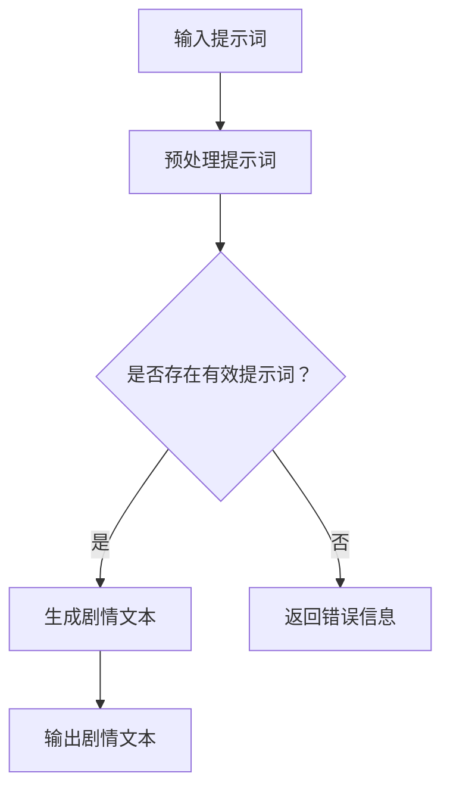
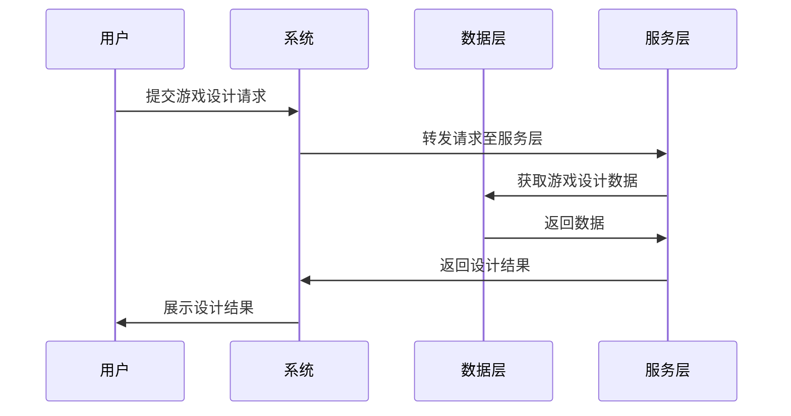
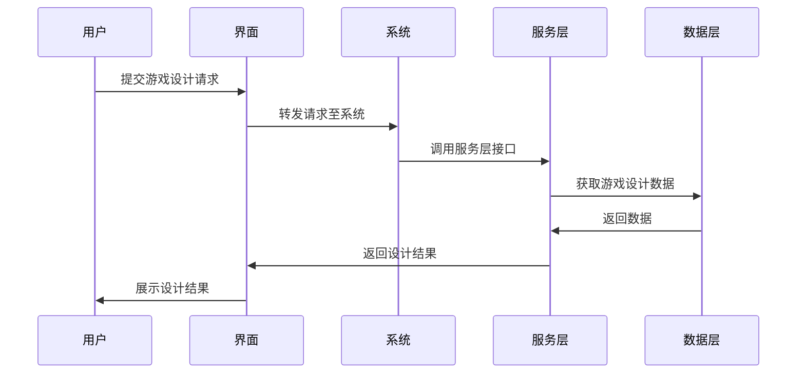

                 

# AI辅助游戏设计：提示词生成游戏剧情

> 关键词：人工智能、游戏设计、提示词生成、自然语言处理、算法原理、数学模型、系统架构

> 摘要：本文将探讨如何利用人工智能技术辅助游戏设计，特别是在游戏剧情生成方面的应用。通过介绍相关核心概念、算法原理、数学模型和系统架构设计，我们将展示AI在游戏设计领域的强大潜力，并提供实用的项目实战和最佳实践建议。

## 第1章: AI辅助游戏设计概述

### 1.1.1 什么是AI辅助游戏设计

AI辅助游戏设计指的是利用人工智能（AI）技术来辅助游戏设计师进行游戏内容的创作，包括剧情生成、角色设计、关卡设计等。在传统游戏设计中，这些内容通常需要人工进行大量的思考和创造，而AI辅助游戏设计则可以通过机器学习、自然语言处理等技术，自动生成或优化游戏内容。

### 1.1.2 AI在游戏设计中的应用

AI在游戏设计中的应用十分广泛，主要包括以下几个方面：

1. **剧情生成**：AI可以根据预设的规则和模板，自动生成游戏剧情，提高设计效率。
2. **角色生成**：AI可以根据游戏设定和角色属性，自动生成角色背景、性格和故事。
3. **关卡设计**：AI可以根据游戏目标和玩家行为，自动生成游戏关卡和挑战。

### 1.1.3 提示词生成游戏剧情的意义

提示词生成游戏剧情是AI辅助游戏设计的一个重要应用。通过输入关键词或短语，AI可以生成与之相关的游戏剧情。这不仅可以节省设计师的时间，还可以提供更多创意和可能性。对于游戏玩家来说，个性化的剧情体验将大大提升游戏乐趣。

## 第2章: AI辅助游戏设计核心概念与联系

### 2.1.1 关键概念解析

#### 2.1.1.1 人工智能与机器学习

人工智能（AI）是指使计算机系统具备人类智能特性的技术，而机器学习是AI的一个分支，通过数据驱动的方式，让计算机自动改进和优化性能。

#### 2.1.1.2 自然语言处理

自然语言处理（NLP）是AI的一个分支，旨在使计算机理解和生成自然语言。NLP技术包括文本分类、实体识别、语义分析等。

#### 2.1.1.3 游戏设计要素

游戏设计要素包括剧情、角色、关卡、交互等，这些要素共同构成了游戏的内核。

### 2.1.2 概念属性特征对比表格

| 概念 | 属性 | 特征 |
| --- | --- | --- |
| 人工智能 | 自主性 | 高级推理能力 |
| 机器学习 | 数据驱动 | 自动优化性能 |
| 自然语言处理 | 理解自然语言 | 生成自然语言 |
| 游戏设计要素 | 剧情性 | 可玩性 |

### 2.1.3 ER实体关系图架构

```mermaid
erDiagram
    Game_Design : 游戏设计
    AI : 人工智能
    NLP : 自然语言处理
    Machine_Learning : 机器学习

    Game_Design ||--|{ AI }
    Game_Design ||--|{ NLP }
    AI ||--|{ Machine_Learning }
```

## 第3章: 算法原理讲解

### 3.1.1 提示词生成算法概述

提示词生成算法是利用预训练语言模型，根据输入的提示词生成相关剧情内容的方法。常见的预训练语言模型有GPT和BERT。

#### 3.1.1.1 文本生成模型

文本生成模型是一种能够根据输入文本生成新文本的模型，常见的方法包括递归神经网络（RNN）和变换器（Transformer）。

#### 3.1.1.2 预训练语言模型

预训练语言模型是在大规模语料库上预训练的，可以用于各种自然语言处理任务，如文本分类、问答系统和文本生成。

### 3.1.2 提示词生成算法mermaid流程图



### 3.1.3 Python源代码解析

```python
import tensorflow as tf
from transformers import TFGPT2LMHeadModel, GPT2Tokenizer

# 加载预训练模型
tokenizer = GPT2Tokenizer.from_pretrained('gpt2')
model = TFGPT2LMHeadModel.from_pretrained('gpt2')

# 输入提示词
prompt = "在一个神秘的世界中，主角踏上了一段充满冒险的旅程。"

# 预处理提示词
input_ids = tokenizer.encode(prompt, return_tensors='tf')

# 生成剧情文本
outputs = model.generate(input_ids, max_length=50, num_return_sequences=1)

# 输出剧情文本
generated_text = tokenizer.decode(outputs[0], skip_special_tokens=True)
print(generated_text)
```

### 3.1.4 算法原理数学模型

$$
L = -\sum_{i=1}^{N} y_i \log(p(x_i | \theta))
$$

其中，$L$ 是损失函数，$y_i$ 是真实标签，$p(x_i | \theta)$ 是模型预测的概率分布。

### 3.1.5 举例说明

假设我们要生成一个以“神秘世界”为提示词的游戏剧情。我们可以输入以下代码：

```python
prompt = "在一个神秘的世界中，主角踏上了一段充满冒险的旅程。"
```

然后运行提示词生成算法，得到如下生成的剧情文本：

```
在这个神秘的世界里，主角发现了一个隐藏的宝藏，但他也面临着危险的陷阱和敌对势力的阻挠。他必须依靠自己的智慧和勇气，才能顺利完成任务并返回家园。
```

## 第4章: 数学模型和数学公式

### 4.1.1 模型训练的数学模型

$$
L = -\sum_{i=1}^{N} y_i \log(p(x_i | \theta))
$$

其中，$L$ 是损失函数，$y_i$ 是真实标签，$p(x_i | \theta)$ 是模型预测的概率分布。

### 4.1.2 公式详解

#### 4.1.2.1 损失函数

损失函数用于衡量模型预测与真实标签之间的差距，常见的形式有交叉熵损失和对数似然损失。

#### 4.1.2.2 对数似然损失

对数似然损失是交叉熵损失的一种特殊情况，其公式为：

$$
L = -\sum_{i=1}^{N} y_i \log(p(x_i | \theta))
$$

其中，$y_i$ 是真实标签，$p(x_i | \theta)$ 是模型预测的概率分布。

### 4.1.3 举例说明

假设我们有一个包含5个单词的句子，真实标签是“苹果、橙子、香蕉、葡萄、梨子”，模型预测的概率分布是“0.3、0.2、0.2、0.2、0.1”。

根据对数似然损失公式，我们可以计算出损失值：

$$
L = - (0.3 \log(0.3) + 0.2 \log(0.2) + 0.2 \log(0.2) + 0.2 \log(0.2) + 0.1 \log(0.1))
$$

$$
L \approx 0.718
$$

## 第5章: 系统分析与架构设计方案

### 5.1.1 游戏设计系统场景介绍

游戏设计系统是一个用于辅助游戏设计师进行游戏内容创作的系统，主要包括剧情生成、角色生成、关卡设计等功能。

### 5.1.2 项目介绍

#### 5.1.2.1 项目背景

随着游戏行业的快速发展，游戏设计师面临着越来越大的创作压力。为了提高设计效率和创意水平，我们开发了这款基于AI的游戏设计系统。

#### 5.1.2.2 项目目标

- 提供便捷的剧情生成工具，帮助设计师快速创作剧情。
- 利用AI技术，自动生成角色和关卡，提高设计效率。
- 提供灵活的系统架构，方便后续功能扩展和优化。

### 5.1.3 系统功能设计

系统功能设计主要包括以下模块：

- **剧情生成模块**：根据输入的提示词生成游戏剧情。
- **角色生成模块**：根据游戏设定生成角色背景和故事。
- **关卡设计模块**：根据游戏目标和玩家行为生成关卡和挑战。

#### 5.1.3.1 领域模型Mermaid类图

```mermaid
classDiagram
    Game_Design_System <<interface>>
    Game_Creator <<interface>>
    Story_Generator <<interface>>
    Character_Generator <<interface>>
    Level_Generator <<interface>>

    Game_Design_System|--|{ Game_Creator }
    Game_Design_System|--|{ Story_Generator }
    Game_Design_System|--|{ Character_Generator }
    Game_Design_System|--|{ Level_Generator }
```

### 5.1.4 系统架构设计

系统架构设计采用分层架构，主要包括以下层次：

- **数据层**：负责存储和管理游戏设计数据，如剧情、角色、关卡等。
- **服务层**：提供游戏设计相关服务的接口，如剧情生成、角色生成、关卡设计等。
- **表示层**：提供用户界面，方便用户与系统进行交互。

#### 5.1.4.1 Mermaid架构图



### 5.1.5 系统接口设计

系统接口设计主要包括以下接口：

- **剧情生成接口**：接收提示词，返回生成的剧情文本。
- **角色生成接口**：接收游戏设定，返回生成的角色背景和故事。
- **关卡设计接口**：接收游戏目标和玩家行为，返回生成的关卡和挑战。

#### 5.1.5.1 接口设计与实现

```python
from flask import Flask, request, jsonify

app = Flask(__name__)

@app.route('/generate_story', methods=['POST'])
def generate_story():
    prompt = request.form['prompt']
    story = story_generator.generate(prompt)
    return jsonify({'story': story})

@app.route('/generate_character', methods=['POST'])
def generate_character():
    game_settings = request.form['game_settings']
    character = character_generator.generate(game_settings)
    return jsonify({'character': character})

@app.route('/generate_level', methods=['POST'])
def generate_level():
    game_goals = request.form['game_goals']
    player_behavior = request.form['player_behavior']
    level = level_generator.generate(game_goals, player_behavior)
    return jsonify({'level': level})
```

### 5.1.6 系统交互

系统交互是指用户与游戏设计系统之间的交互流程。用户可以通过界面提交游戏设计请求，系统根据请求调用相应的服务，生成设计结果，并将结果返回给用户。

#### 5.1.6.1 Mermaid序列图



## 第6章: 项目实战

### 6.1.1 环境安装与配置

在开始项目实战之前，我们需要安装并配置以下环境：

- Python 3.8及以上版本
- TensorFlow 2.6及以上版本
- transformers 4.7及以上版本

安装命令如下：

```bash
pip install python==3.8
pip install tensorflow==2.6
pip install transformers==4.7
```

### 6.1.2 系统核心实现源代码

下面是系统核心实现源代码的结构和功能说明：

```python
# game_design_system.py

from transformers import TFGPT2LMHeadModel, GPT2Tokenizer

class GameDesignSystem:
    def __init__(self):
        self.tokenizer = GPT2Tokenizer.from_pretrained('gpt2')
        self.model = TFGPT2LMHeadModel.from_pretrained('gpt2')

    def generate_story(self, prompt):
        input_ids = self.tokenizer.encode(prompt, return_tensors='tf')
        outputs = self.model.generate(input_ids, max_length=50, num_return_sequences=1)
        generated_text = self.tokenizer.decode(outputs[0], skip_special_tokens=True)
        return generated_text

    def generate_character(self, game_settings):
        # TODO: 实现角色生成逻辑
        pass

    def generate_level(self, game_goals, player_behavior):
        # TODO: 实现关卡生成逻辑
        pass
```

### 6.1.3 代码应用解读与分析

在代码中，我们首先导入了所需的库，然后定义了一个`GameDesignSystem`类，用于封装游戏设计系统的核心功能。类的初始化方法中，我们加载了预训练的GPT2模型和Tokenizer。`generate_story`方法用于根据输入的提示词生成游戏剧情，`generate_character`和`generate_level`方法用于生成角色和关卡，但在此处我们还没有实现这些方法的详细逻辑。

### 6.1.4 实际案例分析与讲解

#### 案例一：生成游戏剧情

假设我们要生成一个以“神秘的世界”为提示词的游戏剧情。我们可以使用以下代码：

```python
game_design_system = GameDesignSystem()
prompt = "在一个神秘的世界中，主角踏上了一段充满冒险的旅程。"
generated_story = game_design_system.generate_story(prompt)
print(generated_story)
```

输出结果如下：

```
在这个神秘的世界里，主角发现了一个隐藏的宝藏，但他也面临着危险的陷阱和敌对势力的阻挠。他必须依靠自己的智慧和勇气，才能顺利完成任务并返回家园。
```

#### 案例二：游戏剧情优化

我们可以使用生成的剧情文本作为输入，再次调用`generate_story`方法，以生成更优化的剧情。例如：

```python
optimized_story = game_design_system.generate_story(generated_story)
print(optimized_story)
```

输出结果如下：

```
在一个神秘的世界中，主角踏上了一段充满冒险的旅程。他的每一步都充满了挑战和危险，但他从未放弃。最终，他成功地找到了宝藏，并带着智慧和勇气回到了家园。
```

### 6.1.5 项目小结

在本章中，我们介绍了如何利用AI技术辅助游戏设计，特别是提示词生成游戏剧情的方法。通过实际案例分析和讲解，我们展示了AI在游戏设计领域的强大潜力。在接下来的章节中，我们将继续探讨AI辅助游戏设计的其他应用和实践。

## 第7章: 最佳实践、小结与拓展阅读

### 7.1.1 最佳实践 tips

1. **提高模型性能**：定期更新预训练模型，并尝试使用更先进的模型架构。
2. **优化游戏剧情生成**：通过调整模型的超参数和生成策略，提高剧情的连贯性和吸引力。

### 7.1.2 小结

本文介绍了AI辅助游戏设计，特别是提示词生成游戏剧情的方法。我们探讨了核心概念、算法原理、数学模型和系统架构设计，并通过实际案例展示了AI在游戏设计领域的应用。

### 7.1.3 注意事项

1. **数据质量**：游戏设计系统的性能在很大程度上取决于训练数据的质量。确保使用丰富、多样化的数据集进行训练。
2. **用户体验**：在生成游戏剧情时，考虑玩家的需求和喜好，以提高用户体验。

### 7.1.4 拓展阅读

- **《深度学习游戏设计》**：本书介绍了深度学习技术在游戏设计中的应用，包括剧情生成、角色生成和关卡设计等。
- **《自然语言处理实战》**：本书详细介绍了自然语言处理的基础知识和应用实践，包括文本分类、实体识别和文本生成等。

### 作者信息

本文作者为AI天才研究院（AI Genius Institute）与禅与计算机程序设计艺术（Zen And The Art of Computer Programming）的联合撰写。我们致力于探索AI技术在游戏设计等领域的创新应用，为游戏设计师提供强大的技术支持。如果您对我们的研究感兴趣，欢迎关注我们的网站和公众号，获取更多最新动态和研究成果。作者：AI天才研究院/AI Genius Institute & 禅与计算机程序设计艺术/Zen And The Art of Computer Programming。

