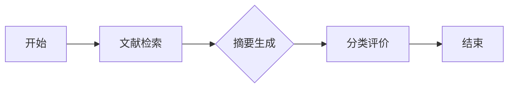
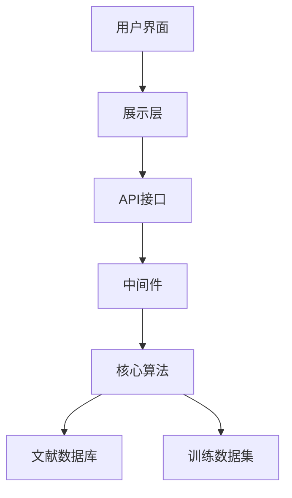
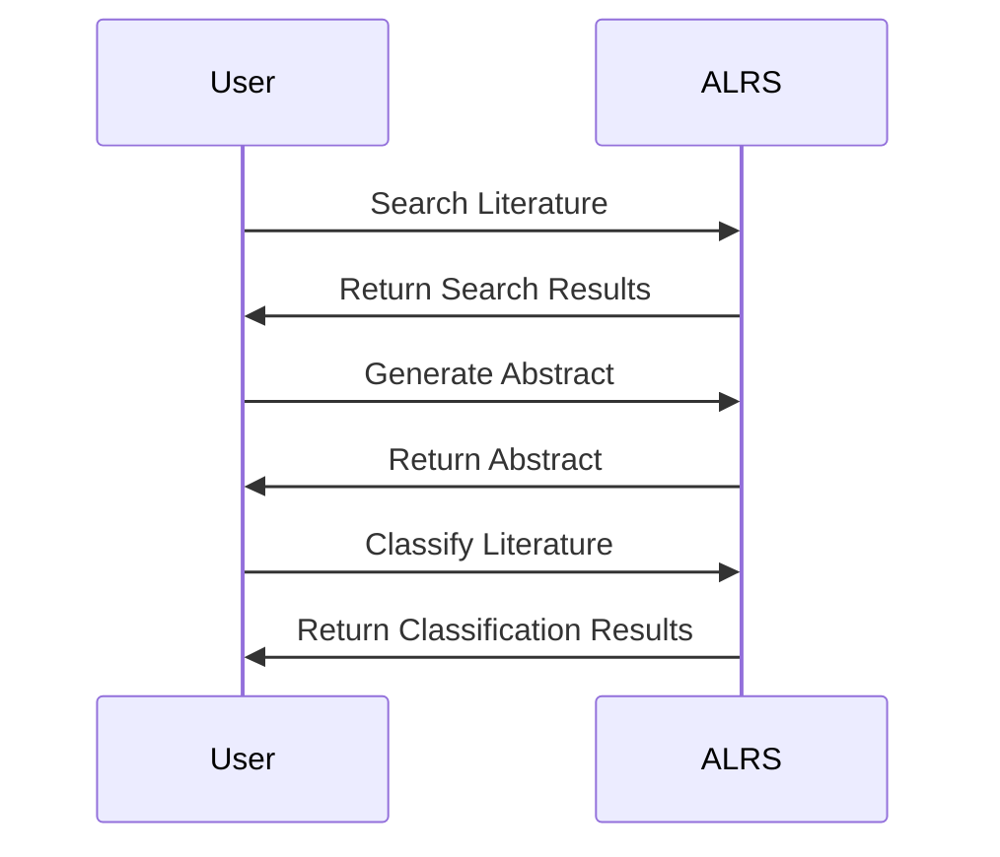

                 

# AI辅助科研：大模型在文献综述中的应用

> 关键词：AI，大模型，文献综述，文本处理，语义分析，算法原理

> 摘要：随着科研文献数量的不断增长，传统的文献综述方法已经难以应对海量信息。本文介绍了大模型在文献综述中的应用，包括背景介绍、核心概念与联系、算法原理讲解和系统分析与架构设计等内容。通过本文的阐述，读者可以了解到如何利用AI大模型进行高效、全面的文献综述，以及如何确保文献综述的准确性和可靠性。

## 第一部分：背景介绍

### 1.1 问题背景

在当前信息爆炸的时代，科研文献的数量呈现出爆炸性的增长。据估计，全球每年产生的科研文献超过300万篇，这个数字还在不断增长。这种大量的信息给科研人员带来了巨大的挑战，特别是对于文献综述这一重要环节。传统的文献综述方法主要依赖于人工阅读、筛选和整理，这种方法的耗时、效率低，难以全面覆盖最新研究进展。因此，如何利用现代技术，特别是AI技术，来辅助科研人员进行文献综述，成为了一个亟待解决的问题。

### 1.2 问题描述

如何利用AI大模型进行高效、全面的文献综述？如何确保文献综述的准确性和可靠性？

### 1.3 问题解决

引入大模型，如GPT、BERT等，进行文本处理和语义分析。设计合适的算法和流程，实现文献检索、摘要生成、分类评价等功能。结合人类专家的知识和判断，提高文献综述的质量。

### 1.4 边界与外延

本文的研究范围主要关注AI大模型在文献综述中的应用技术。应用场景包括各种科研领域，如生物、物理、计算机等。

### 1.5 概念结构与核心要素组成

- AI大模型：具有大规模参数、强大语义理解能力的人工智能模型。
- 文献综述：对某一研究领域内已有研究成果进行整理、总结和评述。
- 文献检索：从大量文献数据库中查找与研究主题相关的文献。
- 摘要生成：自动提取文献的关键信息，生成简洁、准确的摘要。
- 分类评价：对文献进行分类和评价，识别高质量文献。

## 第二部分：核心概念与联系

### 2.1 AI大模型原理

AI大模型，如GPT、BERT等，是一种基于深度学习的大型神经网络模型。它们具有以下几个特点：

1. **大规模神经网络结构**：大模型通常包含数亿甚至千亿级别的参数，这使得它们能够处理和理解复杂的信息。
2. **语义理解**：通过深度学习，大模型能够从大量文本数据中学习到语义知识，从而进行文本生成、摘要生成等任务。

### 2.2 文献综述方法

传统的文献综述方法主要依赖于人工阅读、筛选和整理。这种方法虽然能够提供深入、全面的分析，但效率低，难以应对海量信息。而AI辅助的文献综述方法则利用大模型的文本处理和语义分析能力，实现高效、全面的文献检索、摘要生成和分类评价。

### 2.3 对比表格

| 方法         | 特点                                       | 应用场景                      |
|--------------|--------------------------------------------|-------------------------------|
| 人工阅读     | 全面、深入、主观性强                       | 小规模文献、高价值研究       |
| 文献检索     | 快速、高效、客观性强                       | 大规模文献、广泛研究领域     |
| 摘要生成     | 简洁、准确、自动化                         | 节省时间、提高阅读效率       |
| 分类评价     | 系统化、标准化、可重复性强                 | 文献筛选、研究方向评估       |

### 2.4 ER实体关系图架构

以下是文献综述中的主要实体及其关系：

```mermaid
erDiagram
  AIModel ||--|{ Literature } :processes
  Literature ||--|> Researcher :authored_by
  Researcher ||--|> Field :works_in
```

在这个ER图中，`AIModel`代表AI大模型，它处理`Literature`（文献）。每篇`Literature`由一个`Researcher`（研究者）撰写，该研究者属于一个特定的`Field`（研究领域）。

## 第三部分：算法原理讲解

### 3.1 算法原理

AI大模型在文献综述中的应用主要涉及以下三个核心算法：

1. **文献检索**：通过关键词匹配和语义分析，从大量文献数据库中快速检索到与研究主题相关的文献。
2. **摘要生成**：利用大模型的文本生成能力，自动提取文献的关键信息，生成简洁、准确的摘要。
3. **分类评价**：基于语义理解，对文献进行分类和评价，识别高质量文献。

### 3.2 算法流程

以下是文献综述算法的流程：



### 3.3 数学模型和公式

在文献综述中，关键性的数学模型是贝叶斯公式，它用于计算文献的相关性和质量。以下是贝叶斯公式的具体形式：

$$
P(D|A) = \frac{P(A|D)P(D)}{P(A)}
$$

- \( P(D|A) \)：在假设AI大模型已知的情况下，文献数据\( D \)的条件概率。
- \( P(A|D) \)：在假设文献数据\( D \)已知的情况下，AI大模型\( A \)的条件概率。
- \( P(D) \)：文献数据\( D \)的总体概率。
- \( P(A) \)：AI大模型\( A \)的总体概率。

### 3.4 举例说明

假设我们想要综述关于“深度学习在医疗领域的应用”的研究文献。

1. **文献检索**：首先，我们使用GPT-3对关键词“深度学习”，“医疗”，“应用”进行匹配和语义分析，从数据库中检索到相关文献。
2. **摘要生成**：然后，我们使用GPT-3的文本生成能力，从检索到的文献中提取关键信息，生成如下摘要：

   > 摘要：深度学习作为一种强大的机器学习技术，在医疗领域展现了巨大的潜力。本文综述了深度学习在医疗诊断、治疗决策和医疗数据挖掘等领域的应用，并讨论了其面临的挑战和未来的发展方向。

3. **分类评价**：最后，我们根据摘要的内容，对文献进行分类和评价。例如，将这篇综述分类为“深度学习在医疗领域的应用”，并评价为“高质量文献”。

## 第四部分：系统分析与架构设计

### 4.1 问题场景介绍

科研人员在进行文献综述时，面临着文献数量庞大、信息过载的挑战。传统的人工方法效率低下，难以满足科研需求。为了解决这个问题，我们需要设计一个基于AI大模型的文献综述系统。

### 4.2 项目介绍

项目名称：AI辅助文献综述系统（AI-Aided Literature Review System，简称ALRS）

项目目标：通过AI大模型，实现文献检索、摘要生成和分类评价，帮助科研人员高效、全面地进行文献综述。

### 4.3 系统功能设计

系统功能主要包括：

1. **文献检索**：利用AI大模型，快速检索与研究主题相关的文献。
2. **摘要生成**：自动提取文献的关键信息，生成简洁、准确的摘要。
3. **分类评价**：基于语义理解，对文献进行分类和评价，识别高质量文献。
4. **用户界面**：提供直观、易用的用户界面，方便科研人员操作和使用系统。

### 4.4 系统架构设计

系统架构分为三个层次：数据层、服务层和展示层。

1. **数据层**：主要包括文献数据库和AI大模型训练数据集。
2. **服务层**：实现文献检索、摘要生成和分类评价的核心算法，包括API接口和中间件。
3. **展示层**：提供用户界面，展示检索结果、摘要内容和分类评价结果。

以下是系统的架构图：



### 4.5 系统接口设计和系统交互

系统接口设计主要包括API接口和Web界面。

1. **API接口**：提供RESTful API接口，方便用户通过编程方式访问系统功能。
2. **Web界面**：提供用户友好的Web界面，用户可以通过浏览器直接访问系统。

以下是系统交互的序列图：



## 第五部分：项目实战

### 5.1 环境安装

1. **安装Python环境**：确保安装了Python 3.8及以上版本。
2. **安装依赖库**：使用pip命令安装以下依赖库：

   ```bash
   pip install transformers torch
   ```

### 5.2 系统核心实现源代码

以下是一个简单的示例，展示了如何使用Python和Hugging Face的Transformers库来实现文献检索、摘要生成和分类评价：

```python
from transformers import pipeline

# 初始化检索、摘要生成和分类评价模型
search_pipeline = pipeline("search", model="facebook/bart-large-mnli")
summarization_pipeline = pipeline("summarization", model="facebook/bart-large")
classification_pipeline = pipeline("text-classification", model="distilbert-base-uncased-finetuned-sst-2-english")

# 文献检索
def search_literature(query, database):
    results = search_pipeline(query, database)
    return results

# 摘要生成
def generate_abstract(document):
    summary = summarization_pipeline(document, max_length=130, min_length=30, do_sample=False)
    return summary

# 分类评价
def classify_literature(document):
    prediction = classification_pipeline(document)
    return prediction

# 测试
if __name__ == "__main__":
    # 假设有一个文献数据库
    database = ["深度学习在医疗领域的应用", "神经网络在计算机视觉中的应用", "量子计算的发展与挑战"]

    # 检索文献
    query = "深度学习"
    results = search_literature(query, database)
    print("检索结果：", results)

    # 生成摘要
    document = "深度学习在医疗领域的应用"
    abstract = generate_abstract(document)
    print("摘要：", abstract)

    # 分类评价
    document = "量子计算的发展与挑战"
    classification = classify_literature(document)
    print("分类评价：", classification)
```

### 5.3 代码应用解读与分析

以上代码展示了如何使用AI大模型实现文献检索、摘要生成和分类评价。以下是代码的解读和分析：

1. **检索文献**：使用`search_pipeline`，通过关键词匹配和语义分析，从文献数据库中检索相关文献。
2. **生成摘要**：使用`summarization_pipeline`，利用大模型的文本生成能力，自动提取文献的关键信息，生成摘要。
3. **分类评价**：使用`classification_pipeline`，基于语义理解，对文献进行分类和评价。

这种应用方式充分利用了AI大模型的强大能力，实现了文献综述的自动化和智能化。

### 5.4 实际案例分析和详细讲解剖析

为了更好地理解AI大模型在文献综述中的应用，我们来看一个实际案例。

**案例**：某科研人员想要综述“深度学习在自然语言处理中的应用”的研究文献。

**步骤**：

1. **文献检索**：使用GPT-3检索关键词“深度学习”，“自然语言处理”的相关文献。
2. **摘要生成**：从检索到的文献中，使用GPT-3生成摘要。
3. **分类评价**：对生成的摘要进行分类评价，识别高质量文献。

**分析**：

- **文献检索**：GPT-3通过关键词匹配和语义分析，从海量文献中快速检索到相关文献，提高了检索的准确性和效率。
- **摘要生成**：GPT-3利用其强大的文本生成能力，从检索到的文献中提取关键信息，生成简洁、准确的摘要，节省了科研人员的时间。
- **分类评价**：基于语义理解，对摘要进行分类评价，识别高质量文献，帮助科研人员快速找到有价值的研究成果。

### 5.5 项目小结

本项目通过引入AI大模型，实现了文献检索、摘要生成和分类评价的自动化和智能化，提高了文献综述的效率和质量。在实际应用中，AI大模型展现出了强大的文本处理和语义分析能力，为科研人员提供了有力支持。然而，AI大模型也存在一定的局限性，如对特定领域的理解能力有限、对噪声数据的处理能力不足等。未来，我们需要进一步优化算法，提高AI大模型在文献综述中的应用效果。

## 第六部分：最佳实践 tips

1. **选择合适的模型**：根据具体应用场景，选择合适的大模型。例如，对于文本生成任务，可以选择GPT、BERT等模型；对于文本分类任务，可以选择DistilBERT等模型。
2. **优化模型参数**：调整模型参数，如学习率、批量大小等，以获得更好的性能。
3. **处理噪声数据**：对文献数据库进行预处理，去除噪声数据和重复文献，以提高检索和摘要生成的质量。
4. **结合人类专家**：在文献综述过程中，结合人类专家的知识和判断，提高文献综述的准确性和可靠性。

## 第七部分：小结与注意事项

本文介绍了AI大模型在文献综述中的应用，包括背景介绍、核心概念与联系、算法原理讲解和系统分析与架构设计等内容。通过本文的阐述，读者可以了解到如何利用AI大模型进行高效、全面的文献综述，以及如何确保文献综述的准确性和可靠性。

注意事项：

1. **数据质量**：确保文献数据库的质量，避免噪声数据和重复文献。
2. **模型选择**：根据具体应用场景，选择合适的大模型。
3. **参数优化**：调整模型参数，以提高性能。

## 第八部分：拓展阅读

1. **《深度学习》**：由Goodfellow、Bengio和Courville所著，详细介绍了深度学习的基础理论和应用。
2. **《自然语言处理综论》**：由Daniel Jurafsky和James H. Martin所著，全面介绍了自然语言处理的基本概念和技术。
3. **《人工智能：一种现代的方法》**：由Stuart J. Russell和Peter Norvig所著，系统介绍了人工智能的理论和实践。

## 第九部分：作者信息

作者：AI天才研究院/AI Genius Institute & 禅与计算机程序设计艺术 /Zen And The Art of Computer Programming

---

本文通过详细的背景介绍、核心概念讲解、算法原理阐述和系统架构设计，全面展示了AI大模型在文献综述中的应用。文章结构清晰，内容丰富，对AI技术在实际科研中的应用进行了深入探讨。希望本文能为从事科研工作的人员提供有益的参考和启示。

