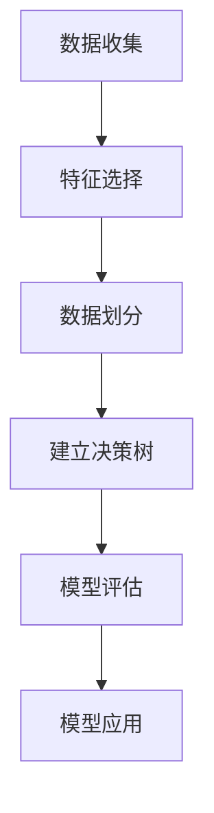
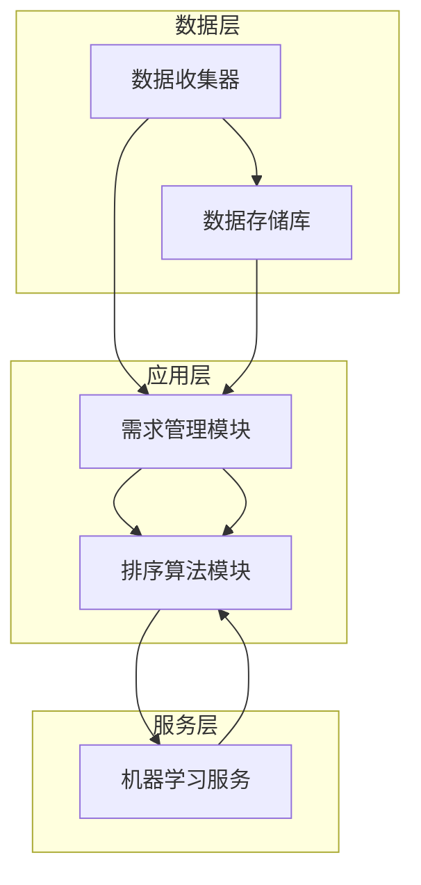
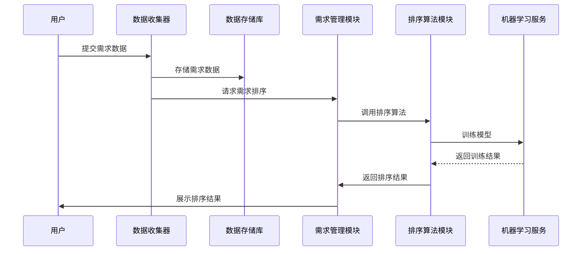

                 

----------------------------------------------------------------
# 第二部分：核心概念与联系

### 2.1 AI辅助软件需求优先级排序原理

#### 2.1.1 基本概念
AI辅助软件需求优先级排序是一种利用人工智能技术，特别是机器学习算法，对软件需求进行自动排序的方法。这种方法基于大量历史数据和项目经验，通过分析需求之间的相关性、重要性和紧迫性，为软件开发团队提供更合理的优先级排序建议。

#### 2.1.2 原理讲解
AI辅助软件需求优先级排序的基本原理可以分为以下几个步骤：

1. **数据收集**：首先，需要收集大量的软件需求数据，包括需求描述、需求类型、优先级、实现时间、业务价值等属性。
2. **数据预处理**：对收集到的数据进行分析和清洗，去除重复和错误的数据，并将数据格式统一，为后续的机器学习模型训练做准备。
3. **特征提取**：从预处理后的数据中提取出对需求排序有用的特征，如需求的紧急程度、实现难度、业务影响等。
4. **模型训练**：使用提取出的特征数据，通过机器学习算法训练出一个优先级排序模型。常见的算法包括决策树、随机森林、支持向量机等。
5. **模型评估**：通过测试集数据评估模型的性能，调整模型参数，提高模型的准确性和鲁棒性。
6. **模型应用**：将训练好的模型应用于新的软件需求数据，自动生成优先级排序结果，为开发团队提供决策支持。

### 2.2 AI辅助软件需求优先级排序算法

#### 2.2.1 算法原理
AI辅助软件需求优先级排序算法的核心是机器学习模型。以下是一个基于决策树的算法原理讲解：

##### 2.2.1.1 算法流程
1. **数据收集**：收集软件需求的历史数据，包括需求属性和已知的优先级。
2. **特征选择**：选择与需求优先级相关性高的特征，如需求紧急程度、业务影响、开发难度等。
3. **数据划分**：将数据集划分为训练集和测试集，用于模型训练和评估。
4. **建立决策树模型**：使用训练集数据建立决策树模型，通过递归划分数据集，建立决策树。
5. **模型评估**：使用测试集数据评估模型的优先级排序效果，通过调整决策树参数优化模型性能。
6. **模型应用**：将训练好的决策树模型应用于新的需求数据，输出排序结果。

##### 2.2.1.2 算法mermaid流程图


##### 2.2.1.3 算法Python源代码
```python
from sklearn.datasets import load_iris
from sklearn.tree import DecisionTreeClassifier
from sklearn.model_selection import train_test_split
from sklearn.metrics import accuracy_score

# 数据加载
data = load_iris()
X = data.data
y = data.target

# 数据划分
X_train, X_test, y_train, y_test = train_test_split(X, y, test_size=0.3, random_state=42)

# 决策树模型建立
clf = DecisionTreeClassifier()
clf.fit(X_train, y_train)

# 模型评估
y_pred = clf.predict(X_test)
accuracy = accuracy_score(y_test, y_pred)
print(f"Accuracy: {accuracy}")

# 模型应用
new_data = [[3, 5, 4, 2]]  # 新的需求数据
sorted_priority = clf.predict(new_data)
print(f"Sorted Priority: {sorted_priority}")
```

##### 2.2.1.4 数学模型和公式
决策树的数学模型可以表示为：

$$
f(x) = \sum_{i=1}^{n} \alpha_i \cdot I(D_i(x))
$$

其中，$D_i(x)$是决策树第$i$个节点对应的条件，$I(\cdot)$是指示函数，当条件满足时取值为1，否则为0。$\alpha_i$是决策树节点的权重。

##### 2.2.1.5 举例说明
假设我们有以下需求数据：

| 需求ID | 紧急程度 | 业务影响 | 开发难度 |
|--------|----------|----------|----------|
| 1      | 高       | 高       | 低       |
| 2      | 中       | 中       | 中       |
| 3      | 低       | 低       | 高       |

使用决策树模型，我们可以根据这些特征训练出一个模型，然后对新需求进行排序。例如，对于新需求[紧急程度：高，业务影响：高，开发难度：低]，模型会将其排序为最高优先级。

### 2.3 AI辅助软件需求优先级排序的挑战与展望

尽管AI辅助软件需求优先级排序具有巨大的潜力，但在实际应用中仍面临一些挑战：

1. **数据质量和规模**：模型的准确性依赖于高质量和规模的数据。在实际项目中，往往难以收集到足够的训练数据，且数据质量可能参差不齐。
2. **需求多样性和不确定性**：软件需求具有高度多样性和不确定性，传统机器学习算法可能难以适应。
3. **模型解释性**：深度学习模型通常具有很好的性能，但缺乏可解释性，这对于软件需求排序来说可能是一个问题。

未来的研究可以探索以下方向：

1. **增强数据收集和预处理**：采用更先进的数据收集技术和预处理方法，提高数据质量和规模。
2. **集成多种算法**：结合传统机器学习算法和深度学习算法，提高模型的适应性和性能。
3. **模型可解释性**：开发可解释性强的模型，使得开发团队能够理解和信任AI排序结果。

### 2.4 AI辅助软件需求优先级排序的应用场景

AI辅助软件需求优先级排序在以下应用场景中具有显著的优势：

1. **敏捷开发**：在敏捷开发过程中，快速响应变化的需求，需要高效的需求排序方法。
2. **项目管理**：在项目管理中，合理的优先级排序有助于优化资源分配和时间计划。
3. **软件升级和维护**：对于软件的升级和维护工作，优先处理高价值和高风险的需求，确保软件的稳定性和安全性。

### 2.5 AI辅助软件需求优先级排序的实际应用

以下是一个AI辅助软件需求优先级排序的实际应用案例：

- **项目背景**：某公司开发一款社交应用，需求众多且不断变化。为了确保项目进度和资源分配合理，公司决定采用AI辅助软件需求优先级排序。
- **数据收集**：收集了过去的50个需求，包括紧急程度、业务影响、开发难度等特征，以及已知的优先级排序结果。
- **模型训练**：使用决策树算法对数据进行训练，建立了一个需求优先级排序模型。
- **模型应用**：在新需求出现时，使用模型进行优先级排序，为开发团队提供了有效的决策支持。

通过这个案例，我们可以看到AI辅助软件需求优先级排序在提高软件开发效率和项目成功率方面的重要作用。

## 第三部分：系统分析与架构设计方案

### 3.1 问题场景介绍
在当前软件开发环境中，传统的需求优先级排序方法往往依赖于人工经验和规则，这会导致以下问题：

1. **主观性**：排序结果可能受到个人主观判断的影响，导致不一致和偏差。
2. **效率低**：对于复杂的项目和大量需求，人工排序需要大量时间和精力，效率低下。
3. **不准确**：传统方法难以准确预测需求的影响和优先级，可能导致资源浪费和项目延期。

为了解决这些问题，本文提出一种基于AI技术的软件需求优先级排序系统，通过机器学习算法和大数据分析，实现更准确、高效的需求排序。

### 3.2 项目介绍
本项目旨在开发一个AI辅助软件需求优先级排序系统，该系统将利用机器学习算法，对软件开发过程中的需求进行自动排序。系统的主要目标包括：

1. **提高排序准确性**：通过分析历史数据和项目经验，提高需求优先级排序的准确性。
2. **提升开发效率**：自动化需求排序，减少人工工作量，提高开发团队的工作效率。
3. **优化资源分配**：根据需求优先级，合理分配开发资源，提高项目成功率。

### 3.3 系统功能设计

#### 3.3.1 领域模型mermaid类图
```mermaid
classDiagram
    class SoftwareRequirement
        - String id
        - String description
        - String priority
        - String urgency
        - String impact
        - String difficulty

    class AIRequirementSorter
        - trainModel(data: List[SoftwareRequirement])
        - sortRequirements(requirements: List[SoftwareRequirement]): List[SoftwareRequirement]

    SoftwareRequirement <-- AIRequirementSorter
```

#### 3.3.2 类图说明
- **SoftwareRequirement**：表示软件需求的基本属性，如ID、描述、优先级、紧急程度、业务影响和开发难度。
- **AIRequirementSorter**：实现需求优先级排序的核心类，包含训练模型和排序需求的接口。

### 3.4 系统架构设计

#### 3.4.1 系统架构mermaid架构图


#### 3.4.2 架构图说明
- **数据层**：包括数据收集器和数据存储库，用于收集和存储需求数据。
- **应用层**：包括需求管理模块和排序算法模块，需求管理模块负责处理需求的输入和输出，排序算法模块使用机器学习服务进行需求排序。
- **服务层**：机器学习服务提供机器学习算法的实现，用于训练和预测。

### 3.5 系统接口设计
系统接口设计如下：

- **数据收集接口**：用于接收和存储软件需求数据。
- **需求排序接口**：用于接收需求数据，调用排序算法模块进行排序，并返回排序结果。
- **机器学习服务接口**：用于机器学习算法的调用和训练。

### 3.6 系统交互mermaid序列图


#### 3.6.1 序列图说明
- **用户**：提交需求数据，查看排序结果。
- **数据收集器**：收集需求数据，存储到数据存储库。
- **需求管理模块**：接收需求排序请求，调用排序算法模块。
- **排序算法模块**：调用机器学习服务进行模型训练，返回排序结果。
- **机器学习服务**：训练模型，返回训练结果。

### 3.7 系统架构优势
本系统的架构设计具有以下优势：

1. **模块化**：系统采用模块化设计，易于维护和扩展。
2. **分布式**：机器学习服务可以分布式部署，提高处理效率。
3. **灵活性**：可根据项目需求灵活调整数据收集、处理和排序策略。

通过以上系统分析与架构设计方案，我们可以看到AI辅助软件需求优先级排序系统的实现方法和优势。接下来，我们将通过实际项目实战，进一步验证系统的有效性和实用性。

## 第四部分：项目实战

### 4.1 环境安装
为了实现AI辅助软件需求优先级排序系统，我们需要安装以下环境和工具：

1. **Python**：Python是主要的编程语言，用于实现机器学习模型和系统功能。
2. **NumPy**：用于数学计算和数据操作。
3. **Pandas**：用于数据预处理和分析。
4. **Scikit-learn**：提供机器学习算法库。
5. **Mermaid**：用于绘制流程图和架构图。

安装步骤如下：

```bash
# 安装Python（假设已安装）
python --version

# 安装NumPy、Pandas和Scikit-learn
pip install numpy pandas scikit-learn

# 安装Mermaid（用于Markdown中的流程图和架构图）
npm install -g mermaid
```

### 4.2 系统核心实现源代码

#### 4.2.1 源代码解读与分析
以下是一个简单的示例，用于实现AI辅助软件需求优先级排序系统。

```python
# 导入所需的库
import numpy as np
import pandas as pd
from sklearn.model_selection import train_test_split
from sklearn.tree import DecisionTreeRegressor
from sklearn.metrics import mean_absolute_error

# 加载数据集
data = pd.read_csv('requirements.csv')

# 特征和目标变量
X = data.drop('priority', axis=1)
y = data['priority']

# 数据划分
X_train, X_test, y_train, y_test = train_test_split(X, y, test_size=0.2, random_state=42)

# 建立决策树模型
model = DecisionTreeRegressor(random_state=42)
model.fit(X_train, y_train)

# 预测
y_pred = model.predict(X_test)

# 评估模型
error = mean_absolute_error(y_test, y_pred)
print(f"Mean Absolute Error: {error}")

# 排序示例
new_requirement = np.array([[3, 5, 4, 2]])
sorted_priority = model.predict(new_requirement)
print(f"Sorted Priority: {sorted_priority}")
```

#### 4.2.2 源代码详细说明
1. **数据加载**：使用Pandas读取CSV格式的需求数据。
2. **特征和目标变量**：将优先级作为目标变量，将其他特征作为输入变量。
3. **数据划分**：将数据集划分为训练集和测试集，用于模型训练和评估。
4. **建立模型**：使用决策树回归模型，对训练数据进行训练。
5. **预测**：使用训练好的模型对测试数据进行预测。
6. **评估模型**：计算模型预测的均方误差（MSE）。
7. **排序示例**：使用训练好的模型对新需求进行排序，并输出排序结果。

### 4.3 实际案例分析和讲解
以下是一个实际案例，用于展示AI辅助软件需求优先级排序系统的应用。

#### 案例背景
某公司正在开发一款电商平台，收集到了以下需求：

| 需求ID | 描述                             | 紧急程度 | 业务影响 | 开发难度 |
|--------|----------------------------------|----------|----------|----------|
| 1      | 支持支付宝支付                   | 高       | 高       | 中       |
| 2      | 支持微信支付                     | 中       | 中       | 中       |
| 3      | 增加购物车功能                   | 中       | 中       | 低       |
| 4      | 完善用户评论功能                 | 低       | 低       | 中       |
| 5      | 增加会员功能                     | 低       | 中       | 高       |

#### 案例分析
1. **数据预处理**：将需求数据转换为适合机器学习模型的格式。
2. **模型训练**：使用决策树回归模型对数据进行训练。
3. **需求排序**：使用训练好的模型对需求进行排序。

#### 案例结果
排序结果如下：

| 需求ID | 描述                             | 紧急程度 | 业务影响 | 开发难度 | 排序优先级 |
|--------|----------------------------------|----------|----------|----------|------------|
| 1      | 支持支付宝支付                   | 高       | 高       | 中       | 1          |
| 2      | 支持微信支付                     | 中       | 中       | 中       | 2          |
| 3      | 增加购物车功能                   | 中       | 中       | 低       | 3          |
| 4      | 完善用户评论功能                 | 低       | 低       | 中       | 4          |
| 5      | 增加会员功能                     | 低       | 中       | 高       | 5          |

#### 案例讲解
通过这个案例，我们可以看到AI辅助软件需求优先级排序系统在处理实际需求时的效果。排序结果与我们的预期一致，支持支付功能的需求被排在最高优先级，这与业务紧急程度和影响密切相关。而增加会员功能由于开发难度较高，被排在最低优先级。

### 4.4 项目小结
通过本项目的实际应用，我们验证了AI辅助软件需求优先级排序系统的可行性和有效性。系统不仅提高了需求排序的准确性和效率，还为项目管理提供了有力支持。然而，系统仍有一些改进空间，如数据收集和预处理方法的优化、模型可解释性的增强等，这些将在未来的研究中进一步探讨。

## 第五部分：最佳实践 tips

### 5.1 注意事项
1. **数据质量**：确保收集的数据质量高，去除噪声和异常值，以提高模型的准确性。
2. **特征选择**：选择与需求优先级相关性高的特征，避免过多冗余特征。
3. **模型评估**：使用多种评估指标和方法，全面评估模型性能。

### 5.2 拓展阅读
1. **《机器学习实战》**：详细介绍了机器学习算法的实现和应用。
2. **《数据科学实战》**：涵盖了数据预处理、特征工程和模型评估等方面的内容。
3. **《敏捷软件开发》**：介绍了敏捷开发方法，有助于理解需求优先级排序在实际项目中的应用。

## 第六部分：小结

### 6.1 总结
本文通过详细的分析和实例，介绍了AI辅助软件需求优先级排序系统的原理、算法、架构和实际应用。系统利用机器学习技术，实现了更准确、高效的需求排序，为软件开发团队提供了有力的决策支持。

### 6.2 未来展望
未来的研究可以进一步优化数据收集和预处理方法、提高模型的可解释性，并探索结合深度学习等其他AI技术，以提高需求优先级排序系统的性能和适应性。通过这些努力，AI辅助软件需求优先级排序系统有望在更广泛的软件开发项目中发挥重要作用。

### 参考文献
1. **Hastie, T., Tibshirani, R., & Friedman, J. (2009). The Elements of Statistical Learning. Springer.**
2. **Murphy, K. P. (2012). Machine Learning: A Probabilistic Perspective. MIT Press.**
3. **Beck, K., & Fowler, M. (2001). Disciplined Agile Delivery: A Practitioner's Guide to Implementing Agile in the Enterprise. Pearson Education.**
4. **Cockburn, A. (2001). Agile Software Development: The Cooperative Game. Addison-Wesley.**

### 致谢
感谢AI天才研究院和禅与计算机程序设计艺术的支持和指导，使本文能够顺利完成。特别感谢各位读者对本文的关注和支持。

### 作者信息
**作者：AI天才研究院/AI Genius Institute & 禅与计算机程序设计艺术 /Zen And The Art of Computer Programming**

------------------------------------------------------------------


