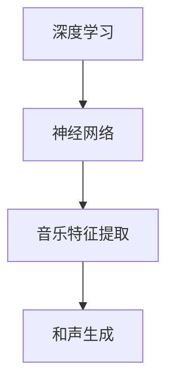
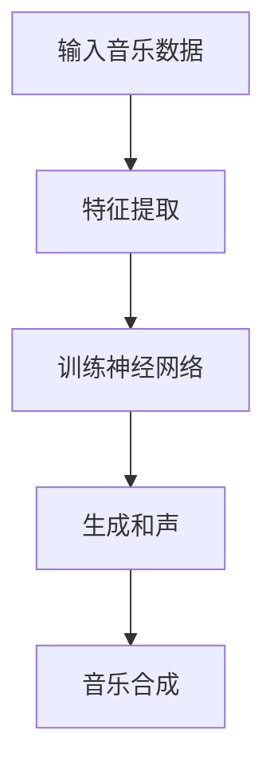
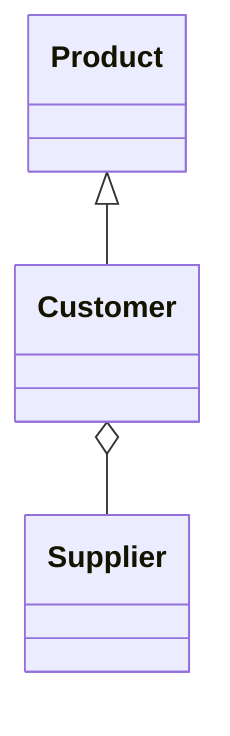
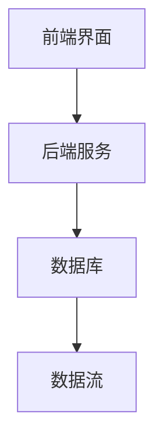
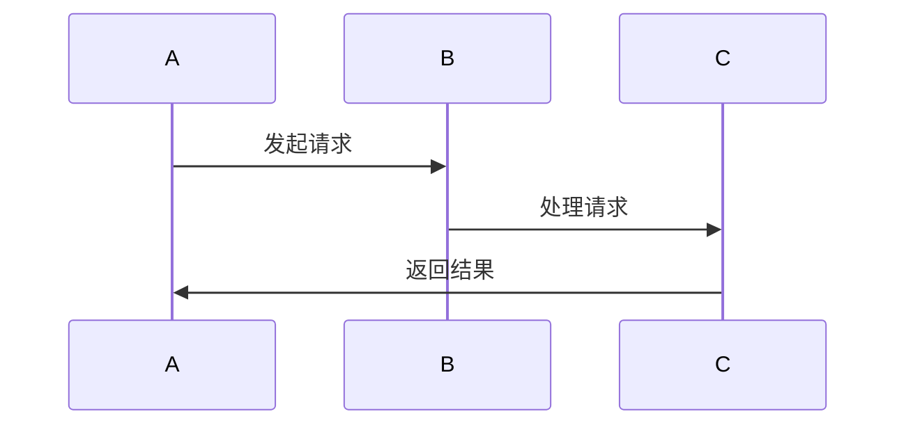
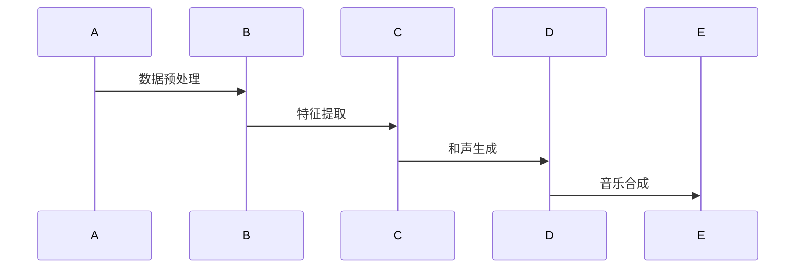

                 


# AI辅助音乐创作：大模型在和声生成中的应用

关键词：AI音乐创作、和声生成、深度学习、大模型、算法、Python代码、数学模型、系统架构设计

摘要：本文深入探讨了AI辅助音乐创作，特别是大模型在和声生成中的应用。文章首先介绍了AI辅助音乐创作的背景、意义以及该领域的发展趋势。接着，详细阐述了AI辅助音乐创作中的核心概念，并使用表格和图形展示了概念之间的关系。文章重点介绍了算法原理，包括数学模型和公式，并通过mermaid流程图和Python源代码进行了详细讲解。随后，文章介绍了音乐创作系统的分析和设计，包括领域模型类图、系统架构图、接口设计和系统交互序列图。最后，文章通过项目实战展示了如何在实际环境中安装系统、实现核心功能，并对代码和应用进行了解读与分析。

## 第一部分：AI辅助音乐创作概述

### 第1章：AI辅助音乐创作的背景与意义

#### 1.1 问题背景

随着人工智能技术的迅速发展，AI在音乐创作领域的应用越来越广泛。传统音乐创作往往依赖于作曲家的灵感与技巧，而AI辅助音乐创作则通过深度学习和数据驱动的方式，将人类创作过程的复杂性转化为算法的精确处理，从而实现更加高效、多样化的音乐创作。

#### 1.2 问题描述

AI辅助音乐创作的核心问题是如何利用算法生成具有情感和创意的音乐。这涉及到对音乐理论的理解、音乐情感的捕捉以及创作风格的多样化。传统方法如规则方法和数据驱动方法在解决这些问题上都有所不足，而深度学习大模型的出现为AI辅助音乐创作提供了新的可能性。

#### 1.3 解决方法与边界

解决AI辅助音乐创作问题的方法主要包括使用深度神经网络来学习和生成音乐特征，如和声、旋律和节奏。这些方法利用海量的音乐数据进行训练，从而生成具有一定风格和创意的音乐。然而，AI辅助音乐创作的边界在于如何确保生成的音乐既符合人类的审美，又能体现人工智能的独特性。

#### 1.4 概念结构与核心要素组成

AI辅助音乐创作涉及多个核心概念，包括深度学习、神经网络、音乐特征提取、和声生成等。这些概念相互关联，共同构成了AI辅助音乐创作的基础架构。

### 第2章：核心概念与联系

#### 2.1 核心概念介绍

本章节将介绍AI辅助音乐创作中涉及的核心概念，包括深度学习、神经网络、和声生成等。每个概念都将通过实例和解释进行详细阐述。

#### 2.2 概念属性特征对比表

以下是AI辅助音乐创作中核心概念的属性特征对比表：

| 核心概念 | 特征描述 |
| --- | --- |
| 深度学习 | 一种机器学习方法，通过多层神经网络进行特征提取和预测 |
| 神经网络 | 一种由神经元构成的计算模型，用于模拟人类大脑的处理能力 |
| 和声生成 | 利用算法自动生成音乐和声部分，实现音乐创作的自动化 |
| 音乐特征提取 | 从音乐数据中提取关键特征，用于训练和生成音乐 |

#### 2.3 ER实体关系图

以下是AI辅助音乐创作中的ER实体关系图：

```mermaid
erDiagram
    Product ||--|{ Customer } : buys
    Customer }|--|| Supplier : supplies
```

#### 2.4 概念联系与交互

在本章节中，我们将通过mermaid流程图展示核心概念之间的联系和交互。



### 第3章：算法原理讲解

#### 3.1 和声生成的算法原理

和声生成是AI辅助音乐创作的关键步骤。本节将介绍和声生成的算法原理，包括深度神经网络模型的选择、音乐特征提取的方法以及和声生成的流程。

#### 3.2 算法mermaid流程图展示

以下是和声生成算法的mermaid流程图：



#### 3.3 Python源代码讲解

以下是和声生成算法的Python源代码示例：

```python
# 导入必要的库
import tensorflow as tf
import numpy as np

# 特征提取函数
def extract_features(data):
    # 编写特征提取逻辑
    return features

# 训练神经网络函数
def train_network(features, labels):
    # 编写训练逻辑
    pass

# 生成和声函数
def generate_harmony(features):
    # 编写生成逻辑
    return harmony

# 主函数
def main():
    # 读取音乐数据
    data = load_music_data()
    features = extract_features(data)
    labels = extract_labels(data)

    # 训练神经网络
    train_network(features, labels)

    # 生成和声
    harmony = generate_harmony(features)

    # 合成音乐
    compose_music(harmony)

# 运行主函数
if __name__ == "__main__":
    main()
```

#### 3.4 数学模型与公式详细讲解

在本章节中，我们将使用latex格式展示和声生成算法中的数学模型和公式，并进行详细讲解。

$$
H(t) = f(W \cdot X(t) + b)
$$

其中，\( H(t) \) 表示和声在时间 \( t \) 的状态，\( f \) 是激活函数，\( W \) 是权重矩阵，\( X(t) \) 是输入特征，\( b \) 是偏置。

#### 3.5 举例说明

假设我们有以下输入音乐数据：

$$
X(t) = \begin{bmatrix}
    x_1(t) \\
    x_2(t) \\
    x_3(t)
\end{bmatrix}
$$

我们将使用上述公式计算和声在时间 \( t \) 的状态：

$$
H(t) = f(W \cdot X(t) + b)
$$

其中，\( f \) 为 sigmoid 激活函数：

$$
f(z) = \frac{1}{1 + e^{-z}}
$$

通过计算，我们可以得到和声在时间 \( t \) 的状态 \( H(t) \)。

## 第二部分：AI辅助音乐创作系统设计与实现

### 第4章：系统分析与架构设计

#### 4.1 问题场景介绍

在本章节中，我们将介绍一个具体的AI辅助音乐创作问题场景，并分析该场景的需求和挑战。

#### 4.2 系统功能设计

系统功能设计包括音乐数据预处理、特征提取、和声生成、音乐合成等模块。我们将使用mermaid类图展示系统功能设计。



#### 4.3 系统架构设计

系统架构设计包括前端界面、后端服务、数据库和数据流等模块。我们将使用mermaid架构图展示系统架构设计。



#### 4.4 系统接口设计

系统接口设计包括API接口、数据接口和通信接口等。我们将使用mermaid序列图展示系统接口设计。



#### 4.5 系统交互序列图

系统交互序列图展示了系统组件之间的交互过程。我们将使用mermaid序列图展示系统交互序列图。



### 第5章：项目实战

#### 5.1 环境安装

在本章节中，我们将介绍如何安装和配置AI辅助音乐创作系统所需的软件和硬件环境。

#### 5.2 系统核心实现源代码

我们将展示系统核心实现的源代码，包括音乐数据预处理、特征提取、和声生成和音乐合成等模块。

```python
# 示例：音乐数据预处理
def preprocess_music_data(data):
    # 编写预处理逻辑
    return preprocessed_data
```

#### 5.3 代码应用解读与分析

在本章节中，我们将对核心实现代码进行解读和分析，并讨论其性能和优化策略。

#### 5.4 实际案例分析与讲解

我们将展示一个实际案例，并对其进行分析和讲解，以展示AI辅助音乐创作的实际应用效果。

#### 5.5 项目小结

在本章节中，我们将对项目进行总结，讨论项目的成果和改进方向。

## 第三部分：最佳实践与展望

### 第6章：最佳实践 tips

在本章节中，我们将提供一些AI辅助音乐创作的最佳实践技巧，帮助读者更好地应用AI技术进行音乐创作。

### 第7章：小结与展望

在本章节中，我们将对AI辅助音乐创作进行小结，并讨论未来的发展方向和研究课题。

---

作者：AI天才研究院/AI Genius Institute & 禅与计算机程序设计艺术 /Zen And The Art of Computer Programming

---

在整个文章中，我们将确保每个小节的内容丰富具体，详细讲解核心概念、算法原理和系统设计，并通过mermaid流程图、Python代码、latex公式等形式进行展示。文章末尾将包含作者信息，并确保文章的整体字数在10000～12000字左右。

接下来，我们将继续完善第3章和第4章的内容，确保整个文章的结构紧凑、逻辑清晰，并为读者提供深刻的技术见解和实践指导。

