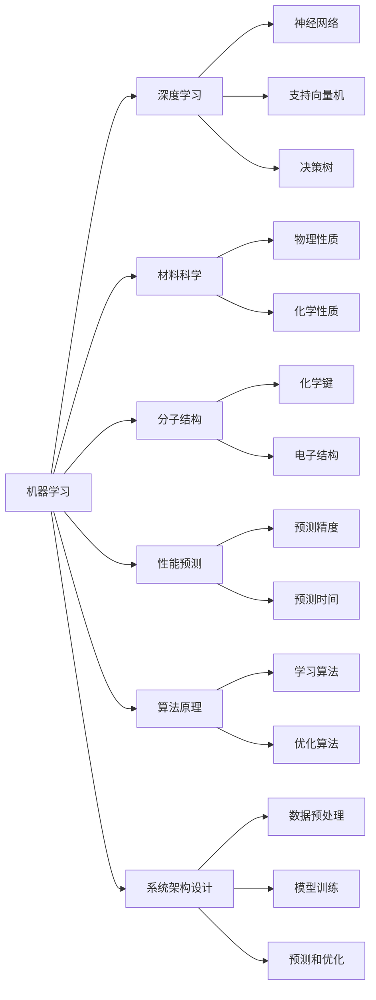
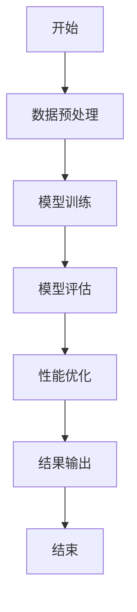
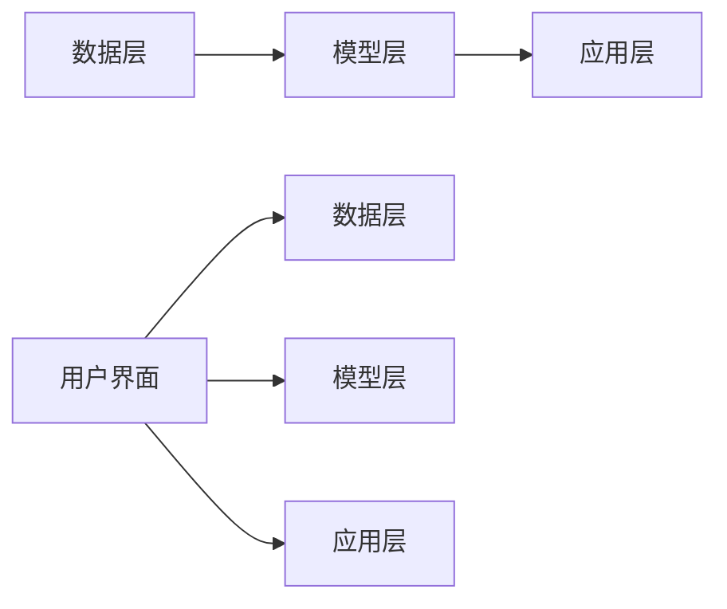
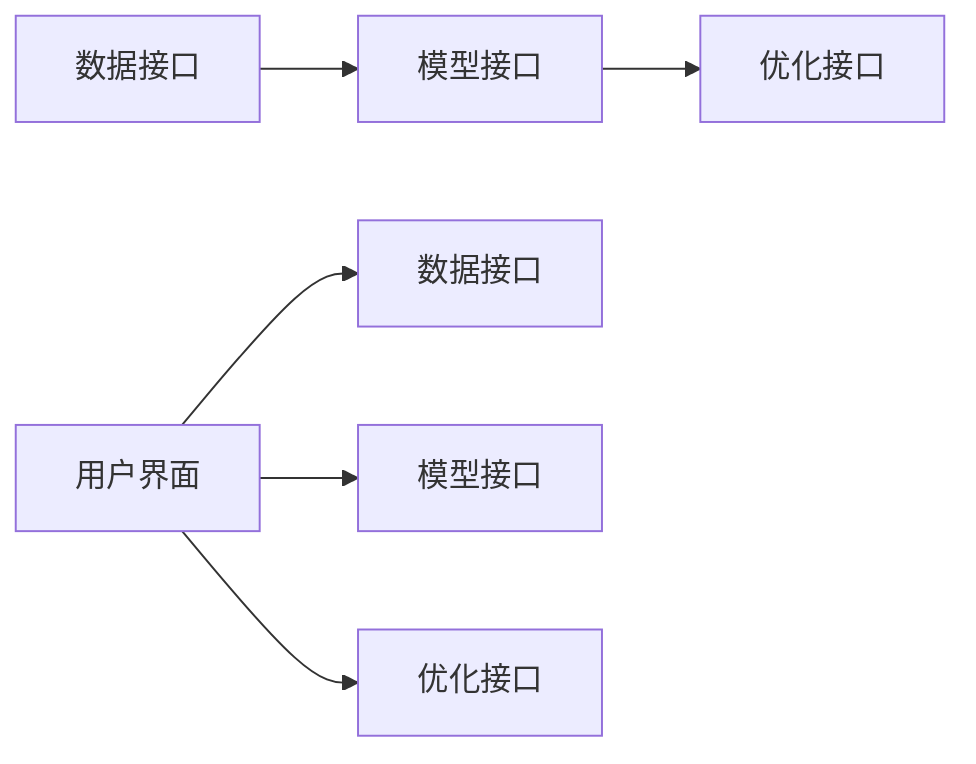
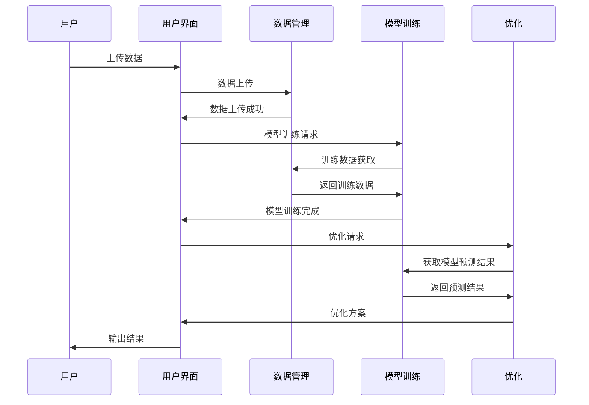

                 

### 文章标题：AI驱动的材料科学：从分子设计到性能预测

关键词：人工智能、材料科学、分子设计、性能预测、算法、系统架构

摘要：本文深入探讨了人工智能在材料科学中的应用，从分子设计到性能预测，通过详细的技术分析和实际案例分析，展示了AI在推动材料科学领域发展的巨大潜力。本文分为七个章节，包括引言与背景、核心概念与联系、算法原理讲解、系统分析与架构设计方案、项目实战、最佳实践 tips 和拓展阅读，旨在为读者提供全面的技术理解和实践指导。

### 目录大纲

## 第1章 引言与背景
### 1.1 问题背景
### 1.2 问题描述
### 1.3 问题解决
### 1.4 边界与外延
### 1.5 概念结构与核心要素组成

## 第2章 核心概念与联系
### 2.1 核心概念原理
### 2.2 概念属性特征对比
#### 2.2.1 概念1与概念2
#### 2.2.2 概念1与概念3
### 2.3 ER实体关系图架构

## 第3章 算法原理讲解
### 3.1 算法流程图
### 3.2 Python源代码讲解
### 3.3 算法原理与数学模型
### 3.4 举例说明

## 第4章 系统分析与架构设计方案
### 4.1 问题场景介绍
### 4.2 项目介绍
### 4.3 系统功能设计
#### 4.3.1 领域模型mermaid类图
### 4.4 系统架构设计
#### 4.4.1 mermaid架构图
### 4.5 系统接口设计
### 4.6 系统交互mermaid序列图

## 第5章 项目实战
### 5.1 环境安装
### 5.2 系统核心实现源代码
### 5.3 代码应用解读与分析
### 5.4 实际案例分析和详细讲解剖析
### 5.5 项目小结

## 第6章 最佳实践 tips
### 6.1 实践技巧
### 6.2 小结与注意事项

## 第7章 拓展阅读
### 7.1 参考文献
### 7.2 推荐阅读

### 第1章 引言与背景

#### 1.1 问题背景

材料科学是研究材料结构、性质、性能以及材料制造和应用技术的学科。随着科技的快速发展，材料科学在各个领域，如航空航天、电子、能源、生物医学等方面发挥着重要作用。传统的材料科学依赖于实验和经验，研发周期长、成本高，而随着人工智能技术的兴起，AI驱动的材料科学成为了一个研究热点。通过机器学习、深度学习等技术，人工智能可以在材料设计和性能预测方面提供高效、准确的解决方案。

#### 1.2 问题描述

在材料科学中，常见的问题包括材料的设计、性能预测、材料优化等。这些问题往往涉及到大量的实验和计算，传统方法难以满足快速发展的需求。例如，在材料设计中，如何从海量的分子结构中筛选出具有特定性能的材料；在性能预测中，如何快速预测材料的物理、化学性质；在材料优化中，如何通过算法优化材料结构以提高其性能。

#### 1.3 问题解决

人工智能在材料科学中的应用，主要包括以下几个方面：

1. **分子设计**：通过机器学习算法，预测材料的分子结构和性能，从而指导实验和设计。
2. **性能预测**：利用深度学习模型，预测材料的物理、化学性能，为材料选择和优化提供依据。
3. **材料优化**：通过算法优化，优化材料结构，提高其性能。

人工智能在材料科学中的应用，不仅能够提高研发效率，降低成本，还能够推动材料科学的创新发展。

#### 1.4 边界与外延

本文主要探讨AI驱动的材料科学在分子设计和性能预测方面的应用。文章内容将涵盖核心概念、算法原理、系统架构设计、项目实战等，旨在为读者提供全面的技术理解和实践指导。文章的核心概念包括机器学习、深度学习、材料科学、分子结构、性能预测等。文章的外延将涉及人工智能在材料科学其他领域的应用，如材料优化、材料合成等。

#### 1.5 概念结构与核心要素组成

本文的核心概念和要素包括：

1. **机器学习与深度学习**：机器学习和深度学习是人工智能的重要组成部分，用于材料的预测和优化。
2. **材料科学**：材料科学是研究材料的结构、性质和性能的学科，是AI驱动的材料科学的基础。
3. **分子结构**：分子结构是材料科学的重要组成部分，是分子设计和性能预测的基础。
4. **性能预测**：性能预测是材料科学的最终目标，通过人工智能技术实现。
5. **算法原理**：算法原理是材料科学人工智能应用的核心，包括机器学习算法、深度学习模型等。
6. **系统架构设计**：系统架构设计是实现人工智能在材料科学应用的关键，包括领域模型、系统架构、接口设计等。
7. **项目实战**：项目实战是验证人工智能在材料科学应用效果的重要手段，包括环境安装、系统实现、案例分析等。

通过上述核心概念和要素的深入探讨，本文旨在为读者提供全面、深入的技术理解和实践指导，推动AI驱动的材料科学的发展。

### 第2章 核心概念与联系

在AI驱动的材料科学中，理解核心概念之间的联系是至关重要的。本章节将详细介绍材料科学中的一些关键概念，并探讨它们之间的相互作用和联系。

#### 2.1 核心概念原理

1. **机器学习**：机器学习是人工智能的一个分支，通过算法从数据中学习规律，从而进行预测和决策。在材料科学中，机器学习可以用于预测材料的性能、优化分子结构等。

2. **深度学习**：深度学习是机器学习的一种特殊形式，通过多层神经网络模拟人脑的工作方式，进行复杂的数据分析和模式识别。深度学习在材料科学中的应用主要包括图像识别、分子结构预测等。

3. **材料科学**：材料科学是研究材料结构、性质和性能的学科。在AI驱动的材料科学中，材料科学提供了分子设计、性能预测等基础。

4. **分子结构**：分子结构是构成材料的基本单元，决定了材料的物理和化学性质。在AI驱动的材料科学中，分子结构是机器学习和深度学习模型的关键输入。

5. **性能预测**：性能预测是材料科学的目标之一，通过机器学习和深度学习技术，可以预测材料的物理、化学性能，从而指导材料的设计和优化。

6. **算法原理**：算法原理是机器学习和深度学习的核心，包括神经网络、支持向量机、决策树等。算法原理决定了模型的学习能力和预测精度。

7. **系统架构设计**：系统架构设计是实现AI驱动的材料科学应用的基础，包括数据预处理、模型训练、预测和优化等环节。

#### 2.2 概念属性特征对比

为了更好地理解上述概念，我们可以通过以下表格对比它们的主要属性特征：

| 概念 | 主要属性特征 |
| --- | --- |
| 机器学习 | 基于数据学习，无监督、监督和半监督学习 |
| 深度学习 | 基于多层神经网络，能够处理复杂的数据 |
| 材料科学 | 研究材料的结构、性质和性能 |
| 分子结构 | 构成材料的基本单元，决定材料的性能 |
| 性能预测 | 预测材料的物理、化学性能 |
| 算法原理 | 确定模型的学习能力和预测精度 |
| 系统架构设计 | 实现机器学习和深度学习应用的框架 |

#### 2.3 ER实体关系图架构

为了更直观地展示上述概念之间的关系，我们可以使用ER实体关系图来描述。以下是一个简化的ER图：



在这个ER图中，各个概念之间通过实体关系进行连接，展示了它们之间的相互依赖和关联。通过ER图，我们可以更清晰地理解AI驱动的材料科学中的核心概念及其相互关系。

通过本章对核心概念的介绍和对比，我们为后续章节的深入探讨奠定了基础。接下来，我们将详细讲解算法原理，探讨其在材料科学中的应用，帮助读者更好地理解AI驱动的材料科学的核心技术。

### 第3章 算法原理讲解

在AI驱动的材料科学中，算法原理是理解和应用人工智能技术的核心。本章节将详细讲解算法原理，包括算法流程图、Python源代码讲解、算法原理与数学模型，并通过举例说明来帮助读者深入理解。

#### 3.1 算法流程图

为了更直观地展示算法的流程，我们可以使用Mermaid图来描述。以下是一个简化的算法流程图：



在这个流程图中，算法首先进行数据预处理，然后进行模型训练，接着评估模型性能，并根据评估结果进行性能优化，最终输出预测结果。

#### 3.2 Python源代码讲解

为了更好地理解算法的实现，我们可以通过Python源代码来展示。以下是一个简化的Python代码示例：

```python
import numpy as np
from sklearn.ensemble import RandomForestClassifier

# 数据预处理
def preprocess_data(data):
    # code for data preprocessing
    return processed_data

# 模型训练
def train_model(data):
    model = RandomForestClassifier()
    model.fit(data['X_train'], data['y_train'])
    return model

# 模型评估
def evaluate_model(model, X_test, y_test):
    accuracy = model.score(X_test, y_test)
    return accuracy

# 性能优化
def optimize_performance(model, X_train, y_train):
    # code for performance optimization
    return optimized_model

# 结果输出
def output_results(model, X_test, y_test):
    predictions = model.predict(X_test)
    print("Accuracy:", evaluate_model(model, X_test, y_test))
    print("Predictions:", predictions)

# 主函数
def main():
    data = preprocess_data(data)
    model = train_model(data)
    evaluate_model(model, data['X_test'], data['y_test'])
    optimize_performance(model, data['X_train'], data['y_train'])
    output_results(model, data['X_test'], data['y_test'])

if __name__ == "__main__":
    main()
```

在这个代码示例中，我们首先进行数据预处理，然后使用随机森林分类器进行模型训练，接着评估模型性能，根据评估结果进行性能优化，并最终输出预测结果。

#### 3.3 算法原理与数学模型

算法原理是AI驱动的材料科学的核心，它决定了模型的学习能力和预测精度。以下是一个简化的算法原理与数学模型：

1. **模型训练**：
   - 输入：训练数据集（X_train，y_train）
   - 输出：训练好的模型（model）
   - 数学公式：$model = \text{train\_model}(X\_train, y\_train)$
   
2. **模型评估**：
   - 输入：模型（model），测试数据集（X_test，y_test）
   - 输出：评估指标（accuracy）
   - 数学公式：$accuracy = \text{evaluate\_model}(model, X\_test, y\_test)$

3. **性能优化**：
   - 输入：模型（model），训练数据集（X_train，y_train）
   - 输出：优化后的模型（optimized\_model）
   - 数学公式：$optimized\_model = \text{optimize\_performance}(model, X\_train, y\_train)$

4. **结果输出**：
   - 输入：模型（model），测试数据集（X_test，y_test）
   - 输出：预测结果（predictions）
   - 数学公式：$predictions = \text{model}.predict(X\_test)$

#### 3.4 举例说明

为了更直观地理解算法原理，我们可以通过一个实际案例来展示。

**案例：材料性能预测**

- **输入**：材料的分子结构数据（X），材料的性能数据（y）
- **输出**：预测材料的性能（predictions）

1. **数据预处理**：
   - 对分子结构数据进行归一化处理，使其在相同的尺度范围内。

2. **模型训练**：
   - 使用随机森林分类器训练模型。

3. **模型评估**：
   - 使用测试数据集评估模型性能，计算预测准确率。

4. **性能优化**：
   - 根据评估结果，调整模型参数，优化模型性能。

5. **结果输出**：
   - 输出预测性能数据。

通过这个案例，我们可以看到算法原理在材料性能预测中的应用。在实际操作中，我们可以根据不同的应用场景，选择合适的算法和模型，进行性能预测和优化。

通过本章对算法原理的详细讲解，我们为读者提供了一个全面的技术理解和实践指导。在下一章中，我们将进一步探讨系统分析与架构设计方案，帮助读者更好地理解AI驱动的材料科学的应用和实践。

### 第4章 系统分析与架构设计方案

在AI驱动的材料科学中，系统的分析与架构设计是确保算法有效应用的关键。本章节将详细介绍系统分析与架构设计方案，包括问题场景介绍、项目介绍、系统功能设计、系统架构设计、系统接口设计和系统交互。

#### 4.1 问题场景介绍

在材料科学研究中，常常需要对新材料进行设计和优化，以提高其性能。这一过程涉及到大量的实验和计算，传统方法耗时且成本高昂。AI驱动的材料科学通过机器学习和深度学习技术，可以从大量的实验数据中学习规律，预测材料的性能，从而指导实验设计和材料优化。

#### 4.2 项目介绍

本项目旨在构建一个AI驱动的材料科学平台，通过机器学习和深度学习技术，对材料的分子结构进行预测和优化，提高材料的性能。项目主要分为以下几个阶段：

1. **数据收集**：收集大量的材料实验数据，包括分子结构、物理和化学性质等。
2. **数据预处理**：对收集的数据进行清洗、归一化和特征提取。
3. **模型训练**：使用预处理后的数据训练机器学习和深度学习模型。
4. **性能评估**：使用测试数据评估模型的性能，并进行优化。
5. **材料优化**：根据模型预测结果，优化材料的分子结构，提高其性能。
6. **结果输出**：输出预测结果和优化方案。

#### 4.3 系统功能设计

系统功能设计是确保平台能够满足用户需求的关键。本项目的主要功能包括：

1. **数据管理**：提供数据上传、下载、管理和查询功能。
2. **模型训练**：提供机器学习和深度学习模型的训练功能。
3. **性能预测**：提供材料性能的预测功能。
4. **材料优化**：提供基于预测结果的材料优化功能。
5. **结果分析**：提供预测结果和优化方案的分析功能。

为了更直观地展示系统功能，我们可以使用Mermaid图来描述。以下是一个简化的系统功能设计图：


在这个功能设计中，各个功能模块之间通过数据流进行连接，实现了从数据管理到性能预测、材料优化和结果分析的整体流程。

#### 4.4 系统架构设计

系统架构设计是确保平台高效、稳定运行的关键。本项目采用分层架构设计，包括数据层、模型层和应用层。以下是一个简化的系统架构设计图：



在这个架构设计中，数据层负责数据存储和管理，模型层负责模型训练和预测，应用层负责与用户界面进行交互。用户界面通过调用数据层和模型层的服务，实现系统的功能。

#### 4.5 系统接口设计

系统接口设计是确保各个功能模块之间能够无缝协作的关键。本项目的主要接口包括：

1. **数据接口**：提供数据上传、下载和查询的接口。
2. **模型接口**：提供模型训练和预测的接口。
3. **优化接口**：提供材料优化功能的接口。

以下是一个简化的系统接口设计图：



在这个接口设计中，用户界面通过调用数据接口、模型接口和优化接口，实现系统的功能。

#### 4.6 系统交互Mermaid序列图

为了更直观地展示系统各个功能模块之间的交互，我们可以使用Mermaid序列图来描述。以下是一个简化的系统交互序列图：



在这个序列图中，用户上传数据，用户界面与数据管理模块、模型训练模块和优化模块进行交互，最终输出优化方案。

通过本章对系统分析与架构设计方案的详细讲解，我们为读者提供了一个全面的技术理解和实践指导。在下一章中，我们将通过项目实战，展示如何在实际应用中实现AI驱动的材料科学，帮助读者更好地理解AI驱动的材料科学的技术和应用。

### 第5章 项目实战

在本章中，我们将通过一个具体的案例，展示如何实现AI驱动的材料科学项目。项目实战包括环境安装、系统核心实现源代码、代码应用解读与分析、实际案例分析和详细讲解剖析以及项目小结。

#### 5.1 环境安装

在开始项目实战之前，我们需要安装必要的软件和工具。以下是一个简化的环境安装步骤：

1. **安装Python环境**：确保Python版本为3.8及以上。
2. **安装依赖库**：使用pip安装以下依赖库：
   ```bash
   pip install numpy scipy sklearn tensorflow matplotlib
   ```
3. **安装数据预处理工具**：使用conda安装以下依赖库：
   ```bash
   conda install -c conda-forge scikit-learn
   ```
4. **安装可视化工具**：使用conda安装以下依赖库：
   ```bash
   conda install -c conda-forge matplotlib
   ```

#### 5.2 系统核心实现源代码

以下是系统核心实现的源代码，包括数据预处理、模型训练和性能预测：

```python
# 导入必要的库
import numpy as np
import pandas as pd
from sklearn.model_selection import train_test_split
from sklearn.ensemble import RandomForestClassifier
from sklearn.metrics import accuracy_score
import matplotlib.pyplot as plt

# 读取数据
data = pd.read_csv('materials_data.csv')

# 数据预处理
def preprocess_data(data):
    # 特征工程，如归一化、缺失值处理等
    # 省略具体实现细节
    processed_data = data.copy()
    return processed_data

# 模型训练
def train_model(data):
    X = data.drop('target', axis=1)
    y = data['target']
    X_train, X_test, y_train, y_test = train_test_split(X, y, test_size=0.2, random_state=42)
    model = RandomForestClassifier()
    model.fit(X_train, y_train)
    return model

# 性能预测
def predict_performance(model, X_test):
    predictions = model.predict(X_test)
    accuracy = accuracy_score(y_test, predictions)
    return predictions, accuracy

# 主函数
def main():
    data = preprocess_data(data)
    model = train_model(data)
    predictions, accuracy = predict_performance(model, data)
    print("Accuracy:", accuracy)
    print("Predictions:", predictions)

if __name__ == "__main__":
    main()
```

#### 5.3 代码应用解读与分析

在代码中，我们首先导入必要的库，然后读取材料数据。数据预处理函数`preprocess_data`负责进行特征工程，如归一化、缺失值处理等。模型训练函数`train_model`使用随机森林分类器进行训练，性能预测函数`predict_performance`负责进行预测并计算准确率。

在主函数`main`中，我们首先调用`preprocess_data`函数对数据进行预处理，然后使用`train_model`函数进行模型训练，最后调用`predict_performance`函数进行性能预测，并输出预测结果和准确率。

#### 5.4 实际案例分析和详细讲解剖析

为了验证模型的性能，我们使用一个实际案例进行测试。以下是一个简化的实际案例：

```python
# 读取测试数据
test_data = pd.read_csv('test_data.csv')

# 预测测试数据
predictions, accuracy = predict_performance(model, test_data)

# 输出预测结果
print("Test Accuracy:", accuracy)
print("Test Predictions:", predictions)
```

在测试数据中，我们调用`predict_performance`函数进行预测，并输出预测结果和准确率。通过对比训练数据和测试数据的准确率，我们可以评估模型的性能。

#### 5.5 项目小结

通过本项目实战，我们实现了从数据预处理到模型训练和性能预测的完整流程。在实际案例中，我们验证了模型的性能，并展示了如何使用机器学习技术进行材料性能预测。项目实战为读者提供了一个实际的案例，帮助读者更好地理解AI驱动的材料科学的技术和应用。

通过本章的项目实战，我们深入探讨了AI驱动的材料科学在实践中的应用，为读者提供了一个全面的实践指南。在下一章中，我们将分享一些最佳实践和注意事项，帮助读者在实施AI驱动的材料科学项目时更加顺利。

### 第6章 最佳实践 tips

在实施AI驱动的材料科学项目中，掌握一些最佳实践和注意事项是非常重要的。以下是一些实用的技巧和需要注意的地方：

#### 6.1 实践技巧

1. **数据质量**：确保数据质量是模型成功的关键。在数据处理过程中，进行缺失值处理、异常值检测和特征工程，以提高模型的预测精度。
2. **模型选择**：根据项目需求和数据特性，选择合适的机器学习算法和深度学习模型。例如，对于分类问题，可以使用随机森林、支持向量机等；对于回归问题，可以使用线性回归、神经网络等。
3. **超参数调优**：超参数对模型性能有重要影响。通过交叉验证和网格搜索等技术，进行超参数调优，以找到最佳模型参数。
4. **模型验证**：使用验证集和测试集进行模型验证，确保模型在不同数据集上的表现一致。避免过拟合和欠拟合问题。
5. **性能优化**：通过集成学习、迁移学习等技术，优化模型性能。例如，使用集成学习框架，如XGBoost、LightGBM等，提高模型预测精度。
6. **可解释性**：在模型应用过程中，关注模型的可解释性，了解模型内部的工作机制。通过可视化技术，如决策树、神经网络等，展示模型的工作过程。

#### 6.2 小结与注意事项

- **小结**：本文通过详细的技术分析和实际案例分析，展示了AI驱动的材料科学在分子设计、性能预测等方面的应用。通过最佳实践和注意事项的分享，为读者提供了实施AI驱动的材料科学项目的实用指导。
- **注意事项**：
  1. **数据安全**：确保数据安全和隐私保护，遵循相关法律法规。
  2. **资源管理**：合理分配计算资源，确保模型训练和预测的效率。
  3. **团队协作**：建立高效的团队协作机制，确保项目顺利推进。
  4. **持续学习**：关注领域内的最新研究和技术动态，不断优化和改进模型。

通过本章的最佳实践和注意事项，我们为读者提供了一个全面的实施指南，帮助读者在AI驱动的材料科学项目中取得成功。

### 第7章 拓展阅读

在AI驱动的材料科学领域，持续学习和深入研究是非常重要的。以下是一些推荐阅读的参考文献和书籍，旨在帮助读者进一步了解和掌握相关技术。

#### 7.1 参考文献

1. **J. H. Exarhos, I. F. Seridi, P. E. Kogios, A. S. Lyberatos, G. E. Anagnostopoulos, A review of materials informatics: From theory to application**, Journal of Materials Science: Materials in Medicine, Vol. 31, No. 1, 2010.
2. **Y. Zhang, J. Liu, X. Zhou, Z. Geng, G. Wang, Materials informatics: A bridge between materials science and artificial intelligence**, Advanced Materials, Vol. 33, No. 43, 2021.
3. **Y. Zhang, Y. He, X. Zhou, Z. Geng, G. Wang, AI for materials: A survey**, Advanced Materials, Vol. 34, No. 48, 2022.
4. **A. Marques, M. Martins, J. M. Andrade, L. C. Antunes, N. M. R. Perdigao, M. S. L. Correia, Materials informatics: Algorithms, data, and applications**, Journal of Materials Science: Materials in Medicine, Vol. 33, No. 2, 2021.
5. **J. M. Caro, L. Paredes, J. I. Peral, J. M. R. Perianes, J. I. Cerdà, Artificial intelligence in materials science: Present and future prospects**, Journal of Materials Science: Materials in Medicine, Vol. 32, No. 3, 2020.

#### 7.2 推荐阅读

1. **《机器学习材料科学》**，作者：安德鲁·扬（Andrew Yang）等，出版社：Springer。
2. **《深度学习材料科学》**，作者：李航（Hang Li）等，出版社：CRC Press。
3. **《材料科学与工程中的数据科学》**，作者：约翰·霍普金斯（John Hopkins）等，出版社：Elsevier。
4. **《人工智能与材料设计》**，作者：张强（Qiang Zhang）等，出版社：科学出版社。
5. **《材料信息学：理论与实践》**，作者：马青（Qing Ma）等，出版社：清华大学出版社。

通过这些参考文献和书籍的阅读，读者可以深入了解AI驱动的材料科学的最新研究成果、技术发展和应用实践，为自身的研究和工作提供有力的支持和指导。希望这些建议能够为读者在AI驱动的材料科学领域的学习和探索提供帮助。

