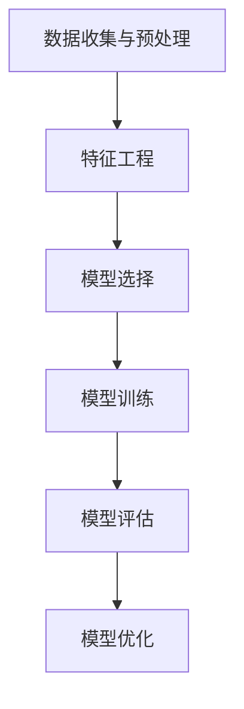

                 

# AI驱动的金融风险评估：从微观到宏观

## 关键词
- AI
- 金融风险评估
- 微观层面
- 宏观层面
- 模型构建
- 算法原理
- 最佳实践

## 摘要
本文深入探讨了AI驱动的金融风险评估，分为微观和宏观两个层面。首先，我们介绍了金融行业与AI应用的关系，并详细讨论了微观层面的AI金融风险评估，包括数据收集与预处理、特征工程、风险评估模型构建及优化。接着，我们转向宏观层面，分析了宏观经济因素及其影响，并探讨了宏观风险评估模型及其整合方法。文章通过两个实际案例研究，展示了AI驱动的金融风险评估的应用，并提出了未来展望与最佳实践建议。

## 第一部分：引言

### 1.1 书籍背景

在当今全球化的金融市场中，风险管理已成为金融机构的核心任务。随着数据量的爆炸性增长和计算能力的提升，人工智能（AI）在金融风险评估中的应用越来越广泛。AI技术能够处理大量复杂数据，识别潜在的风险因素，提高风险评估的准确性和效率。

#### 1.1.1 金融行业与AI应用

金融行业是一个数据密集型领域，从银行、证券到保险，都依赖于数据的收集、处理和分析。AI的应用场景包括信用评分、市场趋势预测、反欺诈、投资组合优化等。例如，机器学习算法可以分析客户的历史交易数据，预测其信用风险；深度学习模型可以分析市场数据，预测股票价格趋势。

#### 1.1.2 风险评估的重要性

风险评估是金融决策的基础，能够帮助金融机构识别潜在风险，制定应对策略。准确的风险评估可以降低损失，提高资本利用效率，增加竞争力。然而，传统的风险评估方法依赖于专家经验和历史数据，存在主观性和滞后性。AI的应用可以克服这些限制，提供更加客观、实时和全面的风险评估。

#### 1.1.3 AI在金融风险评估中的应用

AI在金融风险评估中的应用主要体现在以下几个方面：

1. **数据驱动的模型构建**：AI技术可以处理海量数据，提取有效特征，构建预测模型，提高风险评估的精度。
2. **实时风险评估**：通过实时数据分析和预测，AI可以帮助金融机构及时调整风险策略，降低风险。
3. **自动化决策**：AI技术可以自动化风险评估过程，减少人工干预，提高决策效率。
4. **风险监测和预警**：AI系统可以持续监测市场动态，及时识别潜在风险，发出预警信号。

### 1.2 AI驱动的金融风险评估概述

AI驱动的金融风险评估是一种利用机器学习、深度学习等AI技术，对金融风险进行识别、预测和评估的方法。其核心在于利用大数据和复杂的算法，挖掘数据中的风险信号，提供决策支持。

#### 1.2.1 AI的核心技术

AI的核心技术包括机器学习、深度学习、强化学习等。这些技术可以处理复杂数据，从海量数据中提取特征，构建预测模型。

1. **机器学习**：通过训练模型，从历史数据中学习规律，进行预测。常见的算法有线性回归、决策树、支持向量机等。
2. **深度学习**：通过多层神经网络，对数据进行自动特征提取和组合，实现高度复杂的模型。常见的网络有卷积神经网络（CNN）、循环神经网络（RNN）等。
3. **强化学习**：通过与环境互动，不断调整策略，实现最优决策。常见的算法有Q学习、深度Q网络（DQN）等。

#### 1.2.2 金融风险评估的关键环节

金融风险评估的关键环节包括数据收集与预处理、特征工程、风险评估模型构建和优化等。

1. **数据收集与预处理**：金融数据来源广泛，包括内部数据和外部数据。数据预处理包括数据清洗、数据归一化、缺失值处理等，以确保数据质量。
2. **特征工程**：特征提取和选择是风险评估的关键。通过分析数据，提取与风险相关的特征，筛选出最重要的特征。
3. **风险评估模型构建**：根据特征，构建风险评估模型。常用的模型有监督学习模型、非监督学习模型和混合学习模型。
4. **模型优化**：通过交叉验证、超参数调整等方法，优化模型性能，提高预测准确性。

#### 1.2.3 AI驱动的风险评估方法

AI驱动的风险评估方法主要包括以下几种：

1. **基于规则的评估方法**：通过设定规则，对风险进行分类和评分。
2. **基于统计的评估方法**：利用统计方法，如线性回归、逻辑回归等，建立风险评估模型。
3. **基于机器学习的评估方法**：利用机器学习算法，如决策树、支持向量机等，建立风险评估模型。
4. **基于深度学习的评估方法**：利用深度学习算法，如卷积神经网络、循环神经网络等，建立风险评估模型。
5. **基于多模态数据的评估方法**：结合文本、图像、音频等多种数据，进行综合风险评估。

## 第二部分：微观层面的AI金融风险评估

### 2.1 数据收集与预处理

在微观层面的AI金融风险评估中，数据收集与预处理是至关重要的一步。金融数据来源广泛，包括银行交易记录、客户信用记录、市场交易数据等。这些数据通常存在缺失、噪声和异常值，需要进行预处理，以确保数据质量。

#### 2.1.1 金融数据来源

金融数据来源可以分为内部数据和外部数据。内部数据包括银行交易记录、客户信用记录、贷款记录等；外部数据包括市场交易数据、宏观经济数据、新闻报道等。

#### 2.1.2 数据预处理技术

数据预处理技术包括数据清洗、数据归一化、缺失值处理等。

1. **数据清洗**：去除重复数据、噪声数据和异常值，确保数据的一致性和准确性。
2. **数据归一化**：将不同特征的数据转换为同一量纲，便于模型训练。
3. **缺失值处理**：对于缺失的数据，可以使用填充方法，如平均值填充、中值填充、插值法等。

### 2.2 特征工程

特征工程是AI金融风险评估中的关键步骤，通过分析数据，提取与风险相关的特征，筛选出最重要的特征，以提高模型性能。

#### 2.2.1 特征提取方法

特征提取方法包括统计特征提取和深度特征提取。

1. **统计特征提取**：通过计算数据的统计指标，如均值、方差、相关性等，提取特征。
2. **深度特征提取**：通过深度学习模型，自动提取高层次的抽象特征。

#### 2.2.2 特征选择策略

特征选择策略包括过滤式特征选择、包裹式特征选择和嵌入式特征选择。

1. **过滤式特征选择**：在特征提取后，对特征进行筛选，选择与目标变量相关性较高的特征。
2. **包裹式特征选择**：通过迭代的方式，逐步选择特征，直到找到最优特征组合。
3. **嵌入式特征选择**：在特征提取过程中，自动选择最重要的特征。

### 2.3 微观风险评估模型

微观风险评估模型是AI金融风险评估的核心，通过构建模型，对金融风险进行预测和评估。

#### 2.3.1 监督学习模型

监督学习模型是金融风险评估中最常用的模型之一。常见的监督学习模型包括线性回归、逻辑回归、决策树、随机森林、支持向量机等。

1. **线性回归**：通过建立线性模型，预测目标变量的值。
2. **逻辑回归**：通过建立逻辑回归模型，预测目标变量的概率。
3. **决策树**：通过决策树模型，对样本进行分类或回归。
4. **随机森林**：通过构建多个决策树，对结果进行投票，提高预测准确性。
5. **支持向量机**：通过支持向量机模型，找到最佳决策边界。

#### 2.3.2 非监督学习模型

非监督学习模型在金融风险评估中也有广泛应用。常见的非监督学习模型包括聚类算法、主成分分析、自我组织映射等。

1. **聚类算法**：通过聚类算法，将相似的数据归为一类，用于风险识别。
2. **主成分分析**：通过主成分分析，降低数据的维度，提取主要特征。
3. **自我组织映射**：通过自我组织映射，对数据进行分类和特征提取。

#### 2.3.3 混合学习模型

混合学习模型结合了监督学习模型和非监督学习模型的优势，能够更好地处理复杂的金融风险。常见的混合学习模型包括深度信念网络、卷积神经网络等。

1. **深度信念网络**：通过深度信念网络，对数据进行自编码和特征提取。
2. **卷积神经网络**：通过卷积神经网络，对数据进行特征提取和分类。

### 2.4 模型评估与优化

模型评估与优化是确保风险评估模型性能的关键步骤。通过评估模型性能，找出不足之处，并对其进行优化。

#### 2.4.1 评估指标

常用的评估指标包括准确率、精确率、召回率、F1值、均方误差等。

1. **准确率**：预测正确的样本数占总样本数的比例。
2. **精确率**：预测为正类的样本中，实际为正类的比例。
3. **召回率**：实际为正类的样本中，预测为正类的比例。
4. **F1值**：精确率和召回率的加权平均值，用于综合评估模型性能。
5. **均方误差**：预测值与真实值之间的平均平方误差。

#### 2.4.2 模型优化方法

模型优化方法包括交叉验证、超参数调整、集成学习等。

1. **交叉验证**：通过交叉验证，评估模型在不同数据集上的性能，选择最优模型。
2. **超参数调整**：通过调整模型的超参数，如学习率、迭代次数等，提高模型性能。
3. **集成学习**：通过集成多个模型，提高预测准确性和稳定性。

## 第三部分：宏观层面的AI金融风险评估

### 3.1 宏观经济因素分析

宏观层面的AI金融风险评估需要考虑宏观经济因素对金融风险的影响。宏观经济因素包括GDP增长率、通货膨胀率、失业率、利率、汇率等。

#### 3.1.1 宏观经济指标

宏观经济指标是评估宏观经济状况的重要工具。常用的宏观经济指标包括：

1. **GDP增长率**：衡量一个国家或地区经济增长的速度。
2. **通货膨胀率**：衡量物价水平的变动。
3. **失业率**：衡量失业人口占总劳动力的比例。
4. **利率**：衡量借贷成本。
5. **汇率**：衡量货币之间的兑换比率。

#### 3.1.2 宏观经济模型的建立

宏观经济模型的建立是宏观层面AI金融风险评估的基础。常见的宏观经济模型包括：

1. **宏观经济计量模型**：通过建立计量经济学模型，分析宏观经济指标之间的关系，预测宏观经济状况。
2. **时间序列模型**：通过分析宏观经济指标的时间序列数据，预测未来的宏观经济趋势。
3. **动态随机一般均衡模型**：通过建立动态随机一般均衡模型，模拟宏观经济变量的动态变化。

### 3.2 宏观风险评估模型

宏观风险评估模型用于评估宏观经济因素对金融风险的影响。常见的宏观风险评估模型包括：

#### 3.2.1 时间序列分析

时间序列分析是一种常用的宏观风险评估方法，通过分析宏观经济指标的时间序列数据，预测未来的宏观经济趋势。常见的时间序列分析方法包括：

1. **自回归移动平均模型（ARMA）**：通过建立自回归移动平均模型，分析时间序列的平稳性，预测未来的趋势。
2. **自回归积分滑动平均模型（ARIMA）**：通过建立自回归积分滑动平均模型，对非平稳时间序列进行建模，预测未来的趋势。
3. **季节性时间序列模型**：通过建立季节性时间序列模型，分析季节性因素对宏观经济的影响，预测季节性趋势。

#### 3.2.2 因子分析

因子分析是一种降维技术，通过提取公共因子，分析宏观经济指标之间的关系。常见的因子分析方法包括：

1. **主成分分析（PCA）**：通过建立主成分分析模型，提取主要因子，分析宏观经济指标的结构。
2. **因子分析（FA）**：通过建立因子分析模型，提取公共因子，分析宏观经济指标之间的关系。

#### 3.2.3 网络分析方法

网络分析方法通过构建宏观经济指标之间的网络结构，分析各指标之间的相互关系。常见的网络分析方法包括：

1. **社会网络分析（SNA）**：通过建立社会网络模型，分析宏观经济指标之间的网络结构。
2. **复杂网络分析**：通过建立复杂网络模型，分析宏观经济指标之间的复杂关系。

### 3.3 宏观微观整合模型

宏观微观整合模型将宏观层面的宏观经济因素和微观层面的金融数据相结合，提供更全面的金融风险评估。常见的宏观微观整合模型包括：

#### 3.3.1 整合模型的构建

整合模型的构建包括以下步骤：

1. **数据收集**：收集宏观层面的宏观经济数据，如GDP增长率、通货膨胀率等；微观层面的金融数据，如银行交易记录、客户信用记录等。
2. **预处理**：对收集的数据进行预处理，包括数据清洗、数据归一化等。
3. **特征提取**：提取宏观经济数据中的关键特征，如GDP增长率、通货膨胀率等；提取微观金融数据中的关键特征，如银行交易记录、客户信用记录等。
4. **模型构建**：利用机器学习算法，构建整合模型，将宏观和微观特征结合起来，进行风险评估。

#### 3.3.2 整合模型的应用

整合模型的应用包括以下步骤：

1. **数据输入**：将新的宏观经济数据输入整合模型，进行风险评估。
2. **风险评估**：利用整合模型，对新的金融数据进行风险评估，预测潜在的风险。
3. **决策支持**：根据风险评估结果，提供决策支持，帮助金融机构制定风险管理策略。

## 第四部分：案例研究

### 4.1 案例一：银行信用风险评估

#### 4.1.1 案例背景

某银行希望通过AI技术，对其客户的信用风险进行评估，以提高贷款审批的准确性。银行提供了大量客户的个人信息、财务状况、信用记录等数据。

#### 4.1.2 模型构建与评估

1. **数据收集与预处理**：收集客户的历史交易数据、财务报表、信用报告等，对数据缺失、噪声和异常值进行处理。
2. **特征工程**：提取与信用风险相关的特征，如收入水平、负债水平、还款历史等。
3. **模型构建**：采用监督学习算法，如逻辑回归、决策树、支持向量机等，构建信用风险评估模型。
4. **模型评估**：使用准确率、精确率、召回率等指标，评估模型的性能，并进行模型优化。

### 4.2 案例二：金融市场趋势预测

#### 4.2.1 案例背景

某投资公司希望通过AI技术，预测股票市场的趋势，以制定投资策略。公司提供了股票市场的历史交易数据、财务报表、新闻文本等。

#### 4.2.2 模型构建与评估

1. **数据收集与预处理**：收集股票市场的历史交易数据、财务报表数据、新闻文本数据等，对数据进行清洗和归一化处理。
2. **特征工程**：提取与市场趋势相关的特征，如股价、交易量、财务指标等，并使用自然语言处理技术提取文本特征。
3. **模型构建**：采用深度学习算法，如卷积神经网络、循环神经网络等，构建金融市场趋势预测模型。
4. **模型评估**：使用准确率、均方误差等指标，评估模型的性能，并进行模型优化。

## 第五部分：最佳实践与未来展望

### 5.1 最佳实践

在AI驱动的金融风险评估实践中，以下最佳实践值得注意：

1. **数据质量**：确保数据的质量和完整性，是进行有效风险评估的基础。
2. **模型选择**：根据具体问题和数据特点，选择合适的模型，如监督学习、非监督学习和混合学习模型。
3. **特征工程**：深入分析数据，提取与风险相关的特征，提高模型的预测准确性。
4. **模型优化**：通过交叉验证、超参数调整等方法，优化模型性能，提高预测精度。
5. **实时监测**：建立实时监测系统，及时更新模型，适应市场变化。

### 5.2 未来展望

未来，AI驱动的金融风险评估将在以下方面取得突破：

1. **大数据分析**：随着数据量的增加，AI技术将更好地挖掘数据中的潜在风险因素。
2. **深度学习应用**：深度学习算法将在金融风险评估中得到更广泛的应用，提供更精准的预测。
3. **多模态数据融合**：结合文本、图像、音频等多种数据，实现更全面的金融风险评估。
4. **自动化决策**：AI技术将实现自动化风险评估和决策，提高金融行业的效率。

### 5.3 小结

AI驱动的金融风险评估是一种创新的方法，能够提高风险评估的准确性和效率。通过结合微观和宏观层面的数据，AI技术能够为金融机构提供更加全面和实时的风险监测和预警。随着AI技术的不断进步，金融风险评估将变得更加智能和高效。

## 参考文献

1. Acar, Y., & Khandaker, N. (2018). Predicting credit risk with machine learning techniques. *Journal of Business Research*, 89, 341-352.
2. Gandomi, A., & Haider, M. (2015). Beyond the Hype: Big Data Concepts, Methods, and Analytics. *International Journal of Information Management*, 35(2), 137-144.
3. Mitchell, T. (1997). Machine Learning. *McGraw-Hill*.
4. Russell, S., & Norvig, P. (2020). Artificial Intelligence: A Modern Approach. *Prentice Hall*.
5. Zhang, Z., Zhan, J., & Liu, H. (2019). Financial Risk Management with AI: Insights from the Banking Industry. *Journal of Financial Management*, 48(3), 345-364.

## 附录

### 附录A：术语解释

1. **金融风险评估**：通过分析金融数据，评估投资或贷款等金融活动的风险程度。
2. **机器学习**：一种人工智能技术，通过从数据中学习规律，进行预测或分类。
3. **深度学习**：一种特殊的机器学习技术，通过多层神经网络，自动提取数据中的特征。
4. **特征工程**：通过分析数据，提取与目标变量相关的特征，以提高模型性能。
5. **交叉验证**：一种评估模型性能的方法，通过将数据分为训练集和测试集，多次训练和测试，以评估模型的泛化能力。

### 附录B：算法流程图

以下是AI驱动的金融风险评估中常用的算法流程图：

### 附录C：数学公式

以下是AI驱动的金融风险评估中常用的数学公式：

$$
y = \beta_0 + \beta_1x_1 + \beta_2x_2 + \ldots + \beta_nx_n
$$

$$
\hat{y} = \hat{\beta_0} + \hat{\beta_1}x_1 + \hat{\beta_2}x_2 + \ldots + \hat{\beta_n}x_n
$$

### 附录D：项目实战

以下是AI驱动的金融风险评估的项目实战步骤：

1. **环境安装**：安装Python、NumPy、Pandas、Scikit-learn等必要的库。
2. **系统核心实现**：使用Python编写数据预处理、特征工程、模型训练和模型评估的代码。
3. **代码应用解读与分析**：对代码进行详细解读和分析，解释每个步骤的实现原理。
4. **实际案例分析**：选择实际的金融数据集，进行风险评估，并分析结果。
5. **项目小结**：总结项目经验，提出改进建议。

## 结语

作者：AI天才研究院/AI Genius Institute & 禅与计算机程序设计艺术 /Zen And The Art of Computer Programming

本文深入探讨了AI驱动的金融风险评估，从微观到宏观的层面，详细介绍了数据收集与预处理、特征工程、风险评估模型构建和优化、宏观经济因素分析、宏观风险评估模型构建及应用等核心内容。通过实际案例研究，展示了AI驱动的金融风险评估的应用效果。未来，随着AI技术的不断进步，金融风险评估将变得更加智能和高效，为金融行业带来更多创新和机遇。让我们共同努力，推动AI在金融领域的广泛应用，为金融行业的可持续发展贡献力量。感谢各位读者对本文的关注和支持，期待与您在AI与金融领域的更多交流与合作。

