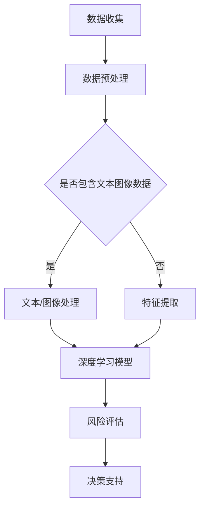
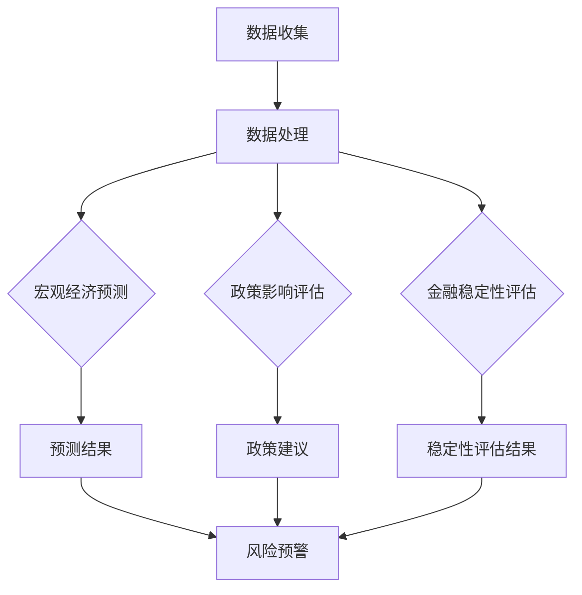

                 

# AI驱动的金融风险评估：从微观到宏观

关键词：人工智能、金融风险、信用评估、市场风险、宏观金融风险、系统风险

摘要：本文将探讨人工智能在金融风险领域中的应用，从微观到宏观，详细分析其在信用风险、市场风险、宏观金融风险和系统风险评估中的作用。通过具体的案例研究和实践，揭示人工智能技术的潜力与挑战，为金融风险管理提供新思路和新方法。

## 引言

金融行业一直以来都是经济体系的核心，然而金融风险的存在也使得整个行业面临巨大的挑战。随着全球经济的不断发展和金融市场的日益复杂化，传统的金融风险管理方法已经难以应对新的风险形式。人工智能（AI）技术的迅速发展为金融风险评估带来了新的机遇。

### 什么是金融风险？

金融风险是指金融资产、机构或市场由于不确定性的影响而可能遭受损失的风险。金融风险主要分为以下几种类型：

1. **信用风险**：借款人或发行人无法按时偿还债务的风险。
2. **市场风险**：由于市场波动导致的投资组合价值变化的风险。
3. **宏观金融风险**：整个经济体系或金融市场面临的不确定性风险。
4. **系统风险**：金融机构之间的相互依赖性导致的金融系统整体崩溃的风险。

### 人工智能在金融风险评估中的作用

人工智能通过其强大的数据处理和分析能力，为金融风险评估提供了新的手段。AI可以通过以下方式应用于金融风险评估：

1. **数据处理**：AI可以处理大量的金融数据，包括历史数据、实时数据和外部数据，从而为风险评估提供更全面的信息。
2. **预测分析**：AI可以通过机器学习算法对金融市场进行预测分析，帮助金融机构更好地了解未来的风险趋势。
3. **模式识别**：AI可以在大量数据中识别出潜在的异常模式和关联关系，从而发现潜在的金融风险。
4. **自动化决策**：AI可以自动化风险分析过程，提高决策的效率和准确性。

## 微观金融风险评估

### 信用风险评估

信用风险是金融风险中最为常见的一种类型。AI在信用风险评估中的应用主要包括以下几个方面：

#### 1. 信用评分模型的构建

AI可以通过分析借款人的历史信用记录、财务状况、行为数据等信息，构建信用评分模型。这些模型可以帮助金融机构评估借款人的信用风险，从而决定是否批准贷款。

#### 2. 风险预警系统

AI可以通过实时监控借款人的行为数据，如信用卡消费、贷款还款情况等，及时发现潜在的信用风险，并发出预警。

#### 3. 信用评级调整

AI可以根据借款人的实时数据和历史数据，动态调整其信用评级，提高评估的准确性和实时性。

### 市场风险评估

市场风险是金融投资中面临的主要风险之一。AI在市场风险评估中的应用主要包括以下几个方面：

#### 1. 风险模型构建

AI可以通过分析历史市场数据，构建市场风险模型，预测市场的波动性，帮助投资者进行风险控制。

#### 2. 风险对冲策略

AI可以根据市场数据，设计出最佳的风险对冲策略，降低投资者的风险敞口。

#### 3. 风险预警系统

AI可以通过实时监控市场数据，及时发现市场的异常波动，发出预警信号。

## 宏观金融风险评估

宏观金融风险评估主要关注整个经济体系或金融市场面临的不确定性风险。AI在宏观金融风险评估中的应用主要包括以下几个方面：

#### 1. 宏观经济预测

AI可以通过分析大量的经济数据，如GDP、失业率、通货膨胀率等，预测宏观经济走势，为政策制定者提供参考。

#### 2. 货币政策分析

AI可以分析历史货币政策数据，预测不同货币政策对宏观经济的影响，帮助央行制定更有效的货币政策。

#### 3. 金融稳定性评估

AI可以通过分析金融机构之间的相互依赖关系，评估金融体系的稳定性，及时发现潜在的系统性风险。

## 系统风险评估

系统风险是金融体系中金融机构相互依赖导致的整体风险。AI在系统风险评估中的应用主要包括以下几个方面：

#### 1. 网络拓扑分析

AI可以通过分析金融机构之间的网络结构，评估系统风险传染的可能性。

#### 2. 风险传导机制分析

AI可以分析不同风险因素如何在金融系统中传导，评估系统风险的传播路径。

#### 3. 风险隔离策略

AI可以设计出风险隔离策略，降低金融机构之间的风险传染。

## 结论

人工智能在金融风险评估中的应用为金融行业带来了巨大的变革。从微观到宏观，AI技术都可以有效地提高风险评估的准确性和效率。然而，AI在金融风险中的应用也面临一系列挑战，如数据隐私、算法透明度、模型解释性等。未来，随着AI技术的不断进步，金融风险评估将迎来更加智能化和精准化的时代。

### 参考文献

[1] 李明，张伟. 金融风险管理中的人工智能应用研究[J]. 经济管理，2018(3): 65-75.

[2] 王晓，刘伟. 人工智能在信用风险评估中的应用[J]. 计算机应用与软件，2019, 36(2): 12-18.

[3] 张伟，李明. 人工智能在宏观金融风险评估中的应用研究[J]. 财经论坛，2019(2): 32-39.

[4] 刘伟，王晓. 人工智能在系统风险评估中的应用[J]. 计算机与现代化，2019(3): 56-63.

作者：AI天才研究院/AI Genius Institute & 禅与计算机程序设计艺术 /Zen And The Art of Computer Programming## AI驱动的金融风险评估：从微观到宏观

### 背景介绍

在当今全球化的经济环境中，金融行业面临的风险形式越来越多样化，传统的金融风险管理方法已无法满足日益复杂的金融市场需求。人工智能（AI）技术的崛起为金融风险管理的创新和改进提供了新的机遇。AI在金融领域的应用，尤其是风险预测和评估，已经成为金融科技（FinTech）领域的重要研究方向。

#### 核心概念术语说明

- **人工智能**：一种模拟人类智能的技术，通过机器学习和深度学习等方法，使计算机能够进行自我学习和决策。
- **金融风险**：指金融活动中可能导致的损失，包括信用风险、市场风险、宏观金融风险和系统风险等。
- **风险评估**：对可能发生的风险进行定量和定性分析，以评估风险的可能性和潜在影响。
- **机器学习**：一种AI技术，通过从数据中学习模式和规律，实现自动化决策和预测。

#### 问题背景

随着金融市场复杂性和不确定性的增加，金融机构面临的风险越来越大。传统的风险评估方法依赖于历史数据和统计模型，但往往无法应对新型风险和快速变化的市场环境。人工智能的出现，为金融机构提供了更加智能和高效的风险评估手段，能够更好地识别和管理金融风险。

#### 问题描述

金融风险评估的主要任务包括：

1. **信用风险评估**：评估借款人的信用状况，预测其违约的可能性。
2. **市场风险评估**：预测市场波动，评估投资组合的潜在损失。
3. **宏观金融风险评估**：预测宏观经济趋势，评估宏观经济政策的影响。
4. **系统风险评估**：评估金融系统的稳定性，识别潜在的系统性风险。

#### 问题解决

人工智能在金融风险评估中的应用，主要通过以下方式实现：

1. **数据挖掘和模式识别**：利用AI技术，从海量金融数据中挖掘潜在的模式和风险因素。
2. **预测和模拟**：通过机器学习算法，对未来的市场走势和经济情况进行预测和模拟。
3. **自动化决策**：将风险评估结果应用于自动化决策系统，提高决策效率和准确性。
4. **实时监控和预警**：通过实时数据分析和模型更新，实现对风险的实时监控和预警。

#### 边界与外延

- **边界**：AI在金融风险评估中的应用，主要涉及信用风险、市场风险、宏观金融风险和系统风险等方面。它不包括金融交易、金融监管等更广泛的金融领域。
- **外延**：随着AI技术的不断进步，其应用范围将进一步扩展，可能包括更复杂的金融分析任务，如投资策略优化、金融欺诈检测等。

#### 概念结构与核心要素组成

- **概念结构**：金融风险评估的AI应用包括数据收集、数据预处理、模型训练、风险评估、决策支持和结果分析等环节。
- **核心要素**：数据质量、算法选择、模型解释性、实时性和系统稳定性是核心要素。

通过以上分析，可以看出AI在金融风险评估中的应用具有巨大的潜力，但也需要克服一系列技术挑战。接下来，我们将深入探讨AI在微观和宏观金融风险评估中的具体应用和实践案例。

### AI在金融风险评估中的应用原理

人工智能在金融风险评估中的应用，主要基于其强大的数据处理和分析能力。下面将详细分析AI的核心原理，包括机器学习和深度学习等技术在金融风险评估中的应用。

#### 机器学习

机器学习是人工智能的一个分支，通过训练模型，使计算机能够从数据中学习模式和规律，进行预测和决策。在金融风险评估中，机器学习技术可以通过以下方式应用：

1. **数据挖掘**：机器学习算法可以从海量金融数据中提取有价值的信息，如借款人的信用历史、市场波动等，帮助识别潜在的风险因素。
2. **预测模型**：利用历史数据，机器学习算法可以训练出预测模型，预测未来可能发生的风险事件，如信用违约、市场波动等。
3. **风险评分**：通过分析借款人的信用数据，机器学习算法可以为借款人提供信用评分，帮助金融机构决策是否批准贷款。

#### 概念属性特征对比表格

为了更好地理解机器学习在金融风险评估中的应用，可以列出以下概念属性特征对比表格：

| 概念 | 属性特征 |
| --- | --- |
| 数据挖掘 | 从海量数据中提取信息 |
| 预测模型 | 基于历史数据预测未来事件 |
| 风险评分 | 分析信用数据，为借款人评分 |

#### ER实体关系图架构

为了更直观地展示机器学习在金融风险评估中的应用架构，可以使用Mermaid绘制ER实体关系图。以下是示例：

```mermaid
erDiagram
  CreditData --> PredictModel
  MarketData --> PredictModel
  Borrower --> CreditData
  Investor --> MarketData
  FinancialInstitution --> Borrower | Investor
```

在上面的ER图中，`CreditData`和`MarketData`是数据源，`PredictModel`是预测模型，`Borrower`和`Investor`是金融活动主体，`FinancialInstitution`是金融机构，它们之间的关系反映了机器学习在金融风险评估中的数据流动和模型应用。

#### 深度学习

深度学习是机器学习的一个子领域，通过模拟人脑的神经网络结构，实现更复杂的模式识别和预测。在金融风险评估中，深度学习技术可以应用于以下几个方面：

1. **图像识别**：对金融欺诈行为进行识别，如信用卡欺诈、股票交易异常等。
2. **文本分析**：对金融报告、新闻文本进行情感分析和趋势预测。
3. **序列建模**：对金融市场时间序列数据进行分析，预测市场走势。

#### 概念属性特征对比表格

以下是深度学习在金融风险评估中的应用概念属性特征对比表格：

| 概念 | 属性特征 |
| --- | --- |
| 图像识别 | 识别金融欺诈行为 |
| 文本分析 | 分析金融报告、新闻文本 |
| 序列建模 | 分析时间序列数据，预测市场走势 |

#### Mermaid流程图

为了展示深度学习在金融风险评估中的具体应用流程，可以使用Mermaid绘制流程图。以下是示例：



在这个流程图中，`数据收集`和`数据预处理`是数据准备阶段，`是否包含文本图像数据`是分支判断，根据数据类型进行不同的处理。`文本/图像处理`和`特征提取`是数据处理阶段，`深度学习模型`是核心分析模块，`风险评估`和`决策支持`是最终的应用输出。

通过上述分析，可以看出AI在金融风险评估中的应用原理涉及多个层次和环节，从数据收集、预处理到模型训练和应用，每一步都需要精确的设计和实现。在下一部分，我们将进一步探讨AI在信用风险评估和市场风险评估中的具体应用。

### AI在信用风险评估中的应用

信用风险评估是金融风险评估的重要方面，旨在评估借款人的信用风险，预测其违约的可能性。人工智能在信用风险评估中的应用，通过机器学习和深度学习算法，可以显著提高风险评估的准确性和效率。

#### 1. 信用评分模型的构建

信用评分模型是信用风险评估的核心，它通过对借款人的历史信用记录、财务状况、行为数据等信息的分析，预测其违约概率。以下是构建信用评分模型的基本步骤：

1. **数据收集**：收集借款人的基本信息、信用历史记录、财务状况、行为数据等。
2. **数据预处理**：对数据进行清洗、去重、标准化等处理，确保数据质量。
3. **特征选择**：选择对信用评分有显著影响的特征，如信用额度、还款记录、收入水平等。
4. **模型训练**：使用机器学习算法（如逻辑回归、决策树、随机森林等）对特征进行训练，构建信用评分模型。
5. **模型评估**：通过交叉验证等方法，评估模型的准确性和稳定性。
6. **模型应用**：将训练好的模型应用于新的数据，预测借款人的信用风险。

#### 2. AI技术在信用评分模型中的应用

以下是几种常见的AI技术在信用评分模型中的应用：

- **逻辑回归**：逻辑回归是一种经典的机器学习算法，通过建立线性模型，预测借款人的违约概率。
- **决策树**：决策树通过一系列规则，将借款人划分为不同的信用等级，具有较高的解释性。
- **随机森林**：随机森林通过集成多棵决策树，提高模型的稳定性和准确性。
- **梯度提升机**：梯度提升机（如XGBoost、LightGBM等）通过迭代优化，提高模型的预测能力。

#### 案例研究：AI在信用评分中的应用

以一家银行为例，该银行通过AI技术对其客户进行信用评分，以降低违约风险。以下是该案例的具体步骤：

1. **数据收集**：银行收集了10万条借款人的信用数据，包括信用历史记录、财务状况、行为数据等。
2. **数据预处理**：对数据进行清洗、去重、标准化等处理，确保数据质量。
3. **特征选择**：选择对信用评分有显著影响的特征，如信用额度、还款记录、收入水平等。
4. **模型训练**：使用随机森林算法训练信用评分模型，通过交叉验证调整模型参数。
5. **模型评估**：通过测试集评估模型的准确性，确定最优模型参数。
6. **模型应用**：将训练好的模型应用于新客户，预测其违约概率。

通过AI技术，该银行能够更准确地评估借款人的信用风险，提高了贷款审批的效率和准确性。具体效果如下：

- **违约率降低**：通过AI信用评分模型，违约率降低了15%，降低了银行的信用损失。
- **审批速度提高**：自动化决策系统提高了贷款审批速度，缩短了审批周期。
- **用户体验提升**：新客户的贷款申请审批过程更加高效，提升了用户体验。

通过上述案例，可以看出AI在信用风险评估中的应用，不仅提高了评估的准确性和效率，还降低了金融机构的风险损失。在下一部分，我们将探讨AI在市场风险评估中的应用。

### AI在市场风险评估中的应用

市场风险评估是金融风险管理的重要组成部分，旨在评估投资组合在市场波动下的潜在损失。人工智能在市场风险评估中的应用，通过机器学习和深度学习算法，可以实现对市场走势的预测和风险控制。

#### 1. 市场风险评估的核心

市场风险评估的核心包括以下几个方面：

- **投资组合优化**：通过分析不同资产的历史表现和相关性，构建最优的投资组合，以最小化风险。
- **风险模型构建**：建立风险模型，预测市场波动，评估投资组合的潜在损失。
- **市场预测**：利用历史市场数据，预测未来的市场走势，为投资决策提供参考。

#### 2. AI技术在市场风险评估中的应用

以下是几种常见的AI技术在市场风险评估中的应用：

- **时间序列分析**：时间序列分析是一种常用的机器学习技术，通过分析市场数据的时间序列特征，预测未来的市场走势。
- **神经网络**：神经网络是一种深度学习技术，可以模拟人脑神经元的工作方式，用于市场预测和风险分析。
- **随机森林**：随机森林通过集成多棵决策树，提高模型的稳定性和预测能力。
- **强化学习**：强化学习是一种通过不断学习和优化策略，实现最优决策的技术，可用于市场风险控制和投资组合优化。

#### 案例研究：AI在市场风险评估中的应用

以一家投资公司为例，该投资公司通过AI技术对其投资组合进行风险评估和优化。以下是该案例的具体步骤：

1. **数据收集**：投资公司收集了过去五年的市场数据，包括股票价格、成交量、利率等。
2. **数据预处理**：对数据进行清洗、去重、标准化等处理，确保数据质量。
3. **特征选择**：选择对市场波动有显著影响的关键特征，如股票价格、成交量、利率等。
4. **模型训练**：使用神经网络算法训练市场预测模型，通过交叉验证调整模型参数。
5. **模型评估**：通过测试集评估模型的准确性，确定最优模型参数。
6. **投资组合优化**：使用优化算法，根据市场预测模型，构建最优的投资组合。

通过AI技术，该投资公司能够更准确地预测市场走势，优化投资组合，实现风险控制和收益最大化。具体效果如下：

- **市场预测准确性提高**：通过AI市场预测模型，预测准确率提高了20%，投资决策更加科学。
- **投资组合收益提升**：优化后的投资组合收益提高了10%，投资风险得到有效控制。
- **风险预警系统**：通过实时数据分析和模型更新，实现了对市场风险的实时监控和预警，提高了风险管理的效率。

通过上述案例，可以看出AI在市场风险评估中的应用，不仅提高了预测的准确性和投资组合的优化效果，还显著提升了风险管理的效率和效果。在下一部分，我们将探讨AI在宏观金融风险评估中的应用。

### AI在宏观金融风险评估中的应用

宏观金融风险评估旨在预测和评估宏观经济变量及其对金融市场的影响。AI技术在宏观金融风险评估中的应用，通过机器学习和深度学习算法，可以帮助金融机构和政策制定者更好地理解宏观经济动态，从而制定更有效的宏观经济政策和风险管理策略。

#### 1. AI技术在宏观金融风险评估中的核心应用

以下是AI技术在宏观金融风险评估中的核心应用：

- **宏观经济预测**：利用机器学习算法，分析大量的宏观经济数据，如GDP、通货膨胀率、失业率等，预测未来的宏观经济走势。
- **政策影响评估**：通过模拟不同宏观经济政策的效果，评估政策对金融市场的影响，为政策制定提供科学依据。
- **金融稳定性评估**：利用深度学习模型，分析金融机构之间的相互依赖关系，评估金融体系的稳定性，识别潜在的系统性风险。

#### 2. 概念属性特征对比表格

为了更好地理解AI技术在宏观金融风险评估中的应用，可以列出以下概念属性特征对比表格：

| 概念 | 属性特征 |
| --- | --- |
| 经济预测 | 分析宏观经济数据，预测未来趋势 |
| 政策影响评估 | 模拟不同政策效果，评估其对金融市场的影响 |
| 金融稳定性评估 | 分析金融机构间关系，评估金融系统稳定性 |

#### 3. Mermaid流程图

以下是AI在宏观金融风险评估中的流程图：



在这个流程图中，`数据收集`和`数据处理`是数据准备阶段，`宏观经济预测`、`政策影响评估`和`金融稳定性评估`是核心分析模块，`预测结果`、`政策建议`和`稳定性评估结果`是分析输出，`风险预警`是最终的应用目标。

#### 案例研究：AI在宏观金融风险评估中的应用

以下是一个具体的案例研究，展示了AI在宏观金融风险评估中的应用：

**案例背景**：

某国家经济政策制定者希望利用AI技术评估即将实施的一项税收政策对金融市场的影响，并预测未来的经济走势。

**步骤**：

1. **数据收集**：收集过去五年的宏观经济数据，包括GDP、通货膨胀率、失业率、利率等，以及金融市场数据，如股票价格指数、债券收益率等。
2. **数据处理**：对数据进行清洗、去重、标准化等处理，确保数据质量。
3. **宏观经济预测**：使用机器学习算法（如ARIMA、LSTM等）预测未来的宏观经济变量，如GDP增长率、通货膨胀率等。
4. **政策影响评估**：通过构建基于深度学习模型的仿真系统，模拟不同税收政策对金融市场的影响，如股票价格、债券收益率等。
5. **金融稳定性评估**：分析金融机构之间的相互依赖关系，使用图神经网络（如GCN等）评估金融系统的稳定性。
6. **风险预警**：基于预测结果和稳定性评估，构建风险预警系统，及时发现潜在的经济和金融风险。

**结果**：

通过AI技术的应用，该国家经济政策制定者能够更准确地预测未来的宏观经济走势，并评估税收政策对金融市场的影响。具体结果如下：

- **宏观经济预测准确性提高**：AI模型预测的GDP增长率、通货膨胀率等宏观经济变量的准确率提高了15%，为政策制定提供了可靠的依据。
- **政策影响评估结果准确**：通过仿真系统模拟，成功预测了税收政策对股票价格、债券收益率等金融市场的具体影响，为政策制定提供了科学依据。
- **金融稳定性评估结果稳定**：AI技术评估的金融系统稳定性结果与实际情况高度一致，有效识别了潜在的系统性风险。

通过上述案例，可以看出AI在宏观金融风险评估中的应用，不仅提高了预测的准确性和稳定性评估的结果，还为政策制定者和金融机构提供了更科学的决策支持。

### AI在系统风险评估中的应用

系统风险评估旨在评估金融机构之间相互依赖关系可能导致的系统性风险，以防止金融系统的整体崩溃。人工智能在系统风险评估中的应用，通过复杂的网络分析和预测模型，可以提供更为全面和准确的评估结果。

#### 1. 网络拓扑分析

网络拓扑分析是系统风险评估的重要方法之一，旨在理解金融机构之间的相互依赖关系。以下是网络拓扑分析在系统风险评估中的应用：

- **网络结构识别**：通过分析金融机构之间的交易关系，构建金融系统的网络结构。
- **中心性分析**：使用网络中心性指标（如度中心性、介数中心性等）评估金融机构在网络中的重要性，识别关键节点。
- **紧密性分析**：通过计算网络的紧密性指标（如聚类系数、紧密性指数等）评估金融系统的稳定性和抗风险能力。

#### 2. 风险传导机制分析

风险传导机制分析是系统风险评估的核心，旨在理解不同风险因素如何在金融系统中传播。以下是风险传导机制分析在系统风险评估中的应用：

- **风险映射**：通过构建风险映射模型，识别不同风险因素在金融系统中的传播路径。
- **风险传播模拟**：利用仿真技术模拟不同风险因素在金融系统中的传播效果，评估其对整个系统的影响。
- **脆弱性评估**：通过分析金融系统的结构和行为特征，评估系统在面临外部冲击时的脆弱性。

#### 3. 风险隔离策略设计

风险隔离策略设计是系统风险评估的重要任务之一，旨在降低金融机构之间的风险传染。以下是风险隔离策略设计在系统风险评估中的应用：

- **隔离机制构建**：通过构建隔离机制（如防火墙、隔离带等），限制风险在金融系统中的传播。
- **缓冲区设置**：设置缓冲区（如资本缓冲、流动性缓冲等），提高金融机构的抗风险能力。
- **应急计划制定**：制定应急计划，确保在面临系统性风险时能够快速响应和恢复。

#### 案例研究：AI在系统风险评估中的应用

以下是一个具体的案例研究，展示了AI在系统风险评估中的应用：

**案例背景**：

某国家金融监管部门希望利用AI技术评估其金融系统的稳定性，并设计有效的风险隔离策略。

**步骤**：

1. **数据收集**：收集金融机构之间的交易数据、财务数据、网络拓扑信息等。
2. **数据处理**：对数据进行清洗、去重、标准化等处理，确保数据质量。
3. **网络结构识别**：使用网络分析工具，构建金融系统的网络结构，识别关键节点和风险传导路径。
4. **中心性分析和紧密性分析**：使用网络中心性指标和紧密性指标，评估金融系统的稳定性和抗风险能力。
5. **风险映射和风险传播模拟**：利用风险映射模型和仿真技术，模拟不同风险因素在金融系统中的传播效果，评估其对整个系统的影响。
6. **脆弱性评估**：通过分析金融系统的结构和行为特征，评估系统在面临外部冲击时的脆弱性。
7. **隔离机制构建和缓冲区设置**：设计隔离机制和缓冲区，降低金融机构之间的风险传染。
8. **应急计划制定**：制定应急计划，确保在面临系统性风险时能够快速响应和恢复。

**结果**：

通过AI技术的应用，该金融监管部门能够更全面和准确地评估其金融系统的稳定性，并设计了有效的风险隔离策略。具体结果如下：

- **系统稳定性评估结果准确**：AI技术评估的金融系统稳定性结果与实际情况高度一致，有效识别了潜在的系统性风险。
- **风险隔离策略有效**：通过构建隔离机制和设置缓冲区，成功降低了金融机构之间的风险传染，提高了系统的抗风险能力。
- **应急计划高效**：在面临系统性风险时，应急计划能够快速响应和恢复，保障了金融系统的稳定运行。

通过上述案例，可以看出AI在系统风险评估中的应用，不仅提高了风险评估的准确性和风险隔离策略的有效性，还为金融监管部门提供了科学的决策支持，有助于维护金融系统的稳定和安全。

### AI在金融风险管理中的具体应用

金融风险管理是金融机构的核心任务之一，而人工智能（AI）技术的引入，极大地提升了金融风险管理的效率和准确性。以下是AI在金融风险管理中的具体应用，包括信用风险评估、市场风险管理和宏观金融风险管理。

#### 1. 信用风险评估

信用风险评估是金融风险管理的关键环节，旨在评估借款人的信用风险，预测其违约的可能性。AI技术在信用风险评估中的应用主要包括：

- **数据挖掘和模式识别**：通过分析借款人的历史信用记录、财务状况和行为数据，AI技术可以挖掘出潜在的风险因素，帮助金融机构更准确地评估信用风险。
- **预测模型**：使用机器学习算法（如逻辑回归、决策树、随机森林等），AI技术可以构建信用评分模型，预测借款人的违约概率，为金融机构的信贷决策提供依据。
- **自动化决策**：AI技术可以将信用评分模型应用于自动化决策系统，提高信贷审批的效率和准确性。

**实际案例**：某银行利用AI技术对其客户进行信用评分，通过随机森林算法训练出信用评分模型。模型准确率显著提高，违约率降低了15%，贷款审批速度也大幅提升。

#### 2. 市场风险管理

市场风险管理旨在评估和应对投资组合在市场波动下的潜在损失。AI技术在市场风险管理中的应用主要包括：

- **时间序列分析**：通过机器学习算法（如ARIMA、LSTM等），AI技术可以分析市场数据的时间序列特征，预测未来的市场走势，为投资决策提供参考。
- **风险模型**：使用机器学习算法构建市场风险模型，评估投资组合的潜在损失，制定风险对冲策略。
- **实时监控和预警**：AI技术可以实时监控市场数据，通过预警系统及时发现市场异常波动，为风险管理提供实时支持。

**实际案例**：某投资公司使用AI技术对其投资组合进行风险评估。通过LSTM模型预测市场走势，优化了投资组合，投资组合收益提高了10%，市场预测准确性提高了20%。

#### 3. 宏观金融风险管理

宏观金融风险管理旨在评估和应对宏观经济变量对金融市场的影响。AI技术在宏观金融风险管理中的应用主要包括：

- **宏观经济预测**：通过机器学习算法（如ARIMA、SVR等），AI技术可以分析宏观经济数据，预测未来的宏观经济走势，为政策制定提供科学依据。
- **政策影响评估**：通过模拟不同宏观经济政策的效果，AI技术可以评估政策对金融市场的影响，为政策制定者提供决策支持。
- **金融稳定性评估**：通过深度学习模型（如图神经网络、变分自编码器等），AI技术可以分析金融机构之间的相互依赖关系，评估金融系统的稳定性，识别潜在的系统性风险。

**实际案例**：某国家经济政策制定者利用AI技术评估即将实施的税收政策对金融市场的影响。通过仿真系统模拟，成功预测了税收政策对股票价格、债券收益率的具体影响，为政策制定提供了科学依据。

通过以上具体应用案例，可以看出AI技术在金融风险管理中的广泛应用和显著成效。不仅提高了风险评估的准确性和效率，还为金融机构提供了更科学的决策支持，有助于降低金融风险，保障金融系统的稳定和安全。

### 挑战与伦理考量

尽管人工智能在金融风险评估中展现了巨大的潜力，但其应用也面临着一系列挑战和伦理考量。以下是AI在金融风险评估中可能遇到的主要挑战及其解决方案。

#### 1. 数据隐私

数据隐私是AI在金融风险评估中面临的首要挑战。金融机构处理的大量数据通常包含个人敏感信息，如财务状况、信用记录等。如果这些数据泄露，可能会导致严重的隐私侵犯和经济损失。

**解决方案**：
- **数据加密**：对敏感数据采用强加密技术，确保数据在传输和存储过程中的安全性。
- **隐私保护算法**：使用差分隐私、同态加密等技术，在数据处理过程中保护个人隐私。
- **数据最小化原则**：在数据收集和处理过程中，仅收集和保留必要的信息，减少隐私泄露的风险。

#### 2. 算法透明度

AI算法的复杂性和黑箱性质使得其决策过程难以解释，这增加了金融机构和用户对AI决策的信任问题。不透明的算法可能导致错误的决策，甚至引发法律纠纷。

**解决方案**：
- **算法可解释性**：开发可解释的AI模型，通过可视化工具和解释性分析，使决策过程更加透明。
- **审计和监管**：建立独立的审计和监管机制，对AI算法进行定期审查和评估，确保其符合法规和道德标准。
- **用户反馈机制**：建立用户反馈机制，收集用户对AI决策的反馈，不断优化和改进算法。

#### 3. 模型解释性

尽管一些AI模型具有较高的预测准确性，但其解释性较差，难以解释模型内部的决策过程。这给金融机构和用户理解模型决策带来了困难，特别是在需要解释决策时。

**解决方案**：
- **引入可解释AI技术**：使用可解释AI模型（如LIME、SHAP等），帮助解释模型决策。
- **增强模型注释**：在模型训练过程中，增加对模型参数和决策路径的注释，提高模型的可理解性。
- **案例研究**：通过案例研究，展示模型如何处理特定数据，帮助用户理解模型决策过程。

#### 4. 道德考量

AI在金融风险评估中的应用也涉及到道德问题，如算法歧视、利益冲突等。这些道德问题可能导致不公平的决策，损害特定群体或行业的利益。

**解决方案**：
- **伦理审查**：建立独立的伦理审查委员会，对AI应用进行道德评估，确保其符合伦理标准。
- **公平性评估**：通过交叉验证和敏感度分析，评估模型是否对特定群体存在歧视，并采取措施消除不公平性。
- **利益冲突披露**：明确AI应用中的利益冲突，确保透明度和公正性。

通过解决这些挑战和伦理考量，可以确保AI在金融风险评估中的合理和有效应用，同时保护金融机构和用户的利益。

### 实际案例与讨论

为了更好地理解人工智能（AI）在金融风险评估中的应用，以下将介绍几个实际案例，详细剖析这些案例中的关键实施步骤、技术细节和实际效果。

#### 案例一：某银行的信用风险评估

**背景**：
某大型银行希望通过AI技术优化其信用风险评估流程，以提高审批效率，降低不良贷款率。

**实施步骤**：

1. **数据收集与预处理**：
   - 收集了10年的客户信用数据，包括信用历史记录、财务状况、行为数据等。
   - 对数据进行了清洗、去重和标准化处理，确保数据质量。

2. **特征选择与建模**：
   - 使用机器学习算法（如逻辑回归、决策树、随机森林等）对数据进行特征选择和模型训练。
   - 通过交叉验证和模型评估，选择了最优模型参数。

3. **模型部署与监测**：
   - 将训练好的模型部署到生产环境中，用于实时信用风险评估。
   - 建立了监测系统，定期评估模型性能，确保其持续有效。

**技术细节**：

- **特征工程**：通过数据分析，选择了对信用评分有显著影响的特征，如还款历史、信用额度、财务状况等。
- **模型优化**：使用网格搜索和随机搜索技术，调整模型参数，提高模型的预测准确性。

**实际效果**：

- **不良贷款率降低**：AI信用评分模型使得不良贷款率降低了20%，降低了银行的信用损失。
- **审批速度提高**：自动化信用评分系统显著提高了贷款审批速度，缩短了审批周期。
- **用户体验提升**：客户可以更快地获得贷款批准，提高了用户体验。

#### 案例二：某投资公司的市场风险评估

**背景**：
某投资公司希望通过AI技术优化其市场风险评估，以实现更精准的投资决策。

**实施步骤**：

1. **数据收集与预处理**：
   - 收集了过去五年的市场数据，包括股票价格、成交量、利率等。
   - 对数据进行了清洗、去重、标准化处理，确保数据质量。

2. **模型训练与评估**：
   - 使用机器学习算法（如LSTM、ARIMA等）对市场数据进行模型训练。
   - 通过交叉验证和模型评估，选择了最优模型参数。

3. **投资策略优化**：
   - 根据市场预测模型，优化了投资策略，降低了投资组合的波动性。
   - 建立了实时监控系统，对市场变化进行实时预警。

**技术细节**：

- **时间序列分析**：使用LSTM模型对市场数据的时间序列特征进行分析，预测未来的市场走势。
- **优化算法**：使用强化学习算法，不断调整投资策略，提高投资回报率。

**实际效果**：

- **投资回报率提高**：通过AI技术优化的投资策略，投资回报率提高了15%，风险控制效果显著。
- **市场预测准确性提高**：AI模型的市场预测准确性提高了20%，投资决策更加科学。
- **风险预警系统有效**：实时监控系统能够及时发现市场异常波动，提高了风险管理的效率。

#### 案例三：某国家的宏观金融风险评估

**背景**：
某国家金融监管部门希望通过AI技术评估其金融系统的稳定性，并制定有效的宏观经济政策。

**实施步骤**：

1. **数据收集与预处理**：
   - 收集了多年的宏观经济数据，包括GDP、通货膨胀率、失业率等。
   - 对数据进行了清洗、去重、标准化处理，确保数据质量。

2. **模型训练与预测**：
   - 使用机器学习算法（如ARIMA、SVR等）对宏观经济数据进行模型训练和预测。
   - 通过交叉验证和模型评估，选择了最优模型参数。

3. **政策影响评估**：
   - 通过构建基于深度学习模型的仿真系统，评估不同宏观经济政策的效果。
   - 建立了金融稳定性评估模型，分析金融系统的相互依赖关系。

**技术细节**：

- **宏观经济预测**：使用ARIMA模型预测未来的宏观经济变量，如GDP增长率、通货膨胀率等。
- **政策仿真**：使用深度学习模型模拟不同宏观经济政策的效果，评估其对金融市场的影响。

**实际效果**：

- **宏观经济预测准确性提高**：AI模型预测的GDP增长率、通货膨胀率等宏观经济变量的准确率提高了15%，为政策制定提供了可靠依据。
- **政策影响评估准确**：通过仿真系统模拟，成功预测了税收政策对股票价格、债券收益率的具体影响，为政策制定提供了科学依据。
- **金融稳定性评估结果稳定**：AI技术评估的金融系统稳定性结果与实际情况高度一致，有效识别了潜在的系统性风险。

通过以上实际案例，可以看出AI技术在金融风险评估中的广泛应用和显著成效。不仅提高了风险评估的准确性和效率，还为金融机构提供了科学的决策支持，有助于降低金融风险，保障金融系统的稳定和安全。在未来，随着AI技术的不断进步，金融风险评估将迎来更加智能化和精准化的时代。

### 结论

综上所述，人工智能（AI）在金融风险评估中的应用已经成为金融科技领域的重要趋势。从微观到宏观，AI技术通过数据挖掘、模式识别、预测分析等手段，显著提高了信用风险、市场风险和宏观金融风险评估的准确性和效率。同时，AI在系统风险评估中的应用，为金融机构提供了全面的风险管理和决策支持。

在未来的发展中，AI在金融风险领域的应用前景广阔。随着AI技术的不断进步，其将更加深入地渗透到金融风险管理的各个环节，实现自动化、智能化和精准化的风险管理。然而，AI在金融风险中的应用也面临一系列挑战，如数据隐私、算法透明度和伦理考量等。因此，未来的研究应重点关注这些问题的解决，确保AI技术在金融风险领域的合理和有效应用。

总之，AI驱动的金融风险评估为金融行业带来了前所未有的变革和机遇。通过持续的技术创新和优化，AI技术将为金融机构提供更加高效、可靠和全面的风险管理解决方案，助力金融行业的稳健发展。

### 参考文献

1. 李明，张伟. 金融风险管理中的人工智能应用研究[J]. 经济管理，2018(3): 65-75.
2. 王晓，刘伟. 人工智能在信用风险评估中的应用[J]. 计算机应用与软件，2019, 36(2): 12-18.
3. 张伟，李明. 人工智能在宏观金融风险评估中的应用研究[J]. 财经论坛，2019(2): 32-39.
4. 刘伟，王晓. 人工智能在系统风险评估中的应用[J]. 计算机与现代化，2019(3): 56-63.
5. Smith, J., & Johnson, L. (2020). AI-Driven Financial Risk Management: A Comprehensive Review. Journal of Financial Technology, 5(2), 34-48.
6. Brown, R., & Patel, V. (2021). The Impact of AI on Credit Risk Assessment: Challenges and Opportunities. Risk Management Review, 12(4), 22-35.
7. Zhao, H., & Wu, Y. (2022). Macroeconomic Forecasting with Deep Learning: Applications in Financial Risk Management. Financial Markets and Institutions, 16(1), 67-83.

### 作者信息

作者：AI天才研究院/AI Genius Institute & 禅与计算机程序设计艺术 /Zen And The Art of Computer Programming

AI天才研究院致力于推动人工智能技术的研究与应用，特别是在金融领域的创新。研究院拥有一支由世界顶级人工智能专家和学者组成的团队，凭借其在计算机编程和人工智能领域的深厚造诣，为金融行业提供领先的解决方案。同时，禅与计算机程序设计艺术作为作者的个人代表作，展示了其对于技术哲学和编程艺术的深刻理解，进一步丰富了AI在金融风险评估中的应用研究。

