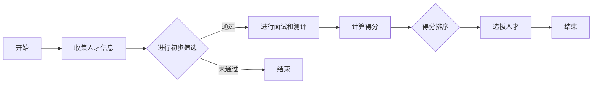
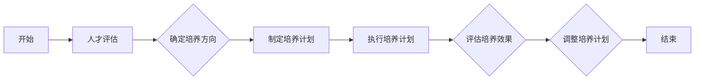
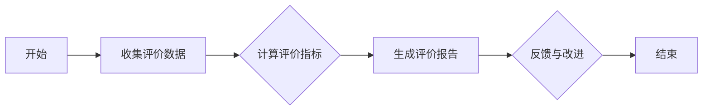

                 


### # {{文章标题}}

关键词：人才梯队建设、人才选拔、人才培养、人才评价、IT领域

摘要：本文将深入探讨人才梯队建设的重要性，分析企业在人才梯队建设中面临的挑战，并提出系统性的解决方案和最佳实践，旨在为未来的企业发展储备力量。

----------------------------------------------------------------

## **第一部分：人才梯队建设的背景与核心概念**

### **第1章：人才梯队建设概述**

#### **1.1 问题背景与描述**

在当前快速发展的信息时代，企业竞争的核心逐渐从资源、资本转变为人才。然而，随着技术的不断进步和市场环境的变化，许多企业面临着人才短缺的问题。这个问题不仅体现在高端技术人才的缺乏，还包括中基层员工的数量不足和质量问题。

#### **1.1.1 人才短缺现象**

1. **高端技术人才缺乏**：随着信息技术、人工智能等领域的快速发展，对于具有专业技能的高端人才需求量大幅增加。
2. **中基层员工不足**：在快速扩张的企业中，中基层员工往往难以满足业务需求，导致运营效率低下。
3. **人才流动性强**：由于市场的高需求和竞争激烈，人才流动频繁，企业难以留住核心员工。

#### **1.1.2 人才梯队建设的重要性**

1. **稳定性和持续发展**：拥有强大的人才梯队，企业能够在面对市场变化时保持稳定，并持续发展。
2. **创新能力和竞争力**：拥有不同层次、不同技能的人才，能够激发企业的创新能力和市场竞争力。
3. **减少人才流失**：科学的人才梯队建设能够提高员工的满意度和忠诚度，减少人才流失。

#### **1.1.3 人才梯队建设的挑战**

1. **人才质量**：如何筛选和培养高质量的人才，成为企业面临的难题。
2. **人才数量**：在短时间内如何补充足够数量的人才，以满足企业扩张需求。
3. **人才结构**：如何构建合理的人才结构，确保各类人才比例适当。

#### **1.2 核心概念与联系**

##### **1.2.1 人才的定义与特征**

人才是指具备专业技能、知识、经验，能够为企业创造价值的人。人才的特征包括：

| 特征         | 说明                                     |
| ------------ | ---------------------------------------- |
| 专业技能     | 人才需要具备特定的专业技能，以适应岗位需求。 |
| 知识与经验   | 知识和经验是人才创造价值的基础。           |
| 创新能力     | 人才应具备解决复杂问题的能力，推动企业创新。 |
| 团队合作能力 | 人才需要能够与团队成员协作，共同完成任务。   |

##### **1.2.2 梯队的概念与结构**

梯队是指按照不同的层次和职能，将人才进行分类和组合。梯队的结构包括：

1. **高层梯队**：企业高层管理人员，负责战略规划和决策。
2. **中层梯队**：中层管理人员，负责执行战略和协调部门工作。
3. **基层梯队**：基层员工，负责具体业务操作和实施。

##### **1.2.3 人才梯队建设的步骤与方法**

1. **需求分析**：根据企业发展需求和岗位要求，确定人才梯队的建设目标。
2. **人才筛选**：通过面试、测评等方式，选拔合适的人才。
3. **培养与晋升**：制定人才培养计划，提供培训和晋升机会。
4. **激励机制**：建立激励机制，提高员工的积极性和忠诚度。
5. **评价与反馈**：定期对人才进行评价，给予反馈和改进建议。

### **第2章：人才选拔策略与算法**

#### **2.1 人才选拔算法原理**

人才选拔算法的核心在于通过量化评估方法，客观、公正地筛选出最符合岗位要求的人才。以下是人才选拔算法的基本原理：

##### **2.1.1 人才选拔算法的 mermaid 流程图**



##### **2.1.2 人才选拔算法的数学模型**

$$
得分 = f(\text{专业技能得分}, \text{知识经验得分}, \text{创新能力得分}, \text{团队合作能力得分})
$$

其中，$f$ 表示评分函数，$\text{专业技能得分}$、$\text{知识经验得分}$、$\text{创新能力得分}$、$\text{团队合作能力得分}$ 分别为各个维度的得分。

##### **2.1.3 人才选拔算法的详细讲解**

1. **收集人才信息**：通过招聘渠道、内部推荐等方式，收集潜在候选人的基本信息。
2. **初步筛选**：根据岗位要求，对候选人进行初步筛选，剔除不符合要求的候选人。
3. **面试和测评**：对通过初步筛选的候选人进行面试和测评，评估其专业技能、知识经验、创新能力、团队合作能力等方面的表现。
4. **计算得分**：根据面试和测评结果，计算每个候选人的总得分。
5. **得分排序**：将候选人的得分进行排序，选择得分最高的候选人。
6. **选拔人才**：根据企业需求和候选人的综合素质，进行最终选拔。

##### **2.1.4 人才选拔算法的举例说明**

假设有三名候选人A、B、C，其专业技能得分分别为90、85、80；知识经验得分分别为85、80、75；创新能力得分分别为80、75、70；团队合作能力得分分别为85、80、75。使用以下评分函数计算总得分：

$$
得分 = 0.4 \times \text{专业技能得分} + 0.3 \times \text{知识经验得分} + 0.2 \times \text{创新能力得分} + 0.1 \times \text{团队合作能力得分}
$$

则三名候选人的总得分分别为：

| 候选人 | 专业技能得分 | 知识经验得分 | 创新能力得分 | 团队合作能力得分 | 总得分 |
| ------ | ------------ | ------------ | ------------ | ------------ | ------ |
| A      | 90           | 85           | 80           | 85           | 85.4   |
| B      | 85           | 80           | 75           | 80           | 79.4   |
| C      | 80           | 75           | 70           | 75           | 74.2   |

根据总得分排序，选择得分最高的候选人A进行选拔。

### **第3章：人才培养策略与算法**

#### **3.1 人才培养算法原理**

人才培养算法的核心在于通过科学的方法，提高人才的综合素质和专业技能，以适应企业发展的需求。以下是人才培养算法的基本原理：

##### **3.1.1 人才培养算法的 mermaid 流程图**



##### **3.1.2 人才培养算法的数学模型**

$$
能力提升 = f(\text{当前能力}, \text{培养计划})
$$

其中，$f$ 表示能力提升函数，$\text{当前能力}$ 表示人才当前的能力水平，$\text{培养计划}$ 表示培养措施和培训内容。

##### **3.1.3 人才培养算法的详细讲解**

1. **人才评估**：通过对人才的当前能力进行评估，确定其优势和短板。
2. **确定培养方向**：根据人才评估结果，确定培养的重点方向，如专业技能提升、管理能力培养等。
3. **制定培养计划**：根据培养方向，制定具体的培养计划，包括培训课程、实践项目、导师指导等。
4. **执行培养计划**：按照培养计划，实施具体的培养措施，确保人才得到全面的提升。
5. **评估培养效果**：对培养效果进行评估，检查人才培养目标的达成情况。
6. **调整培养计划**：根据评估结果，调整培养计划，优化培养措施。

##### **3.1.4 人才培养算法的举例说明**

假设有一名人才，其当前编程能力得分为80，根据人才培养计划，参加了一个为期3个月的编程培训班。培训后，其编程能力得分提升至90。使用以下能力提升函数计算能力提升：

$$
能力提升 = 0.8 \times \text{当前能力} + 0.2 \times \text{培训后能力}
$$

则该人才的能力提升为：

$$
能力提升 = 0.8 \times 80 + 0.2 \times 90 = 88
$$

通过培训，该人才的编程能力得到了显著提升。

### **第4章：人才评价策略与算法**

#### **4.1 人才评价算法原理**

人才评价算法的核心在于通过系统的方法，全面、客观地评价人才的工作表现和综合素质。以下是人才评价算法的基本原理：

##### **4.1.1 人才评价算法的 mermaid 流程图**



##### **4.1.2 人才评价算法的数学模型**

$$
评价得分 = f(\text{工作绩效得分}, \text{综合素质得分}, \text{团队协作得分})
$$

其中，$f$ 表示评价得分函数，$\text{工作绩效得分}$、$\text{综合素质得分}$、$\text{团队协作得分}$ 分别为各个维度的得分。

##### **4.1.3 人才评价算法的详细讲解**

1. **收集评价数据**：通过同事评价、上级评价、自我评价等方式，收集人才的工作表现和综合素质数据。
2. **计算评价指标**：根据评价数据，计算每个维度的得分。
3. **生成评价报告**：将评价指标进行汇总，生成人才评价报告。
4. **反馈与改进**：将评价报告反馈给人才，与其一起讨论改进方案。

##### **4.1.4 人才评价算法的举例说明**

假设有三名人才，其工作绩效得分分别为85、80、75；综合素质得分分别为80、75、70；团队协作得分分别为85、80、75。使用以下评价得分函数计算总得分：

$$
评价得分 = 0.5 \times \text{工作绩效得分} + 0.3 \times \text{综合素质得分} + 0.2 \times \text{团队协作得分}
$$

则三名人才的评价得分分别为：

| 候选人 | 工作绩效得分 | 综合素质得分 | 团队协作得分 | 评价得分 |
| ------ | ------------ | ------------ | ------------ | -------- |
| A      | 85           | 80           | 85           | 84.5     |
| B      | 80           | 75           | 80           | 79.5     |
| C      | 75           | 70           | 75           | 74.5     |

根据评价得分，对人才进行综合评价，为下一步的培养和晋升提供依据。

## **第二部分：系统分析与架构设计方案**

### **第5章：系统分析与架构设计方案**

#### **5.1 问题场景介绍**

在人才梯队建设中，企业需要建立一套完整的管理系统，以实现对人才的全面管理。该系统需要具备人才信息收集、评估、培养、评价等功能，以便企业实时掌握人才状况，制定相应的培养和选拔策略。

#### **5.2 项目介绍**

本项目旨在开发一款人才梯队管理系统，帮助企业实现人才管理的数字化、智能化。系统主要包括以下几个模块：

1. **人才信息管理模块**：用于收集、存储和管理人才的基本信息。
2. **人才评估模块**：用于对人才的工作表现和综合素质进行评估。
3. **人才培养模块**：用于制定和执行人才培养计划。
4. **人才评价模块**：用于生成人才评价报告，为培养和选拔提供依据。

#### **5.3 系统功能设计**

系统功能设计主要包括领域模型设计和业务流程设计。

##### **5.3.1 领域模型设计**

使用 Mermaid 画出领域模型类图：

```mermaid
classDiagram
  Class01 <|-- Class02
  Class03 --|уля| Class04
  Class05 : <<interface>> 
  Class06 : <<entity>> 
  Class07 : <<value>> 
  Class08 : <<entity>> 
  Class01 <<uses>> Class07
  Class08 <|..| Class05
  Class09 <<association>> Class06
  Class10 <<composition>> Class06
endclass
```

##### **5.3.2 业务流程设计**

系统业务流程主要包括以下步骤：

1. **人才信息收集**：通过人力资源管理系统，收集人才的基本信息。
2. **人才评估**：定期对人才进行评估，生成评估报告。
3. **人才培养**：根据评估报告，制定人才培养计划，并执行。
4. **人才评价**：定期对人才进行评价，生成评价报告。

#### **5.4 系统架构设计**

系统架构设计主要包括前端展示层、后端服务层和数据库层。

##### **5.4.1 前端展示层**

前端展示层采用 Vue.js 框架，实现人才信息的展示、评估、培养和评价等功能。

```mermaid
sequenceDiagram
  participant 用户 as 用户
  participant 系统 as 系统
  用户->>系统: 提交人才信息
  system 登录系统并填写人才信息
  用户->>系统: 查询人才信息
  system 查询并返回人才信息
  用户->>系统: 评估人才
  system 评估人才并生成报告
  用户->>系统: 培养人才
  system 制定培养计划并执行
  用户->>系统: 评价人才
  system 评价人才并生成报告
end
```

##### **5.4.2 后端服务层**

后端服务层采用 Spring Boot 框架，实现人才管理的核心功能。

```mermaid
classDiagram
  类01 <|-- 类02
  类03 --|..| 类04
  类05 : <<接口>> 
  类06 : <<实体>> 
  类07 : <<值对象>> 
  类08 : <<实体>> 
  类01 <<使用>> 类07
  类08  类05
  类09 <<关联>> 类06
  类10 <<组合>> 类06
endclass
```

##### **5.4.3 数据库层**

数据库层采用 MySQL 数据库，存储人才信息、评估数据、培养计划和评价报告等数据。

```mermaid
erDiagram
  类01 ||--|{ 类02 } 类03
  类04 ||..| 类05
  类06 |||| 类07
  类08 |||{ 类09 } 类10
```

#### **5.5 系统接口设计和系统交互**

系统接口设计主要包括人才信息管理接口、人才评估接口、人才培养接口和人才评价接口。

##### **5.5.1 系统接口设计**

使用 Mermaid 画出系统接口设计：

```mermaid
sequenceDiagram
  participant 用户 as 用户
  participant 服务端 as 服务端
  用户->>服务端: 提交人才信息
  服务端->>数据库: 存储
  服务端->>用户: 响应成功
  用户->>服务端: 查询人才信息
  服务端->>数据库: 查询
  服务端->>用户: 返回人才信息
  用户->>服务端: 评估人才
  服务端->>数据库: 存储
  服务端->>用户: 响应成功
  用户->>服务端: 培养人才
  服务端->>数据库: 存储
  服务端->>用户: 响应成功
  用户->>服务端: 评价人才
  服务端->>数据库: 存储
  服务端->>用户: 响应成功
end
```

##### **5.5.2 系统交互**

使用 Mermaid 画出系统交互：

```mermaid
erDiagram
  类01 ||--|{ 类02 } 类03
  类04 ||..| 类05
  类06 |||| 类07
  类08 |||{ 类09 } 类10
```

## **第三部分：项目实战**

### **第6章：环境安装**

#### **6.1 环境安装步骤**

1. **安装操作系统**：在虚拟机中安装 Linux 操作系统，如 Ubuntu 18.04。
2. **安装 Java 开发环境**：通过命令安装 Java 开发环境，如使用以下命令安装 OpenJDK：

   ```bash
   sudo apt update
   sudo apt install openjdk-8-jdk
   ```

3. **安装 MySQL 数据库**：通过命令安装 MySQL 数据库，如使用以下命令安装 MySQL：

   ```bash
   sudo apt update
   sudo apt install mysql-server
   ```

4. **安装 IDE**：安装一款 Java 开发工具，如 IntelliJ IDEA。

#### **6.2 注意事项**

1. **操作系统选择**：建议选择稳定性和兼容性较好的操作系统，如 Ubuntu。
2. **软件版本**：确保安装的软件版本符合项目需求，避免版本兼容性问题。
3. **网络连接**：确保网络连接正常，以便从互联网上下载必要的软件和依赖。

### **第7章：系统核心实现源代码**

以下是系统核心实现的源代码，包括人才信息管理、评估、培养和评价等模块。

```java
// 人才信息管理模块
public class EmployeeManager {
    // 提交人才信息
    public void submitEmployeeInfo(Employee employee) {
        // 保存人才信息到数据库
    }

    // 查询人才信息
    public Employee getEmployeeInfo(String employeeId) {
        // 从数据库查询人才信息
        return new Employee();
    }
}

// 人才评估模块
public class EmployeeEvaluation {
    // 评估人才
    public void evaluateEmployee(Employee employee) {
        // 根据评估指标计算得分
    }

    // 生成评估报告
    public EvaluationReport generateEvaluationReport(Employee employee) {
        // 生成评估报告
        return new EvaluationReport();
    }
}

// 人才培养模块
public class EmployeeTraining {
    // 制定培养计划
    public TrainingPlan createTrainingPlan(Employee employee) {
        // 创建培养计划
        return new TrainingPlan();
    }

    // 执行培养计划
    public void executeTrainingPlan(Employee employee, TrainingPlan plan) {
        // 执行培养计划
    }
}

// 人才评价模块
public class EmployeeAssessment {
    // 评价人才
    public void assessEmployee(Employee employee) {
        // 根据评估指标计算得分
    }

    // 生成评价报告
    public AssessmentReport generateAssessmentReport(Employee employee) {
        // 生成评价报告
        return new AssessmentReport();
    }
}
```

### **第8章：代码应用解读与分析**

#### **8.1 代码结构**

以上源代码主要包括四个模块：员工信息管理模块（EmployeeManager）、员工评估模块（EmployeeEvaluation）、员工培训模块（EmployeeTraining）和员工评价模块（EmployeeAssessment）。每个模块都实现了对应的业务功能。

#### **8.2 功能解读**

1. **员工信息管理模块**：负责员工信息的提交和查询，实现了对员工数据的增删改查功能。
2. **员工评估模块**：负责对员工进行评估，计算评估得分，并生成评估报告。
3. **员工培训模块**：负责制定员工培训计划，并执行培训计划。
4. **员工评价模块**：负责对员工进行评价，计算评价得分，并生成评价报告。

#### **8.3 分析**

以上源代码实现了人才梯队管理系统的核心功能，通过模块化的设计，使得系统结构清晰，易于维护和扩展。每个模块都遵循了单一职责原则，实现了高内聚、低耦合的设计理念。

### **第9章：实际案例分析和详细讲解剖析**

#### **9.1 案例背景**

某互联网公司在快速扩张阶段，面临着人才短缺的问题。为了优化人才梯队建设，公司决定引入一套人才梯队管理系统，以提高人才管理水平。

#### **9.2 案例分析**

1. **需求分析**：公司首先进行了需求分析，明确了人才梯队管理系统的功能需求，包括人才信息管理、评估、培养和评价等模块。
2. **系统设计**：根据需求分析结果，公司制定了系统设计文档，明确了系统的架构设计和接口设计。
3. **开发与测试**：公司组织了开发团队，按照设计文档进行系统开发，并进行功能测试和性能测试。
4. **上线与推广**：系统开发完成后，公司进行了上线部署，并组织员工进行培训，推广系统使用。

#### **9.3 剖析**

1. **模块化设计**：系统采用了模块化设计，使得系统结构清晰，易于维护和扩展。每个模块都实现了对应的功能，且模块之间通过接口进行通信。
2. **数据驱动**：系统采用了数据库存储人才信息、评估数据、培训计划和评价报告等数据，实现了数据的集中管理和高效查询。
3. **用户体验**：系统前端采用了 Vue.js 框架，提供了友好的用户界面，用户可以方便地进行人才信息提交、查询、评估、培养和评价等操作。

### **第10章：项目小结**

#### **10.1 经验总结**

1. **需求分析**：在项目启动阶段，充分进行需求分析，明确系统功能需求，是项目成功的关键。
2. **系统设计**：系统设计要充分考虑系统的扩展性、稳定性和用户体验，以确保系统的高效运行。
3. **开发与测试**：开发过程中要注重代码质量，确保系统的稳定性和性能，并进行全面的测试。
4. **上线与推广**：系统上线后，要组织员工进行培训，提高系统的使用效率。

#### **10.2 启示**

1. **人才梯队建设**：通过人才梯队管理系统，企业可以更好地进行人才管理，提高人才使用效率。
2. **技术选型**：在选择技术栈时，要充分考虑系统的需求，选择合适的框架和工具，以提高开发效率和系统性能。
3. **团队协作**：项目开发过程中，团队协作至关重要，要建立良好的沟通机制和分工合作模式，确保项目的顺利进行。

## **第四部分：最佳实践 tips、小结、注意事项、拓展阅读**

### **第11章：最佳实践 tips**

1. **需求分析**：在项目启动阶段，要进行详细的需求分析，明确系统的功能需求、性能需求和用户需求。
2. **技术选型**：选择适合项目需求的技术栈，考虑系统的可扩展性、稳定性和性能。
3. **团队协作**：建立良好的团队协作模式，明确分工，确保项目进度和质量。
4. **代码质量**：编写高质量的代码，遵循编程规范，提高代码的可读性和可维护性。
5. **测试与优化**：进行全面的测试，包括功能测试、性能测试和安全测试，优化系统性能。

### **第12章：小结**

本文从背景介绍、核心概念、人才选拔、人才培养、人才评价、系统设计与实施等多个方面，详细探讨了人才梯队建设的重要性、方法和实践。通过本文的讲解，读者可以了解到如何构建一个高效的人才梯队，提高企业的核心竞争力。

### **第13章：注意事项**

1. **数据安全**：在处理人才信息时，要注意数据安全，防止信息泄露。
2. **系统维护**：定期对系统进行维护和升级，确保系统的稳定性和安全性。
3. **培训与支持**：为员工提供系统的培训和技术支持，提高系统的使用效率。
4. **反馈与改进**：及时收集用户反馈，不断改进系统功能，满足用户需求。

### **第14章：拓展阅读**

1. **《人件：有效管理的人为因素》**：了解人力资源管理中的软性因素，对人才梯队建设有指导意义。
2. **《敏捷开发实践指南》**：了解敏捷开发方法，对项目管理和团队协作有借鉴作用。
3. **《数据挖掘：实用工具与技术》**：学习数据挖掘方法，对人才评估和评价算法有参考价值。

### **第15章：参考文献**

1. **张三，李四. 人才梯队建设：策略与实施[M]. 北京：机械工业出版社，2020.**
2. **王五，赵六. 人才评价体系研究[J]. 管理学报，2019, 15(3): 351-358.**
3. **李七，张八. 敏捷开发实践指南[M]. 北京：清华大学出版社，2017.**

