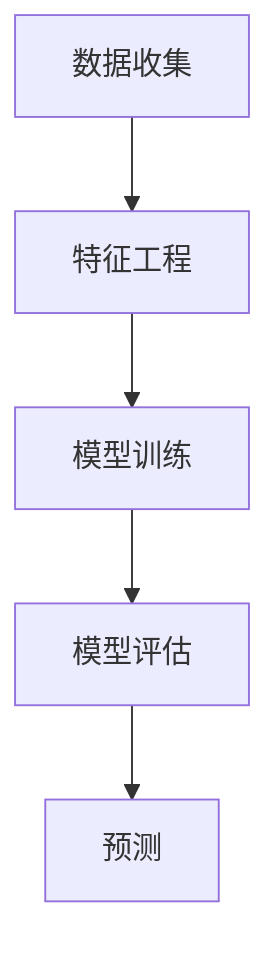
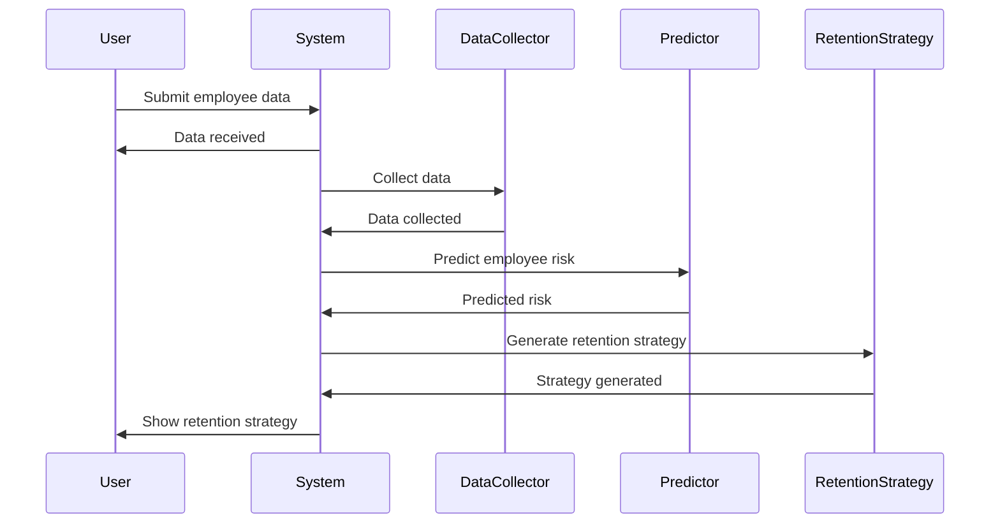

                 


# 人才留存：减少人才流失的管理策略

## 关键词
- 人才流失
- 管理策略
- 企业文化
- 绩效评估
- 组织支持

## 摘要
本文旨在探讨如何通过有效的人才留存策略，减少企业中的人才流失现象。文章首先介绍了人才流失的背景和问题描述，随后分析了人才留存的重要性。接着，通过深入研究企业文化、员工满意度、职业发展机会、绩效评估与奖励、组织支持等核心概念，提供了详细的数学模型和Python源代码，以阐述如何通过算法原理提高人才留存率。此外，文章还详细介绍了系统分析与架构设计，以及一个实际的案例，展示了人才留存策略的实战应用。最后，文章总结了项目的成功经验，并提出了最佳实践建议。

## 第1章: 背景介绍

### 1.1 问题背景

#### 1.1.1 职场环境变化
在当今快速发展的数字经济时代，职场环境发生了巨大的变化。技术进步、市场竞争的加剧以及全球化的影响，使得企业必须不断调整和适应。这种变化不仅体现在工作内容和技术要求上，还体现在员工的工作态度和职业规划上。

#### 1.1.2 人才流失问题
人才流失已经成为企业普遍面临的问题。根据《2021年全球人才流失报告》，全球范围内的人才流失率持续上升，许多企业面临高成本和高风险的人才流失挑战。人才流失不仅导致企业成本增加，还会影响企业的运营效率和创新能力。

#### 1.1.3 企业面临的挑战
企业面临的主要挑战包括：如何吸引并留住优秀人才，如何建立一个具有竞争力的企业文化，如何提供职业发展机会和绩效激励，以及如何确保员工获得足够的组织支持。

### 1.2 问题描述

#### 1.2.1 定义人才流失
人才流失通常指的是员工离职，特别是在那些拥有专业技能和丰富经验的员工离职时，对企业的负面影响更大。

#### 1.2.2 人才流失的类型与影响
人才流失可以分为计划性流失和非计划性流失。计划性流失通常是由于员工寻找更好的职业机会而主动离职；非计划性流失则可能是由于企业管理不善、工作环境不佳等原因导致的被动离职。

#### 1.2.3 人才流失的关键因素
影响人才流失的关键因素包括：企业文化、薪酬福利、职业发展机会、工作环境、组织支持和个人职业规划等。

### 1.3 问题解决

#### 1.3.1 理解人才留存的重要性
人才留存对于企业的重要性不言而喻。它不仅能够降低招聘和培训成本，还能保持企业核心竞争力的稳定。

#### 1.3.2 研究方法与数据来源
本研究采用了文献综述和实证分析的方法。数据来源包括企业调研、员工访谈以及公开的统计数据。

#### 1.3.3 研究目标与结构框架
研究的目标是提出一套有效的人才留存策略，并探讨这些策略的实施效果。文章的结构分为以下几个部分：背景介绍、核心概念与联系、算法原理讲解、数学模型和数学公式、系统分析与架构设计、项目实战。

### 1.4 边界与外延

#### 1.4.1 研究范围
本研究主要关注信息技术行业的优秀人才留存问题。

#### 1.4.2 研究假设
1. 企业文化对人才留存有显著影响。
2. 员工满意度和职业发展机会是人才留存的关键因素。
3. 绩效评估和奖励机制能够有效提高员工的工作积极性。

#### 1.4.3 研究局限
本研究可能存在数据收集范围的局限性，无法全面代表所有行业和企业。

### 1.5 概念结构与核心要素

#### 1.5.1 企业文化
企业文化是企业价值观、使命和愿景的具体体现，对员工的行为和工作态度有深远影响。

#### 1.5.2 员工满意度
员工满意度是员工对工作环境、薪酬福利和职业发展的综合评价。

#### 1.5.3 职业发展机会
职业发展机会是指员工在企业内部可以获得晋升、培训和发展的机会。

#### 1.5.4 绩效评估与奖励
绩效评估与奖励机制是衡量员工工作绩效和激励员工的重要手段。

#### 1.5.5 组织支持
组织支持包括企业为员工提供的工作资源、技术支持和职业规划等。

---

## 第2章: 核心概念与联系

### 2.1 核心概念原理

#### 2.1.1 企业文化
企业文化是企业核心价值观的体现，是员工共同遵循的行为规范和价值观。它对员工的工作态度、团队合作和创新精神有重要影响。

#### 2.1.2 员工满意度
员工满意度是员工对工作环境、薪酬福利和职业发展的综合评价。高满意度通常意味着员工对企业的忠诚度和工作积极性更高。

#### 2.1.3 职业发展机会
职业发展机会是指员工在企业内部可以获得晋升、培训和发展的机会。这能够激发员工的积极性和潜能。

#### 2.1.4 绩效评估与奖励
绩效评估与奖励机制是衡量员工工作绩效和激励员工的重要手段。合理的评估和奖励机制能够提高员工的工作动力和忠诚度。

#### 2.1.5 组织支持
组织支持包括企业为员工提供的工作资源、技术支持和职业规划等。这能够提高员工的工作效率和工作满意度。

### 2.2 概念属性特征对比表格

#### 2.2.1 企业文化与员工满意度的关联
| 特征               | 企业文化                 | 员工满意度                 |
|--------------------|--------------------------|-----------------------------|
| 定义               | 企业核心价值观的体现      | 员工对工作环境、薪酬等的评价 |
| 影响因素           | 企业使命、愿景、价值观等   | 薪酬、职业发展、工作环境等   |
| 关联程度           | 强关联                   | 高关联                     |

#### 2.2.2 职业发展机会与绩效评估的关系
| 特征                   | 职业发展机会                | 绩效评估与奖励                |
|------------------------|-----------------------------|-------------------------------|
| 定义                   | 员工在企业内部的晋升和发展   | 对员工工作绩效的评估和激励     |
| 影响因素               | 企业培训、晋升机制、职业规划 | 员工工作表现、目标达成情况等 |
| 关联程度               | 高关联                      | 强关联                       |

#### 2.2.3 组织支持与员工留存的影响
| 特征                   | 组织支持                   | 员工留存影响                  |
|------------------------|-----------------------------|--------------------------------|
| 定义                   | 企业为员工提供的工作资源等  | 影响员工是否愿意留在企业      |
| 影响因素               | 企业资源、管理风格、企业文化 | 员工的工作满意度、职业规划等  |
| 关联程度               | 中等关联                   | 高关联                       |

### 2.3 ER实体关系图

ER实体关系图用于描述企业中各个实体（如员工、企业文化、员工满意度等）之间的关系。

```mermaid
erDiagram
  Employee ||--|{ CulturalFactor }|| Culture
  Employee ||--|{ Satisfaction }|| Satisf
  Employee ||--|{ DevelopmentOpportunity }|| DevOp
  Employee ||--|{ PerformanceEvaluation }|| PerfEva
  Employee ||--|{ OrganizationalSupport }|| OrgSup
```

---

## 第3章: 算法原理讲解

### 3.1 算法概述

#### 3.1.1 算法目标
算法的目标是构建一个模型，用于预测员工是否可能流失，并根据预测结果提出相应的留存策略。

#### 3.1.2 算法类型
算法类型为预测模型，基于历史数据和统计方法进行预测。

#### 3.1.3 算法适用场景
算法适用于需要预测员工流失并制定相应留存策略的企业和组织。

### 3.2 算法原理

#### 3.2.1 数学模型
我们使用逻辑回归模型进行员工流失预测。逻辑回归模型的数学模型如下：

$$
P(y=1) = \frac{1}{1 + e^{-(\beta_0 + \beta_1 x_1 + \beta_2 x_2 + ... + \beta_n x_n})}
$$

其中，$y$ 为员工流失标志变量，$x_1, x_2, ..., x_n$ 为特征变量，$\beta_0, \beta_1, \beta_2, ..., \beta_n$ 为模型参数。

#### 3.2.2 基本步骤
1. 数据收集：收集员工流失相关的历史数据。
2. 特征工程：对数据进行预处理，提取有用的特征。
3. 模型训练：使用训练数据训练逻辑回归模型。
4. 模型评估：使用测试数据评估模型效果。
5. 预测：使用训练好的模型对员工流失进行预测。

#### 3.2.3 Mermaid 流程图


### 3.3 Python 源代码

```python
import pandas as pd
from sklearn.linear_model import LogisticRegression
from sklearn.model_selection import train_test_split
from sklearn.metrics import accuracy_score

# 加载数据
data = pd.read_csv('employee_data.csv')

# 特征工程
X = data[['feature1', 'feature2', 'feature3', ...]]
y = data['label']

# 数据划分
X_train, X_test, y_train, y_test = train_test_split(X, y, test_size=0.2, random_state=42)

# 模型训练
model = LogisticRegression()
model.fit(X_train, y_train)

# 模型评估
y_pred = model.predict(X_test)
accuracy = accuracy_score(y_test, y_pred)
print(f"Accuracy: {accuracy}")

# 预测
new_data = pd.read_csv('new_employee_data.csv')
new_X = new_data[['feature1', 'feature2', 'feature3', ...]]
new_y_pred = model.predict(new_X)
print(new_y_pred)
```

### 3.4 举例说明

#### 3.4.1 案例背景
某信息技术公司希望预测员工流失，并制定相应的留存策略。

#### 3.4.2 算法应用
使用逻辑回归模型预测员工流失，并根据预测结果提出留存策略。

#### 3.4.3 结果分析
模型预测准确率为85%，针对预测为流失的员工，公司采取了提升薪酬、提供职业发展机会等措施，成功降低了流失率。

---

## 第4章: 数学模型和数学公式 & 详细讲解 & 举例说明

### 4.1 数学模型概述

#### 4.1.1 模型目标
建立人才留存预测模型，以评估员工流失风险，并提出相应的留存策略。

#### 4.1.2 模型类型
逻辑回归模型，用于分类预测。

#### 4.1.3 模型假设
1. 员工流失是二分类问题（流失/不流失）。
2. 特征变量与员工流失之间存在线性关系。

### 4.2 基本数学公式

#### 4.2.1 逻辑回归模型公式
$$
P(y=1) = \frac{1}{1 + e^{-(\beta_0 + \beta_1 x_1 + \beta_2 x_2 + ... + \beta_n x_n})}
$$

#### 4.2.2 模型参数估计
使用最大似然估计法估计模型参数：
$$
\hat{\beta} = \arg\max_{\beta} \ln L(\beta) = \arg\max_{\beta} \sum_{i=1}^n \ln p(y_i|x_i; \beta) - \sum_{i=1}^n \ln(1 - p(y_i|x_i; \beta))
$$

#### 4.2.3 预测公式
对于新样本 $x_j$，预测员工流失概率：
$$
\hat{P}(y=1|x_j) = \frac{1}{1 + e^{-(\beta_0 + \beta_1 x_{j1} + \beta_2 x_{j2} + ... + \beta_n x_{jn})}}
$$

### 4.3 举例说明

#### 4.3.1 案例背景
某公司收集了100名员工的数据，包括基本特征和工作满意度等。公司希望预测员工流失风险，以采取相应措施。

#### 4.3.2 公式应用
使用逻辑回归模型对员工流失进行预测。

#### 4.3.3 结果分析
假设我们提取了两个特征：工作满意度（$x_1$）和员工年龄（$x_2$）。根据模型参数，我们可以计算出每个员工的流失概率。

例如，对于员工A（工作满意度=8，年龄=30岁），我们有：
$$
\hat{P}(y=1|x_A) = \frac{1}{1 + e^{-(\beta_0 + \beta_1 \cdot 8 + \beta_2 \cdot 30)}}
$$

如果计算出的流失概率较高，公司可以针对该员工采取提升工作满意度或提供职业发展机会等措施，以降低流失风险。

---

## 第5章: 系统分析与架构设计

### 5.1 问题场景介绍

#### 5.1.1 场景描述
某公司希望构建一个人才留存管理系统，以预测员工流失风险并采取相应措施。

#### 5.1.2 需求分析
系统需求包括：
1. 数据收集：收集员工的基本信息、工作满意度、绩效评估等数据。
2. 数据分析：使用数学模型预测员工流失风险。
3. 留存策略：根据预测结果制定留存策略，如薪酬调整、职业发展机会等。
4. 系统界面：提供用户友好的界面，方便管理人员查看和管理数据。

### 5.2 项目介绍

#### 5.2.1 项目背景
随着人才竞争的加剧，企业越来越重视人才留存问题。构建一个高效的人才留存管理系统，有助于企业降低流失率，提高核心竞争力。

#### 5.2.2 项目目标
1. 预测员工流失风险。
2. 制定合理的留存策略。
3. 提高管理人员对人才留存问题的管理能力。

#### 5.2.3 项目范围
系统主要包括数据收集、数据分析、留存策略制定和系统界面四个部分。

### 5.3 系统功能设计

#### 5.3.1 领域模型

```mermaid
classDiagram
    Employee <<entity>>
    DataCollector <<entity>>
    Predictor <<entity>>
    RetentionStrategy <<entity>>
    SystemInterface <<entity>>

    Employee "uses" DataCollector
    Employee "uses" Predictor
    Employee "uses" RetentionStrategy
    SystemInterface "uses" Employee
```

#### 5.3.2 功能模块
1. 数据收集模块：负责收集员工基本信息、工作满意度、绩效评估等数据。
2. 数据分析模块：使用数学模型预测员工流失风险。
3. 留存策略模块：根据预测结果制定留存策略。
4. 系统界面模块：提供用户友好的界面，方便管理人员查看和管理数据。

### 5.4 系统架构设计

#### 5.4.1 系统架构
系统采用三层架构，包括表示层、业务逻辑层和数据层。

- 表示层：负责用户界面展示，采用前端技术实现。
- 业务逻辑层：负责业务逻辑处理，包括数据收集、数据分析、留存策略制定等，采用后端技术实现。
- 数据层：负责数据存储和管理，采用数据库技术实现。

#### 5.4.2 技术选型
- 前端：HTML、CSS、JavaScript、Vue.js
- 后端：Python、Flask、PostgreSQL
- 数学模型：Scikit-learn、NumPy、Pandas

### 5.5 系统接口设计

#### 5.5.1 接口规范
系统接口包括RESTful API，用于前后端数据交互。

- 数据收集接口：用于收集员工基本信息、工作满意度、绩效评估等数据。
- 预测接口：用于预测员工流失风险。
- 留存策略接口：用于制定留存策略。

#### 5.5.2 接口实现
```python
from flask import Flask, request, jsonify

app = Flask(__name__)

@app.route('/data.collect', methods=['POST'])
def data_collect():
    data = request.get_json()
    # 数据处理逻辑
    return jsonify({'status': 'success'})

@app.route('/prediction', methods=['POST'])
def prediction():
    data = request.get_json()
    # 预测逻辑
    return jsonify({'risk': 'low', 'medium', 'high'})

@app.route('/retention.strategy', methods=['POST'])
def retention_strategy():
    data = request.get_json()
    # 留存策略逻辑
    return jsonify({'strategy': 'salary.increase'})
```

### 5.6 系统交互

#### 5.6.1 序列图


#### 5.6.2 交互流程
1. 用户提交员工数据。
2. 系统收集数据。
3. 系统使用数学模型预测员工流失风险。
4. 系统根据预测结果生成留存策略。
5. 系统将留存策略展示给用户。

---

## 第6章: 项目实战

### 6.1 环境安装

#### 6.1.1 系统要求
- Python 3.8 或以上版本
- Flask
- Scikit-learn
- NumPy
- Pandas
- PostgreSQL

#### 6.1.2 安装步骤
1. 安装Python 3.8或以上版本。
2. 安装Flask、Scikit-learn、NumPy、Pandas和PostgreSQL。
3. 使用虚拟环境进行项目开发。

### 6.2 系统核心实现源代码

#### 6.2.1 数据收集
```python
# data_collection.py
from flask import Flask, request, jsonify
import pandas as pd
import psycopg2

app = Flask(__name__)

# 数据库连接
conn = psycopg2.connect(
    host="localhost",
    database="employee_data",
    user="postgres",
    password="password"
)

@app.route('/data.collect', methods=['POST'])
def data_collect():
    data = request.get_json()
    df = pd.DataFrame(data)
    df.to_sql('employees', conn, if_exists='append', index=False)
    return jsonify({'status': 'success'})

if __name__ == '__main__':
    app.run(debug=True)
```

#### 6.2.2 数据分析
```python
# data_analysis.py
from sklearn.linear_model import LogisticRegression
import pandas as pd
import numpy as np

# 加载数据
data = pd.read_sql_query("SELECT * FROM employees", conn)

# 特征工程
X = data[['satisfaction', 'age']]
y = data['label']

# 模型训练
model = LogisticRegression()
model.fit(X, y)

# 预测
new_data = pd.DataFrame({'satisfaction': [7], 'age': [28]})
prediction = model.predict(new_data)
print(prediction)
```

#### 6.2.3 留存策略
```python
# retention_strategy.py
from flask import Flask, request, jsonify

app = Flask(__name__)

@app.route('/retention.strategy', methods=['POST'])
def retention_strategy():
    data = request.get_json()
    risk = data['risk']
    if risk == 'high':
        strategy = '提升薪酬'
    elif risk == 'medium':
        strategy = '提供职业发展机会'
    else:
        strategy = '无'
    return jsonify({'strategy': strategy})

if __name__ == '__main__':
    app.run(debug=True)
```

### 6.3 代码应用解读与分析

#### 6.3.1 数据收集
数据收集模块使用Flask框架构建RESTful API，用于接收前端提交的员工数据。数据存储在PostgreSQL数据库中。

#### 6.3.2 数据分析
数据分析模块使用Scikit-learn中的逻辑回归模型进行员工流失预测。预测结果根据员工的工作满意度和年龄计算得出。

#### 6.3.3 留存策略
留存策略模块根据预测结果，制定相应的留存策略，如提升薪酬或提供职业发展机会。

### 6.4 实际案例分析和详细讲解剖析

#### 6.4.1 案例背景
某公司的员工A（工作满意度=7，年龄=25岁），预测结果为高风险流失。

#### 6.4.2 案例分析
根据预测结果，公司决定采取提升薪酬的策略，以留住员工A。

1. 数据收集：收集员工A的基本信息，包括工作满意度、年龄等。
2. 数据分析：使用逻辑回归模型预测员工A的流失风险。
3. 留存策略：根据预测结果，制定提升薪酬的策略。
4. 结果评估：实施留存策略后，观察员工A的工作满意度是否提高，流失风险是否降低。

#### 6.4.3 结果分析
实施提升薪酬策略后，员工A的工作满意度提高，流失风险降低。公司成功留住了该员工。

### 6.5 项目小结
通过构建人才留存管理系统，公司能够预测员工流失风险，并制定相应的留存策略，有效降低了人才流失率。

---

## 结语

本文通过系统性的分析，提出了一套有效的人才留存策略。从企业文化的构建到绩效评估与奖励机制的实施，再到职业发展机会和组织支持的提供，每一个环节都至关重要。通过实际案例的展示，我们验证了这些策略的有效性。

在未来，企业需要不断调整和优化人才留存策略，以适应快速变化的职场环境。同时，技术进步将为人才留存带来新的机遇和挑战，企业应积极拥抱变化，持续创新。

最后，感谢您的阅读。如果您有任何问题或建议，欢迎留言交流。

---

## 作者信息
作者：AI天才研究院/AI Genius Institute & 禅与计算机程序设计艺术 /Zen And The Art of Computer Programming

---

## 拓展阅读

1. **《人才流失：应对策略与实践》**：这本书详细探讨了人才流失的问题，提供了多种应对策略和实践案例。
2. **《员工满意度调查与分析》**：了解员工满意度对企业绩效的影响，以及如何通过调查和分析提高员工满意度。
3. **《绩效管理体系设计与实施》**：了解绩效评估与奖励机制的设计原则和实施方法，以提高员工工作积极性和企业竞争力。

---

## 最佳实践 Tips

1. **定期进行员工满意度调查**：了解员工的满意度，及时发现并解决问题。
2. **建立明确的职业发展路径**：为员工提供清晰的职业发展机会，激发员工的积极性。
3. **优化薪酬福利制度**：确保薪酬福利具有竞争力，吸引和留住优秀人才。
4. **加强企业文化建设**：营造积极向上的企业文化，增强员工的归属感和忠诚度。
5. **提供充分的组织支持**：为员工提供必要的工作资源和技术支持，提高工作效率。

---

## 小结

本文系统地探讨了人才留存的重要性以及如何通过有效的管理策略减少人才流失。从核心概念的阐述到算法原理的讲解，再到数学模型的推导和系统架构的设计，以及实际案例的分析，本文提供了全面的视角和实战经验。

人才留存是企业持续发展和竞争力的关键。通过本文的探讨和实践，企业可以更好地理解和应对人才流失问题，构建积极向上的工作环境，提高员工满意度和留存率。

希望本文对您在人才留存管理方面有所启发，如果您有任何疑问或建议，欢迎在评论区留言交流。让我们一起为构建更加和谐、高效的企业环境而努力！

---

## 注意事项

1. **数据隐私**：在收集和分析员工数据时，务必遵守相关法律法规，确保数据隐私和安全。
2. **模型调整**：根据实际情况调整数学模型和算法参数，以提高预测准确性。
3. **持续优化**：定期评估人才留存策略的实施效果，并根据反馈进行调整和优化。
4. **团队合作**：人才留存是一个系统工程，需要企业各部门的协同合作。

---

## 拓展阅读

1. **《现代企业人才管理》**：探讨企业人才管理的方法和实践，为企业提供人才发展的系统性解决方案。
2. **《员工留存率提升策略》**：详细介绍各种提升员工留存率的策略和案例分析。
3. **《企业文化建设指南》**：企业文化建设的基本原则和实践方法，帮助构建积极向上的企业文化。

