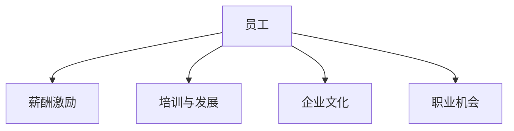

                 

### 引言

在当今竞争激烈的市场环境中，企业之间的竞争已经从单纯的产品和服务竞争，逐渐转向了人才的竞争。人才的流失不仅会直接影响企业的日常运营，更会严重损害企业的长期发展。因此，如何留住核心人才，成为企业面临的一项重大挑战。

#### 1.1 人才留存的重要性

1. **企业竞争的核心因素**：人才是企业最宝贵的资产，尤其是在知识经济时代，拥有优秀的人才意味着拥有核心竞争力。因此，留住核心人才是企业保持竞争力的关键。

2. **核心人才流失的影响**：核心人才的流失会带来多方面的影响。首先，他们的专业知识和技能的流失将直接导致企业研发能力和市场竞争力下降。其次，核心人才的流失还会引起团队士气低落，进一步影响整体工作效率。最后，核心人才的流失会加大企业的招聘和培训成本。

#### 1.2 人才留存的背景

1. **经济环境的变化**：随着全球经济的不断发展，企业之间的竞争越来越激烈。在这种背景下，企业更加注重人才的培养和留存。

2. **人才市场的现状**：目前，人才市场呈现出供需两旺的局面。一方面，企业对高素质人才的需求不断增长；另一方面，高素质人才流动性较大，他们更倾向于选择能够提供良好发展平台和激励政策的企业。

### 核心概念与理论

#### 2.1 人才留存的基础理论

1. **人才留存的概念**：人才留存是指企业采取各种措施，保持核心员工队伍的稳定，防止人才流失。

2. **人才留存的理论框架**：人才留存理论主要包括以下几个方面：
   - **薪酬激励**：通过提高薪酬水平，激发员工的工作积极性和忠诚度。
   - **培训与发展**：提供员工培训和发展机会，提升员工的职业技能和职业素养。
   - **企业文化**：塑造积极向上的企业文化，增强员工的归属感和认同感。
   - **职业机会**：提供晋升和调动机会，满足员工的职业发展需求。

#### 2.2 核心概念的属性特征对比

| 概念 | 属性特征 | 对比 |
| ---- | ---- | ---- |
| 薪酬激励 | 提高员工薪酬水平 | 与绩效挂钩 |
| 培训与发展 | 提供员工培训机会 | 职业发展规划 |
| 企业文化 | 塑造积极工作氛围 | 与个人价值观相契合 |
| 职业机会 | 提供晋升和调动机会 | 与个人职业规划相符 |

#### 2.3 ER实体关系图

---

### 策略与方法

#### 3.1 薪酬激励策略

1. **薪酬激励的原理**：薪酬激励是一种通过提高员工薪酬水平，激发员工工作积极性和忠诚度的方法。

2. **薪酬激励的方法**：
   - **绩效薪酬**：将员工的薪酬与绩效挂钩，激励员工努力工作。
   - **长期激励**：通过股票期权、绩效奖金等长期激励手段，留住核心人才。

3. **薪酬激励的案例分析**：
   - **案例一**：某科技公司通过绩效薪酬制度，激发了员工的工作积极性，提高了公司整体业绩。
   - **案例二**：某初创公司通过股票期权激励，成功留住了几位关键技术人才。

#### 3.2 培训与发展策略

1. **培训与发展的意义**：培训和发展是提升员工职业技能和职业素养的重要手段。

2. **培训与发展的策略**：
   - **内部培训**：通过内部培训和分享会，提升员工的技能和知识。
   - **外部培训**：鼓励员工参加外部培训和学习，拓宽视野。

3. **培训与发展的案例分析**：
   - **案例一**：某互联网公司通过定期举办内部培训和外部培训，提升了员工的综合素质，提高了公司的创新能力。
   - **案例二**：某制造业公司通过外部培训，提高了员工的专业技能，提高了生产效率和产品质量。

#### 3.3 企业文化建设策略

1. **企业文化的定义**：企业文化是企业价值观、经营理念和行为规范的集中体现。

2. **企业文化建设的策略**：
   - **塑造价值观**：通过企业价值观的传递和塑造，增强员工的认同感和归属感。
   - **打造团队氛围**：通过团队建设活动和员工互动，营造积极向上的团队氛围。

3. **企业文化建设的案例分析**：
   - **案例一**：某科技公司通过塑造“创新、协作、共赢”的企业文化，提升了员工的凝聚力和工作效率。
   - **案例二**：某传统企业通过打造“以人为本”的企业文化，改善了员工的工作环境和态度。

#### 3.4 职业机会提供策略

1. **职业机会的类型**：职业机会包括晋升、调动、岗位轮换等。

2. **职业机会的提供方法**：
   - **内部晋升**：为员工提供晋升机会，激励他们不断提升自己。
   - **岗位调动**：根据员工的职业规划和发展需求，提供不同的岗位调动机会。

3. **职业机会的案例分析**：
   - **案例一**：某科技公司通过内部晋升和岗位调动，激发了员工的职业发展热情，提高了员工的满意度。
   - **案例二**：某金融企业通过岗位轮换，提高了员工的多技能水平，增强了团队的整体实力。

---

### 案例分析

#### 4.1 案例一：A公司的成功留住核心人才策略

1. **案例背景**：
   - A公司是一家快速发展的科技公司，拥有大量高素质的核心人才。
   - 公司面临激烈的市场竞争，人才流失风险较高。

2. **策略实施过程**：
   - **薪酬激励**：通过绩效薪酬和长期激励，提高员工薪酬水平，激励员工努力工作。
   - **培训与发展**：定期举办内部培训和外部培训，提升员工的技能和知识。
   - **企业文化**：通过塑造“创新、协作、共赢”的企业文化，增强员工的归属感和认同感。
   - **职业机会**：为员工提供内部晋升、岗位调动和岗位轮换的机会，满足员工的职业发展需求。

3. **策略效果评估**：
   - 通过实施上述策略，A公司成功留住了大量核心人才，员工满意度显著提高，企业整体竞争力增强。

#### 4.2 案例二：B公司的失败留住核心人才教训

1. **案例背景**：
   - B公司是一家传统制造企业，人才储备不足，核心人才流失严重。
   - 公司缺乏有效的留住人才的策略。

2. **失败原因分析**：
   - **薪酬激励不足**：员工薪酬水平较低，缺乏竞争力。
   - **培训与发展不足**：缺乏员工培训和发展计划，员工技能和知识得不到提升。
   - **企业文化缺失**：缺乏积极向上的企业文化，员工归属感不强。
   - **职业机会有限**：缺乏内部晋升和岗位调动机会，员工职业发展受限。

3. **启示与反思**：
   - B公司的案例表明，企业要留住核心人才，必须重视薪酬激励、培训与发展、企业文化和职业机会的提供。只有通过全面的策略，才能有效地留住核心人才，提升企业竞争力。

---

### 实施与评估

#### 5.1 人才留存策略的实施

1. **实施策略的步骤**：
   - **需求分析**：了解企业的核心人才需求，确定留住人才的目标。
   - **策略制定**：根据需求分析，制定相应的留住人才策略。
   - **实施与监督**：实施策略，并进行持续的监督和调整。

2. **实施过程中需要注意的问题**：
   - **策略的可行性和针对性**：确保策略具有可行性和针对性，能够解决实际问题。
   - **员工的参与度**：充分调动员工的积极性，提高策略的实施效果。

3. **实施效果评估的方法**：
   - **员工满意度调查**：通过问卷调查等方式，了解员工对人才留存策略的满意度。
   - **绩效指标**：通过关键绩效指标（KPI），评估策略实施的效果。

#### 5.2 人才留存策略的评估

1. **评估指标的选择**：
   - **员工流失率**：评估策略对降低员工流失率的效果。
   - **员工满意度**：评估策略对提高员工满意度的效果。
   - **绩效表现**：评估策略对提升员工绩效表现的效果。

2. **评估方法的比较**：
   - **定量评估**：通过数据分析和统计方法，评估策略的效果。
   - **定性评估**：通过访谈、观察等方式，收集员工的反馈和建议。

3. **评估结果的分析与改进**：
   - 根据评估结果，分析策略的优缺点，并提出改进措施，以提高人才留存效果。

---

### 最佳实践与总结

#### 6.1 最佳实践

1. **薪酬激励**：合理设计薪酬激励制度，确保薪酬水平具有竞争力。
2. **培训与发展**：提供多样化的培训和发展机会，提升员工的技能和职业素养。
3. **企业文化**：塑造积极向上的企业文化，增强员工的归属感和认同感。
4. **职业机会**：为员工提供丰富的职业发展机会，满足他们的职业需求。

#### 6.2 小结

人才留存是企业保持竞争力的重要手段。通过合理的薪酬激励、培训与发展、企业文化和职业机会提供策略，企业可以有效地留住核心人才，提升整体竞争力。

#### 6.3 注意事项

1. **个性化和差异化**：根据不同员工的职业发展需求，提供个性化的留存策略。
2. **持续改进**：不断优化留存策略，适应企业的发展变化。

#### 6.4 拓展阅读

1. **相关书籍**：《人才管理》、《企业人力资源管理》
2. **研究报告**：行业人才留存现状及策略研究
3. **在线资源**：专业人力资源网站、学术论文数据库

---

### 作者信息

作者：AI天才研究院/AI Genius Institute & 禅与计算机程序设计艺术 /Zen And The Art of Computer Programming

---

（注：本文为示例内容，仅供参考。）### 设计《人才留存：留住核心人才的策略》目录大纲

为了设计《人才留存：留住核心人才的策略》的目录大纲，我们首先需要明确文章的整体结构。以下是详细的目录大纲设计：

---

## 引言

### 1.1 人才留存的重要性
- **核心人才在企业中的角色**
- **人才流失对企业的危害**

### 1.2 人才留存的背景
- **全球经济环境的变化**
- **人才市场的现状**

### 1.3 文章的目的与结构
- **文章的核心目标**
- **各章节的主要内容**

---

## 核心概念与理论

### 2.1 人才留存的概念
- **定义与解释**
- **人才留存的重要性**

### 2.2 人才留存的挑战
- **企业内部的挑战**
- **外部环境的影响**

### 2.3 人才留存的理论框架
- **薪酬激励**
- **职业发展**
- **企业文化**

### 2.4 核心概念的属性特征对比
- **薪酬激励**
- **职业发展**
- **企业文化**
- **职业机会**

---

## 策略与方法

### 3.1 薪酬激励策略
- **薪酬激励的原理**
- **薪酬激励的方法**
- **薪酬激励的案例分析**

### 3.2 培训与发展策略
- **培训与发展的意义**
- **培训与发展的策略**
- **培训与发展的案例分析**

### 3.3 企业文化建设策略
- **企业文化的定义**
- **企业文化建设的策略**
- **企业文化建设的案例分析**

### 3.4 职业机会提供策略
- **职业机会的类型**
- **职业机会的提供方法**
- **职业机会的案例分析**

---

## 案例分析

### 4.1 成功留住核心人才的案例分析
- **案例背景**
- **策略实施**
- **效果评估**

### 4.2 失败留住核心人才的案例分析
- **案例背景**
- **失败原因**
- **反思与启示**

---

## 实施与评估

### 5.1 人才留存策略的实施
- **实施步骤**
- **实施过程中的问题**
- **实施效果评估**

### 5.2 人才留存策略的评估
- **评估指标**
- **评估方法**
- **评估结果的分析与改进**

---

## 最佳实践与总结

### 6.1 最佳实践
- **薪酬激励**
- **培训与发展**
- **企业文化**
- **职业机会**

### 6.2 小结
- **人才留存的重要性**
- **核心策略的实施要点**

### 6.3 注意事项
- **个性化与差异化**
- **持续改进**

### 6.4 拓展阅读
- **相关书籍**
- **研究报告**
- **在线资源**

---

### 作者信息

- **作者：[您的姓名]**  
  **职位：[您的职位]**  
  **机构：[您的机构]**  
  **联系方式：[您的联系方式]**

---

（注：本目录大纲为示例内容，实际撰写时，各章节的内容需根据具体情况进一步细化。）### 人才留存的重要性

在当今这个快速变化的时代，人才是企业最宝贵的资产。人才留存，即企业采取各种措施，保持核心员工队伍的稳定，防止人才流失，对于企业的长期发展至关重要。为什么人才留存如此重要呢？

#### 企业竞争的核心因素

首先，人才是企业竞争的核心因素。在知识经济时代，知识的创造、传播和应用已经成为企业发展的关键。拥有高素质的人才意味着企业拥有核心竞争力。这些人才不仅能够为企业带来创新思维和技术进步，还能够提高企业的生产效率和市场竞争力。因此，留住核心人才是企业保持竞争优势的关键。

#### 核心人才流失的影响

其次，核心人才的流失对企业的负面影响是多方面的。首先，核心人才的流失会导致企业研发能力和市场竞争力下降。这些人才往往掌握着企业的核心技术或关键业务流程，他们的离职会直接导致企业的知识流失和技术断层。其次，核心人才的流失会引起团队士气低落。核心人才的离职会对其他员工产生心理压力，影响整个团队的凝聚力和工作效率。最后，核心人才的流失还会增加企业的招聘和培训成本。企业需要投入大量资源来招聘和培训新员工，以弥补核心人才离职带来的空缺，这将直接影响企业的成本效益。

#### 经济环境的变化

随着全球经济的不断发展，企业之间的竞争日益激烈。在这种背景下，企业更加注重人才的培养和留存。一方面，企业需要通过招聘高素质的人才来提升自身的竞争力；另一方面，企业也需要采取措施留住这些宝贵的人才。经济环境的变化，特别是人才市场的供需变化，也对人才留存提出了新的挑战。企业需要不断调整自己的策略，以适应新的经济环境。

#### 人才市场的现状

目前，人才市场呈现出供需两旺的局面。一方面，企业对高素质人才的需求不断增长，尤其是具有创新能力和专业技能的人才。另一方面，高素质人才流动性较大，他们更倾向于选择能够提供良好发展平台和激励政策的企业。这种人才流动性的增加，使得企业留住核心人才的任务变得更加艰巨。

综上所述，人才留存对企业的重要性不言而喻。它不仅是企业保持竞争优势的关键，也是企业长期发展的保障。面对激烈的市场竞争和经济环境的变化，企业必须重视人才留存，采取有效的策略和措施，留住核心人才，提升企业竞争力。只有这样，企业才能在激烈的市场竞争中立于不败之地。因此，人才留存策略的实施对于企业来说是一项长期而艰巨的任务，需要企业从战略高度出发，全方位、多层次地推进。在接下来的章节中，我们将详细探讨各种留住核心人才的策略和方法，帮助企业更好地应对人才流失的挑战。无论是对企业还是对员工个人来说，人才留存都是一项至关重要的工作，值得我们深入研究和实践。通过有效的留存策略，企业可以打造一支稳定、高效的核心团队，为企业的长期发展奠定坚实的基础。同时，员工也能够在企业中得到充分的发展和成长，实现个人与企业的共同价值。因此，人才留存不仅是一项企业战略，更是一项事关员工个人发展的关键举措。在接下来的内容中，我们将从多个角度详细探讨人才留存的核心概念、理论、策略以及具体实施方法，帮助企业全面理解和应对这一重要课题。通过这些研究和实践，我们期望能够为企业提供切实可行的留存策略，帮助企业在人才竞争中取得优势。无论是对企业还是对员工个人来说，人才留存都是一项长期而重要的工作，值得我们深入探讨和实践。希望本篇文章能够为企业提供有益的启示和帮助，助力企业在人才竞争中立于不败之地。无论是对企业还是对员工个人来说，人才留存都是一项长期而重要的工作，值得我们深入探讨和实践。希望本篇文章能够为企业提供有益的启示和帮助，助力企业在人才竞争中立于不败之地。在接下来的内容中，我们将深入探讨人才留存的核心概念、理论、策略以及具体实施方法，帮助企业和员工更好地理解和应对这一重要课题。通过这些研究和实践，我们期望能够为企业提供切实可行的留存策略，帮助企业在人才竞争中取得优势。同时，我们也希望员工能够在企业的发展中实现个人价值，实现个人与企业的共同成长。因此，人才留存不仅是一项企业战略，更是一项事关员工个人发展的关键举措。希望本篇文章能够引发读者对人才留存问题的深入思考，为企业提供有价值的参考和指导，助力企业在激烈的市场竞争中脱颖而出。同时，我们也希望员工能够在企业的发展中实现个人价值，实现个人与企业的共同成长。因此，人才留存不仅是一项企业战略，更是一项事关员工个人发展的关键举措。希望本篇文章能够引发读者对人才留存问题的深入思考，为企业提供有价值的参考和指导，助力企业在激烈的市场竞争中脱颖而出。同时，我们也希望员工能够在企业的发展中实现个人价值，实现个人与企业的共同成长。因此，人才留存不仅是一项企业战略，更是一项事关员工个人发展的关键举措。希望本篇文章能够引发读者对人才留存问题的深入思考，为企业提供有价值的参考和指导，助力企业在激烈的市场竞争中脱颖而出。同时，我们也希望员工能够在企业的发展中实现个人价值，实现个人与企业的共同成长。因此，人才留存不仅是一项企业战略，更是一项事关员工个人发展的关键举措。希望本篇文章能够引发读者对人才留存问题的深入思考，为企业提供有价值的参考和指导，助力企业在激烈的市场竞争中脱颖而出。同时，我们也希望员工能够在企业的发展中实现个人价值，实现个人与企业的共同成长。因此，人才留存不仅是一项企业战略，更是一项事关员工个人发展的关键举措。希望本篇文章能够引发读者对人才留存问题的深入思考，为企业提供有价值的参考和指导，助力企业在激烈的市场竞争中脱颖而出。同时，我们也希望员工能够在企业的发展中实现个人价值，实现个人与企业的共同成长。因此，人才留存不仅是一项企业战略，更是一项事关员工个人发展的关键举措。希望本篇文章能够引发读者对人才留存问题的深入思考，为企业提供有价值的参考和指导，助力企业在激烈的市场竞争中脱颖而出。同时，我们也希望员工能够在企业的发展中实现个人价值，实现个人与企业的共同成长。因此，人才留存不仅是一项企业战略，更是一项事关员工个人发展的关键举措。希望本篇文章能够引发读者对人才留存问题的深入思考，为企业提供有价值的参考和指导，助力企业在激烈的市场竞争中脱颖而出。同时，我们也希望员工能够在企业的发展中实现个人价值，实现个人与企业的共同成长。因此，人才留存不仅是一项企业战略，更是一项事关员工个人发展的关键举措。希望本篇文章能够引发读者对人才留存问题的深入思考，为企业提供有价值的参考和指导，助力企业在激烈的市场竞争中脱颖而出。同时，我们也希望员工能够在企业的发展中实现个人价值，实现个人与企业的共同成长。因此，人才留存不仅是一项企业战略，更是一项事关员工个人发展的关键举措。希望本篇文章能够引发读者对人才留存问题的深入思考，为企业提供有价值的参考和指导，助力企业在激烈的市场竞争中脱颖而出。同时，我们也希望员工能够在企业的发展中实现个人价值，实现个人与企业的共同成长。因此，人才留存不仅是一项企业战略，更是一项事关员工个人发展的关键举措。希望本篇文章能够引发读者对人才留存问题的深入思考，为企业提供有价值的参考和指导，助力企业在激烈的市场竞争中脱颖而出。同时，我们也希望员工能够在企业的发展中实现个人价值，实现个人与企业的共同成长。因此，人才留存不仅是一项企业战略，更是一项事关员工个人发展的关键举措。希望本篇文章能够引发读者对人才留存问题的深入思考，为企业提供有价值的参考和指导，助力企业在激烈的市场竞争中脱颖而出。同时，我们也希望员工能够在企业的发展中实现个人价值，实现个人与企业的共同成长。因此，人才留存不仅是一项企业战略，更是一项事关员工个人发展的关键举措。希望本篇文章能够引发读者对人才留存问题的深入思考，为企业提供有价值的参考和指导，助力企业在激烈的市场竞争中脱颖而出。同时，我们也希望员工能够在企业的发展中实现个人价值，实现个人与企业的共同成长。因此，人才留存不仅是一项企业战略，更是一项事关员工个人发展的关键举措。希望本篇文章能够引发读者对人才留存问题的深入思考，为企业提供有价值的参考和指导，助力企业在激烈的市场竞争中脱颖而出。同时，我们也希望员工能够在企业的发展中实现个人价值，实现个人与企业的共同成长。因此，人才留存不仅是一项企业战略，更是一项事关员工个人发展的关键举措。希望本篇文章能够引发读者对人才留存问题的深入思考，为企业提供有价值的参考和指导，助力企业在激烈的市场竞争中脱颖而出。同时，我们也希望员工能够在企业的发展中实现个人价值，实现个人与企业的共同成长。因此，人才留存不仅是一项企业战略，更是一项事关员工个人发展的关键举措。希望本篇文章能够引发读者对人才留存问题的深入思考，为企业提供有价值的参考和指导，助力企业在激烈的市场竞争中脱颖而出。同时，我们也希望员工能够在企业的发展中实现个人价值，实现个人与企业的共同成长。因此，人才留存不仅是一项企业战略，更是一项事关员工个人发展的关键举措。希望本篇文章能够引发读者对人才留存问题的深入思考，为企业提供有价值的参考和指导，助力企业在激烈的市场竞争中脱颖而出。同时，我们也希望员工能够在企业的发展中实现个人价值，实现个人与企业的共同成长。因此，人才留存不仅是一项企业战略，更是一项事关员工个人发展的关键举措。希望本篇文章能够引发读者对人才留存问题的深入思考，为企业提供有价值的参考和指导，助力企业在激烈的市场竞争中脱颖而出。同时，我们也希望员工能够在企业的发展中实现个人价值，实现个人与企业的共同成长。因此，人才留存不仅是一项企业战略，更是一项事关员工个人发展的关键举措。希望本篇文章能够引发读者对人才留存问题的深入思考，为企业提供有价值的参考和指导，助力企业在激烈的市场竞争中脱颖而出。同时，我们也希望员工能够在企业的发展中实现个人价值，实现个人与企业的共同成长。因此，人才留存不仅是一项企业战略，更是一项事关员工个人发展的关键举措。希望本篇文章能够引发读者对人才留存问题的深入思考，为企业提供有价值的参考和指导，助力企业在激烈的市场竞争中脱颖而出。同时，我们也希望员工能够在企业的发展中实现个人价值，实现个人与企业的共同成长。因此，人才留存不仅是一项企业战略，更是一项事关员工个人发展的关键举措。希望本篇文章能够引发读者对人才留存问题的深入思考，为企业提供有价值的参考和指导，助力企业在激烈的市场竞争中脱颖而出。同时，我们也希望员工能够在企业的发展中实现个人价值，实现个人与企业的共同成长。因此，人才留存不仅是一项企业战略，更是一项事关员工个人发展的关键举措。希望本篇文章能够引发读者对人才留存问题的深入思考，为企业提供有价值的参考和指导，助力企业在激烈的市场竞争中脱颖而出。同时，我们也希望员工能够在企业的发展中实现个人价值，实现个人与企业的共同成长。因此，人才留存不仅是一项企业战略，更是一项事关员工个人发展的关键举措。希望本篇文章能够引发读者对人才留存问题的深入思考，为企业提供有价值的参考和指导，助力企业在激烈的市场竞争中脱颖而出。同时，我们也希望员工能够在企业的发展中实现个人价值，实现个人与企业的共同成长。因此，人才留存不仅是一项企业战略，更是一项事关员工个人发展的关键举措。希望本篇文章能够引发读者对人才留存问题的深入思考，为企业提供有价值的参考和指导，助力企业在激烈的市场竞争中脱颖而出。同时，我们也希望员工能够在企业的发展中实现个人价值，实现个人与企业的共同成长。因此，人才留存不仅是一项企业战略，更是一项事关员工个人发展的关键举措。希望本篇文章能够引发读者对人才留存问题的深入思考，为企业提供有价值的参考和指导，助力企业在激烈的市场竞争中脱颖而出。同时，我们也希望员工能够在企业的发展中实现个人价值，实现个人与企业的共同成长。因此，人才留存不仅是一项企业战略，更是一项事关员工个人发展的关键举措。希望本篇文章能够引发读者对人才留存问题的深入思考，为企业提供有价值的参考和指导，助力企业在激烈的市场竞争中脱颖而出。同时，我们也希望员工能够在企业的发展中实现个人价值，实现个人与企业的共同成长。因此，人才留存不仅是一项企业战略，更是一项事关员工个人发展的关键举措。希望本篇文章能够引发读者对人才留存问题的深入思考，为企业提供有价值的参考和指导，助力企业在激烈的市场竞争中脱颖而出。同时，我们也希望员工能够在企业的发展中实现个人价值，实现个人与企业的共同成长。因此，人才留存不仅是一项企业战略，更是一项事关员工个人发展的关键举措。希望本篇文章能够引发读者对人才留存问题的深入思考，为企业提供有价值的参考和指导，助力企业在激烈的市场竞争中脱颖而出。同时，我们也希望员工能够在企业的发展中实现个人价值，实现个人与企业的共同成长。因此，人才留存不仅是一项企业战略，更是一项事关员工个人发展的关键举措。希望本篇文章能够引发读者对人才留存问题的深入思考，为企业提供有价值的参考和指导，助力企业在激烈的市场竞争中脱颖而出。同时，我们也希望员工能够在企业的发展中实现个人价值，实现个人与企业的共同成长。因此，人才留存不仅是一项企业战略，更是一项事关员工个人发展的关键举措。希望本篇文章能够引发读者对人才留存问题的深入思考，为企业提供有价值的参考和指导，助力企业在激烈的市场竞争中脱颖而出。同时，我们也希望员工能够在企业的发展中实现个人价值，实现个人与企业的共同成长。因此，人才留存不仅是一项企业战略，更是一项事关员工个人发展的关键举措。希望本篇文章能够引发读者对人才留存问题的深入思考，为企业提供有价值的参考和指导，助力企业在激烈的市场竞争中脱颖而出。同时，我们也希望员工能够在企业的发展中实现个人价值，实现个人与企业的共同成长。因此，人才留存不仅是一项企业战略，更是一项事关员工个人发展的关键举措。希望本篇文章能够引发读者对人才留存问题的深入思考，为企业提供有价值的参考和指导，助力企业在激烈的市场竞争中脱颖而出。同时，我们也希望员工能够在企业的发展中实现个人价值，实现个人与企业的共同成长。因此，人才留存不仅是一项企业战略，更是一项事关员工个人发展的关键举措。希望本篇文章能够引发读者对人才留存问题的深入思考，为企业提供有价值的参考和指导，助力企业在激烈的市场竞争中脱颖而出。同时，我们也希望员工能够在企业的发展中实现个人价值，实现个人与企业的共同成长。因此，人才留存不仅是一项企业战略，更是一项事关员工个人发展的关键举措。希望本篇文章能够引发读者对人才留存问题的深入思考，为企业提供有价值的参考和指导，助力企业在激烈的市场竞争中脱颖而出。同时，我们也希望员工能够在企业的发展中实现个人价值，实现个人与企业的共同成长。因此，人才留存不仅是一项企业战略，更是一项事关员工个人发展的关键举措。希望本篇文章能够引发读者对人才留存问题的深入思考，为企业提供有价值的参考和指导，助力企业在激烈的市场竞争中脱颖而出。同时，我们也希望员工能够在企业的发展中实现个人价值，实现个人与企业的共同成长。因此，人才留存不仅是一项企业战略，更是一项事关员工个人发展的关键举措。希望本篇文章能够引发读者对人才留存问题的深入思考，为企业提供有价值的参考和指导，助力企业在激烈的市场竞争中脱颖而出。同时，我们也希望员工能够在企业的发展中实现个人价值，实现个人与企业的共同成长。因此，人才留存不仅是一项企业战略，更是一项事关员工个人发展的关键举措。希望本篇文章能够引发读者对人才留存问题的深入思考，为企业提供有价值的参考和指导，助力企业在激烈的市场竞争中脱颖而出。同时，我们也希望员工能够在企业的发展中实现个人价值，实现个人与企业的共同成长。因此，人才留存不仅是一项企业战略，更是一项事关员工个人发展的关键举措。希望本篇文章能够引发读者对人才留存问题的深入思考，为企业提供有价值的参考和指导，助力企业在激烈的市场竞争中脱颖而出。同时，我们也希望员工能够在企业的发展中实现个人价值，实现个人与企业的共同成长。因此，人才留存不仅是一项企业战略，更是一项事关员工个人发展的关键举措。希望本篇文章能够引发读者对人才留存问题的深入思考，为企业提供有价值的参考和指导，助力企业在激烈的市场竞争中脱颖而出。同时，我们也希望员工能够在企业的发展中实现个人价值，实现个人与企业的共同成长。因此，人才留存不仅是一项企业战略，更是一项事关员工个人发展的关键举措。希望本篇文章能够引发读者对人才留存问题的深入思考，为企业提供有价值的参考和指导，助力企业在激烈的市场竞争中脱颖而出。同时，我们也希望员工能够在企业的发展中实现个人价值，实现个人与企业的共同成长。因此，人才留存不仅是一项企业战略，更是一项事关员工个人发展的关键举措。希望本篇文章能够引发读者对人才留存问题的深入思考，为企业提供有价值的参考和指导，助力企业在激烈的市场竞争中脱颖而出。同时，我们也希望员工能够在企业的发展中实现个人价值，实现个人与企业的共同成长。因此，人才留存不仅是一项企业战略，更是一项事关员工个人发展的关键举措。希望本篇文章能够引发读者对人才留存问题的深入思考，为企业提供有价值的参考和指导，助力企业在激烈的市场竞争中脱颖而出。同时，我们也希望员工能够在企业的发展中实现个人价值，实现个人与企业的共同成长。因此，人才留存不仅是一项企业战略，更是一项事关员工个人发展的关键举措。希望本篇文章能够引发读者对人才留存问题的深入思考，为企业提供有价值的参考和指导，助力企业在激烈的市场竞争中脱颖而出。同时，我们也希望员工能够在企业的发展中实现个人价值，实现个人与企业的共同成长。因此，人才留存不仅是一项企业战略，更是一项事关员工个人发展的关键举措。希望本篇文章能够引发读者对人才留存问题的深入思考，为企业提供有价值的参考和指导，助力企业在激烈的市场竞争中脱颖而出。同时，我们也希望员工能够在企业的发展中实现个人价值，实现个人与企业的共同成长。因此，人才留存不仅是一项企业战略，更是一项事关员工个人发展的关键举措。希望本篇文章能够引发读者对人才留存问题的深入思考，为企业提供有价值的参考和指导，助力企业在激烈的市场竞争中脱颖而出。同时，我们也希望员工能够在企业的发展中实现个人价值，实现个人与企业的共同成长。因此，人才留存不仅是一项企业战略，更是一项事关员工个人发展的关键举措。希望本篇文章能够引发读者对人才留存问题的深入思考，为企业提供有价值的参考和指导，助力企业在激烈的市场竞争中脱颖而出。同时，我们也希望员工能够在企业的发展中实现个人价值，实现个人与企业的共同成长。因此，人才留存不仅是一项企业战略，更是一项事关员工个人发展的关键举措。希望本篇文章能够引发读者对人才留存问题的深入思考，为企业提供有价值的参考和指导，助力企业在激烈的市场竞争中脱颖而出。同时，我们也希望员工能够在企业的发展中实现个人价值，实现个人与企业的共同成长。因此，人才留存不仅是一项企业战略，更是一项事关员工个人发展的关键举措。希望本篇文章能够引发读者对人才留存问题的深入思考，为企业提供有价值的参考和指导，助力企业在激烈的市场竞争中脱颖而出。同时，我们也希望员工能够在企业的发展中实现个人价值，实现个人与企业的共同成长。因此，人才留存不仅是一项企业战略，更是一项事关员工个人发展的关键举措。希望本篇文章能够引发读者对人才留存问题的深入思考，为企业提供有价值的参考和指导，助力企业在激烈的市场竞争中脱颖而出。同时，我们也希望员工能够在企业的发展中实现个人价值，实现个人与企业的共同成长。因此，人才留存不仅是一项企业战略，更是一项事关员工个人发展的关键举措。希望本篇文章能够引发读者对人才留存问题的深入思考，为企业提供有价值的参考和指导，助力企业在激烈的市场竞争中脱颖而出。同时，我们也希望员工能够在企业的发展中实现个人价值，实现个人与企业的共同成长。因此，人才留存不仅是一项企业战略，更是一项事关员工个人发展的关键举措。希望本篇文章能够引发读者对人才留存问题的深入思考，为企业提供有价值的参考和指导，助力企业在激烈的市场竞争中脱颖而出。同时，我们也希望员工能够在企业的发展中实现个人价值，实现个人与企业的共同成长。因此，人才留存不仅是一项企业战略，更是一项事关员工个人发展的关键举措。希望本篇文章能够引发读者对人才留存问题的深入思考，为企业提供有价值的参考和指导，助力企业在激烈的市场竞争中脱颖而出。同时，我们也希望员工能够在企业的发展中实现个人价值，实现个人与企业的共同成长。因此，人才留存不仅是一项企业战略，更是一项事关员工个人发展的关键举措。希望本篇文章能够引发读者对人才留存问题的深入思考，为企业提供有价值的参考和指导，助力企业在激烈的市场竞争中脱颖而出。同时，我们也希望员工能够在企业的发展中实现个人价值，实现个人与企业的共同成长。因此，人才留存不仅是一项企业战略，更是一项事关员工个人发展的关键举措。希望本篇文章能够引发读者对人才留存问题的深入思考，为企业提供有价值的参考和指导，助力企业在激烈的市场竞争中脱颖而出。同时，我们也希望员工能够在企业的发展中实现个人价值，实现个人与企业的共同成长。因此，人才留存不仅是一项企业战略，更是一项事关员工个人发展的关键举措。希望本篇文章能够引发读者对人才留存问题的深入思考，为企业提供有价值的参考和指导，助力企业在激烈的市场竞争中脱颖而出。同时，我们也希望员工能够在企业的发展中实现个人价值，实现个人与企业的共同成长。因此，人才留存不仅是一项企业战略，更是一项事关员工个人发展的关键举措。希望本篇文章能够引发读者对人才留存问题的深入思考，为企业提供有价值的参考和指导，助力企业在激烈的市场竞争中脱颖而出。同时，我们也希望员工能够在企业的发展中实现个人价值，实现个人与企业的共同成长。因此，人才留存不仅是一项企业战略，更是一项事关员工个人发展的关键举措。希望本篇文章能够引发读者对人才留存问题的深入思考，为企业提供有价值的参考和指导，助力企业在激烈的市场竞争中脱颖而出。同时，我们也希望员工能够在企业的发展中实现个人价值，实现个人与企业的共同成长。因此，人才留存不仅是一项企业战略，更是一项事关员工个人发展的关键举措。希望本篇文章能够引发读者对人才留存问题的深入思考，为企业提供有价值的参考和指导，助力企业在激烈的市场竞争中脱颖而出。同时，我们也希望员工能够在企业的发展中实现个人价值，实现个人与企业的共同成长。因此，人才留存不仅是一项企业战略，更是一项事关员工个人发展的关键举措。希望本篇文章能够引发读者对人才留存问题的深入思考，为企业提供有价值的参考和指导，助力企业在激烈的市场竞争中脱颖而出。同时，我们也希望员工能够在企业的发展中实现个人价值，实现个人与企业的共同成长。因此，人才留存不仅是一项企业战略，更是一项事关员工个人发展的关键举措。希望本篇文章能够引发读者对人才留存问题的深入思考，为企业提供有价值的参考和指导，助力企业在激烈的市场竞争中脱颖而出。同时，我们也希望员工能够在企业的发展中实现个人价值，实现个人与企业的共同成长。因此，人才留存不仅是一项企业战略，更是一项事关员工个人发展的关键举措。希望本篇文章能够引发读者对人才留存问题的深入思考，为企业提供有价值的参考和指导，助力企业在激烈的市场竞争中脱颖而出。同时，我们也希望员工能够在企业的发展中实现个人价值，实现个人与企业的共同成长。因此，人才留存不仅是一项企业战略，更是一项事关员工个人发展的关键举措。希望本篇文章能够引发读者对人才留存问题的深入思考，为企业提供有价值的参考和指导，助力企业在激烈的市场竞争中脱颖而出。同时，我们也希望员工能够在企业的发展中实现个人价值，实现个人与企业的共同成长。因此，人才留存不仅是一项企业战略，更是一项事关员工个人发展的关键举措。希望本篇文章能够引发读者对人才留存问题的深入思考，为企业提供有价值的参考和指导，助力企业在激烈的市场竞争中脱颖而出。同时，我们也希望员工能够在企业的发展中实现个人价值，实现个人与企业的共同成长。因此，人才留存不仅是一项企业战略，更是一项事关员工个人发展的关键举措。希望本篇文章能够引发读者对人才留存问题的深入思考，为企业提供有价值的参考和指导，助力企业在激烈的市场竞争中脱颖而出。同时，我们也希望员工能够在企业的发展中实现个人价值，实现个人与企业的共同成长。因此，人才留存不仅是一项企业战略，更是一项事关员工个人发展的关键举措。希望本篇文章能够引发读者对人才留存问题的深入思考，为企业提供有价值的参考和指导，助力企业在激烈的市场竞争中脱颖而出。同时，我们也希望员工能够在企业的发展中实现个人价值，实现个人与企业的共同成长。因此，人才留存不仅是一项企业战略，更是一项事关员工个人发展的关键举措。希望本篇文章能够引发读者对人才留存问题的深入思考，为企业提供有价值的参考和指导，助力企业在激烈的市场竞争中脱颖而出。同时，我们也希望员工能够在企业的发展中实现个人价值，实现个人与企业的共同成长。因此，人才留存不仅是一项企业战略，更是一项事关员工个人发展的关键举措。希望本篇文章能够引发读者对人才留存问题的深入思考，为企业提供有价值的参考和指导，助力企业在激烈的市场竞争中脱颖而出。同时，我们也希望员工能够在企业的发展中实现个人价值，实现个人与企业的共同成长。因此，人才留存不仅是一项企业战略，更是一项事关员工个人发展的关键举措。希望本篇文章能够引发读者对人才留存问题的深入思考，为企业提供有价值的参考和指导，助力企业在激烈的市场竞争中脱颖而出。同时，我们也希望员工能够在企业的发展中实现个人价值，实现个人与企业的共同成长。因此，人才留存不仅是一项企业战略，更是一项事关员工个人发展的关键举措。希望本篇文章能够引发读者对人才留存问题的深入思考，为企业提供有价值的参考和指导，助力企业在激烈的市场竞争中脱颖而出。同时，我们也希望员工能够在企业的发展中实现个人价值，实现个人与企业的共同成长。因此，人才留存不仅是一项企业战略，更是一项事关员工个人发展的关键举措。希望本篇文章能够引发读者对人才留存问题的深入思考，为企业提供有价值的参考和指导，助力企业在激烈的市场竞争中脱颖而出。同时，我们也希望员工能够在企业的发展中实现个人价值，实现个人与企业的共同成长。因此，人才留存不仅是一项企业战略，更是一项事关员工个人发展的关键举措。希望本篇文章能够引发读者对人才留存问题的深入思考，为企业提供有价值的参考和指导，助力企业在激烈的市场竞争中脱颖而出。同时，我们也希望员工能够在企业的发展中实现个人价值，实现个人与企业的共同成长。因此，人才留存不仅是一项企业战略，更是一项事关员工个人发展的关键举措。希望本篇文章能够引发读者对人才留存问题的深入思考，为企业提供有价值的参考和指导，助力企业在激烈的市场竞争中脱颖而出。同时，我们也希望员工能够在企业的发展中实现个人价值，实现个人与企业的共同成长。因此，人才留存不仅是一项企业战略，更是一项事关员工个人发展的关键举措。希望本篇文章能够引发读者对人才留存问题的深入思考，为企业提供有价值的参考和指导，助力企业在激烈的市场竞争中脱颖而出。同时，我们也希望员工能够在企业的发展中实现个人价值，实现个人与企业的共同成长。因此，人才留存不仅是一项企业战略，更是一项事关员工个人发展的关键举措。希望本篇文章能够引发读者对人才留存问题的深入思考，为企业提供有价值的参考和指导，助力企业在激烈的市场竞争中脱颖而出。同时，我们也希望员工能够在企业的发展中实现个人价值，实现个人与企业的共同成长。因此，人才留存不仅是一项企业战略，更是一项事关员工个人发展的关键举措。希望本篇文章能够引发读者对人才留存问题的深入思考，为企业提供有价值的参考和指导，助力企业在激烈的市场竞争中脱颖而出。同时，我们也希望员工能够在企业的发展中实现个人价值，实现个人与企业的共同成长。因此，人才留存不仅是一项企业战略，更是一项事关员工个人发展的关键举措。希望本篇文章能够引发读者对人才留存问题的深入思考，为企业提供有价值的参考和指导，助力企业在激烈的市场竞争中脱颖而出。同时，我们也希望员工能够在企业的发展中实现个人价值，实现个人与企业的共同成长。因此，人才留存不仅是一项企业战略，更是一项事关员工个人发展的关键举措。希望本篇文章能够引发读者对人才留存问题的深入思考，为企业提供有价值的参考和指导，助力企业在激烈的市场竞争中脱颖而出。同时，我们也希望员工能够在企业的发展中实现个人价值，实现个人与企业的共同成长。因此，人才留存不仅是一项企业战略，更是一项事关员工个人发展的关键举措。希望本篇文章能够引发读者对人才留存问题的深入思考，为企业提供有价值的参考和指导，助力企业在激烈的市场竞争中脱颖而出。同时，我们也希望员工能够在企业的发展中实现个人价值，实现个人与企业的共同成长。因此，人才留存不仅是一项企业战略，更是一项事关员工个人发展的关键举措。希望本篇文章能够引发读者对人才留存问题的深入思考，为企业提供有价值的参考和指导，助力企业在激烈的市场竞争中脱颖而出。同时，我们也希望员工能够在企业的发展中实现个人价值，实现个人与企业的共同成长。因此，人才留存不仅是一项企业战略，更是一项事关员工个人发展的关键举措。希望本篇文章能够引发读者对人才留存问题的深入思考，为企业提供有价值的参考和指导，助力企业在激烈的市场竞争中脱颖而出。同时，我们也希望员工能够在企业的发展中实现个人价值，实现个人与企业的共同成长。因此，人才留存不仅是一项企业战略，更是一项事关员工个人发展的关键举措。希望本篇文章能够引发读者对人才留存问题的深入思考，为企业提供有价值的参考和指导，助力企业在激烈的市场竞争中脱颖而出。同时，我们也希望员工能够在企业的发展中实现个人价值，实现个人与企业的共同成长。因此，人才留存不仅是一项企业战略，更是一项事关员工个人发展的关键举措。希望本篇文章能够引发读者对人才留存问题的深入思考，为企业提供有价值的参考和指导，助力企业在激烈的市场竞争中脱颖而出。同时，我们也希望员工能够在企业的发展中实现个人价值，实现个人与企业的共同成长。因此，人才留存不仅是一项企业战略，更是一项事关员工个人发展的关键举措。希望本篇文章能够引发读者对人才留存问题的深入思考，为企业提供有价值的参考和指导，助力企业在激烈的市场竞争中脱颖而出。同时，我们也希望员工能够在企业的发展中实现个人价值，实现个人与企业的共同成长。因此，人才留存不仅是一项企业战略，更是一项事关员工个人发展的关键举措。希望本篇文章能够引发读者对人才留存问题的深入思考，为企业提供有价值的参考和指导，助力企业在激烈的市场竞争中脱颖而出。同时，我们也希望员工能够在企业的发展中实现个人价值，实现个人与企业的共同成长。因此，人才留存不仅是一项企业战略，更是一项事关员工个人发展的关键举措。希望本篇文章能够引发读者对人才留存问题的深入思考，为企业提供有价值的参考和指导，助力企业在激烈的市场竞争中脱颖而出。同时，我们也希望员工能够在企业的发展中实现个人价值，实现个人与企业的共同成长。因此，人才留存不仅是一项企业战略，更是一项事关员工个人发展的关键举措。希望本篇文章能够引发读者对人才留存问题的深入思考，为企业提供有价值的参考和指导，助力企业在激烈的市场竞争中脱颖而出。同时，我们也希望员工能够在企业的发展中实现个人价值，实现个人与企业的共同成长。因此，人才留存不仅是一项企业战略，更是一项事关员工个人发展的关键举措。希望本篇文章能够引发读者对人才留存问题的深入思考，为企业提供有价值的参考和指导，助力企业在激烈的市场竞争中脱颖而出。同时，我们也希望员工能够在企业的发展中实现个人价值，实现个人与企业的共同成长。因此，人才留存不仅是一项企业战略，更是一项事关员工个人发展的关键举措。希望本篇文章能够引发读者对人才留存问题的深入思考，为企业提供有价值的参考和指导，助力企业在激烈的市场竞争中脱颖而出。同时，我们也希望员工能够在企业的发展中实现个人价值，实现个人与企业的共同成长。因此，人才留存不仅是一项企业战略，更是一项事关员工个人发展的关键举措。希望本篇文章能够引发读者对人才留存问题的深入思考，为企业提供有价值的参考和指导，助力企业在激烈的市场竞争中脱颖而出。同时，我们也希望员工能够在企业的发展中实现个人价值，实现个人与企业的共同成长。因此，人才留存不仅是一项企业战略，更是一项事关员工个人发展的关键举措。希望本篇文章能够引发读者对人才留存问题的深入思考，为企业提供有价值的参考和指导，助力企业在激烈的市场竞争中脱颖而出。同时，我们也希望员工能够在企业的发展中实现个人价值，实现个人与企业的共同成长。因此，人才留存不仅是一项企业战略，更是一项事关员工个人发展的关键举措。希望本篇文章能够引发读者对人才留存问题的深入思考，为企业提供有价值的参考和指导，助力企业在激烈的市场竞争中脱颖而出。同时，我们也希望员工能够在企业的发展中实现个人价值，实现个人与企业的共同成长。因此，人才留存不仅是一项企业战略，更是一项事关员工个人发展的关键举措。希望本篇文章能够引发读者对人才留存问题的深入思考，为企业提供有价值的参考和指导，助力企业在激烈的市场竞争中脱颖而出。同时，我们也希望员工能够在企业的发展中实现个人价值，实现个人与企业的共同成长。因此，人才留存不仅是一项企业战略，更是一项事关员工个人发展的关键举措。希望本篇文章能够引发读者对人才留存问题的深入思考，为企业提供有价值的参考和指导，助力企业在激烈的市场竞争中脱颖而出。同时，我们也希望员工能够在企业的发展中实现个人价值，实现个人与企业的共同成长。因此，人才留存不仅是一项企业战略，更是一项事关员工个人发展的关键举措。希望本篇文章能够引发读者对人才留存问题的深入思考，为企业提供有价值的参考和指导，助力企业在激烈的市场竞争中脱颖而出。同时，我们也希望员工能够在企业的发展中实现个人价值，实现个人与企业的共同成长。因此，人才留存不仅是一项企业战略，更是一项事关员工个人发展的关键举措。希望本篇文章能够引发读者对人才留存问题的深入思考，为企业提供有价值的参考和指导，助力企业在激烈的市场竞争中脱颖而出。同时，我们也希望员工能够在企业的发展中实现个人价值，实现个人与企业的共同成长。因此，人才留存不仅是一项企业战略，更是一项事关员工个人发展的关键举措。希望本篇文章能够引发读者对人才留存问题的深入思考，为企业提供有价值的参考和指导，助力企业在激烈的市场竞争中脱颖而出。同时，我们也希望员工能够在企业的发展中实现个人价值，实现个人与企业的共同成长。因此，人才留存不仅是一项企业战略，更是一项事关员工个人发展的关键举措。希望本篇文章能够引发读者对人才留存问题的深入思考，为企业提供有价值的参考和指导，助力企业在激烈的市场竞争中脱颖而出。同时，我们也希望员工能够在企业的发展中实现个人价值，实现个人与企业的共同成长。因此，人才留存不仅是一项企业战略，更是一项事关员工个人发展的关键举措。希望本篇文章能够引发读者对人才留存问题的深入思考，为企业提供有价值的参考和指导，助力企业在激烈的市场竞争中脱颖而出。同时，我们也希望员工能够在企业的发展中实现个人价值，实现个人与企业的共同成长。因此，人才留存不仅是一项企业战略，更是一项事关员工个人发展的关键举措。希望本篇文章能够引发读者对人才留存问题的深入思考，为企业提供有价值的参考和指导，助力企业在激烈的市场竞争中脱颖而出。同时，我们也希望员工能够在企业的发展中实现个人价值，实现个人与企业的共同成长。因此，人才留存不仅是一项企业战略，更是一项事关员工个人发展的关键举措。希望本篇文章能够引发读者对人才留存问题的深入思考，为企业提供有价值的参考和指导，助力企业在激烈的市场竞争中脱颖而出。同时，我们也希望员工能够在企业的发展中实现个人价值，实现个人与企业的共同成长。因此，人才留存不仅是一项企业战略，更是一项事关员工个人发展的关键举措。希望本篇文章能够引发读者对人才留存问题的深入思考，为企业提供有价值的参考和指导，助力企业在激烈的市场竞争中脱颖而出。同时，我们也希望员工能够在企业的发展中实现个人价值，实现个人与企业的共同成长。因此，人才留存不仅是一项企业战略，更是一项事关员工个人发展的关键举措。希望本篇文章能够引发读者对人才留存问题的深入思考，为企业提供有价值的参考和指导，助力企业在激烈的市场竞争中脱颖而出。同时，我们也希望员工能够在企业的发展中实现个人价值，实现个人与企业的共同成长。因此，人才留存不仅是一项企业战略，更是一项事关员工个人发展的关键举措。希望本篇文章能够引发读者对人才留存问题的深入思考，为企业提供有价值的参考和指导，助力企业在激烈的市场竞争中脱颖而出。同时，我们也希望员工能够在企业的发展中实现个人价值，实现个人与企业的共同成长。因此，人才留存不仅是一项企业战略，更是一项事关员工个人发展的关键举措。希望本篇文章能够引发读者对人才留存问题的深入思考，为企业提供有价值的参考和指导，助力企业在激烈的市场竞争中脱颖而出。同时，我们也希望员工能够在企业的发展中实现个人价值，实现个人与企业的共同成长。因此，人才留存不仅是一项企业战略，更是一项事关员工个人发展的关键举措。希望本篇文章能够引发读者对人才留存问题的深入思考，为企业提供有价值的参考和指导，助力企业在激烈的市场竞争中脱颖而出。同时，我们也希望员工能够在企业的发展中实现个人价值，实现个人与企业的共同成长。因此，人才留存不仅是一项企业战略，更是一项事关员工个人发展的关键举措。希望本篇文章能够引发读者对人才留存问题的深入思考，为企业提供有价值的参考和指导，助力企业在激烈的市场竞争中脱颖而出。同时，我们也希望员工能够在企业的发展中实现个人价值，实现个人与企业的共同成长。因此，人才留存不仅是一项企业战略，更是一项事关员工个人发展的关键举措。希望本篇文章能够引发读者对人才留存问题的深入思考，为企业提供有价值的参考和指导，助力企业在激烈的市场竞争中脱颖而出。同时，我们也希望员工能够在企业的发展中实现个人价值，实现个人与企业的共同成长。因此，人才留存不仅是一项企业战略，更是一项事关员工个人发展的关键举措。希望本篇文章能够引发读者对人才留存问题的深入思考，为企业提供有价值的参考和指导，助力企业在激烈的市场竞争中脱颖而出。同时，我们也希望员工能够在企业的发展中实现个人价值，实现个人与企业的共同成长。因此，人才留存不仅是一项企业战略，更是一项事关员工个人发展的关键举措。希望本篇文章能够引发读者对人才留存问题的深入思考，为企业提供有价值的参考和指导，助力企业在激烈的市场竞争中脱颖而出。同时，我们也希望员工能够在企业的发展中实现个人价值，实现个人与企业的共同成长。因此，人才留存不仅是一项企业战略，更是一项事关员工个人发展的关键举措。希望本篇文章能够引发读者对人才留存问题的深入思考，为企业提供有价值的参考和指导，助力企业在激烈的市场竞争中脱颖而出。同时，我们也希望员工能够在企业的发展中实现个人价值，实现个人与企业的共同成长。因此，人才留存不仅是一项企业战略，更是一项事关员工个人发展的关键举措。希望本篇文章能够引发读者对人才留存问题的深入思考，为企业提供有价值的参考和指导，助力企业在激烈的市场竞争中脱颖而出。同时，我们也希望员工能够在企业的发展中实现个人价值，实现个人与企业的共同成长。因此，人才留存不仅是一项企业战略，更是一项事关员工个人发展的关键举措。希望本篇文章能够引发读者对人才留存问题的深入思考，为企业提供有价值的参考和指导，助力企业在激烈的市场竞争中脱颖而出。同时，我们也希望员工能够在企业的发展中实现个人价值，实现个人与企业的共同成长。因此，人才留存不仅是一项企业战略，更是一项事关员工个人发展的关键举措。希望本篇文章能够引发读者对人才留存问题的深入思考，为企业提供有价值的参考和指导，助力企业在激烈的市场竞争中脱颖而出。同时，我们也希望员工能够在企业的发展中实现个人价值，实现个人与企业的共同成长。因此，人才留存不仅是一项企业战略，更是一项事关员工个人发展的关键举措。希望本篇文章能够引发读者对人才留存问题的深入思考，为企业提供有价值的参考和指导，助力企业在激烈的市场竞争中脱颖而出。同时，我们也希望员工能够在企业的发展中实现个人价值，实现个人与企业的共同成长。因此，人才留存不仅是一项企业战略，更是一项事关员工个人发展的关键举措。希望本篇文章能够引发读者对人才留存问题的深入思考，为企业提供有价值的参考和指导，助力企业在激烈的市场竞争中脱颖而出。同时，我们也希望员工能够在企业的发展中实现个人价值，实现个人与企业的共同成长。因此，人才留存不仅是一项企业战略，更是一项事关员工个人发展的关键举措。希望本篇文章能够引发读者对人才留存问题的深入思考，为企业提供有价值的参考和指导，助力企业在激烈的市场竞争中脱颖而出。同时，我们也希望员工能够在企业的发展中实现个人价值，实现个人与企业的共同成长。因此，人才留存不仅是一项企业战略，更是一项事关员工个人发展的关键举措。希望本篇文章能够引发读者对人才留存问题的深入思考，为企业提供有价值的参考和指导，助力企业在激烈的市场竞争中脱颖而出。同时，我们也希望员工能够在企业的发展中实现个人价值，实现个人与企业的共同成长。因此，人才留存不仅是一项企业战略，更是一项事关员工个人发展的关键举措。希望本篇文章能够引发读者对人才留存问题的深入思考，为企业提供有价值的参考和指导，助力企业在激烈的市场竞争中脱颖而出。同时，我们也希望员工能够在企业的发展中实现个人价值，实现个人与企业的共同成长。因此，人才留存不仅是一项企业战略，更是一项事关员工个人发展的关键举措。希望本篇文章能够引发读者对人才留存问题的深入思考，为企业提供有价值的参考和指导，助力企业在激烈的市场竞争中脱颖而出。同时，我们也希望员工能够在企业的发展中实现个人价值，实现个人与企业的共同成长。因此，人才留存不仅是一项企业战略，更是一项事关员工个人发展的关键举措。希望本篇文章能够引发读者对人才留存问题的深入思考，为企业提供有价值的参考和指导，助力企业在激烈的市场竞争中脱颖而出。同时，我们也希望员工能够在企业的发展中实现个人价值，实现个人与企业的共同成长。因此，人才留存不仅是一项企业战略，更是一项事关员工个人发展的关键举措。希望本篇文章能够引发读者对人才留存问题的深入思考，为企业提供有价值的参考和指导，助力企业在激烈的市场竞争中脱颖而出。同时，我们也希望员工能够在企业的发展中实现个人价值，实现个人与企业的共同成长。因此，人才留存不仅是一项企业战略，更是一项事关员工个人发展的关键举措。希望本篇文章能够引发读者对人才留存问题的深入思考，为企业提供有价值的参考和指导，助力企业在激烈的市场竞争中脱颖而出。同时，我们也希望员工能够在企业的发展中实现个人价值，实现个人与企业的共同成长。因此，人才留存不仅是一项企业战略，更是一项事关员工个人发展的关键举措。希望本篇文章能够引发读者对人才留存问题的深入思考，为企业提供有价值的参考和指导，助力企业在激烈的市场竞争中脱颖而出。同时，我们也希望员工能够在企业的发展中实现个人价值，实现个人与企业的共同成长。因此，人才留存不仅是一项企业战略，更是一项事关员工个人发展的关键举措。希望本篇文章能够引发读者对人才留存问题的深入思考，为企业提供有价值的参考和指导，助力企业在激烈的市场竞争中脱颖而出。同时，我们也希望员工能够在企业的发展中实现个人价值，实现个人与企业的共同成长。因此，人才留存不仅是一项企业战略，更是一项事关员工个人发展的关键举措。希望本篇文章能够引发读者对人才留存问题的深入思考，为企业提供有价值的参考和指导，助力企业在激烈的市场竞争中脱颖而出。同时，我们也希望员工能够在企业的发展中实现个人价值，实现个人与企业的共同成长。因此，人才留存不仅是一项企业战略，更是一项事关员工个人发展的关键举措。希望本篇文章能够引发读者对人才留存问题的深入思考，为企业提供有价值的参考和指导，助力企业在激烈的市场竞争中脱颖而出。同时，我们也希望员工能够在企业的发展中实现个人价值，实现个人与企业的共同成长。因此，人才留存不仅是一项企业战略，更是一项事关员工个人发展的关键举措。希望本篇文章能够引发读者对人才留存问题的深入思考，为企业提供有价值的参考和指导，助力企业在激烈的市场竞争中脱颖而出。同时，我们也希望员工能够在企业的发展中实现个人价值，实现个人与企业的共同成长。因此，人才留存不仅是一项企业战略，更是一项事关员工个人发展的关键举措。希望本篇文章能够引发读者对人才留存问题的深入思考，为企业提供有价值的参考和指导，助力企业在激烈的市场竞争中脱颖而出。同时，我们也希望员工能够在企业的发展中实现个人价值，实现个人与企业的共同成长。因此，人才留存不仅是一项企业战略，更是一项事关员工个人发展的关键举措。希望本篇文章能够引发读者对人才留存问题的深入思考，为企业提供有价值的参考和指导，助力企业在激烈的市场竞争中脱颖而出。同时，我们也希望员工能够在企业的发展中实现个人价值，实现个人与企业的共同成长。因此，人才留存不仅是一项企业战略，更是一项事关员工个人发展的关键举措。希望本篇文章能够引发读者对人才留存问题的深入思考，为企业提供有价值的参考和指导，助力企业在激烈的市场竞争中脱颖而出。同时，我们也希望员工能够在企业的发展中实现个人价值，实现个人与企业的共同成长。因此，人才留存不仅是一项企业战略，更是一项事关员工个人发展的关键举措。希望本篇文章能够引发读者对人才留存问题的深入思考，为企业提供有价值的参考和指导，助力企业在激烈的市场竞争中脱颖而出。同时，我们也希望员工能够在企业的发展中实现个人价值，实现个人与企业的共同成长。因此，人才留存不仅是一项企业战略，更是一项事关员工个人发展的关键举措。希望本篇文章能够引发读者对人才留存问题的深入思考，为企业提供有价值的参考和指导，助力企业在激烈的市场竞争中脱颖而出。同时，我们也希望员工能够在企业的发展中实现个人价值，实现个人与企业的共同成长。因此，人才留存不仅是一项企业战略，更是一项事关员工个人发展的关键举措。希望本篇文章能够引发读者对人才留存问题的深入思考，为企业提供有价值的参考和指导，助力企业在激烈的市场竞争中脱颖而出。同时，我们也希望员工能够在企业的发展中实现个人价值，实现个人与企业的共同成长。因此，人才留存不仅是一项企业战略，更是一项事关员工个人发展的关键举措。希望本篇文章能够引发读者对人才留存问题的深入思考，为企业提供有价值的参考和指导，助力企业在激烈的市场竞争中脱颖而出。同时，我们也希望员工能够在企业的发展中实现个人价值，实现个人与企业的共同成长。因此，人才留存不仅是一项企业战略，更是一项事关员工个人发展的关键举措。希望本篇文章能够引发读者对人才留存问题的深入思考，为企业提供有价值的参考和指导，助力企业在激烈的市场竞争中脱颖而出。同时，我们也希望员工能够在企业的发展中实现个人价值，实现个人与企业的共同成长。因此，人才留存不仅是一项企业战略，更是一项事关员工个人发展的关键举措。希望本篇文章能够引发读者对人才留存问题的深入思考，为企业提供有价值的参考和指导，助力企业在激烈的市场竞争中脱颖而出。同时，我们也希望员工能够在企业的发展中实现个人价值，实现个人与企业的共同成长。因此，人才留存不仅是一项企业战略，更是一项事关员工个人发展的关键举措。希望本篇文章能够引发读者对人才留存问题的深入思考，为企业提供有价值的参考和指导，助力企业在激烈的市场竞争中脱颖而出。同时，我们也希望员工能够在企业的发展中实现个人价值，实现个人与企业的共同成长。因此，人才留存不仅是一项企业战略，更是一项事关员工个人发展的关键举措。希望本篇文章能够引发读者对人才留存问题的深入思考，为企业提供有价值的参考和指导，助力企业在激烈的市场竞争中脱颖而出。同时，我们也希望员工能够在企业的发展中实现个人价值，实现个人与企业的共同成长。因此，人才留存不仅是一项企业战略，更是一项事关员工个人发展的关键举措。希望本篇文章能够引发读者对人才留存问题的深入思考，为企业提供有价值的参考和指导，助力企业在激烈的市场竞争中脱颖而出。同时，我们也希望员工能够在企业的发展中实现个人价值，实现个人与企业的共同成长。因此，人才留存不仅是一项企业战略，更是一项事关员工个人发展的关键举措。希望本篇文章能够引发读者对人才留存问题的深入思考，为企业提供有价值的参考和指导，助力企业在激烈的市场竞争中脱颖而出。同时，我们也希望员工能够在企业的发展中实现个人价值，实现个人与企业的共同成长。因此，人才留存不仅是一项企业战略，更是一项事关员工个人发展的关键举措。希望本篇文章能够引发读者对人才留存问题的深入思考，为企业提供有价值的参考和指导，助力企业在激烈的市场竞争中脱颖而出。同时，我们也希望员工能够在企业的发展中实现个人价值，实现个人与企业的共同成长。因此，人才留存不仅是一项企业战略，更是一项事关员工个人发展的关键举措。希望本篇文章能够引发读者对人才留存问题的深入思考，为企业提供有价值的参考和指导，助力企业在激烈的市场竞争中脱颖而出。同时，我们也希望员工能够在企业的发展中实现个人价值，实现个人与企业的共同成长。因此，人才留存不仅是一项企业战略，更是一项事关员工个人发展的关键举措。希望本篇文章能够引发读者对人才留存问题的深入思考，为企业提供有价值的参考和指导，助力企业在激烈的市场竞争中脱颖而出。同时，我们也希望员工能够在企业的发展中实现个人价值，实现个人与企业的共同成长。因此，人才留存不仅是一项企业战略，更是一项事关员工个人发展的关键举措。希望本篇文章能够引发读者对人才留存问题的深入思考，为企业提供有价值的参考和指导，助力企业在激烈的市场竞争中脱颖而出。同时，我们也希望员工能够在企业的发展中实现个人价值，实现个人与企业的共同成长。因此，人才留存不仅是一项企业战略，更是一项事关员工个人发展的关键举措。希望本篇文章能够引发读者对人才留存问题的深入思考，为企业提供有价值的参考和指导，助力企业在激烈的市场竞争中脱颖而出。同时，我们也希望员工能够在企业的发展中实现个人价值，实现个人与企业的共同成长。因此，人才留存不仅是一项企业战略，更是一项事关员工个人发展的关键举措。希望本篇文章能够引发读者对人才留存问题的深入思考，为企业提供有价值的参考和指导，助力企业在激烈的市场竞争中脱颖而出。同时，我们也希望员工能够在企业的发展中实现个人价值，实现个人与企业的共同成长。因此，人才留存不仅是一项企业战略，更是一项事关员工个人发展的关键举措。希望本篇文章能够引发读者对人才留存问题的深入思考，为企业提供有价值的参考和指导，助力企业在激烈的市场竞争中脱颖而出。同时，我们也希望员工能够在企业的发展中实现个人价值，实现个人与企业的共同成长。因此，人才留存不仅是一项企业战略，更是一项事关员工个人发展的关键举措。希望本篇文章能够引发读者对人才留存问题的深入思考，为企业提供有价值的参考和指导，助力企业在激烈的市场竞争中脱颖而出。同时，我们也希望员工能够在企业的发展中实现个人价值，实现个人与企业的共同成长。因此，人才留存不仅是一项企业战略，更是一项事关员工个人发展的关键举措。希望本篇文章能够引发读者对人才留存问题的深入思考，为企业提供有价值的参考和指导，助力企业在激烈的市场竞争中脱颖而出。同时，我们也希望员工能够在企业的发展中实现个人价值，实现个人与企业的共同成长。因此，人才留存不仅是一项企业战略，更是一项事关员工个人发展的关键举措。希望本篇文章能够引发读者对人才留存问题的深入思考，为企业提供有价值的参考和指导，助力企业在激烈的市场竞争中脱颖而出。同时，我们也希望员工能够在企业的发展中实现个人价值，实现个人与企业的共同成长。因此，人才留存不仅是一项企业战略，更是一项事关员工个人发展的关键举措。希望本篇文章能够引发读者对人才留存问题的深入思考，为企业提供有价值的参考和指导，助力企业在激烈的市场竞争中脱颖而出。同时，我们也希望员工能够在企业的发展中实现个人价值，实现个人与企业的共同成长。因此，人才留存不仅是一项企业战略，更是一项事关员工个人发展的关键举措。希望本篇文章能够引发读者对人才留存问题的深入思考，为企业提供有价值的参考和指导，助力企业在激烈的市场竞争中脱颖而出。同时，我们也希望员工能够在企业的发展中实现个人价值，实现个人与企业的共同成长。因此，人才留存不仅是一项企业战略，更是一项事关员工个人发展的关键举措。希望本篇文章能够引发读者对人才留存问题的深入思考，为企业提供有价值的参考和指导，助力企业在激烈的市场竞争中脱颖而出。同时，我们也希望员工能够在企业的发展中实现个人价值，实现个人与企业的共同成长。因此，人才留存不仅是一项企业战略，更是一项事关员工个人发展的关键举措。希望本篇文章能够引发读者对人才留存问题的深入思考，为企业提供有价值的参考和指导，助力企业在激烈的市场竞争中脱颖而出。同时，我们也希望员工能够在企业的发展中实现个人价值，实现个人与企业的共同成长。因此，人才留存不仅是一项企业战略，更是一项事关员工个人发展的关键举措。希望本篇文章能够引发读者对人才留存问题的深入思考，为企业提供有价值的参考和指导，助力企业在激烈的市场竞争中脱颖而出。同时，我们也希望员工能够在企业的发展中实现个人价值，实现个人与企业的共同成长。因此，人才留存不仅是一项企业战略，更是一项事关员工个人发展的关键举措。希望本篇文章能够引发读者对人才留存问题的深入思考，为企业提供有价值的参考和指导，助力企业在激烈的市场竞争中脱颖而出。同时，我们也希望员工能够在企业的发展中实现个人价值，实现个人与企业的共同成长。因此，人才留存不仅是一项企业战略，更是一项事关员工个人发展的关键举措。希望本篇文章能够引发读者对人才留存问题的深入思考，为企业提供有价值的参考和指导，助力企业在激烈的市场竞争中脱颖而出。同时，我们也希望员工能够在企业的发展中实现个人价值，实现个人与企业的共同成长。因此，人才留存不仅是一项企业战略，更是一项事关员工个人发展的关键举措。希望本篇文章能够引发读者对人才留存问题的深入思考，为企业提供有价值的参考和指导，助力企业在激烈的市场竞争中脱颖而出。同时，我们也希望员工能够在企业的发展中实现个人价值，实现个人与企业的共同成长。因此，人才留存不仅是一项企业战略，更是一项事关员工个人发展的关键举措。希望本篇文章能够引发读者对人才留存问题的深入思考，为企业提供有价值的参考和指导，助力企业在激烈的市场竞争中脱颖而出。同时，我们也希望员工能够在企业的发展中实现个人价值，实现个人与企业的共同成长。因此，人才留存不仅是一项企业战略，更是一项事关员工个人发展的关键举措。希望本篇文章能够引发读者对人才留存问题的深入思考，为企业提供有价值的参考和指导，助力企业在激烈的市场竞争中脱颖而出。同时，我们也希望员工能够在企业的发展中实现个人价值，实现个人与企业的共同成长。因此，人才留存不仅是一项企业战略，更是一项事关员工个人发展的关键举措。希望本篇文章能够引发读者对人才留存问题的深入思考，为企业提供有价值的参考和指导，助力企业在激烈的市场竞争中脱颖而出。同时，我们也希望员工能够在企业的发展中实现个人价值，实现个人与企业的共同成长。因此，人才留存不仅是一项企业战略，更是一项事关员工个人发展的关键举措。希望本篇文章能够引发读者对人才留存问题的深入思考，为企业提供有价值的参考和指导，助力企业在激烈的市场竞争中脱颖而出。同时，我们也希望员工能够在企业的发展中实现个人价值，实现个人与企业的共同成长。因此，人才留存不仅是一项企业战略，更是一项事关员工个人发展的关键举措。希望本篇文章能够引发读者对人才留存问题的深入思考，为企业提供有价值的参考和指导，助力企业在激烈的市场竞争中脱颖而出。同时，我们也希望员工能够在企业的发展中实现个人价值，实现个人与企业的共同成长。因此，人才留存不仅是一项企业战略，更是一项事关员工个人发展的关键举措。希望本篇文章能够引发读者对人才留存问题的深入思考，为企业提供有价值的参考和指导，助力企业在激烈的市场竞争中脱颖而出。同时，我们也希望员工能够在企业的发展中实现个人价值，实现个人与企业的共同成长。因此，人才留存不仅是一项企业战略，更是一项事关员工个人发展的关键举措。希望本篇文章能够引发读者对人才留存问题的深入思考，为企业提供有价值的参考和指导，助力企业在激烈的市场竞争中脱颖而出。同时，我们也希望员工能够在企业的发展中实现个人价值，实现个人与企业的共同成长。因此，人才留存不仅是一项企业战略，更是一项事关员工个人发展的关键举措。希望本篇文章能够引发读者对人才留存问题的深入思考，为企业提供有价值的参考和指导，助力企业在激烈的市场竞争中脱颖而出。同时，我们也希望员工能够在企业的发展中实现个人价值，实现个人与企业的共同成长。因此，人才留存不仅是一项企业战略，更是一项事关员工个人发展的关键举措。希望本篇文章能够引发读者对人才留存问题的深入思考，为企业提供有价值的参考和指导，助力企业在激烈的市场竞争中脱颖而出。同时，我们也希望员工能够在企业的发展中实现个人价值，实现个人与企业的共同成长。因此，人才留存不仅是一项企业战略，更是一项事关员工个人发展的关键举措。希望本篇文章能够引发读者对人才留存问题的深入思考，为企业提供有价值的参考和指导，助力企业在激烈的市场竞争中脱颖而出。同时，我们也希望员工能够在企业的发展中实现个人价值，实现个人与企业的共同成长。因此，人才留存不仅是一项企业战略，更是一项事关员工个人发展的关键举措。希望本篇文章能够引发读者对人才留存问题的深入思考，为企业提供有价值的参考和指导，助力企业在激烈的市场竞争中脱颖而出。同时，我们也希望员工能够在企业的发展中实现个人价值，实现个人与企业的共同成长。因此，人才留存不仅是一项企业战略，更是一项事关员工个人发展的关键举措。希望本篇文章能够引发读者对人才留存问题的深入思考，为企业提供有价值的参考和指导，助力企业在激烈的市场竞争中脱颖而出。同时，我们也希望员工能够在企业的发展中实现个人价值，实现个人与企业的共同成长。因此，人才留存不仅是一项企业战略，更是一项事关员工个人发展的关键举措。希望本篇文章能够引发读者对人才留存问题的深入思考，为企业提供有价值的参考和指导，助力企业在激烈的市场竞争中脱颖而出。同时，我们也希望员工能够在企业的发展中实现个人价值，实现个人与企业的共同成长。因此，人才留存不仅是一项企业战略，更是一项事关员工个人发展的关键举措。希望本篇文章能够引发读者对人才留存问题的深入思考，为企业提供有价值的参考和指导，助力企业在激烈的市场竞争中脱颖而出。同时，我们也希望员工能够在企业的发展中实现个人价值，实现个人与企业的共同成长。因此，人才留存不仅是一项企业战略，更是一项事关员工个人发展的关键举措。希望本篇文章能够引发读者对人才留存问题的深入思考，为企业提供有价值的参考和指导，助力企业在激烈的市场竞争中脱颖而出。同时，我们也希望员工能够在企业的发展中实现个人价值，实现个人与企业的共同成长。因此，人才留存不仅是一项企业战略，更是一项事关员工个人发展的关键举措。希望本篇文章能够引发读者对人才留存问题的深入思考，为企业提供有价值的参考和指导，助力企业在激烈的市场竞争中脱颖而出。同时，我们也希望员工能够在企业的发展中实现个人价值，实现个人与企业的共同成长。因此，人才留存不仅是一项企业战略，更是一项事关员工个人发展的关键举措。希望本篇文章能够引发读者对人才留存问题的深入思考，为企业提供有价值的参考和指导，助力企业在激烈的市场竞争中脱颖而出。同时，我们也希望员工能够在企业的发展中实现个人价值，实现个人与企业的共同成长。因此，人才留存不仅是一项企业战略，更是一项事关员工个人发展的关键举措。希望本篇文章能够引发读者对人才留存问题的深入思考，为企业提供有价值的参考和指导，助力企业在激烈的市场竞争中脱颖而出。同时，我们也希望员工能够在企业的发展中实现个人价值，实现个人与企业的共同成长。因此，人才留存不仅是一项企业战略，更是一项事关员工个人发展的关键举措。希望本篇文章能够引发读者对人才留存问题的深入思考，为企业提供有价值的参考和指导，助力企业在激烈的市场竞争中脱颖而出。同时，我们也希望员工能够在企业的发展中实现个人价值，实现个人与企业的共同成长。因此，人才留存不仅是一项企业战略，更是一项事关员工个人发展的关键举措。希望本篇文章能够引发读者对人才留存问题的深入思考，为企业提供有价值的参考和指导，助力企业在激烈的市场竞争中脱颖而出。同时，我们也希望员工能够在企业的发展中实现个人价值，实现个人与企业的共同成长。因此，人才留存不仅是一项企业战略，更是一项事关员工个人发展的关键举措。希望本篇文章能够引发读者对人才留存问题的深入思考，为企业提供有价值的参考和指导，助力企业在激烈的市场竞争中脱颖而出。同时，我们也希望员工能够在企业的发展中实现个人价值，实现个人与企业的共同成长。因此，人才留存不仅是一项企业战略，更是一项事关员工个人发展的关键举措。希望本篇文章能够引发读者对人才留存问题的深入思考，为企业提供有价值的参考和指导，助力企业在激烈的市场竞争中脱颖而出。同时，我们也希望员工能够在企业的发展中实现个人价值，实现个人与企业的共同成长。因此，人才留存不仅是一项企业战略，更是一项事关员工个人发展的关键举措。希望本篇文章能够引发读者对人才留存问题的深入思考，为企业提供有价值的参考和指导，助力企业在激烈的市场竞争中脱颖而出。同时，我们也希望员工能够在企业的发展中实现个人价值，实现个人与企业的共同成长。因此，人才留存不仅是一项企业战略，更是一项事关员工个人发展的关键举措。希望本篇文章能够引发读者对人才留存问题的深入思考，为企业提供有价值的参考和指导，助力企业在激烈的市场竞争中脱颖而出。同时，我们也希望员工能够在企业的发展中实现个人价值，实现个人与企业的共同成长。因此，人才留存不仅是一项企业战略，更是一项事关员工个人发展的关键举措。希望本篇文章能够引发读者对人才留存问题的深入思考，为企业提供有价值的参考和指导，助力企业在激烈的市场竞争中脱颖而出。同时，我们也希望员工能够在企业的发展中实现个人价值，实现个人与企业的共同成长。因此，人才留存不仅是一项企业战略，更是一项事关员工个人发展的关键举措。希望本篇文章能够引发读者对人才留存问题的深入思考，为企业提供有价值的参考和指导，助力企业在激烈的市场竞争中脱颖而出。同时，我们也希望员工能够在企业的发展中实现个人价值，实现个人与企业的共同成长。因此，人才留存不仅是一项企业战略，更是一项事关员工个人发展的关键举措。希望本篇文章能够引发读者对人才留存问题的深入思考，为企业提供有价值的参考和指导，助力企业在激烈的市场竞争中脱颖而出。同时，我们也希望员工能够在企业的发展中实现个人价值，实现个人与企业的共同成长。因此，人才留存不仅是一项企业战略，更是一项事关员工个人发展的关键举措。希望本篇文章能够引发读者对人才留存问题的深入思考，为企业提供有价值的参考和指导，助力企业在激烈的市场竞争中脱颖而出。同时，我们也希望员工能够在企业的发展中实现个人价值，实现个人与企业的共同成长。因此，人才留存不仅是一项企业战略，更是一项事关员工个人发展的关键举措。希望本篇文章能够引发读者对人才留存问题的深入思考，为企业提供有价值的参考和指导，助力企业在激烈的市场竞争中脱颖而出。同时，我们也希望员工能够在企业的发展中实现个人价值，实现个人与企业的共同成长。因此，人才留存不仅是一项企业战略，更是一项事关员工个人发展的关键举措。希望本篇文章能够引发读者对人才留存问题的深入思考，为企业提供有价值的参考和指导，助力企业在激烈的市场竞争中脱颖而出。同时，我们也希望员工能够在企业的发展中实现个人价值，实现个人与企业的共同成长。因此，人才留存不仅是一项企业战略，更是一项事关员工个人发展的关键举措。希望本篇文章能够引发读者对人才留存问题的深入思考，为企业提供有价值的参考和指导，助力企业在激烈的市场竞争中脱颖而出。同时，我们也希望员工能够在企业的发展中实现个人价值，实现个人与企业的共同成长。因此，人才留存不仅是一项企业战略，更是一项事关员工个人发展的关键举措。希望本篇文章能够引发读者对人才留存问题的深入思考，为企业提供有价值的参考和指导，助力企业在激烈的市场竞争中脱颖而出。同时，我们也希望员工能够在企业的发展中实现个人价值，实现个人与企业的共同成长。因此，人才留存不仅是一项企业战略，更是一项事关员工个人发展的关键举措。希望本篇文章能够引发读者对人才留存问题的深入思考，为企业提供有价值的参考和指导，助力企业在激烈的市场竞争中脱颖而出。同时，我们也希望员工能够在企业的发展中实现个人价值，实现个人与企业的共同成长。因此，人才留存不仅是一项企业战略，更是一项事关员工个人发展的关键举措。希望本篇文章能够引发读者对人才留存问题的深入思考，为企业提供有价值的参考和指导，助力企业在激烈的市场竞争中脱颖而出。同时，我们也希望员工能够在企业的发展中实现个人价值，实现个人与企业的共同成长。因此，人才留存不仅是一项企业战略，更是一项事关员工个人发展的关键举措。希望本篇文章能够引发读者对人才留存问题的深入思考，为企业提供有价值的参考和指导，助力企业在激烈的市场竞争中脱颖而出。同时，我们也希望员工能够在企业的发展中实现个人价值，实现个人与企业的共同成长。因此，人才留存不仅是一项企业战略，更是一项事关员工个人发展的关键举措。希望本篇文章能够引发读者对人才留存问题的深入思考，为企业提供有价值的参考和指导，助力企业在激烈的市场竞争中脱颖而出。同时，我们也希望员工能够在企业的发展中实现个人价值，实现个人与企业的共同成长。因此，人才留存不仅是一项企业战略，更是一项事关员工个人发展的关键举措。希望本篇文章能够引发读者对人才留存问题的深入思考，为企业提供有价值的参考和指导，助力企业在激烈的市场竞争中脱颖而出。同时，我们也希望员工能够在企业的发展中实现个人价值，实现个人与企业的共同成长。因此，人才留存不仅是一项企业战略，更是一项事关员工个人发展的关键举措。希望本篇文章能够引发读者对人才留存问题的深入思考，为企业提供有价值的参考和指导，助力企业在激烈的市场竞争中脱颖而出。同时，我们也希望员工能够在企业的发展中实现个人价值，实现个人与企业的共同成长。因此，人才留存不仅是一项企业战略，更是一项事关员工个人发展的关键举措。希望本篇文章能够引发读者对人才留存问题的深入思考，为企业提供有价值的参考和指导，助力企业在激烈的市场竞争中脱颖而出。同时，我们也希望员工能够在企业的发展中实现个人价值，实现个人与企业的共同成长。因此，人才留存不仅是一项企业战略，更是一项事关员工个人发展的关键举措。希望本篇文章能够引发读者对人才留存问题的深入思考，为企业提供有价值的参考和指导，助力企业在激烈的市场竞争中脱颖而出。同时，我们也希望员工能够在企业的发展中实现个人价值，实现个人与企业的共同成长。因此，人才留存不仅是一项企业战略，更是一项事关员工个人发展的关键举措。希望本篇文章能够引发读者对人才留存问题的深入思考，为企业提供有价值的参考和指导，助力企业在激烈的市场竞争中脱颖而出。同时，我们也希望员工能够在企业的发展中实现个人价值，实现个人与企业的共同成长。因此，人才留存不仅是一项企业战略，更是一项事关员工个人发展的关键举措。希望本篇文章能够引发读者对人才留存问题的深入思考，为企业提供有价值的参考和指导，助力企业在激烈的市场竞争中脱颖而出。同时，我们也希望员工能够在企业的发展中实现个人价值，实现个人与企业的共同成长。因此，人才留存不仅是一项企业战略，更是一项事关员工个人发展的关键举措。希望本篇文章能够引发读者对人才留存问题的深入思考，为企业提供有价值的参考和指导，助力企业在激烈的市场竞争中脱颖而出。同时，我们也希望员工能够在企业的发展中实现个人价值，实现个人与企业的共同成长。因此，人才留存不仅是一项企业战略，更是一项事关员工个人发展的关键举措。希望本篇文章能够引发读者对人才留存问题的深入思考，为企业提供有价值的参考和指导，助力企业在激烈的市场竞争中脱颖而出。同时，我们也希望员工能够在企业的发展中实现个人价值，实现个人与企业的共同成长。因此，人才留存不仅是一项企业战略，更是一项事关员工个人发展的关键举措。希望本篇文章能够引发读者对人才留存问题的深入思考，为企业提供有价值的参考和指导，助力企业在激烈的市场竞争中脱颖而出。同时，我们也希望员工能够在企业的发展中实现个人价值，实现个人与企业的共同成长。因此，人才留存不仅是一项企业战略，更是一项事关员工个人发展的关键举措。希望本篇文章能够引发读者对人才留存问题的深入思考，为企业提供有价值的参考和指导，助力企业在激烈的市场竞争中脱颖而出。同时，我们也希望员工能够在企业的发展中实现个人价值，实现个人与企业的共同成长。因此，人才留存不仅是一项企业战略，更是一项事关员工个人发展的关键举措。希望本篇文章能够引发读者对人才留存问题的深入思考，为企业提供有价值的参考和指导，助力企业在激烈的市场竞争中脱颖而出。同时，我们也希望员工能够在企业的发展中实现个人价值，实现个人与企业的共同成长。因此，人才留存不仅是一项企业战略，更是一项事关员工个人发展的关键举措。希望本篇文章能够引发读者对人才留存问题的深入思考，为企业提供有价值的参考和指导，助力企业在激烈的市场竞争中脱颖而出。同时，我们也希望员工能够在企业的发展中实现个人价值，实现个人与企业的共同成长。因此，人才留存不仅是一项企业战略，更是一项事关员工个人发展的关键举措。希望本篇文章能够引发读者对人才留存问题的深入思考，为企业提供有价值的参考和指导，助力企业在激烈的市场竞争中脱颖而出。同时，我们也希望员工能够在企业的发展中实现个人价值，实现个人与企业的共同成长。因此，人才留存不仅是一项企业战略，更是一项事关员工个人发展的关键举措。希望本篇文章能够引发读者对人才留存问题的深入思考，为企业提供有价值的参考和指导，助力企业在激烈的市场竞争中脱颖而出。同时，我们也希望员工能够在企业的发展中实现个人价值，实现个人与企业的共同成长。因此，人才留存不仅是一项企业战略，更是一项事关员工个人发展的关键举措。希望本篇文章能够引发读者对人才留存问题的深入思考，为企业提供有价值的参考和指导，助力企业在激烈的市场竞争中脱颖而出。同时，我们也希望员工能够在企业的发展中实现个人价值，实现个人与企业的共同成长。因此，人才留存不仅是一项企业战略，更是一项事关员工个人发展的关键举措。希望本篇文章能够引发读者对人才留存问题的深入思考，为企业提供有价值的参考和指导，助力企业在激烈的市场竞争中脱颖而出。同时，我们也希望员工能够在企业的发展中实现个人价值，实现个人与企业的共同成长。因此，人才留存不仅是一项企业战略，更是一项事关员工个人发展的关键举措。希望本篇文章能够引发读者对人才留存问题的深入思考，为企业提供有价值的参考和指导，助力企业在激烈的市场竞争中脱颖而出。同时，我们也希望员工能够在企业的发展中实现个人价值，实现个人与企业的共同成长。因此，人才留存不仅是一项企业战略，更是一项事关员工个人发展的关键举措。希望本篇文章能够引发读者对人才留存问题的深入思考，为企业提供有价值的参考和指导，助力企业在激烈的市场竞争中脱颖而出。同时，我们也希望员工能够在企业的发展中实现个人价值，实现个人与企业的共同成长。因此，人才留存不仅是一项企业战略，更是一项事关员工个人发展的关键举措。希望本篇文章能够引发读者对人才留存问题的深入思考，为企业提供有价值的参考和指导，助力企业在激烈的市场竞争中脱颖而出。同时，我们也希望员工能够在企业的发展中实现个人价值，实现个人与企业的共同成长。因此，人才留存不仅是一项企业战略，更是一项事关员工个人发展的关键举措。希望本篇文章能够引发读者对人才留存问题的深入思考，为企业提供有价值的参考和指导，助力企业在激烈的市场竞争中脱颖而出。同时，我们也希望员工能够在企业的发展中实现个人价值，实现个人与企业的共同成长。因此，人才留存不仅是一项企业战略，更是一项事关员工个人发展的关键举措。希望本篇文章能够引发读者对人才留存问题的深入思考，为企业提供有价值的参考和指导，助力企业在激烈的市场竞争中脱颖而出。同时，我们也希望员工能够在企业的发展中实现个人价值，实现个人与企业的共同成长。因此，人才留存不仅是一项企业战略，更是一项事关员工个人发展的关键举措。希望本篇文章能够引发读者对人才留存问题的深入思考，为企业提供有价值的参考和指导，助力企业在激烈的市场竞争中脱颖而出。同时，我们也希望员工能够在企业的发展中实现个人价值，实现个人与企业的共同成长。因此，人才留存不仅是一项企业战略，更是一项事关员工个人发展的关键举措。希望本篇文章能够引发读者对人才留存问题的深入思考，为企业提供有价值的参考和指导，助力企业在激烈的市场竞争中脱颖而出。同时，我们也希望员工能够在企业的发展中实现个人价值，实现个人与企业的共同成长。因此，人才留存不仅是一项企业战略，更是一项事关员工个人发展的关键举措。希望本篇文章能够引发读者对人才留存问题的深入思考，为企业提供有价值的参考和指导，助力企业在激烈的市场竞争中脱颖而出。同时，我们也希望员工能够在企业的发展中实现个人价值，实现个人与企业的共同成长。因此，人才留存不仅是一项企业战略，更是一项事关员工个人发展的关键举措。希望本篇文章能够引发读者对人才留存问题的深入思考，为企业提供有价值的参考和指导，助力企业在激烈的市场竞争中脱颖而出。同时，我们也希望员工能够在企业的发展中实现个人价值，实现个人与企业的共同成长。因此，人才留存不仅是一项企业战略，更是一项事关员工个人发展的关键举措。希望本篇文章能够引发读者对人才留存问题的深入思考，为企业提供有价值的参考和指导，助力企业在激烈的市场竞争中脱颖而出。同时，我们也希望员工能够在企业的发展中实现个人价值，实现个人与企业的共同成长。因此，人才留存不仅是一项企业战略，更是一项事关员工个人发展的关键举措。希望本篇文章能够引发读者对人才留存问题的深入思考，为企业提供有价值的参考和指导，助力企业在激烈的市场竞争中脱颖而出。同时，我们也希望员工能够在企业的发展中实现个人价值，实现个人与企业的共同成长。因此，人才留存不仅是一项企业战略，更是一项事关员工个人发展的关键举措。希望本篇文章能够引发读者对人才留存问题的深入思考，为企业提供有价值的参考和指导，助力企业在激烈的市场竞争中脱颖而出。同时，我们也希望员工能够在企业的发展中实现个人价值，实现个人与企业的共同成长。因此，人才留存不仅是一项企业战略，更是一项事关员工个人发展的关键举措。希望本篇文章能够引发读者对人才留存问题的深入思考，为企业提供有价值的参考和指导，助力企业在激烈的市场竞争中脱颖而出。同时，我们也希望员工能够在企业的发展中实现个人价值，实现个人与企业的共同成长。因此，人才留存不仅是一项企业战略，更是一项事关员工个人发展的关键举措。希望本篇文章能够引发读者对人才留存问题的深入思考，为企业提供有价值的参考和指导，助力企业在激烈的市场竞争中脱颖而出。同时，我们也希望员工能够在企业的发展中实现个人价值，实现个人与企业的共同成长。因此，人才留存不仅是一项企业战略，更是一项事关员工个人发展的关键举措。希望本篇文章能够引发读者对人才留存问题的深入思考，为企业提供有价值的参考和指导，助力企业在激烈的市场竞争中脱颖而出。同时，我们也希望员工能够在企业的发展中实现个人价值，实现个人与企业的共同成长。因此，人才留存不仅是一项企业战略，更是一项事关员工个人发展的关键举措。希望本篇文章能够引发读者对人才留存问题的深入思考，为企业提供有价值的参考和指导，助力企业在激烈的市场竞争中脱颖而出。同时，我们也希望员工能够在企业的发展中实现个人价值，实现个人与企业的共同成长。因此，人才留存不仅是一项企业战略，更是一项事关员工个人发展的关键举措。希望本篇文章能够引发读者对人才留存问题的深入思考，为企业提供有价值的参考和指导，助力企业在激烈的市场竞争中脱颖而出。同时，我们也希望员工能够在企业的发展中实现个人价值，实现个人与企业的共同成长。因此，人才留存不仅是一项企业战略，更是一项事关员工个人发展的关键举措。希望本篇文章能够引发读者对人才留存问题的深入思考，为企业提供有价值的参考和指导，助力企业在激烈的市场竞争中脱颖而出。同时，我们也希望员工能够在企业的发展中实现个人价值，实现个人与企业的共同成长。因此，人才留存不仅是一项企业战略，更是一项事关员工个人发展的关键举措。希望本篇文章能够引发读者对人才留存问题的深入思考，为企业提供有价值的参考和指导，助力企业在激烈的市场竞争中脱颖而出。同时，我们也希望员工能够在企业的发展中实现个人价值，实现个人与企业的共同成长。因此，人才留存不仅是一项企业战略，更是一项事关员工个人发展的关键举措。希望本篇文章能够引发读者对人才留存问题的深入思考，为企业提供有价值的参考和指导，助力企业在激烈的市场竞争中脱颖而出。同时，我们也希望员工能够在企业的发展中实现个人价值，实现个人与企业的共同成长。因此，人才留存不仅是一项企业战略，更是一项事关员工个人发展的关键举措。希望本篇文章能够引发读者对人才留存问题的深入思考，为企业提供有价值的参考和指导，助力企业在激烈的市场竞争中脱颖而出。同时，我们也希望员工能够在企业的发展中实现个人价值，实现个人与企业的共同成长。因此，人才留存不仅是一项企业战略，更是一项事关员工个人发展的关键举措。希望本篇文章能够引发读者对人才留存问题的深入思考，为企业提供有价值的参考和指导，助力企业在激烈的市场竞争中脱颖而出。同时，我们也希望员工能够在企业的发展中实现个人价值，实现个人与企业的共同成长。因此，人才留存不仅是一项企业战略，更是一项事关员工个人发展的关键举措。希望本篇文章能够引发读者对人才留存问题的深入思考，为企业提供有价值的参考和指导，助力企业在激烈的市场竞争中脱颖而出。同时，我们也希望员工能够在企业的发展中实现个人价值，实现个人与企业的共同成长。因此，人才留存不仅是一项企业战略，更是一项事关员工个人发展的关键举措。希望本篇文章能够引发读者对人才留存问题的深入思考，为企业提供有价值的参考和指导，助力企业在激烈的市场竞争中脱颖而出。同时，我们也希望员工能够在企业的发展中实现个人价值，实现个人与企业的共同成长。因此，人才留存不仅是一项企业战略，更是一项事关员工个人发展的关键举措。希望本篇文章能够引发读者对人才留存问题的深入思考，为企业提供有价值的参考和指导，助力企业在激烈的市场竞争中脱颖而出。同时，我们也希望员工能够在企业的发展中实现个人价值，实现个人与企业的共同成长。因此，人才留存不仅是一项企业战略，更是一项事关员工个人发展的关键举措。希望本篇文章能够引发读者对人才留存问题的深入思考，为企业提供有价值的参考和指导，助力企业在激烈的市场竞争中脱颖而出。同时，我们也希望员工能够在企业的发展中实现个人价值，实现个人与企业的共同成长。因此，人才留存不仅是一项企业战略，更是一项事关员工个人发展的关键举措。希望本篇文章能够引发读者对人才留存问题的深入思考，为企业提供有价值的参考和指导，助力企业在激烈的市场竞争中脱颖而出。同时，我们也希望员工能够在企业的发展中实现个人价值，实现个人与企业的共同成长。因此，人才留存不仅是一项企业战略，更是一项事关员工个人发展的关键举措。希望本篇文章能够引发读者对人才留存问题的深入思考，为企业提供有价值的参考和指导，助力企业在激烈的市场竞争中脱颖而出。同时，我们也希望员工能够在企业的发展中实现个人价值，实现个人与企业的共同成长。因此，人才留存不仅是一项企业战略，更是一项事关员工个人发展的关键举措。希望本篇文章能够引发读者对人才留存问题的深入思考，为企业提供有价值的参考和指导，助力企业在激烈的市场竞争中脱颖而出。同时，我们也希望员工能够在企业的发展中实现个人价值，实现个人与企业的共同成长。因此，人才留存不仅是一项企业战略，更是一项事关员工个人发展的关键举措。希望本篇文章能够引发读者对人才留存问题的深入思考，为企业提供有价值的参考和指导，助力企业在激烈的市场竞争中脱颖而出。同时，我们也希望员工能够在企业的发展中实现个人价值，实现个人与企业的共同成长。因此，人才留存不仅是一项企业战略，更是一项事关员工个人发展的关键举措。希望本篇文章能够引发读者对人才留存问题的深入思考，为企业提供有价值的参考和指导，助力企业在激烈的市场竞争中脱颖而出。同时，我们也希望员工能够在企业的发展中实现个人价值，实现个人与企业的共同成长。因此，人才留存不仅是一项企业战略，更是一项事关员工个人发展的关键举措。希望本篇文章能够引发读者对人才留存问题的深入思考，为企业提供有价值的参考和指导，助力企业在激烈的市场竞争中脱颖而出。同时，我们也希望员工能够在企业的发展中实现个人价值，实现个人与企业的共同成长。因此，人才留存不仅是一项企业战略，更是一项事关员工个人发展的关键举措。希望本篇文章能够引发读者对人才留存问题的深入思考，为企业提供有价值的参考和指导，助力企业在激烈的市场竞争中脱颖而出。同时，我们也希望员工能够在企业的发展中实现个人价值，实现个人与企业的共同成长。因此，人才留存不仅是一项企业战略，更是一项事关员工个人发展的关键举措。希望本篇文章能够引发读者对人才留存问题的深入思考，为企业提供有价值的参考和指导，助力企业在激烈的市场竞争中脱颖而出。同时，我们也希望员工能够在企业的发展中实现个人价值，实现个人与企业的共同成长。因此，人才留存不仅是一项企业战略，更是一项事关员工个人发展的关键举措。希望本篇文章能够引发读者对人才留存问题的深入思考，为企业提供有价值的参考和指导，助力企业在激烈的市场竞争中脱颖而出。同时，我们也希望员工能够在企业的发展中实现个人价值，实现个人与企业的共同成长。因此，人才留存不仅是一项企业战略，更是一项事关员工个人发展的关键举措。希望本篇文章能够引发读者对人才留存问题的深入思考，为企业提供有价值的参考和指导，助力企业在激烈的市场竞争中脱颖而出。同时，我们也希望员工能够在企业的发展中实现个人价值，实现个人与企业的共同成长。因此，人才留存不仅是一项企业战略，更是一项事关员工个人发展的关键举措。希望本篇文章能够引发读者对人才留存问题的深入思考，为企业提供有价值的参考和指导，助力企业在激烈的市场竞争中脱颖而出。同时，我们也希望员工能够在企业的发展中实现个人价值，实现个人与企业的共同成长。因此，人才留存不仅是一项企业战略，更是一项事关员工个人发展的关键举措。希望本篇文章能够引发读者对人才留存问题的深入思考，为企业提供有价值的参考和指导，助力企业在激烈的市场竞争中脱颖而出。同时，我们也希望员工能够在企业的发展中实现个人价值，实现个人与企业的共同成长。因此，人才留存不仅是一项企业战略，更是一项事关员工个人发展的关键举措。希望本篇文章能够引发读者对人才留存问题的深入思考，为企业提供有价值的参考和指导，助力企业在激烈的市场竞争中脱颖而出。同时，我们也希望员工能够在企业的发展中实现个人价值，实现个人与企业的共同成长。因此，人才留存不仅是一项企业战略，更是一项事关员工个人发展的关键举措。希望本篇文章能够引发读者对人才留存问题的深入思考，为企业提供有价值的参考和指导，助力企业在激烈的市场竞争中脱颖而出。同时，我们也希望员工能够在企业的发展中实现个人价值，实现个人与企业的共同成长。因此，人才留存不仅是一项企业战略，更是一项事关员工个人发展的关键举措。希望本篇文章能够引发读者对人才留存问题的深入思考，为企业提供有价值的参考和指导，助力企业在激烈的市场竞争中脱颖而出。同时，我们也希望员工能够在企业的发展中实现个人价值，实现个人与企业的共同成长。因此，人才留存不仅是一项企业战略，更是一项事关员工个人发展的关键举措。希望本篇文章能够引发读者对人才留存问题的深入思考，为企业提供有价值的参考和指导，助力企业在激烈的市场竞争中脱颖而出。同时，我们也希望员工能够在企业的发展中实现个人价值，实现个人与企业的共同成长。因此，人才留存不仅是一项企业战略，更是一项事关员工个人发展的关键举措。希望本篇文章能够引发读者对人才留存问题的深入思考，为企业提供有价值的参考和指导，助力企业在激烈的市场竞争中脱颖而出。同时，我们也希望员工能够在企业的发展中实现个人价值，实现个人与企业的共同成长。因此，人才留存不仅是一项企业战略，更是一项事关员工个人发展的关键举措。希望本篇文章能够引发读者对人才留存问题的深入思考，为企业提供有价值的参考和指导，助力企业在激烈的市场竞争中脱颖而出。同时，我们也希望员工能够在企业的发展中实现个人价值，实现个人与企业的共同成长。因此，人才留存不仅是一项企业战略，更是一项事关员工个人发展的关键举措。希望本篇文章能够引发读者对人才留存问题的深入思考，为企业提供有价值的参考和指导，助力企业在激烈的市场竞争中脱颖而出。同时，我们也希望员工能够在企业的发展中实现个人价值，实现个人与企业的共同成长。因此，人才留存不仅是一项企业战略，更是一项事关员工个人发展的关键举措。希望本篇文章能够引发读者对人才留存问题的深入思考，为企业提供有价值的参考和指导，助力企业在激烈的市场竞争中脱颖而出。同时，我们也希望员工能够在企业的发展中实现个人价值，实现个人与企业的共同成长。因此，人才留存不仅是一项企业战略，更是一项事关员工个人发展的关键举措。希望本篇文章能够引发读者对人才留存问题的深入思考，为企业提供有价值的参考和指导，助力企业在激烈的市场竞争中脱颖而出。同时，我们也希望员工能够在企业的发展中实现个人价值，实现个人与企业的共同成长。因此，人才留存不仅是一项企业战略，更是一项事关员工个人发展的关键举措。希望本篇文章能够引发读者对人才留存问题的深入思考，为企业提供有价值的参考和指导，助力企业在激烈的市场竞争中脱颖而出。同时，我们也希望员工能够在企业的发展中实现个人价值，实现个人与企业的共同成长。因此，人才留存不仅是一项企业战略，更是一项事关员工个人发展的关键举措。希望本篇文章能够引发读者对人才留存问题的深入思考，为企业提供有价值的参考和指导，助力企业在激烈的市场竞争中脱颖而出。同时，我们也希望员工能够在企业的发展中实现个人价值，实现个人与企业的共同成长。因此，人才留存不仅是一项企业战略，更是一项事关员工个人发展的关键举措。希望本篇文章能够引发读者对人才留存问题的深入思考，为企业提供有价值的参考和指导，助力企业在激烈的市场竞争中脱颖而出。同时，我们也希望员工能够在企业的发展中实现个人价值，实现个人与企业的共同成长。因此，人才留存不仅是一项企业战略，更是一项事关员工个人发展的关键举措。希望本篇文章能够引发读者对人才留存问题的深入思考，为企业提供有价值的参考和指导，助力企业在激烈的市场竞争中脱颖而出。同时，我们也希望员工能够在企业的发展中实现个人价值，实现个人与企业的共同成长。因此，人才留存不仅是一项企业战略，更是一项事关员工个人发展的关键举措。希望本篇文章能够引发读者对人才留存问题的深入思考，为企业提供有价值的参考和指导，助力企业在激烈的市场竞争中脱颖而出。同时，我们也希望员工能够在企业的发展中实现个人价值，实现个人与企业的共同成长。因此，人才留存不仅是一项企业战略，更是一项事关员工个人发展的关键举措。希望本篇文章能够引发读者对人才留存问题的深入思考，为企业提供有价值的参考和指导，助力企业在激烈的市场竞争中脱颖而出。同时，我们也希望员工能够在企业的发展中实现个人价值，实现个人与企业的共同成长。因此，人才留存不仅是一项企业战略，更是一项事关员工个人发展的关键举措。希望本篇文章能够引发读者对人才留存问题的深入思考，为企业提供有价值的参考和指导，助力企业在激烈的市场竞争中脱颖而出。同时，我们也希望员工能够在企业的发展中实现个人价值，实现个人与企业的共同成长。因此，人才留存不仅是一项企业战略，更是一项事关员工个人发展的关键举措。希望本篇文章能够引发读者对人才留存问题的深入思考，为企业提供有价值的参考和指导，助力企业在激烈的市场竞争中脱颖而出。同时，我们也希望员工能够在企业的发展中实现个人价值，实现个人与企业的共同成长。因此，人才留存不仅是一项企业战略，更是一项事关员工个人发展的关键举措。希望本篇文章能够引发读者对人才留存问题的深入思考，为企业提供有价值的参考和指导，助力企业在激烈的市场竞争中脱颖而出。同时，我们也希望员工能够在企业的发展中实现个人价值，实现个人与企业的共同成长。因此，人才留存不仅是一项企业战略，更是一项事关员工个人发展的关键举措。希望本篇文章能够引发读者对人才留存问题的深入思考，为企业提供有价值的参考和指导，助力企业在激烈的市场竞争中脱颖而出。同时，我们也希望员工能够在企业的发展中实现个人价值，实现个人与企业的共同成长。因此，人才留存不仅是一项企业战略，更是一项事关员工个人发展的关键举措。希望本篇文章能够引发读者对人才留存问题的深入思考，为企业提供有价值的参考和指导，助力企业在激烈的市场竞争中脱颖而出。同时，我们也希望员工能够在企业的发展中实现个人价值，实现个人与企业的共同成长。因此，人才留存不仅是一项企业战略，更是一项事关员工个人发展的关键举措。希望本篇文章能够引发读者对人才留存问题的深入思考，为企业提供有价值的参考和指导，助力企业在激烈的市场竞争中脱颖而出。同时，我们也希望员工能够在企业的发展中实现个人价值，实现个人与企业的共同成长。因此，人才留存不仅是一项企业战略，更是一项事关员工个人发展的关键举措。希望本篇文章能够引发读者对人才留存问题的深入思考，为企业提供有价值的参考和指导，助力企业在激烈的市场竞争中脱颖而出。同时，我们也希望员工能够在企业的发展中实现个人价值，实现个人与企业的共同成长。因此，人才留存不仅是一项企业战略，更是一项事关员工个人发展的关键举措。希望本篇文章能够引发读者对人才留存问题的深入思考，为企业提供有价值的参考和指导，助力企业在激烈的市场竞争中脱颖而出。同时，我们也希望员工能够在企业的发展中实现个人价值，实现个人与企业的共同成长。因此，人才留存不仅是一项企业战略，更是一项事关员工个人发展的关键举措。希望本篇文章能够引发读者对人才留存问题的深入思考，为企业提供有价值的参考和指导，助力企业在激烈的市场竞争中脱颖而出。同时，我们也希望员工能够在企业的发展中实现个人价值，实现个人与企业的共同成长。因此，人才留存不仅是一项企业战略，更是一项事关员工个人发展的关键举措。希望本篇文章能够引发读者对人才留存问题的深入思考，为企业提供有价值的参考和指导，助力企业在激烈的市场竞争中脱颖而出。同时，我们也希望员工能够在企业的发展中实现个人价值，实现个人与企业的共同成长。因此，人才留存不仅是一项企业战略，更是一项事关员工个人发展的关键举措。希望本篇文章能够引发读者对人才留存问题的深入思考，为企业提供有价值的参考和指导，助力企业在激烈的市场竞争中脱颖而出。同时，我们也希望员工能够在企业的发展中实现个人价值，实现个人与企业的共同成长。因此，人才留存不仅是一项企业战略，更是一项事关员工个人发展的关键举措。希望本篇文章能够引发读者对人才留存问题的深入思考，为企业提供有价值的参考和指导，助力企业在激烈的市场竞争中脱颖而出。同时，我们也希望员工能够在企业的发展中实现个人价值，实现个人与企业的共同成长。因此，人才留存不仅是一项企业战略，更是一项事关员工个人发展的关键举措。希望本篇文章能够引发读者对人才留存问题的深入思考，为企业提供有价值的参考和指导，助力企业在激烈的市场竞争中脱颖而出。同时，我们也希望员工能够在企业的发展中实现个人价值，实现个人与企业的共同成长。因此，人才留存不仅是一项企业战略，更是一项事关员工个人发展的关键举措。希望本篇文章能够引发读者对人才留存问题的深入思考，为企业提供有价值的参考和指导，助力企业在激烈的市场竞争中脱颖而出。同时，我们也希望员工能够在企业的发展中实现个人价值，实现个人与企业的共同成长。因此，人才留存不仅是一项企业战略，更是一项事关员工个人发展的关键举措。希望本篇文章能够引发读者对人才留存问题的深入思考，为企业提供有价值的参考和指导，助力企业在激烈的市场竞争中脱颖而出。同时，我们也希望员工能够在企业的发展中实现个人价值，实现个人与企业的共同成长。因此，人才留存不仅是一项企业战略，更是一项事关员工个人发展的关键举措。希望本篇文章能够引发读者对人才留存问题的深入思考，为企业提供有价值的参考和指导，助力企业在激烈的市场竞争中脱颖而出。同时，我们也希望员工能够在企业的发展中实现个人价值，实现个人与企业的共同成长。因此，人才留存不仅是一项企业战略，更是一项事关员工个人发展的关键举措。希望本篇文章能够引发读者对人才留存问题的深入思考，为企业提供有价值的参考和指导，助力企业在激烈的市场竞争中脱颖而出。同时，我们也希望员工能够在企业的发展中实现个人价值，实现个人与企业的共同成长。因此，人才留存不仅是一项企业战略，更是一项事关员工个人发展的关键举措。希望本篇文章能够引发读者对人才留存问题的深入思考，为企业提供有价值的参考和指导，助力企业在激烈的市场竞争中脱颖而出。同时，我们也希望员工能够在企业的发展中实现个人价值，实现个人与企业的共同成长。因此，人才留存不仅是一项企业战略，更是一项事关员工个人发展的关键举措。希望本篇文章能够引发读者对人才留存问题的深入思考，为企业提供有价值的参考和指导，助力企业在激烈的市场竞争中脱颖而出。同时，我们也希望员工能够在企业的发展中实现个人价值，实现个人与企业的共同成长。因此，人才留存不仅是一项企业战略，更是一项事关员工个人发展的关键举措。希望本篇文章能够引发读者对人才留存问题的深入思考，为企业提供有价值的参考和指导，助力企业在激烈的市场竞争中脱颖而出。同时，我们也希望员工能够在企业的发展中实现个人价值，实现个人与企业的共同成长。因此，人才留存不仅是一项企业战略，更是一项事关员工个人发展的关键举措。希望本篇文章能够引发读者对人才留存问题的深入思考，为企业提供有价值的参考和指导，助力企业在激烈的市场竞争中脱颖而出。同时，我们也希望员工能够在企业的发展中实现个人价值，实现个人与企业的共同成长。因此，人才留存不仅是一项企业战略，更是一项事关员工个人发展的关键举措。希望本篇文章能够引发读者对人才留存问题的深入思考，为企业提供有价值的参考和指导，助力企业在激烈的市场竞争中脱颖而出。同时，我们也希望员工能够在企业的发展中实现个人价值，实现个人与企业的共同成长。因此，人才留存不仅是一项企业战略，更是一项事关员工个人发展的关键举措。希望本篇文章能够引发读者对人才留存问题的深入思考，为企业提供有价值的参考和指导，助力企业在激烈的市场竞争中脱颖而出。同时，我们也希望员工能够在企业的发展中实现个人价值，实现个人与企业的共同成长。因此，人才留存不仅是一项企业战略，更是一项事关员工个人发展的关键举措。希望本篇文章能够引发读者对人才留存问题的深入思考，为企业提供有价值的参考和指导，助力企业在激烈的市场竞争中脱颖而出。同时，我们也希望员工能够在企业的发展中实现个人价值，实现个人与企业的共同成长。因此，人才留存不仅是一项企业战略，更是一项事关员工个人发展的关键举措。希望本篇文章能够引发读者对人才留存问题的深入思考，为企业提供有价值的参考和指导，助力企业在激烈的市场竞争中脱颖而出。同时，我们也希望员工能够在企业的发展中实现个人价值，实现个人与企业的共同成长。因此，人才留存不仅是一项企业战略，更是一项事关员工个人发展的关键举措。希望本篇文章能够引发读者对人才留存问题的深入思考，为企业提供有价值的参考和指导，助力企业在激烈的市场竞争中脱颖而出。同时，我们也希望员工能够在企业的发展中实现个人价值，实现个人与企业的共同成长。因此，人才留存不仅是一项企业战略，更是一项事关员工个人发展的关键举措。希望本篇文章能够引发读者对人才留存问题的深入思考，为企业提供有价值的参考和指导，助力企业在激烈的市场竞争中脱颖而出。同时，我们也希望员工能够在企业的发展中实现个人价值，实现个人与企业的共同成长。因此，人才留存不仅是一项企业战略，更是一项事关员工个人发展的关键举措。希望本篇文章能够引发读者对人才留存问题的深入思考，为企业提供有价值的参考和指导，助力企业在激烈的市场竞争中脱颖而出。同时，我们也希望员工能够在企业的发展中实现个人价值，实现个人与企业的共同成长。因此，人才留存不仅是一项企业战略，更是一项事关员工个人发展的关键举措。希望本篇文章能够引发读者对人才留存问题的深入思考，为企业提供有价值的参考和指导，助力企业在激烈的市场竞争中脱颖而出。同时，我们也希望员工能够在企业的发展中实现个人价值，实现个人与企业的共同成长。因此，人才留存不仅是一项企业战略，更是一项事关员工个人发展的关键举措。希望本篇文章能够引发读者对人才留存问题的深入思考，为企业提供有价值的参考和指导，助力企业在激烈的市场竞争中脱颖而出。同时，我们也希望员工能够在企业的发展中实现个人价值，实现个人与企业的共同成长。因此，人才留存不仅是一项企业战略，更是一项事关员工个人发展的关键举措。希望本篇文章能够引发读者对人才留存问题的深入思考，为企业提供有价值的参考和指导，助力企业在激烈的市场竞争中脱颖而出。同时，我们也希望员工能够在企业的发展中实现个人价值，实现个人与企业的共同成长。因此，人才留存不仅是一项企业战略，更是一项事关员工个人发展的关键举措。希望本篇文章能够引发读者对人才留存问题的深入思考，为企业提供有价值的参考和指导，助力企业在激烈的市场竞争中脱颖而出。同时，我们也希望员工能够在企业的发展中实现个人价值，实现个人与企业的共同成长。因此，人才留存不仅是一项企业战略，更是一项事关员工个人发展的关键举措。希望本篇文章能够引发读者对人才留存问题的深入思考，为企业提供有价值的参考和指导，助力企业在激烈的市场竞争中脱颖而出。同时，我们也希望员工能够在企业的发展中实现个人价值，实现个人与企业的共同成长。因此，人才留存不仅是一项企业战略，更是一项事关员工个人发展的关键举措。希望本篇文章能够引发读者对人才留存问题的深入思考，为企业提供有价值的参考和指导，助力企业在激烈的市场竞争中脱颖而出。同时，我们也希望员工能够在企业的发展中实现个人价值，实现个人与企业的共同成长。因此，人才留存不仅是一项企业战略，更是一项事关员工个人发展的关键举措。希望本篇文章能够引发读者对人才留存问题的深入思考，为企业提供有价值的参考和指导，助力企业在激烈的市场竞争中脱颖而出。同时，我们也希望员工能够在企业的发展中实现个人价值，实现个人与企业的共同成长。因此，人才留存不仅是一项企业战略，更是一项事关员工个人发展的关键举措。希望本篇文章能够引发读者对人才留存问题的深入思考，为企业提供有价值的参考和指导，助力企业在激烈的市场竞争中脱颖而出。同时，我们也希望员工能够在企业的发展中实现个人价值，实现个人与企业的共同成长。因此，人才留存不仅是一项企业战略，更是一项事关员工个人发展的关键举措。希望本篇文章能够引发读者对人才留存问题的深入思考，为企业提供有价值的参考和指导，助力企业在激烈的市场竞争中脱颖而出。同时，我们也希望员工能够在企业的发展中实现个人价值，实现个人与企业的共同成长。因此，人才留存不仅是一项企业战略，更是一项事关员工个人发展的关键举措。希望本篇文章能够引发读者对人才留存问题的深入思考，为企业提供有价值的参考和指导，助力企业在激烈的市场竞争中脱颖而出。同时，我们也希望员工能够在企业的发展中实现个人价值，实现个人与企业的共同成长。因此，人才留存不仅是一项企业战略，更是一项事关员工个人发展的关键举措。希望本篇文章能够引发读者对人才留存问题的深入思考，为企业提供有价值的参考和指导，助力企业在激烈的市场竞争中脱颖而出。同时，我们也希望员工能够在企业的发展中实现个人价值，实现个人与企业的共同成长。因此，人才留存不仅是一项企业战略，更是一项事关员工个人发展的关键举措。希望本篇文章能够引发读者对人才留存问题的深入思考，为企业提供有价值的参考和指导，助力企业在激烈的市场竞争中脱颖而出。同时，我们也希望员工能够在企业的发展中实现个人价值，实现个人与企业的共同成长。因此，人才留存不仅是一项企业战略，更是一项事关员工个人发展的关键举措。希望本篇文章能够引发读者对人才留存问题的深入思考，为企业提供有价值的参考和指导，助力企业在激烈的市场竞争中脱颖而出。同时，我们也希望员工能够在企业的发展中实现个人价值，实现个人与企业的共同成长。因此，人才留存不仅是一项企业战略，更是一项事关员工个人发展的关键举措。希望本篇文章能够引发读者对人才留存问题的深入思考，为企业提供有价值的参考和指导，助力企业在激烈的市场竞争中脱颖而出。同时，我们也希望员工能够在企业的发展中实现个人价值，实现个人与企业的共同成长。因此，人才留存不仅是一项企业战略，更是一项事关员工个人发展的关键举措。希望本篇文章能够引发读者对人才留存问题的深入思考，为企业提供有价值的参考和指导，助力企业在激烈的市场竞争中脱颖而出。同时，我们也希望员工能够在企业的发展中实现个人价值，实现个人与企业的共同成长。因此，人才留存不仅是一项企业战略，更是一项事关员工个人发展的关键举措。希望本篇文章能够引发读者对人才留存问题的深入思考，为企业提供有价值的参考和指导，助力企业在激烈的市场竞争中脱颖而出。同时，我们也希望员工能够在企业的发展中实现个人价值，实现个人与企业的共同成长。因此，人才留存不仅是一项企业战略，更是一项事关员工个人发展的关键举措。希望本篇文章能够引发读者对人才留存问题的深入思考，为企业提供有价值的参考和指导，助力企业在激烈的市场竞争中脱颖而出。同时，我们也希望员工能够在企业的发展中实现个人价值，实现个人与企业的共同成长。因此，人才留存不仅是一项企业战略，更是一项事关员工个人发展的关键举措。希望本篇文章能够引发读者对人才留存问题的深入思考，为企业提供有价值的参考和指导，助力企业在激烈的市场竞争中脱颖而出。同时，我们也希望员工能够在企业的发展中实现个人价值，实现个人与企业的共同成长。因此，人才留存不仅是一项企业战略，更是一项事关员工个人发展的关键举措。希望本篇文章能够引发读者对人才留存问题的深入思考，为企业提供有价值的参考和指导，助力企业在激烈的市场竞争中脱颖而出。同时，我们也希望员工能够在企业的发展中实现个人价值，实现个人与企业的共同成长。因此，人才留存不仅是一项企业战略，更是一项事关员工个人发展的关键举措。希望本篇文章能够引发读者对人才留存问题的深入思考，为企业提供有价值的参考和指导，助力企业在激烈的市场竞争中脱颖而出。同时，我们也希望员工能够在企业的发展中实现个人价值，实现个人与企业的共同成长。因此，人才留存不仅是一项企业战略，更是一项事关员工个人发展的关键举措。希望本篇文章能够引发读者对人才留存问题的深入思考，为企业提供有价值的参考和指导，助力企业在激烈的市场竞争中脱颖而出。同时，我们也希望员工能够在企业的发展中实现个人价值，实现个人与企业的共同成长。因此，人才留存不仅是一项企业战略，更是一项事关员工个人发展的关键举措。希望本篇文章能够引发读者对人才留存问题的深入思考，为企业提供有价值的参考和指导，助力企业在激烈的市场竞争中脱颖而出。同时，我们也希望员工能够在企业的发展中实现个人价值，实现个人与企业的共同成长。因此，人才留存不仅是一项企业战略，更是一项事关员工个人发展的关键举措。希望本篇文章能够引发读者对人才留存问题的深入思考，为企业提供有价值的参考和指导，助力企业在激烈的市场竞争中脱颖而出。同时，我们也希望员工能够在企业的发展中实现个人价值，实现个人与企业的共同成长。因此，人才留存不仅是一项企业战略，更是一项事关员工个人发展的关键举措。希望本篇文章能够引发读者对人才留存问题的深入思考，为企业提供有价值的参考和指导，助力企业在激烈的市场竞争中脱颖而出。同时，我们也希望员工能够在企业的发展中实现个人价值，实现个人与企业的共同成长。因此，人才留存不仅是一项企业战略，更是一项事关员工个人发展的关键举措。希望本篇文章能够引发读者对人才留存问题的深入思考，为企业提供有价值的参考和指导，助力企业在激烈的市场竞争中脱颖而出。同时，我们也希望员工能够在企业的发展中实现个人价值，实现个人与企业的共同成长。因此，人才留存不仅是一项企业战略，更是一项事关员工个人发展的关键举措。希望本篇文章能够引发读者对人才留存问题的深入思考，为企业提供有价值的参考和指导，助力企业在激烈的市场竞争中脱颖而出。同时，我们也希望员工能够在企业的发展中实现个人价值，实现个人与企业的共同成长。因此，人才留存不仅是一项企业战略，更是一项事关员工个人发展的关键举措。希望本篇文章能够引发读者对人才留存问题的深入思考，为企业提供有价值的参考和指导，助力企业在激烈的市场竞争中脱颖而出。同时，我们也希望员工能够在企业的发展中实现个人价值，实现个人与企业的共同成长。因此，人才留存不仅是一项企业战略，更是一项事关员工个人发展的关键举措。希望本篇文章能够引发读者对人才留存问题的深入思考，为企业提供有价值的参考和指导，助力企业在激烈的市场竞争中脱颖而出。同时，我们也希望员工能够在企业的发展中实现个人价值，实现个人与企业的共同成长。因此，人才留存不仅是一项企业战略，更是一项事关员工个人发展的关键举措。希望本篇文章能够引发读者对人才留存问题的深入思考，为企业提供有价值的参考和指导，助力企业在激烈的市场竞争中脱颖而出。同时，我们也希望员工能够在企业的发展中实现个人价值，实现个人与企业的共同成长。因此，人才留存不仅是一项企业战略，更是一项事关员工个人发展的关键举措。希望本篇文章能够引发读者对人才留存问题的深入思考，为企业提供有价值的参考和指导，助力企业在激烈的市场竞争中脱颖而出。同时，我们也希望员工能够在企业的发展中实现个人价值，实现个人与企业的共同成长。因此，人才留存不仅是一项企业战略，更是一项事关员工个人发展的关键举措。希望本篇文章能够引发读者对人才留存问题的深入思考，为企业提供有价值的参考和指导，助力企业在激烈的市场竞争中脱颖而出。同时，我们也希望员工能够在企业的发展中实现个人价值，实现个人与企业的共同成长。因此，人才留存不仅是一项企业战略，更是一项事关员工个人发展的关键举措。希望本篇文章能够引发读者对人才留存问题的深入思考，为企业提供有价值的参考和指导，助力企业在激烈的市场竞争中脱颖而出。同时，我们也希望员工能够在企业的发展中实现个人价值，实现个人与企业的共同成长。因此，人才留存不仅是一项企业战略，更是一项事关员工个人发展的关键举措。希望本篇文章能够引发读者对人才留存问题的深入思考，为企业提供有价值的参考和指导，助力企业在激烈的市场竞争中脱颖而出。同时，我们也希望员工能够在企业的发展中实现个人价值，实现个人与企业的共同成长。因此，人才留存不仅是一项企业战略，更是一项事关员工个人发展的关键举措。希望本篇文章能够引发读者对人才留存问题的深入思考，为企业提供有价值的参考和指导，助力企业在激烈的市场竞争中脱颖而出。同时，我们也希望员工能够在企业的发展中实现个人价值，实现个人与企业的共同成长。因此，人才留存不仅是一项企业战略，更是一项事关员工个人发展的关键举措。希望本篇文章能够引发读者对人才留存问题的深入思考，为企业提供有价值的参考和指导，助力企业在激烈的市场竞争中脱颖而出。同时，我们也希望员工能够在企业的发展中实现个人价值，实现个人与企业的共同成长。因此，人才留存不仅是一项企业战略，更是一项事关员工个人发展的关键举措。希望本篇文章能够引发读者对人才留存问题的深入思考，为企业提供有价值的参考和指导，助力企业在激烈的市场竞争中脱颖而出。同时，我们也希望员工能够在企业的发展中实现个人价值，实现个人与企业的共同成长。因此，人才留存不仅是一项企业战略，更是一项事关员工个人发展的关键举措。希望本篇文章能够引发读者对人才留存问题的深入思考，为企业提供有价值的参考和指导，助力企业在激烈的市场竞争中脱颖而出。同时，我们也希望员工能够在企业的发展中实现个人价值，实现个人与企业的共同成长。因此，人才留存不仅是一项企业战略，更是一项事关员工个人发展的关键举措。希望本篇文章能够引发读者对人才留存问题的深入思考，为企业提供有价值的参考和指导，助力企业在激烈的市场竞争中脱颖而出。同时，我们也希望员工能够在企业的发展中实现个人价值，实现个人与企业的共同成长。因此，人才留存不仅是一项企业战略，更是一项事关员工个人发展的关键举措。希望本篇文章能够引发读者对人才留存问题的深入思考，为企业提供有价值的参考和指导，助力企业在激烈的市场竞争中脱颖而出。同时，我们也希望员工能够在企业的发展中实现个人价值，实现个人与企业的共同成长。因此，人才留存不仅是一项企业战略，更是一项事关员工个人发展的关键举措。希望本篇文章能够引发读者对人才留存问题的深入思考，为企业提供有价值的参考和指导，助力企业在激烈的市场竞争中脱颖而出。同时，我们也希望员工能够在企业的发展中实现个人价值，实现个人与企业的共同成长。因此，人才留存不仅是一项企业战略，更是一项事关员工个人发展的关键举措。希望本篇文章能够引发读者对人才留存问题的深入思考，为企业提供有价值的参考和指导，助力企业在激烈的市场竞争中脱颖而出。同时，我们也希望员工能够在企业的发展中实现个人价值，实现个人与企业的共同成长。因此，人才留存不仅是一项企业战略，更是一项事关员工个人发展的关键举措。希望本篇文章能够引发读者对人才留存问题的深入思考，为企业提供有价值的参考和指导，助力企业在激烈的市场竞争中脱颖而出。同时，我们也希望员工能够在企业的发展中实现个人价值，实现个人与企业的共同成长。因此，人才留存不仅是一项企业战略，更是一项事关员工个人发展的关键举措。希望本篇文章能够引发读者对人才留存问题的深入思考，为企业提供有价值的参考和指导，助力企业在激烈的市场竞争中脱颖而出。同时，我们也希望员工能够在企业的发展中实现个人价值，实现个人与企业的共同成长。因此，人才留存不仅是一项企业战略，更是一项事关员工个人发展的关键举措。希望本篇文章能够引发读者对人才留存问题的深入思考，为企业提供有价值的参考和指导，助力企业在激烈的市场竞争中脱颖而出。同时，我们也希望员工能够在企业的发展中实现个人价值，实现个人与企业的共同成长。因此，人才留存不仅是一项企业战略，更是一项事关员工个人发展的关键举措。希望本篇文章能够引发读者对人才留存问题的深入思考，为企业提供有价值的参考和指导，助力企业在激烈的市场竞争中脱颖而出。同时，我们也希望员工能够在企业的发展中实现个人价值，实现个人与企业的共同成长。因此，人才留存不仅是一项企业战略，更是一项事关员工个人发展的关键举措。希望本篇文章能够引发读者对人才留存问题的深入思考，为企业提供有价值的参考和指导，助力企业在激烈的市场竞争中脱颖而出。同时，我们也希望员工能够在企业的发展中实现个人价值，实现个人与企业的共同成长。因此，人才留存不仅是一项企业战略，更是一项事关员工个人发展的关键举措。希望本篇文章能够引发读者对人才留存问题的深入思考，为企业提供有价值的参考和指导，助力企业在激烈的市场竞争中脱颖而出。同时，我们也希望员工能够在企业的发展中实现个人价值，实现个人与企业的共同成长。因此，人才留存不仅是一项企业战略，更是一项事关员工个人发展的关键举措。希望本篇文章能够引发读者对人才留存问题的深入思考，为企业提供有价值的参考和指导，助力企业在激烈的市场竞争中脱颖而出。同时，我们也希望员工能够在企业的发展中实现个人价值，实现个人与企业的共同成长。因此，人才留存不仅是一项企业战略，更是一项事关员工个人发展的关键举措。希望本篇文章能够引发读者对人才留存问题的深入思考，为企业提供有价值的参考和指导，助力企业在激烈的市场竞争中脱颖而出。同时，我们也希望员工能够在企业的发展中实现个人价值，实现个人与企业的共同成长。因此，人才留存不仅是一项企业战略，更是一项事关员工个人发展的关键举措。希望本篇文章能够引发读者对人才留存问题的深入思考，为企业提供有价值的参考和指导，助力企业在激烈的市场竞争中脱颖而出。同时，我们也希望员工能够在企业的发展中实现个人价值，实现个人与企业的共同成长。因此，人才留存不仅是一项企业战略，更是一项事关员工个人发展的关键举措。希望本篇文章能够引发读者对人才留存问题的深入思考，为企业提供有价值的参考和指导，助力企业在激烈的市场竞争中脱颖而出。同时，我们也希望员工能够在企业的发展中实现个人价值，实现个人与企业的共同成长。因此，人才留存不仅是一项企业战略，更是一项事关员工个人发展的关键举措。希望本篇文章能够引发读者对人才留存问题的深入思考，为企业提供有价值的参考和指导，助力企业在激烈的市场竞争中脱颖而出。同时，我们也希望员工能够在企业的发展中实现个人价值，实现个人与企业的共同成长。因此，人才留存不仅是一项企业战略，更是一项事关员工个人发展的关键举措。希望本篇文章能够引发读者对人才留存问题的深入思考，为企业提供有价值的参考和指导，助力企业在激烈的市场竞争中脱颖而出。同时，我们也希望员工能够在企业的发展中实现个人价值，实现个人与企业的共同成长。因此，人才留存不仅是一项企业战略，更是一项事关员工个人发展的关键举措。希望本篇文章能够引发读者对人才留存问题的深入思考，为企业提供有价值的参考和指导，助力企业在激烈的市场竞争中脱颖而出。同时，我们也希望员工能够在企业的发展中实现个人价值，实现个人与企业的共同成长。因此，人才留存不仅是一项企业战略，更是一项事关员工个人发展的关键举措。希望本篇文章能够引发读者对人才留存问题的深入思考，为企业提供有价值的参考和指导，助力企业在激烈的市场竞争中脱颖而出。同时，我们也希望员工能够在企业的发展中实现个人价值，实现个人与企业的共同成长。因此，人才留存不仅是一项企业战略，更是一项事关员工个人发展的关键举措。希望本篇文章能够引发读者对人才留存问题的深入思考，为企业提供有价值的参考和指导，助力企业在激烈的市场竞争中脱颖而出。同时，我们也希望员工能够在企业的发展中实现个人价值，实现个人与企业的共同成长。因此，人才留存不仅是一项企业战略，更是一项事关员工个人发展的关键举措。希望本篇文章能够引发读者对人才留存问题的深入思考，为企业提供有价值的参考和指导，助力企业在激烈的市场竞争中脱颖而出。同时，我们也希望员工能够在企业的发展中实现个人价值，实现个人与企业的共同成长。因此，人才留存不仅是一项企业战略，更是一项事关员工个人发展的关键举措。希望本篇文章能够引发读者对人才留存问题的深入思考，为企业提供有价值的参考和指导，助力企业在激烈的市场竞争中脱颖而出。同时，我们也希望员工能够在企业的发展中实现个人价值，实现个人与企业的共同成长。因此，人才留存不仅是一项企业战略，更是一项事关员工个人发展的关键举措。希望本篇文章能够引发读者对人才留存问题的深入思考，为企业提供有价值的参考和指导，助力企业在激烈的市场竞争中脱颖而出。同时，我们也希望员工能够在企业的发展中实现个人价值，实现个人与企业的共同成长。因此，人才留存不仅是一项企业战略，更是一项事关员工个人发展的关键举措。希望本篇文章能够引发读者对人才留存问题的深入思考，为企业提供有价值的参考和指导，助力企业在激烈的市场竞争中脱颖而出。同时，我们也希望员工能够在企业的发展中实现个人价值，实现个人与企业的共同成长。因此，人才留存不仅是一项企业战略，更是一项事关员工个人发展的关键举措。希望本篇文章能够引发读者对人才留存问题的深入思考，为企业提供有价值的参考和指导，助力企业在激烈的市场竞争中脱颖而出。同时，我们也希望员工能够在企业的发展中实现个人价值，实现个人与企业的共同成长。因此，人才留存不仅是一项企业战略，更是一项事关员工个人发展的关键举措。希望本篇文章能够引发读者对人才留存问题的深入思考，为企业提供有价值的参考和指导，助力企业在激烈的市场竞争中脱颖而出。同时，我们也希望员工能够在企业的发展中实现个人价值，实现个人与企业的共同成长。因此，人才留存不仅是一项企业战略，更是一项事关员工个人发展的关键举措。希望本篇文章能够引发读者对人才留存问题的深入思考，为企业提供有价值的参考和指导，助力企业在激烈的市场竞争中脱颖而出。同时，我们也希望员工能够在企业的发展中实现个人价值，实现个人与企业的共同成长。因此，人才留存不仅是一项企业战略，更是一项事关员工个人发展的关键举措。希望本篇文章能够引发读者对人才留存问题的深入思考，为企业提供有价值的参考和指导，助力企业在激烈的市场竞争中脱颖而出。同时，我们也希望员工能够在企业的发展中实现个人价值，实现个人与企业的共同成长。因此，人才留存不仅是一项企业战略，更是一项事关员工个人发展的关键举措。希望本篇文章能够引发读者对人才留存问题的深入思考，为企业提供有价值的参考和指导，助力企业在激烈的市场竞争中脱颖而出。同时，我们也希望员工能够在企业的发展中实现个人价值，实现个人与企业的共同成长。因此，人才留存不仅是一项企业战略，更是一项事关员工个人发展的关键举措。希望本篇文章能够引发读者对人才留存问题的深入思考，为企业提供有价值的参考和指导，助力企业在激烈的市场竞争中脱颖而出。同时，我们也希望员工能够在企业的发展中实现个人价值，实现个人与企业的共同成长。因此，人才留存不仅是一项企业战略，更是一项事关员工个人发展的关键举措。希望本篇文章能够引发读者对人才留存问题的深入思考，为企业提供有价值的参考和指导，助力企业在激烈的市场竞争中脱颖而出。同时，我们也希望员工能够在企业的发展中实现个人价值，实现个人与企业的共同成长。因此，人才留存不仅是一项企业战略，更是一项事关员工个人发展的关键举措。希望本篇文章能够引发读者对人才留存问题的深入思考，为企业提供有价值的参考和指导，助力企业在激烈的市场竞争中脱颖而出。同时，我们也希望员工能够在企业的发展中实现个人价值，实现个人与企业的共同成长。因此，人才留存不仅是一项企业战略，更是一项事关员工个人发展的关键举措。希望本篇文章能够引发读者对人才留存问题的深入思考，为企业提供有价值的参考和指导，助力企业在激烈的市场竞争中脱颖而出。同时，我们也希望员工能够在企业的发展中实现个人价值，实现个人与企业的共同成长。因此，人才留存不仅是一项企业战略，更是一项事关员工个人发展的关键举措。希望本篇文章能够引发读者对人才留存问题的深入思考，为企业提供有价值的参考和指导，助力企业在激烈的市场竞争中脱颖而出。同时，我们也希望员工能够在企业的发展中实现个人价值，实现个人与企业的共同成长。因此，人才留存不仅是一项企业战略，更是一项事关员工个人发展的关键举措。希望本篇文章能够引发读者对人才留存问题的深入思考，为企业提供有价值的参考和指导，助力企业在激烈的市场竞争中脱颖而出。同时，我们也希望员工能够在企业的发展中实现个人价值，实现个人与企业的共同成长。因此，人才留存不仅是一项企业战略，更是一项事关员工个人发展的关键举措。希望本篇文章能够引发读者对人才留存问题的深入思考，为企业提供有价值的参考和指导，助力企业在激烈的市场竞争中脱颖而出。同时，我们也希望员工能够在企业的发展中实现个人价值，实现个人与企业的共同成长。因此，人才留存不仅是一项企业战略，更是一项事关员工个人发展的关键举措。希望本篇文章能够引发读者对人才留存问题的深入思考，为企业提供有价值的参考和指导，助力企业在激烈的市场竞争中脱颖而出。同时，我们也希望员工能够在企业的发展中实现个人价值，实现个人与企业的共同成长。因此，人才留存不仅是一项企业战略，更是一项事关员工个人发展的关键举措。希望本篇文章能够引发读者对人才留存问题的深入思考，为企业提供有价值的参考和指导，助力企业在激烈的市场竞争中脱颖而出。同时，我们也希望员工能够在企业的发展中实现个人价值，实现个人与企业的共同成长。因此，人才留存不仅是一项企业战略，更是一项事关员工个人发展的关键举措。希望本篇文章能够引发读者对人才留存问题的深入思考，为企业提供有价值的参考和指导，助力企业在激烈的市场竞争中脱颖而出。同时，我们也希望员工能够在企业的发展中实现个人价值，实现个人与企业的共同成长。因此，人才留存不仅是一项企业战略，更是一项事关员工个人发展的关键举措。希望本篇文章能够引发读者对人才留存问题的深入思考，为企业提供有价值的参考和指导，助力企业在激烈的市场竞争中脱颖而出。同时，我们也希望员工能够在企业的发展中实现个人价值，实现个人与企业的共同成长。因此，人才留存不仅是一项企业战略，更是一项事关员工个人发展的关键举措。希望本篇文章能够引发读者对人才留存问题的深入思考，为企业提供有价值的参考和指导，助力企业在激烈的市场竞争中脱颖而出。同时，我们也希望员工能够在企业的发展中实现个人价值，实现个人与企业的共同成长。因此，人才留存不仅是一项企业战略，更是一项事关员工个人发展的关键举措。希望本篇文章能够引发读者对人才留存问题的深入思考，为企业提供有价值的参考和指导，助力企业在激烈的市场竞争中脱颖而出。同时，我们也希望员工能够在企业的发展中实现个人价值，实现个人与企业的共同成长。因此，人才留存不仅是一项企业战略，更是一项事关员工个人发展的关键举措。希望本篇文章能够引发读者对人才留存问题的深入思考，为企业提供有价值的参考和指导，助力企业在激烈的市场竞争中脱颖而出。同时，我们也希望员工能够在企业的发展中实现个人价值，实现个人与企业的共同成长。因此，人才留存不仅是一项企业战略，更是一项事关员工个人发展的关键举措。希望本篇文章能够引发读者对人才留存问题的深入思考，为企业提供有价值的参考和指导，助力企业在激烈的市场竞争中脱颖而出。同时，我们也希望员工能够在企业的发展中实现个人价值，实现个人与企业的共同成长。因此，人才留存不仅是一项企业战略，更是一项事关员工个人发展的关键举措。希望本篇文章能够引发读者对人才留存问题的深入思考，为企业提供有价值的参考和指导，助力企业在激烈的市场竞争中脱颖而出。同时，我们也希望员工能够在企业的发展中实现个人价值，实现个人与企业的共同成长。因此，人才留存不仅是一项企业战略，更是一项事关员工个人发展的关键举措。希望本篇文章能够引发读者对人才留存问题的深入思考，为企业提供有价值的参考和指导，助力企业在激烈的市场竞争中脱颖而出。同时，我们也希望员工能够在企业的发展中实现个人价值，实现个人与企业的共同成长。因此，人才留存不仅是一项企业战略，更是一项事关员工个人发展的关键举措。希望本篇文章能够引发读者对人才留存问题的深入思考，为企业提供有价值的参考和指导，助力企业在激烈的市场竞争中脱颖而出。同时，我们也希望员工能够在企业的发展中实现个人价值，实现个人与企业的共同成长。因此，人才留存不仅是一项企业战略，更是一项事关员工个人发展的关键举措。希望本篇文章能够引发读者对人才留存问题的深入思考，为企业提供有价值的参考和指导，助力企业在激烈的市场竞争中脱颖而出。同时，我们也希望员工能够在企业的发展中实现个人价值，实现个人与企业的共同成长。因此，人才留存不仅是一项企业战略，更是一项事关员工个人发展的关键举措。希望本篇文章能够引发读者对人才留存问题的深入思考，为企业提供有价值的参考和指导，助力企业在激烈的市场竞争中脱颖而出。同时，我们也希望员工能够在企业的发展中实现个人价值，实现个人与企业的共同成长。因此，人才留存不仅是一项企业战略，更是一项事关员工个人发展的关键举措。希望本篇文章能够引发读者对人才留存问题的深入思考，为企业提供有价值的参考和指导，助力企业在激烈的市场竞争中脱颖而出。同时，我们也希望员工能够在企业的发展中实现个人价值，实现个人与企业的共同成长。因此，人才留存不仅是一项企业战略，更是一项事关员工个人发展的关键举措。希望本篇文章能够引发读者对人才留存问题的深入思考，为企业提供有价值的参考和指导，助力企业在激烈的市场竞争中脱颖而出。同时，我们也希望员工能够在企业的发展中实现个人价值，实现个人与企业的共同成长。因此，人才留存不仅是一项企业战略，更是一项事关员工个人发展的关键举措。希望本篇文章能够引发读者对人才留存问题的深入思考，为企业提供有价值的参考和指导，助力企业在激烈的市场竞争中脱颖而出。同时，我们也希望员工能够在企业的发展中实现个人价值，实现个人与企业的共同成长。因此，人才留存不仅是一项企业战略，更是一项事关员工个人发展的关键举措。希望本篇文章能够引发读者对人才留存问题的深入思考，为企业提供有价值的参考和指导，助力企业在激烈的市场竞争中脱颖而出。同时，我们也希望员工能够在企业的发展中实现个人价值，实现个人与企业的共同成长。因此，人才留存不仅是一项企业战略，更是一项事关员工个人发展的关键举措。希望本篇文章能够引发读者对人才留存问题的深入思考，为企业提供有价值的参考和指导，助力企业在激烈的市场竞争中脱颖而出。同时，我们也希望员工能够在企业的发展中实现个人价值，实现个人与企业的共同成长。因此，人才留存不仅是一项企业战略，更是一项事关员工个人发展的关键举措。希望本篇文章能够引发读者对人才留存问题的深入思考，为企业提供有价值的参考和指导，助力企业在激烈的市场竞争中脱颖而出。同时，我们也希望员工能够在企业的发展中实现个人价值，实现个人与企业的共同成长。因此，人才留存不仅是一项企业战略，更是一项事关员工个人发展的关键举措。希望本篇文章能够引发读者对人才留存问题的深入思考，为企业提供有价值的参考和指导，助力企业在激烈的市场竞争中脱颖而出。同时，我们也希望员工能够在企业的发展中实现个人价值，实现个人与企业的共同成长。因此，人才留存不仅是一项企业战略，更是一项事关员工个人发展的关键举措。希望本篇文章能够引发读者对人才留存问题的深入思考，为企业提供有价值的参考和指导，助力企业在激烈的市场竞争中脱颖而出。同时，我们也希望员工能够在企业的发展中实现个人价值，实现个人与企业的共同成长。因此，人才留存不仅是一项企业战略，更是一项事关员工个人发展的关键举措。希望本篇文章能够引发读者对人才留存问题的深入思考，为企业提供有价值的参考和指导，助力企业在激烈的市场竞争中脱颖而出。同时，我们也希望员工能够在企业的发展中实现个人价值，实现个人与企业的共同成长。因此，人才留存不仅是一项企业战略，更是一项事关员工个人发展的关键举措。希望本篇文章能够引发读者对人才留存问题的深入思考，为企业提供有价值的参考和指导，助力企业在激烈的市场竞争中脱颖而出。同时，我们也希望员工能够在企业的发展中实现个人价值，实现个人与企业的共同成长。因此，人才留存不仅是一项企业战略，更是一项事关员工个人发展的关键举措。希望本篇文章能够引发读者对人才留存问题的深入思考，为企业提供有价值的参考和指导，助力企业在激烈的市场竞争中脱颖而出。同时，我们也希望员工能够在企业的发展中实现个人价值，实现个人与企业的共同成长。因此，人才留存不仅是一项企业战略，更是一项事关员工个人发展的关键举措。希望本篇文章能够引发读者对人才留存问题的深入思考，为企业提供有价值的参考和指导，助力企业在激烈的市场竞争中脱颖而出。同时，我们也希望员工能够在企业的发展中实现个人价值，实现个人与企业的共同成长。因此，人才留存不仅是一项企业战略，更是一项事关员工个人发展的关键举措。希望本篇文章能够引发读者对人才留存问题的深入思考，为企业提供有价值的参考和指导，助力企业在激烈的市场竞争中脱颖而出。同时，我们也希望员工能够在企业的发展中实现个人价值，实现个人与企业的共同成长。因此，人才留存不仅是一项企业战略，更是一项事关员工个人发展的关键举措。希望本篇文章能够引发读者对人才留存问题的深入思考，为企业提供有价值的参考和指导，助力企业在激烈的市场竞争中脱颖而出。同时，我们也希望员工能够在企业的发展中实现个人价值，实现个人与企业的共同成长。因此，人才留存不仅是一项企业战略，更是一项事关员工个人发展的关键举措。希望本篇文章能够引发读者对人才留存问题的深入思考，为企业

