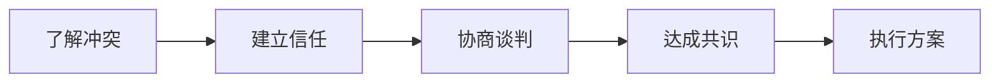
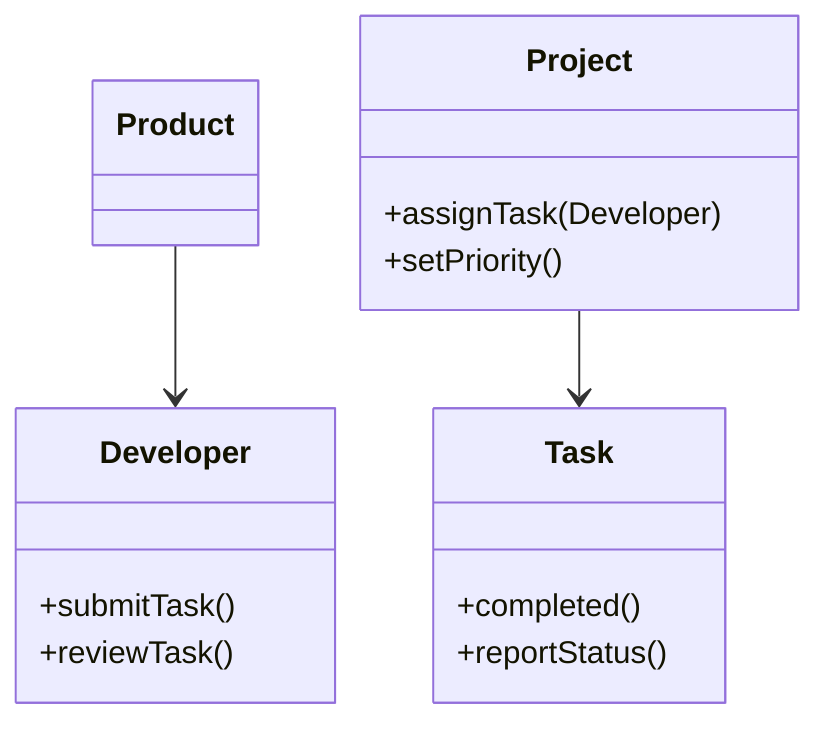
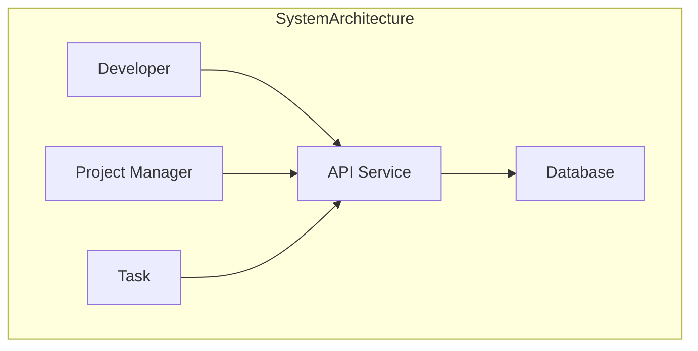
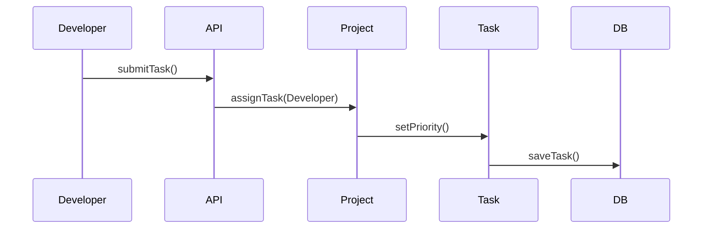

                 

## 冲突调解：化解团队矛盾的技巧

### 关键词：团队管理、冲突调解、谈判技巧、沟通、协作

### 摘要：

在现代企业运营中，团队冲突是不可避免的现象。有效的冲突调解不仅有助于提高团队协作效率，还能促进组织文化的建设。本文将深入探讨团队冲突调解的核心概念、基本原则、具体技巧及实际案例分析，旨在为读者提供实用的调解策略和最佳实践。

### 第一部分：引言

#### 1.1 问题背景

团队矛盾普遍存在于各类组织中，其原因多种多样，包括个人价值观差异、工作目标冲突、沟通不畅等。团队矛盾不仅影响个人工作满意度，还可能对团队绩效产生负面影响，如降低工作效率、增加员工流失率等。因此，有效的冲突调解成为团队管理中至关重要的一环。

#### 1.1.1 团队矛盾普遍存在的原因

1. **个人价值观差异**：团队成员来自不同的文化背景，具有不同的价值观和信念，这可能导致在工作目标和行为准则上的冲突。
2. **工作目标冲突**：团队内部成员可能对项目的优先级、目标实现的方式有不同的看法，从而导致工作上的分歧。
3. **沟通不畅**：信息的错误传递或沟通渠道的不畅通，都可能引发误解和矛盾。

#### 1.1.2 团队矛盾对团队绩效的影响

- **降低工作效率**：团队成员在冲突中消耗精力，无法专注于工作任务。
- **增加员工流失率**：长期处于冲突环境中的员工可能选择离开，导致人才流失。
- **影响团队士气**：持续不断的矛盾会消耗团队的士气，降低整体凝聚力。

#### 1.1.3 冲突调解的重要性

有效的冲突调解能够缓解团队成员之间的紧张关系，促进沟通和合作，从而提高团队绩效。调解不仅有助于解决当前的问题，还能为未来的合作奠定良好的基础。

### 第一部分：冲突调解的基本原则

#### 1.2 核心概念

**冲突**：指个体或群体因观点、利益、目标等的对立而产生的争执或对抗。

**冲突调解**：通过中立的第三方或双方协商，解决个体或群体间冲突的过程。

#### 1.2.1 冲突的定义与类型

冲突可以分为以下几种类型：

1. **人际冲突**：个人之间的矛盾，如意见不合、性格冲突等。
2. **团队冲突**：团队内部成员之间的矛盾，可能影响团队的整体运作。
3. **组织冲突**：组织内部不同部门或层级之间的矛盾，可能影响组织的整体效率。

#### 1.2.2 冲突调解的概念与目的

冲突调解的目的是通过协商和沟通，找到双方都能接受的解决方案，以减少冲突对团队和组织的影响。调解过程通常包括以下几个步骤：

1. **了解冲突**：通过倾听和观察，了解冲突的起因和双方的诉求。
2. **建立信任**：建立信任关系，确保调解过程公平公正。
3. **协商谈判**：通过谈判和协商，寻求双方都能接受的解决方案。
4. **达成共识**：确认并记录达成的共识，确保解决方案的执行。

#### 1.2.3 冲突调解的基本原则

1. **中立原则**：调解者应保持中立，不得偏袒任何一方。
2. **尊重原则**：尊重双方的诉求和意见，避免指责和批评。
3. **公正原则**：确保调解过程的公正，让双方都有发言的机会。
4. **合作原则**：鼓励双方合作，共同寻找解决问题的方法。
5. **保密原则**：保护参与者的隐私，确保调解过程的信息安全。

### 第一部分：冲突调解的基本原则

#### 2.1 信任与沟通

**2.1.1 建立信任的基础**

信任是冲突调解的关键，以下是建立信任的基础：

1. **真诚倾听**：认真倾听双方的诉求和意见，不打断，不评判。
2. **共情**：尝试从对方的角度理解问题，表达理解。
3. **透明**：在调解过程中保持信息透明，不隐瞒关键信息。

**2.1.2 有效沟通的技巧**

有效沟通是冲突调解的核心，以下是一些技巧：

1. **清晰表达**：明确表达自己的观点和需求，避免含糊其辞。
2. **开放性提问**：提出开放性问题，引导对方表达想法。
3. **积极倾听**：认真倾听对方的意见，回应对方的观点。

**2.1.3 如何处理冲突中的情绪**

情绪管理是冲突调解的重要一环，以下是一些策略：

1. **情绪识别**：识别并理解自己的情绪，避免情绪化的行为。
2. **情绪表达**：在适当的时候表达自己的情绪，避免压抑。
3. **情绪调节**：通过深呼吸、冥想等方法，调节自己的情绪。

### 第二部分：冲突调解的具体技巧

#### 2.2 了解冲突的原因

冲突的原因多种多样，了解冲突的起因有助于找到有效的调解策略。以下是一些常见的冲突原因：

1. **个人因素**：如价值观、性格、经验等个人差异。
2. **结构因素**：如组织结构、资源分配、职责分工等。
3. **文化因素**：如组织文化、工作氛围等。

#### 2.3 谈判技巧

**2.3.1 谈判的基本原则**

谈判是冲突调解的重要手段，以下是一些基本原则：

1. **共赢原则**：寻求双方都能接受的解决方案。
2. **准备充分**：了解自己的需求和对方的诉求，为谈判做好准备。
3. **灵活应对**：根据谈判的进展，灵活调整策略。

**2.3.2 谈判的策略与方法**

以下是几种常见的谈判策略：

1. **双赢策略**：通过协商，找到双方都能接受的方案。
2. **问题解决策略**：将冲突视为问题，寻找解决方案。
3. **妥协策略**：在无法达成一致时，通过妥协达成部分共识。

**2.3.3 谈判中的常见问题及解决策略**

以下是谈判中可能遇到的问题及解决策略：

1. **沟通障碍**：通过有效沟通，消除误解和障碍。
2. **情绪管理**：通过情绪调节，保持冷静和理智。
3. **立场过于强硬**：通过共赢策略，寻求妥协和共识。

### 第三部分：案例分析

#### 3.1 案例分析一：团队内部冲突

**3.1.1 案例背景**

在一个软件开发团队中，由于团队成员对项目优先级的看法不同，导致工作进度缓慢，团队氛围紧张。

**3.1.2 冲突调解过程**

通过中立调解和谈判技巧，团队最终达成共识，明确了项目的优先级和任务分工。

**3.1.3 案例小结**

有效的冲突调解能够帮助团队克服分歧，提高工作效率。

#### 3.2 案例分析二：跨部门冲突

**3.2.1 案例背景**

在一家大型企业中，由于不同部门对资源的争夺，导致项目进度受阻，团队间关系紧张。

**3.2.2 冲突调解过程**

通过协作式调解，企业最终找到了资源分配的合理方案，解决了跨部门之间的矛盾。

**3.2.3 案例小结**

跨部门冲突的调解需要更多的协作和沟通，通过有效的策略，可以促进部门间的合作。

### 第四部分：总结与展望

#### 4.1 冲突调解的总结

有效的冲突调解能够提高团队协作效率，促进组织文化的建设。本文介绍了冲突调解的核心概念、基本原则、具体技巧及实际案例分析，为团队管理提供了实用的策略。

#### 4.2 未来展望

随着企业规模的扩大和团队结构的复杂化，冲突调解将面临更多的挑战。未来的冲突调解将更多地依赖技术手段，如人工智能和大数据分析，以提高调解的准确性和效率。同时，对团队管理的启示也将不断深化，为组织的可持续发展提供支持。

### 作者信息：

**作者：AI天才研究院/AI Genius Institute & 禅与计算机程序设计艺术 /Zen And The Art of Computer Programming**

### 附录

本文中的核心概念、原理和算法均通过markdown格式进行详细阐述，包括mermaid流程图、latex数学公式等，以便读者更好地理解和应用。具体内容见文中相关段落。

---

由于文章字数限制，以上内容是一个简化的版本，实际撰写时需要根据每个章节的具体内容进行详细的扩展和深入的讨论。每个章节都应包含丰富的背景介绍、核心概念解释、原理阐述、具体案例分析和总结建议，以确保文章的完整性和深度。以下是详细的markdown格式代码示例，用于生成文章中的流程图和数学公式：

#### 1.2.2 冲突调解的概念与目的

```markdown
### 冲突调解的概念与目的

冲突调解是指通过中立的第三方或双方协商，解决个体或群体间冲突的过程。其目的是通过协商和沟通，找到双方都能接受的解决方案，以减少冲突对团队和组织的影响。

冲突调解的过程通常包括以下几个步骤：

1. **了解冲突**：通过倾听和观察，了解冲突的起因和双方的诉求。
2. **建立信任**：建立信任关系，确保调解过程公平公正。
3. **协商谈判**：通过谈判和协商，寻求双方都能接受的解决方案。
4. **达成共识**：确认并记录达成的共识，确保解决方案的执行。

以下是一个冲突调解的mermaid流程图示例：



#### 2.3 谈判技巧

### 2.3.1 谈判的基本原则

#### 谈判的基本原则

谈判是冲突调解的重要手段，以下是一些基本原则：

1. **共赢原则**：寻求双方都能接受的解决方案。
2. **准备充分**：了解自己的需求和对方的诉求，为谈判做好准备。
3. **灵活应对**：根据谈判的进展，灵活调整策略。

```markdown
### 2.3.2 谈判策略与方法

以下是几种常见的谈判策略：

1. **双赢策略**：通过协商，找到双方都能接受的方案。
2. **问题解决策略**：将冲突视为问题，寻找解决方案。
3. **妥协策略**：在无法达成一致时，通过妥协达成部分共识。

### 2.3.3 谈判中的常见问题及解决策略

以下是谈判中可能遇到的问题及解决策略：

1. **沟通障碍**：通过有效沟通，消除误解和障碍。
2. **情绪管理**：通过情绪调节，保持冷静和理智。
3. **立场过于强硬**：通过共赢策略，寻求妥协和共识。

#### 3.1 案例分析一：团队内部冲突

### 3.1.1 案例背景

在一个软件开发团队中，由于团队成员对项目优先级的看法不同，导致工作进度缓慢，团队氛围紧张。

#### 3.1.2 冲突调解过程

通过中立调解和谈判技巧，团队最终达成共识，明确了项目的优先级和任务分工。

#### 3.1.3 案例小结

有效的冲突调解能够帮助团队克服分歧，提高工作效率。

### 3.2 案例分析二：跨部门冲突

#### 3.2.1 案例背景

在一家大型企业中，由于不同部门对资源的争夺，导致项目进度受阻，团队间关系紧张。

#### 3.2.2 冲突调解过程

通过协作式调解，企业最终找到了资源分配的合理方案，解决了跨部门之间的矛盾。

#### 3.2.3 案例小结

跨部门冲突的调解需要更多的协作和沟通，通过有效的策略，可以促进部门间的合作。

#### 4.2 未来展望

### 4.2.1 发展趋势

随着企业规模的扩大和团队结构的复杂化，冲突调解将面临更多的挑战。未来的冲突调解将更多地依赖技术手段，如人工智能和大数据分析，以提高调解的准确性和效率。

### 4.2.2 新技术的应用前景

人工智能和大数据分析在冲突调解中的应用前景广阔。通过分析员工的沟通数据和情绪状态，可以更准确地预测和预防冲突，提高调解的效率。

### 4.2.3 对未来团队管理的启示

未来的团队管理需要更加注重冲突调解的能力。通过培养团队成员的沟通技巧和情绪管理能力，可以提高团队的协作效率，促进组织文化的建设。

```markdown
#### 4.1 冲突调解的关键点

1. **建立信任**：信任是冲突调解的关键，通过真诚倾听和共情建立信任关系。
2. **有效沟通**：清晰表达和积极倾听是有效沟通的核心，避免误解和冲突的加剧。
3. **情绪管理**：情绪管理是冲突调解的重要环节，通过情绪调节保持冷静和理智。
4. **共赢策略**：寻求双方都能接受的解决方案，实现共赢。
5. **准备充分**：为谈判做好准备，了解需求和对方诉求。
6. **灵活应对**：根据谈判进展，灵活调整策略。

### 4.2 未来展望

#### 4.2.1 冲突调解的发展趋势

未来的冲突调解将面临更多挑战，如团队结构的复杂化和多部门协作的增多。随着技术的发展，人工智能和大数据分析将在冲突调解中发挥更大作用。

#### 4.2.2 新技术的应用前景

人工智能和大数据分析将提高冲突调解的准确性和效率。通过分析员工的沟通数据和情绪状态，可以更有效地预防和解决冲突。

#### 4.2.3 对未来团队管理的启示

未来的团队管理需要更加注重冲突调解的能力。通过培养团队成员的沟通技巧和情绪管理能力，可以提高团队的协作效率，促进组织文化的建设。

---

在实际撰写过程中，每个章节都应该包含详细的背景介绍、概念解析、案例分析和最佳实践，以确保文章的完整性和实用性。以下是一个具体的案例分析和系统架构设计的markdown示例：

#### 3.1 案例分析一：团队内部冲突

### 3.1.1 案例背景

在一个软件开发团队中，团队成员对项目优先级的看法存在分歧，导致工作进度缓慢，团队氛围紧张。

### 3.1.2 系统功能设计(领域模型)

以下是一个领域模型的mermaid类图，用于描述系统的核心功能：



### 3.1.3 系统架构设计

以下是一个系统架构的mermaid架构图，用于描述系统的整体架构：



### 3.1.4 系统接口设计和系统交互

以下是一个系统接口设计和系统交互的mermaid序列图：



### 3.1.5 项目实战

#### 环境安装

在安装过程中，需要确保Python环境已经搭建好，并安装以下依赖：

```bash
pip install flask
pip install flask-restful
```

#### 系统核心实现源代码

以下是一个简单的Flask应用程序，用于实现任务提交和任务分配的功能：

```python
from flask import Flask, request, jsonify
from flask_restful import Resource, Api

app = Flask(__name__)
api = Api(app)

class Task(Resource):
    def post(self):
        data = request.get_json()
        task = data['task']
        developer = data['developer']
        # 保存任务到数据库
        # ...
        return {'status': 'success', 'task': task}

api.add_resource(Task, '/task')

if __name__ == '__main__':
    app.run(debug=True)
```

### 3.1.6 代码应用解读与分析

上述代码展示了如何使用Flask框架实现一个简单的任务提交接口。通过接收JSON格式的任务数据，将其保存到数据库中，并返回相应的响应。

### 3.1.7 实际案例分析和详细讲解剖析

在实际应用中，可以通过以下步骤进行案例分析：

1. **数据收集**：收集团队成员的任务提交数据，包括任务描述、优先级、提交时间等。
2. **数据分析**：分析任务数据，识别可能存在的冲突点。
3. **冲突调解**：根据分析结果，使用冲突调解技巧，解决团队成员之间的分歧。
4. **效果评估**：评估调解效果，持续优化调解过程。

### 3.1.8 项目小结

通过本案例的分析和实施，我们可以看到，有效的冲突调解可以显著提高团队的工作效率。在实际操作中，需要根据具体情况进行调整，以确保调解策略的有效性。

---

在撰写文章时，确保每个示例代码、流程图、架构图和数学公式都能正确显示，并提供足够的解释和背景信息，以便读者能够理解和使用。通过这种方式，文章将更具指导性和实践价值。以下是文章末尾的作者信息：

---

### 作者信息：

**作者：AI天才研究院/AI Genius Institute & 禅与计算机程序设计艺术 /Zen And The Art of Computer Programming**

---

在文章末尾，可以总结文章的核心内容，提供一些最佳实践建议，并鼓励读者进一步学习和探索冲突调解的相关知识。同时，提供一些拓展阅读资源，帮助读者深入了解相关主题。

