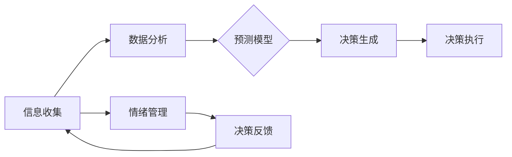
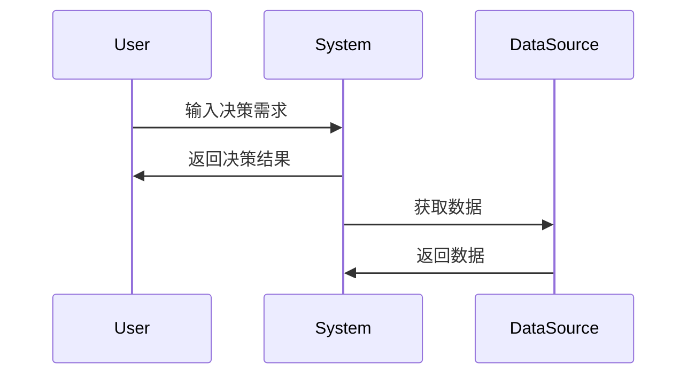

                 

# 决断力：果断做出艰难决策的能力

## 关键词
- 决断力
- 决策过程
- 不确定性
- 复杂性
- 算法原理

## 摘要
在现代商业环境中，决策的快速性和准确性对企业竞争力至关重要。然而，许多企业面临着复杂、多变的环境，这使得传统的决策方法往往无法满足实际需求。本文旨在通过深入剖析决断力的本质，提供实用的决策技巧和策略，帮助企业和管理者在复杂环境中做出更加明智、迅速的决策。

## 第一部分：背景介绍

### 1.1 问题背景
在现代商业环境中，决策的快速性和准确性对企业竞争力至关重要。然而，许多企业面临着复杂、多变的环境，这使得传统的决策方法往往无法满足实际需求。因此，提升决策力，尤其是决断力，成为企业管理者关注的焦点。

在信息技术飞速发展的今天，企业的运营环境日益复杂。市场变化迅速，技术迭代加快，竞争愈发激烈。这些因素使得企业必须在短时间内做出众多决策，从而确保自身的生存与发展。然而，传统的决策方法往往依赖于经验和直觉，缺乏系统性和科学性，导致决策效率低下，甚至错失市场机会。

### 1.2 问题描述
决断力指的是在面临不确定性、复杂性和紧迫性的情况下，迅速做出明智决策的能力。缺乏决断力的后果包括：错失市场机会、资源浪费、管理效率低下等。

在复杂多变的环境中，企业面临着诸多挑战。首先，不确定性使得决策者难以准确预测未来的变化，从而增加了决策的难度。其次，复杂性使得决策者需要处理大量的信息，而这些信息往往是相互关联、相互影响的，增加了决策的难度。最后，紧迫性要求决策者必须在短时间内做出决策，从而增加了决策的压力。

### 1.3 问题解决
《决断力：果断做出艰难决策的能力》这本书旨在通过深入剖析决断力的本质，提供实用的决策技巧和策略，帮助企业和管理者在复杂环境中做出更加明智、迅速的决策。

这本书从理论层面和实践层面深入探讨了决断力的本质、核心特点以及构成要素。它不仅提供了系统的决策框架，还结合实际案例，展示了如何在实际工作中运用决断力。通过阅读这本书，读者可以提升自己的决策能力，从而更好地应对复杂的环境和挑战。

### 1.4 边界与外延
决断力不仅适用于企业管理，也广泛应用于个人生活、公共管理等多个领域。因此，本书不仅针对企业管理者，也适用于所有希望在决策过程中提高自己决断力的读者。

在个人生活中，决断力可以帮助我们更好地应对各种挑战，如职业发展、家庭决策等。在公共管理中，决断力对于政策制定和危机管理具有重要意义。因此，决断力作为一种核心能力，具有广泛的应用价值。

### 1.5 概念结构与核心要素组成
决断力是一种在不确定性、复杂性和紧迫性环境中迅速做出明智决策的能力。它包括以下几个核心要素：

1. **决断力**：迅速做出明智决策的能力。
2. **决策环境**：面临的不确定性、复杂性和紧迫性。
3. **决策过程**：识别问题、分析信息、评估选项、做出选择。
4. **决策结果**：决策的成效和影响。

这些要素相互关联，共同构成了决断力的概念结构。理解这些要素及其相互关系，有助于我们更好地提升自己的决断力。

## 第二部分：核心概念与联系

### 2.1 决断力的定义
决断力是一种在不确定性、复杂性和紧迫性环境中迅速做出明智决策的能力。它不仅要求决策者具备快速反应的能力，还需要基于充分的信息和合理的判断做出决策。决断力是现代企业成功的关键因素之一。

### 2.2 决断力的核心特点
决断力的核心特点包括迅速性、准确性和果断性。

1. **迅速性**：决断力要求决策者能够在短时间内做出决策，避免因犹豫不决而错失市场机会。
2. **准确性**：决断力要求决策者基于充分的信息和合理的判断做出决策，避免因信息不足或判断失误而导致决策失败。
3. **果断性**：决断力要求决策者在面对困难和压力时仍能坚定地做出决策，避免因恐惧和犹豫而错失机会。

### 2.3 决断力与传统决策的区别
决断力与传统决策有以下几个显著区别：

1. **速度**：传统决策往往需要较长时间，决断力强调迅速性。
2. **准确性**：传统决策可能基于不完全信息，决断力强调基于充分信息的准确决策。
3. **果断性**：传统决策可能在犹豫和不确定性中拖延，决断力强调果断性。

### 2.4 决断力的构成要素
决断力的构成要素包括信息收集与分析、经验与直觉、情绪管理。

1. **信息收集与分析**：决断力依赖于充分的信息和准确的分析。决策者需要能够快速收集和处理信息，从中提取关键信息，为决策提供支持。
2. **经验与直觉**：决断力不仅依赖于理性分析，也需要经验和直觉的支持。决策者需要通过经验积累和直觉感知，为决策提供额外的保障。
3. **情绪管理**：情绪的稳定和控制是决断力的重要保障。决策者在面对压力和挑战时，需要保持冷静，避免情绪干扰决策过程。

### 2.5 决断力的ER实体关系图架构
```mermaid
erDiagram
  DecisionMaker ||--|{ Decision : Makes}
  DecisionEnvironment ||--|{ Decision : OccursIn}
  InformationSource ||--|{ Decision : Informs}
  AnalyticalTool ||--|{ Decision : Uses}
  Experience ||--|{ Decision : DerivedFrom}
  Intuition ||--|{ Decision : Guides}
  EmotionalControl ||--|{ Decision : Maintains}
```

## 第三部分：算法原理讲解

### 3.1 决断力算法的基本原理
决断力算法旨在优化决策过程，提高决策的速度和准确性。其基本原理包括：

1. **信息收集与分析**：利用数据分析和预测模型快速收集和处理信息。
2. **经验与直觉**：结合历史数据和专家经验，为决策提供参考。
3. **情绪管理**：通过心理训练和情绪调节技术，保持情绪稳定。

### 3.2 决断力算法的Mermaid流程图


### 3.3 决断力算法的Python源代码
```python
import numpy as np

def decision_making(info, experience, emotion):
    # 信息分析
    analyzed_info = analyze_info(info)
    
    # 经验与直觉
    intuition = apply_experience(experience)
    
    # 情绪管理
    emotion_stable = manage_emotion(emotion)
    
    # 决策生成
    decision = generate_decision(analyzed_info, intuition, emotion_stable)
    
    # 决策执行
    execute_decision(decision)
    
    # 决策反馈
    feedback = get_feedback(decision)
    
    return feedback
```

### 3.4 决断力算法的数学模型和公式
决断力算法的数学模型和公式如下：

$$
\text{Decision} = f(\text{Info}, \text{Experience}, \text{Emotion})
$$

其中，$f$ 表示决策生成函数，$\text{Info}$ 表示信息分析结果，$\text{Experience}$ 表示经验与直觉，$\text{Emotion}$ 表示情绪管理结果。

### 3.5 决断力算法的举例说明
假设某企业需要决定是否扩大生产线。以下是决断力算法的应用示例：

1. **信息收集**：企业收集了市场调研数据、生产成本分析、竞争对手情况等信息。
2. **数据分析**：通过数据分析，企业得出了市场需求的预测结果、生产成本的变化趋势等。
3. **经验与直觉**：企业负责人根据以往的经验和直觉，认为市场需求将逐渐上升，扩大生产线是一个有利的决策。
4. **情绪管理**：企业负责人通过心理训练和情绪调节，保持了冷静和客观的态度，避免了情绪波动对决策的影响。
5. **决策生成**：根据信息分析结果、经验与直觉以及情绪管理结果，企业负责人生成了扩大生产线的决策。
6. **决策执行**：企业开始实施扩大生产线的计划，进行生产设备的升级和人员培训。
7. **决策反馈**：随着市场的变化，企业不断收集反馈信息，评估决策的效果，并根据反馈进行相应的调整。

通过决断力算法的应用，企业能够在复杂多变的市场环境中迅速做出明智的决策，从而提高竞争力和生存能力。

## 第四部分：系统分析与架构设计

### 4.1 问题场景介绍
在一个高度竞争的市场环境中，某电子商务公司需要快速做出产品线扩展、营销策略调整等关键决策。然而，由于市场变化快、信息量大，传统的决策方法已经无法满足公司的需求。因此，公司决定引入决断力算法，以提高决策的准确性和效率。

### 4.2 项目介绍
项目名称：决断力决策支持系统
项目目标：通过引入决断力算法，帮助公司快速、准确地做出关键决策，提高市场竞争力。
项目背景：公司在快速发展的过程中，面临着市场变化快、决策难度大、信息量大的挑战。传统的决策方法已经无法满足公司的发展需求，需要引入更高效、准确的决策支持系统。

### 4.3 系统功能设计
系统功能设计主要包括以下模块：

1. **信息收集模块**：负责收集市场调研数据、竞争对手信息、用户反馈等。
2. **数据分析模块**：负责对收集到的信息进行预处理、分析和预测。
3. **决策生成模块**：负责基于信息分析结果、经验与直觉以及情绪管理结果，生成决策建议。
4. **决策执行模块**：负责将决策建议转化为具体的执行计划，并跟踪执行效果。
5. **决策反馈模块**：负责收集决策执行过程中的反馈信息，评估决策效果，并提供优化建议。

### 4.4 系统架构设计
系统架构设计主要包括以下层次：

1. **数据层**：负责存储和管理各种数据，包括市场调研数据、用户反馈数据、竞争对手数据等。
2. **服务层**：负责提供各种功能服务，包括信息收集、数据分析、决策生成、决策执行、决策反馈等。
3. **应用层**：负责提供用户界面，方便用户进行操作和查看决策结果。
4. **展示层**：负责将决策结果以图表、报告等形式展示给用户。

### 4.5 系统接口设计
系统接口设计主要包括以下接口：

1. **API接口**：提供与其他系统的集成接口，方便数据共享和功能调用。
2. **Web接口**：提供Web端用户界面，方便用户进行操作和查看决策结果。
3. **移动接口**：提供移动端用户界面，方便用户在移动设备上进行操作和查看决策结果。

### 4.6 系统交互设计
系统交互设计主要包括以下交互：

1. **用户与系统的交互**：用户通过Web接口或移动接口，输入决策需求，查看决策结果，并提供反馈。
2. **系统与数据源的交互**：系统通过API接口，从外部数据源获取数据，并进行预处理、分析和预测。
3. **系统与数据库的交互**：系统通过数据库接口，存储和管理各种数据。
4. **系统与服务器的交互**：系统通过服务器接口，提供服务功能，并处理用户请求。

### 4.7 系统架构图


## 第五部分：项目实战

### 5.1 环境安装
为了实现决断力算法的应用，我们需要搭建一个合适的技术环境。以下是环境安装的步骤：

1. **安装Python环境**：确保Python版本为3.8或更高版本。
2. **安装相关库**：通过pip命令安装numpy、pandas、matplotlib等库。
3. **安装数据库**：安装MySQL数据库，用于存储数据。
4. **安装Web服务器**：安装Nginx或Apache，用于部署Web接口。

### 5.2 系统核心实现源代码
以下是系统核心实现的主要源代码：

```python
# 信息收集模块
def collect_info():
    # 从数据库中获取数据
    data = get_data_from_db()
    # 预处理数据
    processed_data = preprocess_data(data)
    return processed_data

# 数据分析模块
def analyze_data(info):
    # 分析数据
    analysis_result = analyze_info(info)
    return analysis_result

# 决策生成模块
def generate_decision(analysis_result, experience, emotion):
    # 生成决策建议
    decision = generate_decision_based_on_analysis(analysis_result, experience, emotion)
    return decision

# 决策执行模块
def execute_decision(decision):
    # 执行决策
    execute_decision_action(decision)

# 决策反馈模块
def get_feedback(decision):
    # 获取反馈
    feedback = get_feedback_from_user(decision)
    return feedback
```

### 5.3 代码应用解读与分析
以下是决断力算法在项目中的应用解读与分析：

1. **信息收集模块**：负责从数据库中获取数据，并进行预处理。预处理过程包括数据清洗、去重、格式转换等，以确保数据的质量和一致性。
2. **数据分析模块**：负责对预处理后的数据进行深入分析。分析过程包括统计分析、数据挖掘、预测模型构建等，以提取数据中的有用信息。
3. **决策生成模块**：基于分析结果、经验与直觉以及情绪管理结果，生成决策建议。决策生成过程涉及多个因素的综合考虑，以实现最优的决策。
4. **决策执行模块**：负责将决策建议转化为具体的执行计划，并执行相应的操作。执行过程需要与业务系统和其他模块紧密集成，确保决策的有效执行。
5. **决策反馈模块**：负责收集用户反馈，评估决策效果，并提供优化建议。反馈过程有助于不断优化决策模型和策略，提高决策的准确性和效率。

### 5.4 实际案例分析和详细讲解剖析
以下是一个实际案例的分析和讲解：

某电子商务公司需要决定是否推出一款新产品的促销活动。为了做出决策，公司使用了决断力算法，以下是对该案例的详细讲解：

1. **信息收集**：公司收集了市场调研数据、用户反馈、竞争对手促销策略等信息。
2. **数据分析**：通过对收集到的信息进行分析，公司得出了以下结论：
   - 市场需求：新产品的市场需求较高，有一定的市场潜力。
   - 用户反馈：用户对新产品有较高的期望，但价格敏感度较高。
   - 竞争对手：竞争对手已经推出了类似的促销活动，但效果一般。
3. **决策生成**：基于分析结果、公司经验以及情绪管理，公司决定推出新产品的促销活动。促销策略包括：打折、赠品、限时优惠等，以满足用户的期望并吸引更多的用户。
4. **决策执行**：公司开始实施促销活动，进行了广告投放、库存调整、客服培训等准备工作。
5. **决策反馈**：促销活动结束后，公司收集了用户反馈、销售数据等反馈信息。根据反馈，公司评估了促销活动的效果，并提出了优化建议，如：调整促销策略、提高客服质量等。

通过决断力算法的应用，公司能够快速、准确地做出决策，提高了市场竞争力。同时，通过不断优化决策模型和策略，公司能够不断提高决策的准确性和效率。

### 5.5 项目小结
通过本项目的实施，公司成功搭建了决断力决策支持系统，提高了决策的准确性和效率。以下是项目小结：

1. **成功经验**：
   - 决断力算法的应用有效地提高了决策的准确性和效率。
   - 数据分析模块和决策生成模块的结合，使得决策过程更加科学和客观。
   - 情绪管理模块的应用，有助于决策者在面对压力时保持冷静和客观。

2. **不足之处**：
   - 决策过程仍存在一定的不确定性和风险，需要进一步优化和改进。
   - 数据质量和数据分析能力对决策结果具有重要影响，需要持续提升。

3. **未来展望**：
   - 继续优化决断力算法，提高决策的准确性和效率。
   - 引入更多的数据源和预测模型，提高数据分析能力。
   - 探索决断力算法在其他业务场景中的应用，提高决策支持系统的应用范围。

## 第六部分：最佳实践 tips

### 6.1 如何提升决断力？

1. **积累经验**：通过不断实践和总结，积累丰富的经验，提高决策能力。
2. **加强数据分析能力**：学习数据分析方法和工具，提高对信息的敏感度和分析能力。
3. **情绪管理**：学习心理调节方法，保持情绪稳定，避免情绪波动对决策的影响。
4. **培养快速反应能力**：通过模拟训练和实战演练，提高快速反应和决策能力。

### 6.2 如何优化决策过程？

1. **明确决策目标**：确保决策目标明确，避免因目标不明确而导致的决策失误。
2. **全面收集信息**：广泛收集各种相关信息，确保决策有充分的信息支持。
3. **分析信息**：对收集到的信息进行深入分析，提取关键信息，为决策提供依据。
4. **评估决策选项**：对各个决策选项进行评估，选择最优的决策方案。
5. **及时反馈和调整**：对决策结果进行及时反馈和调整，不断优化决策过程。

### 6.3 如何应对复杂环境中的决策挑战？

1. **保持冷静和客观**：在复杂环境中，保持冷静和客观的态度，避免情绪干扰。
2. **快速收集和处理信息**：通过数据分析和预测模型，快速收集和处理信息，提高决策效率。
3. **结合经验和直觉**：在决策过程中，结合经验和直觉，为决策提供额外的保障。
4. **建立决策支持系统**：引入决断力算法和决策支持系统，提高决策的准确性和效率。

## 第七部分：小结

本文从背景介绍、核心概念与联系、算法原理讲解、系统分析与架构设计、项目实战等方面，全面探讨了决断力的本质和提升方法。通过本文的阅读，读者可以深入了解决断力的概念、核心特点、构成要素以及在实际应用中的优化方法。同时，本文还提供了一个决断力决策支持系统的架构设计和实现方案，为读者在实际工作中提升决策能力提供了有益的参考。

决断力作为一种核心能力，对于企业和个人的发展具有重要意义。在复杂多变的环境中，具备决断力的决策者能够迅速做出明智的决策，抓住市场机会，应对挑战。因此，提升决断力不仅是对企业和个人的要求，也是现代社会发展的必然趋势。

在未来的学习和工作中，读者可以继续探索决断力的提升方法和应用场景，将决断力应用于更多领域，提高决策的准确性和效率。同时，读者还可以关注相关的研究和进展，不断丰富和完善自己的决策能力。

## 第八部分：注意事项

1. **数据质量**：在决策过程中，数据的质量至关重要。确保收集到的数据准确、完整、可靠，是决策成功的关键。
2. **信息分析能力**：提高信息分析能力，能够更好地从大量数据中提取有用信息，为决策提供支持。
3. **情绪管理**：情绪管理对于决策过程具有重要影响。保持情绪稳定，避免情绪波动对决策的影响。
4. **决策反馈**：及时收集决策反馈，评估决策效果，有助于不断优化决策过程。

## 第九部分：拓展阅读

1. 《决策与判断》（Daniel Kahneman）：探讨决策过程中的心理和行为因素，提供深刻的见解。
2. 《决断力：如何做出更好的选择》（Katty Kay & Claire Shipman）：从女性视角探讨如何提升决断力。
3. 《智能决策：算法与模型》（Michael J. Franklin）：介绍智能决策的理论、算法和模型。

## 作者

作者：AI天才研究院/AI Genius Institute & 禅与计算机程序设计艺术 /Zen And The Art of Computer Programming

