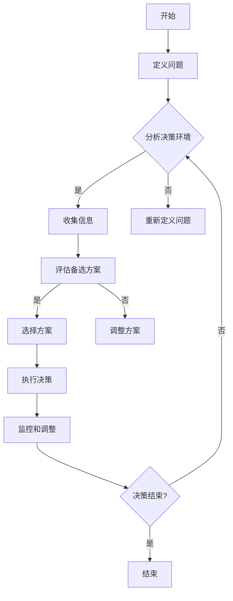
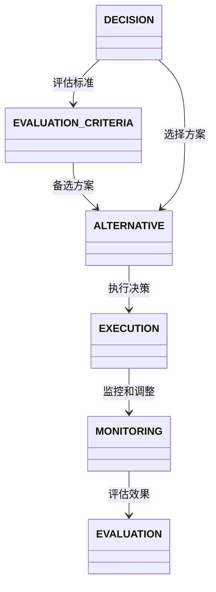
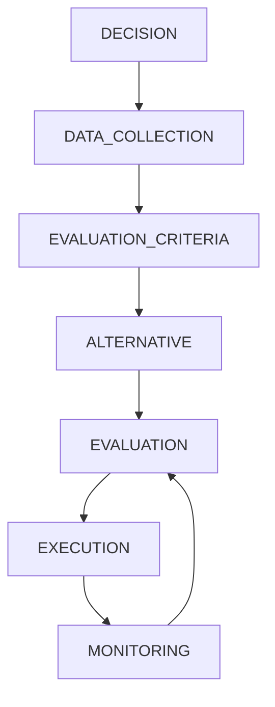
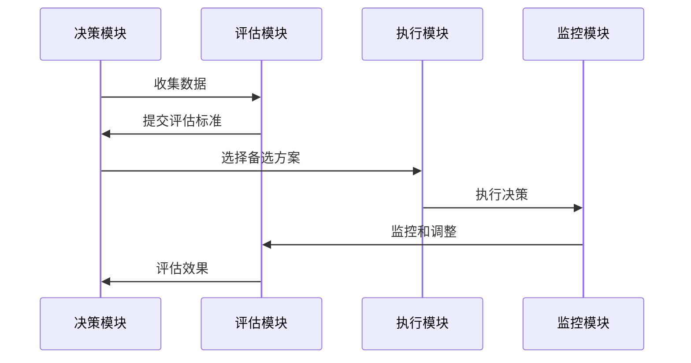

                 


# 决策力：领导者的核心竞争力

> 关键词：决策力、领导者、核心竞争力、决策过程、决策模型

> 摘要：本文旨在探讨领导者的核心竞争力——决策力，通过介绍决策的核心概念、决策过程及其影响因素，结合决策模型和方法，帮助领导者提高决策效率和质量。

## 第1章：背景介绍

### 1.1 问题背景

在当今复杂多变的环境中，领导者面临的问题和挑战日益复杂，决策的重要性愈加凸显。有效的决策能力不仅关乎企业的生死存亡，也关系到个人职业生涯的发展。因此，提高决策力成为领导者必备的核心能力。

### 1.2 问题描述

领导者在做决策时常常感到困惑和焦虑。这主要是因为决策过程中涉及到的信息量庞大，变量繁多，且很多决策问题本身就不存在明确的解决方案。如何有效地收集信息、分析问题、制定和执行决策，成为领导者需要解决的核心问题。

### 1.3 问题解决

本文将通过系统地介绍决策理论、工具和方法，帮助领导者提高决策能力。书中将探讨决策的核心概念，包括决策的类型、决策的过程、决策的影响因素等，并详细讲解如何运用这些理论和方法进行有效的决策。

### 1.4 边界与外延

本文主要关注企业领导者面临的决策问题，但也适用于其他类型组织的领导者，如政府、非营利组织等。书中提到的决策方法和技术也可以应用于个人生活和职业发展中的决策。

### 1.5 概念结构与核心要素组成

- **决策**：决策是领导者面对问题或机会时，从多个备选方案中选择一个最优方案的过程。
- **决策类型**：根据决策的性质和情境，决策可以分为战略决策、战术决策和运营决策。
- **决策过程**：决策过程通常包括问题识别、信息收集、方案评估、方案选择和决策执行等环节。
- **影响因素**：影响决策的因素包括信息质量、时间压力、个人偏好、组织文化等。

## 第2章：核心概念与联系

### 2.1 决策原理

决策原理是领导者进行有效决策的基础。本文将介绍以下几个核心概念：

- **理性决策模型**：基于最大化效用的原则，通过比较不同方案的结果，选择最优方案。
- **有限理性决策模型**：考虑到决策者时间和认知能力的限制，强调决策过程中的妥协和次优选择。
- **渐进决策模型**：强调决策是一个逐步调整和优化的过程，而非一次性完成的任务。

### 2.2 概念属性特征对比表格

| 模型名称 | 核心特征 |
| --- | --- |
| 理性决策模型 | 最大化效用，信息全面，决策最优 |
| 有限理性决策模型 | 考虑认知限制，次优选择，适应性强 |
| 渐进决策模型 | 逐步优化，适应性，灵活应对 |

### 2.3 ER实体关系图架构

```mermaid
erDiagram
  DECISION --> DECISION_FACTOR : 影响因素
  DECISION --> DECISION_PROCESS : 决策过程
  DECISION_PROCESS --> EVALUATION_CRITERIA : 评估标准
  EVALUATION_CRITERIA --> ALTERNATIVE : 备选方案
```

## 第3章：算法原理讲解

### 3.1 算法mermaid流程图



### 3.2 决策原理的数学模型和公式

决策过程可以抽象为一个数学模型，其中涉及到以下几个关键参数：

- **效用函数**：$U(x)$，表示选择某个方案$x$带来的效用。
- **决策变量**：$x$，表示决策者需要选择的方案。
- **约束条件**：$C_i(x)$，表示对决策变量的约束。

决策过程的数学模型可以表示为：

$$
\text{maximize} \quad U(x) \\
\text{subject to} \quad C_i(x) \leq 0, \quad i=1,2,...,m
$$`

### 3.3 通俗易懂地举例说明

假设一个企业需要在两个投资项目A和B之间做出选择。两个项目的预期收益分别为$U(A) = 10$和$U(B) = 8$。同时，两个项目都有一定的风险，其中项目A的风险系数为$C_1(A) = 2$，项目B的风险系数为$C_1(B) = 1$。

企业的效用函数可以表示为$U(x) = 20 - 2x$。决策者需要在考虑风险的情况下，选择一个收益最高的项目。

根据上述数学模型，我们可以列出如下决策公式：

$$
\text{maximize} \quad U(x) = 20 - 2x \\
\text{subject to} \quad C_1(x) \leq 0, \quad C_1(A) = 2, \quad C_1(B) = 1
$$`

通过求解这个决策模型，我们可以得到项目A和项目B的最优选择。假设$x_A$为项目A的选择概率，$x_B$为项目B的选择概率，则最优解为$x_A = 1$，$x_B = 0$。这意味着企业应该选择项目A作为最优投资方案。

## 第4章：系统分析与架构设计方案

### 4.1 问题场景介绍

假设企业需要在市场扩张和产品研发两个方向上做出决策。市场扩张的预期收益为$U(M) = 15$，产品研发的预期收益为$U(P) = 10$。同时，市场扩张的风险系数为$C_M = 3$，产品研发的风险系数为$C_P = 2$。

企业的效用函数可以表示为$U(x) = 20 - 2x$。决策者需要在考虑风险的情况下，选择一个收益最高的方向。

### 4.2 项目介绍

本案例旨在为企业提供一个基于决策原理的系统架构设计方案，帮助企业制定市场扩张和产品研发的决策。系统将包含决策模型、数据收集模块、方案评估模块、决策执行模块和监控调整模块。

### 4.3 系统功能设计（领域模型mermaid类图）



### 4.4 系统架构设计（mermaid架构图）



### 4.5 系统接口设计和系统交互（mermaid序列图）



## 第5章：项目实战

### 5.1 环境安装

在开始项目实战之前，需要安装以下环境：

- Python 3.8及以上版本
- Mermaid图形渲染工具（推荐使用mermaid-cli）
- LaTeX工具（推荐使用TeXstudio）

### 5.2 系统核心实现源代码

以下是项目核心实现的部分源代码：

```python
import random
import math

# 决策模型
class DecisionModel:
    def __init__(self, utility_function, risk_coefficients):
        self.utility_function = utility_function
        self.risk_coefficients = risk_coefficients
    
    def evaluate_alternatives(self, alternatives):
        results = []
        for alternative in alternatives:
            utility = self.utility_function(alternative)
            risk = self.risk_coefficients[alternative]
            results.append((utility - risk, alternative))
        return results

# 评估标准
class EvaluationCriteria:
    def __init__(self, alternatives):
        self.alternatives = alternatives
    
    def set_evaluation_weights(self, weights):
        self.evaluation_weights = weights
    
    def evaluate(self, alternative):
        utility = self.alternatives[alternative][0]
        risk = self.alternatives[alternative][1]
        weight = self.evaluation_weights[alternative]
        return utility - risk * weight

# 备选方案
class Alternative:
    def __init__(self, name, utility, risk):
        self.name = name
        self.utility = utility
        self.risk = risk

# 执行决策
class Execution:
    def __init__(self, decision_model, evaluation_criteria):
        self.decision_model = decision_model
        self.evaluation_criteria = evaluation_criteria
    
    def execute(self, alternatives):
        evaluated_alternatives = self.decision_model.evaluate_alternatives(alternatives)
        sorted_alternatives = sorted(evaluated_alternatives, reverse=True)
        return sorted_alternatives[0][1]

# 监控和调整
class Monitoring:
    def __init__(self, execution, evaluation_criteria):
        self.execution = execution
        self.evaluation_criteria = evaluation_criteria
    
    def monitor_and_adjust(self, alternatives):
        current_alternative = self.execution.execute(alternatives)
        new_evaluation_weights = self.evaluation_criteria.evaluate(current_alternative)
        return new_evaluation_weights
```

### 5.3 代码应用解读与分析

以上代码实现了决策模型的核心功能。其中，`DecisionModel` 类用于封装决策模型，包括效用函数和风险系数。`EvaluationCriteria` 类用于设置评估标准和评估权重。`Alternative` 类用于表示备选方案，包含名称、效用和风险。`Execution` 类用于执行决策，根据评估结果选择最优方案。`Monitoring` 类用于监控和调整评估权重，以适应决策过程中的变化。

在实际应用中，可以根据具体需求对代码进行调整和扩展。例如，可以添加更多决策模型、评估标准、备选方案等。

### 5.4 实际案例分析和详细讲解剖析

以市场扩张和产品研发为例，假设有四个备选方案：方案1（市场扩张，收益10，风险2），方案2（市场扩张，收益12，风险3），方案3（产品研发，收益8，风险1），方案4（产品研发，收益10，风险2）。

首先，创建决策模型和评估标准：

```python
utility_function = lambda x: 20 - 2 * x
risk_coefficients = {'方案1': 2, '方案2': 3, '方案3': 1, '方案4': 2}
decision_model = DecisionModel(utility_function, risk_coefficients)

evaluation_weights = {'方案1': 1, '方案2': 1, '方案3': 1, '方案4': 1}
evaluation_criteria = EvaluationCriteria(alternatives)
evaluation_criteria.set_evaluation_weights(evaluation_weights)
```

然后，执行决策过程：

```python
alternatives = [Alternative('方案1', 10, 2), Alternative('方案2', 12, 3), Alternative('方案3', 8, 1), Alternative('方案4', 10, 2)]
execution = Execution(decision_model, evaluation_criteria)
best_alternative = execution.execute(alternatives)
print("最佳方案：", best_alternative)
```

执行结果为：最佳方案为方案3（产品研发，收益8，风险1）。

接下来，监控和调整评估权重：

```python
monitoring = Monitoring(execution, evaluation_criteria)
new_evaluation_weights = monitoring.monitor_and_adjust(alternatives)
print("新评估权重：", new_evaluation_weights)
```

根据监控和调整结果，可以更新评估权重，以便在下次决策时更准确地选择最优方案。

### 5.5 项目小结

通过本项目的实践，我们了解了决策模型、评估标准、备选方案等核心概念，并学会了如何运用这些概念进行实际案例的分析和决策。项目实战部分展示了如何通过Python代码实现决策过程，并对代码进行了详细解读和分析。希望读者能够通过本项目掌握决策力，提高自己的领导能力。

## 第6章：最佳实践 tips

1. **数据收集**：在决策过程中，数据收集是关键。确保数据来源可靠、准确，以便为决策提供有力支持。
2. **评估标准**：合理设置评估标准和权重，有助于提高决策的准确性和有效性。可以根据实际情况对评估标准进行调整和优化。
3. **动态调整**：决策过程中，环境变化可能导致原先的决策不再适用。定期监控和调整评估权重，有助于及时应对变化。
4. **团队协作**：决策往往需要团队共同参与。充分发挥团队成员的专业知识和经验，可以提高决策的质量。

## 第7章：小结

本文从决策力的背景介绍、核心概念、算法原理、系统分析与架构设计、项目实战等方面，详细阐述了领导者如何提高决策能力。通过本文的学习，希望读者能够掌握决策原理，提升自己的领导力，为企业和社会创造更大的价值。

## 第8章：注意事项

1. **理性与情感**：在决策过程中，既要考虑理性分析，也要关注情感因素。理性与情感的平衡是有效决策的关键。
2. **风险意识**：决策过程中，要充分认识到风险的存在，并采取相应的风险控制措施。
3. **持续学习**：决策能力不是一成不变的，领导者需要持续学习和更新知识，以适应不断变化的环境。

## 第9章：拓展阅读

- 《决策分析：艺术与科学》
- 《决策理论：一个分析框架》
- 《领导力：如何成为更有效的领导者》

## 作者信息

作者：AI天才研究院/AI Genius Institute & 禅与计算机程序设计艺术 /Zen And The Art of Computer Programming

