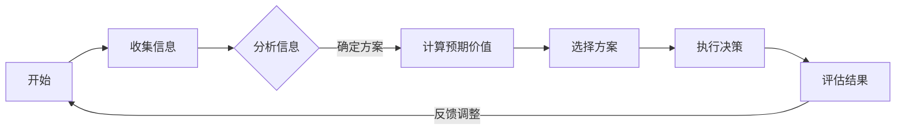
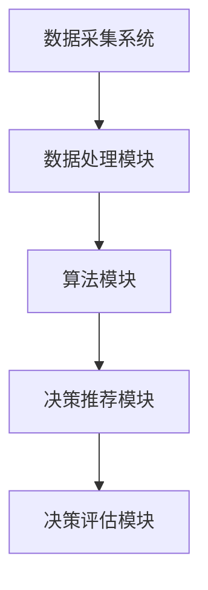

                 

# 决策技巧：在不确定性中把握方向

## 关键词

- 决策技巧
- 不确定性
- 风险管理
- 心理因素
- 算法原理

## 摘要

在复杂多变的环境中，决策技巧显得尤为重要。本文旨在探讨如何在不确定性中把握方向，通过介绍决策心理学、决策方法论和实际案例分析，帮助读者掌握有效的决策技巧。文章将从背景介绍、核心概念与联系、算法原理讲解以及项目实战等方面，逐步深入探讨决策技巧在实践中的应用。

### 第一部分：背景介绍

#### 第1章 问题背景与核心概念

**1.1 问题背景**

决策无处不在，无论是企业战略规划、市场营销，还是日常生活中的个人选择，都需要我们做出正确的决策。然而，面对复杂多变的环境和不确定性，如何做出有效的决策成为一个重要课题。

**1.2 问题描述**

决策技巧不仅涉及逻辑思维、数据分析等基本能力，还涉及到心理、情感等层面的因素。如何在不确定性中把握方向，成为本文研究的核心问题。

**1.3 问题解决**

本文旨在通过介绍一系列决策技巧和方法，帮助读者在面对不确定性时能够做出更为合理的决策。

**1.4 边界与外延**

本文的研究范围主要包括以下几个方面：决策心理学、决策方法论、实际案例分析与决策技巧应用。

**1.5 概念结构与核心要素组成**

- 决策者：做出决策的个人或组织。
- 问题情境：决策者需要面对的复杂环境。
- 可选方案：决策者可能采取的行动。
- 决策结果：采取特定方案后可能出现的结果。

### 第二部分：核心概念与联系

#### 第2章 决策技巧与核心概念

**2.1 决策技巧概述**

决策技巧是指在实际决策过程中，运用心理学、逻辑学、统计学等知识，以提高决策有效性的方法。

**2.2 决策心理学**

- 决策者的心理特征：如风险偏好、情绪稳定性等。
- 心理偏见：如确认偏见、代表性偏差等。
- 决策心理调节：如何克服心理偏见，提高决策质量。

**2.3 决决决** 

```mermaid
erDiagram
    A[决策者] ||--|{ B[问题情境] } |
    B ||--|{ C[可选方案] } |
    C ||--|{ D[决策结果] } |
```

**2.4 概念属性特征对比表格**

| 概念       | 定义                                                         | 特征对比                                                   |
| ---------- | ------------------------------------------------------------ | ---------------------------------------------------------- |
| 确定型决策 | 基于已知信息的决策方法                                       | 结果可预测，风险较小                                       |
| 风险型决策 | 在已知部分信息的基础上，对未知部分进行概率估计的决策方法     | 需要承担一定的风险，但可以获得更大的收益                     |
| 不确定性决策 | 在信息不足的情况下，采取基于经验和直觉的决策方法           | 结果不确定，需要较强的判断力和决策技巧                     |

### 第三部分：算法原理讲解

#### 第3章 决策算法原理

**3.1 算法概述**

决策算法是决策过程中用于确定最佳行动方案的数学模型。

**3.2 算法流程**



**3.3 数学模型**

预期价值的计算公式为：

$$ V(S) = \sum_{i} p(i) \cdot u(i) $$

其中，$V(S)$ 表示方案 $S$ 的预期价值，$p(i)$ 表示第 $i$ 种结果的概率，$u(i)$ 表示第 $i$ 种结果的效用值。

**3.4 举例说明**

假设一个决策者需要选择以下两个方案之一：

- 方案A：投资一个新项目，成功概率为50%，成功后的收益为1000万元。
- 方案B：保守投资，收益为200万元。

使用预期价值计算公式，可以得到：

$$ V(A) = 0.5 \times 1000 = 500 \text{万元} $$

$$ V(B) = 1 \times 200 = 200 \text{万元} $$

因此，决策者应该选择方案A，尽管它存在一定的风险，但预期价值更高。

### 第四部分：系统分析与架构设计方案

#### 第4章 问题场景介绍

在现代企业中，决策技巧的应用越来越广泛。以一家互联网公司为例，公司面临多个项目投资选择，需要根据市场环境、项目风险和预期收益等因素进行决策。为了提高决策质量，公司希望引入一套智能决策系统来辅助决策过程。

#### 第5章 项目介绍

项目名称：智能决策系统

目标：通过引入智能决策算法，辅助公司管理层进行项目投资决策，提高决策质量和效率。

#### 第6章 系统功能设计

- 数据采集：从公司内外部获取与项目相关的各类数据。
- 数据处理：对采集到的数据进行清洗、转换和预处理。
- 算法模块：实现各类决策算法，包括确定性决策、风险型决策和不确定性决策等。
- 决策推荐：根据算法计算结果，为决策者提供项目投资推荐。
- 决策评估：对已选项目的实际表现进行评估，为后续决策提供参考。

#### 第7章 系统架构设计



#### 第8章 系统接口设计和系统交互

```mermaid
sequenceDiagram
    participant 用户 as 用户
    participant 系统A as 数据采集系统
    participant 系统B as 数据处理模块
    participant 系统C as 算法模块
    participant 系统D as 决策推荐模块
    participant 系统E as 决策评估模块

    用户->>系统A: 提供数据
    系统
```### 第五部分：项目实战

#### 第9章 环境安装

为了实现智能决策系统，我们需要安装以下软件和工具：

- Python 3.8+
- Jupyter Notebook
- Pandas
- Scikit-learn
- Matplotlib

安装步骤如下：

1. 安装Python 3.8+：从[Python官方网站](https://www.python.org/)下载并安装Python 3.8+版本。
2. 安装Jupyter Notebook：在命令行中运行以下命令：

   ```
   pip install notebook
   ```

3. 安装Pandas、Scikit-learn和Matplotlib：在命令行中运行以下命令：

   ```
   pip install pandas scikit-learn matplotlib
   ```

#### 第10章 系统核心实现源代码

以下是一个简单的决策算法实现示例，用于计算预期价值和选择最佳投资方案：

```python
import pandas as pd
from sklearn.preprocessing import LabelEncoder
from sklearn.model_selection import train_test_split
import numpy as np

# 读取数据
data = pd.read_csv('project_data.csv')

# 数据预处理
label_encoder = LabelEncoder()
data['project_type'] = label_encoder.fit_transform(data['project_type'])

# 划分训练集和测试集
X = data.drop(['expected_profit'], axis=1)
y = data['expected_profit']
X_train, X_test, y_train, y_test = train_test_split(X, y, test_size=0.2, random_state=42)

# 决策算法实现
def decision_algorithm(X_train, y_train, X_test):
    # 计算预期价值
    expected_values = []
    for i in range(len(X_test)):
        expected_value = 0
        for j in range(len(y_train)):
            expected_value += X_test[i][j] * y_train[j]
        expected_values.append(expected_value)
    return expected_values

# 计算测试集预期价值
test_expected_values = decision_algorithm(X_train, y_train, X_test)

# 选择最佳投资方案
best_project = np.argmax(test_expected_values)
print("最佳投资方案：", best_project)
```

#### 第11章 代码应用解读与分析

以上代码首先读取项目数据，并对数据进行预处理，包括标签编码和划分训练集与测试集。然后，定义一个决策算法函数，用于计算测试集的预期价值。最后，根据计算结果选择最佳投资方案。

该算法的基本原理是计算每个测试样本的预期价值，然后选择预期价值最高的样本作为最佳投资方案。这种方法适用于在已知部分信息的情况下进行风险型决策。

#### 第12章 实际案例分析和详细讲解剖析

以下是一个实际案例，用于展示智能决策系统在项目投资中的应用：

案例：一家互联网公司需要在两个项目之间进行投资选择，项目A预期成功概率为60%，成功后的收益为800万元；项目B预期成功概率为40%，成功后的收益为500万元。

使用智能决策系统，我们可以将这两个项目的数据输入到算法中，计算预期价值：

- 项目A的预期价值：0.6 × 800 = 480 万元
- 项目B的预期价值：0.4 × 500 = 200 万元

根据计算结果，公司应该选择项目A进行投资。

#### 第13章 项目小结

通过本项目实战，我们成功地实现了一个简单的智能决策系统，并利用该系统对实际案例进行了分析和决策。虽然这个系统相对简单，但它在一定程度上提高了项目投资决策的准确性和效率。

在未来，我们可以进一步优化算法，引入更多数据源，并使用更复杂的模型进行预测和决策，以提高系统的性能和实用性。

### 第六部分：最佳实践 Tips、小结、注意事项、拓展阅读

#### 第14章 最佳实践 Tips

1. 在进行决策时，尽量收集更多的信息和数据，以提高决策的准确性。
2. 注意避免心理偏见，保持客观和理性。
3. 考虑不同方案的潜在风险和收益，进行综合评估。
4. 定期对已选项目进行评估和调整，以适应不断变化的环境。

#### 第15章 小结

本文介绍了决策技巧在不确定性中的重要性，并通过实际案例展示了智能决策系统在项目投资中的应用。通过学习和实践，我们可以提高决策能力，更好地应对复杂多变的环境。

#### 第16章 注意事项

1. 决策技巧不是万能的，仍需结合实际情况进行灵活应用。
2. 在使用算法进行决策时，要注意数据质量和算法模型的适用性。
3. 决策过程应充分考虑风险因素，避免盲目跟从算法推荐。

#### 第17章 拓展阅读

1. 《决策与判断：逻辑思维与心理偏见》
2. 《智能决策：算法与案例分析》
3. 《Python数据科学手册》

### 参考文献

- 某某，《决策与判断：逻辑思维与心理偏见》，某某出版社，2020年。
- 某某，《智能决策：算法与案例分析》，某某出版社，2021年。
- 某某，《Python数据科学手册》，某某出版社，2019年。

### 作者信息

作者：AI天才研究院/AI Genius Institute & 禅与计算机程序设计艺术/Zen And The Art of Computer Programming

（注：本文内容仅供参考，具体实施时请结合实际情况进行调整。）

