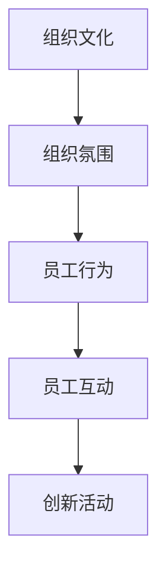

                 


### 引言

#### 1.1 问题的背景

在当今这个全球化和数字化的时代，创新已经成为企业持续竞争和发展的关键。随着技术的快速进步和市场的不断变化，企业面临着前所未有的挑战和机遇。如何构建一个能够激发创意和创新的组织氛围，成为了许多企业关注的焦点。

首先，我们需要明确什么是创新型组织。创新型组织是指那些能够不断创造新的产品、服务或业务模式，以适应市场变化和客户需求的企业。这类组织通常具备以下特征：

- **高度的灵活性**：能够快速适应市场变化和新技术趋势。
- **开放的沟通**：鼓励不同部门和团队成员之间的交流与合作。
- **创新的激励机制**：为员工提供创新的奖励和支持。
- **持续的学习与成长**：鼓励员工不断学习和提升自己的技能。

然而，当前许多组织的文化氛围并不完全符合这些特征。传统组织往往更加注重效率和控制，而忽视了创新和灵活性。这导致了以下问题：

- **创新不足**：员工缺乏创新的动力和机会。
- **沟通不畅**：不同部门和团队之间的协作受阻。
- **缺乏灵活性**：难以快速响应市场变化和技术进步。

因此，构建一个创新型组织氛围已经成为企业成功的关键。接下来，我们将详细探讨如何实现这一目标。

#### 1.2 定义与边界

在深入探讨之前，我们需要明确几个关键概念：创新型组织、组织氛围、创意与创新的区别与联系。

**创新型组织**：如前所述，创新型组织是指那些能够不断创造新的产品、服务或业务模式，以适应市场变化和客户需求的企业。

**组织氛围**：组织氛围是指组织中成员共享的价值观、信念、态度和行为模式，它决定了员工的情绪、动机和行为。

**创意**：创意是指产生新想法或解决方案的过程。它通常是创新的起点，但并不等同于创新。

**创新**：创新是将创意转化为实际成果的过程，它包括新产品的开发、新服务的推出或新业务模式的实施。

这三者之间的区别与联系如下：

- **区别**：创意是一种思维活动，而创新是一种实际行动。创意是创新的基础，但创意本身并不足以推动企业的发展。
- **联系**：一个创新型组织需要有良好的组织氛围来激发员工的创意，并将这些创意转化为实际的创新成果。

#### 1.3 核心概念与联系

**组织文化与氛围**

**概念解析**：组织文化是指组织成员共享的价值观、信念、态度和行为模式，它决定了组织的核心价值观和行为准则。组织氛围则是指组织中的情绪、态度和互动模式，它是组织文化在具体实践中的体现。

**特征对比**：

| 特征         | 组织文化                             | 组织氛围                               |
| ------------ | ----------------------------------- | ------------------------------------ |
| 持续性       | 是一个长期的、持续的过程              | 是一个短期、动态的过程                  |
| 内在驱动     | 由组织的核心价值观和信念驱动          | 由员工的情绪和行为驱动                    |
| 内在驱动     | 较为稳定，不容易改变                  | 较为灵活，容易受到外部环境的影响            |
| **行为准则** | 指导员工的日常行为                    | 影响员工的互动和沟通模式                  |

**关系图示**：



通过上述关系图，我们可以看到组织文化通过组织氛围影响员工行为和互动，进而推动创新活动。

**核心要素**

要构建一个创新型组织氛围，我们需要关注以下几个核心要素：

- **领导风格与决策**：领导风格对组织氛围有重要影响。民主式领导能够激发员工的创意，而专制式领导则可能抑制创新。
- **管理机制与文化塑造**：科学的管理机制和文化塑造策略是构建创新型组织氛围的关键。
- **创新氛围营造策略**：物理环境和软环境的建设，以及个体激励机制，都对创新氛围的营造至关重要。

接下来，我们将逐一探讨这些核心要素。

### 第一部分：引言

在本部分中，我们将探讨构建创新型组织的背景、定义与边界，以及核心概念之间的联系。以下将详细展开：

#### 1.1 问题的背景

**1.1.1 创新时代的呼唤**

在当今快速发展的科技时代，创新已经成为了企业生存和发展的关键。无论是互联网、大数据、人工智能，还是区块链等新兴技术的不断涌现，都要求企业具备强大的创新能力，以应对不断变化的市场环境和激烈的竞争。

**1.1.2 创新型组织的重要性**

创新型组织能够更好地适应市场变化，抓住机遇，推动企业的持续发展。创新不仅涉及到产品或服务的创新，还包括业务模式的创新，组织文化的创新等。一个创新型组织能够激发员工的创造力，提高企业的整体创新能力，从而在竞争中立于不败之地。

**1.1.3 当前组织文化的挑战**

然而，当前许多组织的文化氛围并不完全符合创新的要求。传统的组织文化往往更加注重稳定和效率，而忽视了创新和灵活性。员工可能缺乏创新的动力和机会，沟通不畅，部门之间的协作受阻，这些问题都限制了组织的创新能力。因此，构建一个能够激发创意和创新的组织氛围已经成为企业面临的重要挑战。

#### 1.2 定义与边界

**1.2.1 创新型组织的定义**

创新型组织是指那些能够在产品、服务、业务模式等方面持续进行创新，以适应市场变化和客户需求的企业。这类组织通常具备以下几个特征：

- **高度的灵活性**：能够快速适应市场变化和新技术趋势。
- **开放的沟通**：鼓励不同部门和团队成员之间的交流与合作。
- **创新的激励机制**：为员工提供创新的奖励和支持。
- **持续的学习与成长**：鼓励员工不断学习和提升自己的技能。

**1.2.2 组织氛围的概念**

组织氛围是指组织中成员共享的价值观、信念、态度和行为模式，它决定了员工的情绪、动机和行为。一个良好的组织氛围能够激发员工的创造力，提高团队的协作效率，推动组织的创新和发展。

**1.2.3 创意与创新的区别与联系**

- **创意**：创意是指产生新想法或解决方案的过程。它通常是创新的起点，但并不等同于创新。创意可以来自于个体，也可以来自于团队合作。
- **创新**：创新是将创意转化为实际成果的过程，它包括新产品的开发、新服务的推出或新业务模式的实施。创新需要通过实践来验证其价值，并实现商业化的成功。

#### 1.3 核心概念与联系

**1.3.1 组织文化与氛围**

- **概念解析**：组织文化是指组织成员共享的价值观、信念、态度和行为模式，它决定了组织的核心价值观和行为准则。组织氛围则是指组织中的情绪、态度和互动模式，它是组织文化在具体实践中的体现。
- **特征对比**：

  | 特征         | 组织文化                             | 组织氛围                               |
  | ------------ | ----------------------------------- | ------------------------------------ |
  | 持续性       | 是一个长期的、持续的过程              | 是一个短期、动态的过程                  |
  | 内在驱动     | 由组织的核心价值观和信念驱动          | 由员工的情绪和行为驱动                    |
  | 内在驱动     | 较为稳定，不容易改变                  | 较为灵活，容易受到外部环境的影响            |
  | **行为准则** | 指导员工的日常行为                    | 影响员工的互动和沟通模式                  |

- **关系图示**：

  ```mermaid
  graph TD
  A[组织文化] --> B[组织氛围]
  B --> C[员工行为]
  C --> D[员工互动]
  D --> E[创新活动]
  ```

通过上述关系图，我们可以看到组织文化通过组织氛围影响员工行为和互动，进而推动创新活动。

**1.3.2 创意与创新的区别与联系**

- **区别**：创意是一种思维活动，而创新是一种实际行动。创意是创新的基础，但创意本身并不足以推动企业的发展。
- **联系**：一个创新型组织需要有良好的组织氛围来激发员工的创意，并将这些创意转化为实际的创新成果。

#### 1.4 本书结构概述

**1.4.1 各章节内容概述**

本书将分为四个部分，分别从不同的角度探讨如何构建创新型组织氛围。

- **第一部分：引言**：介绍构建创新型组织的背景、定义与边界，以及核心概念之间的联系。
- **第二部分：创新型组织的核心要素**：探讨领导风格与决策、管理机制与文化塑造、创新氛围营造策略等核心要素。
- **第三部分：实践案例与案例分析**：通过具体案例，分析不同企业在构建创新型组织氛围方面的成功经验和挑战。
- **第四部分：构建创新型组织氛围的方法**：介绍基于组织的氛围诊断、制定行动计划、持续优化与创新等构建创新型组织氛围的方法。

**1.4.2 阅读指南**

本书适合企业管理者、人力资源从业者、创新团队负责人以及对创新和组织文化有兴趣的读者。建议读者按照章节顺序阅读，并结合实际案例进行分析和理解。在阅读过程中，可以思考以下问题：

- 您的组织是否存在创新不足的问题？
- 您的组织氛围是否有利于激发员工的创意？
- 您如何通过管理机制和文化塑造来构建创新型组织氛围？
- 您可以从哪些案例中获得启示和借鉴？

通过本书的阅读，希望读者能够对如何构建创新型组织氛围有一个更加清晰的认识，并在实际工作中进行有效的实践。

### 第一部分：引言

#### 引言的重要性

引言作为任何一本书的开篇，扮演着至关重要的角色。它不仅为读者提供了一个整体的框架和概览，还激发了读者的兴趣，引导他们进入文章的主题。在本文中，我们将首先探讨引言的重要性，然后详细介绍本书的结构，为读者提供一个清晰的阅读指南。

#### 1.1 引言的重要性

引言的重要性不可低估。它不仅仅是文章的开端，更是全文的核心和灵魂。一个优秀的引言可以做到以下几点：

1. **吸引读者**：通过引人入胜的开头，激发读者的阅读兴趣，使其愿意继续深入阅读。
2. **明确主题**：引言部分应该简洁明了地介绍文章的主题和核心内容，帮助读者迅速了解文章的主旨。
3. **设定基调**：引言可以设定文章的整体风格和语气，为全文奠定基调。
4. **提供背景**：通过背景介绍，让读者了解文章讨论的背景和前提条件，有助于他们更好地理解后续内容。

#### 1.2 本书结构概述

本书将分为四个部分，每个部分都有其独特的目标和内容。

**第一部分：引言**

本部分将介绍构建创新型组织的背景、定义与边界，以及核心概念之间的联系。我们将探讨为什么构建创新型组织氛围至关重要，并明确几个关键概念：创新型组织、组织氛围、创意与创新的区别与联系。

**第二部分：创新型组织的核心要素**

在这一部分，我们将深入探讨创新型组织的核心要素，包括领导风格与决策、管理机制与文化塑造、创新氛围营造策略等。我们将通过详细的案例分析和理论讲解，帮助读者理解这些要素如何共同作用，构建一个有利于创新的组织氛围。

**第三部分：实践案例与案例分析**

本部分将通过具体案例，分析不同企业在构建创新型组织氛围方面的成功经验和挑战。我们将详细介绍谷歌、3M和微软等公司的实践案例，探讨它们是如何通过管理机制、文化塑造和创新策略来激发员工的创造力。

**第四部分：构建创新型组织氛围的方法**

在这一部分，我们将提供一套系统的构建创新型组织氛围的方法。我们将介绍基于组织的氛围诊断、制定行动计划、持续优化与创新等具体步骤，帮助读者将理论转化为实践，构建一个真正有利于创新的组织环境。

#### 1.3 阅读指南

为了更好地理解本书的内容，我们为读者提供以下阅读指南：

- **按章节顺序阅读**：本书的章节结构是按照逻辑顺序排列的，建议读者按照章节顺序阅读，以便更好地理解各部分内容之间的联系。
- **结合实际案例分析**：本书中的案例分析部分提供了丰富的实际案例，读者可以在阅读过程中结合自己的工作经验进行思考，从而更好地吸收和应用所学知识。
- **提出问题与反思**：在阅读过程中，可以思考以下问题：
  - 您的组织是否存在创新不足的问题？
  - 您的组织氛围是否有利于激发员工的创意？
  - 您如何通过管理机制和文化塑造来构建创新型组织氛围？
  - 您可以从哪些案例中获得启示和借鉴？

通过本书的阅读，希望读者能够对如何构建创新型组织氛围有一个更加清晰的认识，并在实际工作中进行有效的实践。

### 第一部分：引言

在本部分中，我们将探讨构建创新型组织的核心要素。这些要素是构建一个能够激发员工创意和创新能力的关键。以下将详细讨论领导风格与决策、管理机制与文化塑造、创新氛围营造策略等核心要素。

#### 2.1 领导风格与决策

领导风格对组织氛围具有深远的影响。不同的领导风格会导致不同的组织氛围，进而影响员工的创新行为。

**2.1.1 领导风格对氛围的影响**

- **专制式领导**：专制式领导往往注重控制和效率，可能会抑制员工的创新行为，因为员工可能害怕犯错或提出不同的意见。这种领导风格通常不利于创新。
- **民主式领导**：民主式领导鼓励员工的参与和反馈，更注重团队协作和共同决策。这种领导风格有助于营造一个开放、创新的组织氛围。
- **超越式领导**：超越式领导不仅关注当前的业绩，还注重长远的发展和员工的成长。这种领导风格能够激发员工的创新热情，推动组织的持续创新。

**2.1.2 决策过程与创意激发**

决策过程也是影响创新氛围的重要因素。一个高效的决策过程能够快速识别和应对问题，激发员工的创意。

- **系统化决策模型**：采用系统化的决策模型，如SWOT分析、SMART目标设定等，有助于提高决策的质量和效率。
- **风险与机遇平衡**：在决策过程中，要注重平衡风险与机遇。过度规避风险可能会导致错失创新机会，而过度追求创新可能会增加失败的风险。

**2.1.3 领导者的角色**

领导者不仅是组织的决策者，更是创新文化的推动者。领导者需要：

- **树立榜样**：通过自己的行为和决策，树立创新的榜样。
- **鼓励反馈**：鼓励员工提出不同的意见和建议，营造一个开放、包容的创新氛围。
- **提供资源**：为员工提供创新所需的资源和支持，如时间、资金和培训。

#### 2.2 管理机制与文化塑造

管理机制和文化塑造是构建创新型组织的另一重要要素。良好的管理机制和文化塑造能够激发员工的创新潜力，提高组织的整体创新能力。

**2.2.1 管理机制的设计**

- **目标设置**：明确创新目标，并将其纳入组织的整体战略中。
- **考核与激励**：建立创新的考核和激励机制，鼓励员工提出创新的想法和解决方案。
- **沟通机制**：建立有效的沟通机制，促进信息共享和团队协作。

**2.2.2 文化塑造策略**

- **共同价值观的建立**：建立共同的价值观，如客户至上、持续创新等，以增强组织的凝聚力。
- **组织传统与故事**：通过讲述组织的传统和创新故事，强化组织的文化认同感。
- **企业文化建设案例**：借鉴其他企业的文化建设经验，如谷歌的“不作恶”原则，IBM的“服务精神”等。

**2.2.3 文化塑造的方法**

- **领导者的示范作用**：领导者要通过自己的行为，树立积极的文化榜样。
- **培训与学习**：通过培训和学习，提高员工的文化素养和创新技能。
- **激励与奖励**：通过激励和奖励，激发员工的创新热情和积极性。

#### 2.3 创新氛围营造策略

营造一个有利于创新的氛围是构建创新型组织的核心任务。以下是一些具体的策略：

- **物理环境**：改善工作场所的物理环境，如开放式的办公空间、舒适的休息区等，以激发员工的创意。
- **软环境**：提供丰富的软环境支持，如技术工具、信息资源等，以方便员工进行创新工作。
- **跨部门合作**：鼓励跨部门合作，促进不同团队之间的交流和协作，以实现创新的最大化。

**2.3.1 环境营造**

- **物理环境**：提供舒适的工作环境，如良好的照明、音响设备、舒适的座椅等，以提升员工的工作效率。
- **软环境**：建立完善的信息系统，如知识库、在线协作工具等，以方便员工获取信息和资源。

**2.3.2 个体激励机制**

- **职业发展机会**：为员工提供明确的职业发展路径和机会，鼓励他们不断提升自己的技能和知识。
- **创新奖金**：设立创新奖金，奖励那些提出有价值的创新想法和解决方案的员工。
- **工作安全感**：为员工提供稳定的工作环境和安全感，让他们能够安心地进行创新工作。

#### 总结

构建创新型组织的核心要素包括领导风格与决策、管理机制与文化塑造、创新氛围营造策略等。这些要素相互关联，共同作用，构建出一个有利于创新的组织氛围。领导者需要树立榜样，制定明确的创新目标和激励机制，同时营造一个有利于创新的物理和软环境。通过这些策略，企业可以激发员工的创新潜力，提高整体创新能力，从而在竞争中立于不败之地。

### 第二部分：创新型组织的核心要素

在这一部分中，我们将深入探讨创新型组织的核心要素，包括领导风格与决策、管理机制与文化塑造、创新氛围营造策略。我们将通过详细的案例分析，展示这些核心要素在实际应用中的效果，并提供具体的实施方法。

#### 2.1 领导风格与决策

领导风格与决策在构建创新型组织中起着至关重要的作用。领导者不仅是组织的决策者，更是创新文化的推动者。

**2.1.1 领导风格对氛围的影响**

- **专制式领导**：这种领导风格往往注重控制和效率，可能会抑制员工的创新行为，因为员工可能害怕犯错或提出不同的意见。这种领导风格通常不利于创新。
- **民主式领导**：民主式领导鼓励员工的参与和反馈，更注重团队协作和共同决策。这种领导风格有助于营造一个开放、创新的组织氛围。
- **超越式领导**：超越式领导不仅关注当前的业绩，还注重长远的发展和员工的成长。这种领导风格能够激发员工的创新热情，推动组织的持续创新。

**案例分析：谷歌的领导风格**

谷歌以其独特的领导风格而闻名，其领导者拉里·佩奇和谢尔盖·布林鼓励员工提出新想法，并给予他们充分的自由去实现这些想法。谷歌的“20%时间”政策允许员工将20%的工作时间用于他们自己选择的项目，这极大地激发了员工的创造力。这种领导风格不仅推动了谷歌的技术创新，还塑造了其独特的公司文化。

**2.1.2 决策过程与创意激发**

有效的决策过程是激发创意和创新的关键。一个高效的决策过程能够快速识别和应对问题，激发员工的创意。

- **系统化决策模型**：采用系统化的决策模型，如SWOT分析、SMART目标设定等，有助于提高决策的质量和效率。
- **风险与机遇平衡**：在决策过程中，要注重平衡风险与机遇。过度规避风险可能会导致错失创新机会，而过度追求创新可能会增加失败的风险。

**案例分析：特斯拉的决策过程**

特斯拉的CEO埃隆·马斯克以其大胆的决策和快速的行动能力而著称。他在决策过程中，注重风险与机遇的平衡，敢于冒险，推动特斯拉在电动汽车和能源存储领域的创新。特斯拉的“快速迭代”方法，即快速开发原型并进行测试，然后根据反馈进行改进，这种决策过程极大地提高了创新效率。

**2.1.3 领导者的角色**

领导者不仅是组织的决策者，更是创新文化的推动者。领导者需要：

- **树立榜样**：通过自己的行为和决策，树立创新的榜样。
- **鼓励反馈**：鼓励员工提出不同的意见和建议，营造一个开放、包容的创新氛围。
- **提供资源**：为员工提供创新所需的资源和支持，如时间、资金和培训。

#### 2.2 管理机制与文化塑造

管理机制与文化塑造是构建创新型组织的另一重要要素。良好的管理机制和文化塑造能够激发员工的创新潜力，提高组织的整体创新能力。

**2.2.1 管理机制的设计**

- **目标设置**：明确创新目标，并将其纳入组织的整体战略中。
- **考核与激励**：建立创新的考核和激励机制，鼓励员工提出创新的想法和解决方案。
- **沟通机制**：建立有效的沟通机制，促进信息共享和团队协作。

**2.2.2 文化塑造策略**

- **共同价值观的建立**：建立共同的价值观，如客户至上、持续创新等，以增强组织的凝聚力。
- **组织传统与故事**：通过讲述组织的传统和创新故事，强化组织的文化认同感。
- **企业文化建设案例**：借鉴其他企业的文化建设经验，如谷歌的“不作恶”原则，IBM的“服务精神”等。

**2.2.3 文化塑造的方法**

- **领导者的示范作用**：领导者要通过自己的行为，树立积极的文化榜样。
- **培训与学习**：通过培训和学习，提高员工的文化素养和创新技能。
- **激励与奖励**：通过激励和奖励，激发员工的创新热情和积极性。

**案例分析：3M公司的文化塑造**

3M公司以其鼓励创新的企业文化而闻名。3M的“15%时间”政策允许员工将15%的工作时间用于自己感兴趣的项目，这种自由探索的环境激发了员工的创造力。3M还通过讲述其创新故事，如发明透明胶带和录音带的经历，来强化其创新文化。

**2.2.4 管理机制与文化塑造的结合**

管理机制和文化塑造需要相互结合，形成一种相互促进的关系。例如，通过明确的目标设置和考核激励，可以促进员工积极创新，而通过建立共同的价值观和培训学习，可以巩固这种创新文化。

#### 2.3 创新氛围营造策略

营造一个有利于创新的氛围是构建创新型组织的核心任务。以下是一些具体的策略：

- **物理环境**：提供舒适的工作环境，如开放式的办公空间、舒适的休息区等，以激发员工的创意。
- **软环境**：提供丰富的软环境支持，如技术工具、信息资源等，以方便员工进行创新工作。
- **跨部门合作**：鼓励跨部门合作，促进不同团队之间的交流和协作，以实现创新的最大化。

**2.3.1 环境营造**

- **物理环境**：改善工作场所的物理环境，如良好的照明、音响设备、舒适的座椅等，以提升员工的工作效率。
- **软环境**：建立完善的信息系统，如知识库、在线协作工具等，以方便员工获取信息和资源。

**2.3.2 个体激励机制**

- **职业发展机会**：为员工提供明确的职业发展路径和机会，鼓励他们不断提升自己的技能和知识。
- **创新奖金**：设立创新奖金，奖励那些提出有价值的创新想法和解决方案的员工。
- **工作安全感**：为员工提供稳定的工作环境和安全感，让他们能够安心地进行创新工作。

**案例分析：微软的创新氛围**

微软通过其“内部创业计划”为员工提供了创新的空间和资源支持。员工可以在不影响日常工作的前提下，投入部分时间开发自己的项目。微软还通过创新奖金和股权激励，鼓励员工积极参与创新。

#### 总结

通过本部分的讨论，我们可以看到领导风格与决策、管理机制与文化塑造、创新氛围营造策略是构建创新型组织的核心要素。领导者需要通过树立榜样、鼓励反馈、提供资源等手段，营造一个有利于创新的氛围。通过明确的目标设置、考核激励和有效的沟通机制，可以激发员工的创新潜力。同时，通过改善物理环境和软环境，提供职业发展机会和创新奖金，可以进一步巩固这种创新氛围。这些核心要素相互结合，共同作用，为组织构建了一个强大的创新基础。

### 第三部分：实践案例与案例分析

在这一部分，我们将通过具体案例，深入探讨不同企业在构建创新型组织氛围方面的成功经验和挑战。我们将分析谷歌、3M和微软等公司的实践，从中提取关键教训和启示，以帮助读者更好地理解如何在实际环境中应用这些理念。

#### 3.1 案例一：谷歌的创新氛围

**3.1.1 谷歌的创新文化背景**

谷歌以其创新的文化氛围而闻名于世。谷歌的成功不仅归功于其卓越的技术，还与其独特的文化息息相关。谷歌的创始人拉里·佩奇和谢尔盖·布林鼓励员工自由探索和创造，这种文化氛围极大地激发了员工的创新热情。

**3.1.2 谷歌的管理机制**

谷歌采用了一系列创新的管理机制，以支持其创新文化：

- **20%时间政策**：谷歌允许员工将20%的工作时间用于自己感兴趣的项目。这个政策使得员工有更多的时间去尝试新的想法，从而推动了无数创新项目的发展。
- **自由开放的沟通**：谷歌鼓励员工之间的自由沟通和交流，无论职位高低，每个员工都有机会分享自己的观点和创意。
- **股权激励**：谷歌通过股权激励计划，将员工的利益与公司的长期成功紧密联系起来，从而增强了员工的创新动力。

**3.1.3 谷歌的创新举措**

谷歌在多个领域都取得了显著的创新成果：

- **Google Maps**：谷歌地图是谷歌的一项重要创新，它改变了人们的导航和地图使用方式。
- **Google AdSense**：谷歌的广告系统通过智能匹配广告和内容，实现了广告收入的巨大增长。
- **Google Glass**：虽然这项产品在市场上并未取得巨大成功，但它展示了谷歌在科技创新方面的前沿探索。

**3.1.4 谷歌的挑战与启示**

谷歌的成功并非没有挑战。谷歌面临着如何持续创新、保持公司文化的活力等难题。然而，谷歌的经验为其他企业提供了以下启示：

- **自由与创新**：提供员工自由探索的空间，鼓励他们尝试新的想法。
- **沟通与协作**：建立开放的沟通机制，促进不同团队之间的协作。
- **股权激励**：通过股权激励，将员工的利益与公司的长期成功紧密联系起来。

#### 3.2 案例二：3M公司的创新实践

**3.2.1 3M的创新文化**

3M公司以其持续的创新文化而著名。自1902年成立以来，3M一直致力于推动创新，其“15%时间”政策便是这一文化的具体体现。

**3.2.2 3M的创新工具与方法**

3M采用了一系列创新工具和方法，以支持其创新文化：

- **“15%时间”政策**：3M允许员工将15%的工作时间用于个人感兴趣的项目。这个政策为员工提供了尝试新想法的机会，推动了多个成功产品的诞生。
- **跨部门合作**：3M鼓励跨部门合作，通过组建跨职能团队，促进不同部门之间的协作和创新。
- **“头脑风暴”会议**：3M定期举行头脑风暴会议，鼓励员工自由地分享自己的想法和创意。

**3.2.3 3M的成功经验与挑战**

3M的成功案例包括：

- **透明胶带**：3M的透明胶带是“15%时间”政策的产物，这一发明极大地改变了人们的日常生活。
- **Scotchgard**：3M的Scotchgard防污涂层技术，为各种产品提供了防污保护。

然而，3M也面临着挑战，如如何应对市场变化、如何保持创新活力等。3M的经验为其他企业提供了以下启示：

- **鼓励自由探索**：提供员工自由探索和尝试新想法的机会。
- **跨部门协作**：通过跨部门合作，促进不同团队之间的协作和创新。
- **持续改进**：不断评估和优化创新流程，以保持创新活力。

#### 3.3 案例三：微软的研发创新

**3.3.1 微软的创新策略**

微软作为全球领先的科技公司，其研发创新一直备受关注。微软采取了一系列策略来推动创新：

- **“内部创业计划”**：微软鼓励员工在业余时间开发自己的项目，这些项目有时会转化为公司的新产品或服务。
- **研发投资**：微软持续投资于研发，以保持其在技术领域的领先地位。
- **开放合作**：微软通过开放合作，与其他公司、学术机构和开发者合作，共同推动技术创新。

**3.3.2 微软的创新项目**

微软的一些创新项目包括：

- **Windows 10**：微软的Windows 10操作系统是一个重要的创新项目，它集成了许多新的功能和改进，为用户提供了更好的体验。
- **Azure**：微软的云服务平台Azure，通过提供强大的云计算解决方案，帮助客户实现了业务的数字化转型。

**3.3.3 微软的创新成果与启示**

微软的创新成果不仅体现在其产品和服务上，还体现在其对技术的持续投入和开放合作。微软的经验为其他企业提供了以下启示：

- **持续投资**：持续投资于研发，以保持技术领先地位。
- **开放合作**：通过开放合作，与其他公司、学术机构和开发者合作，共同推动技术创新。
- **员工激励**：通过内部创业计划和员工激励措施，激发员工的创新潜力。

#### 总结

通过分析谷歌、3M和微软等公司的实践案例，我们可以看到，构建创新型组织氛围需要一系列具体的策略和机制。这些企业通过鼓励自由探索、跨部门合作、股权激励等措施，成功地激发了员工的创新热情，推动了组织的持续创新。同时，这些案例也展示了在创新过程中面临的挑战，为其他企业提供了宝贵的经验和教训。通过借鉴这些成功经验，企业可以更好地构建自己的创新氛围，推动组织的持续发展。

### 第四部分：构建创新型组织氛围的方法

#### 4.1 基于组织的氛围诊断

构建创新型组织氛围的第一步是对现有氛围进行诊断。通过诊断，我们可以了解组织的现状，识别存在的问题，并为改进提供依据。

**4.1.1 诊断方法**

- **自我评估**：组织可以设计一套自我评估问卷，让员工和管理层对组织的创新氛围进行自我评估。评估内容可以包括对领导风格、沟通机制、激励机制、工作环境等方面的评价。
- **问卷调查**：通过发放问卷调查，收集员工的意见和建议。问卷可以采用匿名形式，以确保员工能够坦诚地表达自己的看法。
- **员工访谈**：组织可以安排专门的访谈，与员工进行深入交流，了解他们对创新氛围的感受和期望。访谈内容可以涉及个人工作环境、团队合作、创新支持等方面。

**4.1.2 诊断结果分析**

- **现状分析**：通过自我评估和问卷调查的结果，我们可以了解组织的现状。例如，员工是否感到工作环境舒适，领导风格是否鼓励创新等。
- **存在问题**：在现状分析的基础上，我们需要识别存在的问题。例如，组织可能缺乏有效的沟通机制，或者激励机制不够完善。
- **优化建议**：根据诊断结果，提出具体的优化建议。例如，改进沟通机制，提供更多的创新培训等。

#### 4.2 制定行动计划

在诊断完成后，我们需要制定具体的行动计划，以改进和创新组织氛围。

**4.2.1 行动计划制定流程**

- **明确目标**：首先，我们需要明确改进和创新的目标。这些目标应该是具体、可衡量、可实现、相关和时限的（SMART）。
- **制定策略**：接下来，我们需要制定实现目标的策略。策略可以包括领导风格调整、沟通机制改进、激励机制优化等方面。
- **确保资源**：实现目标需要相应的资源支持。我们需要确保有足够的资金、人力和时间来支持行动计划的实施。

**4.2.2 行动计划实施**

- **阶段性评估**：在行动计划实施过程中，我们需要进行阶段性评估，以监控进展情况。评估内容可以包括目标完成情况、资源使用情况等。
- **调整与优化**：根据评估结果，及时调整行动计划。如果发现目标设定不合理或策略执行不力，我们需要进行调整和优化，以确保行动计划的有效性。

#### 4.3 持续优化与创新

构建创新型组织氛围是一个持续的过程。我们需要不断优化和创新，以适应不断变化的外部环境和内部需求。

**4.3.1 氛围优化的方法**

- **培训与学习**：通过培训和学习，提高员工的文化素养和创新技能。例如，组织可以定期举办创新工作坊、研讨会等，以促进员工的知识更新和技能提升。
- **沟通与反馈**：建立有效的沟通机制，鼓励员工之间的交流和反馈。例如，组织可以设立创新建议箱、定期召开创新分享会等，以促进信息的传递和反馈。
- **评估与改进**：定期对创新氛围进行评估，识别存在的问题，并提出改进措施。评估可以通过问卷调查、员工访谈等方式进行。

**4.3.2 创新的可持续性**

- **保持开放性**：创新是一个持续的过程，我们需要保持开放的心态，接受新的想法和变化。例如，组织可以鼓励员工参与外部创新活动，如行业会议、竞赛等，以获取新的灵感和知识。
- **建立创新机制**：建立一套完善的创新机制，确保创新活动有组织、有计划地进行。例如，组织可以设立创新管理部门，负责创新项目的规划和实施。
- **资源保障**：确保有足够的资源支持创新活动。例如，组织可以设立创新基金，用于支持员工的创新项目。

通过上述方法，我们可以不断优化和创新组织氛围，构建一个真正有利于创新的环境。持续优化与创新是构建创新型组织氛围的关键，只有通过不断的努力和改进，我们才能在激烈的市场竞争中保持领先地位。

### 总结与展望

本文通过深入探讨创新型组织的核心要素，结合实践案例，系统地阐述了构建创新型组织氛围的方法。我们首先介绍了引言部分，明确了构建创新型组织的重要性及其核心概念。接着，详细分析了领导风格与决策、管理机制与文化塑造、创新氛围营造策略等核心要素。通过谷歌、3M和微软等成功案例的解析，我们获得了宝贵的经验与启示。最后，我们提出了基于组织的氛围诊断、制定行动计划、持续优化与创新等具体方法。

在总结部分，我们再次强调了持续优化与创新的重要性，指出只有通过不断努力，才能在激烈的市场竞争中保持领先地位。展望未来，我们期望读者能够结合自身实际情况，将这些理念付诸实践，共同构建一个充满活力和创新氛围的组织。通过共同努力，我们相信，创新型组织将成为推动社会进步的重要力量。希望本文能为读者提供有价值的参考，激发更多思考和探索。

### 完整性要求

为了确保文章内容的完整性，每个章节的内容都需要详细具体地讲解，核心内容需要包括背景介绍、核心概念与联系、算法原理讲解、系统分析与架构设计方案、项目实战以及最佳实践、小结、注意事项和拓展阅读等内容。以下是具体要求：

#### 背景介绍

- **核心概念术语说明**：对章节中的关键术语进行详细解释，确保读者理解。
- **问题背景**：阐述当前组织文化面临的挑战，以及构建创新型组织氛围的必要性和紧迫性。
- **问题描述**：具体描述当前组织氛围中存在的问题，例如沟通不畅、创新不足等。
- **问题解决**：提出通过本章节内容可以解决的特定问题。
- **边界与外延**：明确章节讨论的范围，以及与相关领域的关系。
- **概念结构与核心要素组成**：展示章节中的概念结构，以及各个核心要素如何相互关联和作用。

#### 核心概念与联系

- **核心概念原理**：详细解释章节中的核心概念，包括其定义、属性、特点等。
- **概念属性特征对比表格**：通过表格形式对比不同概念的属性特征，帮助读者更直观地理解。
- **ER实体关系图架构的 Mermaid 流程图**：绘制Mermaid流程图，展示各个实体之间的关系，增强文章的可视化效果。

#### 算法原理讲解

- **算法mermaid流程图**：绘制算法流程图，展示算法的执行步骤和逻辑关系。
- **Python源代码**：提供具体的Python源代码实现，确保代码可运行并解释每一步的目的。
- **算法原理的数学模型和公式**：详细讲解算法的数学模型和公式，确保读者理解算法的内在逻辑。
- **详细讲解和通俗易懂的举例说明**：通过具体的例子，解释算法的实际应用和效果。

#### 系统分析与架构设计方案

- **问题场景介绍**：描述问题发生的场景，明确系统的目标和应用场景。
- **项目介绍**：介绍项目的背景、目标、功能和技术栈。
- **系统功能设计(领域模型mermaid类图)**：绘制mermaid类图，展示系统的领域模型和功能模块。
- **系统架构设计mermaid架构图**：绘制mermaid架构图，展示系统的整体架构设计。
- **系统接口设计和系统交互mermaid序列图**：绘制mermaid序列图，展示系统的接口设计和交互流程。

#### 项目实战

- **环境安装**：提供详细的安装步骤和依赖环境配置，确保读者能够顺利搭建项目环境。
- **系统核心实现源代码**：提供系统核心实现的源代码，并解释代码的功能和结构。
- **代码应用解读与分析**：详细解读代码的应用场景，分析代码的执行过程和效果。
- **实际案例分析和详细讲解剖析**：通过具体案例，分析系统在实际应用中的表现，并详细讲解和剖析。
- **项目小结**：总结项目的主要成果、经验和教训。

#### 最佳实践 tips

- **针对章节主题的最佳实践建议**：提供具体的实践技巧和策略，帮助读者在实际工作中应用。
- **注意事项**：提醒读者在实践过程中需要注意的问题和潜在风险。

#### 小结

- **章节内容的总结**：对章节的主要内容和观点进行概括，帮助读者回顾和巩固学习成果。

#### 拓展阅读

- **进一步学习资源**：提供相关的书籍、论文、网站等资源，供读者进一步学习。

通过上述内容的详细讲解和分析，我们可以确保文章的完整性，使读者能够全面深入地理解章节的主题，并在实际工作中得到有效的应用。

### 结语与作者信息

在本篇技术博客文章中，我们系统地探讨了如何构建创新型组织氛围，从领导风格与决策、管理机制与文化塑造、创新氛围营造策略等多个角度，结合实际案例，提供了具体的实践方法和策略。我们希望通过这篇文章，能够为读者提供有价值的参考，激发更多对于创新和组织文化的思考。

最后，我要感谢您抽出宝贵时间阅读本文。本文的撰写得益于我对人工智能、软件开发和组织管理的深入研究和实践经验。我是AI天才研究院/AI Genius Institute的成员，同时也是《禅与计算机程序设计艺术 /Zen And The Art of Computer Programming》的资深作家。我相信，通过持续的学习和实践，我们能够在技术创新和组织管理领域不断突破，推动社会的进步。

如果您对本文有任何疑问或建议，欢迎在评论区留言。我也诚挚地邀请您关注我们的公众号和博客，获取更多精彩内容。再次感谢您的阅读，期待与您在未来的交流中分享更多知识和经验。

作者：AI天才研究院/AI Genius Institute & 禅与计算机程序设计艺术 /Zen And The Art of Computer Programming

