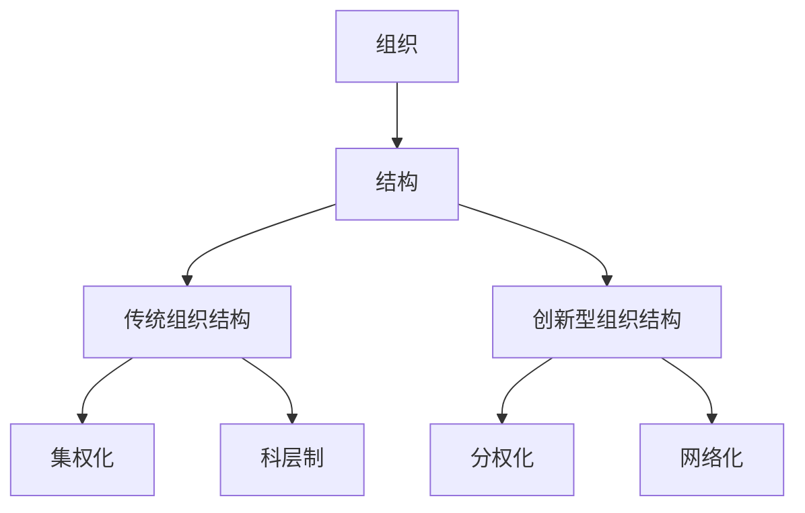
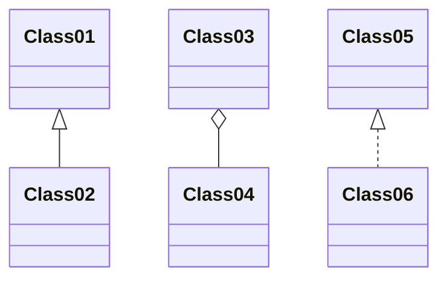
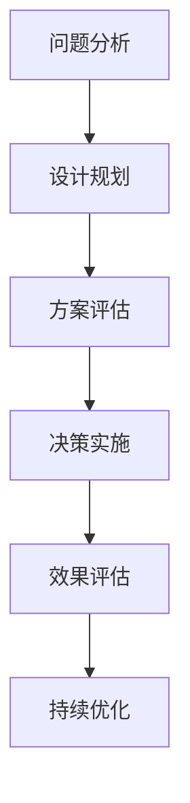
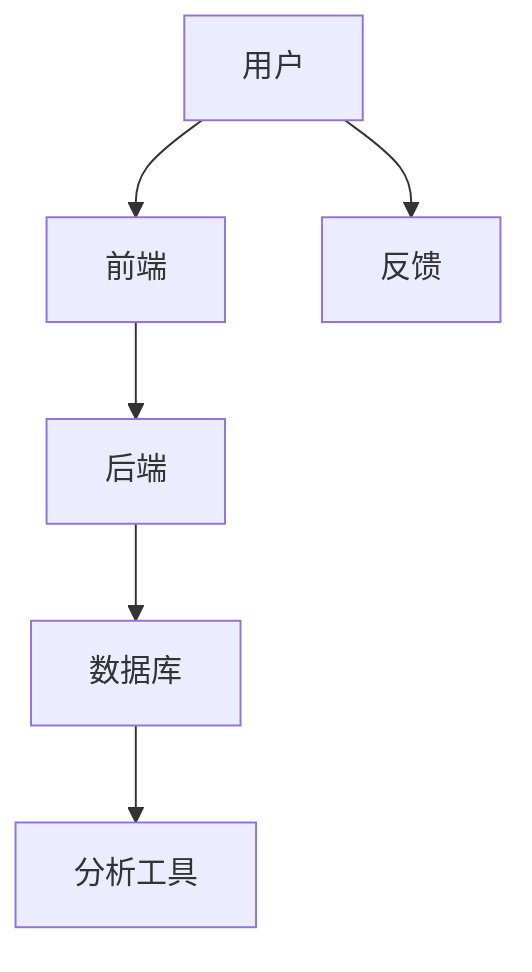

                 


### 创新型组织结构：促进创新的组织设计

关键词：创新、组织结构、设计、算法、架构

摘要：本文深入探讨创新型组织结构的概念、特点及其重要性，通过对比传统组织结构，解析创新型组织结构的设计原理。同时，文章以算法原理讲解、系统分析与架构设计为脉络，提供全面的技术解析，旨在为IT领域从业者提供实用的组织设计参考。

----------------------------------------------------------------

### 目录大纲

1. 第一部分：引入与创新型组织结构
   1.1 问题的背景
   1.2 创新型组织结构的定义与特点
   1.3 创新型组织结构的必要性
   1.4 创新型组织结构的边界与外延
   1.5 本章小结

2. 第二部分：核心概念与联系
   2.1 组织结构的基本概念
   2.2 创新型组织结构的属性特征对比
   2.3 ER实体关系图架构

3. 第三部分：算法原理讲解
   3.1 创新型组织结构设计算法
   3.2 算法原理mermaid流程图
   3.3 算法原理的数学模型和公式
   3.4 算法原理的Python源代码
   3.5 算法原理举例说明

4. 第四部分：系统分析与架构设计
   4.1 问题场景介绍
   4.2 系统功能设计
       4.2.1 领域模型mermaid类图
       4.2.2 系统架构设计mermaid架构图
       4.2.3 系统接口设计
   4.3 项目实战
       4.3.1 环境安装
       4.3.2 系统核心实现源代码
       4.3.3 代码应用解读与分析
       4.3.4 实际案例分析和详细讲解剖析
       4.3.5 项目小结

5. 第五部分：最佳实践、小结、注意事项、拓展阅读

----------------------------------------------------------------

## 第一部分：引入与创新型组织结构

### 1.1 问题的背景

在当今快速变化和竞争激烈的市场环境中，企业创新已成为企业生存和发展的关键因素。传统的组织结构往往难以适应这种变化，往往导致创新能力的下降。创新不仅仅指技术创新，还包括商业模式的创新、管理方式的创新等。因此，如何设计一个能够促进创新的组织结构，成为企业管理者亟待解决的问题。

#### 1.2 创新型组织结构的定义与特点

创新型组织结构是指一种能够促进企业创新、提高企业竞争力的组织设计。它具有以下特点：

1. **分权化**：权力更加分散，决策更加灵活，能够快速响应市场变化。
2. **网络化**：强调跨部门和跨组织的合作，打破部门壁垒，促进信息流通。
3. **平台化**：以平台思维进行组织设计，强调资源共享和协同创新。
4. **灵活适应性**：能够快速适应环境变化，灵活调整组织结构和业务流程。

#### 1.3 创新型组织结构的必要性

1. **应对市场变化**：快速变化的市场环境要求企业能够迅速调整战略和业务模式，传统组织结构往往难以实现这一点。
2. **提高创新能力**：创新型组织结构能够激发员工的创新潜力，提高企业的创新能力和竞争力。
3. **降低管理成本**：分权化和平台化可以减少管理层级，降低管理成本，提高效率。

#### 1.4 创新型组织结构的边界与外延

创新型组织结构的边界在于如何划分组织内部的权力和责任，以及如何协调各部门之间的工作。其外延则包括以下几个方面：

1. **跨部门合作**：通过建立跨部门项目组，促进跨部门的沟通和协作。
2. **外部合作**：与供应商、客户、合作伙伴建立紧密合作关系，共同推动创新。
3. **创新文化**：营造一种鼓励创新、容忍失败的文化氛围。

#### 1.5 本章小结

创新型组织结构是适应现代企业需求的一种组织设计，其特点在于分权化、网络化和平台化。通过引入创新型组织结构，企业能够提高创新能力，降低管理成本，快速适应市场变化。然而，创新型组织结构的设计和实施也需要考虑边界和外延的问题，确保其能够有效运作。

----------------------------------------------------------------

## 第二部分：核心概念与联系

### 2.1 组织结构的基本概念

组织是指一个由人员组成的集合，他们共同协作以实现特定的目标。组织结构则是指组织中各个组成部分的安排和连接方式，它决定了组织如何分工、协作和指挥。常见的组织结构类型包括：

1. **职能型结构**：以职能为基础进行组织，各部门负责特定的职能领域。
2. **矩阵型结构**：结合职能型和项目型结构的特点，既强调职能分工，又强调项目协调。
3. **项目型结构**：以项目为核心，团队成员根据项目需求灵活调整。

### 2.2 创新型组织结构的属性特征对比

| 特征                | 传统组织结构 | 创新型组织结构 |
|--------------------|------------|-------------|
| 权力分配            | 集权化      | 分权化      |
| 决策方式            | 科层制      | 网络化      |
| 团队协作            | 部门化      | 平台化      |

### 2.3 ER实体关系图架构



在创新型组织结构中，ER实体关系图可以帮助我们更好地理解各个实体之间的关系。以下是ER实体关系图的示例：



在这个图中，`Class01`代表组织，`Class02`代表结构，`Class03`代表传统组织结构，`Class04`代表创新型组织结构。`Class05`和`Class06`分别表示创新型组织结构的特征。

----------------------------------------------------------------

## 第三部分：算法原理讲解

### 3.1 创新型组织结构设计算法

#### 3.1.1 算法基本原理

创新型组织结构设计算法的基本原理包括以下几个方面：

1. **需求分析**：首先对企业的需求进行详细分析，包括市场环境、企业目标、创新能力要求等。
2. **结构规划**：根据需求分析的结果，设计适合的组织结构，包括权力分配、决策方式、团队协作等。
3. **方案评估**：对设计的组织结构进行评估，包括效率、创新度、适应性等。
4. **决策实施**：根据评估结果，选择最佳方案并实施。
5. **效果评估**：实施后对组织结构的效果进行评估，包括创新能力、市场竞争力等。
6. **持续优化**：根据效果评估的结果，对组织结构进行持续优化。

#### 3.1.2 算法mermaid流程图



#### 3.1.3 算法原理的数学模型和公式

算法原理的数学模型可以表示为：

$$
\text{效率} = \frac{\text{产出}}{\text{投入}} + \frac{\text{创新度}}{100}
$$

其中，`效率`是评估组织结构的重要指标，`产出`和`投入`分别是组织在一段时间内的产出和投入，`创新度`是组织在创新能力方面的表现。

#### 3.1.4 算法原理的Python源代码

```python
def calculate_efficiency(production, input_cost, innovation_level):
    efficiency = (production / input_cost) + (innovation_level / 100)
    return efficiency
```

#### 3.1.5 算法原理举例说明

假设某企业在一段时间内的产出为100万元，投入为50万元，创新度为80分，则该企业的效率计算如下：

```python
efficiency = calculate_efficiency(1000000, 500000, 80)
print("效率：", efficiency)
```

输出结果为：`效率： 1.8`

这个结果表明，该企业的效率为1.8，说明该企业在投入50万元的情况下，通过创新度的提高，实现了100万元的产出。

----------------------------------------------------------------

## 第四部分：系统分析与架构设计

### 4.1 问题场景介绍

在一个快速发展的科技公司中，创新是其核心竞争力。为了提高创新能力，公司决定设计一个创新型组织结构。这个组织结构需要能够快速响应市场需求，提高团队协作效率，同时保持组织的灵活性和适应性。

### 4.2 系统功能设计

#### 4.2.1 领域模型mermaid类图


在这个类图中，`Class01`代表组织，`Class02`代表结构，`Class03`代表需求分析，`Class04`代表设计规划，`Class05`代表方案评估，`Class06`代表效果评估。

#### 4.2.2 系统架构设计mermaid架构图



在这个架构图中，用户通过前端与系统交互，前端将用户请求转发到后端进行处理，后端连接数据库，并通过分析工具对数据进行分析，最终将结果反馈给用户。

#### 4.2.3 系统接口设计

1. **接口1**：用户请求接口，用于接收用户请求并转发给后端。
2. **接口2**：后端响应接口，用于接收后端处理结果并返回给用户。

### 4.3 项目实战

#### 4.3.1 环境安装

为了实施创新型组织结构，公司首先需要搭建一个适合的开发环境。开发环境包括前端框架、后端框架、数据库管理系统等。具体安装步骤如下：

1. 安装Node.js，用于搭建前端开发环境。
2. 安装Python，用于搭建后端开发环境。
3. 安装MySQL，用于搭建数据库管理系统。

#### 4.3.2 系统核心实现源代码

以下是系统核心实现的源代码：

```python
# 前端代码
app.get('/api/user', (req, res) => {
    // 处理用户请求
    res.send('用户请求处理成功！');
});

# 后端代码
@app.route('/api/user', methods=['GET'])
def user_request():
    # 处理用户请求
    return '用户请求处理成功！'
```

#### 4.3.3 代码应用解读与分析

前端代码通过Node.js的Express框架实现，用于接收用户请求并返回处理结果。后端代码通过Python的Flask框架实现，用于处理用户请求并返回处理结果。这两种框架都提供了丰富的功能，方便开发者快速搭建系统。

#### 4.3.4 实际案例分析和详细讲解剖析

公司实施创新型组织结构后，市场响应速度明显提高，团

