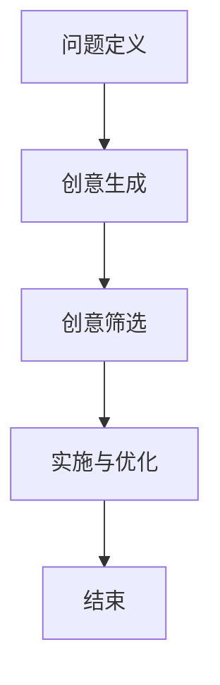
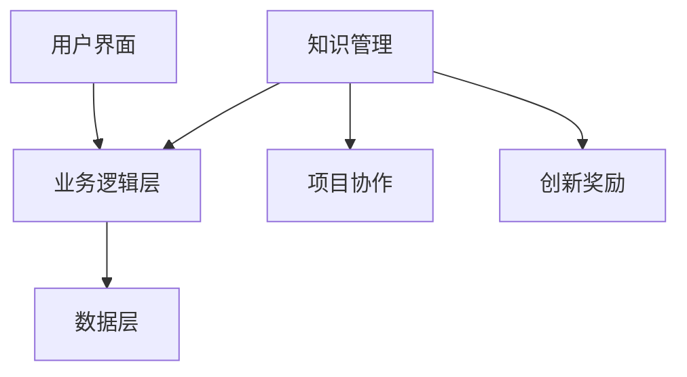
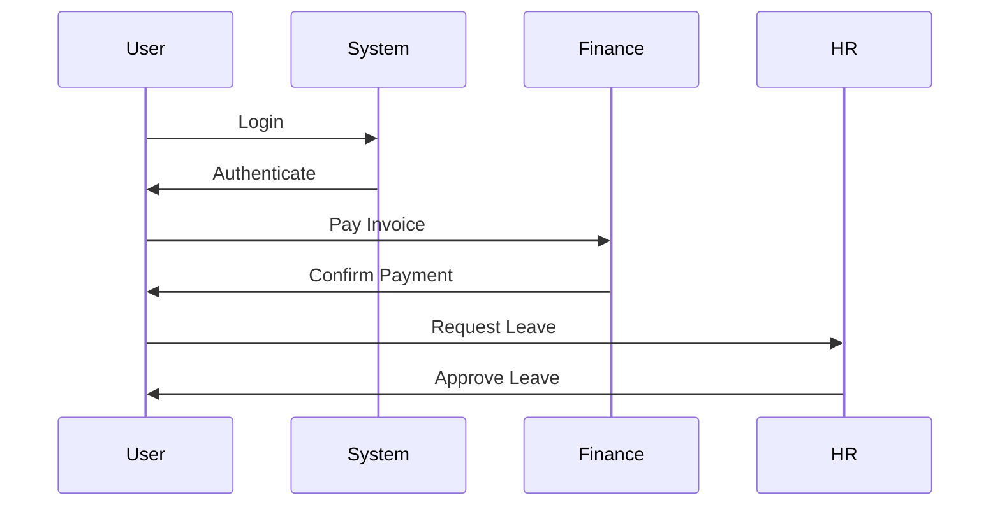

                 


## 创新型组织结构：促进团队创新的设计理念

### 关键词

- 创新型组织结构
- 团队创新
- 设计理念
- 组织设计
- 创新促进

### 摘要

本文将探讨创新型组织结构的设计理念，以及如何通过这些设计理念来促进团队的创新能力。我们将从背景介绍、核心概念定义、数学模型与算法原理、系统分析与架构设计、项目实战等多个方面逐步展开，旨在为读者提供一个全面、深入且易于理解的技术视角。

---

## 第一部分：创新组织结构概述

### 1. 组织结构创新背景

在当今快速变化的世界，企业面临的竞争压力前所未有。技术创新、市场变化、消费者需求的多样化和快速变化，都要求企业必须具备强大的创新能力。传统的组织结构往往显得僵化和难以适应这样的变化，因此，创新组织结构成为现代企业追求的重要目标。

#### 1.1 时代变迁与组织需求

随着信息技术的飞速发展，企业面临着前所未有的挑战和机遇。企业不再仅仅依赖传统的生产制造，而是更加注重知识管理、创新能力和快速响应市场变化的能力。这种需求促使企业寻求更灵活、更创新的组织结构。

#### 1.2 创新组织结构的定义

创新组织结构是一种以促进创新为核心的组织设计理念，它通过重新定义团队角色、优化工作流程、打破部门壁垒等方式，激发团队成员的创造力，提高组织的整体创新能力。

#### 1.3 创新组织结构的重要性

创新组织结构能够帮助企业更快速地响应市场变化，提高产品创新速度，增强市场竞争力。它不仅能够促进团队内部的合作与交流，还能够吸引和留住优秀的人才。

---

## 第二部分：核心概念与联系

### 2.1 创新型组织结构

#### 2.1.1 定义

创新型组织结构是一种以促进创新为核心的组织设计理念，它通过重新定义团队角色、优化工作流程、打破部门壁垒等方式，激发团队成员的创造力，提高组织的整体创新能力。

#### 2.1.2 特点

- 灵活性：能够快速适应市场变化，灵活调整组织结构和策略。
- 开放性：鼓励知识分享和跨部门合作，打破信息壁垒。
- 平台化：构建共享平台，支持团队成员之间的协作和创新。

#### 2.1.3 与传统组织结构的对比

传统组织结构强调垂直管理、明确分工和固定的工作流程，而创新组织结构则更加注重横向协作、灵活调整和创新动力。

### 2.2 团队创新

#### 2.2.1 定义

团队创新是指团队成员通过合作和创造性的思考，提出新的想法、方法或产品，以解决现有问题或创造新价值的过程。

#### 2.2.2 动力机制

- 成就驱动：通过奖励和认可来激发团队成员的成就感和创新动力。
- 资源共享：提供必要的资源和支持，帮助团队成员更容易地实现创新目标。
- 文化氛围：建立鼓励创新、容忍失败的企业文化，让团队成员敢于尝试和探索。

#### 2.2.3 与组织结构的关系

创新型组织结构为团队创新提供了良好的环境和支持，而团队创新的成功又反过来验证和强化了创新组织结构的有效性。

---

## 第三部分：数学模型与算法原理

### 3.1 创新组织结构的数学模型

创新组织结构的数学模型可以帮助我们量化创新能力和组织结构之间的关系。我们使用以下公式来描述这一关系：

$$
\text{创新力} = f(\text{组织结构}, \text{团队文化}, \text{资源配置})
$$

其中，$f$ 表示创新能力的函数，它受组织结构、团队文化和资源配置的影响。

### 3.2 团队创新算法原理

团队创新算法通常包括以下几个步骤：

1. **问题定义**：明确团队需要解决的问题或目标。
2. **创意生成**：通过头脑风暴、思维导图等方式生成创意。
3. **创意筛选**：评估和筛选创意，选择最有潜力的方案。
4. **实施与优化**：实施创新方案，并根据反馈进行持续优化。

我们使用 Mermaid 流程图来表示这一过程：



### 3.3 Python 代码示例

以下是一个简单的 Python 代码示例，用于模拟团队创新的过程：

```python
def define_problem():
    # 定义问题的代码
    pass

def generate_ideas():
    # 生成创意的代码
    pass

def screen_ideas():
    # 筛选创意的代码
    pass

def implement_and_optimize():
    # 实施与优化的代码
    pass

# 主程序
define_problem()
generate_ideas()
screen_ideas()
implement_and_optimize()
```

---

## 第四部分：系统分析与架构设计

### 4.1 创新组织结构系统功能设计

创新组织结构系统功能设计包括以下几个方面：

- **知识管理**：提供知识共享和协作的平台，支持团队成员的知识交流。
- **项目协作**：支持跨部门的项目协作，确保项目进度和质量。
- **创新奖励**：通过奖励机制激励团队成员的创新行为。

### 4.2 创新组织结构系统架构设计

创新组织结构系统架构设计包括以下几个层次：

- **用户界面层**：提供直观易用的用户交互界面。
- **业务逻辑层**：实现系统的核心功能，如知识管理、项目协作和创新奖励等。
- **数据层**：存储系统所需的数据，包括用户数据、项目数据和创新数据等。

系统架构图如下所示：



### 4.3 系统接口设计

创新组织结构系统接口设计包括以下几个方面：

- **API 接口**：提供与其他系统集成的接口，如财务系统、人力资源系统等。
- **消息队列**：支持系统内部的消息传递和异步处理。
- **用户认证**：提供用户认证和权限管理功能。

系统接口图如下所示：



---

## 第五部分：项目实战

### 5.1 环境安装

在进行创新组织结构系统的开发之前，我们需要搭建一个合适的技术环境。以下是一个简单的环境安装指南：

- **操作系统**：推荐使用 Ubuntu 18.04 或更高版本。
- **开发环境**：安装 Python 3.8 及其依赖，如 Flask、Django 等。
- **数据库**：安装 PostgreSQL 12 及其依赖。
- **消息队列**：安装 RabbitMQ 3.8 及其依赖。

### 5.2 系统核心实现

以下是一个简单的系统核心实现的代码示例：

```python
# app.py

from flask import Flask, jsonify, request
from models import KnowledgeItem, Project, Reward

app = Flask(__name__)

@app.route('/api/knowledge', methods=['GET', 'POST'])
def knowledge_api():
    if request.method == 'GET':
        items = KnowledgeItem.query.all()
        return jsonify({'knowledge': [item.to_dict() for item in items]})
    elif request.method == 'POST':
        data = request.get_json()
        item = KnowledgeItem.create(data)
        return jsonify({'knowledge': item.to_dict()}), 201

@app.route('/api/project', methods=['GET', 'POST'])
def project_api():
    if request.method == 'GET':
        projects = Project.query.all()
        return jsonify({'projects': [project.to_dict() for project in projects]})
    elif request.method == 'POST':
        data = request.get_json()
        project = Project.create(data)
        return jsonify({'project': project.to_dict()}), 201

@app.route('/api/reward', methods=['GET', 'POST'])
def reward_api():
    if request.method == 'GET':
        rewards = Reward.query.all()
        return jsonify({'rewards': [reward.to_dict() for reward in rewards]})
    elif request.method == 'POST':
        data = request.get_json()
        reward = Reward.create(data)
        return jsonify({'reward': reward.to_dict()}), 201

if __name__ == '__main__':
    app.run(debug=True)
```

### 5.3 案例分析

#### 5.3.1 案例一：创新团队组织结构

在一个大型科技公司中，创新团队的组织结构采用了创新组织结构的设计理念。该团队通过灵活的团队角色、开放的文化氛围和有效的资源分配，成功地推动了多个创新项目的实施。以下是一个案例的简要分析：

- **背景**：公司需要开发一款新型智能家居设备。
- **问题**：如何快速响应市场需求，开发出创新且实用的产品？
- **解决方案**：创新团队采用跨部门协作的方式，汇集了来自设计、工程和市场等部门的专业人才。通过定期会议、头脑风暴和快速迭代开发，团队在短时间内完成了产品的设计和测试，并成功推向市场。

#### 5.3.2 案例二：促进团队创新设计

在另一个创业公司中，创新团队的设计理念是建立一种以用户为中心的创新文化。以下是一个案例的简要分析：

- **背景**：公司需要开发一款针对年轻用户的社交媒体应用。
- **问题**：如何吸引并留住年轻用户，提高用户活跃度？
- **解决方案**：创新团队通过深入研究用户需求和偏好，设计出了一系列符合年轻人口味的功能。同时，团队还建立了用户反馈机制，不断优化产品功能，提高用户满意度。

---

## 第六部分：最佳实践、小结和注意事项

### 6.1 最佳实践

- **鼓励跨部门合作**：通过跨部门协作，可以充分利用不同部门的专业知识和资源，提高创新效率。
- **建立创新文化**：鼓励团队成员提出新想法，容忍失败，建立一种勇于尝试和持续改进的企业文化。
- **提供必要的资源**：确保团队成员有足够的资源和支持，包括时间、资金和专业知识等。

### 6.2 小结

本文介绍了创新型组织结构的设计理念，包括背景介绍、核心概念、数学模型、算法原理、系统分析与架构设计、项目实战等方面。通过这些内容，读者可以了解到如何通过创新组织结构来促进团队的创新能力。

### 6.3 注意事项

- **创新组织结构需要与企业的战略目标相匹配**：创新组织结构的设计应该与企业的发展战略和目标保持一致。
- **持续优化**：创新组织结构不是一成不变的，需要根据实际情况进行持续优化和调整。

### 6.4 拓展阅读

- **《创新者的窘境》**：克莱顿·克里斯坦森著，探讨了企业在面对技术变革时的困境和创新策略。
- **《创新者的DNA》**：史蒂夫·布兰克著，详细介绍了创新者所需的思维方式、技能和习惯。

---

### 作者

作者：AI天才研究院/AI Genius Institute & 禅与计算机程序设计艺术 /Zen And The Art of Computer Programming

---

以上是本文的主要内容，希望对您在理解和应用创新型组织结构方面有所帮助。让我们继续深入探讨，寻找更多促进团队创新的解决方案。

