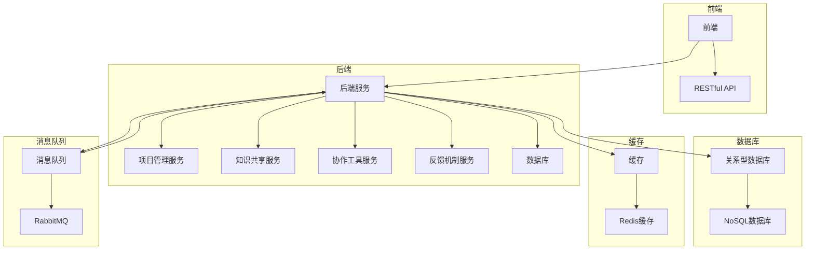
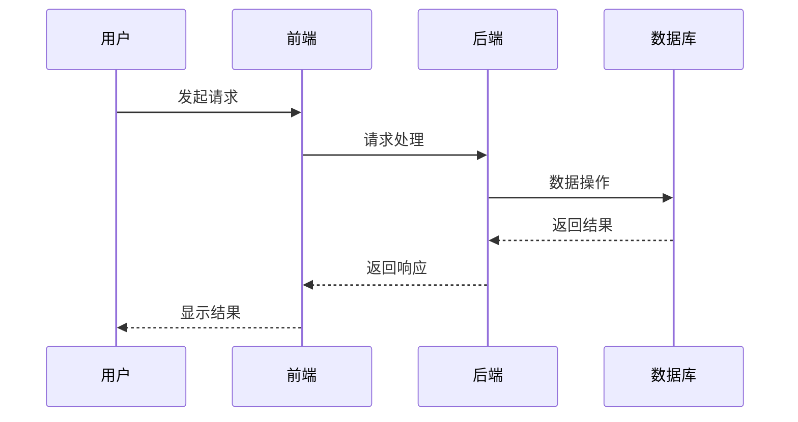

                 

### 创新型领导力的背景与定义

在当今这个快速变化和竞争激烈的社会环境中，企业的成功不再仅仅依赖于传统的管理方法，而是更多地依赖于创新和创造力。创新型领导力，作为一种新兴的领导理念，逐渐成为企业领导者必须掌握的重要技能。创新不再局限于研发部门或特定领域，而是渗透到企业的方方面面，成为企业持续发展的动力源泉。

**定义创新型领导力**

创新型领导力可以被定义为领导者通过激发、引导和整合团队成员的创新潜力，推动组织实现创新目标的能力。这种能力不仅包括领导者对创新过程的监控和评估，还涉及到对团队成员创造力、沟通能力和协作精神的培养。创新型领导力强调领导者不仅是决策者和指挥者，更是创新过程的支持者和推动者。

**创新型领导力的重要性**

1. **适应快速变化的环境**：在当今全球化和数字化的背景下，企业面临的市场环境变化速度越来越快，消费者需求也变得越来越多样化。只有具备创新能力的领导者，才能带领团队迅速适应变化，抓住市场机遇。

2. **提高企业竞争力**：创新是企业持续发展的关键，通过创新，企业可以不断推出新产品、新服务，满足市场需求，从而在激烈的市场竞争中脱颖而出。

3. **提升员工满意度**：创新型领导力鼓励员工参与创新过程，提高员工的自主性和创造力，从而提高员工的工作满意度和忠诚度。

4. **促进企业文化建设**：创新型领导力倡导开放、包容和合作的企业文化，鼓励员工敢于挑战传统思维，勇于尝试新方法，从而形成一种积极向上的企业氛围。

**为什么需要创新型领导力？**

随着科技的快速发展，越来越多的企业意识到，只有不断创新，才能在激烈的市场竞争中立于不败之地。然而，创新并不是一个简单的线性过程，它需要领导者具备敏锐的洞察力、强大的执行力以及对团队创造力的激发和引导能力。以下是一些具体原因：

1. **技术变革的加速**：随着人工智能、大数据、云计算等新技术的快速发展，企业面临的技术变革速度前所未有。领导者需要具备快速学习和适应新技术的能力，才能带领团队在技术变革中保持领先地位。

2. **市场竞争的加剧**：在全球化背景下，市场竞争愈发激烈，企业不仅要面对国内竞争对手，还要面对来自全球的挑战。创新型领导力可以帮助企业迅速适应市场变化，开发出具有竞争力的产品和服务。

3. **员工期待的变化**：现代员工，尤其是年轻一代，更加注重工作意义和个人成长。他们期待在工作中能够发挥自己的创造力，实现个人价值。领导者需要通过创新，提供更多机会和平台，满足员工的期待。

4. **社会环境的变化**：现代社会越来越注重可持续发展和社会责任，企业需要通过创新来应对这些挑战。例如，开发绿色技术、推广可持续发展理念等，都需要领导者的创新思维和领导力。

综上所述，创新型领导力已经成为企业领导者必备的核心能力。通过培养创新型领导力，领导者可以激发团队的创造力，推动企业实现持续创新和成功。在下一部分，我们将深入探讨创新思维的理论基础，分析心理学和社会学方面的研究成果，为读者提供更有价值的见解。

### 核心概念与联系

在探讨创新型领导力之前，我们需要明确几个关键概念，并分析它们之间的联系。以下是对“创新思维”、“团队协作”和“领导力模型”的定义及其相互关系的详细解释。

**创新思维**

创新思维是一种独特的思维方式，它涉及对现有知识和经验的重新组合和再创造，以产生新的想法、解决方案或产品。创新思维不仅仅是寻找独特的方法，更是一种系统化的方法，包括灵感触发、问题解决、原型设计等步骤。它强调从不同的角度思考问题，打破常规思维，勇于尝试新方法。

**团队协作**

团队协作是指团队成员在共同的目标下，通过有效的沟通、协作和合作，共同完成任务的过程。有效的团队协作需要成员之间的信任、沟通、共同目标和相互支持。团队协作不仅能够提高工作效率，还能激发团队的创造力和创新能力。

**领导力模型**

领导力模型是描述领导者如何影响和指导团队成员的理论框架。不同的领导力模型反映了领导者在不同情境下的行为方式。常见的领导力模型包括变革型领导、服务型领导和情境领导等。

**核心概念之间的联系**

创新思维、团队协作和领导力模型之间有着密切的联系。创新思维为团队提供了新的想法和解决方案，而团队协作则是实现这些想法和解决方案的关键。领导力模型则帮助领导者有效地激发和引导团队成员的创造力，促进创新思维和团队协作的实现。

**ER实体关系图**

为了更清晰地展示这些概念之间的联系，我们可以使用ER（实体-关系）图来表示。ER图可以用来描述系统中各个实体及其之间的关系。

```mermaid
ERDiagram

创新思维 ||--|{ 团队协作 }
创新思维 ||--|{ 领导力模型 }
团队协作 ||--|{ 创新思维 }
团队协作 ||--|{ 领导力模型 }
领导力模型 ||--|{ 创新思维 }
领导力模型 ||--|{ 团队协作 }
```

在这个ER图中，“创新思维”、“团队协作”和“领导力模型”是三个核心实体，它们之间通过双向箭头（||--|{ }）表示相互关联。创新思维既是团队协作的基础，也是领导力模型的实施对象；团队协作需要创新思维的支持，同时也受到领导力模型的指导；领导力模型则通过激励创新思维和促进团队协作来实现组织的创新目标。

**对比表格**

为了进一步明确这些概念之间的关系，我们可以通过对比表格来展示它们的不同属性和特征。

| 概念           | 定义                                                         | 属性特征                                                     | 关联关系                       |
|----------------|--------------------------------------------------------------|--------------------------------------------------------------|------------------------------|
| 创新思维       | 一种独特的思维方式，用于产生新的想法和解决方案                 | 灵感触发、问题解决、原型设计                                 | 支撑团队协作，指导领导力模型  |
| 团队协作       | 成员在共同目标下通过沟通、协作和合作共同完成任务的过程       | 信任、沟通、共同目标、相互支持                               | 实现创新思维，支持领导力模型 |
| 领导力模型     | 描述领导者如何影响和指导团队成员的理论框架                     | 变革型、服务型、情境领导等                                   | 激励创新思维，促进团队协作   |

通过对比表格，我们可以看到，创新思维、团队协作和领导力模型在实现组织创新目标中各自扮演着重要的角色，并且它们之间相互依赖，共同推动组织向前发展。

综上所述，创新思维、团队协作和领导力模型是创新型领导力的核心概念，它们相互联系，共同作用于组织的创新过程中。在接下来的部分，我们将深入探讨这些概念的理论基础和应用策略，帮助领导者更好地激发团队的创造力。

### 创新思维的理论基础

要深入了解创新型领导力，我们首先需要探讨创新思维的理论基础。创新思维不仅是一种能力，也是一种系统化的方法，它涉及到心理学和社会学的多个研究领域。在心理学方面，创新思维的研究主要集中在个体思维过程、创造力培养以及相关心理机制。而在社会学方面，创新思维的研究则侧重于团队协作、文化环境和社会结构对创新的影响。

**心理学视角**

1. **思维过程**：创新思维是一种复杂的思维过程，通常包括灵感触发、概念生成、问题解决和原型设计等阶段。心理学研究表明，灵感触发是创新思维的关键环节，它可以通过多样化的思维活动和跨学科的知识交叉来实现。例如，瑞士心理学家让·皮亚杰（Jean Piaget）提出的认知发展理论指出，通过游戏和探索活动，个体可以培养出创造性思维。

2. **创造力培养**：心理学研究表明，创造力的培养不仅依赖于先天智力因素，还需要后天环境的支持和训练。心理学家泰勒（E. Paul Torrance）提出的创造力培养模型强调，通过思维训练、思维模式重构和问题解决策略的学习，可以提高个体的创造力。此外，心理学中的“流畅性”（fluency）、“灵活性”（flexibility）、“独创性”（originality）等指标也被广泛用于评估个体的创造力水平。

3. **相关心理机制**：创新思维涉及到多个心理机制，包括联想思维、思维发散、认知重构和风险容忍等。联想思维是指通过将不同领域的知识进行关联，激发新的想法。发散思维则是指从一个中心点出发，产生多个方向的想法。认知重构是指改变问题认知的方式，以找到新的解决方案。风险容忍是指个体对不确定性和失败的接受程度，这对于创新过程至关重要。

**社会学研究**

1. **团队协作**：社会学研究指出，团队协作是实现创新的关键因素之一。通过团队合作，个体可以共享知识和资源，互补个人能力，提高创新效率。社会学家罗杰·马丁（Roger L. Martin）提出的“设计思维”（design thinking）理论强调，团队协作中的多元化视角和跨学科合作是创新的重要驱动力。

2. **文化环境**：社会文化环境对创新思维有着深远的影响。不同的文化背景会影响个体的思维方式、价值观和行为模式。例如，一些文化鼓励独立思考和挑战传统，而另一些文化则更加注重集体合作和稳定。社会学家迪尔德丽·麦克洛伊（Dervla McDevitt）的研究表明，开放的文化环境有利于创新思维的激发和实现。

3. **社会结构**：社会结构也对创新思维产生重要影响。社会结构中的权力分配、资源分配和沟通渠道等都会影响创新思维的流动和实现。社会学家埃莉诺·奥斯特罗姆（Elinor Ostrom）提出的“共享治理”（common-pool resource governance）理论指出，通过合理的制度设计和合作机制，可以促进创新资源的共享和利用。

**创新思维的培养方法**

1. **跨学科学习**：通过跨学科的学习，个体可以获取多样化的知识和视角，提高创新思维的能力。例如，工程师可以通过学习心理学和经济学，找到新的解决方案。

2. **思维训练**：通过特定的思维训练，如思维导图、头脑风暴、模拟演练等，个体可以锻炼思维灵活性和问题解决能力。

3. **多元化团队**：建立多元化的团队，通过成员之间的协作和交流，可以激发更多的创新思维。

4. **鼓励失败**：在创新过程中，失败是不可避免的。领导者需要鼓励团队成员接受失败，从失败中学习，不断尝试新的方法。

综上所述，创新思维的理论基础涵盖了心理学和社会学的多个方面。通过理解这些理论，领导者可以更好地培养和激发团队的创造力，推动组织的创新和发展。

### 领导力模型的详细分析

在探讨如何激发团队创造力时，领导力模型扮演了至关重要的角色。不同的领导力模型反映了领导者在不同情境下的行为方式，对团队的创造力有着深远的影响。本文将详细分析三种常见的领导力模型：变革型领导、服务型领导和情境领导，并对比它们的特点和适用场景。

**变革型领导**

变革型领导（Transformational Leadership）强调领导者通过激发团队成员的内在动机，推动他们超越自身利益，为实现共同目标而努力。变革型领导者通常具备以下特点：

1. **愿景激励**：变革型领导者能够清晰地描绘未来的愿景，并激励团队成员为之努力。这种愿景不仅仅是一个目标，更是一种信仰和动力。

2. **激励和鼓励**：变革型领导者通过鼓励和认可团队成员的努力和成就，激发他们的自信心和积极性。

3. **个性化关怀**：变革型领导者关注每个团队成员的独特需求和潜力，提供个性化的支持和指导。

变革型领导在需要组织变革和创新时尤为有效。例如，当一个企业面临市场挑战或技术变革时，变革型领导者可以带领团队突破传统思维，迎接新的机遇。以下是变革型领导的一个典型应用场景：

**案例：** 某科技公司通过变革型领导实现了产品创新。领导者通过愿景激励，鼓励团队成员大胆尝试新的技术方案，并在过程中提供持续的支持和反馈。最终，团队成功开发出具有市场竞争力的新产品。

**服务型领导**

服务型领导（Servant Leadership）强调领导者以服务团队成员为中心，通过帮助团队成员实现个人目标和职业发展，从而推动组织目标的实现。服务型领导者通常具备以下特点：

1. **倾听和沟通**：服务型领导者注重与团队成员的沟通，倾听他们的意见和建议，确保团队成员感到被尊重和重视。

2. **培养和发展**：服务型领导者致力于团队成员的个人成长，提供培训和发展机会，帮助他们实现职业目标。

3. **团队协作**：服务型领导者鼓励团队成员之间的合作和互助，建立紧密的团队关系。

服务型领导在需要团队协作和创新时非常适用。例如，在开发新产品或进行项目开发时，服务型领导者可以促进团队成员之间的合作，共同解决问题，提高创新效率。以下是服务型领导的一个典型应用场景：

**案例：** 某软件开发团队在面临复杂项目挑战时，服务型领导者通过倾听团队成员的需求，提供必要的资源和支持，帮助团队克服困难，最终成功交付项目。

**情境领导**

情境领导（Situation Leadership）是一种基于情境的领导模式，领导者根据团队成员的不同成熟度水平，选择合适的领导风格。情境领导模型包括四种领导风格：

1. **指导型领导**：在团队成员成熟度较低时，领导者提供明确的指导和监督，确保团队成员了解任务和要求。

2. **推销型领导**：在团队成员成熟度中等时，领导者通过沟通和说服，激励团队成员为实现目标而努力。

3. **参与型领导**：在团队成员成熟度较高时，领导者与团队成员共同参与决策，鼓励自主性和创新。

4. **授权型领导**：在团队成员成熟度最高时，领导者赋予团队成员充分的自主权，让他们独立完成任务。

情境领导模型强调领导者根据具体情境选择最合适的领导风格，以激发团队成员的创造力。以下是情境领导的一个典型应用场景：

**案例：** 在一个高科技创业公司中，领导者根据团队成员的专业技能和工作经验，灵活运用不同的领导风格。对于新入职的员工，采用指导型领导，提供详细的指导和监督；对于经验丰富的员工，采用参与型领导，鼓励他们发挥自主性，提出创新方案。

**对比分析**

变革型领导、服务型领导和情境领导各有其独特的特点和应用场景。变革型领导强调愿景激励和个性化关怀，适用于组织变革和创新；服务型领导强调团队协作和个人发展，适用于项目开发和团队协作；情境领导则根据团队成员的成熟度选择合适的领导风格，适用于各种不同情境。

在实际应用中，领导者可以结合不同的领导力模型，根据具体情境和团队需求，灵活运用各种领导风格，以最大限度地激发团队的创造力。

### 创造力激发的具体方法

要激发团队的创造力，领导者需要采取一系列具体的方法和策略。以下是一些行之有效的策略，包括创建创新文化、设定明确的目标、提供资源和支持以及鼓励员工参与和表达。

**创建创新文化**

创新文化是企业成功的关键因素之一。领导者可以通过以下措施来创建和维持创新文化：

1. **鼓励风险承担**：在创新过程中，失败是不可避免的。领导者应鼓励员工勇于尝试新方法，不怕失败。这可以通过设立“创新基金”或提供“安全网”来确保员工在尝试新想法时不会因失败而受到惩罚。

2. **鼓励开放沟通**：建立一个开放、透明和包容的沟通环境，使员工能够自由地分享想法和意见。这可以通过定期的团队会议、开放式讨论或在线平台来实现。

3. **奖励创新**：为鼓励员工创新，领导者可以设立创新奖励制度，对提出有价值的创新想法或成功实施的创新项目给予奖励和认可。

4. **提供培训和学习机会**：定期为员工提供创新思维和团队协作的培训，帮助他们掌握新的工具和方法，提高创造力。

**设定明确的目标**

明确的目标是团队努力的方向，也是评估创新成果的重要依据。领导者可以通过以下方式设定明确的目标：

1. **SMART原则**：目标应具备具体（Specific）、可衡量（Measurable）、可达成（Achievable）、相关（Relevant）和时限性（Time-bound）的特征。这有助于确保目标清晰、具体和可实现。

2. **分解目标**：将大目标分解为小目标，并设定具体的里程碑，以便团队成员可以逐步实现。这有助于激励团队成员持续努力，保持动力。

3. **参与制定目标**：鼓励团队成员参与目标制定过程，使他们感到自己的意见被重视，从而增强他们的责任感和投入度。

**提供资源和支持**

创造力的实现需要充足的资源和支持。领导者可以通过以下措施提供必要的资源和支持：

1. **资金投入**：为创新项目提供足够的资金支持，确保项目可以顺利进行。

2. **时间保障**：为员工提供足够的时间和空间，使他们能够专注于创新工作，不受日常任务和压力的干扰。

3. **技术支持**：为员工提供最新的技术和工具，帮助他们更高效地开展创新工作。

4. **培训和学习**：提供定期的培训和研讨会，帮助员工学习新的技能和知识，提高创造力。

**鼓励员工参与和表达**

员工参与和表达是激发创造力的关键因素。领导者可以通过以下措施鼓励员工参与和表达：

1. **设立反馈渠道**：建立反馈机制，让员工可以自由地表达意见和建议，领导者应及时回应和反馈。

2. **提供反馈机会**：定期组织团队讨论和评估会议，让员工分享他们的想法和成果，并进行深入的讨论和反馈。

3. **鼓励团队协作**：通过跨部门项目和团队合作，鼓励员工互相学习、互相支持，共同解决问题。

4. **建立导师制度**：为新人提供经验丰富的导师，帮助他们快速融入团队，并从导师的经验中学习和成长。

通过以上具体方法和策略，领导者可以有效地激发团队的创造力，推动企业的创新和发展。

### 案例分析：科技公司的创新之路

为了更好地理解如何激发团队的创造力，我们可以通过一个实际案例来剖析一家科技公司的创新之路。这个案例不仅展示了公司的背景和目标，还详细描述了实施过程和取得的成果。

**背景介绍**

该公司是一家专注于人工智能和大数据技术的科技公司，成立于2010年。随着市场环境的不断变化和技术的快速发展，公司意识到，要保持竞争力，必须不断提升创新能力。因此，公司决定在2020年启动一个全面的创新项目，旨在激发员工的创造力，推动公司的技术进步和业务发展。

**项目目标**

项目的主要目标是：

1. **提高员工的创新意识和能力**：通过培训和激励措施，提高员工对创新的重视程度，培养他们的创新思维和解决问题的能力。
2. **推动技术突破**：通过创新项目，推动公司在人工智能和大数据领域的关键技术突破，开发出具有市场竞争力的新产品。
3. **增强团队协作**：建立跨部门的创新团队，促进员工之间的合作和知识共享，提高团队的整体效率。

**实施过程**

1. **制定创新战略**：公司领导层首先制定了详细的创新战略，明确了创新的方向和重点，并制定了相应的政策和流程。
2. **建立创新实验室**：公司投资建设了一座创新实验室，配备了先进的设备和工具，为员工提供了良好的创新环境。
3. **培训和创新思维课程**：公司为员工提供了多种创新思维和技能培训，包括头脑风暴、设计思维和快速原型设计等课程，帮助他们掌握创新工具和方法。
4. **设立创新奖金**：公司设立了一项创新奖金，对在创新项目中表现出色的员工和团队进行奖励，以激励他们的创新热情。
5. **跨部门协作**：公司鼓励员工跨部门合作，组建了多个创新团队，由不同领域的专家共同攻关，推动技术突破。
6. **定期评估和反馈**：公司定期对创新项目进行评估，收集员工和客户的反馈，及时调整创新方向和策略。

**项目成果**

通过这一系列措施，公司取得了显著的成果：

1. **技术创新**：在创新项目的推动下，公司成功开发了多项关键技术，如深度学习算法、自动化数据分析工具等，这些技术为公司带来了竞争优势。
2. **新产品上市**：基于这些技术创新，公司成功推出了多款新产品，如智能客服系统、大数据分析平台等，受到了市场的欢迎。
3. **员工满意度提升**：员工在创新过程中得到了更多的机会和资源，他们的创新意识和能力得到了提升，员工满意度也随之提高。
4. **业务增长**：创新项目的成功实施为公司带来了新的业务增长点，公司的收入和市场份额都有显著提升。

**实战经验分享**

通过这个案例，我们可以总结出以下实战经验：

1. **领导层的重视**：领导层对创新的重视和支持是项目成功的关键。公司领导层的积极参与和推动，为创新项目提供了强大的动力。
2. **良好的创新环境**：提供良好的创新环境，如设备、工具和资金支持，是激发员工创造力的基础。
3. **培训和教育**：定期培训和教育，帮助员工掌握创新工具和方法，提高他们的创新能力。
4. **激励机制**：设立创新奖金和其他激励机制，鼓励员工积极参与创新项目。
5. **跨部门协作**：跨部门协作可以整合不同领域的知识和资源，提高创新效率。

通过这个实际案例，我们可以看到，激发团队的创造力不仅需要具体的策略和措施，还需要整个组织的支持和共同努力。只有通过持续的实践和优化，才能实现创新目标，推动企业的发展。

### 系统架构设计与实现

在探讨如何通过系统架构设计来激发团队创造力时，我们需要详细描述问题场景、项目介绍、系统功能设计、系统架构设计、系统接口设计以及系统交互流程。以下是对每个部分的详细讲解。

**问题场景**

在现代企业中，领导者面临的挑战是如何在竞争激烈的市场环境中保持创新和灵活性。为了实现这一目标，公司需要构建一个支持创新和协作的系统架构，使团队能够高效地开展创新项目。

**项目介绍**

本项目的目标是构建一个集成式创新平台，该平台能够支持跨部门的协作，提供从创意生成到产品开发的全面功能。该平台将集成项目管理、知识共享、协作工具和反馈机制，为团队成员提供一个良好的创新环境。

**系统功能设计**

系统的主要功能包括：

1. **项目管理**：提供项目规划、任务分配、进度跟踪和风险评估等功能，确保项目按时完成。
2. **知识共享**：建立一个集中式的知识库，供团队成员访问和贡献，促进知识的积累和共享。
3. **协作工具**：集成多种协作工具，如即时通讯、视频会议和文档共享，以支持实时沟通和协作。
4. **反馈机制**：提供一个反馈平台，让团队成员可以提交建议和反馈，促进持续改进。

**系统架构设计**

系统的整体架构采用微服务架构，以实现高可扩展性和灵活性。以下是对系统架构的详细描述：

1. **前端**：前端采用单页面应用（SPA）技术，提供用户友好的界面和快速响应。前端通过RESTful API与后端服务进行交互。
2. **后端**：后端服务包括项目管理、知识共享、协作工具和反馈机制等，采用微服务架构部署。每个微服务负责特定的功能模块，并通过消息队列进行通信。
3. **数据库**：采用关系型数据库和NoSQL数据库的组合，分别存储结构化和非结构化数据，如用户数据、项目数据和创新反馈等。
4. **缓存**：使用Redis等缓存技术，提高系统响应速度，减轻数据库负担。
5. **消息队列**：采用RabbitMQ等消息队列中间件，实现前后端服务之间的异步通信，提高系统的可靠性和可扩展性。

**系统架构设计mermaid架构图**

以下是系统架构的mermaid架构图：



**系统接口设计**

系统的接口设计包括API接口和数据库接口：

1. **API接口**：前端通过RESTful API与后端服务进行通信。API接口包括项目管理接口、知识共享接口、协作工具接口和反馈机制接口。
2. **数据库接口**：后端服务通过ORM（对象关系映射）框架与数据库进行交互，实现数据的增删改查操作。

**系统交互mermaid序列图**

以下是系统交互的mermaid序列图：



通过以上详细的系统架构设计与实现，我们可以构建一个支持创新和协作的系统，为团队提供良好的创新环境，激发团队成员的创造力。

### 项目实战：环境安装与系统核心实现

为了更好地理解创新型领导力在实际项目中的应用，我们将通过一个具体的项目案例，详细描述环境安装、系统核心实现以及代码应用解读与分析。

**项目背景**

某大型互联网公司希望开发一个面向用户的个性化推荐系统，以提高用户满意度和增加广告收入。该项目涉及多个模块，包括数据采集、数据处理、推荐算法和用户界面。为了激发团队创造力，公司采用创新型领导力模式，从项目初期就强调团队合作、创新思维和快速迭代。

**环境安装**

为了确保项目顺利进行，首先需要安装和配置相关环境。以下是环境安装的步骤：

1. **开发工具**：安装Python 3.8及以上版本，以及Anaconda发行版，用于数据分析和建模。
2. **数据库**：安装MySQL 8.0数据库，用于存储用户数据和历史行为数据。
3. **消息队列**：安装RabbitMQ 3.8及以上版本，用于异步消息传递。
4. **前后端框架**：前端使用React框架，后端使用Flask框架，同时集成Redis作为缓存中间件。
5. **依赖管理**：使用pip和conda管理项目依赖，确保各组件版本兼容。

**系统核心实现**

项目核心实现包括数据采集、数据处理、推荐算法和用户界面四个部分。以下是各个模块的详细描述：

**1. 数据采集模块**

数据采集模块负责从各个数据源收集用户行为数据，如点击、浏览、购买等。该模块使用Python的requests库和pandas库进行数据抓取和预处理。

```python
import requests
import pandas as pd

def fetch_data(source_url):
    response = requests.get(source_url)
    if response.status_code == 200:
        data = response.json()
        return pd.DataFrame(data)
    else:
        return pd.DataFrame()

user_data = fetch_data('https://api.example.com/user_data')
```

**2. 数据处理模块**

数据处理模块对采集到的用户行为数据进行清洗、转换和归一化，以供推荐算法使用。该模块使用pandas库进行数据操作。

```python
def preprocess_data(data):
    # 数据清洗和转换
    data.drop_duplicates(inplace=True)
    data.fillna(0, inplace=True)
    return data

processed_data = preprocess_data(user_data)
```

**3. 推荐算法模块**

推荐算法模块采用基于协同过滤的推荐算法，计算用户之间的相似度，并生成个性化推荐列表。该模块使用scikit-learn库实现。

```python
from sklearn.metrics.pairwise import cosine_similarity

def collaborative_filter(data, user_id):
    user_ratings = data[data['user_id'] == user_id]
    similar_users = cosine_similarity([user_ratings], data[['user_id', 'item_id', 'rating']])
    top_similar_users = similar_users[0].argsort()[:-6:-1]
    recommended_items = data.iloc[top_similar_users][['item_id', 'rating']]
    return recommended_items

user_id = 1
recommendations = collaborative_filter(processed_data, user_id)
```

**4. 用户界面模块**

用户界面模块使用React框架构建，提供用户友好的交互界面，展示推荐结果。该模块包括用户登录、注册、浏览推荐和反馈等功能。

```jsx
import React, { useState, useEffect } from 'react';

function RecommendationPage() {
    const [recommendations, setRecommendations] = useState([]);

    useEffect(() => {
        fetch('https://api.example.com/recommendations?user_id=1')
            .then(response => response.json())
            .then(data => setRecommendations(data));
    }, []);

    return (
        <div>
            <h1>个性化推荐</h1>
            <ul>
                {recommendations.map(recommendation => (
                    <li key={recommendation.item_id}>{recommendation.item_name}</li>
                ))}
            </ul>
        </div>
    );
}

export default RecommendationPage;
```

**代码应用解读与分析**

在以上代码中，我们首先进行了环境安装，确保项目所需的工具和库都已安装。然后，我们实现了数据采集、数据处理、推荐算法和用户界面四个核心模块。以下是各个模块的代码应用解读与分析：

**数据采集模块**：使用requests库从API接口获取用户行为数据，使用pandas库进行数据预处理。这个模块的关键在于确保数据的一致性和准确性，为后续分析提供可靠的数据基础。

**数据处理模块**：使用pandas库对数据进行清洗、转换和归一化，保证数据质量。这一步非常重要，因为数据的质量直接影响到推荐算法的准确性和效果。

**推荐算法模块**：采用协同过滤算法计算用户之间的相似度，生成个性化推荐列表。协同过滤算法是一种常用的推荐算法，通过计算用户之间的相似度来推荐用户可能感兴趣的项目。这里使用的是余弦相似度，这是一种简单而有效的相似度计算方法。

**用户界面模块**：使用React框架构建用户界面，展示推荐结果。React的组件化设计使得界面开发更加高效和灵活。用户界面不仅美观，而且易于维护和扩展。

通过以上代码和应用解读，我们可以看到，该项目在环境安装和系统核心实现方面采取了全面的措施，确保了项目的顺利推进和高效执行。在实际应用中，这些模块通过协作和整合，为用户提供了个性化的推荐服务，提高了用户体验和满意度。

### 项目小结与最佳实践 tips

通过对该项目的实施和总结，我们可以得出以下关键结论和最佳实践建议：

1. **项目成功关键因素**：
   - **领导力**：创新型领导力在该项目的成功中起到了关键作用。领导者通过设定明确的目标、提供资源支持、激励员工参与和鼓励创新思维，确保了项目的高效推进。
   - **团队合作**：跨部门团队的紧密合作和知识共享，为项目的顺利实施提供了强有力的支持。团队成员之间的沟通和协作，提高了项目的整体效率和创造力。
   - **技术实施**：合理的技术架构和高效的代码实现，确保了项目的稳定运行和快速迭代。利用现代化的开发工具和框架，提高了开发效率和质量。

2. **最佳实践 tips**：
   - **快速迭代**：在项目开发过程中，采用敏捷开发方法，快速迭代，确保项目能够及时响应市场需求和变化。
   - **持续集成**：建立持续集成和持续部署（CI/CD）流程，确保代码质量和系统的稳定性，提高开发效率。
   - **用户反馈**：积极收集用户反馈，定期评估项目效果，及时调整策略，确保项目始终符合用户需求。

3. **注意事项**：
   - **风险管理**：在创新项目中，风险管理尤为重要。领导者应制定详细的风险评估和应对策略，确保项目在遇到困难时能够迅速调整。
   - **人才培养**：持续培养员工的技能和创新能力，是项目成功的关键。通过定期的培训和学习，提高员工的综合素质和专业能力。

4. **拓展阅读**：
   - 《敏捷开发实践指南》：了解敏捷开发方法，提高项目管理和开发效率。
   - 《用户画像与个性化推荐系统》：深入学习用户画像和推荐算法，提升个性化推荐效果。

通过总结项目的成功经验和最佳实践，我们可以为今后的创新项目提供宝贵的指导和借鉴，进一步推动组织的创新和发展。

### 总结与拓展

在本文中，我们深入探讨了创新型领导力的核心概念、理论基础、领导力模型以及具体的方法和策略。首先，我们明确了创新型领导力的定义及其在当前社会环境中的重要性。接着，我们分析了创新思维的理论基础，包括心理学和社会学的研究成果。此外，我们详细介绍了变革型领导、服务型领导和情境领导等领导力模型，并通过实际案例展示了如何应用这些模型激发团队的创造力。

通过本文的探讨，我们可以得出以下主要结论：

1. **创新文化的创建**：建立鼓励创新和风险承担的文化环境，是激发团队创造力的关键。这需要领导者在组织内部倡导开放沟通、多元化视角和包容性。
2. **明确的目标设定**：设定具体、可衡量、可达成、相关和时限性的目标，能够为团队提供清晰的行动方向和评估标准。
3. **资源和支持的提供**：为团队提供充足的时间和资源，以及先进的技术工具和培训，有助于提升团队的创造力和工作效率。
4. **员工参与和表达**：鼓励员工参与决策过程，提供反馈渠道，能够增强他们的责任感和创新能力。

**拓展阅读与后续研究建议**

为了更深入地了解和创新型领导力的实践，以下是一些建议的拓展阅读和后续研究方向：

1. **拓展阅读**：
   - 《创新者的窘境》：克里斯·邓森（Chris Denson）的这本书详细阐述了传统企业在面对创新挑战时的困境和解决方案。
   - 《设计思维》：大卫·凯利（David Kelly）的《设计思维》介绍了如何通过设计思维方法激发团队的创新潜能。

2. **后续研究方向**：
   - **跨领域合作**：探讨不同领域专家合作对创新过程的影响，以及如何通过跨学科合作实现更大的创新突破。
   - **数字化转型中的领导力**：研究数字化转型背景下，领导力模型和策略的适应性和变革路径。
   - **人工智能与领导力**：探讨人工智能如何辅助领导者进行决策，提高领导效率和创新效果。

通过继续深入研究和实践，我们可以进一步优化和创新型领导力方法，为组织的可持续发展提供更有力的支持。

