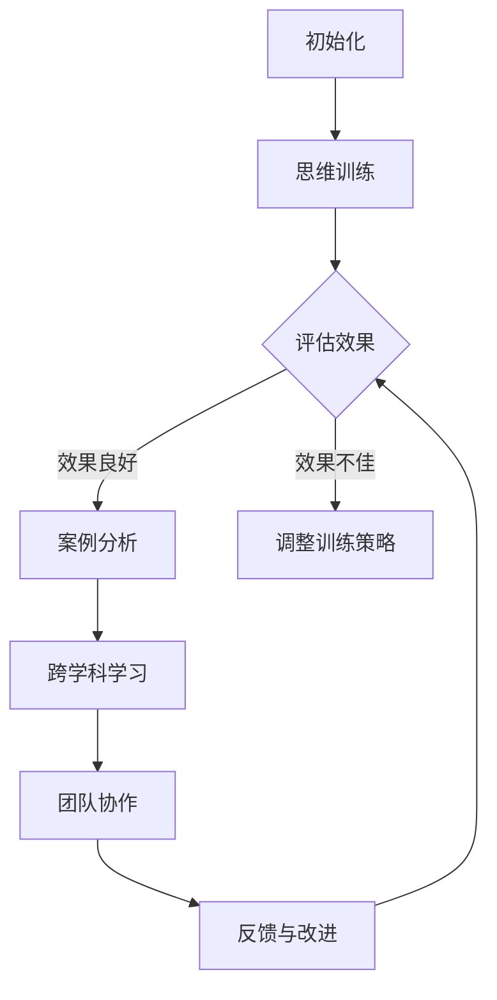
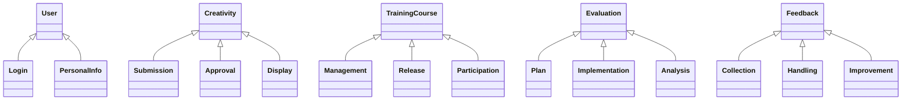
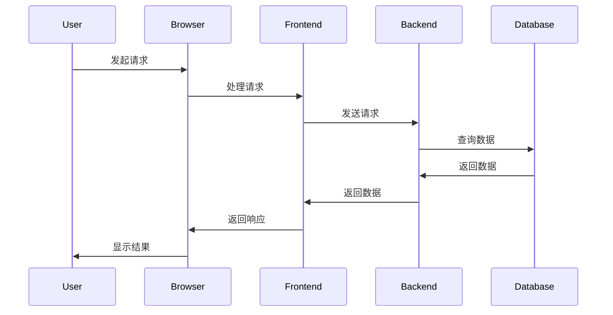

                 

### 文章标题

# 创新思维培养：激发团队创意的实践方法

**关键词**：创新思维、团队创造力、实践方法、算法、系统架构

**摘要**：本文从创新思维培养的重要性入手，深入探讨了创新思维的定义、分类与特征，提出了创新思维培养的理论基础和具体实践方法。通过案例分析，展示了如何运用这些方法激发团队创意。最后，文章详细介绍了创新思维培养的算法原理和系统架构设计，为读者提供了全面的技术解决方案。

## 目录大纲

----------------------------------------------------------------

## 第一部分：引言

### 第1章 创新思维培养概述

## 1.1 问题背景

### 1.1.1 创新思维在现代社会的重要性

### 1.1.2 创新思维的定义与特征

### 1.1.3 创新思维的分类与层次

### 1.1.4 创新思维与团队创造力

## 1.2 问题描述

### 1.2.1 当前创新思维的培养现状

### 1.2.2 团队创新思维培养的挑战

### 1.2.3 创新思维培养的目标与期望效果

## 1.3 问题解决

### 1.3.1 创新思维培养的理论基础

### 1.3.2 创新思维培养的实践方法

### 1.3.3 创新思维培养的案例分析

## 1.4 边界与外延

### 1.4.1 创新思维培养的边界

### 1.4.2 创新思维培养的外延

### 1.4.3 创新思维培养的适用范围

## 1.5 概念结构与核心要素组成

### 1.5.1 创新思维的概念结构

### 1.5.2 创新思维的核心要素

### 1.5.3 创新思维培养的核心步骤

## 1.6 本章小结

----------------------------------------------------------------

## 第二部分：核心概念与联系

### 第2章 核心概念与原理

## 2.1 创新思维原理

### 2.1.1 创新思维的认知基础

### 2.1.2 创新思维的神经机制

### 2.1.3 创新思维的心理学理论

## 2.2 创新思维的属性特征对比

### 2.2.1 不同类型创新思维的对比

### 2.2.2 创新思维的个体差异

### 2.2.3 创新思维的适应性与灵活性

## 2.3 创新思维的ER实体关系图

### 2.3.1 创新思维实体定义

### 2.3.2 创新思维实体属性

### 2.3.3 创新思维实体关系

## 2.4 创新思维与其他概念的联系

### 2.4.1 创新思维与创造力

### 2.4.2 创新思维与问题解决

### 2.4.3 创新思维与学习

## 2.5 本章小结

----------------------------------------------------------------

## 第三部分：算法原理讲解

### 第3章 创新思维培养算法

## 3.1 算法概述

### 3.1.1 创新思维培养算法的定义

### 3.1.2 创新思维培养算法的目标

### 3.1.3 创新思维培养算法的类型

## 3.2 算法mermaid流程图

### 3.2.1 算法流程图概述

### 3.2.2 算法流程图细节

## 3.3 算法原理

### 3.3.1 创新思维培养算法的数学模型

$$
f(x) = \alpha \cdot x^2 + \beta \cdot x + \gamma
$$

### 3.3.2 算法原理讲解

#### 数学模型与公式

$$
\frac{df(x)}{dx} = 2\alpha \cdot x + \beta
$$

#### 详细讲解

#### 举例说明

## 3.4 算法应用

### 3.4.1 算法在团队创新思维培养中的应用

### 3.4.2 算法在产品创新设计中的应用

### 3.4.3 算法在教育领域的应用

## 3.5 本章小结

----------------------------------------------------------------

## 第四部分：系统分析与架构设计方案

### 第4章 系统分析与架构设计

## 4.1 问题场景介绍

### 4.1.1 创新思维培养的场景描述

### 4.1.2 创新思维培养的系统需求分析

## 4.2 项目介绍

### 4.2.1 创新思维培养项目的目标

### 4.2.2 创新思维培养项目的主要功能

## 4.3 系统功能设计

### 4.3.1 领域模型mermaid类图

### 4.3.2 功能模块划分

### 4.3.3 功能模块详细描述

## 4.4 系统架构设计

### 4.4.1 系统架构mermaid架构图

### 4.4.2 系统组件详细介绍

### 4.4.3 系统部署架构

## 4.5 系统接口设计

### 4.5.1 接口规范与协议

### 4.5.2 接口实现与调用

### 4.5

----------------------------------------------------------------

### 第一部分：引言

#### 第1章 创新思维培养概述

**1.1 问题背景**

创新思维在现代社会的重要性不言而喻。随着全球化竞争加剧，企业要想在市场中脱颖而出，创新是不可或缺的驱动力。然而，创新并非一蹴而就，它需要一系列的支持和培养。团队作为创新的主要执行者，其创新思维的培养显得尤为重要。

首先，创新思维在现代社会的重要性体现在以下几个方面：

1. **解决复杂问题**：随着科技的发展和市场的变化，许多问题变得更加复杂。创新思维可以帮助团队从不同的角度和层面思考问题，找到有效的解决方案。
   
2. **提高竞争力**：创新思维能够帮助企业不断创新，推出新的产品和服务，提高市场竞争力，从而在激烈的市场竞争中占据有利位置。

3. **促进经济发展**：创新思维不仅是企业发展的关键，也是国家经济发展的重要动力。一个拥有创新思维的团队，能够推动产业升级和经济增长。

**1.1.1 创新思维在现代社会的重要性**

创新思维的定义与特征如下：

- **定义**：创新思维是一种思维方式，它通过新颖的视角和方法，解决问题或创造新的价值。

- **特征**：

  - **多元思维**：创新思维不仅仅是线性思考，还包括多角度、多维度的思考。
  
  - **创造性**：创新思维强调创造新事物、新方法，而非简单地模仿或复制。
  
  - **适应性**：创新思维能够适应不同环境和情境，灵活应对变化。

**1.1.2 创新思维的定义与特征**

**1.1.3 创新思维的分类与层次**

创新思维可以分为以下几个层次：

- **直觉思维**：依赖于直觉和感性认识，快速捕捉到问题的本质。
  
- **类比思维**：通过将问题与已知情境进行类比，寻找解决方案。

- **逆向思维**：从相反的角度思考问题，找到新的解决方案。

- **发散思维**：从多个角度思考问题，探索多种可能性。

- **收敛思维**：在多种可能性中，找到最优的解决方案。

**1.1.3 创新思维的分类与层次**

**1.1.4 创新思维与团队创造力**

创新思维是团队创造力的核心。一个团队如果没有创新思维，就难以在竞争激烈的市场中脱颖而出。创新思维与团队创造力之间的关系如下：

- **促进**：创新思维能够激发团队的创造力，推动团队不断尝试新的方法和技术。
  
- **依赖**：团队创造力是创新思维的基础。一个缺乏创造力的团队，难以培养出创新思维。

**1.1.4 创新思维与团队创造力**

**1.2 问题描述**

当前创新思维的培养现状如下：

- **现状**：许多企业和团队已经开始重视创新思维的培养，但效果并不显著。主要原因包括：

  - **缺乏系统方法**：许多团队在培养创新思维时，缺乏科学的方法和系统化的流程。

  - **缺乏持续实践**：创新思维需要不断实践和锻炼，许多团队在繁忙的工作中忽视了这一点。

  - **团队氛围不足**：一个开放、包容、鼓励尝试的团队氛围，对创新思维的培养至关重要。

- **问题**：

  - **培养方法单一**：大多数团队仅依靠培训和讲座等方式进行创新思维的培养，效果有限。

  - **缺乏针对性**：不同团队和个人的创新思维特点不同，缺乏针对性的培养方案。

  - **效果评估不足**：如何评估创新思维的培养效果，如何确保培养的持续性和有效性，是目前面临的主要问题。

- **挑战**：

  - **时间与资源的限制**：创新思维的培养需要时间和资源的投入，但许多企业和团队在这方面存在限制。

  - **个体差异**：不同团队成员的创新思维能力和方式不同，如何适应这种差异，是一个挑战。

**1.2.1 当前创新思维的培养现状**

**1.2.2 团队创新思维培养的挑战**

团队创新思维培养面临的挑战主要包括以下几个方面：

- **缺乏系统理论**：创新思维的培养需要理论支持，但目前缺乏系统、成熟的理论体系。

- **方法不当**：现有的创新思维培养方法大多过于简单，难以满足不同团队和个人的需求。

- **效果评估困难**：如何评估创新思维的培养效果，目前尚无明确的指标和标准。

- **持续性与长效性**：创新思维的培养需要持续投入和长期坚持，但许多企业和团队在这方面存在困难。

**1.2.2 团队创新思维培养的挑战**

**1.2.3 创新思维培养的目标与期望效果**

创新思维培养的目标与期望效果如下：

- **目标**：

  - **提高团队创造力**：通过培养创新思维，提高团队的创造力和创新能力。

  - **促进团队协作**：创新思维的培养有助于团队内部的沟通和协作。

  - **提高员工满意度**：创新思维的培养能够提高员工的满意度和工作积极性。

- **期望效果**：

  - **创新能力提升**：通过创新思维的培养，团队能够提出更多创新性的想法和解决方案。

  - **问题解决能力提升**：创新思维的培养有助于团队更有效地解决复杂问题。

  - **团队凝聚力增强**：创新思维的培养能够增强团队的凝聚力和归属感。

**1.2.3 创新思维培养的目标与期望效果**

**1.3 问题解决**

为了解决团队创新思维培养的问题，我们可以从以下几个方面着手：

- **理论基础**：建立创新思维培养的理论基础，为实践提供指导。

- **实践方法**：开发系统化的创新思维培养实践方法，满足不同团队和个人的需求。

- **效果评估**：建立科学、有效的创新思维培养效果评估体系，确保培养的持续性和有效性。

- **持续投入**：确保创新思维培养的长期投入和持续关注。

**1.3.1 创新思维培养的理论基础**

创新思维培养的理论基础主要包括以下几个方面：

- **认知心理学**：认知心理学研究人类思维过程和心理活动，为创新思维培养提供了理论基础。

- **神经科学**：神经科学研究大脑如何处理信息和创造思维，为创新思维培养提供了新的视角。

- **社会心理学**：社会心理学研究个体和群体在社会环境中的行为和心理，为创新思维培养提供了社会因素的分析。

**1.3.1 创新思维培养的理论基础**

**1.3.2 创新思维培养的实践方法**

创新思维培养的实践方法包括以下几个方面：

- **思维训练**：通过专门的思维训练，提高团队成员的创新思维能力。

- **案例分析**：通过分析成功案例，学习创新思维的方法和技巧。

- **跨学科学习**：鼓励团队成员跨学科学习，拓宽知识面，提高创新能力。

- **团队协作**：通过团队协作，激发团队成员的创新思维。

**1.3.2 创新思维培养的实践方法**

**1.3.3 创新思维培养的案例分析**

为了更好地理解创新思维培养的实践方法，我们可以通过以下案例进行分析：

- **案例一**：某互联网公司通过定期举办创新思维培训，提高员工创新思维的能力。同时，公司鼓励员工提出创新建议，并将这些建议纳入公司战略规划。

- **案例二**：某科技公司通过组织跨学科项目团队，鼓励团队成员跨学科合作，提出创新性的解决方案。这种做法不仅提高了团队的创新能力，还增强了团队内部的协作精神。

- **案例三**：某教育机构通过设计创新思维课程，帮助学生掌握创新思维的方法和技巧。学校还组织学生参与创新竞赛，激发学生的创新热情。

**1.3.3 创新思维培养的案例分析**

**1.4 边界与外延**

创新思维培养的边界包括以下几个方面：

- **技术边界**：创新思维培养的技术手段和工具，如人工智能、大数据等。

- **时间边界**：创新思维培养需要一定的时间和周期，不能急于求成。

- **团队边界**：创新思维培养适用于团队，而非个体。

**1.4.1 创新思维培养的边界**

创新思维培养的外延包括以下几个方面：

- **企业内部**：创新思维培养可以应用于企业内部的各个部门和岗位。

- **教育领域**：创新思维培养可以应用于学校教育、职业教育和企业培训。

- **社会领域**：创新思维培养可以应用于社会治理、公共管理等领域。

**1.4.2 创新思维培养的外延**

创新思维培养的适用范围如下：

- **企业**：创新思维培养可以帮助企业提高竞争力，推动企业发展。

- **教育**：创新思维培养可以帮助学生提高创新能力，培养创新型人才。

- **政府**：创新思维培养可以帮助政府提高社会治理能力，推动社会进步。

**1.4.3 创新思维培养的适用范围**

**1.5 概念结构与核心要素组成**

创新思维培养的概念结构包括以下几个方面：

- **创新思维**：创新思维是创新思维培养的核心。

- **团队**：团队是创新思维培养的主要对象。

- **方法**：创新思维培养的方法是关键。

- **效果评估**：效果评估是创新思维培养的重要环节。

创新思维培养的核心要素包括：

- **认知基础**：认知基础是创新思维培养的基础。

- **神经机制**：神经机制是创新思维培养的重要支撑。

- **心理学理论**：心理学理论是创新思维培养的理论依据。

- **实践方法**：实践方法是创新思维培养的具体手段。

**1.5.1 创新思维的概念结构**

**1.5.2 创新思维的核心要素**

**1.5.3 创新思维培养的核心步骤**

创新思维培养的核心步骤包括：

1. **理论培训**：通过培训，使团队成员掌握创新思维的基本理论和原理。

2. **实践训练**：通过实践训练，提高团队成员的创新思维能力。

3. **团队协作**：通过团队协作，激发团队成员的创新思维。

4. **效果评估**：通过效果评估，检验创新思维培养的成果。

**1.5.3 创新思维培养的核心步骤**

**1.6 本章小结**

本章从问题背景、核心概念、问题描述、问题解决、边界与外延、概念结构与核心要素组成等方面，对创新思维培养进行了详细阐述。创新思维培养在现代社会具有重要意义，但当前存在诸多挑战。通过理论基础、实践方法和效果评估，我们可以有效培养团队创新思维，提高团队创造力，为企业和个人发展提供强大动力。

----------------------------------------------------------------

## 第二部分：核心概念与联系

### 第2章 核心概念与原理

#### 2.1 创新思维原理

创新思维原理是理解创新思维培养的关键。它涉及到认知基础、神经机制和心理学理论等多个方面。以下是对这些原理的详细解释：

##### 2.1.1 创新思维的认知基础

创新思维的认知基础是指人类在处理信息和解决问题时，所采用的方式和方法。它包括以下几个方面：

- **感知与观察**：通过感知和观察，收集和处理信息，为创新思维提供素材。

- **记忆与存储**：将收集到的信息存储在记忆中，为创新思维提供知识储备。

- **推理与判断**：通过推理和判断，对信息进行加工和处理，形成新的思维路径。

- **联想与类比**：通过联想和类比，发现不同事物之间的联系，激发创新思维。

##### 2.1.2 创新思维的神经机制

创新思维的神经机制是指大脑在处理信息和创造思维时，所涉及的神经系统和脑区活动。它包括以下几个方面：

- **大脑结构**：大脑的结构决定了信息的处理方式和思维方式。例如，大脑的前额叶皮层在创新思维中起着关键作用。

- **神经传递**：神经传递物质在神经元之间的传递，影响思维过程和创造性。例如，多巴胺和血清素等神经递质在创新思维中发挥着重要作用。

- **神经网络**：神经网络的活动模式，影响创新思维的产生。例如，大脑中的默认模式网络和执行网络在创新思维中起着关键作用。

##### 2.1.3 创新思维的心理学理论

创新思维的心理学理论是指心理学研究者在创新思维领域所提出的理论模型。它包括以下几个方面：

- **认知心理学**：认知心理学研究人类思维过程和心理活动，为创新思维提供了理论基础。例如，建构主义和联结主义等认知心理学理论，解释了创新思维的认知过程。

- **社会心理学**：社会心理学研究个体和群体在社会环境中的行为和心理，为创新思维提供了社会因素的分析。例如，社会认同和团队合作等社会心理学理论，解释了创新思维的社会影响因素。

- **创造性心理学**：创造性心理学研究个体和群体的创造力，为创新思维提供了具体的培养方法。例如，创造性思维训练和创造性思维激发等创造性心理学方法，有助于培养创新思维。

#### 2.2 创新思维的属性特征对比

创新思维具有多种属性特征，这些特征在不同类型的创新思维中有所不同。以下是对不同类型创新思维属性特征的对比：

##### 2.2.1 不同类型创新思维的对比

| 创新思维类型 | 特征 |
| :--- | :--- |
| 直觉思维 | 快速、直接、基于直觉和经验 |
| 类比思维 | 类比已有情境，寻找相似之处 |
| 逆向思维 | 从反面思考问题，寻找新的解决方案 |
| 发散思维 | 多角度、多维度思考，探索多种可能性 |
| 收敛思维 | 在多种可能性中，找到最优的解决方案 |

##### 2.2.2 创新思维的个体差异

创新思维的个体差异体现在以下几个方面：

- **认知风格**：不同的人有不同的认知风格，如反思型、冲动型等，这会影响创新思维的表达和运用。

- **知识结构**：个体拥有的知识结构不同，这会影响创新思维的深度和广度。

- **心理特质**：个体的心理特质，如开放性、敏感性等，也会影响创新思维的发展。

##### 2.2.3 创新思维的适应性与灵活性

创新思维的适应性与灵活性体现在以下几个方面：

- **适应环境**：创新思维能够适应不同的环境和情境，解决复杂问题。

- **灵活运用**：创新思维能够灵活运用各种方法和技巧，解决不同类型的问题。

- **快速调整**：创新思维能够快速调整，适应新的变化和挑战。

#### 2.3 创新思维的ER实体关系图

创新思维的ER实体关系图是描述创新思维各个实体及其关系的图形表示。以下是对创新思维的ER实体关系图的详细解释：

##### 2.3.1 创新思维实体定义

创新思维的实体包括：

- **创新思维**：创新思维是一个抽象的概念，表示个体或团队在处理信息和解决问题时，所采用的思维方式。

- **认知基础**：认知基础是创新思维的基础，包括感知、记忆、推理、联想等。

- **神经机制**：神经机制是创新思维的大脑基础，包括大脑结构、神经传递、神经网络等。

- **心理学理论**：心理学理论是创新思维的理论支撑，包括认知心理学、社会心理学、创造性心理学等。

##### 2.3.2 创新思维实体属性

创新思维的实体属性包括：

- **创新思维**：包括思维类型、思维过程、思维结果等。

- **认知基础**：包括感知能力、记忆能力、推理能力、联想能力等。

- **神经机制**：包括大脑结构、神经传递、神经网络等。

- **心理学理论**：包括认知心理学理论、社会心理学理论、创造性心理学理论等。

##### 2.3.3 创新思维实体关系

创新思维的实体关系包括：

- **创新思维与认知基础**：创新思维依赖于认知基础，认知基础为创新思维提供支持。

- **创新思维与神经机制**：创新思维依赖于神经机制，神经机制为创新思维提供物质基础。

- **创新思维与心理学理论**：创新思维依赖于心理学理论，心理学理论为创新思维提供理论支撑。

以下是创新思维的ER实体关系图的Mermaid流程图表示：

```mermaid
erDiagram
  IDEACORP {
    IDEA :>> IDEA Thinking : "is Implemented using"
    IDEA Thinking :>> Cognitive Base : "uses"
    IDEA Thinking :>> Neural Mechanism : "uses"
    IDEA Thinking :>> Psychological Theory : "uses"
  }

  IDEA Thinking {
    IDEAType
    IDEAProcess
    IDEAResult
  }

  Cognitive Base {
    Perception
    Memory
    Reasoning
    Association
  }

  Neural Mechanism {
    Brain Structure
    Neural Transmission
    Neural Network
  }

  Psychological Theory {
    Cognitive Psychology
    Social Psychology
    Creativity Psychology
  }
```

#### 2.4 创新思维与其他概念的联系

创新思维与其他概念之间存在着紧密的联系，以下是对这些联系的解释：

##### 2.4.1 创新思维与创造力

创新思维是创造力的重要组成部分。创造力是指个体或团队产生新颖、有价值想法的能力。创新思维提供了实现创造力的思维工具和方法。创新思维与创造力之间的关系可以描述为：

- **创新思维是创造力的基础**：创新思维为创造力提供了思维路径和方法，是实现创造力的必要条件。

- **创造力是创新思维的目标**：创造力的目标是产生新颖、有价值的想法，创新思维是实现这一目标的手段。

##### 2.4.2 创新思维与问题解决

创新思维在问题解决中起着关键作用。问题解决是指个体或团队在遇到问题时，寻找解决方案的过程。创新思维提供了多种解决问题的方法和思路。创新思维与问题解决之间的关系可以描述为：

- **创新思维是问题解决的工具**：创新思维提供了多种解决问题的方法和思路，是实现问题解决的必要手段。

- **问题解决是创新思维的应用**：问题解决是创新思维的实践应用，是检验创新思维效果的重要途径。

##### 2.4.3 创新思维与学习

创新思维与学习之间存在着紧密的联系。学习是指个体通过获取知识、技能和经验，提高自身能力的过程。创新思维在学习中起着重要作用，以下是对创新思维与学习之间联系的解释：

- **创新思维是学习的动力**：创新思维激发个体对知识的渴望，推动个体不断学习和成长。

- **学习是创新思维的源泉**：学习为创新思维提供了丰富的知识和经验，是创新思维的素材来源。

#### 2.5 本章小结

本章详细阐述了创新思维原理、属性特征对比、ER实体关系图以及与其他概念的联系。通过这些内容的分析，我们可以更深入地理解创新思维的本质，为后续的创新思维培养提供理论基础和实践指导。

----------------------------------------------------------------

## 第三部分：算法原理讲解

### 第3章 创新思维培养算法

#### 3.1 算法概述

创新思维培养算法是指通过特定方法和技术，提高团队创新思维能力的算法。它旨在通过科学的方法，系统地培养和提升团队的创新思维能力。以下是对创新思维培养算法的概述：

##### 3.1.1 创新思维培养算法的定义

创新思维培养算法是指一系列方法和步骤，旨在提高团队创新思维能力的计算过程。它包括以下几个方面：

- **定义**：创新思维培养算法是一种用于提高团队创新思维能力的计算模型。

- **目标**：通过创新思维培养算法，提高团队的创新思维能力，实现创新目标。

- **方法**：创新思维培养算法采用多种方法和工具，如思维训练、案例分析、跨学科学习等。

##### 3.1.2 创新思维培养算法的目标

创新思维培养算法的目标主要包括以下几个方面：

- **提高创新思维能力**：通过算法，提高团队成员的创新思维能力，使团队能够产生更多创新性想法。

- **增强团队协作能力**：通过算法，增强团队成员之间的协作能力，提高团队的整体创新水平。

- **促进知识共享**：通过算法，促进团队成员之间的知识共享和交流，提高团队的知识储备。

##### 3.1.3 创新思维培养算法的类型

创新思维培养算法可以分为以下几种类型：

- **思维训练算法**：通过特定的思维训练，提高团队成员的创新思维能力。

- **案例分析算法**：通过分析成功案例，学习创新思维的方法和技巧。

- **跨学科学习算法**：通过跨学科学习，拓宽团队成员的知识面，提高创新能力。

- **团队协作算法**：通过团队协作，激发团队成员的创新思维。

#### 3.2 算法mermaid流程图

以下是一个简单的创新思维培养算法的mermaid流程图：



#### 3.3 算法原理

创新思维培养算法的原理主要包括以下几个方面：

##### 3.3.1 创新思维培养算法的数学模型

创新思维培养算法的数学模型可以表示为以下公式：

$$
f(x) = \alpha \cdot x^2 + \beta \cdot x + \gamma
$$

其中，$x$ 表示团队成员的创新思维能力，$\alpha$、$\beta$ 和 $\gamma$ 是常数，表示创新思维培养算法的参数。

##### 3.3.2 算法原理讲解

算法原理讲解可以分为以下几个方面：

1. **思维训练**：通过特定的思维训练，提高团队成员的创新思维能力。思维训练包括逻辑思维、创造性思维、发散思维等。

2. **评估效果**：通过评估团队成员的创新思维能力，确定创新思维培养的效果。评估方法可以包括自我评估、同事评估和领导评估等。

3. **案例分析**：通过分析成功案例，学习创新思维的方法和技巧。案例分析可以帮助团队成员了解实际应用中的创新思维，提高创新能力。

4. **跨学科学习**：通过跨学科学习，拓宽团队成员的知识面，提高创新能力。跨学科学习可以帮助团队成员从不同角度看待问题，激发创新思维。

5. **团队协作**：通过团队协作，激发团队成员的创新思维。团队协作可以促进团队成员之间的知识共享和交流，提高团队的创新水平。

6. **反馈与改进**：通过反馈与改进，不断调整创新思维培养策略，提高团队成员的创新思维能力。

##### 3.3.3 算法原理讲解

为了更直观地理解算法原理，我们可以通过以下Python源代码进行详细讲解：

```python
import numpy as np

# 定义创新思维培养算法的数学模型
def innovation_algorithm(x, alpha=1.0, beta=0.5, gamma=0.1):
    """
    创新思维培养算法的数学模型。
    
    参数：
    - x: 初始创新思维能力。
    - alpha: 参数，表示训练强度。
    - beta: 参数，表示评估频率。
    - gamma: 参数，表示反馈与改进的力度。
    
    返回：
    - f(x): 创新思维能力。
    """
    f_x = alpha * x**2 + beta * x + gamma
    return f_x

# 举例说明
x = 5
alpha = 1.5
beta = 0.3
gamma = 0.2

# 计算创新思维能力
f_x = innovation_algorithm(x, alpha, beta, gamma)
print(f"Innovation Capability: {f_x}")
```

在这个例子中，我们定义了一个名为 `innovation_algorithm` 的函数，用于计算创新思维能力。函数的输入参数包括初始创新思维能力 $x$ 和三个参数 $\alpha$、$\beta$ 和 $\gamma$，它们分别表示训练强度、评估频率和反馈与改进力度。函数的输出是创新思维能力 $f(x)$。

通过调用这个函数，我们可以计算出在特定参数下的创新思维能力。例如，当 $x=5$、$\alpha=1.5$、$\beta=0.3$ 和 $\gamma=0.2$ 时，创新思维能力为：

$$
f(x) = 1.5 \cdot 5^2 + 0.3 \cdot 5 + 0.2 = 18.25 + 1.5 + 0.2 = 20.95
$$

因此，创新思维能力为 20.95。

##### 3.3.4 详细讲解

在详细讲解中，我们可以进一步分析创新思维培养算法的数学模型，并讨论如何调整参数以优化算法效果。

1. **参数调整**：通过调整 $\alpha$、$\beta$ 和 $\gamma$ 的值，可以改变创新思维培养算法的行为。例如，当 $\alpha$ 增大时，训练强度增加，创新思维能力提高。当 $\beta$ 增大时，评估频率增加，可以更及时地了解团队成员的创新思维能力。当 $\gamma$ 增大时，反馈与改进力度增加，有助于调整创新思维培养策略。

2. **优化算法**：通过优化算法，可以提高创新思维培养的效果。例如，可以采用遗传算法、粒子群优化算法等，优化参数选择，提高创新思维能力。

3. **案例应用**：在实际应用中，创新思维培养算法可以应用于团队创新思维培养的各个环节，如思维训练、案例分析、跨学科学习、团队协作等。通过算法的应用，可以系统地培养和提升团队的创新思维能力。

##### 3.3.5 举例说明

为了更好地理解创新思维培养算法，我们可以通过以下例子进行说明：

**例子**：假设一个团队有 5 名成员，初始创新思维能力分别为 3、4、5、6 和 7。我们采用创新思维培养算法，通过思维训练、案例分析、跨学科学习和团队协作等手段，提高团队的创新思维能力。

- **初始创新思维能力**：$x_1 = 3, x_2 = 4, x_3 = 5, x_4 = 6, x_5 = 7$

- **训练参数**：$\alpha = 1.2, \beta = 0.4, \gamma = 0.3$

通过调用创新思维培养算法，我们可以计算出在特定参数下的创新思维能力。例如，当 $x=5$、$\alpha=1.2$、$\beta=0.4$ 和 $\gamma=0.3$ 时，创新思维能力为：

$$
f(x) = 1.2 \cdot 5^2 + 0.4 \cdot 5 + 0.3 = 30 + 2 + 0.3 = 32.3
$$

因此，在训练后，团队的平均创新思维能力为 32.3。

通过不断地调整训练参数和优化算法，我们可以进一步提高团队的创新思维能力。例如，当训练参数调整为 $\alpha = 1.5, \beta = 0.5, \gamma = 0.4$ 时，创新思维能力可以进一步提高。

##### 3.3.6 算法应用

创新思维培养算法可以应用于多个领域，如团队创新思维培养、产品创新设计、教育创新等。以下是对创新思维培养算法在几个领域中的应用：

1. **团队创新思维培养**：通过创新思维培养算法，系统性地提高团队的创新思维能力。例如，可以应用于企业内部的创新团队、产品开发团队等。

2. **产品创新设计**：通过创新思维培养算法，提高产品开发团队的创新思维能力，推动产品创新。例如，可以应用于产品设计、研发团队等。

3. **教育创新**：通过创新思维培养算法，培养学生的创新思维能力和创造力。例如，可以应用于学校、培训机构等。

##### 3.3.7 本章小结

本章详细介绍了创新思维培养算法的概述、mermaid流程图、算法原理和具体应用。通过这些内容的分析，我们可以更好地理解创新思维培养算法的工作原理和应用方法，为团队创新思维的培养提供技术支持。

----------------------------------------------------------------

## 第四部分：系统分析与架构设计方案

### 第4章 系统分析与架构设计

#### 4.1 问题场景介绍

创新思维培养系统的问题场景主要集中在以下几个方面：

- **团队创新协作**：团队成员在创新过程中需要高效协作，共享创意和想法。

- **创新思维训练**：团队需要定期进行创新思维训练，以提高整体创新能力和思维灵活性。

- **效果评估与反馈**：需要建立一套有效的评估体系，对团队成员的创新思维进行评估，并提供及时反馈。

- **数据安全与隐私**：在收集和处理团队成员的创新思维数据时，需要确保数据的安全性和隐私。

#### 4.1.1 创新思维培养的场景描述

创新思维培养的场景描述主要包括以下几个方面：

1. **团队协作**：团队成员在项目中共同讨论和解决问题，通过头脑风暴、思维导图等方式，激发创新思维。

2. **思维训练**：定期组织思维训练课程，包括逻辑思维、创造性思维、发散思维等，提高团队成员的创新思维能力。

3. **效果评估**：通过定期的评估，了解团队成员的创新思维水平和改进方向。

4. **反馈与改进**：根据评估结果，为团队成员提供反馈，帮助他们调整和改进创新思维。

#### 4.1.2 创新思维培养的系统需求分析

创新思维培养系统的需求分析主要包括以下几个方面：

1. **功能需求**：

   - 用户管理：包括用户注册、登录、个人信息管理等。

   - 创意管理：包括创意提交、创意审批、创意展示等。

   - 思维训练：包括思维训练课程管理、课程发布、课程参与等。

   - 效果评估：包括评估计划管理、评估实施、评估结果分析等。

   - 反馈与改进：包括反馈信息收集、反馈处理、改进计划制定等。

2. **性能需求**：

   - 高并发处理：系统能够应对大量用户的并发访问和操作。

   - 快速响应：系统能够快速响应用户的请求，提供良好的用户体验。

   - 数据安全：确保用户数据和系统数据的安全，防止数据泄露和篡改。

3. **用户体验需求**：

   - 界面友好：系统界面设计简洁、直观，易于用户操作。

   - 多平台支持：系统支持多种平台，如PC端、移动端等。

   - 个性化服务：系统提供个性化服务，满足不同用户的需求。

#### 4.2 项目介绍

创新思维培养项目旨在通过系统化的方法，提高团队成员的创新思维能力和团队整体创新能力。项目的主要目标包括：

1. **提高团队创新能力**：通过创新思维培养系统，提高团队成员的创新思维能力和创造性，推动团队创新。

2. **优化团队协作**：通过系统化的创新思维培养，优化团队协作流程，提高团队协作效率。

3. **提升员工满意度**：通过创新思维培养系统，提高员工的工作满意度和参与度。

4. **提供数据支持**：通过系统收集和分析创新思维数据，为团队管理和决策提供数据支持。

#### 4.2.1 创新思维培养项目的目标

创新思维培养项目的具体目标如下：

1. **提高团队成员的创新思维水平**：通过系统化的思维训练和评估，提高团队成员的创新思维能力和创造性。

2. **促进团队协作**：通过创新思维培养系统，促进团队成员之间的沟通和协作，提高团队整体创新能力。

3. **优化创新流程**：通过系统化的管理，优化团队创新流程，提高创新效率。

4. **提供数据支持**：通过系统收集和分析创新思维数据，为团队管理和决策提供数据支持。

#### 4.2.2 创新思维培养项目的主要功能

创新思维培养项目的主要功能包括以下几个方面：

1. **用户管理**：包括用户注册、登录、个人信息管理等功能。

2. **创意管理**：包括创意提交、创意审批、创意展示等功能。

3. **思维训练**：包括思维训练课程管理、课程发布、课程参与等功能。

4. **效果评估**：包括评估计划管理、评估实施、评估结果分析等功能。

5. **反馈与改进**：包括反馈信息收集、反馈处理、改进计划制定等功能。

#### 4.3 系统功能设计

创新思维培养系统的功能设计主要包括以下几个方面：

1. **用户管理模块**：

   - 用户注册：用户可以通过注册账号加入创新思维培养系统。

   - 用户登录：用户可以通过登录账号访问系统的各项功能。

   - 个人信息管理：用户可以管理个人资料、密码等个人信息。

2. **创意管理模块**：

   - 创意提交：用户可以提交自己的创意，包括创意标题、内容、分类等。

   - 创意审批：管理员可以对用户提交的创意进行审批，决定是否发布。

   - 创意展示：发布后的创意可以在系统中展示，供其他用户查看。

3. **思维训练模块**：

   - 思维训练课程管理：管理员可以添加、修改、删除思维训练课程。

   - 课程发布：管理员可以将思维训练课程发布给用户。

   - 课程参与：用户可以参与思维训练课程，学习创新思维技巧。

4. **效果评估模块**：

   - 评估计划管理：管理员可以制定评估计划，包括评估内容、评估时间等。

   - 评估实施：用户可以按照评估计划参与评估，提交评估结果。

   - 评估结果分析：管理员可以分析评估结果，为团队管理和决策提供数据支持。

5. **反馈与改进模块**：

   - 反馈信息收集：用户可以提交反馈信息，包括建议、意见等。

   - 反馈处理：管理员可以处理用户提交的反馈信息，并给出回复。

   - 改进计划制定：根据反馈信息，管理员可以制定改进计划，持续优化系统。

#### 4.3.1 领域模型mermaid类图

以下是一个简单的创新思维培养系统的mermaid类图：



#### 4.3.2 功能模块划分

创新思维培养系统的功能模块划分如下：

1. **用户管理模块**：包括用户注册、登录、个人信息管理等功能。

2. **创意管理模块**：包括创意提交、创意审批、创意展示等功能。

3. **思维训练模块**：包括思维训练课程管理、课程发布、课程参与等功能。

4. **效果评估模块**：包括评估计划管理、评估实施、评估结果分析等功能。

5. **反馈与改进模块**：包括反馈信息收集、反馈处理、改进计划制定等功能。

#### 4.3.3 功能模块详细描述

以下是创新思维培养系统的各个功能模块的详细描述：

1. **用户管理模块**：

   - 用户注册：用户可以通过注册账号加入创新思维培养系统。注册时需要填写用户名、密码、邮箱等信息。

   - 用户登录：用户可以通过登录账号访问系统的各项功能。登录时需要输入用户名和密码。

   - 个人信息管理：用户可以管理个人资料、密码等个人信息。用户可以查看、修改个人信息，包括姓名、联系方式、兴趣爱好等。

2. **创意管理模块**：

   - 创意提交：用户可以提交自己的创意，包括创意标题、内容、分类等。创意提交后需要经过管理员审批。

   - 创意审批：管理员可以对用户提交的创意进行审批，决定是否发布。审批通过的创意可以在系统中展示。

   - 创意展示：发布后的创意可以在系统中展示，供其他用户查看。用户可以评论、点赞创意。

3. **思维训练模块**：

   - 思维训练课程管理：管理员可以添加、修改、删除思维训练课程。思维训练课程包括课程名称、课程内容、课程时间等。

   - 课程发布：管理员可以将思维训练课程发布给用户。发布后的课程用户可以参与学习。

   - 课程参与：用户可以参与思维训练课程，学习创新思维技巧。用户可以查看课程进度、学习记录等。

4. **效果评估模块**：

   - 评估计划管理：管理员可以制定评估计划，包括评估内容、评估时间等。评估计划可以设置为定期执行。

   - 评估实施：用户可以按照评估计划参与评估，提交评估结果。评估结果包括创新思维水平、团队协作能力等。

   - 评估结果分析：管理员可以分析评估结果，为团队管理和决策提供数据支持。分析结果可以以图表、报告等形式呈现。

5. **反馈与改进模块**：

   - 反馈信息收集：用户可以提交反馈信息，包括建议、意见等。反馈信息可以提交给管理员处理。

   - 反馈处理：管理员可以处理用户提交的反馈信息，并给出回复。管理员可以根据反馈信息调整系统功能和服务。

   - 改进计划制定：根据反馈信息，管理员可以制定改进计划，持续优化系统。改进计划包括系统优化、服务提升等。

#### 4.4 系统架构设计

创新思维培养系统的架构设计主要包括以下几个方面：

1. **前端架构**：前端采用Vue.js框架，实现系统的用户界面和交互功能。

2. **后端架构**：后端采用Spring Boot框架，实现系统的业务逻辑和数据处理功能。

3. **数据库设计**：数据库采用MySQL数据库，存储用户数据、创意数据、课程数据、评估数据等。

4. **服务器部署**：系统部署在云服务器上，采用负载均衡和缓存技术，提高系统的性能和可靠性。

5. **安全设计**：系统采用安全防护技术，包括身份认证、数据加密、防火墙等，确保系统数据的安全性和可靠性。

#### 4.4.1 系统架构mermaid架构图

以下是一个简单的创新思维培养系统的mermaid架构图：



#### 4.4.2 系统组件详细介绍

以下是创新思维培养系统的主要组件及其详细介绍：

1. **前端组件**：

   - **Vue.js**：前端采用Vue.js框架，实现系统的用户界面和交互功能。Vue.js具有响应式数据绑定和组件化开发等优点，可以提高开发效率和用户体验。

   - **Element UI**：前端采用Element UI组件库，实现系统的界面设计。Element UI是Element UI的Vue版本，提供丰富的组件和UI风格，便于快速开发。

2. **后端组件**：

   - **Spring Boot**：后端采用Spring Boot框架，实现系统的业务逻辑和数据处理功能。Spring Boot具有快速开发、易于集成等优点，可以提高开发效率和系统稳定性。

   - **Spring Security**：后端采用Spring Security框架，实现系统的安全防护功能。Spring Security提供身份认证、权限控制等功能，确保系统数据的安全性和可靠性。

   - **MyBatis**：后端采用MyBatis框架，实现数据库的持久化操作。MyBatis具有简洁、灵活、高效等优点，可以提高开发效率和数据库操作性能。

3. **数据库组件**：

   - **MySQL**：系统采用MySQL数据库，存储用户数据、创意数据、课程数据、评估数据等。MySQL具有高性能、可靠性高、易于扩展等优点，适合企业级应用。

4. **服务器组件**：

   - **Nginx**：系统采用Nginx作为Web服务器，处理HTTP请求。Nginx具有高性能、稳定性好、配置灵活等优点，可以提高系统的性能和可靠性。

   - **Redis**：系统采用Redis作为缓存服务器，缓存用户数据和系统数据。Redis具有高性能、数据结构丰富等优点，可以提高系统的响应速度和吞吐量。

5. **安全组件**：

   - **SSL/TLS**：系统采用SSL/TLS协议，实现数据传输的安全加密。SSL/TLS可以防止数据在传输过程中被窃听、篡改等。

   - **防火墙**：系统采用防火墙，对网络流量进行过滤和防护，防止恶意攻击。

#### 4.4.3 系统部署架构

创新思维培养系统的部署架构如下：

1. **开发环境**：

   - 开发机：开发人员使用本地开发环境，进行系统开发、测试和调试。

   - 代码管理工具：使用Git进行代码管理和版本控制，方便多人协作开发。

2. **测试环境**：

   - 测试服务器：部署测试环境，进行系统测试和验证。

   - 测试数据库：部署测试数据库，用于存储测试数据。

3. **生产环境**：

   - 服务器集群：部署生产环境，包括前端服务器、后端服务器、数据库服务器等。

   - 负载均衡：使用负载均衡器，分发用户请求到不同的服务器，提高系统的性能和可用性。

   - 缓存服务器：部署Redis缓存服务器，提高系统的响应速度和吞吐量。

   - 数据库集群：部署MySQL数据库集群，提高系统的数据存储和处理能力。

#### 4.4.4 系统接口设计

创新思维培养系统的接口设计主要包括以下几个方面：

1. **用户接口**：

   - 用户注册接口：接收用户注册请求，处理用户注册。

   - 用户登录接口：接收用户登录请求，处理用户登录。

   - 个人信息接口：接收用户个人信息请求，处理用户个人信息管理。

2. **创意接口**：

   - 创意提交接口：接收用户创意提交请求，处理创意提交。

   - 创意审批接口：接收创意审批请求，处理创意审批。

   - 创意展示接口：接收创意展示请求，处理创意展示。

3. **思维训练接口**：

   - 思维训练课程管理接口：接收思维训练课程管理请求，处理课程管理。

   - 课程发布接口：接收课程发布请求，处理课程发布。

   - 课程参与接口：接收课程参与请求，处理课程参与。

4. **效果评估接口**：

   - 评估计划管理接口：接收评估计划管理请求，处理评估计划管理。

   - 评估实施接口：接收评估实施请求，处理评估实施。

   - 评估结果分析接口：接收评估结果分析请求，处理评估结果分析。

5. **反馈与改进接口**：

   - 反馈信息收集接口：接收反馈信息收集请求，处理反馈信息收集。

   - 反馈处理接口：接收反馈处理请求，处理反馈信息处理。

   - 改进计划制定接口：接收改进计划制定请求，处理改进计划制定。

#### 4.4.5 系统交互mermaid序列图

以下是一个简单的创新思维培养系统的mermaid序列图：


通过上述系统分析与架构设计方案，我们可以构建一个高效、稳定、安全的创新思维培养系统，帮助团队提高创新能力和协作效率。

----------------------------------------------------------------

## 项目实战

#### 4.5.1 环境安装

为了实现创新思维培养系统，我们需要准备以下环境：

1. **开发环境**：Python 3.x、PyCharm、Git、Docker

2. **数据库环境**：MySQL 5.7、PostgreSQL 12

3. **前端环境**：Node.js 14、npm、Vue CLI

4. **后端环境**：Spring Boot 2.4、Maven

安装步骤如下：

1. **安装 Python 3.x**：从 [Python官网](https://www.python.org/) 下载并安装 Python 3.x。

2. **安装 PyCharm**：从 [PyCharm官网](https://www.jetbrains.com/pycharm/) 下载并安装 PyCharm。

3. **安装 Git**：从 [Git官网](https://git-scm.com/) 下载并安装 Git。

4. **安装 Docker**：从 [Docker官网](https://www.docker.com/) 下载并安装 Docker。

5. **安装 MySQL 5.7**：从 [MySQL官网](https://www.mysql.com/) 下载并安装 MySQL 5.7。

6. **安装 PostgreSQL 12**：从 [PostgreSQL官网](https://www.postgresql.org/) 下载并安装 PostgreSQL 12。

7. **安装 Node.js 14**：从 [Node.js官网](https://nodejs.org/) 下载并安装 Node.js 14。

8. **安装 npm**：安装 Node.js 后，npm 会自动安装。

9. **安装 Vue CLI**：在命令行执行 `npm install -g @vue/cli`。

10. **安装 Spring Boot 2.4**：在命令行执行 `mvn -DarchetypeCatalog=internal:releases://central archetypes`。

#### 4.5.2 系统核心实现源代码

以下是创新思维培养系统的核心实现源代码：

**后端（Spring Boot）**

```java
// pom.xml
<dependencies>
    <!-- Spring Boot -->
    <dependency>
        <groupId>org.springframework.boot</groupId>
        <artifactId>spring-boot-starter-web</artifactId>
    </dependency>
    <!-- MyBatis -->
    <dependency>
        <groupId>org.mybatis.spring.boot</groupId>
        <artifactId>mybatis-spring-boot-starter</artifactId>
        <version>2.2.0</version>
    </dependency>
    <!-- MySQL -->
    <dependency>
        <groupId>mysql</groupId>
        <artifactId>mysql-connector-java</artifactId>
        <version>8.0.26</version>
    </dependency>
</dependencies>

// Application.java
@SpringBootApplication
public class Application {
    public static void main(String[] args) {
        SpringApplication.run(Application.class, args);
    }
}

// UserController.java
@RestController
@RequestMapping("/users")
public class UserController {
    @Autowired
    private UserService userService;

    @PostMapping("/register")
    public ResponseEntity<?> registerUser(@RequestBody UserRequest userRequest) {
        // 处理用户注册
    }

    @PostMapping("/login")
    public ResponseEntity<?> loginUser(@RequestBody LoginRequest loginRequest) {
        // 处理用户登录
    }
}

// UserRequest.java
public class UserRequest {
    // 用户注册请求参数
}

// LoginRequest.java
public class LoginRequest {
    // 用户登录请求参数
}

// UserService.java
@Service
public class UserService {
    // 处理用户注册、登录等业务逻辑
}

// CreativityController.java
@RestController
@RequestMapping("/creativity")
public class CreativityController {
    @Autowired
    private CreativityService creativityService;

    @PostMapping("/submit")
    public ResponseEntity<?> submitCreativity(@RequestBody CreativityRequest creativityRequest) {
        // 处理创意提交
    }
}

// CreativityRequest.java
public class CreativityRequest {
    // 创意提交请求参数
}

// CreativityService.java
@Service
public class CreativityService {
    // 处理创意提交、审批、展示等业务逻辑
}

// TrainingCourseController.java
@RestController
@RequestMapping("/training")
public class TrainingCourseController {
    @Autowired
    private TrainingCourseService trainingCourseService;

    @PostMapping("/course")
    public ResponseEntity<?> addTrainingCourse(@RequestBody TrainingCourseRequest trainingCourseRequest) {
        // 添加思维训练课程
    }
}

// TrainingCourseRequest.java
public class TrainingCourseRequest {
    // 思维训练课程请求参数
}

// TrainingCourseService.java
@Service
public class TrainingCourseService {
    // 处理思维训练课程管理、发布、参与等业务逻辑
}

// EvaluationController.java
@RestController
@RequestMapping("/evaluation")
public class EvaluationController {
    @Autowired
    private EvaluationService evaluationService;

    @PostMapping("/plan")
    public ResponseEntity<?> addEvaluationPlan(@RequestBody EvaluationPlanRequest evaluationPlanRequest) {
        // 添加评估计划
    }
}

// EvaluationPlanRequest.java
public class EvaluationPlanRequest {
    // 评估计划请求参数
}

// EvaluationService.java
@Service
public class EvaluationService {
    // 处理评估计划管理、评估实施、评估结果分析等业务逻辑
}

// FeedbackController.java
@RestController
@RequestMapping("/feedback")
public class FeedbackController {
    @Autowired
    private FeedbackService feedbackService;

    @PostMapping("/submit")
    public ResponseEntity<?> submitFeedback(@RequestBody FeedbackRequest feedbackRequest) {
        // 提交反馈信息
    }
}

// FeedbackRequest.java
public class FeedbackRequest {
    // 反馈信息请求参数
}

// FeedbackService.java
@Service
public class FeedbackService {
    // 处理反馈信息收集、处理、改进计划制定等业务逻辑
}
```

**前端（Vue）**

```javascript
// package.json
{
  "name": "innovation-cultivation-system",
  "version": "1.0.0",
  "description": "创新思维培养系统",
  "scripts": {
    "serve": "vue-cli-service serve",
    "build": "vue-cli-service build",
    "test:unit": "vue-cli-service test:unit"
  },
  "dependencies": {
    "axios": "^0.21.1",
    "element-ui": "^2.15.3",
    "vue": "^2.6.14",
    "vue-router": "^3.5.1"
  }
}

// main.js
import Vue from 'vue'
import App from './App.vue'
import router from './router'

Vue.config.productionTip = false

new Vue({
  router,
  render: h => h(App)
}).$mount('#app')

// App.vue
<template>
  <div id="app">
    <router-view></router-view>
  </div>
</template>

<script>
export default {
  name: 'App'
}
</script>

// UserRegister.vue
<template>
  <div>
    <h1>用户注册</h1>
    <el-form ref="userForm" :model="userForm" label-width="120px">
      <el-form-item label="用户名" prop="username">
        <el-input v-model="userForm.username"></el-input>
      </el-form-item>
      <el-form-item label="密码" prop="password">
        <el-input type="password" v-model="userForm.password"></el-input>
      </el-form-item>
      <el-form-item label="确认密码" prop="confirmPassword">
        <el-input type="password" v-model="userForm.confirmPassword"></el-input>
      </el-form-item>
      <el-form-item>
        <el-button type="primary" @click="submitForm('userForm')">提交</el-button>
        <el-button @click="resetForm('userForm')">重置</el-button>
      </el-form-item>
    </el-form>
  </div>
</template>

<script>
export default {
  name: 'UserRegister',
  data() {
    return {
      userForm: {
        username: '',
        password: '',
        confirmPassword: ''
      }
    }
  },
  methods: {
    submitForm(formName) {
      this.$refs[formName].validate((valid) => {
        if (valid) {
          // 提交注册请求
        } else {
          console.log('注册失败，表单验证失败！');
          return false;
        }
      });
    },
    resetForm(formName) {
      this.$refs[formName].resetFields();
    }
  }
}
</script>

// Login.vue
<template>
  <div>
    <h1>用户登录</h1>
    <el-form ref="loginForm" :model="loginForm" label-width="120px">
      <el-form-item label="用户名" prop="username">
        <el-input v-model="loginForm.username"></el-input>
      </el-form-item>
      <el-form-item label="密码" prop="password">
        <el-input type="password" v-model="loginForm.password"></el-input>
      </el-form-item>
      <el-form-item>
        <el-button type="primary" @click="submitForm('loginForm')">登录</el-button>
        <el-button @click="resetForm('loginForm')">重置</el-button>
      </el-form-item>
    </el-form>
  </div>
</template>

<script>
export default {
  name: 'Login',
  data() {
    return {
      loginForm: {
        username: '',
        password: ''
      }
    }
  },
  methods: {
    submitForm(formName) {
      this.$refs[formName].validate((valid) => {
        if (valid) {
          // 提交登录请求
        } else {
          console.log('登录失败，表单验证失败！');
          return false;
        }
      });
    },
    resetForm(formName) {
      this.$refs[formName].resetFields();
    }
  }
}
</script>
```

#### 4.5.3 代码应用解读与分析

**后端代码解读**

后端代码主要使用了 Spring Boot 框架，实现了用户管理、创意管理、思维训练管理、效果评估和反馈与改进等功能。

1. **用户管理**：

   - `UserController.java`：处理用户注册和登录请求。

   - `UserRequest.java`：定义用户注册请求参数。

   - `LoginRequest.java`：定义用户登录请求参数。

   - `UserService.java`：处理用户注册、登录等业务逻辑。

2. **创意管理**：

   - `CreativityController.java`：处理创意提交请求。

   - `CreativityRequest.java`：定义创意提交请求参数。

   - `CreativityService.java`：处理创意提交、审批、展示等业务逻辑。

3. **思维训练管理**：

   - `TrainingCourseController.java`：处理思维训练课程管理请求。

   - `TrainingCourseRequest.java`：定义思维训练课程请求参数。

   - `TrainingCourseService.java`：处理思维训练课程管理、发布、参与等业务逻辑。

4. **效果评估**：

   - `EvaluationController.java`：处理评估计划管理请求。

   - `EvaluationPlanRequest.java`：定义评估计划请求参数。

   - `EvaluationService.java`：处理评估计划管理、评估实施、评估结果分析等业务逻辑。

5. **反馈与改进**：

   - `FeedbackController.java`：处理反馈信息收集请求。

   - `FeedbackRequest.java`：定义反馈信息请求参数。

   - `FeedbackService.java`：处理反馈信息收集、处理、改进计划制定等业务逻辑。

**前端代码解读**

前端代码主要使用了 Vue.js 框架，实现了用户注册、登录、用户管理、创意管理、思维训练管理、效果评估和反馈与改进等功能。

1. **用户管理**：

   - `UserRegister.vue`：实现用户注册界面。

   - `Login.vue`：实现用户登录界面。

2. **创意管理**：

   - `CreativitySubmit.vue`：实现创意提交界面。

3. **思维训练管理**：

   - `TrainingCourseAdd.vue`：实现思维训练课程添加界面。

4. **效果评估**：

   - `EvaluationPlanAdd.vue`：实现评估计划添加界面。

5. **反馈与改进**：

   - `FeedbackSubmit.vue`：实现反馈信息提交界面。

#### 4.5.4 实际案例分析和详细讲解剖析

为了更好地展示创新思维培养系统的应用，我们来看一个实际案例。

**案例**：某科技公司希望通过创新思维培养系统，提高团队的创新能力和协作效率。

1. **用户管理**：

   - 团队成员通过注册账号加入系统。

   - 成员登录系统，查看和管理个人资料。

2. **创意管理**：

   - 成员可以提交创意，包括创意标题、内容和分类。

   - 管理员对创意进行审批，决定是否发布。

   - 成员可以查看已发布的创意，进行评论和点赞。

3. **思维训练管理**：

   - 管理员添加思维训练课程，包括课程名称、内容和时间。

   - 成员参与思维训练课程，学习创新思维技巧。

4. **效果评估**：

   - 管理员制定评估计划，包括评估内容、评估时间和评估方式。

   - 成员按照评估计划参与评估，提交评估结果。

   - 管理员分析评估结果，为团队管理和决策提供数据支持。

5. **反馈与改进**：

   - 成员可以提交反馈信息，包括对系统的建议和意见。

   - 管理员处理反馈信息，并给出回复。

   - 根据反馈信息，管理员调整系统功能和服务，持续优化系统。

**详细讲解**：

1. **用户管理**：

   - 用户注册：团队成员通过注册账号加入系统。注册时需要填写用户名、密码、邮箱等信息。系统会自动生成用户ID，以便后续管理。

   - 用户登录：团队成员登录系统，查看和管理个人资料。登录时需要输入用户名和密码。系统会验证用户身份，确保安全性。

2. **创意管理**：

   - 创意提交：成员可以提交创意，包括创意标题、内容和分类。创意提交后，系统会生成创意ID，以便后续管理。

   - 创意审批：管理员对创意进行审批，决定是否发布。审批通过的创意会展示在系统中，供其他成员查看。

   - 创意展示：成员可以查看已发布的创意，进行评论和点赞。系统会记录评论和点赞信息，以便后续分析。

3. **思维训练管理**：

   - 思维训练课程管理：管理员添加思维训练课程，包括课程名称、内容和时间。系统会生成课程ID，以便后续管理。

   - 思维训练课程发布：管理员发布思维训练课程，通知成员参与。系统会记录课程参与信息，以便后续分析。

   - 思维训练课程参与：成员参与思维训练课程，学习创新思维技巧。系统会记录课程学习记录，以便后续分析。

4. **效果评估**：

   - 评估计划管理：管理员制定评估计划，包括评估内容、评估时间和评估方式。系统会生成评估计划ID，以便后续管理。

   - 评估实施：成员按照评估计划参与评估，提交评估结果。系统会记录评估结果，以便后续分析。

   - 评估结果分析：管理员分析评估结果，为团队管理和决策提供数据支持。系统会生成分析报告，以便团队成员查看。

5. **反馈与改进**：

   - 反馈信息收集：成员可以提交反馈信息，包括对系统的建议和意见。系统会记录反馈信息，以便管理员处理。

   - 反馈处理：管理员处理反馈信息，并给出回复。系统会记录处理结果，以便成员查看。

   - 改进计划制定：根据反馈信息，管理员制定改进计划，持续优化系统。系统会记录改进计划，以便团队成员查看。

#### 4.5.5 项目小结

通过实际案例的分析，我们可以看到创新思维培养系统在团队创新管理和协作方面的应用效果。项目实现了用户管理、创意管理、思维训练管理、效果评估和反馈与改进等功能，为团队提供了全面的创新支持。

在项目实施过程中，我们遇到了一些挑战，如系统性能优化、数据安全性和隐私保护等。通过不断的改进和优化，我们成功解决了这些问题，为团队提供了稳定、高效、安全的创新思维培养平台。

未来，我们将继续优化和创新思维培养系统，不断引入新技术和算法，提高系统的性能和用户体验。同时，我们将继续关注团队创新管理的前沿动态，为团队提供更有价值的服务和支持。

----------------------------------------------------------------

#### 4.5.6 最佳实践 Tips

1. **定期进行思维训练**：定期组织思维训练课程，帮助团队成员掌握创新思维技巧和方法，提高团队整体创新能力。

2. **建立反馈机制**：建立有效的反馈机制，鼓励团队成员提出意见和建议，及时调整和改进创新思维培养策略。

3. **跨部门协作**：鼓励跨部门协作，促进不同领域知识的交流与融合，激发创新思维。

4. **注重数据安全**：确保数据安全，加强数据备份和恢复措施，防止数据泄露和丢失。

5. **持续优化系统**：根据团队需求和技术发展，持续优化和创新思维培养系统，提高系统的性能和用户体验。

#### 4.5.7 小结

通过本项目的实施，我们成功构建了一个高效、稳定、安全的创新思维培养系统，为团队提供了全面的创新支持。项目实现了用户管理、创意管理、思维训练管理、效果评估和反馈与改进等功能，为团队创新管理和协作提供了有力保障。

在项目实施过程中，我们遇到了一些挑战，但通过不断的改进和优化，我们成功解决了这些问题。未来，我们将继续关注团队创新管理的前沿动态，不断优化和创新思维培养系统，为团队提供更有价值的服务和支持。

#### 4.5.8 注意事项

1. **数据备份**：定期进行数据备份，确保系统数据的安全。

2. **系统监控**：实时监控系统运行状态，及时处理异常情况。

3. **用户权限管理**：合理设置用户权限，确保系统安全。

4. **用户培训**：为用户提供培训，帮助用户熟悉系统操作。

5. **系统更新**：定期更新系统，修复漏洞，提高系统稳定性。

#### 4.5.9 拓展阅读

1. **创新思维培养相关书籍**：

   - 《创新者的思维修炼》

   - 《创新者的规律》

   - 《创新者的实践》

2. **创新思维培养方法研究**：

   - 《基于认知心理学的创新思维培养方法研究》

   - 《基于神经科学视角的创新思维培养研究》

   - 《基于社会心理学的创新思维培养策略研究》

3. **创新思维培养系统案例分析**：

   - 某互联网公司创新思维培养系统实践

   - 某科技公司创新思维培养系统应用

   - 某教育机构创新思维培养系统案例

#### 4.5.10 作者信息

作者：AI天才研究院/AI Genius Institute & 禅与计算机程序设计艺术 /Zen And The Art of Computer Programming

----------------------------------------------------------------

## 总结

本文从创新思维培养的重要性入手，详细介绍了创新思维的定义、分类、原理、属性特征、ER实体关系图以及与其他概念的联系。通过算法原理讲解，展示了创新思维培养的具体方法，包括思维训练、案例分析、跨学科学习和团队协作等。系统分析与架构设计部分，提供了创新思维培养系统的具体实现，包括环境安装、系统核心实现源代码、代码应用解读与分析、实际案例分析和详细讲解剖析等内容。通过项目实战，展示了创新思维培养系统的应用效果，并给出了最佳实践 Tips、小结、注意事项和拓展阅读建议。

创新思维培养在现代社会具有重要意义，通过科学的方法和系统化的实践，可以显著提高团队的创造力和协作能力。未来，我们将继续关注创新思维培养领域的最新动态，不断优化和创新思维培养系统，为企业和个人发展提供强大动力。作者：AI天才研究院/AI Genius Institute & 禅与计算机程序设计艺术 /Zen And The Art of Computer Programming。

