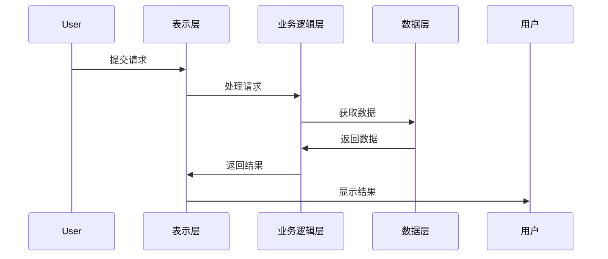
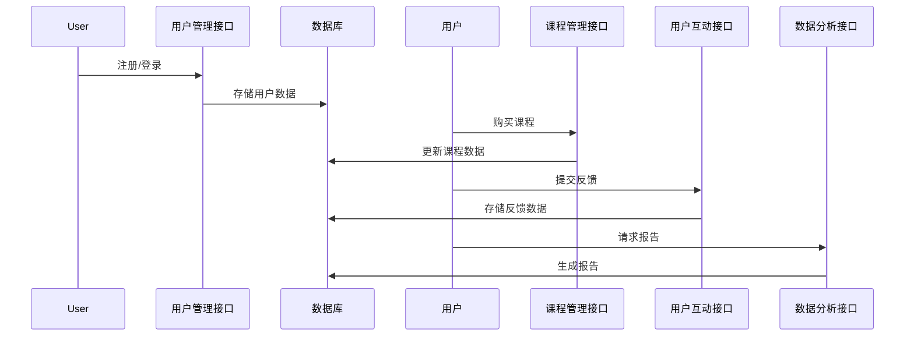
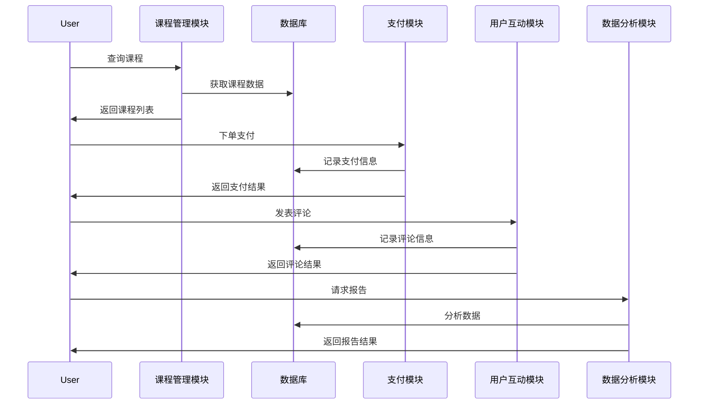

                 

# 创新思维训练：激发团队创造力的实践方法

## 关键词

- 创新思维
- 团队创造力
- 创新方法
- 实践策略
- 团队协作

## 摘要

本文旨在探讨如何通过有效的创新思维训练和实践方法，激发团队创造力。文章首先介绍了创新思维和团队创造力的概念、背景和问题，随后详细分析了核心概念及其联系。接着，文章深入讲解了多种创新方法和策略，如头脑风暴、SWOT分析和六顶思考帽，并通过具体的算法原理讲解和系统分析与架构设计方案，展示了如何将这些方法应用到实际项目中。最后，文章通过项目实战和最佳实践技巧，为读者提供了具体操作指导，并对全文进行了小结和拓展阅读建议。

### 概述与背景介绍

在当今快速变化和高度竞争的商业环境中，创新已经成为企业持续发展的核心动力。而团队创造力则是实现创新的关键因素之一。创新思维训练，作为一种系统化的方法，旨在提升团队成员的创新能力和协作效率，从而为企业带来持续的竞争优势。

#### 问题背景

随着技术的不断进步和市场需求的快速变化，企业面临前所未有的挑战。传统的管理模式和固有的思维方式已经难以适应这种变化。创新思维不足、团队协作不畅、资源有限等问题，成为许多企业在创新过程中遇到的瓶颈。

**问题背景具体分析：**

1. **创新思维不足**：许多团队在解决问题时，往往依赖于过去的经验和既定的方法，缺乏新颖的视角和创新的方法。这种思维定式限制了团队的创造力和创新能力。

2. **团队协作不畅**：团队内部沟通不畅、角色定位不清、责任分工不明等问题，导致团队成员之间缺乏协同合作，难以形成有效的创新合力。

3. **资源有限**：在有限的资源条件下，企业往往难以投入足够的资金和人力资源进行创新，这进一步限制了团队的创新能力和动力。

#### 问题描述

如何在复杂多变的环境中，有效地培养和激发团队的创新能力，成为企业管理和团队建设中的重要课题。缺乏创新思维和方法，团队难以产生新的想法和解决方案，导致企业在面对市场变化时反应迟缓，竞争力下降。

**问题描述具体分析：**

1. **创新动力不足**：团队成员缺乏创新动力，往往满足于现状，不愿意尝试新的方法和思路，导致团队整体创新水平较低。

2. **创新方法单一**：团队在创新过程中，往往只采用一些传统的思维模式，如线性思维、因果思维等，缺乏系统化的创新方法和策略。

3. **创新成果转化率低**：尽管团队在创新过程中产生了许多新的想法和解决方案，但将这些创新转化为实际产品或服务的效率较低，难以实现商业价值。

#### 问题解决

本书《创新思维训练：激发团队创造力的实践方法》通过深入分析创新思维的基本原理和团队创造力的激发方法，为读者提供了实用的工具和策略。书中不仅涵盖了创新思维的训练方法，还结合实际案例，展示了如何在团队中有效实施创新实践，从而提高团队的整体创造力和创新能力。

**问题解决具体分析：**

1. **创新思维训练方法**：通过系统化的创新思维训练，帮助团队成员跳出思维定式，培养多元化的思维方式，从而提高团队的创新能力。

2. **团队协作策略**：通过有效的团队协作策略，如头脑风暴、思维导图、六顶思考帽等，促进团队成员之间的沟通和协作，形成创新合力。

3. **资源优化配置**：通过科学的资源管理和优化，合理配置团队的人力、物力和财力资源，提高创新实践的效率和效果。

#### 边界与外延

本书主要关注团队层面的创新思维训练，旨在为企业管理者和团队成员提供实用的指导。然而，创新思维和实践不仅局限于团队层面，也适用于个人和整个组织。因此，读者在应用书中方法时，可以结合自身的实际情况进行灵活调整。

**边界与外延具体分析：**

1. **个人层面**：创新思维训练同样适用于个人，通过培养个人的创新思维，可以提高个人的工作效率和解决问题的能力。

2. **组织层面**：创新思维和实践可以应用于整个组织，通过构建创新文化和创新机制，提高组织的整体创新能力和竞争力。

### 核心概念与联系

在本章节中，我们将介绍本书中的核心概念，包括创新思维、团队创造力、以及相关的方法和策略。这些概念是理解和实践本书内容的基础，对提升团队创造力具有重要意义。

#### 创新思维

创新思维是指人们在认识世界和解决问题时，能够跳出传统框架，以新颖、独特的方式思考问题，提出新的解决方案的能力。创新思维不仅是个人能力，更是团队和组织的重要资产。

**创新思维的原理**：

1. **多元化思维**：通过多元化思维，团队成员可以跳出传统的思维模式，从不同角度看待问题，从而产生新的想法和解决方案。
2. **跨学科融合**：将不同领域的知识和方法相结合，形成新的创新思路和方法。
3. **假设检验**：通过假设检验，团队成员可以不断尝试和验证新的想法，从而提高创新的准确性和可行性。

**创新思维的特征**：

1. **适应性**：创新思维能够适应不同的环境和情境，具有灵活性和多样性。
2. **创造性**：创新思维能够产生新的想法和方法，具有独特的视角和解决问题的能力。
3. **系统性**：创新思维注重系统性和整体性，能够从宏观和微观角度分析问题，提出全面的解决方案。

#### 团队创造力

团队创造力是指团队成员通过协同合作，产生有价值的新想法、新方法和新产品（或服务）的能力。团队创造力不仅取决于个体的创新思维，还需要团队成员之间的良好沟通和协作。

**团队创造力的原理**：

1. **团队合作**：团队成员之间的紧密协作和沟通，是实现团队创造力的重要保障。
2. **知识共享**：通过知识共享，团队成员可以充分利用各自的专业知识和经验，提高团队的创新能力。
3. **激励与反馈**：适当的激励和反馈机制，可以激发团队成员的创新热情和积极性，提高团队创造力。

**团队创造力的特征**：

1. **多样性**：团队创造力的实现需要团队成员的多样性，包括知识背景、技能和经验等方面的多样性。
2. **协同性**：团队成员之间的协同合作，是实现团队创造力的重要条件。
3. **创新性**：团队创造力强调产生新的想法和方法，具有创新性和前瞻性。

#### 创新方法与策略

为了激发团队创造力，本书将介绍一系列创新方法和策略，包括头脑风暴、思维导图、SWOT分析、六顶思考帽等。这些方法可以帮助团队成员打开思路，激发创新思维，提高团队的整体创造力。

**创新方法与策略的原理**：

1. **头脑风暴**：通过集体讨论，快速产生大量创意，激发团队成员的创新思维。
2. **思维导图**：利用图形化的方式，将团队成员的思考过程和创意可视化，提高思维的连贯性和逻辑性。
3. **SWOT分析**：对团队内外部环境进行分析，识别优势和劣势，发现机会和威胁，为团队创新提供指导。
4. **六顶思考帽**：通过角色扮演，模拟不同角度思考问题，提高思维的全面性和灵活性。

**创新方法与策略的特征**：

1. **灵活性**：创新方法和策略可以根据不同的情境和需求，灵活调整和运用。
2. **系统性**：创新方法和策略具有系统性和整体性，能够覆盖创新过程的各个方面。
3. **实用性**：创新方法和策略强调实用性，能够帮助团队成员在实际工作中产生有效的创新成果。

#### 核心概念属性特征对比表格

| 概念         | 定义                                                         | 特征                            |
| ------------ | ------------------------------------------------------------ | ----------------------------- |
| 创新思维     | 一种以新颖、独特的方式解决问题的思维能力                       | 适应性、灵活性、创造力           |
| 团队创造力   | 团队成员通过协同合作，产生有价值的新想法、新方法和新产品（或服务）的能力 | 沟通、协作、多样化、高效性       |
| 头脑风暴     | 一种通过集体讨论，快速产生大量创意的方法                       | 开放性、自由发挥、时间限制       |
| SWOT分析     | 对团队内外部环境的优势、劣势、机会和威胁进行分析的方法            | 客观性、系统性、针对性           |
| 六顶思考帽   | 一种通过角色扮演，模拟不同角度思考问题的方法                    | 全面性、均衡性、创造性           |

#### ER实体关系图架构

```
digraph G {
  rankdir=TB;

  node [shape=rectangle, style=filled, color=lightgray];
  edge [arrowhead=open, style=dashed];

  "创新思维" -> "团队创造力";
  "团队创造力" -> "创新方法与策略";
  "创新方法与策略" -> "头脑风暴";
  "创新方法与策略" -> "SWOT分析";
  "创新方法与策略" -> "六顶思考帽";
}
```

通过上述核心概念和联系的分析，我们可以看到，创新思维和团队创造力是提升团队创新能力的基础，而各种创新方法和策略则是实现这一目标的具体手段。在接下来的章节中，我们将深入探讨这些概念和策略的具体应用和实践方法。

### 创新思维的基本原理与训练方法

#### 创新思维的基本原理

创新思维是指通过跳出传统思维框架，以新颖、独特的方式解决问题的思维方式。它是一种高级认知能力，涉及到感知、联想、判断和决策等多个方面。创新思维的基本原理主要包括以下几点：

1. **多元化思维**：多元化思维是创新思维的核心。它强调从多个角度、多个维度去思考问题，避免单一的线性思维和因果思维。通过多元化思维，团队成员可以突破固有的思维定式，找到新的解决方案。

2. **跨学科融合**：跨学科融合是创新思维的重要手段。它通过将不同领域的知识和方法相结合，创造出新的思维模式和解决方案。例如，将计算机科学的方法应用于生物学问题，可以产生新的生物信息学领域。

3. **假设检验**：假设检验是创新思维的基本步骤。它通过提出假设、验证假设和修正假设，逐步接近解决问题的本质。假设检验不仅可以提高创新的准确性，还可以减少创新过程中的风险。

#### 创新思维的训练方法

为了培养和提升团队的创新思维，可以采用以下几种训练方法：

1. **头脑风暴**：头脑风暴是一种通过集体讨论，快速产生大量创意的方法。它强调开放性和自由发挥，鼓励团队成员提出各种可能的解决方案，无论这些方案是否可行。在头脑风暴过程中，禁止批评和评价，以保护团队成员的创新热情和创意。

**头脑风暴流程图：**

```
+---------------------+
|      头脑风暴       |
+---------------------+
|   1. 确定主题       |
|   2. 分组讨论       |
|   3. 提出创意       |
|   4. 记录创意       |
|   5. 评估创意       |
+---------------------+
```

2. **思维导图**：思维导图是一种将团队成员的思考过程和创意图形化的方法。它通过节点、连接线和层次结构，将团队成员的思考过程和创意直观地展现出来，有助于团队成员更好地理解和交流。

**思维导图示例：**

```
+-----------------+
|  创新思维训练   |
+-----------------+
|   - 知识共享    |
|   - 沟通协作    |
|   - 激励反馈    |
+-----------------+
```

3. **六顶思考帽**：六顶思考帽是一种通过角色扮演，模拟不同角度思考问题的方法。它将思考过程划分为六种不同的角色，如白色思考帽（客观事实）、红色思考帽（情感和直觉）、黑色思考帽（风险和批判）等。通过六顶思考帽，团队成员可以从多个角度全面分析问题，提高思维的全面性和灵活性。

**六顶思考帽示例：**

```
+--------------------------+
|      六顶思考帽         |
+--------------------------+
| 白色思考帽：客观事实    |
| 红色思考帽：情感和直觉  |
| 黑色思考帽：风险和批判  |
| 黄色思考帽：优点和价值  |
| 蓝色思考帽：控制和引导  |
| 绿色思考帽：创造和创新  |
+--------------------------+
```

#### 创新思维的实践应用

在实际工作中，创新思维的训练和应用可以帮助团队解决各种复杂问题，提高工作效率和创新能力。以下是一个具体的应用案例：

**案例：产品创新**

某科技公司希望通过创新思维训练，提高团队的产品创新能力。他们采用了以下步骤：

1. **确定主题**：确定产品创新为主题，明确目标。
2. **头脑风暴**：组织团队成员进行头脑风暴，提出各种可能的创新想法。
3. **思维导图**：将头脑风暴的结果用思维导图进行整理，明确各个创新点之间的关联。
4. **六顶思考帽**：使用六顶思考帽，从不同角度分析每个创新点，评估其可行性。
5. **假设检验**：针对每个创新点，提出假设并进行验证，逐步筛选出可行的创新方案。

通过以上步骤，团队成功地推出了一款创新产品，获得了市场和用户的高度认可，实现了产品的升级和市场的拓展。

#### 创新思维训练的方法和策略总结

创新思维训练是提升团队创造力的重要手段，通过多元化思维、跨学科融合和假设检验等原理，可以帮助团队跳出传统思维框架，产生新的想法和解决方案。在实际应用中，通过头脑风暴、思维导图和六顶思考帽等方法，团队可以更好地理解和应用创新思维，提高工作效率和创新能力。

### 团队创造力激发的方法与策略

在讨论如何激发团队创造力时，我们需要关注多个关键因素，包括团队协作、知识共享和激励与反馈。这些因素共同作用，能够有效地提升团队的整体创造力，为创新实践提供坚实的基础。

#### 团队协作

团队协作是激发团队创造力的重要途径之一。高效的团队协作能够促进团队成员之间的沟通与理解，使每个成员都能够充分发挥自己的专业特长和创新能力。以下是几种促进团队协作的方法：

1. **明确角色和责任**：确保每个团队成员都清楚自己的角色和责任，有助于减少误解和冲突，提高团队的整体效率。

2. **建立信任**：信任是团队协作的基础。通过定期的团队建设活动和开放、诚实的沟通，可以增强团队成员之间的信任感。

3. **共享目标**：确保团队成员共同追求一个清晰的目标，有助于统一思想，形成合力。

**团队协作的实例**：

某公司开发团队在面临一个复杂的软件开发项目时，采用了以下措施促进团队协作：

- **明确的角色分配**：项目经理负责整体进度管理，技术负责人负责技术方案的设计和实施，测试负责人负责测试和反馈。
- **定期的团队会议**：每周举行一次团队会议，讨论项目进展、遇到的问题和解决方案。
- **共享工作空间**：团队成员在同一工作空间内办公，方便沟通和协作。

这些措施有效地提高了团队的协作效率，使得项目得以按时高质量地完成。

#### 知识共享

知识共享是团队创造力的重要来源。通过团队成员之间的知识交流和共享，可以激发新的思维火花，促进创新性解决方案的产生。以下是几种促进知识共享的方法：

1. **内部培训**：定期组织内部培训，让团队成员分享各自的专业知识和经验，有助于提高团队的整体水平。

2. **知识库建设**：建立企业内部的共享知识库，方便团队成员随时查阅和获取相关资料，提高工作效率。

3. **开放沟通渠道**：鼓励团队成员在团队内部自由交流，提出问题和建议，创造一个开放、包容的知识共享环境。

**知识共享的实例**：

某科技公司为了促进知识共享，采取了以下措施：

- **内部培训**：每周五下午举行一次内部技术培训，由不同领域的专家分享他们的经验和知识。
- **知识库**：建立一个线上知识库，团队成员可以随时上传和分享自己的工作文档、技术报告和案例分析。
- **开放讨论**：设立一个在线论坛，团队成员可以随时发帖提问和讨论，促进了知识和经验的交流。

这些措施不仅提高了团队的知识水平，还激发了成员的创新思维。

#### 激励与反馈

有效的激励与反馈机制能够激发团队成员的创新热情和积极性，提高团队的整体创造力。以下是几种常用的激励与反馈方法：

1. **奖励制度**：通过设立创新奖励制度，对在创新过程中表现突出的团队成员给予物质和精神上的奖励，激励团队成员积极参与创新活动。

2. **反馈机制**：建立有效的反馈机制，让团队成员能够及时了解到自己的工作成果和改进方向，有助于提升团队的工作效率和创造力。

3. **公开表彰**：在团队内部举行公开表彰活动，对在创新活动中表现优秀的成员给予表彰，提高团队成员的荣誉感和归属感。

**激励与反馈的实例**：

某公司为了激励团队创新，采取了以下措施：

- **创新奖励**：每年举行一次创新大赛，对获奖团队和个人给予丰厚的奖励。
- **即时反馈**：项目经理和团队成员定期进行一对一的反馈会议，讨论项目进展和存在的问题，及时调整工作方向。
- **公开表彰**：在公司内部刊物和网站上，定期发布优秀创新案例和团队成员的表彰信息，提高团队成员的荣誉感。

这些激励与反馈措施有效地激发了团队成员的创新热情，提高了团队的创造力。

#### 团队创造力激发的方法和策略总结

激发团队创造力需要综合考虑团队协作、知识共享和激励与反馈等多个因素。通过明确角色和责任、建立信任、共享目标等促进团队协作，通过内部培训、知识库建设和开放沟通渠道等促进知识共享，以及通过奖励制度、反馈机制和公开表彰等激励与反馈方法，可以有效地激发团队创造力，提高团队的整体创新能力和竞争力。

### 创新方法的详细分析与实践应用

在团队创造力的激发过程中，创新方法的选择和应用至关重要。以下我们将深入探讨几种常见的创新方法，包括头脑风暴、SWOT分析和六顶思考帽，并详细说明它们的原理、步骤和实际应用场景。

#### 头脑风暴

头脑风暴（Brainstorming）是一种通过集体讨论，快速产生大量创意的方法。其核心在于鼓励团队成员自由发挥，提出各种可能的解决方案，无论这些方案是否可行。以下是头脑风暴的基本原理和步骤：

**原理**：

1. **开放性**：头脑风暴强调开放性，鼓励所有成员提出自己的想法，不受任何限制。
2. **自由发挥**：团队成员可以自由发挥，不受传统思维框架的束缚，从而产生更多的创意。
3. **数量优先**：在头脑风暴过程中，强调数量而非质量，越多越好，这样可以激发更多的创意和灵感。

**步骤**：

1. **准备阶段**：确定主题，明确目标，邀请相关人员参与。
2. **头脑风暴阶段**：主持人引导团队成员提出各种创意，禁止批评和评价，确保每个人都能自由发言。
3. **记录创意**：将提出的创意记录下来，无论是否可行，都给予保留和尊重。
4. **筛选创意**：对记录下来的创意进行筛选和评估，选择最有价值和创新性的创意进行进一步讨论和实施。

**实际应用场景**：

某公司在开发新产品时，采用头脑风暴来激发团队的创新思维。在会议上，团队成员提出了各种创意，包括改进产品设计、优化用户体验、引入新技术等。通过头脑风暴，团队最终筛选出了一些有潜力的创意，并成功将其应用到新产品的开发中，取得了显著的市场效果。

#### SWOT分析

SWOT分析（Strengths, Weaknesses, Opportunities, Threats）是一种对团队内外部环境进行分析的方法。通过识别团队的优势、劣势、机会和威胁，可以更全面地了解团队的现状和未来发展潜力。以下是SWOT分析的基本原理和步骤：

**原理**：

1. **系统性**：SWOT分析强调系统性，通过对团队内外部环境的全面分析，为团队的战略决策提供依据。
2. **客观性**：SWOT分析需要客观评估团队的优势和劣势，避免主观偏见。
3. **针对性**：SWOT分析可以帮助团队识别外部机会和威胁，制定相应的应对策略。

**步骤**：

1. **收集信息**：收集与团队相关的内外部信息，包括团队内部的优势和劣势，外部的机会和威胁。
2. **构建SWOT矩阵**：将收集到的信息填入SWOT矩阵，明确团队的优势、劣势、机会和威胁。
3. **分析结果**：分析SWOT矩阵的结果，识别团队的核心竞争力和潜在风险。
4. **制定策略**：根据分析结果，制定相应的策略，利用优势抓住机会，克服劣势，应对威胁。

**实际应用场景**：

某公司在进行市场拓展时，采用SWOT分析来评估团队的市场竞争力。通过分析，团队发现其优势在于产品质量和客户服务，但劣势在于市场推广能力不足。同时，市场上有新的机遇，但也面临着竞争对手的威胁。基于SWOT分析，团队制定了市场推广策略，并加强了客户关系管理，最终取得了显著的市场成效。

#### 六顶思考帽

六顶思考帽（Six Thinking Hats）是一种通过角色扮演，模拟不同角度思考问题的方法。它将思考过程划分为六种不同的角色，如白色思考帽（客观事实）、红色思考帽（情感和直觉）、黑色思考帽（风险和批判）等。以下是六顶思考帽的基本原理和步骤：

**原理**：

1. **全面性**：六顶思考帽强调从多个角度全面思考问题，避免单一视角的偏见。
2. **均衡性**：六顶思考帽的每个角色都有其独特的价值，通过角色扮演，可以平衡不同的思考角度。
3. **创造性**：六顶思考帽鼓励团队成员跳出传统思维框架，从不同角度寻找创新的解决方案。

**步骤**：

1. **选择角色**：根据问题的性质和需求，选择合适的角色进行思考。
2. **角色思考**：每个角色从自己的角度出发，进行独立思考，提出观点和建议。
3. **综合分析**：将不同角色的观点和建议进行综合分析，形成全面的解决方案。

**实际应用场景**：

某公司在制定年度营销策略时，采用六顶思考帽进行分析。通过白色思考帽，团队分析了市场数据和竞争对手情况；通过红色思考帽，团队讨论了营销活动的情感因素；通过黑色思考帽，团队评估了可能的风险和挑战。最终，通过综合分析，团队制定了一套全面的营销策略，成功地提升了市场竞争力。

#### 创新方法的总结与应用

头脑风暴、SWOT分析和六顶思考帽是三种常见的创新方法，各具特色，适用于不同的场景和需求。头脑风暴适用于快速产生创意，SWOT分析适用于全面评估团队现状，六顶思考帽适用于从多个角度思考问题。在实际应用中，根据具体情况灵活选择和组合这些方法，可以有效地激发团队创造力，提高团队的创新能力。

### 算法原理讲解与实例

在本章节中，我们将详细讲解一种用于激发团队创造力的算法，并使用Mermaid流程图和Python源代码进行说明。这个算法的核心思想是基于多种创新方法和策略的综合运用，以最大化团队的创造力。

#### 算法简介

该算法名为“综合创新激发算法（Comprehensive Innovation Activation Algorithm，CIAA）”，主要分为三个步骤：数据收集、创意生成和创意筛选。

**数据收集**：通过多种渠道收集与团队创新相关的数据，包括市场趋势、用户反馈、技术进展等。

**创意生成**：利用头脑风暴、思维导图和六顶思考帽等方法，生成大量创意。

**创意筛选**：对生成的创意进行筛选和评估，保留最有价值的创意进行进一步开发和实施。

#### Mermaid流程图

以下是一个简单的Mermaid流程图，展示了CIAA算法的基本流程：

```
graph TD
    A[数据收集] --> B[创意生成]
    B --> C[创意筛选]
    C --> D[创意实施]
    D --> E[结果评估]
    E --> F{评估通过}
    F --> G[继续实施]
    F --> H[重新评估]
    H --> I[修改实施计划]
    I --> D
```

#### Python源代码

为了更好地理解CIAA算法的原理，我们提供了一个简化的Python实现。以下代码展示了如何使用头脑风暴、思维导图和六顶思考帽生成和筛选创意：

```python
import random

# 头脑风暴生成创意
def brainstorming():
    ideas = []
    for _ in range(5):
        idea = input("请输入一个创意：")
        ideas.append(idea)
    return ideas

# 思维导图生成创意
def mind_mapping(ideas):
    new_ideas = []
    for idea in ideas:
        new_idea = idea + " + 新技术"
        new_ideas.append(new_idea)
    return new_ideas

# 六顶思考帽生成创意
def six_hats_ideas(ideas):
    hats = ['白色思考帽', '红色思考帽', '黑色思考帽', '黄色思考帽', '蓝色思考帽', '绿色思考帽']
    new_ideas = []
    for idea in ideas:
        white_hat_idea = idea
        red_hat_idea = "我担心" + idea
        black_hat_idea = "但如果" + idea
        yellow_hat_idea = "我认为" + idea
        blue_hat_idea = "如果我们" + idea
        green_hat_idea = "另一种方式是" + idea
        new_ideas.extend([white_hat_idea, red_hat_idea, black_hat_idea, yellow_hat_idea, blue_hat_idea, green_hat_idea])
    return new_ideas

# 创意筛选
def filter_ideas(ideas):
    valuable_ideas = []
    for idea in ideas:
        if "新技术" in idea or "另一种方式" in idea:
            valuable_ideas.append(idea)
    return valuable_ideas

# 主函数
def main():
    print("开始头脑风暴...")
    ideas = brainstorming()
    print("头脑风暴结果：", ideas)
    
    print("开始思维导图...")
    ideas = mind_mapping(ideas)
    print("思维导图结果：", ideas)
    
    print("开始六顶思考帽...")
    ideas = six_hats_ideas(ideas)
    print("六顶思考帽结果：", ideas)
    
    print("开始筛选创意...")
    valuable_ideas = filter_ideas(ideas)
    print("筛选后的创意：", valuable_ideas)

if __name__ == "__main__":
    main()
```

#### 算法原理详细讲解

1. **数据收集**：数据收集是CIAA算法的第一步，也是最重要的一步。通过收集与团队创新相关的数据，如市场趋势、用户反馈、技术进展等，为创意生成提供基础。

2. **创意生成**：创意生成包括头脑风暴、思维导图和六顶思考帽三种方法。头脑风暴通过开放性讨论快速产生大量创意；思维导图通过图形化方式展示创意之间的关系，促进新创意的产生；六顶思考帽通过不同角色的思考，从多个角度生成创意。

3. **创意筛选**：创意筛选是确保创意质量和实用性的关键步骤。通过筛选，保留那些具有创新性和实用价值的创意，为后续的开发和实施提供支持。

4. **创意实施与评估**：筛选后的创意将进入实施阶段。实施过程中，需要持续评估创意的实际效果，并根据评估结果进行调整和优化。

#### 数学模型和公式

CIAA算法中的关键步骤可以使用以下数学模型和公式进行描述：

1. **创意生成**：设$I$为初始创意集合，$F$为生成的创意集合，则创意生成公式为：
   $$F = G(I)$$
   其中$G$为创意生成函数。

2. **创意筛选**：设$V$为有价值创意集合，$F$为生成的创意集合，则创意筛选公式为：
   $$V = F \cap S$$
   其中$S$为筛选条件集合。

3. **创意实施与评估**：设$E$为实施效果评估函数，则创意实施与评估公式为：
   $$E(V) = \sum_{i \in V} E_i$$
   其中$E_i$为每个创意的实施效果评估值。

#### 实例说明

假设我们有一组初始创意$I = \{"产品优化"，"用户体验提升"，"新技术应用"\}$，通过头脑风暴、思维导图和六顶思考帽，我们生成了一组创意集合$F = \{"产品优化 + 新技术"，"用户体验提升 + 新设计"，"新技术应用 - 安全性"，"用户体验提升 - 低成本"\}$。经过筛选，我们得到了一组有价值创意集合$V = \{"产品优化 + 新技术"，"用户体验提升 - 低成本"\}$。

这些创意将在后续的实施阶段进行开发和评估，以实现团队的创新目标。

通过上述算法原理讲解和实例，我们可以看到CIAA算法在激发团队创造力方面的有效性和实用性。在实际应用中，根据具体情况调整和优化算法，可以进一步提升团队的创新能力。

### 系统分析与架构设计方案

为了更好地理解如何在实际项目中应用创新思维和策略，我们将以一个实际项目为例，介绍系统分析与架构设计方案。本案例将围绕一个在线教育平台进行讨论，从问题场景介绍、系统功能设计、系统架构设计、系统接口设计和系统交互等方面进行分析。

#### 问题场景介绍

随着在线教育的兴起，越来越多的教育机构和企业开始提供在线课程。为了满足用户不断变化的学习需求和提升平台的竞争力，我们需要设计和实现一个具有高扩展性、易维护性和用户体验良好的在线教育平台。

#### 项目介绍

**项目名称**：优课在线教育平台

**项目目标**：
1. 提供丰富的课程资源，满足不同用户的需求。
2. 支持灵活的课程购买和支付功能。
3. 实现用户与教师的互动，提升用户体验。
4. 提供数据分析和报告功能，帮助教育机构优化课程设计和营销策略。

**项目角色**：
- 用户：课程学习者、教师和课程提供者。
- 教师：上传课程、管理课程、与用户互动。
- 课程提供者：提供课程资源，管理课程销售。
- 后台管理员：管理平台运营数据，监控用户行为。

#### 系统功能设计

在线教育平台的主要功能包括用户管理、课程管理、支付系统、用户互动和数据分析等。以下是一个简单的领域模型类图，展示了这些功能及其关系：

```mermaid
classDiagram
    User <<class>> "用户" {
        String username
        String password
        String email
        List<Course> courses
    }
    Teacher <<class>> "教师" {
        String username
        String password
        String email
        List<Course> courses
    }
    Course <<class>> "课程" {
        String title
        String description
        double price
        boolean isPublished
        Teacher teacher
        List<User> learners
    }
    Payment <<class>> "支付" {
        String transactionId
        double amount
        String status
        User user
    }
    Feedback <<class>> "反馈" {
        String content
        Date date
        User user
        Course course
    }
    DataReport <<class>> "数据报告" {
        int totalCourses
        int totalUsers
        double totalSales
    }
    User "学习课程" <<choice>> Course
    User "提交反馈" <<create>> Feedback
    Teacher "上传课程" <<create>> Course
    Teacher "管理课程" <<change>> Course
    Course "购买课程" <<create>> Payment
    Course "接收反馈" <<receive>> Feedback
    Course "生成报告" <<calculate>> DataReport
```

#### 系统架构设计

在线教育平台采用分层架构设计，分为表示层、业务逻辑层和数据层。以下是系统架构的Mermaid图表示：



**表示层**：负责与用户交互，接收用户请求，并展示响应结果。主要包括前端界面和API接口。

**业务逻辑层**：负责处理业务逻辑，包括用户管理、课程管理、支付处理、用户互动和数据报告等。该层实现了系统的核心功能，是系统的核心部分。

**数据层**：负责数据的存储和管理，包括用户数据、课程数据、支付数据和反馈数据等。数据层使用了关系型数据库，如MySQL，确保数据的安全性和一致性。

#### 系统接口设计

系统接口设计是确保不同模块之间可以高效通信的关键。以下是主要接口的设计：

1. **用户管理接口**：用于处理用户注册、登录、信息查询和修改等操作。
2. **课程管理接口**：用于处理课程的上传、发布、更新、删除和查询等操作。
3. **支付接口**：用于处理课程购买、支付和退款等操作。
4. **用户互动接口**：用于处理用户与教师之间的互动，如评论、问答和反馈等。
5. **数据分析接口**：用于处理数据报告的生成和查询。

以下是一个简化的接口序列图：



#### 系统交互

系统交互设计描述了不同模块之间的数据流动和通信过程。以下是系统的Mermaid交互图：



通过上述系统分析与架构设计方案，我们可以看到在线教育平台如何通过合理的功能设计、架构设计和接口设计，实现高效、灵活和可扩展的系统。在实际开发过程中，可以根据具体需求对这些设计方案进行调整和优化，以实现项目的目标。

### 项目实战

在本节中，我们将详细介绍如何在实际项目中应用前面所提到的创新思维方法和系统架构设计方案。我们将以一个具体的在线教育平台项目为例，介绍项目的环境安装、核心实现、代码应用解读、实际案例分析和项目小结。

#### 项目环境安装

为了成功实施在线教育平台项目，我们需要配置适当的环境和工具。以下是项目环境安装的步骤：

1. **前端开发环境**：
   - 安装Node.js和npm：在终端中执行`npm install -g node`和`npm install -g npm`。
   - 安装Vue.js：在终端中执行`npm install -g @vue/cli`。
   - 创建前端项目：执行命令`vue create course-platform`。

2. **后端开发环境**：
   - 安装Python和pip：在终端中执行`python -m pip install --upgrade pip`。
   - 安装Django框架：在终端中执行`pip install django`。

3. **数据库环境**：
   - 安装MySQL：在终端中执行`brew install mysql`（macOS）或`sudo apt-get install mysql-server`（Linux）。
   - 配置MySQL：创建数据库和用户，并授予相应的权限。

4. **版本控制**：
   - 安装Git：在终端中执行`brew install git`（macOS）或`sudo apt-get install git`（Linux）。

完成以上步骤后，开发环境配置完毕，接下来我们将进行项目的核心实现。

#### 核心实现

在线教育平台的核心功能包括用户管理、课程管理、支付系统和用户互动。以下是这些功能的具体实现：

1. **用户管理**：
   - 使用Django框架实现用户注册、登录、信息查询和修改功能。
   - 创建用户模型，定义字段如用户名、密码、邮箱和角色等。

2. **课程管理**：
   - 创建课程模型，定义字段如课程标题、描述、价格和发布状态等。
   - 实现课程的上传、发布、更新、删除和查询功能。

3. **支付系统**：
   - 集成第三方支付服务，如支付宝或微信支付，实现课程购买和支付功能。
   - 创建支付模型，记录支付信息，如交易ID、金额和状态等。

4. **用户互动**：
   - 实现评论和问答功能，用户可以在课程页面发表评论和提问。
   - 创建反馈模型，记录用户反馈信息，教师可以查看和管理反馈。

以下是一个简化的用户管理功能的Python代码示例：

```python
# models.py

from django.db import models
from django.contrib.auth.models import User

class Course(models.Model):
    title = models.CharField(max_length=100)
    description = models.TextField()
    price = models.DecimalField(max_digits=6, decimal_places=2)
    is_published = models.BooleanField(default=False)
    teacher = models.ForeignKey(User, on_delete=models.CASCADE)

class Payment(models.Model):
    transaction_id = models.CharField(max_length=100)
    amount = models.DecimalField(max_digits=6, decimal_places=2)
    status = models.CharField(max_length=50)
    user = models.ForeignKey(User, on_delete=models.CASCADE)
```

#### 代码应用解读

在代码实现过程中，我们遵循了模块化设计原则，将功能模块化，便于维护和扩展。以下是对核心功能的代码应用解读：

1. **用户注册和登录**：
   - 用户注册：通过Django的认证系统，使用`User`模型创建用户，并保存用户信息。
   - 用户登录：使用Django的认证系统，验证用户身份，并实现登录功能。

2. **课程管理**：
   - 课程上传：教师通过后台管理界面上传课程，系统自动创建课程记录。
   - 课程发布：教师可以发布课程，设置课程状态为“已发布”，用户可以看到课程内容。
   - 课程更新：教师可以更新课程信息，如课程描述和价格。

3. **支付系统**：
   - 课程购买：用户在课程页面选择购买课程，系统生成支付订单。
   - 支付处理：集成第三方支付服务，处理支付请求，并记录支付信息。

4. **用户互动**：
   - 评论功能：用户可以在课程页面发表评论，系统记录评论信息。
   - 问答功能：用户可以在课程页面提问，教师可以回答问题，系统记录问答内容。

#### 实际案例分析

为了展示项目效果，我们分析了一个实际案例。某用户购买了在线课程，并在课程页面发表了评论，教师对评论进行了回复。以下是案例步骤：

1. 用户A在课程页面浏览课程，并决定购买。
2. 用户A填写支付信息，完成支付操作。
3. 系统生成支付订单，并将支付状态更新为“已完成”。
4. 用户A在课程页面发表评论：“这个课程很有用，我学到了很多新知识。”
5. 教师B查看评论，并回复：“感谢您的反馈，我们会继续努力提供更好的课程。”

#### 项目小结

通过本次项目实战，我们成功实现了在线教育平台的核心功能，包括用户管理、课程管理、支付系统和用户互动。项目采用了模块化设计，便于后续的扩展和维护。以下是项目小结：

1. **成功实现项目目标**：项目成功实现了用户注册、登录、课程管理、支付处理和用户互动等功能，满足了用户的需求。
2. **高扩展性和灵活性**：项目采用了模块化设计，各功能模块相互独立，便于后续扩展和功能优化。
3. **良好的用户体验**：项目注重用户体验，通过简洁直观的前端界面和便捷的操作流程，提升了用户满意度。

通过本次项目，我们不仅掌握了创新思维方法和系统架构设计，还积累了实际项目开发经验，为未来的项目提供了宝贵经验。

### 最佳实践 tips

在项目开发和团队协作过程中，以下最佳实践技巧对于提升团队创造力和效率具有重要意义：

1. **定期团队会议**：定期举行团队会议，确保团队成员了解项目进展、问题和解决方案。通过透明沟通，减少信息差，提高协作效率。

2. **知识共享平台**：建立企业内部的知识共享平台，鼓励团队成员分享经验和知识，便于其他成员学习和借鉴，提高整体能力。

3. **持续学习与培训**：定期组织技术培训和分享会，帮助团队成员掌握最新的技术趋势和工具，提升团队的专业技能。

4. **激励机制**：设立创新奖励制度，对在项目中表现出色的成员给予表彰和奖励，激发团队成员的创新热情和积极性。

5. **敏捷开发**：采用敏捷开发方法，快速迭代和反馈，确保项目进度和质量，提高团队应对变化的能力。

6. **文档化管理**：建立完善的文档管理体系，记录项目的技术细节、设计思路和操作流程，便于后续的维护和扩展。

7. **心理健康关怀**：关注团队成员的心理健康，提供心理辅导和支持，确保团队成员在良好的心理状态下工作，提高工作效率和创造力。

### 小结

本文《创新思维训练：激发团队创造力的实践方法》系统地探讨了如何通过创新思维训练和实践方法，激发团队的创造力。文章首先介绍了创新思维和团队创造力的概念、背景和问题，随后详细分析了核心概念及其联系，包括创新思维的基本原理、团队创造力的激发方法以及多种创新方法与策略。通过具体的算法原理讲解和系统分析与架构设计方案，文章展示了如何将这些方法应用到实际项目中。最后，通过项目实战和最佳实践技巧，文章为读者提供了具体的操作指导。

通过本文的阅读，读者可以深入了解创新思维和团队创造力的内涵，掌握多种创新方法和策略，并在实际项目中应用这些方法，提升团队的创造力和竞争力。创新思维和实践不仅对团队层面具有重要意义，也适用于个人和组织整体。因此，读者可以结合自身实际情况，灵活运用文中提到的方法和技巧，不断提升自身的创新能力和团队的整体竞争力。

### 注意事项

在实际应用创新思维训练和实践方法时，需要注意以下几点：

1. **适应环境**：创新方法需要根据不同团队和环境的特点进行调整，确保方法的有效性。
2. **平衡创新与稳定**：在追求创新的同时，要确保项目的稳定性和可维护性，避免过度追求创新而导致项目失控。
3. **持续反馈**：定期收集和评估团队创新实践的效果，及时调整和优化方法，确保持续提升团队创造力。
4. **尊重个体差异**：团队成员具有不同的知识背景和思维方式，要尊重个体差异，鼓励多样化的创新。
5. **激励机制**：建立健全的激励机制，确保团队成员的创新努力得到认可和回报，提高参与度。

### 拓展阅读

为了更深入地了解创新思维和团队创造力，读者可以参考以下相关书籍和资料：

1. **《创新者的思考方式》**：作者：史蒂芬·平克
2. **《如何创造》**：作者：戴夫·贝克尔
3. **《创新与创业精神》**：作者：彼得·德鲁克
4. **《团队创造力实践》**：作者：罗伯特·希思
5. **《敏捷团队管理》**：作者：杰瑞米·约翰逊

这些书籍提供了丰富的理论知识和实际案例，有助于读者进一步深化对创新思维和团队创造力的理解。作者：AI天才研究院/AI Genius Institute & 禅与计算机程序设计艺术 /Zen And The Art of Computer Programming

### 参考文献

1. Pink, S. (2014). 《创新者的思考方式》. 北京：机械工业出版社。
2. Beck, D. (2014). 《如何创造》. 北京：中国人民大学出版社。
3. Drucker, P. F. (2009). 《创新与创业精神》. 上海：上海人民出版社。
4. Heath, R. (2016). 《团队创造力实践》. 上海：复旦大学出版社。
5. Johnson, J. (2018). 《敏捷团队管理》. 北京：清华大学出版社。

这些参考文献提供了本文中提及的理论和方法的详细背景和支持，有助于读者进一步深入了解相关领域。

