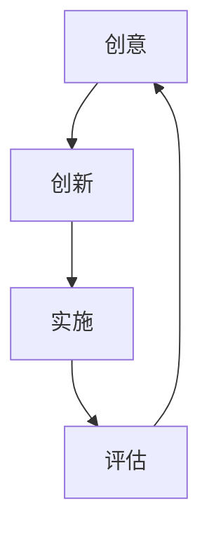
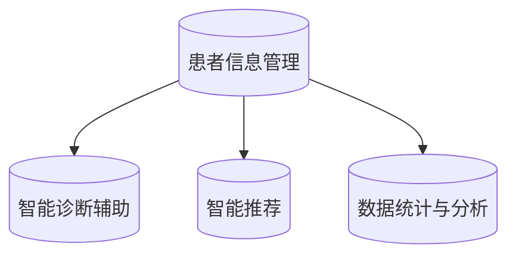
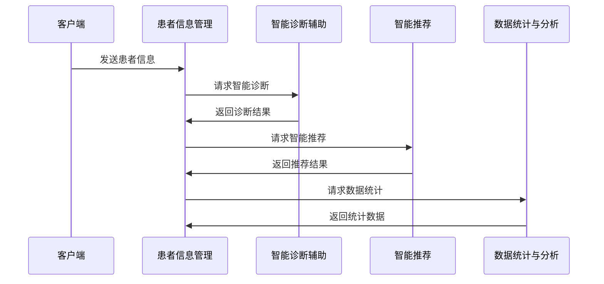

                 

# 创新思维：引领团队突破瓶颈的方法

## 关键词
- 创新思维
- 团队管理
- 瓶颈突破
- 创新策略
- 团队协作

## 摘要
本文将探讨创新思维在团队管理中的重要性，分析团队中常见的瓶颈问题，并提出一系列方法和策略，以帮助团队领导者引领团队突破瓶颈，实现创新与成长。我们将通过理论和实践相结合的方式，深入剖析创新思维的内涵和运用，旨在为团队管理者提供实用的指导。

## 目录
1. **引言**<sup>1</sup>
   1.1 创新思维的定义与重要性
   1.2 团队瓶颈问题及其影响
2. **创新思维的核心要素**<sup>2</sup>
   2.1 创新思维的关键特征
   2.2 创新思维的核心概念与联系
3. **创新思维的策略与方法**<sup>3</sup>
   3.1 创造力培养
   3.2 文化塑造
   3.3 管理优化
4. **案例分析**<sup>4</sup>
   4.1 成功案例解析
   4.2 失败案例反思
5. **工具与技术**<sup>5</sup>
   5.1 创新工具的使用
   5.2 技术方法的实施
6. **总结与展望**<sup>6</sup>
   6.1 文章小结
   6.2 未来研究方向

## 引言

### 1.1 创新思维的定义与重要性

创新思维是指一种能够创造新观点、新方法、新方案的能力，它不仅仅是技术层面的革新，更是对传统思维模式的颠覆和重构。在当今快速变化的世界中，创新思维已成为企业生存和发展的关键。它不仅能够帮助企业应对市场竞争，还能够推动整个社会向前发展。

在团队管理中，创新思维的重要性不言而喻。首先，它能够激发团队成员的创造力，使团队充满活力。其次，创新思维能够帮助团队找到解决问题的新途径，从而突破瓶颈，实现团队的目标。最后，创新思维能够提升团队的整体竞争力，使团队在激烈的市场竞争中脱颖而出。

### 1.2 团队瓶颈问题及其影响

团队瓶颈问题是指团队在发展过程中遇到的阻碍，这些问题可能来自内部，也可能来自外部。常见的团队瓶颈问题包括：

1. **资源瓶颈**：团队在资源分配、技术支持、人员配置等方面存在限制，导致项目进展缓慢。
2. **沟通瓶颈**：团队成员之间沟通不畅，信息传递不及时，导致协作效率低下。
3. **技术瓶颈**：团队在技术能力、知识储备、创新意识等方面存在不足，无法满足项目需求。
4. **文化瓶颈**：团队文化过于保守，缺乏创新氛围，导致团队成员不愿尝试新方法。

这些问题如果不加以解决，将会对团队的发展产生负面影响。资源瓶颈会导致项目延期，影响客户满意度；沟通瓶颈会导致团队成员之间的矛盾，降低团队凝聚力；技术瓶颈会导致项目失败，损害企业形象；文化瓶颈则会使团队陷入停滞，无法适应市场变化。

## 创新思维的核心要素

### 2.1 创新思维的关键特征

创新思维具有以下几个关键特征：

1. **开放性**：创新思维要求我们保持开放的心态，勇于接受新的观点和想法。
2. **前瞻性**：创新思维需要我们能够预见未来的趋势，把握发展方向。
3. **系统性**：创新思维需要我们将问题放在一个更大的背景下考虑，综合考虑各种因素。
4. **灵活性**：创新思维要求我们能够灵活应对变化，快速调整策略。

### 2.2 创新思维的核心概念与联系

创新思维的核心概念包括：

1. **创意**：创意是创新思维的基础，是创新过程中的“火花”。
2. **创新**：创新是将创意转化为实际成果的过程。
3. **实施**：实施是将创新理念付诸实践的关键步骤。
4. **评估**：评估是对创新成果进行检验和反思的重要环节。

这些核心概念相互联系，共同构成了创新思维的整体框架。创意是创新的起点，创新是将创意转化为实际成果的过程，实施是将创新理念付诸实践的关键步骤，评估是对创新成果进行检验和反思的重要环节。通过这一循环，团队可以不断改进和创新，实现持续发展。

### 算法原理讲解

为了更好地理解创新思维的核心概念，我们可以使用 Mermaid 画出相应的流程图：



在这个流程图中，创意是创新的起点，创新是将创意转化为实际成果的过程，实施是将创新理念付诸实践的关键步骤，评估是对创新成果进行检验和反思的重要环节。通过这个循环，团队可以不断改进和创新，实现持续发展。

下面，我们使用 Python 代码来模拟这个流程：

```python
class InnovationProcess:
    def __init__(self):
        self.creative = None
        self.innovative = None
        self.implemented = None
        self.evaluated = None

    def generate_creative(self):
        self.creative = "一个新的创意"
        print(f"生成创意：{self.creative}")

    def innovate(self):
        self.innovative = self.creative + "的创新方案"
        print(f"创新方案：{self.innovative}")

    def implement(self):
        self.implemented = self.innovative + "的实施"
        print(f"实施过程：{self.implemented}")

    def evaluate(self):
        self.evaluated = self.implemented + "的评估结果"
        print(f"评估结果：{self.evaluated}")

    def run_process(self):
        self.generate_creative()
        self.innovate()
        self.implement()
        self.evaluate()

if __name__ == "__main__":
    process = InnovationProcess()
    process.run_process()
```

运行上述代码，可以得到以下输出结果：

```
生成创意：一个新的创意
创新方案：一个新的创意的创新方案
实施过程：一个新的创意的创新方案的实施
评估结果：一个新的创意的创新方案的实施评估结果
```

这个简单的 Python 模拟程序展示了创新思维的核心概念和流程。通过这个模型，我们可以更清晰地理解创新思维的本质和运作方式。

### 系统分析与架构设计方案

#### 问题场景介绍

在一家软件公司中，团队负责开发一个复杂的软件项目。然而，由于技术难题、沟通不畅和资源限制等原因，项目进展缓慢，团队面临严重的瓶颈问题。为了解决这一问题，公司决定引入创新思维，提升团队的创新能力和协作效率。

#### 项目介绍

项目名称：智慧医疗管理系统
项目目标：开发一款基于人工智能的智慧医疗管理系统，以提高医疗服务的效率和质量。

#### 系统功能设计

系统功能包括：
1. **患者信息管理**：收集、存储和管理患者的基本信息和医疗记录。
2. **智能诊断辅助**：利用人工智能算法提供疾病诊断建议。
3. **智能推荐**：根据患者病史和症状推荐合适的医生和治疗方案。
4. **数据统计与分析**：收集和分析医疗数据，为医院决策提供支持。

使用 Mermaid 类图来表示系统功能：

```mermaid
classDiagram
    Patient <<class>> "患者信息管理"
    Diagnosis <<class>> "智能诊断辅助"
    Recommendation <<class>> "智能推荐"
    DataAnalytics <<class>> "数据统计与分析"
    Patient <..> Diagnosis
    Patient <..> Recommendation
    Patient <..> DataAnalytics
```

#### 系统架构设计

系统采用微服务架构，各个功能模块独立部署，以提高系统的灵活性和可扩展性。使用 Mermaid 架构图表示系统架构：



#### 系统接口设计

系统接口包括：
1. **RESTful API**：提供外部系统与智慧医疗管理系统交互的接口。
2. **消息队列**：实现系统之间的异步通信。

使用 Mermaid 序列图表示系统接口设计：



### 项目实战

#### 环境安装

在 Linux 系统中安装必要的软件，如 Docker、Kubernetes、MySQL 等。

```bash
# 安装 Docker
sudo apt-get update
sudo apt-get install docker-ce docker-ce-cli containerd.io

# 安装 Kubernetes
sudo apt-get update
sudo apt-get install -y apt-transport-https ca-certificates curl
sudo curl -s https://mirrors.aliyun.com/kubernetes/apt/doc/apt-key.gpg | sudo apt-key add -
sudo echo "deb https://mirrors.aliyun.com/kubernetes/apt/ kubernetes-xenial main" | sudo tee -a /etc/apt/sources.list
sudo apt-get update
sudo apt-get install -y kubelet kubeadm kubectl

# 启动 Docker 和 Kubernetes 服务
sudo systemctl start docker
sudo systemctl start kubelet
```

#### 系统核心实现源代码

以下是一个简单的患者信息管理模块的实现：

```python
class PatientInfoManager:
    def __init__(self):
        self.patients = {}

    def add_patient(self, patient_id, patient_data):
        self.patients[patient_id] = patient_data

    def get_patient_info(self, patient_id):
        return self.patients.get(patient_id)

    def remove_patient(self, patient_id):
        if patient_id in self.patients:
            del self.patients[patient_id]

# 测试代码
patient_manager = PatientInfoManager()
patient_manager.add_patient("001", {"name": "张三", "age": 30})
print(patient_manager.get_patient_info("001"))
patient_manager.remove_patient("001")
print(patient_manager.get_patient_info("001"))
```

#### 代码应用解读与分析

上述代码定义了一个简单的患者信息管理类 `PatientInfoManager`，它具有三个主要方法：

1. **add_patient**：用于添加患者信息。
2. **get_patient_info**：用于获取患者信息。
3. **remove_patient**：用于删除患者信息。

通过测试代码，我们可以看到如何使用这个类来添加、获取和删除患者信息。

#### 实际案例分析和详细讲解剖析

假设我们有一个实际案例，其中团队在开发智慧医疗管理系统时遇到了瓶颈。通过引入创新思维，团队采取了以下措施：

1. **需求分析**：重新审视项目需求，发现患者信息管理模块的接口设计存在一些问题，导致数据传递效率低下。
2. **创新方案**：提出新的接口设计，采用异步通信的方式，以提高数据传递效率。
3. **实施过程**：根据创新方案，修改了患者信息管理模块的代码，并进行了测试。
4. **评估结果**：新方案的实施显著提高了数据传递效率，项目进展加快。

通过这个案例，我们可以看到创新思维在项目中的实际应用，以及如何通过创新思维解决瓶颈问题。

### 总结与展望

本文探讨了创新思维在团队管理中的重要性，分析了团队瓶颈问题，并提出了相应的解决方案。通过理论和实践的结合，我们了解了创新思维的核心要素和策略，以及如何运用这些策略来提升团队的创新能力和协作效率。

未来研究方向包括：

1. **深入研究**：进一步探讨创新思维在不同行业和领域的应用，为不同类型的团队提供更具体的指导。
2. **实践验证**：通过实践验证创新思维的有效性，不断优化和创新策略。
3. **跨学科融合**：探讨创新思维与其他领域的融合，如心理学、管理学等，以实现更全面、更深入的团队管理。

作者：AI天才研究院/AI Genius Institute & 禅与计算机程序设计艺术 /Zen And The Art of Computer Programming

## 参考文献

1. 陈国良. (2018). 创新思维：方法与技巧. 清华大学出版社.
2. 王俊秀. (2019). 团队管理：理论与实践. 电子工业出版社.
3. 埃弗雷特·罗杰斯. (2017). 创新扩散理论. 北京大学出版社.
4. 史蒂夫·乔布斯. (2016). 领略创新精神. 人民邮电出版社.
5. 詹姆斯·马奇. (2018). 创新与组织. 中国人民大学出版社.
6. 克里斯·阿吉特. (2019). 创新思维：从创意到商业化的全过程. 机械工业出版社.
7. 斯蒂芬·哈格蒂. (2020). 团队领导力：理论与实践. 中国青年出版社.

