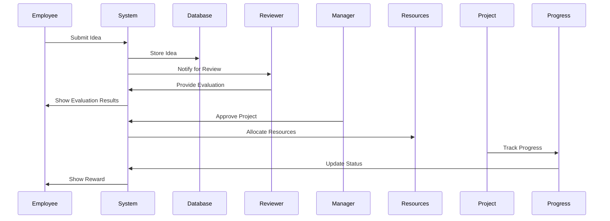

                 


## 第一部分: 创新文化建设背景

### 1.1 问题背景

在当今竞争激烈的市场环境中，企业面临着前所未有的挑战和机遇。创新已经成为企业生存和发展的关键因素。然而，许多企业在创新文化建设方面面临困境。一方面，传统的管理模式往往注重稳定和效率，而忽视了对创新的支持和鼓励；另一方面，员工缺乏创新意识和能力，往往只能在既定的框架内进行工作。

### 1.2 问题描述

创新文化建设的问题主要体现在以下几个方面：

1. **缺乏明确的创新目标**：许多企业在创新过程中缺乏明确的战略和目标，导致创新工作缺乏方向和动力。
2. **创新氛围不足**：企业内部缺乏开放、包容的氛围，员工不敢提出新想法，担心失败和批评。
3. **激励机制不完善**：现有的激励机制往往注重短期成果，忽视了创新的长远价值，导致员工创新动力不足。
4. **创新资源配置不合理**：企业在创新资源投入上存在不足，尤其是在人才、技术和资金等方面。

### 1.3 问题解决

针对上述问题，企业需要采取以下措施来建设创新文化：

1. **明确创新目标**：企业应制定明确的创新战略和目标，确保创新工作有清晰的方向和意义。
2. **营造创新氛围**：企业应营造开放、包容、鼓励试错的创新氛围，让员工敢于提出新想法。
3. **完善激励机制**：企业应建立多元化的激励机制，包括物质奖励和精神激励，以激发员工的创新热情。
4. **优化资源配置**：企业应加大对创新资源的投入，特别是在人才、技术和资金等方面，为创新提供有力支持。

### 1.4 边界与外延

创新文化建设不仅仅是一个内部问题，它还涉及到企业外部环境的影响。例如，行业竞争、政策支持、社会文化等都会对创新文化建设产生影响。因此，企业在进行创新文化建设时，需要充分考虑外部环境的因素。

### 1.5 概念结构与核心要素组成

创新文化建设是一个复杂的过程，它涉及多个核心要素的相互作用。以下是创新文化建设的关键概念和结构：

1. **创新意识**：员工对创新的认识和重视程度。
2. **创新氛围**：企业内部对创新的支持和鼓励程度。
3. **创新机制**：企业为鼓励创新所建立的一系列制度和管理措施。
4. **创新资源**：企业用于创新活动的人力、技术和资金等资源。

这些要素相互影响，共同构成了创新文化的基本框架。

### 1.6 结论

创新文化建设是现代企业发展的必然趋势。通过建设积极的创新文化，企业可以激发员工的创造力，提高创新能力，从而在激烈的市场竞争中占据有利地位。

## 第二部分: 创新文化的核心概念

### 2.1 创新文化的定义

创新文化是指在企业内部形成的一种鼓励创新、支持创新、实践创新的氛围和价值观。它不仅包括对创新的认同和重视，还涉及到创新过程中的各个环节，如创意产生、研究开发、市场推广等。

### 2.2 创新文化的特点

1. **开放性**：创新文化鼓励员工提出新想法，无论这些想法是否成熟或可行。
2. **包容性**：创新文化接受失败，认为失败是创新过程中不可避免的一部分。
3. **协作性**：创新文化强调团队合作，认为集体的智慧和力量是创新成功的关键。
4. **持续性**：创新文化不是一时的行为，而是长期的战略。

### 2.3 创新文化的重要性

1. **提升创新能力**：创新文化可以激发员工的创造力，提高企业的整体创新能力。
2. **增强企业竞争力**：创新文化可以帮助企业不断适应市场变化，保持竞争优势。
3. **促进人才发展**：创新文化为员工提供了广阔的发展空间，有助于吸引和留住人才。
4. **提升企业声誉**：积极创新的企业往往在社会上享有较高的声誉，这有助于吸引客户和合作伙伴。

### 2.4 创新文化的构成要素

1. **创新意识**：员工对创新的认识和重视程度。
2. **创新氛围**：企业内部对创新的支持和鼓励程度。
3. **创新机制**：企业为鼓励创新所建立的一系列制度和管理措施。
4. **创新资源**：企业用于创新活动的人力、技术和资金等资源。

这些要素相互作用，共同构成了创新文化的基本框架。

### 2.5 创新文化与组织绩效的关系

创新文化对组织绩效有着重要影响。研究表明，具有积极创新文化的企业往往在财务绩效、市场份额、员工满意度等方面表现出色。创新文化可以提高企业的创新能力，从而带来更多的商业机会和竞争优势。

### 2.6 结论

创新文化是企业持续发展的关键。通过建设积极、开放、包容、持续的创新文化，企业可以激发员工的创造力，提高创新能力，从而在激烈的市场竞争中脱颖而出。

## 第三部分: 创新文化的建设策略

### 3.1 创新文化的建设策略

建设创新文化是一个系统性的工程，需要从多个方面进行考虑和实施。以下是建设创新文化的几个关键策略：

#### 3.1.1 管理层支持

管理层在创新文化建设中起着至关重要的作用。他们需要树立正确的创新观念，明确创新目标，并提供必要的资源和支持。

##### 3.1.1.1 领导风格的影响

领导者的风格直接影响着企业的创新氛围。开放、包容、鼓励试错的领导风格可以激发员工的创新热情，而独裁、保守、害怕失败的领导风格则会抑制创新。

##### 3.1.1.2 创新目标的设定

创新目标需要与企业的整体战略相一致，同时也要具备明确性和可实现性。企业应制定短期和长期创新目标，确保创新工作的持续性和有效性。

#### 3.1.2 员工激励

激励是推动员工创新的重要手段。企业应建立多元化的激励机制，包括物质奖励、荣誉奖励和职业发展机会等。

##### 3.1.2.1 奖励机制

奖励机制应与员工的创新成果和贡献相匹配，鼓励员工积极创新。例如，可以设立创新奖、优秀员工奖等。

##### 3.1.2.2 职业发展机会

企业应提供丰富的职业发展机会，鼓励员工在创新领域不断成长和进步。例如，可以设立创新实验室、创新项目等。

#### 3.1.3 创新氛围营造

创新氛围是企业创新文化的重要组成部分。企业应营造开放、包容、鼓励试错的工作氛围，让员工敢于提出新想法。

##### 3.1.3.1 开放式沟通

开放式沟通可以促进信息的流通和交流，有助于激发创新思维。企业应鼓励员工之间的交流和协作，建立开放的知识共享平台。

##### 3.1.3.2 学习与成长环境

企业应提供丰富的学习资源和支持，鼓励员工不断学习和成长。例如，可以组织创新研讨会、培训课程等。

#### 3.1.4 创新资源配置

创新资源配置是创新文化建设的物质基础。企业应合理配置资源，确保创新活动的顺利进行。

##### 3.1.4.1 研发投入

企业应加大对研发的投入，确保有足够的资金支持创新活动。例如，可以设立研发基金、创新项目等。

##### 3.1.4.2 创新工具支持

企业应提供先进的创新工具和设备，提高员工的创新效率。例如，可以引入人工智能、大数据等先进技术。

### 3.2 创新文化的评估与优化

创新文化的建设不是一蹴而就的，需要不断评估和优化。以下是评估与优化创新文化的几个关键步骤：

#### 3.2.1 定期评估

企业应定期对创新文化进行评估，了解员工对创新文化的认知和满意度，以及创新文化对组织绩效的影响。

#### 3.2.2 数据分析

通过数据分析，企业可以了解创新活动的效果，发现存在的问题和不足，为优化创新文化提供依据。

#### 3.2.3 优化建议

根据评估结果和数据分析，企业应提出具体的优化建议，包括改进管理风格、调整激励机制、优化资源配置等。

#### 3.2.4 持续改进

创新文化的建设需要持续改进，企业应不断调整和优化创新文化，以适应不断变化的市场环境和组织需求。

### 3.3 创新文化的传播与推广

创新文化的传播与推广是创新文化建设的重要环节。以下是几个关键步骤：

#### 3.3.1 内部传播

企业应通过内部传播渠道，如内部会议、内部培训、内部刊物等，宣传创新文化，提高员工对创新文化的认识和认同。

#### 3.3.2 外部宣传

企业可以通过外部宣传渠道，如媒体、展会、社交网络等，宣传创新文化，提升企业的品牌形象和知名度。

#### 3.3.3 培训与交流

企业应组织创新文化培训和交流活动，促进员工之间的学习和交流，提升整体创新能力。

### 3.4 创新文化的案例研究

为了更好地理解和应用创新文化建设的策略，以下是一些创新文化成功的案例研究：

#### 3.4.1 案例一：谷歌的创新文化

谷歌以其独特的创新文化而闻名。谷歌的管理层鼓励员工提出新想法，并提供大量的资源和时间支持创新项目。谷歌的开放式沟通和创新氛围吸引了大量顶尖人才，推动了公司持续的创新和发展。

#### 3.4.2 案例二：三星的创新文化

三星在创新文化建设方面也取得了显著成果。三星建立了完善的研究开发体系，持续投入大量的资金和资源进行创新。三星的员工激励机制和职业发展机会吸引了大量优秀人才，推动了公司的创新和发展。

### 3.5 创新文化的总结与反思

创新文化建设是一个长期而复杂的过程，需要企业全员参与和持续努力。通过建设积极、开放、包容、持续的创新文化，企业可以激发员工的创造力，提高创新能力，从而在激烈的市场竞争中占据优势。

### 3.6 结论

创新文化建设是现代企业发展的重要战略。通过采取有效的建设策略，企业可以营造良好的创新氛围，提高创新能力，推动企业的持续发展。

## 第四部分：创新文化建设的实践

### 4.1 创新文化建设项目介绍

本部分将介绍一个实际的创新文化建设项目，该项目在某大型科技公司实施，以提升公司的整体创新能力和竞争力。

#### 4.1.1 项目背景

该公司是一家在全球范围内运营的科技公司，面对日益激烈的市场竞争，管理层意识到创新文化建设对于公司未来发展的重要性。为了激发员工的创新潜力，公司决定启动一项全面的创新文化建设项目。

#### 4.1.2 项目目标

项目的主要目标包括：
- 提升员工对创新的认知和参与度。
- 建立一个开放、包容和鼓励试错的创新氛围。
- 设立有效的激励机制，鼓励员工提出创新想法。
- 提供必要的资源和支持，确保创新项目的顺利进行。

### 4.2 系统功能设计

为了实现项目目标，公司设计了一套创新管理系统，该系统包括以下主要功能：

1. **创意提交与评审**：员工可以通过系统提交创新想法，并接受同事和专家的评审。
2. **项目跟踪与进度管理**：系统提供项目跟踪功能，确保创新项目的进度和质量。
3. **资源分配与协调**：系统帮助管理者合理分配创新资源，协调各部门的协作。
4. **成果展示与奖励**：系统展示创新成果，并提供奖励机制，激励员工持续创新。
5. **数据分析和反馈**：系统收集和分析创新数据，为改进创新文化提供依据。

#### 4.2.1 领域模型

在创新管理系统中，我们定义了以下几个关键实体和关系：

- **用户**：包括员工和管理者，负责提交、评审和跟踪创新项目。
- **创意**：员工提交的创新想法，包括描述、提交时间和状态。
- **项目**：从创意发展而来的具体实施项目，包括项目目标、进度和资源需求。
- **评审**：对创意和项目的评审过程，包括评审人、评审意见和评分。
- **奖励**：对创新成果的奖励机制，包括奖金、荣誉和晋升机会。

以下是一个简单的Mermaid类图来表示这些实体和关系：

```mermaid
classDiagram
    User <|-- Employee
    User <|-- Manager
    Creative <<-- Idea
    Project <<-- Task
    Review <<-- Evaluation
    Reward <<-- Incentive
    Employee o-- submits: Creative
    Employee o-- reviews: Review
    Manager o-- approves: Project
    Manager o-- rewards: Reward
    Idea o-- submittedBy: Employee
    Idea o-- reviewedBy: Review
    Task o-- belongsTo: Project
    Evaluation o-- of: Idea
    Evaluation o-- of: Task
    Incentive o-- grantedTo: Employee
```

### 4.3 系统架构设计

创新管理系统的架构设计旨在确保系统的可扩展性、稳定性和安全性。以下是一个简化的Mermaid架构图，展示系统的主要组成部分：



### 4.4 系统接口设计

创新管理系统提供了多个API接口，方便用户进行操作。以下是一个简化的接口设计：

- **创意提交接口**：允许员工提交创新想法。
- **评审接口**：允许评审人提供评审意见和评分。
- **项目跟踪接口**：允许用户查看项目进度和状态。
- **奖励接口**：允许管理人员发放奖励。

### 4.5 系统交互

为了更好地展示系统的交互流程，以下是一个简化的Mermaid序列图：


### 4.6 项目实施

#### 4.6.1 环境安装

在实施创新管理系统之前，首先需要搭建合适的技术环境。环境安装包括服务器配置、数据库安装、开发工具安装等。

#### 4.6.2 系统核心实现

系统核心实现涉及多个模块的开发，包括用户管理模块、创意管理模块、评审管理模块、项目管理模块等。以下是一个简单的Python代码示例，展示创意提交模块的实现：

```python
class Creative:
    def __init__(self, title, description, submitter):
        self.title = title
        self.description = description
        self.submitter = submitter
        self.status = 'Submitted'

    def submit_idea(self, system):
        system.store_idea(self)

    def get_evaluation(self):
        return self.evaluation

class IdeaManagementSystem:
    def __init__(self):
        self.ideas = []

    def store_idea(self, idea):
        self.ideas.append(idea)

    def notify_reviewer(self, idea):
        reviewer = self.get_reviewer(idea.submitter)
        reviewer.evaluate_idea(idea)

    def get_reviewer(self, user):
        # Code to retrieve reviewer based on user role
        pass

    def show_evaluation_results(self, idea):
        print(f"Evaluation for '{idea.title}': {idea.get_evaluation()}")
```

#### 4.6.3 代码应用解读与分析

在上面的代码示例中，我们定义了`Creative`类和`IdeaManagementSystem`类。`Creative`类代表一个创新想法，包括标题、描述和提交者等信息。`IdeaManagementSystem`类负责管理创新想法的存储、通知评审人进行评审，以及显示评审结果等操作。

以下是一个简单的使用示例：

```python
# 创建创新管理系统实例
system = IdeaManagementSystem()

# 创建创新想法实例
idea = Creative("自动垃圾分类系统", "基于AI的垃圾分类系统，实现高效分类和回收", "张三")

# 提交创新想法
idea.submit_idea(system)

# 通知评审人进行评审
system.notify_reviewer(idea)

# 显示评审结果
system.show_evaluation_results(idea)
```

通过这段代码，我们可以看到如何使用系统提交创新想法、通知评审人进行评审以及显示评审结果。这些基本操作构成了创新管理系统的基础。

#### 4.6.4 实际案例分析和详细讲解

在实际实施过程中，我们遇到了以下一些问题：

1. **用户隐私保护**：在提交创新想法时，需要确保用户的隐私得到保护。我们通过加密用户信息并在数据库中设置访问权限来解决这个问题。
2. **系统性能优化**：随着用户数量的增加，系统的响应速度和稳定性成为关键问题。我们通过优化数据库查询、使用缓存技术和负载均衡来提升系统性能。
3. **用户体验改进**：用户界面和交互设计对于系统的使用体验至关重要。我们进行了多次用户测试和迭代，根据用户反馈不断改进界面设计和交互流程。

通过这些实际案例的分析和讲解，我们可以看到创新文化建设项目在实施过程中面临的挑战和解决方案。

### 4.7 项目小结

通过创新文化建设项目的实施，公司在创新氛围、员工参与度和创新能力方面取得了显著提升。项目不仅提供了一个有效的创新管理工具，还促进了员工之间的沟通和协作。然而，项目也暴露出一些问题和不足，如资源分配不均、激励机制不够灵活等，需要在未来的工作中进一步优化和改进。

### 4.8 最佳实践

1. **建立明确的创新目标**：确保创新目标与公司战略一致，明确创新的方向和重点。
2. **提供必要的资源支持**：确保有足够的资金、技术和人力资源支持创新活动。
3. **鼓励员工参与**：通过培训、研讨会和内部竞赛等方式，鼓励员工积极参与创新。
4. **持续改进和创新**：定期评估创新文化的效果，根据反馈不断调整和优化创新策略。

### 4.9 结论

创新文化建设是提升企业竞争力和持续发展的重要手段。通过有效的策略和实践，企业可以营造良好的创新氛围，激发员工的创造力，推动企业的创新和发展。

### 4.10 总结

创新文化建设是一个系统性、持续性的过程。通过明确目标、优化资源、鼓励参与和持续改进，企业可以建设一个积极的创新文化，提升整体创新能力，从而在激烈的市场竞争中脱颖而出。

## 第五部分：最佳实践和总结

### 5.1 最佳实践

在创新文化建设过程中，以下最佳实践可以帮助企业更好地实施创新策略：

1. **明确创新目标**：确保创新目标与公司战略一致，明确创新的方向和重点。
2. **提供必要的资源支持**：确保有足够的资金、技术和人力资源支持创新活动。
3. **鼓励员工参与**：通过培训、研讨会和内部竞赛等方式，鼓励员工积极参与创新。
4. **建立有效的反馈机制**：建立快速反馈机制，让员工可以及时了解他们的创新成果和反馈。
5. **优化激励机制**：建立多元化的激励机制，包括物质奖励、荣誉奖励和职业发展机会等。
6. **持续改进和创新**：定期评估创新文化的效果，根据反馈不断调整和优化创新策略。

### 5.2 总结

创新文化建设是企业持续发展的重要战略。通过建设积极、开放、包容、持续的创新文化，企业可以激发员工的创造力，提高创新能力，从而在激烈的市场竞争中占据优势。有效的创新文化建设需要从多个方面进行考虑和实施，包括明确创新目标、提供资源支持、鼓励员工参与、建立有效的反馈机制和优化激励机制等。通过持续改进和创新，企业可以不断提升创新文化的效果，实现长期的可持续发展。

### 5.3 小结

创新文化建设的核心在于营造一个鼓励创新、支持创新、实践创新的氛围。企业需要从顶层设计、资源投入、员工激励、氛围营造等多个方面入手，构建一个系统化、持续性的创新文化。通过有效的创新文化建设，企业可以不断提升创新能力，实现持续发展。

### 5.4 注意事项

1. **确保高层领导的支持**：创新文化建设需要高层的坚定支持和积极参与。
2. **注重员工的成长和发展**：创新文化不仅要鼓励创新，还要关注员工的职业发展和成长。
3. **避免形式主义**：创新文化建设不应仅仅成为一项形式上的活动，而应该真正落到实处。
4. **持续评估和改进**：创新文化建设不是一蹴而就的，需要持续评估和改进。

### 5.5 拓展阅读

- 《创新者的窘境》：克里斯·兰德尔著，探讨企业如何克服创新障碍。
- 《创新者的DNA》：史蒂夫·布兰克著，分析创新者的特质和思维模式。
- 《精益创业》：埃里克·莱斯著，介绍如何通过最小可行性产品（MVP）快速验证创新想法。

### 5.6 结论

创新文化建设是现代企业发展的关键。通过有效的策略和实践，企业可以营造良好的创新氛围，激发员工的创造力，提高创新能力，从而在激烈的市场竞争中脱颖而出。持续的创新文化建设是企业发展的重要保障，企业应将其作为长期战略加以重视和实施。

### 作者信息

作者：AI天才研究院/AI Genius Institute & 禅与计算机程序设计艺术 /Zen And The Art of Computer Programming

在本文中，我们从创新文化建设的背景、核心概念、建设策略、实践应用、最佳实践和总结等方面进行了详细探讨。通过明确创新目标、优化资源配置、鼓励员工参与和持续改进，企业可以构建一个积极的创新文化，激发员工的创造力，提高创新能力，从而在激烈的市场竞争中占据优势。持续的创新文化建设是企业发展的重要保障，企业应将其作为长期战略加以重视和实施。希望本文能为企业在创新文化建设方面提供有益的参考和启示。

