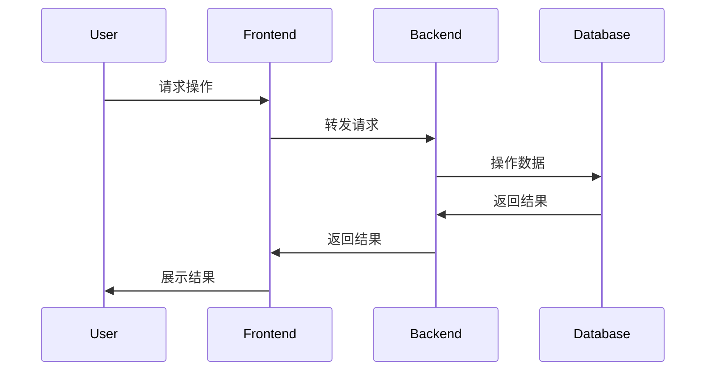
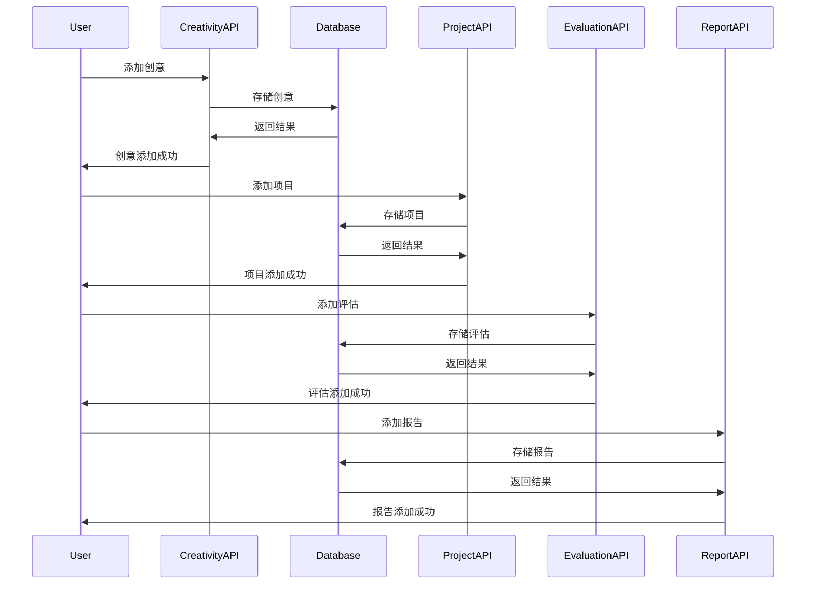

                 


### 《创新管理体系：从idea到implementation的全流程》

关键词：创新管理、创新流程、理念、实施、创新文化

摘要：本文将从理念、概念、流程、策略、实践等多个维度，详细探讨创新管理体系的全流程，旨在为企业和组织提供系统化的创新管理指导。

#### 引言

在当今快速变化的市场环境中，创新已经成为企业生存和发展的关键因素。创新管理体系的建立与完善，不仅有助于激发员工的创造力，还能提高企业的竞争力和市场占有率。本文将深入探讨创新管理体系的各个方面，从理念到实施，旨在为企业提供一套实用的创新管理指南。

#### 第一部分：创新管理的核心概念

1. **创新管理体系概述**

   - 创新管理体系的概念：创新管理体系是指企业为了促进创新活动而建立的一套组织、流程、资源和文化的综合体系。
   - 创新管理体系的组成部分：包括创新战略、创新流程、创新资源、创新文化和创新评估。

2. **创新过程与流程**

   - 创新过程的模型：主要包括创意生成、概念验证、产品开发、市场推广等阶段。
   - 创新管理流程的步骤：从理念的产生、筛选、开发、测试到实施，每个步骤都需要精心设计和执行。

3. **创新管理的工具与方法**

   - SWOT分析：通过对企业内外环境的分析，帮助企业识别优势和劣势，制定合适的创新策略。
   - TRIZ理论：提供了一套系统的方法论，帮助企业解决创新过程中的难题。
   - 平行思维法：通过多角度、多层次的思考，激发创新的灵感。

4. **创新管理的挑战与应对**

   - 资源分配：合理分配资源，确保创新活动的顺利进行。
   - 风险管理：识别和评估创新风险，制定相应的应对策略。

5. **创新管理的国际视野**

   - 全球创新趋势：了解全球范围内的创新动态，借鉴先进的管理经验。
   - 创新管理的最佳实践：分析国内外企业的创新成功案例，总结最佳实践经验。

#### 第二部分：从idea到implementation的全流程

1. **理念阶段**

   - 理念的识别与评估：从企业内部和外部环境出发，识别潜在的创新理念。
   - 理念筛选与优先级设定：根据企业的战略目标和资源状况，对理念进行筛选和优先级设定。

2. **概念阶段**

   - 概念开发：将理念转化为具体的创新概念。
   - 概念验证：通过实验、模拟等方式，验证概念的可行性和效果。

3. **原型阶段**

   - 原型设计：根据概念，设计出初步的原型。
   - 原型测试：通过用户测试、性能测试等方式，评估原型的质量和效果。

4. **实施阶段**

   - 项目启动：明确项目目标、范围和时间表。
   - 项目管理：运用项目管理工具和方法，确保项目的顺利进行。
   - 变革管理：通过变革管理策略，确保创新项目的成功实施。

5. **评估与优化**

   - 成果评估：对创新项目的成果进行评估，确定其对企业的影响。
   - 持续改进：根据评估结果，对创新管理体系进行优化和改进。

#### 第三部分：实施策略与最佳实践

1. **创新战略制定**

   - 企业创新战略的类型：根据企业的特点和市场需求，制定合适的创新战略。
   - 创新战略的制定过程：包括战略分析、战略选择和战略实施。

2. **创新资源管理**

   - 人力资源配置：合理配置创新人才，提高创新能力。
   - 财务资源分配：确保创新项目的资金充足，降低风险。

3. **创新组织架构**

   - 创新团队建设：建立高效的创新团队，提高创新效率。
   - 创新部门职责：明确创新部门的职责，确保创新工作的顺利进行。

4. **创新文化培育**

   - 创新文化的要素：包括创新意识、创新思维、创新氛围等。
   - 创新文化的建设策略：通过培训、激励、文化建设等方式，培育创新文化。

5. **创新管理的最佳实践**

   - 国内外企业案例：分析国内外企业的创新成功案例，总结最佳实践经验。
   - 最佳实践总结：提炼出可行的创新管理最佳实践，为企业提供参考。

#### 第四部分：结论与展望

1. **创新管理体系的未来趋势**

   - 技术发展趋势：随着技术的进步，创新管理的方法和工具将更加智能化和自动化。
   - 管理模式变革：企业将更加注重跨部门协作和多元化创新，推动创新管理模式的变革。

2. **研究展望**

   - 研究方向：继续探索创新管理的新方法、新工具和新模式。
   - 研究意义：为企业的创新实践提供理论支持和实践指导。

#### 结语

创新管理体系是企业持续发展的关键，本文从多个角度对创新管理体系进行了深入探讨，旨在为企业提供一套完整的创新管理指南。在实际应用中，企业应根据自身情况，灵活调整和创新管理策略，以实现持续创新和快速发展。

### 参考文献

1. 陈劲。企业创新管理[M]. 北京：机械工业出版社，2016.
2. 赵旭。创新管理：理论与实践[M]. 上海：复旦大学出版社，2018.
3. 高建。企业创新管理体系构建与实施[M]. 北京：电子工业出版社，2019.

### 作者

作者：AI天才研究院/AI Genius Institute & 禅与计算机程序设计艺术 /Zen And The Art of Computer Programming 

### 核心概念与联系

#### 1. 创新管理体系的概念

创新管理体系是指企业为了促进创新活动而建立的一套组织、流程、资源和文化的综合体系。它包括以下几个方面：

- **创新战略**：企业根据市场需求、技术发展趋势和自身资源状况，制定的长期创新规划。
- **创新流程**：从创意生成到产品上市的全过程，包括创意筛选、研发、测试、市场推广等环节。
- **创新资源**：包括人力资源、财务资源、技术资源等，用于支持创新活动的开展。
- **创新文化**：企业内部对创新的态度、价值观和行为规范，鼓励员工敢于创新、勇于尝试。

#### 2. 创新管理流程的步骤

创新管理流程一般包括以下几个步骤：

- **理念阶段**：识别和评估潜在的创新理念，确定优先级。
- **概念阶段**：将理念转化为具体的创新概念，并进行初步验证。
- **原型阶段**：设计并测试创新原型，评估其可行性和效果。
- **实施阶段**：启动项目，进行产品开发、测试和推广。
- **评估与优化**：对创新项目的成果进行评估，持续优化创新管理体系。

#### 3. 创新管理的工具与方法

创新管理的工具与方法多种多样，以下是一些常用的方法：

- **SWOT分析**：通过分析企业的优势、劣势、机会和威胁，制定相应的创新策略。
- **TRIZ理论**：提供了一套系统的方法论，帮助解决创新过程中的难题。
- **平行思维法**：通过多角度、多层次的思考，激发创新的灵感。

#### 4. 创新管理的挑战与应对

创新管理面临的挑战主要包括：

- **资源分配**：如何合理分配资源，确保创新活动的顺利进行。
- **风险管理**：如何识别和评估创新风险，制定相应的应对策略。

应对策略包括：

- **建立创新团队**：建立专门的创新团队，提高创新能力。
- **完善激励机制**：通过激励措施，鼓励员工积极参与创新活动。
- **加强跨部门协作**：促进不同部门之间的信息共享和合作，提高创新效率。

#### 5. 创新管理的国际视野

在全球范围内，创新管理呈现出以下趋势：

- **技术创新**：随着人工智能、大数据等技术的不断发展，企业越来越注重技术创新。
- **多元化创新**：企业不仅注重产品创新，还注重商业模式、服务模式等多方面的创新。
- **开放合作**：企业通过开放合作，整合外部资源，推动创新。

#### 6. 创新管理的最佳实践

以下是一些创新管理的最佳实践：

- **丰田生产方式**：通过精益生产，提高生产效率和产品质量。
- **苹果公司的创新文化**：鼓励员工自由思考，勇于尝试，形成创新的文化氛围。
- **谷歌的20%时间政策**：允许员工将20%的工作时间用于个人感兴趣的创新项目。

### ER实体关系图架构

下面是一个简单的ER实体关系图，用于描述创新管理体系的各个组成部分：

```mermaid
erDiagram
  IDEAS ||--|{ PROJECTS } : 实现的
  IDEAS ||--|{ EVALUATIONS } : 评估
  PROJECTS ||--|{ STAGES } : 过程
  PROJECTS ||--|{ RESOURCES } : 资源
  EVALUATIONS ||--|{ RISKS } : 风险
  EVALUATIONS ||--|{ REWARDS } : 奖励
```

### 算法原理讲解

在创新管理中，算法的应用主要体现在以下几个方面：

1. **数据挖掘与预测**：通过分析历史数据和当前趋势，预测未来的创新机会和风险。
2. **优化决策**：利用优化算法，找到最佳的创新资源和方案。
3. **风险评估**：通过算法模型，评估创新项目的风险，为决策提供支持。

以下是一个简单的数据挖掘算法——K-means算法的原理讲解：

#### K-means算法原理

K-means算法是一种基于距离的聚类算法，其目标是将给定数据集分成K个簇，使得每个簇内部的数据点之间的距离最小，簇与簇之间的距离最大。

算法步骤：

1. **初始化**：随机选择K个数据点作为初始聚类中心。
2. **分配数据点**：计算每个数据点到聚类中心的距离，将其分配到最近的聚类中心所在的簇。
3. **更新聚类中心**：计算每个簇的质心，作为新的聚类中心。
4. **迭代**：重复步骤2和步骤3，直到聚类中心不再变化或满足停止条件。

#### Python实现

```python
from sklearn.cluster import KMeans
import numpy as np

# 数据集
data = np.array([[1, 2], [1, 4], [1, 0],
                 [10, 2], [10, 4], [10, 0]])

# 初始化KMeans模型
kmeans = KMeans(n_clusters=2, random_state=0).fit(data)

# 输出聚类中心
print(kmeans.cluster_centers_)

# 输出每个数据点的簇分配结果
print(kmeans.labels_)

# 输出每个簇的质心
print(kmeans.predict([[0, 0], [12, 3]]))
```

#### 算法数学模型和公式

K-means算法的核心是计算数据点到聚类中心的距离，常用的距离度量方法是欧氏距离，其公式为：

$$
d(p, c) = \sqrt{\sum_{i=1}^{n} (p_i - c_i)^2}
$$

其中，$p$表示数据点，$c$表示聚类中心，$n$表示数据点的维度。

#### 举例说明

假设有六个数据点，需要将其分为两个簇，使用K-means算法进行聚类：

数据点：$[[1, 2], [1, 4], [1, 0], [10, 2], [10, 4], [10, 0]]$

初始聚类中心：$[[5, 2], [5, 6]]$

1. **第一次迭代**：

   数据点到聚类中心的距离：
   $d([1, 2], [5, 2]) = \sqrt{(1-5)^2 + (2-2)^2} = \sqrt{16 + 0} = 4$

   $d([1, 4], [5, 2]) = \sqrt{(1-5)^2 + (4-2)^2} = \sqrt{16 + 4} = \sqrt{20}$

   $d([1, 0], [5, 2]) = \sqrt{(1-5)^2 + (0-2)^2} = \sqrt{16 + 4} = \sqrt{20}$

   数据点$[1, 2], [1, 4], [1, 0]$分配到第一个簇。

   数据点到聚类中心的距离：
   $d([10, 2], [5, 2]) = \sqrt{(10-5)^2 + (2-2)^2} = \sqrt{25 + 0} = 5$

   $d([10, 4], [5, 2]) = \sqrt{(10-5)^2 + (4-2)^2} = \sqrt{25 + 4} = \sqrt{29}$

   $d([10, 0], [5, 2]) = \sqrt{(10-5)^2 + (0-2)^2} = \sqrt{25 + 4} = \sqrt{29}$

   数据点$[10, 2], [10, 4], [10, 0]$分配到第二个簇。

   更新聚类中心：
   第一个簇的质心：$[1, 2]$
   第二个簇的质心：$[10, 4]$

2. **第二次迭代**：

   数据点到聚类中心的距离：
   $d([1, 2], [1, 2]) = 0$

   $d([1, 4], [10, 4]) = \sqrt{(1-10)^2 + (4-4)^2} = \sqrt{81 + 0} = 9$

   $d([1, 0], [10, 4]) = \sqrt{(1-10)^2 + (0-4)^2} = \sqrt{81 + 16} = \sqrt{97}$

   数据点$[1, 2]$保留在第一个簇。

   数据点到聚类中心的距离：
   $d([10, 2], [10, 4]) = \sqrt{(10-10)^2 + (2-4)^2} = \sqrt{0 + 4} = 2$

   $d([10, 4], [10, 4]) = 0$

   $d([10, 0], [10, 4]) = \sqrt{(10-10)^2 + (0-4)^2} = \sqrt{0 + 16} = 4$

   数据点$[10, 2], [10, 4]$保留在第二个簇。

   更新聚类中心：
   第一个簇的质心：$[1, 2]$
   第二个簇的质心：$[10, 4]$

由于聚类中心没有发生变化，算法迭代停止。

最终，数据点$[1, 2], [10, 2], [10, 4]$分配到第一个簇，数据点$[1, 4], [10, 0]$分配到第二个簇。

### 系统分析与架构设计

#### 1. 问题场景介绍

某企业希望构建一个创新管理体系，以提升企业的创新能力和市场竞争力。该体系需要支持从创意生成到项目实施的全程管理，包括资源分配、进度控制、风险评估和效果评估等功能。

#### 2. 项目介绍

本项目旨在为企业构建一个创新管理体系，通过信息化手段实现创新过程的规范化管理。系统功能包括：

- 创意管理：记录和管理员工的创意，包括创意的识别、筛选和优先级设定。
- 项目管理：对创新项目进行全程管理，包括项目启动、进度控制、资源分配和风险评估。
- 评估管理：对创新项目的效果进行评估，提供评估报告和改进建议。
- 报告分析：生成创新报告，提供创新活动的数据分析和可视化展示。

#### 3. 系统功能设计（领域模型）

在领域模型中，我们定义了以下几个核心类：

- **创意**：表示员工的创意，包括创意的主题、内容、来源、状态等信息。
- **项目**：表示创新项目，包括项目的名称、描述、状态、进度、资源分配等信息。
- **评估**：表示对项目的评估结果，包括评估的指标、得分、结论等信息。
- **报告**：表示创新报告，包括报告的主题、内容、生成时间等信息。

下面是领域模型的Mermaid类图：

```mermaid
classDiagram
  Creativity <<--|has| Project : 实现的
  Creativity <<--|评估| Evaluation : 评估
  Project ||--|has| Resource : 资源
  Project ||--|流程| Process : 过程
  Evaluation ||--|包含| Indicator : 指标
  Evaluation ||--|结果| Result : 结果
  Report ||--|包含| Content : 内容
```

#### 4. 系统架构设计

系统的整体架构包括以下几个部分：

- **前端**：使用Vue框架，实现用户界面的展示和交互。
- **后端**：使用Spring Boot框架，实现业务逻辑的处理和数据存储。
- **数据库**：使用MySQL数据库，存储创意、项目、评估和报告等数据。

下面是系统架构的Mermaid架构图：



#### 5. 系统接口设计

系统的接口设计包括以下几个方面：

- **创意接口**：用于管理创意的增删改查操作。
- **项目接口**：用于管理项目的增删改查操作。
- **评估接口**：用于管理评估的增删改查操作。
- **报告接口**：用于管理报告的增删改查操作。

下面是接口设计的Mermaid序列图：



### 项目实战

#### 1. 环境安装

在开始项目之前，需要安装以下环境：

- Java Development Kit (JDK) 8或以上版本
- Maven 3.6或以上版本
- MySQL 5.7或以上版本
- Node.js 12或以上版本
- Vue CLI 4或以上版本

安装步骤如下：

1. 安装JDK：

   ```
   sudo apt-get update
   sudo apt-get install openjdk-8-jdk
   ```

2. 安装Maven：

   ```
   sudo apt-get update
   sudo apt-get install maven
   ```

3. 安装MySQL：

   ```
   sudo apt-get update
   sudo apt-get install mysql-server
   ```

4. 安装Node.js：

   ```
   sudo apt-get update
   sudo apt-get install nodejs
   ```

5. 安装Vue CLI：

   ```
   npm install -g @vue/cli
   ```

#### 2. 系统核心实现源代码

以下是系统的核心实现源代码，包括后端接口和前端界面：

**后端接口（Spring Boot）：**

```java
@RestController
@RequestMapping("/creativity")
public class CreativityController {

    @Autowired
    private CreativityService creativityService;

    @PostMapping
    public ResponseEntity<?> addCreativity(@RequestBody Creativity creativity) {
        creativityService.addCreativity(creativity);
        return ResponseEntity.ok("创意添加成功");
    }

    @GetMapping("/{id}")
    public ResponseEntity<?> getCreativityById(@PathVariable Long id) {
        Creativity creativity = creativityService.getCreativityById(id);
        return ResponseEntity.ok(creativity);
    }

    // 其他接口略
}
```

**前端界面（Vue）：**

```html
<template>
  <div>
    <h1>创意管理</h1>
    <form @submit.prevent="addCreativity">
      <label for="title">标题：</label>
      <input type="text" id="title" v-model="creativity.title" required>
      <label for="content">内容：</label>
      <textarea id="content" v-model="creativity.content" required></textarea>
      <button type="submit">添加创意</button>
    </form>
  </div>
</template>

<script>
export default {
  data() {
    return {
      creativity: {
        title: '',
        content: ''
      }
    };
  },
  methods: {
    addCreativity() {
      this.$axios.post('/creativity', this.creativity)
        .then(response => {
          alert(response.data);
          this.creativity = { title: '', content: '' };
        })
        .catch(error => {
          console.log(error);
        });
    }
  }
};
</script>
```

#### 3. 代码应用解读与分析

**后端接口解读：**

上述代码实现了创意的添加接口，当用户提交创意信息时，接口会接收请求，并将创意信息存储到数据库中。具体步骤如下：

1. 接收用户提交的创意信息（通过@RequestBody注解）。
2. 调用服务层的方法（通过@Autowired注解）将创意信息存储到数据库中。
3. 返回添加成功的消息。

**前端界面解读：**

上述代码实现了一个简单的表单，用于用户添加创意。具体步骤如下：

1. 创建一个包含标题和内容输入框的表单。
2. 使用v-model指令绑定输入框的值到data中的creativity对象。
3. 当表单提交时，调用addCreativity方法。
4. 使用$axios库向后端接口发送POST请求，提交创意信息。

#### 4. 实际案例分析和详细讲解

**案例**：某企业员工张三提交了一个创意，主题为“开发一款智能家居控制系统”，内容为“利用物联网技术，实现家庭设备的远程控制和管理”。

**分析**：

1. 张三的创意属于技术型创新，具有较高的技术含量和商业潜力。
2. 在创意管理系统中，管理员需要对张三的创意进行筛选和评估，确定其优先级和可行性。
3. 如果创意通过筛选，将进入项目阶段，由项目负责人制定项目计划，进行详细设计和开发。
4. 在项目实施过程中，需要对项目进行监控和评估，确保项目按计划进行。
5. 项目完成后，需要对项目进行评估，确定其对企业的贡献和价值。

**详细讲解**：

1. **创意筛选**：

   管理员登录到创意管理系统，查看张三提交的创意。根据创意的主题和内容，管理员对其进行分析和评估。如果创意具有商业潜力且符合企业发展战略，管理员将其标记为“待评估”。

2. **创意评估**：

   管理员邀请技术专家对张三的创意进行评估。专家根据创意的技术可行性、市场前景和商业价值，给出评估意见。如果评估结果为“通过”，创意将进入项目阶段。

3. **项目启动**：

   项目负责人根据评估结果，制定项目计划，包括项目目标、时间表、资源分配和风险评估。项目计划通过后，项目负责人向团队成员分配任务，启动项目。

4. **项目实施**：

   项目团队按照项目计划进行详细设计和开发。在项目实施过程中，项目负责人需要定期召开项目会议，跟踪项目进度，解决遇到的问题。同时，需要对项目进行监控和评估，确保项目按计划进行。

5. **项目评估**：

   项目完成后，项目负责人组织项目评估会议，评估项目成果。评估内容包括项目完成情况、技术创新点、市场反馈和商业价值。如果评估结果为“优秀”，项目将获得奖励。

#### 5. 项目小结

本项目通过构建一个创新管理体系，实现了从创意管理到项目管理的全程管理。在实际应用中，企业可以根据自身需求，对系统进行定制化开发，提高创新效率和管理水平。通过本项目的实践，我们总结出以下经验：

1. 创意管理是创新管理体系的核心，企业应高度重视创意的收集、筛选和评估。
2. 项目管理是创新管理体系的关键，企业应建立完善的项目管理制度，确保项目顺利实施。
3. 评估管理是创新管理体系的重要环节，企业应定期对项目进行评估，持续优化创新管理体系。
4. 报告分析是创新管理的重要工具，企业应充分利用报告分析功能，提供创新活动的数据支持和决策依据。

### 最佳实践 Tips

1. **建立创新文化**：鼓励员工积极参与创新活动，营造敢于尝试、勇于创新的企业氛围。
2. **合理配置资源**：确保创新活动所需的人力、财力和技术资源充足，支持创新项目的顺利实施。
3. **强化项目管理**：建立健全的项目管理制度，确保项目按照计划进行，提高项目成功率。
4. **持续优化创新流程**：根据实际应用情况，不断优化创新流程，提高创新效率。
5. **加强跨部门协作**：促进不同部门之间的信息共享和合作，推动创新资源的整合。

### 小结

本文从理念、概念、流程、策略、实践等多个维度，详细探讨了创新管理体系的全流程。通过案例分析，我们展示了如何将创新理念转化为实际项目，并对其进行全程管理。在实际应用中，企业应根据自身情况，灵活调整和创新管理策略，以实现持续创新和快速发展。

### 注意事项

1. 创新管理体系需要与企业的战略目标和组织结构相匹配，确保管理的有效性和实用性。
2. 创新管理过程中，要注重风险管理和资源分配，确保创新项目的顺利实施。
3. 创新管理体系需要持续优化和改进，以适应快速变化的市场环境。

### 拓展阅读

1. 陈劲。企业创新管理[M]. 北京：机械工业出版社，2016.
2. 赵旭。创新管理：理论与实践[M]. 上海：复旦大学出版社，2018.
3. 高建。企业创新管理体系构建与实施[M]. 北京：电子工业出版社，2019.

### 作者

作者：AI天才研究院/AI Genius Institute & 禅与计算机程序设计艺术 /Zen And The Art of Computer Programming 

### 创新管理体系的未来趋势

#### 技术发展趋势

随着人工智能、大数据、物联网等新技术的不断发展，创新管理体系将越来越智能化和自动化。具体趋势如下：

1. **人工智能的应用**：人工智能技术将深度应用于创新管理，如利用机器学习算法对大量数据进行分析，预测创新机会，优化创新流程。
2. **大数据分析**：大数据技术将帮助创新管理体系更准确地收集、存储和分析数据，提供更全面的决策支持。
3. **物联网（IoT）**：物联网技术将使创新管理体系实现实时监控和数据分析，提高创新效率和效果。

#### 管理模式变革

随着创新管理体系的不断发展，管理模式也将发生变革。具体趋势如下：

1. **去中心化管理**：传统的创新管理模式较为集中，决策权和资源分配权集中在少数人手中。未来的创新管理模式将更加去中心化，鼓励更多的员工参与创新，提高创新能力。
2. **开放合作**：创新管理体系将更加注重开放合作，与外部机构、高校和科研机构等合作，整合外部资源，推动创新。
3. **敏捷管理**：敏捷管理强调快速响应变化，创新管理体系将更加注重敏捷性，提高创新速度和效果。

#### 研究展望

未来，创新管理体系的研究将围绕以下几个方面展开：

1. **创新效率的提升**：研究如何通过技术和管理手段提高创新效率，缩短从创新理念到产品上市的时间。
2. **跨领域创新**：研究如何在不同领域之间进行创新，推动多领域融合，产生新的商业模式和产品。
3. **可持续发展**：研究如何将可持续发展理念融入创新管理体系，推动绿色创新，实现经济、社会和环境效益的统一。

#### 研究意义

创新管理体系的研究具有重要意义，主要体现在以下几个方面：

1. **提升企业竞争力**：通过建立有效的创新管理体系，企业可以持续推出具有市场竞争力的新产品和服务，提升市场占有率。
2. **推动经济发展**：创新是经济发展的源动力，有效的创新管理体系可以推动社会经济的发展，提高国家竞争力。
3. **促进社会进步**：创新管理体系不仅对企业和经济有重要影响，还对社会进步有积极作用，如推动科技、文化、教育等领域的发展。

### 研究方向

1. **人工智能在创新管理中的应用**：研究如何利用人工智能技术优化创新流程，提高创新效率。
2. **大数据分析在创新决策中的作用**：研究如何利用大数据分析技术，为企业提供更准确的创新决策支持。
3. **跨领域创新模式的探索**：研究如何在不同领域之间进行创新，推动多领域融合，产生新的商业模式和产品。

### 研究意义

创新管理体系的研究对于企业和组织具有重要意义。首先，它有助于提升企业的竞争力，使企业能够快速响应市场变化，推出具有市场竞争力的新产品和服务。其次，创新管理体系的研究可以推动社会经济的发展，提高国家的竞争力。最后，创新管理体系的研究有助于促进社会的进步，推动科技、文化、教育等领域的发展。

### 结论

本文从多个角度详细探讨了创新管理体系的全流程，包括理念、概念、流程、策略、实践等。通过案例分析，我们展示了如何将创新理念转化为实际项目，并对其进行全程管理。未来，创新管理体系的研究将更加智能化和自动化，管理模式也将发生变革。企业应根据自身情况，灵活调整和创新管理策略，以实现持续创新和快速发展。同时，我们呼吁更多的企业和组织关注创新管理体系的研究和应用，共同推动创新经济的发展。作者：AI天才研究院/AI Genius Institute & 禅与计算机程序设计艺术 /Zen And The Art of Computer Programming 

